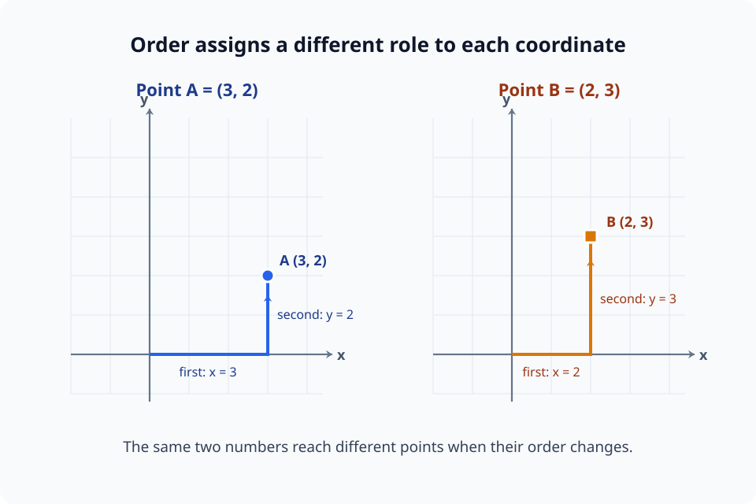
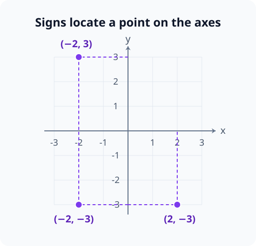
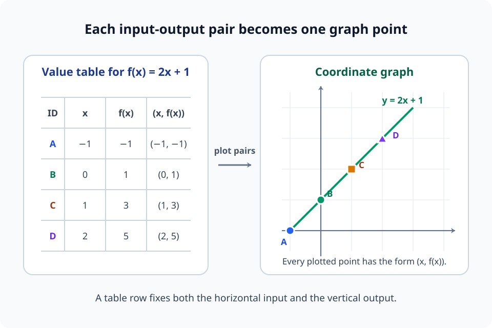
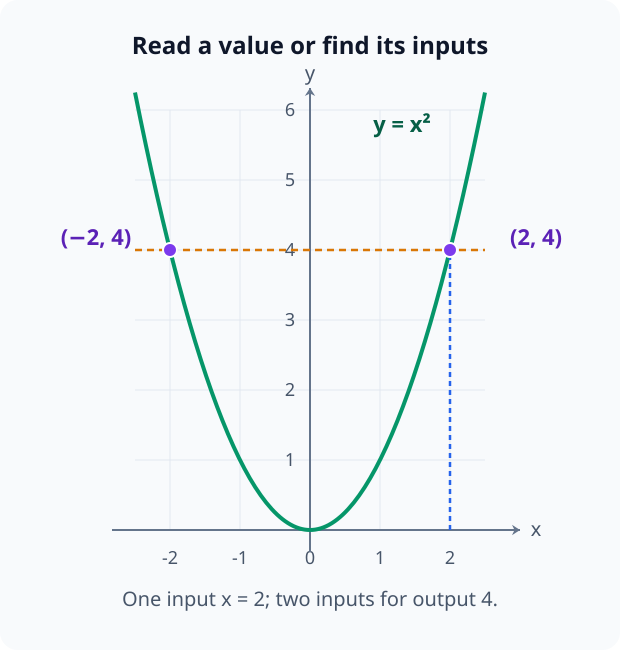
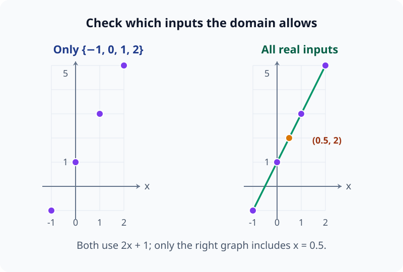
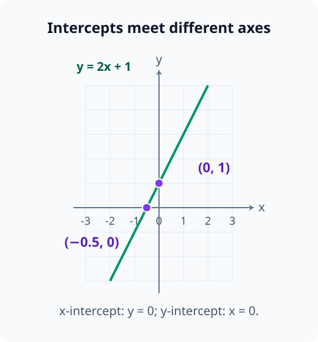
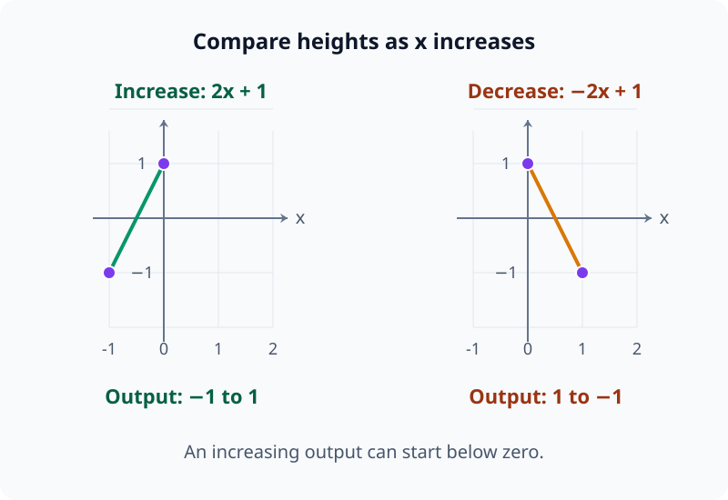

# M00-04. 좌표와 그래프

## 이 단원이 필요한 이유

논문은 함수의 변화를 표보다 그래프로 자주 보여준다. 학습 step에 따른 loss, 입력 크기에 따른 activation, 데이터 양에 따른 성능이 모두 그래프로 나타난다. 그래프를 읽으려면 축이 무엇을 뜻하는지, 점 하나가 어떤 두 값을 묶는지, 선이 관측값인지 보간한 결과인지 구분해야 한다.

함수의 그래프가 휘어 있다는 사실만으로 입력 공간이나 표현 공간이 휘었다고 결론 내릴 수도 없다. 그래프는 함수의 입력과 출력을 한 좌표평면에 나타낸 대상이다. 공간의 기하를 주장하려면 거리나 곡률 같은 구조를 따로 정의해야 한다.

## 학습 목표

이 단원을 마치면 다음을 할 수 있다.

- 순서쌍 $(x,y)$를 좌표평면의 점으로 나타낼 수 있다.
- 함수 $y=f(x)$의 그래프를 $(x,f(x))$인 점들의 모임으로 설명할 수 있다.
- 표에서 좌표를 만들고 간단한 함수의 그래프를 그릴 수 있다.
- 그래프에서 함수값, 절편과 증가·감소 경향을 읽을 수 있다.
- 축 눈금과 선 연결 방식이 그래프 해석에 미치는 영향을 판단할 수 있다.

## 선수지식 확인

- 선수 단원: [M00-02 식, 등식과 방정식](M00-02-expressions-equalities-equations.md)
- 선수 단원: [M00-03 함수의 입력과 출력](M00-03-functions-input-output.md)

다음 질문에 답할 수 있는지 확인한다.

1. $y=2x+1$에서 입력과 출력을 구분할 수 있는가?
2. $f(x)=x^2$일 때 $f(-2)$와 $f(2)$를 계산할 수 있는가?

두 번째 질문의 답은 모두 $4$이다. 이 두 입력은 그래프에서 서로 다른 두 점을 만든다.

## 기호와 용어

| 기호·용어 | Common spoken reading | 의미 | 범위 |
|---|---|---|---|
| $(x,y)$ | `the ordered pair x comma y` | 가로 좌표가 $x$, 세로 좌표가 $y$인 점 | 순서가 바뀌면 다른 점일 수 있음 |
| $x$축 | `the x-axis` | 가로 방향의 기준선 | 보통 입력을 놓음 |
| $y$축 | `the y-axis` | 세로 방향의 기준선 | 보통 출력을 놓음 |
| 원점 | `origin` | 두 축이 만나는 점 | $(0,0)$ |
| 그래프 | `graph` | 입력과 출력의 대응을 점으로 나타낸 것 | 이 단원에서는 함수 그래프 |
| 절편 | `intercept` | 그래프가 좌표축과 만나는 위치 | $x$절편 또는 $y$절편 |

## 핵심 개념 1. 순서쌍은 두 값의 역할을 보존한다

### 좌표평면

좌표평면은 서로 수직인 두 수직선으로 위치를 나타낸다. 가로축을 $x$축, 세로축을 $y$축이라고 한다. 두 축이 만나는 점은 원점 $(0,0)$이다.

점 $(3,2)$를 표시할 때는 원점에서 가로로 $3$, 세로로 $2$만큼 이동한다. 첫 번째 수가 가로 위치, 두 번째 수가 세로 위치를 정한다.

각 좌표는 해당 축의 $0$을 기준으로 읽는다. 가로 좌표 $3$은 $y$축에서 오른쪽으로 $3$만큼 떨어졌다는 뜻이고, 세로 좌표 $2$는 $x$축에서 위로 $2$만큼 떨어졌다는 뜻이다. 좌표는 점의 위치를 정하므로 세로로 먼저 이동한 뒤 가로로 이동해도 같은 점에 도착한다. 순서쌍의 순서는 이동 순서가 아니라 각 수가 맡는 축을 구분한다.

\[
(3,2)\ne(2,3)
\]

두 점은 같은 숫자를 사용하지만 위치가 다르다. 순서쌍에서 순서는 각 값의 역할을 기록한다.

음수 좌표도 같은 방식으로 읽는다.

- $(-2,3)$: 원점에서 왼쪽으로 $2$, 위로 $3$
- $(2,-3)$: 원점에서 오른쪽으로 $2$, 아래로 $3$
- $(-2,-3)$: 원점에서 왼쪽으로 $2$, 아래로 $3$

순서쌍을 읽을 때는 첫 번째 값을 따라 가로로 이동한 뒤, 두 번째 값을 따라 세로로 이동한다고 생각할 수 있다. 아래 그림에서 $(3,2)$와 $(2,3)$은 같은 두 숫자를 사용하지만 가로 이동량과 세로 이동량을 서로 바꾸므로 다른 점에 도착한다.

<figure class="lesson-figure lesson-figure--wide" markdown="1">

<figcaption>왼쪽은 가로로 3, 세로로 2 이동해 (3,2)에 도착한다. 오른쪽은 가로로 2, 세로로 3 이동해 (2,3)에 도착한다. 좌표의 순서는 각 수가 맡는 축을 결정한다.</figcaption>
</figure>

음수 좌표는 다음 그림처럼 축의 0을 기준으로 왼쪽이나 아래쪽에 놓인다. 점선은 각 점의 가로·세로 위치를 축과 연결한다.

<figure class="lesson-figure" markdown="1">

<figcaption>첫 좌표의 부호는 좌우를, 둘째 좌표의 부호는 위아래를 정한다. (-2,3)과 (2,-3)은 두 축에서 읽는 위치가 모두 다르다.</figcaption>
</figure>

## 핵심 개념 2. 함수 그래프는 $(x,f(x))$인 점들의 모임이다

함수 $f$의 그래프는 정의역의 각 입력 $x$에 대해 점

\[
(x,f(x))
\]

를 좌표평면에 표시한 것이다.

예를 들어

\[
f(x)=2x+1
\]

이고 $x=-1,0,1,2$만 살펴보면 다음 표를 얻는다.

| 입력 $x$ | 출력 $f(x)=2x+1$ | 그래프의 점 |
|---:|---:|:---:|
| $-1$ | $-1$ | $(-1,-1)$ |
| $0$ | $1$ | $(0,1)$ |
| $1$ | $3$ | $(1,3)$ |
| $2$ | $5$ | $(2,5)$ |

표의 한 행은 그래프의 점 하나에 대응한다. 입력은 가로 위치를 정하고 출력은 세로 위치를 정한다.

표에서 그래프로 옮길 때는 입력과 출력을 따로 흩어 놓지 않는다. 같은 행에 있는 $x$와 $f(x)$를 순서쌍 $(x,f(x))$로 묶은 뒤, 가로축에서 $x$, 세로축에서 $f(x)$를 찾아 점을 찍는다. 아래 그림의 A부터 D까지는 표의 네 행과 그래프의 네 점을 각각 연결한다.

<figure class="lesson-figure lesson-figure--wide" markdown="1">

<figcaption>표의 각 행은 (x,f(x))라는 순서쌍 하나를 만든다. A, B, C, D 표시는 같은 순서쌍이 그래프에서 어느 점이 되는지 추적하게 한다.</figcaption>
</figure>

### 그래프에서 함수값 읽기

$f(2)$를 그래프에서 읽는 과정은 다음과 같다.

1. $x$축에서 $x=2$를 찾는다.
2. 그 위치에서 그래프와 만나는 점을 찾는다.
3. 만나는 점의 $y$좌표를 읽는다.

위 예에서는 점 $(2,5)$를 만나므로

\[
f(2)=5
\]

이다.

입력 $2$를 고정하면 가로 좌표가 $2$인 위치에서 위아래로 점을 찾게 된다. 함수는 이 입력에 출력 하나를 정하므로, 같은 가로 좌표에 서로 다른 높이의 점 두 개가 놓일 수 없다. 다만 해당 입력이 정의역에 속해야 점을 찾을 수 있다.

반대로 $f(x)=3$을 만족하는 $x$를 찾을 때는 $y=3$인 높이에서 그래프와 만나는 점의 $x$좌표를 읽는다. 위 함수에서는 $x=1$이다.

출력을 고정해 입력을 찾을 때는 같은 높이에서 여러 점을 만날 수 있다. 예를 들어 $f(x)=x^2$의 그래프에는 $(-2,4)$와 $(2,4)$가 함께 있다. 두 점의 입력은 다르므로 함수의 조건을 만족하며, 출력 $4$를 만드는 입력은 두 개다. 그래프에서 함수값을 읽는 일과 주어진 함수값을 만드는 입력을 찾는 일은 이렇게 구분된다.

다음 그림의 세로 점선은 입력 2를 고정하고, 가로 점선은 출력 4를 고정한다. 두 선이 그래프를 만나는 점의 개수가 다르다.

<figure class="lesson-figure lesson-figure--wide" markdown="1">

<figcaption>x=2에서 함수값은 4 하나다. 반대로 출력 4를 만드는 입력은 -2와 2다. 곡선은 입력·출력의 관계이고 좌표축은 직선으로 유지된다.</figcaption>
</figure>

## 핵심 개념 3. 선을 연결하려면 정의역을 확인해야 한다

정의역이 모든 실수이고 $f(x)=2x+1$이라면 입력 사이의 값에도 함수값이 있다. $x=0.5$일 때도

\[
f(0.5)=2
\]

가 정해진다. 이런 경우 계산한 점들을 직선으로 연결해 전체 그래프를 나타낼 수 있다.

여기서 직선을 그릴 수 있는 이유는 $2x+1$이라는 규칙이 그 사이의 입력에도 적용되기 때문이다. $x=0$과 $x=1$ 사이의 입력 $0.5$를 넣으면 출력도 $1$과 $3$ 사이의 $2$가 된다. 같은 규칙으로 중간 입력들을 계산하면 모두 그 직선 위에 놓인다. 몇 개의 점이 보인다는 이유만으로 직선을 그리는 것은 아니다. 일반적인 함수에서는 두 점 사이의 그래프가 휘거나 끊어질 수도 있다.

정의역이 $\{-1,0,1,2\}$처럼 몇 개의 값으로만 이루어졌다면 네 점 사이의 입력은 허용되지 않는다. 점들을 선으로 연결하면 정의하지 않은 입력에도 출력이 있는 것처럼 보일 수 있다.

실험 그래프에서도 같은 문제가 생긴다. 연구자가 epoch $1,2,3$에서만 값을 측정했다면 선분은 측정 사이의 경향을 보기 위한 표시다. 선 위의 모든 점을 직접 관측한 것은 아니다.

다음 그림은 같은 계산 규칙을 써도 정의역에 따라 점 사이를 포함하는지가 달라짐을 보여 준다.

<figure class="lesson-figure lesson-figure--wide" markdown="1">

<figcaption>왼쪽은 네 입력만 허용하므로 점 사이를 연결하지 않는다. 오른쪽은 실수 입력을 허용하므로 중간의 (0.5,2)도 그래프에 속한다.</figcaption>
</figure>

## 핵심 개념 4. 절편과 증가·감소를 읽는다

### $y$절편

$y$절편은 그래프가 $y$축과 만나는 점의 $y$좌표다. $y$축 위에서는 $x=0$이므로 함수의 $y$절편은 $f(0)$에서 구한다.

세로축 위의 점은 원점에서 가로로 이동하지 않은 위치이므로 가로 좌표가 $0$이다. 따라서 $y$절편을 구할 때 $x=0$을 넣는다. 반대로 가로축 위의 점은 세로 좌표가 $0$이므로 $x$절편을 구할 때는 출력 $y=f(x)$를 $0$으로 둔다. 이름이 $y$절편이라고 해서 $y=0$을 넣는 것은 아니다.

\[
f(x)=2x+1
\]

이면

\[
f(0)=1
\]

이므로 $y$절편은 $1$이고 만나는 점은 $(0,1)$이다.

### $x$절편

$x$절편은 그래프가 $x$축과 만나는 점의 $x$좌표다. $x$축 위에서는 $y=0$이므로

\[
f(x)=0
\]

을 만족하는 $x$를 찾는다.

\[
2x+1=0
\]

양쪽에서 $1$을 빼면

\[
2x=-1
\]

이고, 양쪽을 $2$로 나누면

\[
x=-\frac12
\]

이다. 따라서 $x$절편은 $-\frac12$이고 만나는 점은 $\left(-\frac12,0\right)$이다.

다음 그림에서 어느 축과 만나는지 확인하면, 0으로 두어야 하는 좌표를 구분할 수 있다.

<figure class="lesson-figure lesson-figure--wide" markdown="1">

<figcaption>x축과 만날 때 세로 좌표 y가 0이다. y축과 만날 때 가로 좌표 x가 0이다. 절편의 이름과 0으로 두는 좌표를 구분한다.</figcaption>
</figure>

### 증가와 감소

$x$가 커질 때 $f(x)$도 커지는 구간에서는 그래프가 오른쪽으로 갈수록 올라간다. $x$가 커질 때 $f(x)$가 작아지는 구간에서는 오른쪽으로 갈수록 내려간다.

증가와 감소는 출력이 양수인지 음수인지와 구분한다. 위 표에서 입력이 $-1$에서 $0$으로 커질 때 출력은 $-1$에서 $1$로 커진다. 출발점의 출력이 음수여도 이 변화는 증가다. 판단할 때는 두 점의 높이를 비교하며, 그래프가 어느 축 위에 있는지만 보지 않는다.

이 표현은 두 입력 사이의 변화를 비교한다. 뒤의 미적분 단원에서는 한 점 주변의 변화율을 도함수로 측정한다.

다음 그림에서는 오른쪽으로 움직일 때 점의 높이가 커지는지 작아지는지를 비교한다.

<figure class="lesson-figure lesson-figure--wide" markdown="1">

<figcaption>왼쪽의 출력은 음수 -1에서 출발하지만 1로 커진다. 오른쪽은 양수 1에서 출발하지만 -1로 작아진다. 증가·감소는 출력의 부호가 아니라 두 값의 차이로 판단한다.</figcaption>
</figure>

## 핵심 개념 5. 그래프 모양과 공간의 기하는 다른 주장이다

\[
f(x)=x^2
\]

의 그래프는 곡선이다. 이 곡선은 실수 입력 $x$와 출력 $f(x)$의 관계를 평면에 그린 것이다.

입력 $x$ 자체는 실수선 위의 위치이고, 출력 $x^2$도 실수선 위의 값이다. 그래프를 그릴 때는 이 두 값을 $(x,x^2)$로 묶어 평면의 점 하나로 표시한다. 따라서 곡선 모양은 입력과 출력을 함께 기록한 점들의 배치에서 나타난다. 입력을 표시하는 가로축과 출력을 표시하는 세로축은 여전히 직선이다.

앞의 함수값 읽기 그림에서도 포물선은 휘어 있지만, 입력을 읽는 x축과 출력을 읽는 y축은 직선이다. 그림에서 관찰한 곡선과 축의 모양을 구분한다.

그래프가 휘었다는 관찰만으로 입력이 놓인 실수선 자체가 휘었다고 말할 수 없다. 신경망의 비선형 함수가 휘어진 그래프를 만들었다는 사실도 표현 공간의 곡률을 곧바로 정의하지 않는다.

공간이 휘었다는 주장을 수학적으로 다루려면 공간에서 길이와 각도를 재는 규칙을 정하고, 그 규칙에서 곡률을 계산해야 한다. 이 내용은 제4부의 미분기하학에서 다룬다.

## 예제 1. 표를 그래프로 옮길 점 만들기

### 문제

\[
g(x)=x^2-1
\]

이고 $x=-2,-1,0,1,2$일 때 그래프에 표시할 점을 구하라.

### 풀이

각 입력의 함수값을 계산한다.

\[
g(-2)=(-2)^2-1=3
\]

\[
g(-1)=(-1)^2-1=0
\]

\[
g(0)=0^2-1=-1
\]

\[
g(1)=1^2-1=0
\]

\[
g(2)=2^2-1=3
\]

표로 정리하면 다음과 같다.

| $x$ | $g(x)$ | 점 |
|---:|---:|:---:|
| $-2$ | $3$ | $(-2,3)$ |
| $-1$ | $0$ | $(-1,0)$ |
| $0$ | $-1$ | $(0,-1)$ |
| $1$ | $0$ | $(1,0)$ |
| $2$ | $3$ | $(2,3)$ |

### 결과의 의미

$g(-2)=g(2)$이지만 그래프의 점은 $(-2,3)$과 $(2,3)$으로 다르다. 두 점은 세로 높이가 같고 가로 위치가 다르다.

## 예제 2. 그래프 정보에서 식 확인하기

어떤 직선 그래프가 $(0,-2)$와 $(2,4)$를 지난다고 하자. $x$가 $0$에서 $2$로 $2$만큼 늘 때 $y$는 $-2$에서 $4$로 $6$만큼 늘었다.

입력 $1$ 증가당 출력의 변화량은

\[
\frac{4-(-2)}{2-0}=\frac62=3
\]

이다. $(0,-2)$를 지나므로 $x=0$일 때 출력은 $-2$이다. 이 직선은

\[
y=3x-2
\]

로 나타낼 수 있다.

이 예에서는 직선의 일정한 변화량을 이용했다. 기울기의 일반적인 정의와 계산은 M01에서 다룬다.

## 예제 3. 학습 곡선 읽기

모델을 학습하면서 다음 값을 기록했다고 하자.

| 학습 step $t$ | loss $L_t$ |
|---:|---:|
| $0$ | $2.4$ |
| $100$ | $1.5$ |
| $200$ | $1.1$ |
| $300$ | $1.0$ |

가로축은 학습 step, 세로축은 loss다. 점 $(200,1.1)$은 200번째 step에서 기록한 loss가 $1.1$이라는 뜻이다.

표에 나온 범위에서는 loss가 감소했다. 감소 폭은 $0$에서 $100$ step 사이에 $0.9$, $200$에서 $300$ step 사이에 $0.1$이다. 뒤쪽 구간에서 감소 폭이 작다.

이 그래프만으로 감소 원인을 특정 optimizer나 모델 구조라고 단정할 수는 없다. 원인을 비교하려면 다른 조건을 통제한 대조 실험이 필요하다. 또한 훈련 loss의 감소만으로 검증 데이터의 성능 향상을 보장하지 않는다.

## 그래프를 읽는 점검 순서

논문의 그래프를 볼 때 다음 항목을 확인한다.

1. 가로축과 세로축이 나타내는 변수
2. 축의 단위와 눈금 간격
3. 점, 선과 음영이 각각 나타내는 통계량
4. 관측 범위와 그래프가 생략한 범위
5. 선 연결이나 평활화가 사용됐는지 여부
6. 그래프가 직접 지지하는 주장과 추가 실험이 필요한 주장

축이 로그 눈금인지도 확인해야 한다. 같은 간격이 같은 차이를 뜻하지 않을 수 있다. 로그 눈금은 다음 단원에서 다룬다.

## 흔한 오해

### 오해 1. 점 $(x,y)$에서 두 수의 순서는 바꿔도 된다

첫 번째 수는 가로 위치, 두 번째 수는 세로 위치를 정한다. $(1,3)$과 $(3,1)$은 서로 다른 점이다.

### 오해 2. 표의 점은 언제나 선으로 연결해야 한다

정의역이 이산적이면 점 사이의 입력이 정의되지 않을 수 있다. 실험값을 연결한 선도 관측하지 않은 구간을 시각적으로 보간한다.

### 오해 3. 그래프가 가파르면 변화량도 언제나 크다

그림의 가파름은 축의 눈금과 가로세로 비율에 영향을 받는다. 수치 변화량을 판단할 때는 축 값을 함께 읽어야 한다.

### 오해 4. 함수 그래프가 휘면 입력 공간도 휘어 있다

함수 그래프의 곡선 모양은 입력과 출력의 관계를 나타낸다. 공간의 곡률은 거리 구조를 정한 뒤 별도로 정의한다.

### 오해 5. loss 곡선이 내려가면 모델의 모든 성능이 좋아진다

그래프는 표시한 loss와 데이터 분할에 대한 정보만 제공한다. 다른 평가 지표, 검증 데이터와 외부 데이터의 결과는 따로 확인해야 한다.

## 연습문제

### 1. 좌표 읽기

점 $A=(-3,2)$와 $B=(2,-3)$의 가로 좌표와 세로 좌표를 각각 쓰고, 두 점이 같은지 판단하라.

해설 보기

$A$의 가로 좌표는 $-3$, 세로 좌표는 $2$이다. $B$의 가로 좌표는 $2$, 세로 좌표는 $-3$이다.

순서쌍은 순서를 보존하므로

\[
(-3,2)\ne(2,-3)
\]

이다. 두 점은 서로 다르다.

### 2. 함수표에서 점 만들기

\[
f(x)=x+2
\]

이고 $x=-2,0,3$일 때 함수값과 그래프에 표시할 점을 구하라.

해설 보기

\[
f(-2)=-2+2=0,\qquad f(0)=2,\qquad f(3)=5
\]

따라서 표시할 점은

\[
(-2,0),\qquad (0,2),\qquad (3,5)
\]

이다.

### 3. 그래프에서 함수값 해석하기

함수 $h$의 그래프가 점 $(-1,4)$, $(0,2)$, $(2,-2)$를 지난다. $h(-1)$, $h(0)$, $h(2)$를 구하라.

해설 보기

함수 그래프의 점은 $(x,h(x))$ 형태다. 따라서

\[
h(-1)=4,\qquad h(0)=2,\qquad h(2)=-2
\]

이다.

### 4. 절편 구하기

\[
y=-2x+4
\]

의 $x$절편과 $y$절편을 구하라.

해설 보기

$y$절편을 구하려면 $x=0$을 넣는다.

\[
y=-2\cdot0+4=4
\]

따라서 $y$절편은 $4$이고 점은 $(0,4)$이다.

$x$절편을 구하려면 $y=0$으로 둔다.

\[
0=-2x+4
\]

양쪽에서 $4$를 빼면 $-4=-2x$이고, 양쪽을 $-2$로 나누면 $x=2$이다. 따라서 $x$절편은 $2$이고 점은 $(2,0)$이다.

### 5. 선 연결 판단

어떤 실험에서 batch size가 $16,32,64$일 때 정확도를 측정했다. 연구자가 세 점을 선으로 연결했다. 선 위의 batch size $40$에 해당하는 정확도를 직접 관측한 값이라고 말할 수 있는지 판단하라.

해설 보기

말할 수 없다. 연구자는 batch size $16,32,64$에서만 정확도를 측정했다. $40$에 해당하는 선 위의 값은 연결 방식이 만든 보간값이다.

batch size $40$의 정확도를 주장하려면 해당 조건에서 직접 측정하거나, 보간 모형과 그 오차를 별도로 정당화해야 한다.

### 6. 축 눈금 비판

두 그래프가 같은 데이터를 표시한다. 첫 그래프의 세로축 범위는 $0$부터 $100$이고, 둘째 그래프의 세로축 범위는 $88$부터 $92$이다. 값이 $89$에서 $91$로 변했을 때 둘째 그래프에서 변화가 더 커 보이는 이유와 실제 변화량을 설명하라.

해설 보기

둘째 그래프는 세로축 범위를 좁게 잡았기 때문에 같은 수치 차이가 더 긴 거리로 표시된다. 실제 변화량은

\[
91-89=2
\]

이다. 비율이나 중요성을 판단하려면 그래프의 모양과 함께 축 범위와 단위를 읽어야 한다.

### 7. 모델 해석 주장 판단

어떤 activation을 입력 크기에 따라 그렸더니 곡선 그래프가 나왔다. 연구자가 “activation 공간에는 곡률이 존재한다”고 결론 내렸다. 이 결론에 부족한 정보를 설명하라.

해설 보기

곡선 그래프는 선택한 입력과 activation 값의 관계가 비선형임을 보여줄 수 있다. 이 사실만으로 activation 공간의 곡률을 정의하거나 계산할 수는 없다.

공간의 곡률을 주장하려면 공간의 점, 거리 또는 내적 구조, 좌표계와 곡률의 정의를 제시해야 한다. 연구자는 해당 구조에서 계산한 곡률과 비교 기준도 함께 보고해야 한다.

## 단원 요약

- 순서쌍 $(x,y)$에서 첫 값은 가로 좌표, 둘째 값은 세로 좌표다.
- 함수 그래프는 정의역의 각 $x$에 대한 점 $(x,f(x))$의 모임이다.
- $y$절편은 $f(0)$에서, $x$절편은 $f(x)=0$을 풀어 구한다.
- 이산 관측점을 이은 선은 측정하지 않은 값을 직접 관측한 것으로 만들지 않는다.
- 함수 그래프의 휘어짐과 공간의 곡률은 다른 수학적 주장이다.

## 통과 기준

다음 질문에 자료를 보지 않고 답할 수 있으면 통과한다.

- $(x,y)$에서 각 값의 역할을 설명할 수 있는가?
- 함수표를 $(x,f(x))$ 형태의 점으로 바꿀 수 있는가?
- 그래프에서 함수값과 절편을 읽을 수 있는가?
- 이산 자료의 점을 선으로 연결할 때 생기는 가정을 설명할 수 있는가?
- 곡선 그래프만으로 공간의 곡률을 주장할 수 없는 이유를 말할 수 있는가?

## 다음 단원

다음 단원은 [M00-05 지수와 로그](M00-05-exponents-logarithms.md)이다. 반복 곱셈을 지수로 나타내고, 지수함수와 로그함수의 역관계를 배운다.

## 집필자 점검표

- [x] 학습 목표가 관찰 가능한 행동으로 작성됐다.
- [x] 모든 새 기호가 사용 전에 정의됐다.
- [x] 순서쌍과 함수 그래프를 구분했다.
- [x] 예제의 함수값과 절편을 검산했다.
- [x] 모든 문제에 해설이 있다.
- [x] 그래프 관찰과 인과 주장을 구분했다.
- [x] 공간의 곡률에 관한 주장 범위를 제한했다.
- [x] 용어집과 표기 규칙을 따랐다.
- [x] 내부 링크와 수식 구분자를 확인했다.
- [x] Common spoken reading이 실제 영어 학술 발화이며 한글 음역이나 기계적 직역을 포함하지 않는다.
