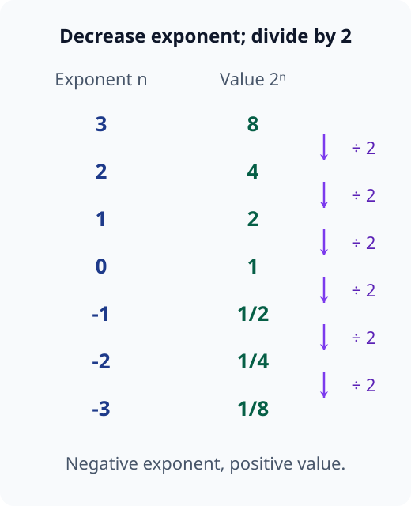
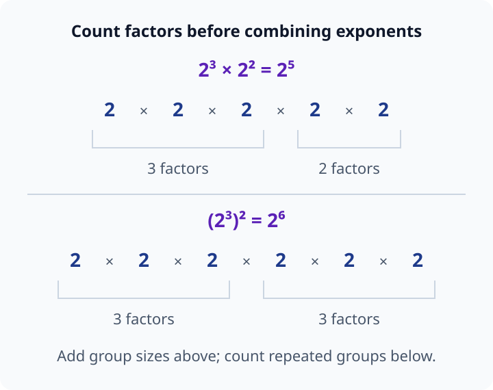
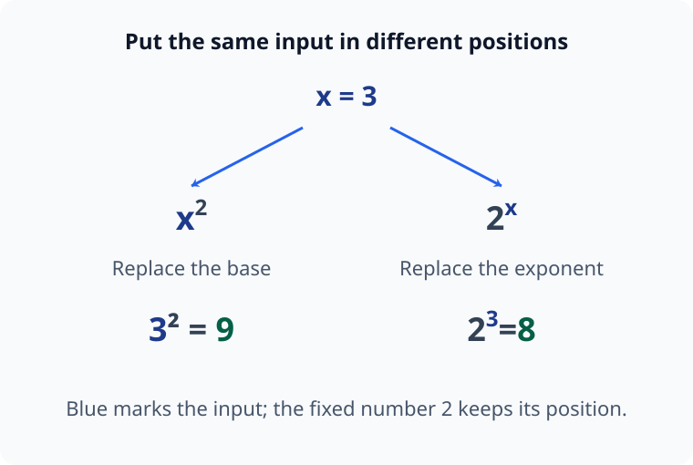
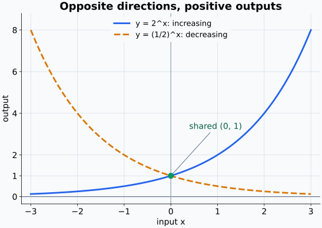
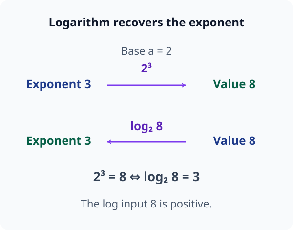
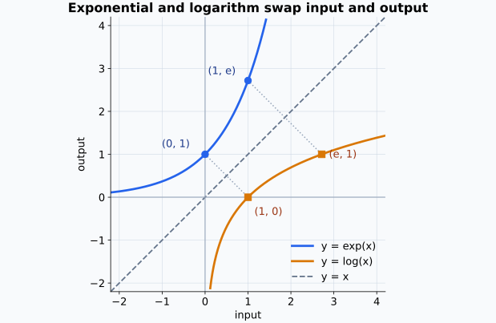
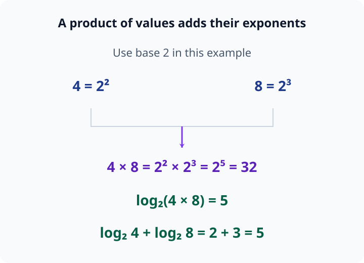
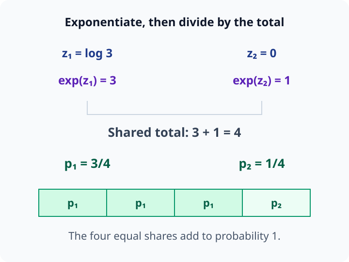

# M00-05. 지수와 로그

## 이 단원이 필요한 이유

확률모형과 신경망은 지수와 로그를 반복해서 사용한다. softmax는 점수에 지수함수를 적용하고, cross entropy는 예측확률의 로그를 사용한다. 여러 확률의 곱을 로그로 바꾸면 합으로 계산할 수 있어서 likelihood 식도 간결해진다.

기호만 외우면 $\log(x+y)$와 $\log x+\log y$를 혼동하거나, $\log 0$을 계산하려는 오류가 생긴다. 지수와 로그의 역관계를 먼저 잡으면 공식의 방향과 입력 범위를 함께 확인할 수 있다.

## 학습 목표

이 단원을 마치면 다음을 할 수 있다.

- 양의 밑에 대한 정수 지수를 계산하고 지수법칙을 적용할 수 있다.
- 지수함수 $a^x$와 $\exp(x)$의 기본 성질을 설명할 수 있다.
- $\log_a y=x$와 $a^x=y$를 서로 바꿔 쓸 수 있다.
- 로그의 정의역과 주요 계산법칙을 확인할 수 있다.
- softmax와 음의 로그 손실에서 지수와 로그의 역할을 읽을 수 있다.

## 선수지식 확인

- 선수 단원: [M00-02 식, 등식과 방정식](M00-02-expressions-equalities-equations.md)
- 선수 단원: [M00-03 함수의 입력과 출력](M00-03-functions-input-output.md)
- 선수 단원: [M00-04 좌표와 그래프](M00-04-coordinates-graphs.md)

다음 계산을 할 수 있는지 확인한다.

\[
2\cdot2\cdot2=8
\]

\[
\frac{1}{2^2}=\frac14
\]

로그는 이 반복 곱셈을 되돌리는 연산으로 정의한다.

## 기호와 용어

| 기호·용어 | Common spoken reading | 의미 | 조건 |
|---|---|---|---|
| $a^x$ | `a to the x` | 밑 $a$의 지수 $x$인 값 | 실수 지수에서는 보통 $a>0$ |
| $a$ | `a` | 반복해서 곱하는 수 또는 지수함수의 기준 | 로그에서는 $a>0$, $a\ne1$ |
| $x$ | `x` | 밑을 몇 번 곱하는지를 확장한 값 | 정수에서 시작해 실수로 확장 |
| $\exp(x)$ | `the exponential of x` | 자연상수 $e$를 밑으로 한 지수함수 | $\exp(x)=e^x$ |
| $\log_a y$ | `log base a of y` | $a$를 몇 제곱해야 $y$가 되는지 나타내는 값 | $y>0$ |
| $\log y$ | `log of y` | 이 교재에서는 자연로그 | $\log y=\log_e y$ |

## 핵심 개념 1. 지수는 반복 곱셈에서 시작한다

양의 정수 $n$에 대해

\[
a^n
\]

은 $a$를 $n$번 곱한 값이다.

\[
a^n=
\underbrace{a\cdot a\cdots a}_{n\text{개}}
\]

예를 들어

\[
2^4=2\cdot2\cdot2\cdot2=16
\]

이다. $a$를 밑(base), $n$을 지수(exponent)라고 한다.

### 지수 0과 음의 정수 지수

$a\ne0$일 때 지수 0을

\[
a^0=1
\]

로 정의한다. 이 정의는 같은 밑의 거듭제곱을 나누는 규칙과 맞는다.

\[
\frac{a^3}{a^3}=1
\]

한편 지수법칙을 적용하면

\[
\frac{a^3}{a^3}=a^{3-3}=a^0
\]

이므로 $a^0=1$로 둔다.

양의 정수 $n$에 대해 음의 지수는

\[
a^{-n}=\frac{1}{a^n}
\]

으로 정의한다. 예를 들어

\[
2^{-3}=\frac{1}{2^3}=\frac18
\]

이다.

지수를 하나씩 줄이면 $2^3=8$, $2^2=4$, $2^1=2$, $2^0=1$처럼 값이 매번 $2$로 나누어진다. 같은 규칙을 계속 적용하면 $2^{-1}=1/2$, $2^{-2}=1/4$가 된다. 음의 지수는 밑의 부호를 바꾸는 표시가 아니라, 지수를 줄일 때 나눗셈을 이어가는 표시다.

다음 그림에서 지수를 한 칸 줄일 때마다 오른쪽 값을 2로 나눈다. 지수 0을 지난 뒤에도 같은 규칙을 적용한다.

<figure class="lesson-figure lesson-figure--wide" markdown="1">

<figcaption>지수 0에서 값은 1이다. 나눗셈을 계속하면 1/2, 1/4, 1/8이 되므로 음의 지수에서도 값은 양수다.</figcaption>
</figure>

### 주요 지수법칙

$a>0$이고 $x,y$가 허용된 지수일 때 다음이 성립한다.

\[
a^x a^y=a^{x+y}
\]

\[
\frac{a^x}{a^y}=a^{x-y}
\]

\[
\left(a^x\right)^y=a^{xy}
\]

양의 정수 지수에서는 곱하는 밑의 개수를 세어 이 법칙들을 확인할 수 있다. $a^3a^2$에는 $a$가 세 개와 두 개, 모두 다섯 개 있으므로 $a^{3+2}$가 된다. $(a^3)^2$는 $a$ 세 개를 곱한 묶음을 두 번 곱하므로 $a$가 모두 여섯 개 있다. 그래서 이 경우에는 지수를 곱해 $a^{3\cdot2}$로 쓴다. 같은 밑의 나눗셈에서는 위아래의 밑을 약분하면서 지수 차이가 남는다.

정수 밖으로 지수를 확장할 때도 같은 법칙을 유지한다. 첫 번째 법칙은 같은 밑을 곱하는 경우에 적용하며, 밑이 다른 $a^x b^y$에는 그대로 적용할 수 없다.

다음 그림에서 밑 2의 개수를 세면, 지수를 더하는 경우와 곱하는 경우를 구분할 수 있다.

<figure class="lesson-figure lesson-figure--wide" markdown="1">

<figcaption>위쪽은 3개와 2개를 합쳐 5개다. 아래쪽은 3개짜리 묶음을 두 번 곱해 6개다. 지수를 더하거나 곱하는 규칙은 서로 다른 묶음 구조에서 나온다.</figcaption>
</figure>

## 핵심 개념 2. 지수함수는 지수를 입력으로 받는다

밑 $a$를 고정하고 지수 $x$를 입력으로 보면

\[
f(x)=a^x
\]

는 함수다. $a>0$이고 $a\ne1$인 경우를 지수함수라고 한다.

이때 바뀌는 것은 밑이 아니라 지수다. $f(x)=2^x$에서 $x=3$을 넣으면 $2^3$을 계산하며, $3$을 두 번 곱한 $3^2$를 계산하는 것이 아니다. $x^2$에서는 입력을 두 번 곱하지만, $2^x$에서는 고정된 밑 $2$의 지수를 입력으로 바꾼다.

다음 그림에서는 입력이 놓이는 자리를 바꾸고 두 계산의 값을 비교한다.

<figure class="lesson-figure lesson-figure--wide" markdown="1">

<figcaption>x=3이면 x²는 9, 2ˣ는 8이다. 일부 입력에서 값이 같더라도 입력이 밑인지 지수인지에 따라 계산 규칙이 다르다.</figcaption>
</figure>

정수 이외의 입력에서는 반복 곱셈의 횟수만으로 뜻을 정할 수 없으므로 지수법칙과 맞도록 값을 확장한다. 예를 들어 입력이 $1/2$이면

\[
\left(2^{1/2}\right)^2=2^{(1/2)\cdot2}=2
\]

가 되어야 한다. 따라서 $2^{1/2}$은 제곱하면 $2$가 되는 양수이며, 약 $1.414$이다. 실수 지수의 값도 양수가 되도록 정한다. 이 단원에서는 실수 지수를 엄밀하게 구성하는 과정까지 다루지는 않는다.

$a>1$이면 $x$가 커질수록 $a^x$가 커진다. $0<a<1$이면 $x$가 커질수록 $a^x$가 작아진다.

어느 경우에도 실수 $x$에 대해

\[
a^x>0
\]

이다. 지수함수의 그래프는 $x$축에 닿지 않으며, $x=0$일 때

\[
a^0=1
\]

이므로 점 $(0,1)$을 지난다.

다음 그림의 두 곡선은 밑이 1보다 큰 경우와 작은 경우를 비교한다. 어느 곡선도 x축에 닿지 않는다.

<figure class="lesson-figure lesson-figure--wide" markdown="1">

<figcaption>밑 2에서는 입력을 늘릴수록 값이 커지고, 밑 1/2에서는 작아진다. 두 함수 모두 입력 0에서 값 1을 갖는다.</figcaption>
</figure>

### 자연상수 $e$와 $\exp$

미적분과 확률에서는 자연상수

\[
e\approx2.71828
\]

을 밑으로 자주 사용한다. 자연지수함수는 다음 두 표기로 나타낸다.

\[
\exp(x)=e^x
\]

$\exp(x)$ 표기는 지수가 길거나 분수일 때 구조를 읽기 편하다.

\[
\exp\left(-\frac{x^2}{2}\right)
=
e^{-x^2/2}
\]

두 표현은 같은 값을 나타낸다.

## 핵심 개념 3. 로그는 지수를 되찾는다

$a>0$, $a\ne1$, $y>0$일 때

\[
\log_a y=x
\]

는 다음 등식과 같은 뜻이다.

\[
a^x=y
\]

즉, $\log_a y$는 “$a$를 몇 제곱해야 $y$가 되는가”에 대한 답이다.

지수식 $a^x=y$에서 밑 $a$와 결과 $y$를 알고 지수 $x$를 구하려 할 때, 그 답을 $\log_a y$라고 쓴다. 지수함수에서는 $x$를 넣어 $y$를 얻었고, 로그함수에서는 $y$를 넣어 $x$를 얻는다. $\log_a y$ 전체가 하나의 값이며, 아래첨자 $a$는 어떤 밑의 지수를 찾는지 지정한다.

예를 들어

\[
2^3=8
\]

이므로

\[
\log_2 8=3
\]

이다. 또

\[
10^{-2}=0.01
\]

이므로

\[
\log_{10}0.01=-2
\]

이다.

$a\ne1$이라는 조건은 지수를 하나로 되찾기 위해 필요하다. 밑이 $1$이면 지수가 달라도 $1^x=1$이므로 결과 $1$에서 지수를 정할 수 없다. $a>1$일 때 지수함수는 계속 증가하고, $0<a<1$일 때는 계속 감소하므로 서로 다른 지수는 서로 다른 양수 값을 만든다. 이 두 경우에는 각 양수 출력에 대응하는 지수를 하나로 정할 수 있다.

다음 그림은 같은 밑 2를 유지하면서 지수와 결과를 서로 되찾는 방향을 보여 준다.

<figure class="lesson-figure lesson-figure--wide" markdown="1">

<figcaption>지수 계산은 3에서 8로 가고, 로그 계산은 양수 8에서 그 값을 만든 지수 3을 되찾는다.</figcaption>
</figure>

### 자연로그

밑이 $e$인 로그를 자연로그(natural logarithm)라고 한다.

\[
\log y=\log_e y
\]

이 교재에서는 밑을 쓰지 않은 $\log$를 자연로그로 사용한다. 문헌이나 계산기에서는 $\log$를 밑 $10$으로 쓰기도 하므로 저자가 정한 표기를 확인해야 한다. 자연로그를 $\ln y$로 쓰는 문헌도 많다.

### 로그의 정의역

실수 범위에서 $\log y$는 $y>0$일 때만 정의된다. 자연지수함수 $e^x$의 출력이 양수이기 때문이다.

\[
\log 0
\]

과 음수의 실수 로그는 이 단원의 범위에서 정의되지 않는다.

## 핵심 개념 4. 지수함수와 로그함수는 서로 되돌린다

지수함수에 로그를 적용하면 원래 지수를 얻는다.

\[
\log_a(a^x)=x
\]

양수 $y$에 로그를 적용한 뒤 같은 밑으로 거듭제곱해도 원래 값을 얻는다.

\[
a^{\log_a y}=y
\]

자연지수와 자연로그에서는

\[
\log(\exp(x))=x
\]

\[
\exp(\log y)=y,\qquad y>0
\]

가 성립한다.

첫 번째 식에서는 지수 $x$를 양수 값으로 바꾼 뒤 그 값의 지수를 되찾으므로 실수 $x$를 그대로 얻는다. 두 번째 식에서는 양수 $y$를 만드는 지수를 먼저 찾고, 그 지수로 다시 계산해 $y$를 얻는다. 출발점이 다르므로 조건도 구분해야 한다. $\log(\exp(x))$에서는 $\exp(x)$가 이미 양수라 로그에 넣을 수 있지만, $\exp(\log y)$에서는 처음부터 $y>0$이어야 $\log y$를 계산할 수 있다.

그래프에서 $y=a^x$와 $y=\log_a x$는 직선 $y=x$를 기준으로 서로 뒤집은 모양이다. 두 함수가 입력과 출력의 역할을 교환하는 역함수이기 때문이다.

자연지수함수와 자연로그도 같은 관계를 가진다. 지수 그래프의 점 $(0,1)$은 로그 그래프의 점 $(1,0)$과 짝을 이루고, $(1,e)$는 $(e,1)$과 짝을 이룬다. 각 짝은 가로 좌표와 세로 좌표를 서로 바꾼 것이다. 이 좌표 교환이 $y=x$에 대한 대칭으로 보인다.

<figure class="lesson-figure lesson-figure--wide" markdown="1">

<figcaption>y=exp(x)의 입력과 출력을 바꾸면 y=log(x)의 점이 된다. 점선으로 연결한 (0,1)과 (1,0), (1,e)와 (e,1)은 역함수가 좌표를 교환한다는 사실을 보여 준다.</figcaption>
</figure>

## 핵심 개념 5. 로그는 곱을 합으로 바꾼다

$u>0$, $v>0$일 때 로그법칙은 다음과 같다.

\[
\log(uv)=\log u+\log v
\]

\[
\log\left(\frac{u}{v}\right)=\log u-\log v
\]

\[
\log(u^r)=r\log u
\]

여기서 $r$은 실수 지수다. 첫 번째 법칙을 지수의 관점에서 확인해보자. 양수 $u,v$의 로그를 각각 $p=\log u$, $q=\log v$라고 두면 역관계에 따라 $u=e^p$, $v=e^q$이다. 따라서

\[
uv=e^p e^q=e^{p+q}
\]

이다. 양쪽에 로그를 적용하면

\[
\log(uv)=p+q=\log u+\log v
\]

를 얻는다.

곱셈에서는 지수를 더하고, 로그는 그 지수를 되찾기 때문에 곱의 로그를 로그의 합으로 쓸 수 있다. 나눗셈도 같은 방식으로 확인한다.

\[
\frac{u}{v}=\frac{e^p}{e^q}=e^{p-q}
\]

따라서 $\log(u/v)=p-q=\log u-\log v$이다. 거듭제곱에서는 $u^r=(e^p)^r=e^{pr}$이므로 $\log(u^r)=pr=r\log u$를 얻는다. 세 로그법칙은 앞에서 배운 지수법칙을 로그로 읽은 결과다.

로그는 곱을 합으로 바꾸지만 덧셈을 분리하지 않는다.

\[
\log(u+v)\ne\log u+\log v
\]

일반적으로 위 부등식이 성립한다. 예를 들어 $u=v=1$이면 왼쪽은 $\log2$, 오른쪽은 $0$이다.

다음 그림은 밑 2의 로그로 같은 곱셈 법칙을 확인한다. 값 4와 8의 지수 2와 3을 더하면 곱 32의 지수 5가 된다.

<figure class="lesson-figure lesson-figure--wide" markdown="1">

<figcaption>곱의 로그와 각각의 로그를 더한 값은 모두 5다. 이 그림은 밑 2를 명시한 예시이며, 본문에서 밑을 생략한 log는 자연로그다.</figcaption>
</figure>

## 예제 1. 지수 계산하기

### 문제

다음을 계산하라.

\[
2^3\cdot2^{-1}
\]

### 풀이

같은 밑의 거듭제곱을 곱하므로 지수를 더한다.

\[
2^3\cdot2^{-1}=2^{3+(-1)}=2^2=4
\]

음의 지수를 먼저 분수로 바꿔도 같은 결과가 나온다.

\[
2^3\cdot2^{-1}=8\cdot\frac12=4
\]

## 예제 2. 로그와 지수식 바꾸기

### 문제

\[
\log_3 81=4
\]

를 지수식으로 바꾸고 값이 맞는지 확인하라.

### 풀이

$\log_a y=x$는 $a^x=y$와 같은 뜻이다. 따라서

\[
\log_3 81=4
\]

는

\[
3^4=81
\]

로 바뀐다. 실제로

\[
3^4=3\cdot3\cdot3\cdot3=81
\]

이므로 등식이 성립한다.

## 예제 3. 로그법칙으로 곱 분해하기

### 문제

$p_1,p_2,p_3>0$일 때

\[
\log(p_1p_2p_3)
\]

를 로그의 합으로 바꿔라.

### 풀이

곱에 대한 로그법칙을 두 번 적용한다.

\[
\log(p_1p_2p_3)
=
\log(p_1p_2)+\log p_3
\]

\[
=
\log p_1+\log p_2+\log p_3
\]

여러 확률의 곱으로 표현한 likelihood에 로그를 적용하면 각 항의 로그를 더하는 식으로 바뀐다. 확률모형에서는 이 성질을 이용해 log-likelihood를 계산한다.

## 예제 4. softmax에서 지수 읽기

두 점수 $z_1,z_2$를 양수의 비율로 바꾸는 식을 보자.

\[
p_1
=
\frac{\exp(z_1)}
{\exp(z_1)+\exp(z_2)}
\]

\[
p_2
=
\frac{\exp(z_2)}
{\exp(z_1)+\exp(z_2)}
\]

지수함수의 출력은 양수이므로 $p_1,p_2>0$이다. 두 값을 더하면

\[
p_1+p_2
=
\frac{\exp(z_1)+\exp(z_2)}
{\exp(z_1)+\exp(z_2)}
=1
\]

이다.

$z_1=\log3$, $z_2=0$이라고 하자. 역관계에서

\[
\exp(\log3)=3,\qquad \exp(0)=1
\]

이므로

\[
p_1=\frac{3}{3+1}=\frac34
\]

\[
p_2=\frac{1}{3+1}=\frac14
\]

이다. softmax는 여러 점수로 이 구조를 확장한다.

다음 그림에서 두 항은 같은 분모 4로 나눈다. 마지막 막대는 전체 1을 네 몫으로 나눠 확률을 표시한다.

<figure class="lesson-figure lesson-figure--wide" markdown="1">

<figcaption>양수 가중치 3과 1의 합은 4다. p₁은 네 몫 중 세 몫, p₂는 한 몫을 차지하므로 두 확률의 합은 1이다.</figcaption>
</figure>

## 예제 5. 음의 로그 손실 읽기

정답에 부여한 예측확률을 $p$라고 할 때 다음 손실을 생각하자.

\[
\mathcal L=-\log p
\]

$0<p\le1$에서는 $\log p\le0$이므로 $-\log p\ge0$이다. 정답 확률이 $1$에 가까우면 손실은 $0$에 가까워진다.

\[
-\log(0.8)\approx0.223
\]

\[
-\log(0.1)\approx2.303
\]

정답에 낮은 확률을 준 두 번째 예측이 더 큰 손실을 받는다. 이 식 하나만으로 모델의 전체 품질을 판단할 수는 없으며, 어떤 데이터에서 평균을 냈는지 함께 확인해야 한다.

## 흔한 오해

### 오해 1. $a^x a^y=a^{xy}$이다

같은 밑의 거듭제곱을 곱할 때 지수는 더한다.

\[
a^x a^y=a^{x+y}
\]

지수를 곱하는 규칙은 거듭제곱을 다시 거듭제곱할 때 사용한다.

\[
(a^x)^y=a^{xy}
\]

### 오해 2. $a^{-n}$은 음수다

음의 지수는 역수를 뜻한다.

\[
a^{-n}=\frac1{a^n}
\]

$a>0$이면 결과도 양수다.

### 오해 3. $\log(u+v)=\log u+\log v$이다

로그는 곱을 합으로 바꾼다. 합을 항별 로그로 분리하는 법칙은 없다.

### 오해 4. $\log 0=0$이다

$a^x=0$을 만족하는 실수 $x$가 없으므로 실수 범위에서 $\log_a0$은 정의되지 않는다. $\log1=0$과 혼동하지 않아야 한다.

### 오해 5. $\log$는 모든 문헌에서 밑이 같다

분야와 도구에 따라 밑을 생략한 $\log$의 뜻이 다를 수 있다. 이 교재와 많은 머신러닝 문헌은 자연로그를 사용한다. 문헌의 표기 규칙을 먼저 확인한다.

## 연습문제

### 1. 정수 지수 계산

다음을 계산하라.

\[
5^0,\qquad 2^{-4},\qquad 3^2\cdot3^3
\]

해설 보기

$5\ne0$이므로

\[
5^0=1
\]

이다. 음의 지수는 역수이므로

\[
2^{-4}=\frac1{2^4}=\frac1{16}
\]

이다. 같은 밑의 거듭제곱을 곱하면 지수를 더한다.

\[
3^2\cdot3^3=3^{2+3}=3^5=243
\]

### 2. 지수법칙 적용

\[
\frac{7^5}{7^2}
\]

와

\[
\left(2^3\right)^2
\]

를 계산하라.

해설 보기

같은 밑의 나눗셈에서는 지수를 뺀다.

\[
\frac{7^5}{7^2}=7^{5-2}=7^3=343
\]

거듭제곱을 다시 거듭제곱하면 지수를 곱한다.

\[
\left(2^3\right)^2=2^{3\cdot2}=2^6=64
\]

### 3. 로그식을 지수식으로 바꾸기

다음을 지수식으로 바꿔라.

\[
\log_2 32=5
\]

\[
\log_{10}0.001=-3
\]

해설 보기

$\log_a y=x$는 $a^x=y$와 같다. 따라서

\[
2^5=32
\]

\[
10^{-3}=0.001
\]

로 바뀐다.

### 4. 로그값 구하기

다음을 계산하라.

\[
\log_3 1,\qquad \log_3 27,\qquad \log_3\frac19
\]

해설 보기

\[
3^0=1
\]

이므로 $\log_3 1=0$이다.

\[
3^3=27
\]

이므로 $\log_3 27=3$이다.

\[
\frac19=3^{-2}
\]

이므로

\[
\log_3\frac19=-2
\]

이다.

### 5. 로그의 정의역 판단

실수 범위에서 다음 표현 가운데 정의되는 것을 모두 고르고 이유를 설명하라.

\[
\log 4,\qquad \log1,\qquad \log0,\qquad \log(-2)
\]

해설 보기

실수 로그의 입력은 양수여야 한다. $4>0$이고 $1>0$이므로 $\log4$와 $\log1$은 정의된다. 특히 $\log1=0$이다.

$0$과 $-2$는 양수가 아니므로 이 단원의 실수 범위에서는 $\log0$과 $\log(-2)$를 정의하지 않는다.

### 6. softmax 계산

두 점수에 대한 확률을

\[
p_1=\frac{\exp(z_1)}{\exp(z_1)+\exp(z_2)},
\qquad
p_2=\frac{\exp(z_2)}{\exp(z_1)+\exp(z_2)}
\]

로 정의한다. $z_1=0$, $z_2=\log4$일 때 $p_1,p_2$를 구하라.

해설 보기

\[
\exp(0)=1,\qquad \exp(\log4)=4
\]

이므로

\[
p_1=\frac{1}{1+4}=\frac15
\]

\[
p_2=\frac{4}{1+4}=\frac45
\]

이다. 두 확률의 합은 $1$이다.

### 7. 잘못된 로그법칙 찾기

다음 계산의 오류를 설명하라.

\[
\log(1+1)=\log1+\log1=0
\]

해설 보기

로그에는 합을 항별로 분리하는 법칙이 없다. 왼쪽은

\[
\log(1+1)=\log2
\]

이고 양수다. 오른쪽은

\[
\log1+\log1=0+0=0
\]

이다. 따라서 두 값은 같지 않다.

올바른 법칙은 양수 $u,v$에 대한

\[
\log(uv)=\log u+\log v
\]

이다.

## 단원 요약

- $a^n$은 반복 곱셈에서 시작하며 $a^0=1$, $a^{-n}=1/a^n$으로 확장한다.
- 같은 밑을 곱하면 지수를 더하고, 거듭제곱을 다시 거듭제곱하면 지수를 곱한다.
- $\log_a y=x$는 $a^x=y$와 같은 뜻이다.
- 실수 로그는 양수 입력에서 정의되며 지수함수와 서로 역함수 관계다.
- 로그는 곱을 합으로 바꾸며, softmax와 로그 손실은 이 성질들을 사용한다.

## 통과 기준

다음 질문에 자료를 보지 않고 답할 수 있으면 통과한다.

- 지수 0과 음의 지수를 계산할 수 있는가?
- 세 가지 지수법칙을 서로 구분할 수 있는가?
- 로그식을 지수식으로 바꿀 수 있는가?
- $\log0$이 실수 범위에서 정의되지 않는 이유를 설명할 수 있는가?
- softmax에서 $\exp$가 양수의 비율을 만드는 과정을 읽을 수 있는가?

## 다음 단원

다음 단원은 [M00-06 인덱스와 합 기호](M00-06-indices-summation.md)이다. 여러 값을 아래첨자로 구분하고, 반복되는 덧셈을 $\sum$ 기호로 나타낸다.

## 집필자 점검표

- [x] 학습 목표가 관찰 가능한 행동으로 작성됐다.
- [x] 모든 새 기호가 사용 전에 정의됐다.
- [x] 지수법칙과 로그법칙의 조건을 적었다.
- [x] 로그의 정의역을 명시했다.
- [x] 예제의 수치를 검산했다.
- [x] 모든 문제에 해설이 있다.
- [x] softmax와 손실함수의 설명 범위를 입문 수준으로 제한했다.
- [x] 용어집과 표기 규칙을 따랐다.
- [x] 내부 링크와 수식 구분자를 확인했다.
- [x] Common spoken reading이 실제 영어 학술 발화이며 한글 음역이나 기계적 직역을 포함하지 않는다.
