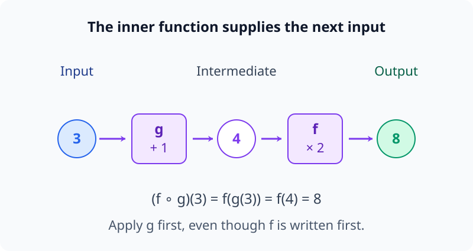
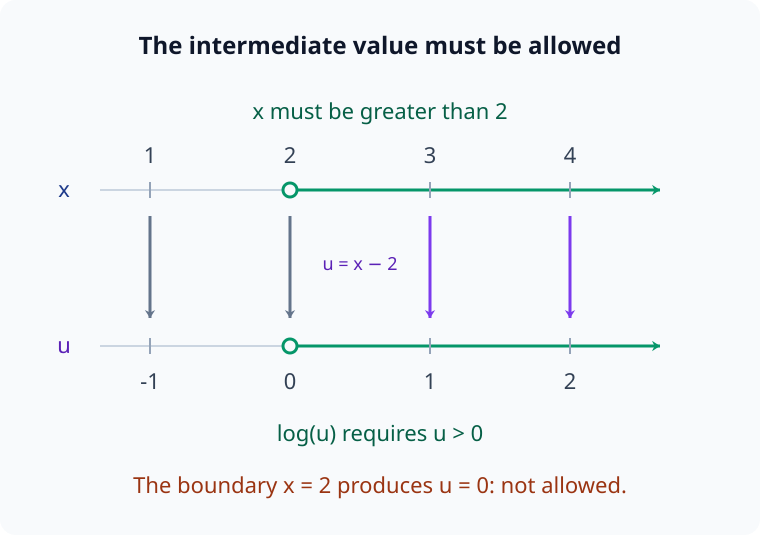
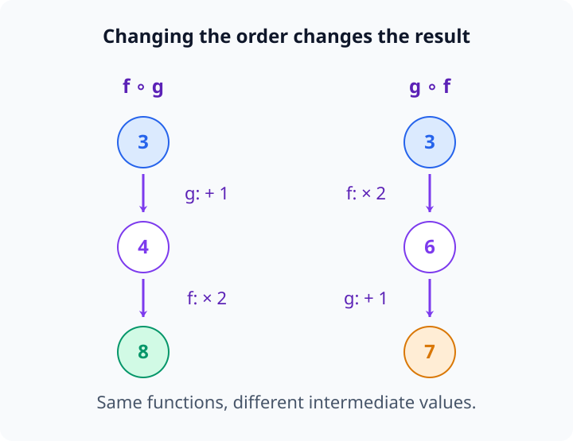
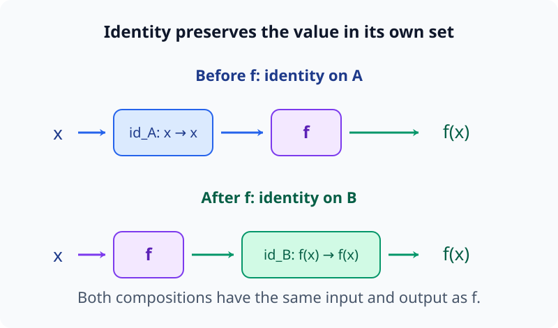
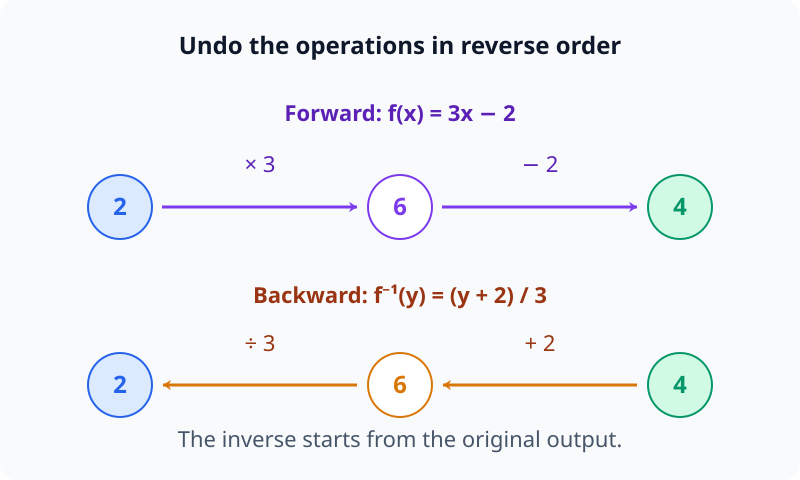
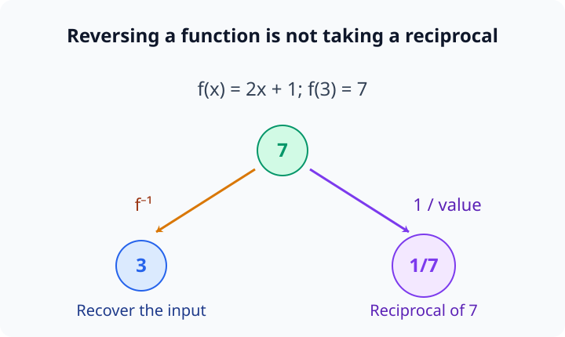
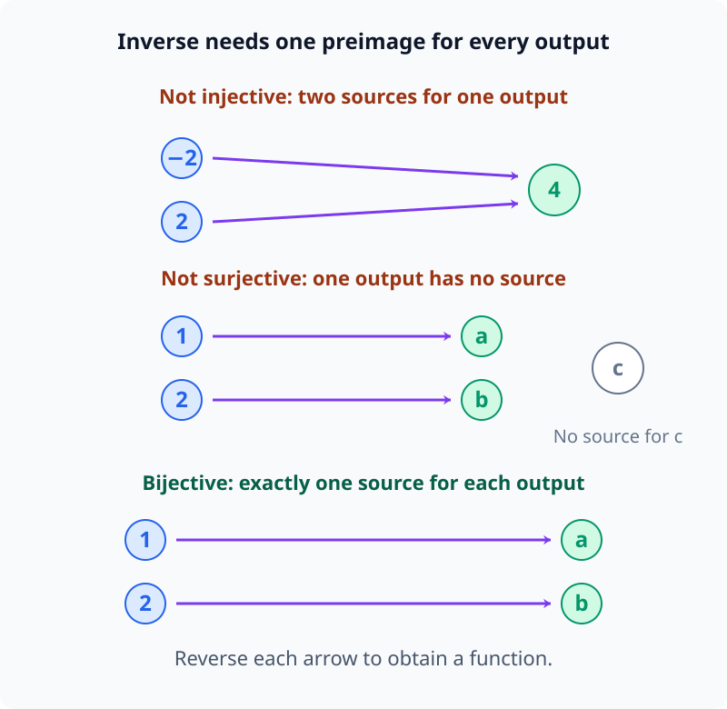

# M00-08. 함수 합성과 역함수

## 이 단원이 필요한 이유

신경망은 여러 함수를 차례로 적용한다. 첫 layer가 만든 출력을 다음 layer가 입력으로 받고, 마지막 layer까지 같은 과정이 이어진다. 이 계산을 함수 합성으로 쓰면 모델 전체의 구조와 중간 activation의 위치를 한 식에 나타낼 수 있다.

\[
f=f_L\circ f_{L-1}\circ\cdots\circ f_1
\]

합성 기호의 순서를 잘못 읽으면 실제 계산 순서를 거꾸로 이해한다. 역함수도 비슷한 주의를 요구한다. 어떤 출력에서 입력을 되찾으려면 함수가 서로 다른 입력을 같은 출력으로 합치지 않아야 하며, 출력 범위도 맞아야 한다.

## 학습 목표

이 단원을 마치면 다음을 할 수 있다.

- $(f\circ g)(x)=f(g(x))$를 계산 순서에 맞게 읽을 수 있다.
- 두 함수의 합성이 정의되기 위한 입력·출력 범위를 확인할 수 있다.
- 합성 순서를 바꿨을 때 결과가 달라질 수 있음을 계산으로 보일 수 있다.
- 일대일, 전사와 전단사 함수의 차이를 설명할 수 있다.
- 간단한 함수의 역함수를 구하고 두 방향의 합성으로 검산할 수 있다.
- 신경망의 layer 계산을 함수 합성으로 나타낼 수 있다.

## 선수지식 확인

- 선수 단원: [M00-03 함수의 입력과 출력](M00-03-functions-input-output.md)
- 선수 단원: [M00-07 집합, 조건과 논리](M00-07-sets-conditions-logic.md)

다음 질문에 답할 수 있는지 확인한다.

1. $f:A\to B$에서 $A$와 $B$의 역할을 말할 수 있는가?
2. $P\Rightarrow Q$와 $Q\Rightarrow P$가 서로 다른 주장임을 설명할 수 있는가?

역함수 조건은 함수의 정의역·공역과 두 방향의 대응을 함께 사용한다.

## 기호와 용어

| 기호·용어 | Common spoken reading | 의미 | 조건 |
|---|---|---|---|
| $f\circ g$ | `f composed with g` | $g$를 적용한 뒤 $f$를 적용하는 함수 | $g$의 출력이 $f$의 입력으로 들어가야 함 |
| $(f\circ g)(x)$ | `f composed with g at x` | $f(g(x))$ | 오른쪽 함수부터 계산 |
| $\operatorname{id}_A$ | `the identity on A` | 입력을 그대로 출력하는 함수 | $\operatorname{id}_A(x)=x$ |
| $f^{-1}$ | `f inverse` | $f$의 출력을 원래 입력으로 되돌리는 함수 | 지정한 정의역과 공역에서 전단사 |
| 일대일 | `injective` | 서로 다른 입력이 서로 다른 출력으로 감 | 단사라고도 함 |
| 전사 | `surjective` | 공역의 각 원소가 실제 출력으로 나옴 | 치역과 공역이 같음 |
| 전단사 | `bijective` | 일대일이면서 전사 | 역함수가 존재함 |

## 핵심 개념 1. 함수 합성은 출력을 다음 입력으로 넣는다

두 함수를

\[
g:A\to B,\qquad f:B\to C
\]

라고 하자. $g$가 $A$의 입력을 $B$의 값으로 보내고, $f$가 그 값을 $C$의 값으로 보낸다. 두 단계를 하나의 함수로 묶으면

\[
f\circ g:A\to C
\]

가 된다.

정의는 다음과 같다.

\[
(f\circ g)(x)=f(g(x))
\]

계산 순서는 오른쪽에서 왼쪽이다.

1. 입력 $x$에 $g$를 적용한다.
2. 결과 $g(x)$에 $f$를 적용한다.

기호를 읽는 순서와 실제 계산 순서가 다르게 보일 수 있으므로 괄호 안쪽부터 계산한다.

### 작은 수로 계산하기

\[
g(x)=x+1,\qquad f(x)=2x
\]

라고 하자. $x=3$이면

\[
g(3)=4
\]

이고

\[
f(g(3))=f(4)=8
\]

이다. 따라서

\[
(f\circ g)(3)=8
\]

이다.

다음 그림에서는 중간값 4가 다음 함수 f의 입력으로 들어간다.

<figure class="lesson-figure lesson-figure--wide" markdown="1">

<figcaption>왼쪽에서 오른쪽으로 g를 먼저 계산하고 f를 계산한다. 합성식에서 먼저 적힌 f가 실제로는 마지막 단계다.</figcaption>
</figure>

## 핵심 개념 2. 합성에는 범위 호환성이 필요하다

$g:A\to B$의 출력을 $f:C\to D$에 넣으려면 $g(x)$가 $f$의 정의역 $C$에 속해야 한다. 보통

\[
B\subseteq C
\]

이면 모든 $x\in A$에서 $f(g(x))$를 계산할 수 있다.

이 조건은 $g$가 어느 값을 출력해도 $f$가 받을 수 있게 하는 충분조건이다. 필요한 것은 $g$의 실제 출력인 치역이 $C$에 들어가는 것이다. 선언한 공역 $B$ 전체가 $C$에 포함되지 않아도 $g$의 실제 출력이 모두 $C$에 속하면 합성할 수 있다. 일부 출력만 $C$에 속한다면 그 출력을 만드는 입력으로 합성의 정의역을 제한한다.

예를 들어

\[
g:\mathbb R\to\mathbb R,\qquad g(x)=x-2
\]

\[
f:(0,\infty)\to\mathbb R,\qquad f(u)=\log u
\]

라고 하자. $f(g(x))=\log(x-2)$는

\[
x-2>0
\]

일 때만 정의된다. 따라서 합성함수의 정의역은

\[
x>2
\]

로 제한된다.

함수식만 이어 붙이지 않고 중간 출력이 다음 함수의 허용 입력인지 확인해야 한다.

다음 그림은 x에서 2를 뺀 중간값 u를 같은 위치의 아래 수직선에 대응시킨다.

<figure class="lesson-figure lesson-figure--wide" markdown="1">

<figcaption>log의 허용 입력 u&gt;0을 거슬러 확인하면 원래 입력의 범위 x&gt;2가 나온다. 경계 x=2는 u=0을 만들므로 포함하지 않는다.</figcaption>
</figure>

## 핵심 개념 3. 합성 순서를 바꾸면 다른 함수가 된다

\[
g(x)=x+1,\qquad f(x)=2x
\]

에서

\[
(f\circ g)(x)=f(x+1)=2(x+1)=2x+2
\]

이다. 순서를 바꾸면

\[
(g\circ f)(x)=g(2x)=2x+1
\]

이다. 두 결과는 다르다.

\[
f\circ g\ne g\circ f
\]

가 이 예에서 성립한다. 함수 합성은 일반적으로 교환할 수 없다.

다음 그림은 같은 입력 3을 두 계산 순서로 보내 중간값과 결과를 비교한다.

<figure class="lesson-figure lesson-figure--wide" markdown="1">

<figcaption>순서를 바꾸면 중간값부터 달라진다. 왼쪽은 4에 2를 곱하고, 오른쪽은 6에 1을 더하므로 결과가 각각 8과 7이다.</figcaption>
</figure>

세 함수의 합성에서는 괄호를 묶는 위치를 바꿔도 적용 순서를 유지하면 결과가 같다.

\[
h\circ(f\circ g)=(h\circ f)\circ g
\]

이 성질을 결합법칙이라고 한다. 어느 쪽도 $g$, $f$, $h$ 순서로 적용한다.

두 식에 입력 $x$를 넣어 펼치면 모두 $h(f(g(x)))$가 된다. 괄호를 옮기는 것은 어느 두 함수를 먼저 하나의 함수로 묶어 부를지 바꾸는 것이며, 각 입력에 함수를 적용하는 순서는 바꾸지 않는다.

## 핵심 개념 4. 항등함수는 입력을 그대로 돌려준다

집합 $A$ 위의 항등함수(identity function)는

\[
\operatorname{id}_A:A\to A
\]

\[
\operatorname{id}_A(x)=x
\]

로 정의한다.

$f:A\to B$에 대해

\[
\operatorname{id}_B\circ f=f
\]

\[
f\circ\operatorname{id}_A=f
\]

가 성립한다. 항등함수는 합성에서 함수의 작동을 바꾸지 않는다.

첫 식에서는 $f$의 출력이 $B$에 있으므로 $\operatorname{id}_B$가 그 출력을 그대로 돌려준다. 둘째 식에서는 $\operatorname{id}_A$가 입력 $x$를 바꾸지 않고 $f$에 전달한다. 항등함수의 아래첨자는 그대로 돌려줄 값이 어느 집합에 속하는지 나타낸다.

다음 그림에서 항등함수가 f 앞에 있는지 뒤에 있는지에 따라 받는 값의 소속 집합을 확인한다.

<figure class="lesson-figure lesson-figure--wide" markdown="1">

<figcaption>위 경로의 항등함수는 A의 입력을 그대로 넘기고, 아래 경로의 항등함수는 B의 출력을 그대로 넘긴다. 두 경로 모두 원래 f와 같은 값을 출력한다.</figcaption>
</figure>

## 핵심 개념 5. 역함수는 입력과 출력을 되돌린다

$f:A\to B$의 역함수는

\[
f^{-1}:B\to A
\]

이며 다음 두 조건을 만족한다.

\[
f^{-1}\circ f=\operatorname{id}_A
\]

\[
f\circ f^{-1}=\operatorname{id}_B
\]

첫 식은 $A$의 입력에 $f$를 적용한 뒤 $f^{-1}$을 적용하면 원래 입력이 나온다는 뜻이다.

\[
f^{-1}(f(x))=x
\]

둘째 식은 $B$의 값에 $f^{-1}$을 적용한 뒤 $f$를 적용하면 원래 값이 나온다는 뜻이다.

\[
f(f^{-1}(y))=y
\]

두 방향을 모두 확인해야 지정한 정의역과 공역에서 역함수라고 부를 수 있다.

다음 그림은 뒤의 선형식 예제 f(x)=3x−2에서 계산을 되돌리는 순서를 보여 준다.

<figure class="lesson-figure lesson-figure--wide" markdown="1">

<figcaption>정방향의 마지막 연산 ‘2 빼기’를 먼저 되돌리고, 첫 연산 ‘3 곱하기’를 나중에 되돌린다. 출발점과 도착점도 원래 출력과 입력으로 바뀐다.</figcaption>
</figure>

### $f^{-1}(x)$는 역수가 아니다

\[
f^{-1}(x)
\]

는 역함수의 함수값이다.

\[
\frac1{f(x)}
\]

는 함수값의 역수다. 같은 위첨자 $-1$이 보이지만 대상과 연산이 다르다.

다음 그림에서 출력 7을 원래 입력으로 되돌리는 일과 7의 역수를 구하는 일을 나눈다.

<figure class="lesson-figure lesson-figure--wide" markdown="1">

<figcaption>f(x)=2x+1에서 f⁻¹(7)=3은 입력 복원이다. 1/f(3)=1/7은 출력값을 수로 취급해 역수를 구한 결과다.</figcaption>
</figure>

## 핵심 개념 6. 역함수에는 전단사가 필요하다

### 일대일 함수

$f:A\to B$가 일대일(injective)이라는 말은 서로 다른 입력이 같은 출력으로 합쳐지지 않는다는 뜻이다. 논리식으로는

\[
f(x_1)=f(x_2)\Rightarrow x_1=x_2
\]

라고 쓸 수 있다.

한 출력에서 원래 입력을 하나로 정하려면 일대일 조건이 필요하다.

### 전사 함수

$f:A\to B$가 전사(surjective)라는 말은 공역 $B$의 각 원소가 실제 출력으로 나온다는 뜻이다.

\[
\forall y\in B,\quad
\exists x\in A:\ f(x)=y
\]

전사이면 치역과 공역이 같다. 공역에 도달하지 못하는 값이 있으면 그 값에서 $f^{-1}$을 정의할 수 없다.

### 전단사 함수

일대일이면서 전사인 함수를 전단사(bijective)라고 한다. $f:A\to B$가 전단사일 때 $B$ 전체에서 $A$로 가는 역함수가 존재한다.

일대일 조건은 출력 하나에 대응하는 입력이 둘 이상 없도록 하고, 전사 조건은 공역의 출력마다 대응하는 입력이 적어도 하나 있도록 한다. 두 조건을 함께 만족하면 $B$의 각 값에서 원래 입력을 정확히 하나 정할 수 있다. 이를 역함수의 출력으로 삼으면 M00-03에서 배운 함수의 조건, 즉 모든 허용 입력에 출력이 하나씩 정해져야 한다는 조건도 만족한다.

일대일 함수는 공역을 치역으로 줄이면 역함수를 정의할 수 있다. 따라서 역함수의 존재를 말할 때 정의역과 공역을 함께 적어야 한다.

다음 그림은 역방향에서 입력 하나의 원래 출처를 찾을 때 생기는 두 문제를 구분한다.

<figure class="lesson-figure lesson-figure--wide" markdown="1">

<figcaption>위에서는 출력 4의 출처가 두 개라 유일성이 깨진다. 가운데에서는 공역의 c에 출처가 없다. 아래에서는 모든 출력의 출처가 정확히 하나여서 역방향도 함수가 된다.</figcaption>
</figure>

## 예제 1. 합성함수 식 구하기

### 문제

\[
g(x)=x^2,\qquad f(u)=3u-1
\]

일 때 $(f\circ g)(x)$를 구하라.

### 풀이

$g$를 먼저 적용한다.

\[
g(x)=x^2
\]

이 결과를 $f$의 입력 $u$ 자리에 넣는다.

\[
f(g(x))
=
3g(x)-1
\]

\[
=
3x^2-1
\]

따라서

\[
(f\circ g)(x)=3x^2-1
\]

이다.

## 예제 2. 선형식의 역함수 구하기

### 문제

\[
f:\mathbb R\to\mathbb R,\qquad f(x)=3x-2
\]

의 역함수를 구하고 검산하라.

### 풀이

출력을 $y$라고 둔다.

\[
y=3x-2
\]

$x$를 $y$에 대한 식으로 푼다. 양쪽에 $2$를 더하면

\[
y+2=3x
\]

이고, 양쪽을 $3$으로 나누면

\[
x=\frac{y+2}{3}
\]

이다. 입력 기호를 다시 $x$로 쓰면

\[
f^{-1}(x)=\frac{x+2}{3}
\]

이다.

마지막 식의 $x$는 역함수에 넣는 값의 이름이며, 원래 함수에서는 출력 $y$가 맡았던 자리다. $f^{-1}(y)=(y+2)/3$으로 적어도 같은 역함수다. 입력 문자의 이름을 바꾼 뒤에도 원래 출력에서 원래 입력으로 되돌린다는 역할은 유지한다.

첫 방향을 검산한다.

\[
f^{-1}(f(x))
=
\frac{(3x-2)+2}{3}
=x
\]

둘째 방향도 확인한다.

\[
f(f^{-1}(y))
=
3\left(\frac{y+2}{3}\right)-2
=y
\]

두 합성이 각 정의역의 항등함수가 되므로 역함수가 맞다.

## 예제 3. 정의역 제한으로 역함수 만들기

\[
f(x)=x^2
\]

를 $f:\mathbb R\to[0,\infty)$로 보면 일대일이 아니다.

\[
f(2)=f(-2)=4
\]

출력 $4$에서 입력을 $2$와 $-2$ 중 하나로 정할 수 없으므로 역함수가 없다.

정의역을 $[0,\infty)$로 제한하면 서로 다른 음수와 양수가 합쳐지는 문제가 사라진다.

\[
f:[0,\infty)\to[0,\infty),\qquad f(x)=x^2
\]

이 함수는 전단사이고 역함수는

\[
f^{-1}(y)=\sqrt y
\]

이다.

정의역 제한은 함수의 일부를 고르는 일이다. 같은 공식 $x^2$도 정의역과 공역에 따라 역함수 존재 여부가 달라진다.

## 예제 4. 신경망을 함수 합성으로 읽기

세 layer가 다음처럼 연결됐다고 하자.

\[
h_1=f_1(x)
\]

\[
h_2=f_2(h_1)
\]

\[
y=f_3(h_2)
\]

중간 변수를 대입하면

\[
y=f_3(f_2(f_1(x)))
\]

이고 합성 기호로는

\[
y=(f_3\circ f_2\circ f_1)(x)
\]

이다.

입력에는 $f_1$을 먼저 적용하고 $f_3$을 마지막에 적용한다. activation $h_1$은 전체 합성의 첫 단계 출력이고, $h_2$는 두 번째 단계 출력이다.

각 layer 중 하나가 여러 입력을 같은 출력으로 보내면 전체 모델도 그 단계 이전의 정보를 완전히 되찾지 못할 수 있다. ReLU 함수

\[
\operatorname{ReLU}(x)=\max(0,x)
\]

는 모든 음수 입력을 $0$으로 보내므로 실수 전체에서 일대일이 아니다.

## 예제 5. 복원과 역함수 구분하기

어떤 디코더(decoder) $d$가 데이터셋의 activation $h=f(x)$에서 입력의 일부 속성을 높은 정확도로 복원했다고 하자.

\[
d(f(x))\approx x
\]

가 제한된 데이터에서 관찰될 수 있다. 이 결과는 선택한 데이터와 오차 기준에서 $d$가 입력을 근사 복원했다는 뜻이다.

이 관찰만으로 $d=f^{-1}$이라고 결론 내릴 수는 없다. 전역적 역함수를 주장하려면 정의역 전체에서 두 방향의 합성, 출력 범위와 유일성을 확인해야 한다. 일부 속성의 복원은 원래 입력 전체의 복원과도 다르다.

## 흔한 오해

### 오해 1. $(f\circ g)(x)$에서는 $f$를 먼저 계산한다

정의는

\[
(f\circ g)(x)=f(g(x))
\]

이다. 괄호 안쪽의 $g(x)$를 먼저 계산한다.

### 오해 2. 함수 합성은 곱셈처럼 순서를 바꿀 수 있다

합성 순서는 중간값을 바꾼다. $f\circ g$와 $g\circ f$가 같은지는 별도로 계산해야 한다.

### 오해 3. $f^{-1}(x)=1/f(x)$이다

$f^{-1}$은 입력과 출력을 되돌리는 함수다. $1/f(x)$는 함수값의 역수이며 $f(x)=0$에서 정의되지 않는다.

### 오해 4. 식에서 $x$와 $y$를 바꾸기만 하면 역함수가 된다

변수를 바꾼 뒤에도 출력마다 입력이 하나로 정해져야 한다. $f(x)=x^2$를 실수 전체에서 사용하면 $y=4$에 입력이 두 개이므로 역함수가 없다.

### 오해 5. 디코더가 복원하면 원래 함수는 가역이다

제한된 데이터에서 근사 복원한 결과는 전역적 전단사를 보장하지 않는다. 오차, 데이터 범위와 두 방향의 합성을 확인해야 한다.

## 연습문제

### 1. 합성값 계산

\[
g(x)=x-2,\qquad f(u)=u^2+1
\]

일 때 $(f\circ g)(5)$를 구하라.

해설 보기

$g$를 먼저 적용한다.

\[
g(5)=5-2=3
\]

그 결과를 $f$에 넣는다.

\[
f(3)=3^2+1=10
\]

따라서

\[
(f\circ g)(5)=10
\]

이다.

### 2. 합성함수 식 구하기

\[
g(x)=2x+1,\qquad f(u)=u-4
\]

일 때 $(f\circ g)(x)$와 $(g\circ f)(x)$를 각각 구하라.

해설 보기

\[
(f\circ g)(x)
=
f(2x+1)
=
(2x+1)-4
=2x-3
\]

이다.

\[
(g\circ f)(x)
=
g(x-4)
=
2(x-4)+1
=2x-7
\]

이다. 두 합성함수는 서로 다르다.

### 3. 합성의 정의역

\[
g(x)=x+3,\qquad f(u)=\sqrt u
\]

라고 하자. 실수 범위에서 $(f\circ g)(x)$의 식과 정의역을 구하라.

해설 보기

\[
(f\circ g)(x)=\sqrt{x+3}
\]

이다. 실수 제곱근의 입력은 음수가 아니어야 하므로

\[
x+3\ge0
\]

이어야 한다. 따라서 정의역은

\[
x\ge-3
\]

이다.

### 4. 일대일과 전사 판단

$A=\{1,2,3\}$, $B=\{a,b,c\}$이고 함수 $f:A\to B$가

\[
f(1)=a,\qquad f(2)=b,\qquad f(3)=b
\]

로 주어졌다. 일대일인지, 전사인지 판단하라.

해설 보기

$f(2)=f(3)=b$이므로 서로 다른 입력 $2,3$이 같은 출력으로 간다. 따라서 일대일이 아니다.

공역의 원소 $c$는 어떤 입력에서도 나오지 않는다. 치역은 $\{a,b\}$이므로 공역 $B$와 다르고 전사도 아니다.

### 5. 역함수 구하기

\[
f:\mathbb R\to\mathbb R,\qquad f(x)=5x+10
\]

의 역함수를 구하라.

해설 보기

\[
y=5x+10
\]

에서 양쪽에 $10$을 빼면

\[
y-10=5x
\]

이고 양쪽을 $5$로 나누면

\[
x=\frac{y-10}{5}
\]

이다. 따라서

\[
f^{-1}(x)=\frac{x-10}{5}
\]

이다.

검산하면

\[
f^{-1}(f(x))
=
\frac{(5x+10)-10}{5}
=x
\]

이다.

### 6. 정의역 제한 판단

\[
f(x)=x^2
\]

에 대해 다음 두 함수 중 역함수가 존재하는 것을 고르고 이유를 설명하라.

\[
f_1:\mathbb R\to[0,\infty)
\]

\[
f_2:(-\infty,0]\to[0,\infty)
\]

해설 보기

$f_1$은 일대일이 아니다. $f_1(1)=f_1(-1)=1$이므로 역함수가 없다.

$f_2$는 음수 또는 $0$인 입력만 허용한다. 이 정의역에서는 서로 다른 입력이 같은 제곱값으로 가지 않으며, 공역의 각 $y\ge0$에 대해 입력 $-\sqrt y$가 존재한다. 따라서 전단사이고

\[
f_2^{-1}(y)=-\sqrt y
\]

이다.

### 7. 모델 합성과 복원 주장

모델이

\[
h=f_1(x),\qquad y=f_2(h)
\]

로 주어졌다.

1. 전체 모델을 합성함수로 나타내라.
2. 디코더 $d$가 일부 데이터에서 $d(h)\approx x$를 만족했다. 이 결과만으로 $d=f_1^{-1}$이라고 할 수 있는지 판단하라.

해설 보기

전체 모델은

\[
y=(f_2\circ f_1)(x)
\]

이다. $f_1$을 먼저 적용하고 $f_2$를 적용한다.

일부 데이터의 근사 복원만으로 $d=f_1^{-1}$이라고 할 수 없다. 역함수를 주장하려면 지정한 정의역과 공역에서 $f_1$이 전단사인지 확인하고

\[
d(f_1(x))=x
\]

와

\[
f_1(d(h))=h
\]

가 해당 범위에서 성립하는지 확인해야 한다. 근사 등식이라면 오차 기준과 평가 범위도 필요하다.

## 단원 요약

- $(f\circ g)(x)=f(g(x))$이며 $g$를 먼저 적용한다.
- 합성에서는 앞 함수의 출력이 다음 함수의 정의역에 들어가는지 확인한다.
- 함수 합성은 일반적으로 순서를 바꿀 수 없다.
- 지정한 정의역과 공역에서 함수가 전단사일 때 역함수가 존재한다.
- 제한된 데이터의 근사 복원은 전역적인 역함수 존재를 보장하지 않는다.

## 통과 기준

다음 질문에 자료를 보지 않고 답할 수 있으면 통과한다.

- $f\circ g$의 적용 순서를 말할 수 있는가?
- 합성함수의 정의역을 중간 출력의 조건으로 구할 수 있는가?
- 일대일, 전사와 전단사를 구분할 수 있는가?
- 간단한 선형식의 역함수를 구하고 검산할 수 있는가?
- 디코더의 근사 복원과 역함수를 구분할 수 있는가?

## 다음 단원

다음 단원은 [M00-09 스칼라·벡터·행렬의 shape](M00-09-scalars-vectors-matrices-shape.md)이다. 수학 객체의 종류와 차원을 구분하고, 연산이 가능한지를 shape으로 검사한다.

## 집필자 점검표

- [x] 학습 목표가 관찰 가능한 행동으로 작성됐다.
- [x] 모든 새 기호가 사용 전에 정의됐다.
- [x] 합성의 계산 순서와 범위 조건을 명시했다.
- [x] 역함수의 두 합성을 모두 설명했다.
- [x] 예제의 합성과 역함수를 검산했다.
- [x] 모든 문제에 해설이 있다.
- [x] 근사 복원과 전역적 가역성을 구분했다.
- [x] 용어집과 표기 규칙을 따랐다.
- [x] 내부 링크와 수식 구분자를 확인했다.
- [x] Common spoken reading이 실제 영어 학술 발화이며 한글 음역이나 기계적 직역을 포함하지 않는다.
