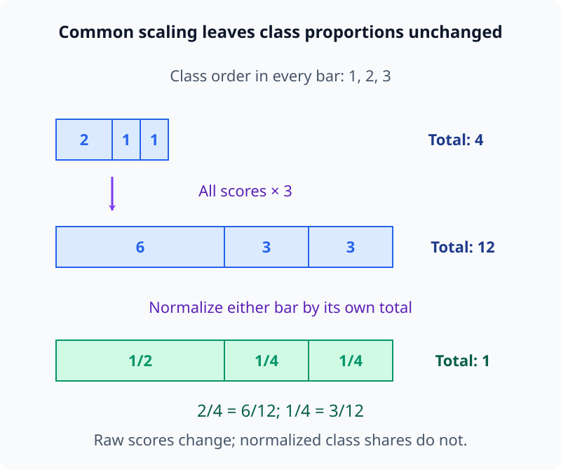
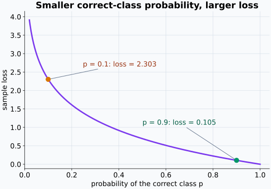
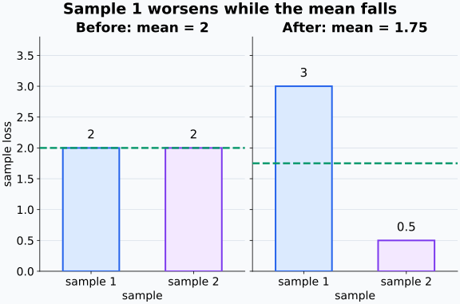
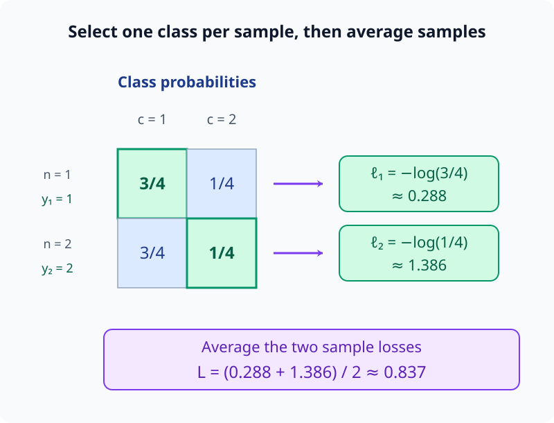
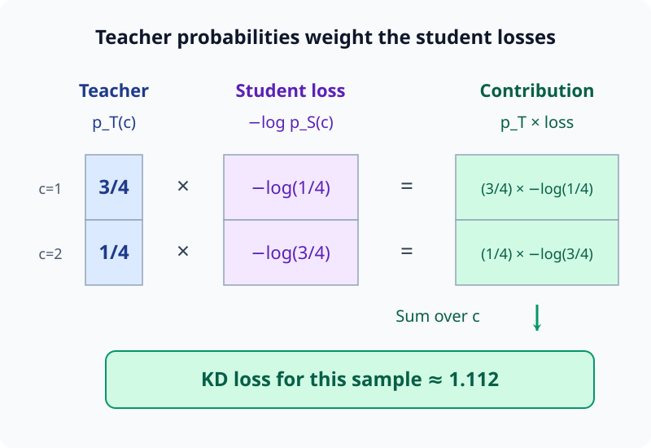
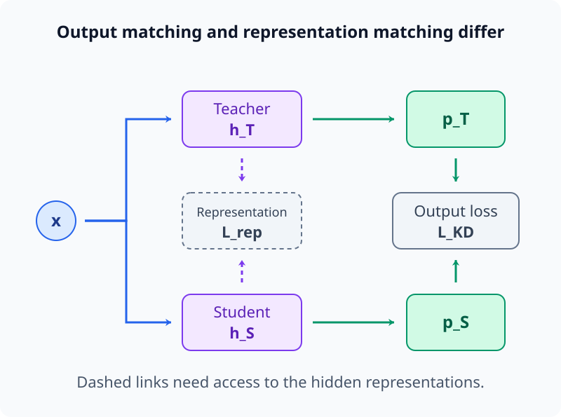

# M00-10. AI 수식 해독 연습

## 이 단원이 필요한 이유

논문의 수식은 앞에서 배운 기호를 한꺼번에 사용한다. 함수의 입력과 출력, 표본과 class 인덱스, 지수와 로그, 평균, 벡터와 행렬 shape이 한 줄 안에 들어간다. 기호를 왼쪽부터 읽기만 하면 각 항의 역할과 계산 순서를 놓치기 쉽다.

이 단원에서는 분류 모델의 평균 loss를 세 단계로 나눠 읽는다.

\[
\mathbf x_n
\longmapsto
\mathbf z_n
\longmapsto
p_\theta(c\mid\mathbf x_n)
\longmapsto
-\log p_\theta(y_n\mid\mathbf x_n)
\longmapsto
\mathcal L(\theta)
\]

이 단원에서는 처음 보는 수식의 기호, 범위, shape, 계산 순서와 결론의 범위를 차례로 복원하는 절차를 익힌다.

## 학습 목표

이 단원을 마치면 다음을 할 수 있다.

- AI 수식에 등장하는 기호와 인덱스를 표로 정리할 수 있다.
- 아핀 분류기, 소프트맥스와 평균 loss의 계산 순서를 설명할 수 있다.
- 각 중간값의 shape과 합의 범위를 검산할 수 있다.
- 작은 로짓에서 확률과 평균 loss를 직접 계산할 수 있다.
- loss 감소에서 직접 말할 수 있는 것과 추가 증거가 필요한 주장을 구분할 수 있다.
- 같은 해독 절차를 지식증류 loss에 적용할 수 있다.

## 선수지식 확인

- [M00-03 함수의 입력과 출력](M00-03-functions-input-output.md)
- [M00-05 지수와 로그](M00-05-exponents-logarithms.md)
- [M00-06 인덱스와 합 기호](M00-06-indices-summation.md)
- [M00-09 스칼라·벡터·행렬의 shape](M00-09-scalars-vectors-matrices-shape.md)

다음 네 질문에 답할 수 있는지 확인한다.

1. $f_\theta(\mathbf x)$에서 $\mathbf x$와 $\theta$의 역할은 무엇인가?
2. $\exp(\log a)=a$가 성립하려면 $a$에 어떤 조건이 필요한가?
3. $\frac1N\sum_{n=1}^{N}\ell_n$은 무엇을 계산하는가?
4. $\mathbf W\in\mathbb R^{C\times d}$와 $\mathbf x\in\mathbb R^d$일 때 $\mathbf W\mathbf x$의 dimension은 얼마인가?

## 이번 단원의 수식 묶음

표본 $n$의 입력을 $\mathbf x_n$, 정답 class를 $y_n$이라고 하자. 분류 모델은 먼저 로짓(logit)을 계산한다.

\[
\mathbf z_n
=
\mathbf W\mathbf x_n+\mathbf b
\]

각 class의 확률은 소프트맥스(softmax)로 계산한다.

\[
p_\theta(c\mid\mathbf x_n)
=
\frac{\exp(z_{n,c})}
{\displaystyle\sum_{j=1}^{C}\exp(z_{n,j})}
\]

데이터셋의 평균 loss는 정답 class 확률의 음의 로그를 평균내어 계산한다.

\[
\mathcal L(\theta)
=
-\frac1N
\sum_{n=1}^{N}
\log p_\theta(y_n\mid\mathbf x_n)
\]

파라미터는

\[
\theta=(\mathbf W,\mathbf b)
\]

로 묶어 나타낸다.

마지막 식은 다중 class 분류에서 사용하는 교차엔트로피(cross entropy)를 정답 class 인덱스로 쓴 형태다.

## 기호와 용어

| 기호·용어 | Common spoken reading | 의미 | shape·범위 |
|---|---|---|---|
| $N$ | `N` | 표본 수 | 양의 정수 |
| $C$ | `C` | class 수 | 양의 정수 |
| $d$ | `d` | 입력 feature dimension | 양의 정수 |
| $n$ | `n` | 표본 인덱스 | $1,\ldots,N$ |
| $c,j$ | `c and j` | class 인덱스 | $1,\ldots,C$ |
| $\mathbf x_n$ | `x sub n` | $n$번째 입력 | $\mathbb R^d$ |
| $y_n$ | `y sub n` | $n$번째 정답 class 번호 | $\{1,\ldots,C\}$ |
| $\mathbf W$ | `W` | 가중치 행렬 | $\mathbb R^{C\times d}$ |
| $\mathbf b$ | `b` | 편향 벡터 | $\mathbb R^C$ |
| $\mathbf z_n$ | `z sub n` | $n$번째 표본의 로짓 벡터 | $\mathbb R^C$ |
| $z_{n,c}$ | `z sub n c` | 표본 $n$의 class $c$ logit | 스칼라 |
| $p_\theta(c\mid\mathbf x_n)$ | `p sub theta of c given x sub n` | class $c$에 부여한 모델 확률 | $0<p_\theta\le1$ |
| $\mathcal L(\theta)$ | `L of theta` | $N$개 표본의 평균 loss | 스칼라 |

## 해독 절차 1. 등호와 정의의 단위를 나눈다

세 식은 서로 다른 단계의 출력을 정의한다.

\[
\mathbf z_n
=
\mathbf W\mathbf x_n+\mathbf b
\]

는 입력 벡터를 로짓 벡터로 바꾼다.

\[
p_\theta(c\mid\mathbf x_n)
=
\frac{\exp(z_{n,c})}
{\sum_{j=1}^{C}\exp(z_{n,j})}
\]

는 로짓 벡터의 모든 성분을 사용해 관심 class 하나의 확률을 계산한다. 분자에서는 한 class의 점수를 고르지만, 분모에서는 같은 표본의 모든 class 점수를 사용한다.

\[
\mathcal L(\theta)
=
-\frac1N
\sum_{n=1}^{N}
\log p_\theta(y_n\mid\mathbf x_n)
\]

는 표본별 확률을 loss 하나로 모은다.

수식을 한 줄로 합치기 전에 각 등호의 왼쪽이 어떤 객체인지 확인한다. $\mathbf z_n$은 벡터, $p_\theta(c\mid\mathbf x_n)$은 스칼라, $\mathcal L(\theta)$도 스칼라다.

## 해독 절차 2. 인덱스의 역할과 범위를 적는다

이 수식에는 표본 인덱스와 class 인덱스가 함께 등장한다.

- $n$: 어떤 표본을 계산하는지 지정한다.
- $c$: 확률을 읽을 class를 지정한다.
- $j$: 소프트맥스 분모에서 모든 class를 더하는 더미 인덱스다.

$c$와 $j$는 같은 범위 $1,\ldots,C$를 돌 수 있지만 역할이 다르다. $c$는 식의 왼쪽에도 남아 어떤 확률을 구했는지 표시한다. $j$는 합 안에서만 변하고 합이 끝나면 사라진다.

평균 loss의 합에서는 $n$이 더미 인덱스로 사용된다.

\[
\sum_{n=1}^{N}
\log p_\theta(y_n\mid\mathbf x_n)
\]

각 표본의 정답 class 확률을 하나씩 선택해 로그를 더한다.

## 해독 절차 3. shape을 검산한다

로짓 식부터 확인한다.

\[
\mathbf W\in\mathbb R^{C\times d},
\qquad
\mathbf x_n\in\mathbb R^d
\]

이므로

\[
(C\times d)(d\times1)
\longrightarrow
(C\times1)
\]

이다.

\[
\mathbf W\mathbf x_n\in\mathbb R^C
\]

이고 $\mathbf b\in\mathbb R^C$이므로 두 벡터를 더할 수 있다.

\[
\mathbf z_n\in\mathbb R^C
\]

logit 성분 $z_{n,c}$는 벡터의 한 원소이므로 스칼라다. 지수함수와 합을 거쳐 계산한 $p_\theta(c\mid\mathbf x_n)$도 스칼라다.

마지막 loss 식은 스칼라 $N$개를 더하고 $N$으로 나누므로 스칼라를 출력한다.

## 해독 절차 4. 소프트맥스의 분자와 분모를 펼친다

$C=3$이라고 하자. class $2$의 확률은

\[
p_\theta(2\mid\mathbf x_n)
=
\frac{\exp(z_{n,2})}
{\exp(z_{n,1})+\exp(z_{n,2})+\exp(z_{n,3})}
\]

이다.

분자는 관심 class의 지수화된 점수다. 분모는 모든 class의 지수화된 점수를 더한다. 지수함수의 출력은 양수이므로 각 확률도 양수다.

표본 $n$을 고정하면 어느 class의 확률을 구하든 분모는 같다. 각 양수 점수를 같은 전체 합으로 나누므로, class별 값은 전체에서 차지하는 비중이 된다. 이 공통 분모를 사용해야 모든 class의 비중을 더했을 때 1이 된다.

모든 class 확률을 더하면

\[
\sum_{c=1}^{C}
p_\theta(c\mid\mathbf x_n)
=
\frac{
\sum_{c=1}^{C}\exp(z_{n,c})
}{
\sum_{j=1}^{C}\exp(z_{n,j})
}
=1
\]

이다. 분자와 분모에서 더미 인덱스의 글자는 달라도 같은 class 범위를 합한다.

### 공통 상수를 더해도 확률은 변하지 않는다

모든 logit에 같은 상수 $a$를 더하면

\[
\frac{\exp(z_{n,c}+a)}
{\sum_{j=1}^{C}\exp(z_{n,j}+a)}
\]

가 된다. 지수법칙을 적용하면

\[
=
\frac{\exp(a)\exp(z_{n,c})}
{\exp(a)\sum_{j=1}^{C}\exp(z_{n,j})}
\]

이고 공통인 $\exp(a)$가 약분된다. 따라서 소프트맥스 확률은 변하지 않는다.

이 성질은 로짓의 절대 위치보다 class 사이의 차이가 확률을 정한다는 뜻이다.

다음 그림은 모든 logit에 log 3을 더해 지수화된 점수가 모두 3배가 되는 경우다. 막대의 세 구간은 같은 class 순서를 유지한다.

<figure class="lesson-figure lesson-figure--wide" markdown="1">

<figcaption>분모도 4에서 12로 같은 비율만큼 늘어난다. 위 두 막대는 원점수의 크기, 아래 막대는 합이 1인 확률 비중을 나타낸다. 관심 class를 어느 것으로 골라도 각 막대의 전체 합이 공통 분모다.</figcaption>
</figure>

## 해독 절차 5. 표본별 loss를 읽는다

$n$번째 표본의 loss를

\[
\ell_n
=
-\log p_\theta(y_n\mid\mathbf x_n)
\]

이라고 둘 수 있다. $y_n$은 정답 class 번호이므로

\[
p_\theta(y_n\mid\mathbf x_n)
\]

는 모델이 정답 class에 부여한 확률이다.

$y_n$을 넣는 자리는 확률식의 class 인덱스 $c$ 자리다. 먼저 표본 $n$의 모든 class 확률을 계산하고, 정답 번호에 해당하는 성분 하나를 골라 로그에 넣는다. 정답이 달라지면 같은 로짓 벡터에서도 선택하는 확률과 loss가 달라진다.

정답 확률이 $1$에 가까우면 $\ell_n$은 $0$에 가까워진다. 정답 확률이 $0$에 가까우면 음의 로그 값이 커진다.

예를 들어

\[
-\log0.9\approx0.105
\]

\[
-\log0.1\approx2.303
\]

이다. 정답에 $0.1$을 부여한 예측이 더 큰 loss를 갖는다.

소프트맥스는 양수 확률을 출력하므로 로그의 입력 조건

\[
p_\theta(y_n\mid\mathbf x_n)>0
\]

을 만족한다.

다음 그래프에서 정답 확률 p를 로그의 입력으로 놓고 표본 loss를 세로축에서 읽는다.

<figure class="lesson-figure lesson-figure--wide" markdown="1">

<figcaption>같은 확률 차이라도 0에 가까운 구간에서는 loss 차이가 더 크다. p=0은 로그의 허용 입력이 아니며, 그래프는 양수 확률만 그린다.</figcaption>
</figure>

## 해독 절차 6. 평균의 범위를 읽는다

전체 loss는

\[
\mathcal L(\theta)
=
\frac1N\sum_{n=1}^{N}\ell_n
\]

이다. 각 표본의 loss를 같은 가중치로 평균낸다.

평균이 감소해도 각 $\ell_n$이 모두 감소했다고 결론 내릴 수는 없다. 일부 표본의 loss가 증가하고 다른 표본의 loss가 더 크게 감소할 수 있다. 평균은 표본별 분포를 스칼라 하나로 요약한다.

$\mathcal L(\theta)$라는 표기에서는 이 평균을 계산할 입력과 정답 데이터셋을 고정하고 파라미터를 함수의 입력으로 드러낸다. $\theta$를 바꾸면 각 표본의 예측 확률이 바뀌어 평균 loss도 바뀔 수 있다. 표본 인덱스 $n$을 합하는 일과 파라미터 $\theta$를 바꾸는 일은 서로 다른 역할이다.

데이터셋을 바꾸면 같은 $\theta$에서도 평균 loss가 달라질 수 있다. 논문을 읽을 때 훈련, 검증과 시험 데이터 중 어느 집합에서 계산했는지 확인해야 한다.

다음 그래프는 평균 감소와 모든 표본의 개선이 같지 않음을 보여 주는 설명용 예다. 모델 실험 결과가 아니다.

<figure class="lesson-figure lesson-figure--wide" markdown="1">

<figcaption>초록색 파선은 표본 평균이다. 표본 1의 loss는 2에서 3으로 증가하지만 표본 2의 감소가 더 커서 평균은 2에서 1.75로 낮아진다.</figcaption>
</figure>

## 전체 계산 예제

### 설정

표본 수와 class 수를

\[
N=2,\qquad C=2
\]

로 둔다. 정답은

\[
y_1=1,\qquad y_2=2
\]

이고 로짓은

\[
\mathbf z_1=
\begin{bmatrix}
\log3\\
0
\end{bmatrix},
\qquad
\mathbf z_2=
\begin{bmatrix}
\log3\\
0
\end{bmatrix}
\]

이다.

### 첫 번째 표본

\[
\exp(\log3)=3,\qquad \exp(0)=1
\]

이므로

\[
p_\theta(1\mid\mathbf x_1)
=
\frac{3}{3+1}
=
\frac34
\]

이다. 첫 번째 표본의 정답은 class $1$이므로

\[
\ell_1
=
-\log\frac34
\]

이다.

### 두 번째 표본

로짓이 같으므로 class 확률도 같다.

\[
p_\theta(2\mid\mathbf x_2)
=
\frac{1}{3+1}
=
\frac14
\]

두 번째 표본의 정답은 class $2$이므로

\[
\ell_2
=
-\log\frac14
\]

이다.

### 평균 loss

\[
\mathcal L(\theta)
=
\frac12(\ell_1+\ell_2)
\]

\[
=
-\frac12
\left(
\log\frac34+\log\frac14
\right)
\]

로그의 곱 법칙을 사용하면

\[
=
-\frac12\log\frac{3}{16}
\]

\[
=
\frac12\log\frac{16}{3}
\approx0.837
\]

이다.

두 표본이 같은 로짓을 받았지만 정답 class가 달라서 정답 확률과 표본별 loss가 달라졌다.

다음 그림은 class 방향에서 성분을 고르는 단계와 표본 방향에서 평균내는 단계를 나눈다.

<figure class="lesson-figure lesson-figure--wide" markdown="1">

<figcaption>각 행에서 정답 번호에 해당하는 확률 하나를 골라 스칼라 loss를 만든다. 그다음 두 행의 loss를 평균내어 스칼라 하나로 모은다. 정답 class 선택과 표본 합산의 축이 다르다.</figcaption>
</figure>

## batch 표기로 같은 계산 읽기

입력들을 행으로 쌓으면

\[
\mathbf X
\in
\mathbb R^{N\times d}
\]

이다. 로짓 행렬은

\[
\mathbf Z
=
\mathbf X\mathbf W^\top
+
\mathbf 1\mathbf b^\top
\in
\mathbb R^{N\times C}
\]

로 쓸 수 있다.

- 행 $n$: 표본 $n$
- 열 $c$: class $c$
- 원소 $z_{n,c}$: 표본 $n$의 class $c$ logit

소프트맥스를 각 행의 class 축에 적용하면 확률 행렬

\[
\mathbf P\in\mathbb R^{N\times C}
\]

를 얻는다. 각 행의 합은 $1$이다. “소프트맥스를 적용한다”는 문장만으로는 어느 축을 정규화하는지 빠질 수 있으므로 shape과 축을 함께 확인한다.

## 재사용할 수 있는 수식 해독 절차

처음 보는 AI 수식을 만나면 다음 순서로 읽는다.

1. 각 등호의 왼쪽에서 새로 정의하는 객체를 찾는다.
2. 기호와 인덱스의 의미·범위를 표로 적는다.
3. 스칼라, 벡터, 행렬과 텐서의 shape을 표시한다.
4. 합 기호를 작은 범위에서 펼쳐 더미 인덱스를 확인한다.
5. 괄호 안쪽부터 함수 합성의 계산 순서를 적는다.
6. 로그, 나눗셈과 역함수의 정의역 조건을 확인한다.
7. 작은 수를 넣어 수치와 출력 범위를 검산한다.
8. 계산 결과가 직접 지지하는 주장과 추가 실험이 필요한 주장을 나눈다.

이 절차는 수식의 이름을 몰라도 적용할 수 있다. 세부 이론은 뒤 단원에서 배우더라도 객체와 연산 구조를 먼저 복원할 수 있다.

## 같은 문법으로 지식증류 loss 읽기

교사(teacher)의 class 분포를 $p_T(c\mid\mathbf x_n)$, 학생(student)의 class 분포를 $p_S(c\mid\mathbf x_n)$라고 하자. 출력 분포를 맞추는 지식증류 loss의 한 형태는

\[
\mathcal L_{\mathrm{KD}}
=
-\frac1N
\sum_{n=1}^{N}
\sum_{c=1}^{C}
p_T(c\mid\mathbf x_n)
\log p_S(c\mid\mathbf x_n)
\]

이다.

기호를 순서대로 읽으면 다음과 같다.

1. 표본 $n$을 하나 고른다.
2. 각 class $c$에서 교사 확률을 가중치로 사용한다.
3. 학생이 준 class 확률의 로그를 계산한다.
4. class 전체를 더하고 부호를 바꿔 표본 loss를 만든다.
5. 표본 전체에서 평균낸다.

안쪽 합은 class별 학생 loss $-\log p_S(c\mid\mathbf x_n)$를 교사 확률로 가중평균한 것이다. 교사 확률은 음이 아니고 class 전체에서 합이 1이다. 정답 번호 하나로 loss를 계산할 때는 해당 class의 항 하나를 고르지만, 이 식에서는 교사가 준 비중에 따라 여러 class의 항을 함께 평가한다. 교사가 한 class에 확률 1을 주고 나머지에 0을 주면 그 class의 음의 로그 loss만 남는다.

다음 그림은 표본 하나에서 교사 확률이 (3/4, 1/4), 학생 확률이 (1/4, 3/4)인 설명용 예다.

<figure class="lesson-figure lesson-figure--wide" markdown="1">

<figcaption>같은 class의 교사 가중치와 학생 loss를 짝지어 곱한다. 교사가 비중을 준 두 class의 항을 함께 더한 값이며, 전체 증류 loss에서는 이런 표본별 값을 다시 평균낸다.</figcaption>
</figure>

이 식은 교사와 학생의 출력 분포만 사용하므로 교사 내부 activation에 접근하지 않아도 계산할 수 있다. 교사의 class별 확률을 받을 수 있는 설정에서는 블랙박스(black-box) 증류로 구현할 수 있다. API가 최종 class 번호만 제공하면 이 식을 그대로 계산할 수 없다.

화이트박스(white-box) 증류는 교사와 학생의 중간 표현이나 attention을 맞추는 항을 추가할 수 있다. 예를 들어

\[
\mathcal L_{\mathrm{total}}
=
\mathcal L_{\mathrm{KD}}
+
\lambda\mathcal L_{\mathrm{rep}}
\]

처럼 출력 loss와 표현 loss를 결합한다. $\lambda$는 두 항의 상대적 비중을 정하는 하이퍼파라미터다.

표현 loss가 작다는 관찰은 선택한 표현과 정렬 방식에서 두 중간값이 가깝다는 뜻이다. 학생이 교사와 같은 내부 알고리즘을 사용한다는 결론에는 추가 개입과 기능 검증이 필요하다.

다음 그림에서 실선은 출력 분포 비교, 파선은 중간 표현을 추가로 비교하는 경로다.

<figure class="lesson-figure lesson-figure--wide" markdown="1">

<figcaption>교사 확률 p_T를 얻을 수 있으면 오른쪽 출력 loss를 계산한다. 왼쪽 표현 loss는 교사 내부 h_T에 대한 접근과 적절한 정렬이 필요하다. 두 loss는 서로 다른 관찰 대상을 비교한다.</figcaption>
</figure>

지식증류의 온도, KL 발산과 표현 정렬은 M04 이후의 선수지식을 갖춘 뒤 별도 단원에서 다룬다.

## 흔한 오해

### 오해 1. $z_{n,c}$는 확률이다

$z_{n,c}$는 소프트맥스 전의 로짓이다. 음수나 $1$보다 큰 값도 가능하며 class 전체에서 합이 $1$일 필요가 없다.

### 오해 2. 소프트맥스 분모에는 정답 class만 들어간다

분모는 모든 class의 지수화된 logit을 더한다.

\[
\sum_{j=1}^{C}\exp(z_{n,j})
\]

정답 class는 loss에서 $p_\theta(y_n\mid\mathbf x_n)$을 선택할 때 사용한다.

### 오해 3. $-\log p$에서 음수 부호는 확률을 음수로 만든다

로그를 먼저 계산한 뒤 부호를 바꾼다. $0<p\le1$이면 $\log p\le0$이므로 $-\log p\ge0$이다.

### 오해 4. 평균 loss가 낮으면 각 표본의 loss도 낮다

평균은 여러 표본을 하나의 수로 요약한다. 표본별 loss의 분포와 최댓값은 별도로 확인해야 한다.

### 오해 5. 훈련 loss가 낮으면 모델의 설명이 참이다

훈련 loss는 지정한 데이터와 목표함수에서 예측이 얼마나 맞는지 평가한다. 모델이 어떤 내부 메커니즘을 사용했는지, 설명 텍스트가 충실한지 또는 외부 데이터에 일반화되는지는 별도 증거가 필요하다.

## 연습문제

### 1. 기호 역할 분류

다음 수식에서 표본 인덱스, class 인덱스, 벡터, 행렬과 스칼라 출력을 각각 찾아라.

\[
\mathbf z_n=\mathbf W\mathbf x_n+\mathbf b,
\qquad
\mathcal L(\theta)
=
-\frac1N\sum_{n=1}^{N}
\log p_\theta(y_n\mid\mathbf x_n)
\]

해설 보기

$n$은 표본 인덱스다. $y_n$은 정답 class 번호이지만 이 식에는 class를 합하는 더미 인덱스가 직접 나타나지 않는다.

$\mathbf x_n$, $\mathbf b$와 $\mathbf z_n$은 벡터다. $\mathbf W$는 행렬이다. $p_\theta(y_n\mid\mathbf x_n)$, 표본별 로그와 최종 $\mathcal L(\theta)$는 스칼라다.

### 2. 소프트맥스 분모 펼치기

$C=4$일 때

\[
p_\theta(3\mid\mathbf x_n)
=
\frac{\exp(z_{n,3})}
{\sum_{j=1}^{4}\exp(z_{n,j})}
\]

의 분모를 합 기호 없이 써라.

해설 보기

\[
\sum_{j=1}^{4}\exp(z_{n,j})
=
\exp(z_{n,1})
+\exp(z_{n,2})
+\exp(z_{n,3})
+\exp(z_{n,4})
\]

이다. class $3$의 항도 분모에 포함된다.

### 3. shape 검산

$d=5$, $C=3$이고 열벡터 관례를 사용한다. 다음 식이 계산되도록 $\mathbf x_n$, $\mathbf W$, $\mathbf b$, $\mathbf z_n$의 shape을 적어라.

\[
\mathbf z_n=\mathbf W\mathbf x_n+\mathbf b
\]

해설 보기

\[
\mathbf x_n\in\mathbb R^5
\]

\[
\mathbf W\in\mathbb R^{3\times5}
\]

\[
\mathbf b\in\mathbb R^3
\]

\[
\mathbf z_n\in\mathbb R^3
\]

이다. 행렬·벡터 곱은

\[
(3\times5)(5\times1)
\longrightarrow
(3\times1)
\]

이고 편향과 출력도 dimension $3$이다.

### 4. 소프트맥스 계산

한 표본의 로짓이

\[
\mathbf z=
\begin{bmatrix}
\log2\\
0\\
0
\end{bmatrix}
\]

일 때 세 class의 소프트맥스 확률을 구하라.

해설 보기

\[
\exp(\log2)=2,\qquad
\exp(0)=1
\]

이다. 분모는

\[
2+1+1=4
\]

이므로

\[
p(1)=\frac24=\frac12
\]

\[
p(2)=\frac14,\qquad
p(3)=\frac14
\]

이다. 세 확률의 합은 $1$이다.

### 5. 정답 class와 표본 loss

연습문제 4의 확률을 사용한다. 정답이 class $1$일 때와 class $2$일 때 표본별 loss를 각각 쓰고 어느 쪽이 큰지 판단하라.

해설 보기

정답이 class $1$이면

\[
\ell_{y=1}
=
-\log\frac12
\]

이다. 정답이 class $2$이면

\[
\ell_{y=2}
=
-\log\frac14
\]

이다.

\[
\frac14<\frac12
\]

이고 음의 로그는 작은 확률에 더 큰 값을 주므로

\[
-\log\frac14>-\log\frac12
\]

이다. class $2$가 정답인 경우의 loss가 더 크다.

### 6. 평균 loss 계산

세 표본의 정답 class 확률이

\[
\frac12,\qquad \frac14,\qquad 1
\]

이라고 하자. 평균 음의 로그 loss를 로그의 합으로 나타내고 정리하라.

해설 보기

\[
\mathcal L
=
-\frac13
\left(
\log\frac12+\log\frac14+\log1
\right)
\]

이다. $\log1=0$이고 로그의 곱 법칙을 적용하면

\[
\mathcal L
=
-\frac13\log\left(\frac12\cdot\frac14\right)
\]

\[
=
-\frac13\log\frac18
=
\frac13\log8
\]

이다. $\log8=3\log2$이므로

\[
\mathcal L=\log2
\]

이다.

### 7. 잘못된 수식 찾기

열벡터 관례에서

\[
\mathbf x_n\in\mathbb R^d,
\qquad
\mathbf W\in\mathbb R^{d\times C},
\qquad
\mathbf b\in\mathbb R^C
\]

라고 적어 놓고

\[
\mathbf z_n=\mathbf W\mathbf x_n+\mathbf b
\]

를 계산했다. shape 오류를 찾고 수정하라.

해설 보기

현재 shape으로는

\[
(d\times C)(d\times1)
\]

의 안쪽 차원 $C$와 $d$가 맞지 않는다. 입력에 왼쪽에서 곱하려면 가중치 행렬을

\[
\mathbf W\in\mathbb R^{C\times d}
\]

로 두어야 한다.

그러면

\[
(C\times d)(d\times1)
\longrightarrow
(C\times1)
\]

이 되어 $\mathbf b\in\mathbb R^C$와 더할 수 있다.

### 8. 지식증류 수식과 주장 해석

\[
\mathcal L_{\mathrm{KD}}
=
-\frac1N
\sum_{n=1}^{N}
\sum_{c=1}^{C}
p_T(c\mid\mathbf x_n)
\log p_S(c\mid\mathbf x_n)
\]

에 대해 다음을 설명하라.

1. 두 합 기호의 범위
2. 교사 확률과 학생 확률의 역할
3. 이 loss가 작다는 관찰만으로 교사와 학생이 같은 내부 메커니즘을 사용한다고 말할 수 있는지 여부

해설 보기

바깥 합은 $N$개 표본을 순회하고, 안쪽 합은 $C$개 class를 순회한다.

$p_T(c\mid\mathbf x_n)$는 class별 가중치 역할을 한다. $p_S(c\mid\mathbf x_n)$는 학생이 class $c$에 부여한 확률이며 로그 안에 들어간다. 식은 교사 분포를 기준으로 학생 분포를 평가한 뒤 표본 평균을 계산한다.

loss가 작다는 결과는 평가한 입력에서 두 출력 분포가 해당 지표 아래 가깝다는 점을 보여준다. 내부 activation, 회로 또는 알고리즘이 같다는 결론은 지지하지 않는다. 내부 메커니즘을 비교하려면 표현 정렬과 함께 개입과 기능 검증이 필요하다.

## 단원 요약

- 복잡한 수식은 등호별 출력, 인덱스, shape와 계산 순서로 나누어 읽는다.
- 아핀 분류기는 입력을 $C$차원 로짓으로 바꾸고 소프트맥스는 로짓을 class 확률로 바꾼다.
- 평균 음의 로그 loss는 각 표본의 정답 class 확률을 평가해 평균낸 스칼라다.
- 평균 loss 감소는 각 표본의 개선, 일반화와 내부 메커니즘을 보장하지 않는다.
- 지식증류 loss도 같은 해독 절차로 출력 분포와 표현 정렬 항을 구분할 수 있다.

## M00 단계 통과 기준

다음 질문에 자료를 보지 않고 답할 수 있으면 M00 단계를 통과한다.

- 수식의 모든 기호를 입력, 출력, 파라미터, 인덱스와 상수로 분류할 수 있는가?
- 합 기호를 작은 범위에서 펼칠 수 있는가?
- 로그와 나눗셈의 정의역 조건을 확인할 수 있는가?
- 벡터와 행렬 연산의 shape을 검산할 수 있는가?
- 함수 합성의 계산 순서를 설명할 수 있는가?
- 수치 결과가 직접 지지하는 주장과 추가 증거가 필요한 주장을 나눌 수 있는가?

## 다음 단계

다음 단원은 [M01-01 변화량과 평균변화율](../M01/M01-01-change-average-rate.md)이다. 두 입력 사이의 변화량을 비교하고, 그래프의 기울기를 수식으로 계산하기 시작한다.

## 집필자 점검표

- [x] 학습 목표가 관찰 가능한 행동으로 작성됐다.
- [x] 모든 기호, 인덱스와 shape을 사용 전에 정의했다.
- [x] 소프트맥스 분모와 평균 합을 직접 펼쳤다.
- [x] 전체 수치 예제의 확률과 loss를 검산했다.
- [x] 모든 문제에 해설이 있다.
- [x] 훈련 loss, 일반화와 내부 메커니즘 주장을 구분했다.
- [x] 블랙박스와 화이트박스 지식증류의 정보 접근 범위를 구분했다.
- [x] 용어집과 표기 규칙을 따랐다.
- [x] 내부 링크와 수식 구분자를 확인했다.
- [x] Common spoken reading이 실제 영어 학술 발화이며 한글 음역이나 기계적 직역을 포함하지 않는다.
