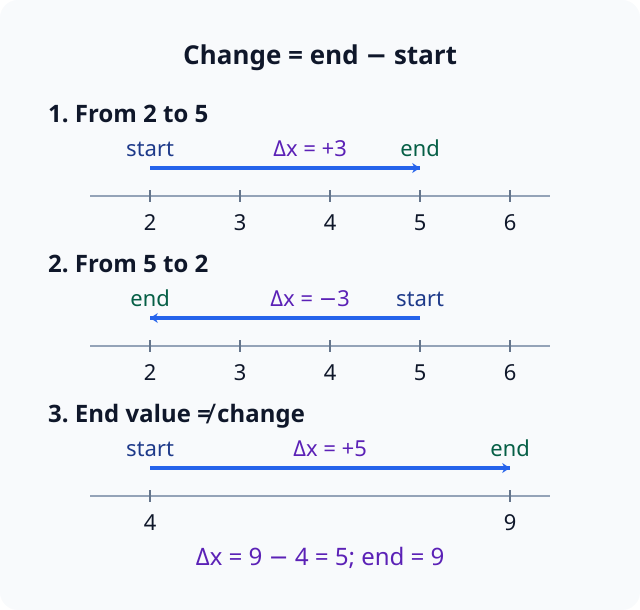
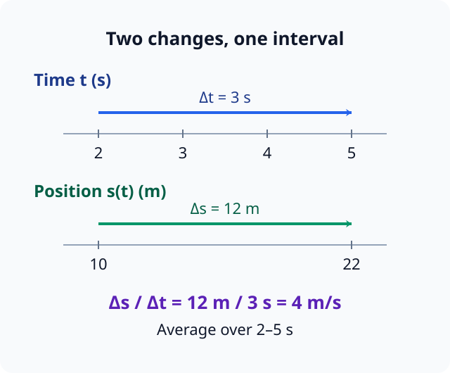
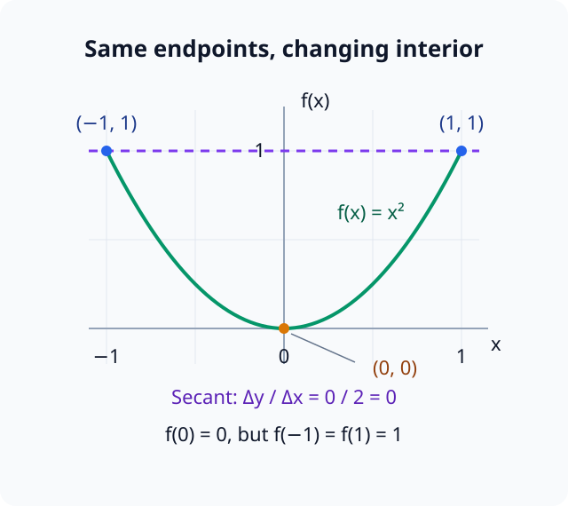
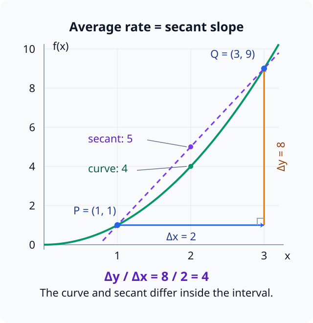
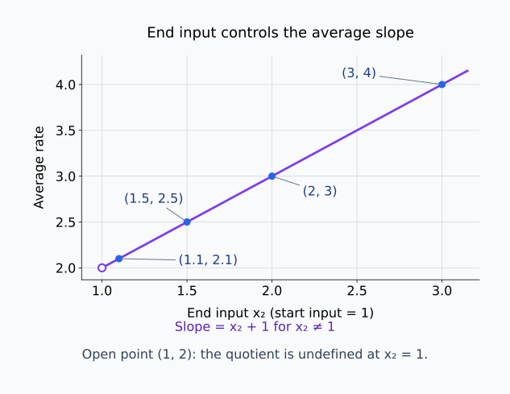
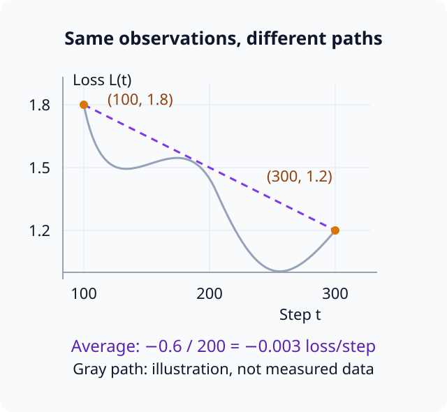

# M01-01. 변화량과 평균변화율

## 이 단원이 필요한 이유

미분은 입력이 조금 변할 때 출력이 얼마나 변하는지 측정한다. 그 출발점은 두 지점 사이의 유한한 변화다. 학습 step이 100만큼 늘었을 때 loss가 얼마나 줄었는지, 입력 점수가 0.2만큼 변했을 때 logit이 얼마나 달라졌는지를 먼저 계산해야 한 점에서의 순간변화율로 넘어갈 수 있다.

변화량은 끝값에서 시작값을 뺀 값이다. 평균변화율은 출력 변화량을 입력 변화량으로 나눈다. 두 값의 부호, 단위와 측정 구간을 함께 읽어야 그래프의 기울기와 실험 결과를 정확히 해석할 수 있다.

## 학습 목표

이 단원을 마치면 다음을 할 수 있다.

- 두 값 사이의 변화량을 $\Delta x$와 $\Delta y$로 나타낼 수 있다.
- 함수의 평균변화율을 식으로 세우고 계산할 수 있다.
- 평균변화율의 부호와 단위를 설명할 수 있다.
- 평균변화율을 그래프의 할선 기울기와 연결할 수 있다.
- 구간 평균과 한 점 주변의 변화율을 구분할 수 있다.

## 선수지식 확인

- 선수 단원: [M00-02 식, 등식과 방정식](../M00/M00-02-expressions-equalities-equations.md)
- 선수 단원: [M00-03 함수의 입력과 출력](../M00/M00-03-functions-input-output.md)
- 선수 단원: [M00-04 좌표와 그래프](../M00/M00-04-coordinates-graphs.md)

다음 질문에 답할 수 있는지 확인한다.

1. $f(x)=x^2$일 때 $f(1)$과 $f(3)$을 계산할 수 있는가?
2. 함수 그래프의 점을 $(x,f(x))$로 쓸 수 있는가?
3. 점 $(1,1)$과 $(3,9)$에서 가로 변화와 세로 변화를 구분할 수 있는가?

## 기호와 용어

| 기호·용어 | Common spoken reading | 의미 | 조건·단위 |
|---|---|---|---|
| $\Delta$ | `delta` | 두 값 사이의 변화량 | “끝값에서 시작값을 뺌” |
| $\Delta x$ | `delta x` | 입력 변화량 $x_2-x_1$ | $x$와 같은 단위 |
| $\Delta y$ | `delta y` | 출력 변화량 $y_2-y_1$ | $y$와 같은 단위 |
| $\dfrac{\Delta y}{\Delta x}$ | `delta y over delta x` | 평균변화율 | $\Delta x\ne0$ |
| 할선 | `secant line` | 그래프 위의 서로 다른 두 점을 잇는 직선 | 두 점이 필요함 |
| 기울기 | `slope` | 가로 변화에 대한 세로 변화의 비 | 출력 단위/입력 단위 |

## 핵심 개념 1. 변화량은 끝값에서 시작값을 뺀다

입력이 $x_1$에서 $x_2$로 변할 때 입력 변화량을

\[
\Delta x=x_2-x_1
\]

로 정의한다.

함수 $y=f(x)$의 출력은 $f(x_1)$에서 $f(x_2)$로 변한다. 출력 변화량은

\[
\Delta y
=
f(x_2)-f(x_1)
\]

이다.

변화량에는 방향이 들어 있다. $x_1=2$, $x_2=5$이면

\[
\Delta x=5-2=3
\]

이다. 순서를 바꾸면

\[
\Delta x=2-5=-3
\]

이 된다. 같은 두 값이라도 시작점과 끝점이 바뀌면 변화량의 부호가 바뀐다.

### 변화량과 끝값을 구분한다

$x$가 $4$에서 $9$로 변하면 끝값은 $9$이고 변화량은

\[
\Delta x=9-4=5
\]

다. 변화량은 끝값 자체가 아니라 두 값의 차이다.

아래 그림에서 같은 두 값의 시작·끝 순서를 바꾸면 화살표 방향과 변화량의 부호가 바뀐다. 마지막 수직 눈금의 값과 화살표에 적힌 변화량도 구분해 읽는다.

<figure class="lesson-figure" markdown="1">

<figcaption>2에서 5로 이동하면 변화량은 +3이고 순서를 뒤집으면 −3이다. 4에서 9로 이동할 때 끝값 9와 변화량 5는 서로 다른 값이다.</figcaption>
</figure>

## 핵심 개념 2. 평균변화율은 두 변화량의 비다

$x_1\ne x_2$일 때 함수 $f$의 $x_1$부터 $x_2$까지 평균변화율은

\[
\frac{\Delta y}{\Delta x}
=
\frac{f(x_2)-f(x_1)}{x_2-x_1}
\]

이다.

이 식은 입력이 한 단위 변할 때 출력이 평균적으로 얼마나 변했는지 나타낸다.

출력 변화량만 비교하면 입력이 얼마나 변했는지 놓친다. 입력 변화량으로 나누면 서로 길이가 다른 구간도 입력 한 단위당 변화로 나타낼 수 있다. 여기서 “한 단위당”은 전체 변화량을 입력의 변화량으로 나누었다는 뜻이며, 구간 안의 매 단위에서 실제로 같은 변화가 일어났다는 뜻은 아니다.

예를 들어 시간 $t$가 $2$초에서 $5$초로 변하는 동안 위치 $s(t)$가 $10$미터에서 $22$미터로 변했다면

\[
\Delta t=5-2=3\text{초}
\]

\[
\Delta s=22-10=12\text{미터}
\]

이다. 평균변화율은

\[
\frac{\Delta s}{\Delta t}
=
\frac{12\text{미터}}{3\text{초}}
=
4\text{미터/초}
\]

다. 이 문맥에서는 평균속도다.

아래 그림은 같은 구간의 시간 변화와 위치 변화를 따로 표시한다. 두 화살표의 수치뿐 아니라 미터와 초의 단위도 함께 나눈다.

<figure class="lesson-figure" markdown="1">

<figcaption>시간 변화 3초와 위치 변화 12미터를 나누면 평균속도는 4미터/초이다. 그림은 두 끝값만 표시하며 중간 시각의 위치는 정하지 않는다.</figcaption>
</figure>

### 분모가 0이면 계산할 수 없다

$x_1=x_2$이면

\[
\Delta x=0
\]

이다. 0으로 나눌 수 없으므로 두 점이 같은 경우에는 평균변화율을 이 식으로 정의하지 않는다. 한 점에서의 변화율은 서로 다른 두 점을 가까이 보내는 극한을 사용해 뒤 단원에서 정의한다.

## 핵심 개념 3. 부호가 변화 방향을 나타낸다

$x_2>x_1$이라고 하자. 이때 $\Delta x>0$이다.

- $\Delta y>0$이면 평균변화율은 양수다. 입력이 증가하는 동안 출력도 증가했다.
- $\Delta y<0$이면 평균변화율은 음수다. 입력이 증가하는 동안 출력은 감소했다.
- $\Delta y=0$이면 평균변화율은 $0$이다. 두 끝점의 출력이 같다.

평균변화율이 $0$이라고 해서 구간 안에서 함수가 변하지 않았다는 뜻은 아니다. 함수가 올라갔다가 내려와 양 끝점에서 같은 값을 가질 수 있다.

예를 들어 $f(x)=x^2$에서 $x=-1$과 $x=1$을 고르면

\[
f(-1)=f(1)=1
\]

이므로

\[
\frac{f(1)-f(-1)}{1-(-1)}
=
\frac{1-1}{2}
=0
\]

이다. 그러나 구간 안의 $f(0)=0$은 끝점 값과 다르다.

두 점의 시작·끝 순서를 함께 뒤집으면 $\Delta x$와 $\Delta y$의 부호가 모두 바뀐다. 비는 $(-\Delta y)/(-\Delta x)=\Delta y/\Delta x$로 같으므로 같은 두 점의 평균변화율은 바뀌지 않는다. 따라서 변화량의 부호와 평균변화율의 부호를 같은 방식으로 해석하지 않는다.

아래 그림에서 수평 할선과 곡선의 가운데를 비교하면 평균변화율 0이 구간 내부의 일정함을 보장하지 않는 이유를 볼 수 있다.

<figure class="lesson-figure" markdown="1">

<figcaption>두 끝점의 높이가 1로 같으므로 할선의 기울기는 0이다. 곡선은 구간 안에서 높이 0까지 내려갔다가 다시 올라온다.</figcaption>
</figure>

## 핵심 개념 4. 평균변화율에는 단위가 있다

분수

\[
\frac{\Delta y}{\Delta x}
\]

의 단위는

\[
\frac{\text{출력 단위}}{\text{입력 단위}}
\]

다.

훈련 step에 따른 loss에서 가로축이 step이고 세로축 loss가 무단위라면 평균변화율의 단위는 “step당 loss”다. 입력 길이가 token 수이고 출력이 실행시간 초라면 단위는 “token당 초”다.

두 연구가 같은 수치의 기울기를 보고해도 축의 단위가 다르면 같은 변화율로 비교할 수 없다.

## 핵심 개념 5. 그래프에서는 할선의 기울기다

함수 그래프 위의 두 점

\[
P=(x_1,f(x_1))
\]

\[
Q=(x_2,f(x_2))
\]

를 잇는 직선을 할선(secant line)이라고 한다.

할선의 가로 변화량은

\[
x_2-x_1
\]

이고 세로 변화량은

\[
f(x_2)-f(x_1)
\]

이다. 따라서 할선의 기울기는 함수의 평균변화율과 같다.

\[
\text{할선의 기울기}
=
\frac{f(x_2)-f(x_1)}{x_2-x_1}
\]

할선은 두 끝점을 연결한 직선이고, 그 사이의 함수 그래프는 곡선일 수 있다. 할선과 함수 그래프는 선택한 두 점에서는 만나지만 중간의 모든 점에서 같을 필요는 없다. 평균변화율은 이 할선의 일정한 기울기를 나타내므로 실제 함수의 구간 내부 변화까지 일정하다고 정하지 않는다.

두 점 사이의 구간을 좁히면 할선의 기울기가 한 점에서의 접선 기울기에 가까워질 수 있다. 이 과정에 극한을 적용하면 미분을 정의할 수 있다.

아래 그림에서 가로 변화 2와 세로 변화 8이 만드는 직각삼각형을 따라가면 할선의 기울기 4를 읽을 수 있다. $x=2$에서 할선과 곡선의 높이도 비교한다.

<figure class="lesson-figure lesson-figure--wide" markdown="1">

<figcaption>할선의 기울기는 세로 변화 8을 가로 변화 2로 나눈 4이다. 두 끝점 사이의 x=2에서는 할선의 높이가 5이고 함수값은 4이므로 할선이 실제 함수 그래프와 같지는 않다.</figcaption>
</figure>

## 예제 1. 이차함수의 평균변화율

### 문제

\[
f(x)=x^2
\]

의 $x=1$부터 $x=3$까지 평균변화율을 구하라.

### 풀이

입력 변화량은

\[
\Delta x=3-1=2
\]

이다. 출력은

\[
f(1)=1,\qquad f(3)=9
\]

이므로 출력 변화량은

\[
\Delta y=9-1=8
\]

이다.

평균변화율은

\[
\frac{\Delta y}{\Delta x}
=
\frac82
=4
\]

다.

### 결과의 의미

$x$가 $1$에서 $3$으로 변하는 구간에서 $f(x)$는 입력 한 단위당 평균 $4$만큼 증가했다. 이 값은 구간 전체를 요약하며 $x=1$이나 $x=3$ 한 점의 순간변화율을 뜻하지 않는다.

## 예제 2. 구간을 좁혀 보기

$f(x)=x^2$에서 시작점을 $x_1=1$로 고정하고 끝점을 바꿔보자.

| $x_2$ | $\Delta x=x_2-1$ | $\Delta y=x_2^2-1$ | 평균변화율 |
|---:|---:|---:|---:|
| $3$ | $2$ | $8$ | $4$ |
| $2$ | $1$ | $3$ | $3$ |
| $1.5$ | $0.5$ | $1.25$ | $2.5$ |
| $1.1$ | $0.1$ | $0.21$ | $2.1$ |

$x_2$가 $1$에 가까워질수록 평균변화율은 $2$에 가까워진다. 다음 단원에서는 “가까워진다”를 극한 기호로 나타낸다.

이 표는 값의 경향을 보여주지만 몇 개의 행만으로 극한을 증명하지는 않는다. $f(x)=x^2$에서는 식을 정리해 같은 결과를 일반적으로 확인할 수 있다.

\[
\frac{x_2^2-1}{x_2-1}
=
\frac{(x_2-1)(x_2+1)}{x_2-1}
=
x_2+1
\]

$x_2\ne1$에서 약분할 수 있고, $x_2$가 $1$에 가까워지면 $x_2+1$은 $2$에 가까워진다.

아래 그림은 표의 끝 입력 $x_2$를 가로축, 평균변화율을 세로축에 놓는다. 빈 점은 $x_2=1$에서 원래 분수의 분모가 0이 된다는 조건을 표시한다.

<figure class="lesson-figure lesson-figure--wide" markdown="1">

<figcaption>끝 입력이 3, 2, 1.5, 1.1로 시작점 1에 가까워지면 할선의 기울기는 4, 3, 2.5, 2.1로 변한다. 빈 점 (1, 2)은 가까워지는 값을 표시하며 x₂=1에서 평균변화율을 계산했다는 뜻은 아니다.</figcaption>
</figure>

## 예제 3. 학습 곡선의 평균 변화

어떤 모델의 훈련 loss를 기록했다고 하자.

| 학습 step $t$ | loss $L(t)$ |
|---:|---:|
| $100$ | $1.8$ |
| $300$ | $1.2$ |

변화량은

\[
\Delta t=300-100=200
\]

\[
\Delta L=1.2-1.8=-0.6
\]

이다. 평균변화율은

\[
\frac{\Delta L}{\Delta t}
=
\frac{-0.6}{200}
=
-0.003
\]

이다.

이 구간에서 훈련 loss는 step 하나당 평균 $0.003$ 감소했다. 두 끝점만 사용했으므로 중간 step에서 loss가 매번 같은 양만큼 감소했다고 말할 수는 없다.

아래 그림의 점선과 회색 경로는 같은 두 끝점을 잇는다. 회색 선은 가능한 중간 변화의 설명용 예시이며 실제 측정 결과가 아니다.

<figure class="lesson-figure lesson-figure--wide" markdown="1">

<figcaption>관찰한 값은 두 주황색 점이다. 보라색 할선은 −0.003 loss/step을 요약하지만 회색 경로처럼 중간 변화가 일정하지 않아도 같은 두 끝점과 평균변화율을 가질 수 있다.</figcaption>
</figure>

## 예제 4. 입력 교란과 출력 변화

모델 점수를 스칼라 함수 $s(x)$로 단순화하자. 입력 특성 $x$를 $2.0$에서 $2.2$로 바꿨을 때 점수가 $0.7$에서 $0.82$로 변했다.

\[
\Delta x=2.2-2.0=0.2
\]

\[
\Delta s=0.82-0.7=0.12
\]

평균변화율은

\[
\frac{\Delta s}{\Delta x}
=
\frac{0.12}{0.2}
=0.6
\]

이다.

이 수치는 선택한 두 입력 사이의 평균 민감도를 나타낸다. 다른 입력 구간이나 더 작은 교란에서도 같은 값이 나오는지는 별도로 측정해야 한다.

## 흔한 오해

### 오해 1. $\Delta x$는 $x$와 $\Delta$의 곱이다

$\Delta x$는 입력 $x$의 변화량을 나타내는 하나의 표기다. 이 단원에서 $\Delta$는 “끝값에서 시작값을 뺀다”는 연산을 나타낸다.

### 오해 2. 변화량은 큰 값에서 작은 값을 뺀 양수다

변화량은 끝값에서 시작값을 뺀다. 감소한 경우 변화량은 음수다. 절댓값만 사용하면 변화 방향을 잃는다.

### 오해 3. 평균변화율은 두 함수값의 평균이다

평균변화율은

\[
\frac{f(x_2)-f(x_1)}{x_2-x_1}
\]

이다. 함수값의 산술평균

\[
\frac{f(x_1)+f(x_2)}2
\]

와 다른 양이다.

### 오해 4. 평균변화율이 $0$이면 함수가 구간 내내 일정하다

평균변화율 $0$은 두 끝점의 출력이 같다는 뜻이다. 구간 내부에서 함수가 변했는지는 추가로 확인해야 한다.

### 오해 5. 짧은 구간의 평균변화율은 순간변화율과 같다

구간이 짧으면 근사가 좋아질 수 있지만 두 값은 정의가 다르다. 순간변화율은 구간 길이가 0으로 가까워지는 극한으로 정의한다.

## 연습문제

### 1. 변화량 계산

$x$가 $7$에서 $2$로 변했다. $\Delta x$를 구하고 부호의 의미를 설명하라.

해설 보기

\[
\Delta x=2-7=-5
\]

이다. 음수 부호는 끝값이 시작값보다 작아서 $x$가 감소했음을 나타낸다.

### 2. 함수의 출력 변화량

\[
f(x)=3x-1
\]

일 때 $x=2$에서 $x=5$까지의 $\Delta x$와 $\Delta y$를 구하라.

해설 보기

\[
\Delta x=5-2=3
\]

이다.

\[
f(2)=5,\qquad f(5)=14
\]

이므로

\[
\Delta y=14-5=9
\]

이다.

### 3. 평균변화율

연습문제 2의 함수와 구간에서 평균변화율을 구하라.

해설 보기

\[
\frac{\Delta y}{\Delta x}
=
\frac93
=3
\]

이다. $f(x)=3x-1$은 입력 한 단위당 출력이 $3$씩 변하는 직선이므로 어느 두 점을 골라도 평균변화율이 $3$이다.

### 4. 음의 평균변화율

\[
g(t)=10-2t
\]

일 때 $t=1$부터 $t=4$까지 평균변화율을 구하고 해석하라.

해설 보기

\[
g(1)=8,\qquad g(4)=2
\]

이므로

\[
\Delta g=2-8=-6
\]

이고

\[
\Delta t=4-1=3
\]

이다. 평균변화율은

\[
\frac{-6}{3}=-2
\]

다. 이 구간에서 $t$가 한 단위 증가할 때 $g(t)$는 평균 $2$만큼 감소한다.

### 5. 단위 해석

입력 $n$이 token 수이고 출력 $T(n)$이 실행시간을 초로 나타낸다고 하자. $n=100$에서 $T=0.4$, $n=300$에서 $T=1.0$이었다. 평균변화율과 단위를 구하라.

해설 보기

\[
\Delta n=300-100=200\text{ token}
\]

\[
\Delta T=1.0-0.4=0.6\text{초}
\]

이므로

\[
\frac{\Delta T}{\Delta n}
=
\frac{0.6}{200}
=0.003\text{초/token}
\]

이다. 측정 구간에서 token 하나가 늘 때 실행시간이 평균 $0.003$초 증가했다.

### 6. 평균변화율 $0$ 해석

\[
h(x)=(x-2)^2
\]

의 $x=1$부터 $x=3$까지 평균변화율을 구하고, 함수가 구간 내내 일정한지 판단하라.

해설 보기

\[
h(1)=1,\qquad h(3)=1
\]

이므로

\[
\frac{h(3)-h(1)}{3-1}
=
\frac{1-1}{2}
=0
\]

이다.

그러나

\[
h(2)=0
\]

이므로 함수는 구간 내부에서 변한다. 평균변화율 $0$은 두 끝점의 출력이 같다는 뜻이다.

### 7. 주장 판단

훈련 step $100$과 $200$에서 loss가 각각 $1.0$과 $0.8$이었다. 연구자가 “이 구간의 모든 step에서 loss가 $0.002$씩 감소했다”고 말했다. 평균변화율을 계산하고 주장을 판단하라.

해설 보기

\[
\frac{0.8-1.0}{200-100}
=
\frac{-0.2}{100}
=-0.002
\]

이다.

이 값은 구간 전체의 평균변화율이다. 두 끝점만으로 각 step의 변화량이 모두 $-0.002$였다고 말할 수 없다. 중간 loss 기록이 있어야 step별 변화가 일정했는지 확인할 수 있다.

## 단원 요약

- 변화량은 끝값에서 시작값을 뺀 값이며 방향에 따라 부호가 달라진다.
- 평균변화율은 $\Delta y/\Delta x$이며 $\Delta x\ne0$이어야 한다.
- 평균변화율의 단위는 출력 단위를 입력 단위로 나눈 것이다.
- 함수 그래프에서 평균변화율은 두 점을 잇는 할선의 기울기다.
- 구간 평균은 한 점의 순간변화율이나 구간 내부의 세부 변화를 정하지 않는다.

## 통과 기준

다음 질문에 자료를 보지 않고 답할 수 있으면 통과한다.

- $\Delta x$와 $\Delta y$를 끝값과 시작값으로 쓸 수 있는가?
- 함수의 평균변화율을 계산할 수 있는가?
- 변화율의 부호와 단위를 설명할 수 있는가?
- 평균변화율을 할선의 기울기와 연결할 수 있는가?
- 구간 평균에서 추론할 수 없는 내용을 한 가지 말할 수 있는가?

## 다음 단원

다음 단원은 [M01-02 극한의 직관](M01-02-limits-intuition.md)이다. 서로 다른 두 점 사이의 간격을 줄일 때 함수값과 평균변화율이 어떤 값에 가까워지는지 읽는다.

## 집필자 점검표

- [x] 학습 목표가 관찰 가능한 행동으로 작성됐다.
- [x] $\Delta$ 기호와 뺄셈 순서를 정의했다.
- [x] 평균변화율의 분모 조건과 단위를 명시했다.
- [x] 수치 예제와 표의 값을 검산했다.
- [x] 모든 문제에 해설이 있다.
- [x] 구간 평균과 순간변화율의 주장을 구분했다.
- [x] 용어집과 표기 규칙을 따랐다.
- [x] 내부 링크와 수식 구분자를 확인했다.
- [x] Common spoken reading이 실제 영어 학술 발화이며 한글 음역이나 기계적 직역을 포함하지 않는다.
