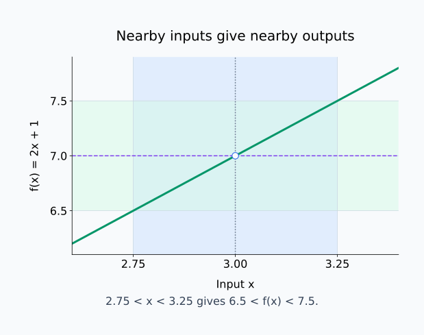
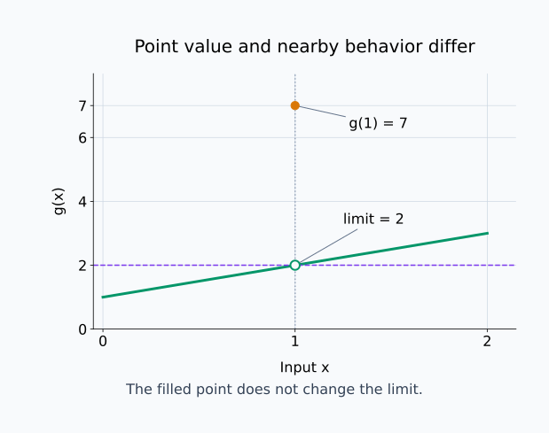
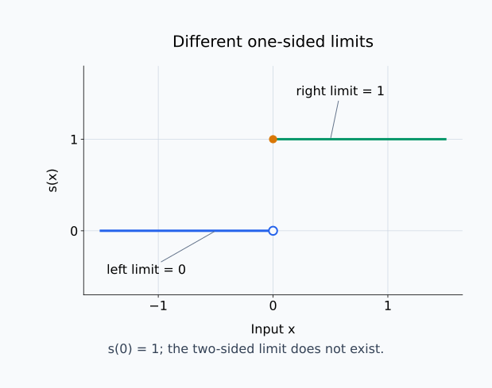
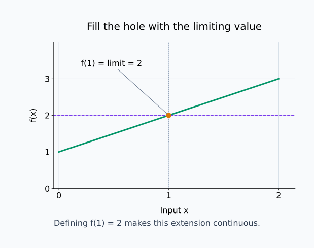
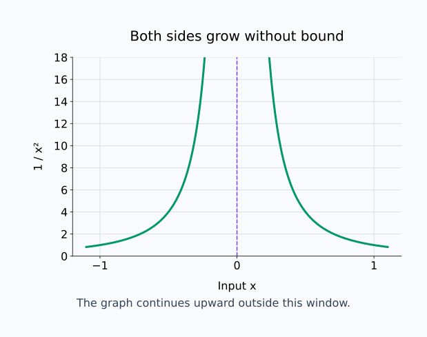
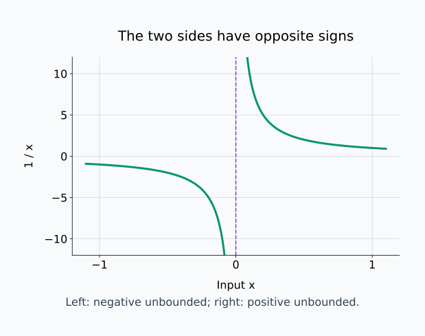
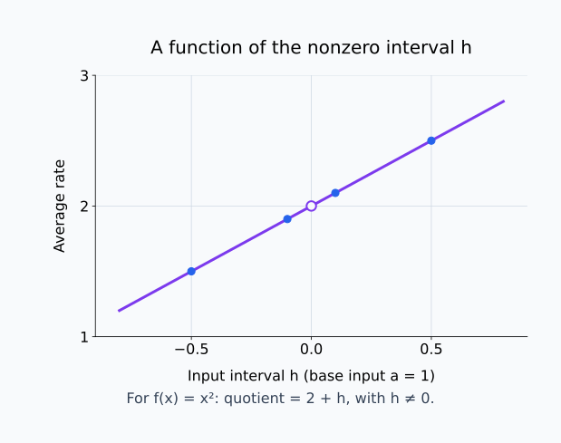

# M01-02. 극한의 직관

## 이 단원이 필요한 이유

순간변화율을 계산하려면 두 점 사이의 간격을 줄여야 한다. 입력 변화량 $\Delta x$를 작게 만들면 평균변화율의 분모와 분자가 함께 변한다. $\Delta x=0$을 바로 대입하면 0으로 나누게 되므로, 0이 되기 전의 값들이 어디에 가까워지는지 살펴봐야 한다.

극한은 입력이 특정 값에 가까워질 때 함수값이 가까워지는 값을 나타낸다. 함수가 그 점에서 정의되지 않았거나 다른 값을 가져도 극한은 존재할 수 있다. 이 구분은 미분의 정의, 수치 근사와 신경망의 국소 변화를 읽을 때 필요하다.

## 학습 목표

이 단원을 마치면 다음을 할 수 있다.

- $\lim_{x\to a}f(x)=L$을 한국어 문장으로 읽을 수 있다.
- 함수값 $f(a)$와 $x\to a$에서의 극한을 구분할 수 있다.
- 표와 간단한 식에서 극한값을 추정하고 계산할 수 있다.
- 좌극한과 우극한을 비교해 양쪽 극한의 존재를 판단할 수 있다.
- 극한과 연속성, 미분의 관계를 입문 수준에서 설명할 수 있다.

## 선수지식 확인

- 선수 단원: [M00-03 함수의 입력과 출력](../M00/M00-03-functions-input-output.md)
- 선수 단원: [M00-04 좌표와 그래프](../M00/M00-04-coordinates-graphs.md)
- 선수 단원: [M01-01 변화량과 평균변화율](M01-01-change-average-rate.md)

다음 식을 계산할 수 있는지 확인한다.

\[
\frac{x^2-1}{x-1}
\]

$x\ne1$이면 분자를 인수분해할 수 있다.

\[
\frac{(x-1)(x+1)}{x-1}=x+1
\]

$x=1$에서는 원래 식의 분모가 0이므로 정의되지 않는다. 극한은 $x=1$을 제외한 주변 값을 살핀다.

## 기호와 용어

| 기호·용어 | Common spoken reading | 의미 | 주의점 |
|---|---|---|---|
| $x\to a$ | `x approaches a` | $x$가 $a$와 다른 값을 가지며 $a$에 가까워짐 | $x=a$를 뜻하지 않음 |
| $\lim_{x\to a}f(x)$ | `the limit of f of x as x approaches a` | $x$가 $a$에 가까워질 때 $f(x)$가 가까워지는 값 | 존재하지 않을 수 있음 |
| $L$ | `L` | 극한값 | 유한한 실수인 경우 |
| $x\to a^-$ | `x approaches a from the left` | $a$보다 작은 값에서 접근 | 좌극한 |
| $x\to a^+$ | `x approaches a from the right` | $a$보다 큰 값에서 접근 | 우극한 |
| 연속 | `continuous` | 극한값과 함수값이 같은 성질 | 점 $a$에서 정의되어야 함 |

## 핵심 개념 1. 가까워지는 과정을 나타낸다

\[
\lim_{x\to a}f(x)=L
\]

은 “$x$가 $a$에 가까워질 때 $f(x)$가 $L$에 가까워진다”라고 읽는다.

$x$는 $a$와 같을 필요가 없다. 오히려 극한을 살필 때는 $a$ 주변의 다른 값들을 사용한다. $a$보다 작은 값과 큰 값에서 접근하며 함수값이 한 값에 모이는지 확인한다.

“가까워진다”는 말은 함수값에 원하는 오차 범위를 정하면, 입력을 $a$에 충분히 가깝게 제한해 그 범위 안의 모든 허용 입력에서 함수값을 $L$의 오차 범위 안에 둘 수 있다는 뜻이다. 더 작은 출력 오차를 요구하면 입력의 범위도 그에 맞게 좁힐 수 있어야 한다. 이 과정에서는 $x=a$인 한 점을 제외한다. 함수값이 한 번 $L$ 근처에 왔다는 사실만으로 극한을 정하지 않는다.

예를 들어

\[
f(x)=2x+1
\]

에서 $x$가 $3$에 가까워지면 $f(x)$는 $7$에 가까워진다.

\[
\lim_{x\to3}(2x+1)=7
\]

이 함수에서는 $x=3$을 바로 대입해도 같은 값을 얻는다. 모든 극한이 대입만으로 계산되는 것은 아니다.

아래 그림은 입력을 3 주변으로 제한했을 때 함수값도 7 주변에 놓이는 관계를 보여 준다. 파란 입력 범위와 초록 출력 범위를 함께 읽는다.

<figure class="lesson-figure lesson-figure--wide" markdown="1">

<figcaption>입력이 2.75와 3.25 사이에 있으면 출력은 6.5와 7.5 사이에 있다. 극한에서는 중앙 한 점의 값보다 그 점을 제외한 주변 입력들의 출력을 확인한다.</figcaption>
</figure>

## 핵심 개념 2. 함수값과 극한값은 다른 질문이다

다음 함수를 생각하자.

\[
f(x)=\frac{x^2-1}{x-1},
\qquad x\ne1
\]

$x\ne1$에서는

\[
f(x)=x+1
\]

로 정리된다. $x$가 $1$에 가까워지면 $x+1$은 $2$에 가까워진다.

\[
\lim_{x\to1}\frac{x^2-1}{x-1}=2
\]

그러나 $x=1$을 원래 식에 넣으면 분모가 0이므로 $f(1)$은 정의되지 않는다.

\[
f(1)\text{은 정의되지 않음},
\qquad
\lim_{x\to1}f(x)=2
\]

두 문장은 함께 성립한다. 극한은 점에서의 값보다 주변에서의 행동을 묻는다.

약분한 식 $x+1$은 $x=1$에서도 계산할 수 있지만, 그 사실이 원래 분수의 $f(1)$을 새로 정의하지는 않는다. 극한 계산에 약분한 식을 사용하는 이유는 $x=1$을 제외한 주변 입력에서 두 식의 값이 같기 때문이다. 점의 함수값은 달라도 주변 값이 같으면 그 점으로 접근하는 극한은 같다.

### 점의 값을 바꿔도 극한은 유지될 수 있다

함수 $g$를

\[
g(x)=
\begin{cases}
\dfrac{x^2-1}{x-1}, & x\ne1,\\
7, & x=1
\end{cases}
\]

로 정의하자.

\[
g(1)=7
\]

이지만 $x=1$ 주변에서는 이전 함수와 값이 같으므로

\[
\lim_{x\to1}g(x)=2
\]

이다. 한 점의 함수값을 바꾸는 일은 그 점 주변의 극한을 바꾸지 않는다.

아래 그림의 빈 점은 주변 값이 가까워지는 높이이고, 주황색 점은 따로 정의한 함수값이다.

<figure class="lesson-figure lesson-figure--wide" markdown="1">

<figcaption>왼쪽과 오른쪽에서 선을 따라 접근하면 높이 2에 가까워진다. g(1)=7인 주황색 점을 추가해도 x=1 주변의 값과 극한 2는 그대로다.</figcaption>
</figure>

## 핵심 개념 3. 표에서 양쪽의 경향을 본다

\[
f(x)=\frac{x^2-1}{x-1},
\qquad x\ne1
\]

의 값을 $1$ 주변에서 계산해보자.

| $x$ | $f(x)$ |
|---:|---:|
| $0.9$ | $1.9$ |
| $0.99$ | $1.99$ |
| $0.999$ | $1.999$ |
| $1.001$ | $2.001$ |
| $1.01$ | $2.01$ |
| $1.1$ | $2.1$ |

왼쪽과 오른쪽에서 $x$가 $1$에 가까워질수록 $f(x)$는 $2$에 가까워진다.

표는 극한을 추정하는 데 도움을 주지만 유한한 행만으로 모든 주변 값을 확인할 수는 없다. 이 예에서는 식을 $x+1$로 정리해 극한을 확인한다.

## 핵심 개념 4. 좌극한과 우극한이 같아야 한다

왼쪽에서 접근하는 극한은

\[
\lim_{x\to a^-}f(x)
\]

로 쓰고 좌극한이라고 한다. 오른쪽에서 접근하는 극한은

\[
\lim_{x\to a^+}f(x)
\]

로 쓰고 우극한이라고 한다.

양쪽 극한

\[
\lim_{x\to a}f(x)
\]

이 존재하려면 좌극한과 우극한이 존재하고 서로 같아야 한다.

\[
\lim_{x\to a^-}f(x)
=
\lim_{x\to a^+}f(x)
=L
\]

이면

\[
\lim_{x\to a}f(x)=L
\]

이다.

양쪽 극한은 접근 방향을 한쪽으로 제한하지 않는다. 입력을 같은 점에 가깝게 골라도 왼쪽에서는 한 값, 오른쪽에서는 다른 값으로 향한다면 주변의 모든 입력에서 가까워질 공통 값 하나를 정할 수 없다. 그래서 한쪽 극한이 존재하는지만 확인하지 않고 두 값이 일치하는지도 확인한다.

### 좌우 값이 다른 예

\[
s(x)=
\begin{cases}
0, & x<0,\\
1, & x\ge0
\end{cases}
\]

라고 하자.

$0$보다 작은 쪽에서 접근하면 함수값은 $0$이므로

\[
\lim_{x\to0^-}s(x)=0
\]

이다.

$0$보다 큰 쪽에서 접근하면 함수값은 $1$이므로

\[
\lim_{x\to0^+}s(x)=1
\]

이다. 두 값이 다르므로

\[
\lim_{x\to0}s(x)
\]

는 존재하지 않는다.

함수값은 $s(0)=1$로 정의되어 있지만 양쪽 극한의 존재 여부를 바꾸지 않는다.

아래 그림에서는 왼쪽 수평선과 오른쪽 수평선의 높이가 다르다. 한 점의 함수값을 정해도 이 차이는 남는다.

<figure class="lesson-figure lesson-figure--wide" markdown="1">

<figcaption>좌극한은 0이고 우극한은 1이므로 두 방향에서 가까워질 공통 값이 없다. 주황색 점은 s(0)=1을 표시한다.</figcaption>
</figure>

## 핵심 개념 5. 연속성은 극한과 함수값을 연결한다

함수 $f$가 점 $a$에서 연속(continuous)이라는 말은 다음 세 조건을 만족한다는 뜻이다.

1. $f(a)$가 정의되어 있다.
2. $\lim_{x\to a}f(x)$가 존재한다.
3. $\lim_{x\to a}f(x)=f(a)$다.

다항함수 $f(x)=x^2+1$은 모든 실수에서 연속이다. 따라서

\[
\lim_{x\to a}(x^2+1)=a^2+1
\]

처럼 대입으로 극한을 계산할 수 있다.

앞의

\[
\frac{x^2-1}{x-1}
\]

은 $x=1$에서 정의되지 않으므로 그 점에서 연속이 아니다. 극한값 $2$로 함수값을 새로 정의하면 구멍을 메워 연속으로 만들 수 있다.

아래 그림은 앞의 빈 점에 극한값과 같은 높이의 함수값을 추가한 경우다.

<figure class="lesson-figure lesson-figure--wide" markdown="1">

<figcaption>새로 정의한 f(1)=2는 주변 값의 극한 2와 같다. 이 경우 함수값의 존재, 극한의 존재, 두 값의 일치라는 세 조건을 모두 만족한다.</figcaption>
</figure>

## 핵심 개념 6. 무한히 커지는 경우

\[
f(x)=\frac1{x^2}
\]

에서 $x$가 $0$에 가까워지면 $x^2$은 양수인 채로 $0$에 가까워진다. 그 역수는 제한 없이 커진다.

\[
\lim_{x\to0}\frac1{x^2}=+\infty
\]

라고 쓴다.

$+\infty$는 실수 하나가 아니다. 이 표기는 함수값이 임의로 큰 양수보다 커질 수 있음을 나타낸다. 따라서 “극한값이 실수 $+\infty$다”라고 읽기보다 “함수값이 양의 방향으로 제한 없이 커진다”고 읽는다.

큰 기준값을 하나 정하면 $0$에 충분히 가까운 모든 0이 아닌 입력에서 함수값이 그 기준보다 커야 한다. 기준값을 더 크게 잡아도 입력을 더 좁혀 이 조건을 만족할 수 있어야 한다. 일부 입력에서 큰 값이 나온다는 사실만으로는 이 극한을 주장할 수 없다.

아래 그림의 위쪽 잘림은 함수값의 상한이 아니다. 0에 더 가깝게 접근하면 표시 범위보다 더 큰 값이 나온다.

<figure class="lesson-figure lesson-figure--wide" markdown="1">

<figcaption>1/x²은 양쪽에서 양수인 채 커진다. 가로축의 0에 함수값을 찍지 않으며, 그림 밖에서도 그래프가 위쪽으로 계속 이어진다.</figcaption>
</figure>

\[
\frac1x
\]

에서는 $x\to0^+$일 때 $+\infty$로, $x\to0^-$일 때 $-\infty$로 향한다. 좌우 행동이 다르므로 하나의 양쪽 실수 극한이 존재하지 않는다.

아래 그림은 제곱을 하지 않은 역수에서 왼쪽과 오른쪽의 부호가 달라지는 모습을 보여 준다.

<figure class="lesson-figure lesson-figure--wide" markdown="1">

<figcaption>1/x은 0의 왼쪽에서 음의 방향, 오른쪽에서 양의 방향으로 제한 없이 커진다. 따라서 1/x²과 같은 양쪽 행동으로 읽을 수 없다.</figcaption>
</figure>

## 핵심 개념 7. 평균변화율의 구간을 0에 가깝게 만든다

$x=a$에서 시작해 입력을 $h$만큼 바꾸면 끝점은 $a+h$다.

\[
\Delta x=h
\]

\[
\Delta y=f(a+h)-f(a)
\]

평균변화율은

\[
\frac{f(a+h)-f(a)}{h}
\]

이다. $h=0$이면 분모가 0이므로 계산할 수 없다. $h$가 0과 다른 값을 유지한 채 0에 가까워질 때의 극한을 생각한다.

여기서는 시작점 $a$를 고정하고 간격 $h$만 바꾼다. 각 $h\ne0$에 대해 평균변화율 하나를 계산하므로, 평균변화율 자체를 $h$에 따라 달라지는 함수로 보는 것이다. $h>0$이면 끝점이 $a$의 오른쪽에 있고 $h<0$이면 왼쪽에 있다. 두 방향에서 같은 값에 가까워지는지를 확인해야 한다.

\[
\lim_{h\to0}
\frac{f(a+h)-f(a)}{h}
\]

이 극한이 유한한 실수로 존재하면 $a$에서의 순간변화율을 정의할 수 있다. 다음 단원에서는 이 값을 도함수 기호로 나타낸다.

아래 그림에서는 기준점을 1로 고정한 x²의 평균변화율을 h의 함수로 그린다. 왼쪽과 오른쪽의 비가 같은 높이로 접근하는지 확인한다.

<figure class="lesson-figure lesson-figure--wide" markdown="1">

<figcaption>h가 음수이거나 양수여도 0에 가까워지면 평균변화율 2+h는 2에 가까워진다. 빈 점은 h=0에서 원래 차분몫을 계산할 수 없음을 표시한다.</figcaption>
</figure>

## 예제 1. 식을 정리해 극한 구하기

### 문제

\[
\lim_{x\to2}
\frac{x^2-4}{x-2}
\]

를 구하라.

### 풀이

$x=2$를 바로 넣으면 $0/0$이 된다. $x\ne2$인 주변에서는 분자를 인수분해할 수 있다.

\[
x^2-4=(x-2)(x+2)
\]

따라서

\[
\frac{x^2-4}{x-2}
=
x+2,
\qquad x\ne2
\]

이다. $x$가 $2$에 가까워지면 $x+2$는 $4$에 가까워진다.

\[
\lim_{x\to2}
\frac{x^2-4}{x-2}
=4
\]

이다.

## 예제 2. 함수값과 극한 비교

\[
g(x)=
\begin{cases}
x+2, & x\ne2,\\
100, & x=2
\end{cases}
\]

라고 하자.

\[
g(2)=100
\]

이다. 그러나 $x=2$ 주변에서 $g(x)=x+2$이므로

\[
\lim_{x\to2}g(x)=4
\]

이다. 함수값과 극한값이 다르므로 $g$는 $x=2$에서 연속이 아니다.

## 예제 3. ReLU의 극한과 모서리

정류 선형 단위(rectified linear unit, ReLU)는

\[
\operatorname{ReLU}(x)
=
\max(0,x)
\]

이다.

$x<0$에서는 함수값이 $0$이므로

\[
\lim_{x\to0^-}\operatorname{ReLU}(x)=0
\]

이다. $x>0$에서는 함수값이 $x$이므로

\[
\lim_{x\to0^+}\operatorname{ReLU}(x)=0
\]

이다.

좌극한과 우극한이 같고 $\operatorname{ReLU}(0)=0$이므로 ReLU는 $0$에서 연속이다.

그래프는 $0$에서 모서리를 가진다. 연속이라는 사실만으로 미분 가능성이 보장되지는 않는다. 다음 단원에서 왼쪽과 오른쪽 변화율을 비교한다.

## 예제 4. 모델 출력의 국소 안정성

scalar 입력 $x$에 대한 모델 점수를 $s(x)$라고 하자.

\[
\lim_{x\to a}s(x)=s(a)
\]

이면 $s$는 $a$에서 연속이다. 입력을 $a$에 가깝게 고르면 출력도 $s(a)$에 가깝게 만들 수 있다는 뜻이다.

이 조건은 $a$ 주변의 작은 변화에 관한 수학적 성질이다. 허용할 입력 거리와 출력 오차를 수치로 정해야 실제 안정성 기준을 평가할 수 있다. 한 점의 연속성만으로 큰 교란, 다른 데이터 영역이나 적대적 강건성(adversarial robustness)을 보장할 수는 없다.

## 흔한 오해

### 오해 1. $x\to a$는 $x=a$라는 뜻이다

$x\to a$는 $x$가 $a$ 주변의 값들을 가지며 가까워지는 과정을 나타낸다. 극한은 $x=a$에서의 함수값과 별도로 존재할 수 있다.

### 오해 2. 극한은 함수에 $a$를 대입한 값이다

연속인 함수에서는 대입으로 극한을 계산할 수 있다. 함수가 그 점에서 정의되지 않거나 함수값이 주변 경향과 다르면 극한과 함수값이 달라진다.

### 오해 3. 표에서 값 몇 개가 모이면 극한이 증명된다

표는 경향을 추정하는 도구다. 선택하지 않은 주변 값의 행동까지 보장하려면 식의 성질이나 엄밀한 정의를 사용해야 한다.

### 오해 4. 좌극한과 우극한 중 하나만 존재하면 양쪽 극한도 존재한다

양쪽 극한에는 두 방향의 극한이 모두 필요하며 값도 같아야 한다.

### 오해 5. 연속이면 미분 가능하다

연속은 함수값이 끊기지 않는 조건이다. ReLU처럼 연속이지만 모서리에서 미분할 수 없는 함수가 있다.

## 연습문제

### 1. 극한 기호 읽기

\[
\lim_{x\to3}f(x)=5
\]

를 한국어 문장으로 설명하고, 이 식만으로 $f(3)=5$라고 결론 내릴 수 있는지 판단하라.

해설 보기

“$x$가 $3$에 가까워질 때 $f(x)$가 $5$에 가까워진다”라고 읽는다.

이 식만으로 $f(3)=5$라고 결론 내릴 수 없다. $f(3)$이 정의되지 않았거나 다른 값으로 정의됐을 수 있다. $f$가 $3$에서 연속이라는 조건이 추가되면 $f(3)=5$다.

### 2. 대입으로 계산하는 극한

\[
\lim_{x\to2}(3x^2-x+1)
\]

을 구하라.

해설 보기

다항함수는 실수 전체에서 연속이므로 $x=2$를 대입한다.

\[
3\cdot2^2-2+1
=
12-2+1
=11
\]

따라서 극한은 $11$이다.

### 3. 인수분해를 사용하는 극한

\[
\lim_{x\to3}
\frac{x^2-9}{x-3}
\]

을 구하라.

해설 보기

$x=3$을 바로 넣으면 $0/0$이 된다. 분자를 인수분해한다.

\[
x^2-9=(x-3)(x+3)
\]

$x\ne3$인 주변에서

\[
\frac{x^2-9}{x-3}=x+3
\]

이다. 따라서

\[
\lim_{x\to3}
\frac{x^2-9}{x-3}
=6
\]

이다.

### 4. 함수값과 극한

\[
h(x)=
\begin{cases}
2x, & x\ne1,\\
-4, & x=1
\end{cases}
\]

일 때 $h(1)$과 $\lim_{x\to1}h(x)$를 각각 구하고 $x=1$에서 연속인지 판단하라.

해설 보기

정의에서

\[
h(1)=-4
\]

다. $x=1$ 주변에서는 $h(x)=2x$이므로

\[
\lim_{x\to1}h(x)=2
\]

다. 극한값과 함수값이 다르므로 $h$는 $x=1$에서 연속이 아니다.

### 5. 좌극한과 우극한

\[
q(x)=
\begin{cases}
-1, & x<2,\\
3, & x\ge2
\end{cases}
\]

일 때 $x=2$에서 좌극한, 우극한과 양쪽 극한을 구하라.

해설 보기

$2$보다 작은 쪽에서는 함수값이 $-1$이므로

\[
\lim_{x\to2^-}q(x)=-1
\]

이다.

$2$보다 큰 쪽에서는 함수값이 $3$이므로

\[
\lim_{x\to2^+}q(x)=3
\]

이다.

좌극한과 우극한이 다르므로

\[
\lim_{x\to2}q(x)
\]

는 존재하지 않는다.

### 6. 미분계수 형태 준비

\[
f(x)=x^2
\]

이고 $a=2$일 때

\[
\frac{f(a+h)-f(a)}h
\]

를 $h\ne0$에서 정리하라. $h\to0$일 때 가까워지는 값도 구하라.

해설 보기

\[
\frac{f(2+h)-f(2)}h
=
\frac{(2+h)^2-4}{h}
\]

\[
=
\frac{4+4h+h^2-4}{h}
\]

\[
=
\frac{h(4+h)}h
=
4+h,
\qquad h\ne0
\]

이다. $h$가 $0$에 가까워지면 $4+h$는 $4$에 가까워진다.

\[
\lim_{h\to0}
\frac{f(2+h)-f(2)}h
=4
\]

이다.

### 7. 모델 안정성 주장 판단

어떤 모델 점수 $s(x)$가 입력 $a$에서 연속임을 확인했다. 연구자가 “이 모델은 모든 입력과 모든 크기의 교란에 강건하다”고 결론 내렸다. 이 결론의 범위를 비판하라.

해설 보기

$a$에서의 연속성은 $a$ 주변에서 입력 변화가 충분히 작을 때 출력 변화도 작게 만들 수 있다는 국소 성질이다.

이 결과는 다른 입력점, 큰 교란이나 지정하지 않은 거리 척도에서의 강건성을 보장하지 않는다. 전역적 강건성을 주장하려면 입력 영역, 교란 크기, 거리와 허용 출력 오차를 정하고 그 범위 전체에서 평가해야 한다.

## 단원 요약

- $\lim_{x\to a}f(x)=L$은 $x$가 $a$에 가까워질 때 $f(x)$가 $L$에 가까워진다는 뜻이다.
- 극한은 $f(a)$가 정의되지 않았거나 극한값과 다른 경우에도 존재할 수 있다.
- 양쪽 극한이 존재하려면 좌극한과 우극한이 같은 값이어야 한다.
- 점 $a$에서 연속이려면 극한이 존재하고 그 값이 $f(a)$와 같아야 한다.
- 순간변화율은 평균변화율에서 입력 간격을 0에 가깝게 보내는 극한으로 정의한다.

## 통과 기준

다음 질문에 자료를 보지 않고 답할 수 있으면 통과한다.

- $x\to a$와 $x=a$를 구분할 수 있는가?
- 함수값과 극한값이 다를 수 있는 예를 설명할 수 있는가?
- 좌극한과 우극한으로 양쪽 극한의 존재를 판단할 수 있는가?
- 점에서의 연속 조건 세 가지를 말할 수 있는가?
- 평균변화율의 극한이 순간변화율로 이어지는 구조를 설명할 수 있는가?

## 다음 단원

다음 단원은 [M01-03 미분과 순간변화율](M01-03-derivative-instantaneous-rate.md)이다. 평균변화율의 극한을 $f'(x)$와 $\frac{df}{dx}$로 나타내고 작은 함수의 도함수를 계산한다.

## 집필자 점검표

- [x] 학습 목표가 관찰 가능한 행동으로 작성됐다.
- [x] 극한 기호와 접근 방향을 정의했다.
- [x] 함수값, 극한값과 연속성을 구분했다.
- [x] 좌극한과 우극한 예제를 검산했다.
- [x] 모든 문제에 해설이 있다.
- [x] 연속성과 강건성 주장의 범위를 제한했다.
- [x] 용어집과 표기 규칙을 따랐다.
- [x] 내부 링크와 수식 구분자를 확인했다.
- [x] Common spoken reading이 실제 영어 학술 발화이며 한글 음역이나 기계적 직역을 포함하지 않는다.
