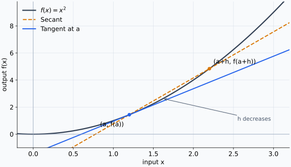
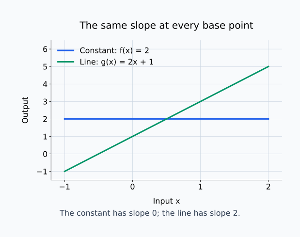
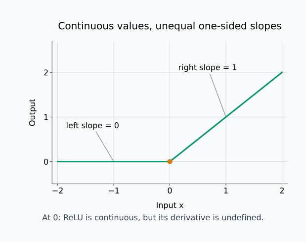
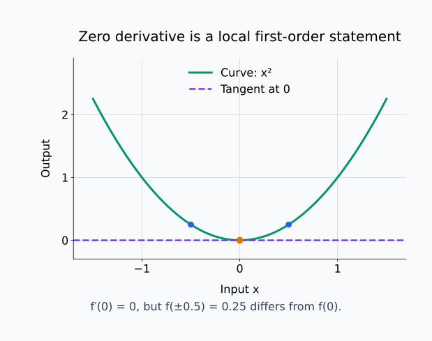
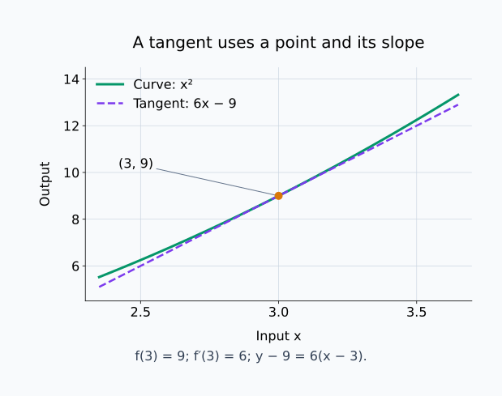

# M01-03. 미분과 순간변화율

## 이 단원이 필요한 이유

평균변화율은 두 입력 사이의 변화를 한 값으로 요약한다. 모델 출력이 입력 $x=2$ 부근에서 얼마나 민감한지 묻거나, 시각 $t=3$에서 물체가 얼마나 빠르게 움직이는지 묻는 질문에는 한 점에서의 변화율이 필요하다.

미분은 두 점 사이의 간격을 $0$에 가깝게 줄인 평균변화율의 극한을 구하는 과정이다. 이렇게 얻은 순간변화율은 접선의 기울기이며, 이후에 배울 그래디언트와 역전파의 출발점이 된다.

## 학습 목표

이 단원을 마치면 다음을 할 수 있다.

- 미분계수의 정의를 평균변화율의 극한으로 설명할 수 있다.
- $f'(a)$와 $\left.\frac{df}{dx}\right|_{x=a}$를 읽을 수 있다.
- 상수함수, 일차함수와 $f(x)=x^2$의 미분계수를 정의에서 계산할 수 있다.
- 미분계수를 접선 기울기와 순간변화율로 해석할 수 있다.
- 좌미분계수와 우미분계수를 비교해 미분 가능성을 판단할 수 있다.

## 선수지식 확인

- 선수 단원: [M01-01 변화량과 평균변화율](M01-01-change-average-rate.md)
- 선수 단원: [M01-02 극한의 직관](M01-02-limits-intuition.md)
- 확인 질문: $f(x)=x^2$에서 $x=2$부터 $x=2+h$까지의 평균변화율을 식으로 쓸 수 있는가?
- 확인 질문: $h\to0$과 $h=0$의 차이를 설명할 수 있는가?

두 질문이 어렵다면 변화량과 극한의 정의를 먼저 복습한다.

## 기호와 용어

| 기호·용어 | Common spoken reading | 의미 | 범위·조건 |
|---|---|---|---|
| $h$ | `h` | 기준 입력에서 더한 변화량 | $h\ne0$인 값으로 극한을 취한다. |
| $f'(a)$ | `f prime of a` | $x=a$에서의 미분계수 | 극한이 유한한 실수로 존재해야 한다. |
| $\left.\frac{df}{dx}\right\rvert_{x=a}$ | `d f over d x evaluated at x equals a` | $x=a$에서 $x$에 대한 $f$의 변화율 | $f'(a)$와 같은 값이다. |
| $\lvert r\rvert$ | `the absolute value of r` | 실수 $r$의 부호를 제외한 크기 | $\lvert r\rvert\ge0$ |
| 미분 | `differentiation` | 순간변화율을 구하는 과정 | 극한의 존재를 확인한다. |
| 미분계수 | `the derivative at a point` | 한 점에서의 순간변화율 | 스칼라 값이다. |
| 접선 | `tangent line` | 한 점에서 곡선의 국소 방향을 나타내는 직선 | 미분 가능할 때 기울기가 $f'(a)$다. |
| 미분 가능 | `differentiable` | 한 점에서 미분계수가 존재하는 성질 | 좌우 변화율이 같은 유한한 값이어야 한다. |

## 핵심 개념 1. 평균변화율의 극한이 미분계수다

$x=a$에서 입력을 $h$만큼 바꾸면 끝점은 $a+h$다. 두 점 사이의 평균변화율은

\[
\frac{f(a+h)-f(a)}{h},
\qquad h\ne0
\]

이다. $h$를 $0$에 가깝게 보냈을 때 이 비가 유한한 한 값에 가까워지면 그 값을 $a$에서의 미분계수로 정의한다.

\[
f'(a)
\coloneqq
\lim_{h\to0}
\frac{f(a+h)-f(a)}{h}
\]

분자 $f(a+h)-f(a)$는 출력 변화량이고 분모 $h$는 입력 변화량이다. 이 식은 두 변화량의 비를 한 점 주변까지 좁힌다.

극한을 구하는 동안 기준점 $a$는 고정하고 간격 $h$만 바꾼다. $h>0$이면 $a$의 오른쪽을, $h<0$이면 왼쪽을 조사한다. 미분 가능한 점에서는 입력 변화량과 출력 변화량이 모두 $0$에 가까워지지만, 두 변화량의 비까지 $0$이 될 필요는 없다. 미분계수는 출력이 사라지는지를 묻는 값이 아니라 입력 변화에 비해 출력이 얼마나 변하는지를 나타내는 값이다.

$h=0$을 분수에 대입하지 않는다. 각 $h\ne0$에서 변화율을 계산한 뒤, 그 값들이 $h\to0$에서 어디로 가는지 확인한다.

## 핵심 개념 2. 미분 기호는 같은 값을 여러 관점에서 나타낸다

$y=f(x)$일 때 다음 표기는 같은 도함수 값을 가리킬 수 있다.

\[
f'(x),
\qquad
\frac{df}{dx},
\qquad
\frac{dy}{dx}
\]

$f'(x)$는 함수 $f$의 도함수라는 점을 드러낸다. $\frac{df}{dx}$는 입력 $x$가 변할 때 출력 $f$가 변하는 비율을 드러낸다. 한 점 $a$에서 값을 구할 때는

\[
f'(a)
=
\left.\frac{df}{dx}\right|_{x=a}
\]

로 쓴다.

$\left.\frac{df}{dx}\right|_{x=a}$의 오른쪽 세로선은 계산한 도함수에 $x=a$를 대입한다는 표시다. 절댓값을 취한다는 뜻이 아니다. 먼저 입력에 따른 변화율을 구하고, 그중 기준점 $a$에 해당하는 값을 선택한다.

$\frac{df}{dx}$는 이 단계에서 보통 분수처럼 보이지만 하나의 미분 기호로 읽는다. 뒤에서 연쇄법칙을 배울 때 분수와 닮은 계산 규칙이 나타나더라도, 아무 식에서나 $df$와 $dx$를 독립된 수처럼 약분해서는 안 된다.

## 핵심 개념 3. 미분계수는 접선의 기울기다

곡선 위의 두 점

\[
(a,f(a)),
\qquad
(a+h,f(a+h))
\]

를 잇는 할선의 기울기는

\[
\frac{f(a+h)-f(a)}{h}
\]

이다. $h$가 $0$에 가까워지면 두 번째 점이 첫 번째 점에 가까워진다. 할선 기울기의 극한이 존재하면 그 값을 접선 기울기로 삼는다.

$x=a$에서 접선의 방정식은

\[
y-f(a)=f'(a)(x-a)
\]

이다. 접선 위의 점 $(x,y)$를 기준점 $(a,f(a))$와 비교하면 수평 변화량은 $x-a$, 수직 변화량은 $y-f(a)$다. 직선에서는 수직 변화량이 기울기와 수평 변화량의 곱이므로 위 식을 얻는다. $x=a$를 넣으면 $y=f(a)$가 되어 접선이 기준점을 지난다는 것도 확인할 수 있다. 여기의 $y$는 접선 위의 높이이며, 다른 입력에서도 원래 함수값 $f(x)$와 일치해야 하는 것은 아니다.

접선은 곡선 전체를 나타내지 않는다. $a$에 가까운 구간에서 함수의 방향을 직선으로 나타낸다.

### 시각적 직관: 할선이 접선에 가까워지는 과정

<figure class="lesson-figure" markdown="1">

<figcaption>h가 작아질수록 두 점을 잇는 주황색 할선의 기울기가 기준점 a에서의 파란색 접선 기울기에 가까워진다.</figcaption>
</figure>

그림에서 움직이는 것은 두 번째 점 $(a+h,f(a+h))$이다. 기준점 $(a,f(a))$는 고정되어 있고, 두 점의 수평 간격 $h$와 수직 간격 $f(a+h)-f(a)$가 함께 줄어든다. 두 점이 합쳐져 기울기를 직접 잴 수 있게 되는 것이 아니라, $h\ne0$인 할선 기울기들의 극한이 하나의 값으로 수렴하는지를 묻는다.

따라서 접선은 곡선에 실제로 두 번 교차해야 하는 직선이 아니다. 미분 가능한 점에서 함수와 같은 1차 변화를 갖는 국소 선형 모형이다. 이 관점은 뒤의 Taylor 근사와 Jacobian으로 그대로 확장된다.

## 핵심 개념 4. $f(x)=x^2$을 정의에서 미분한다

기준점을 일반적인 $x$로 두고 차분몫을 계산한다.

\[
\frac{f(x+h)-f(x)}{h}
=
\frac{(x+h)^2-x^2}{h}
\]

분자를 전개한다.

\[
(x+h)^2-x^2
=
x^2+2xh+h^2-x^2
=
2xh+h^2
\]

$h\ne0$에서

\[
\frac{2xh+h^2}{h}
=
2x+h
\]

이다. 이제 $h\to0$의 극한을 취한다.

\[
f'(x)
=
\lim_{h\to0}(2x+h)
=
2x
\]

따라서 $x=a$에서의 미분계수는 $f'(a)=2a$다. 기준점이 달라지면 순간변화율도 달라진다.

## 핵심 개념 5. 상수함수와 일차함수

상수함수 $f(x)=c$에서는 입력이 변해도 출력이 변하지 않는다.

\[
\frac{f(x+h)-f(x)}{h}
=
\frac{c-c}{h}
=0
\]

따라서

\[
f'(x)=0
\]

이다.

일차함수 $f(x)=mx+b$에서는

\[
\frac{f(x+h)-f(x)}{h}
=
\frac{m(x+h)+b-(mx+b)}{h}
=
\frac{mh}{h}
=m
\]

이므로

\[
f'(x)=m
\]

이다. 직선의 기울기는 모든 점에서 같다.

아래 그림에서 수평선과 기울어진 직선을 비교한다. 기준점을 옮겨도 각 직선의 기울기는 그대로다.

<figure class="lesson-figure lesson-figure--wide" markdown="1">

<figcaption>상수함수의 두 출력값은 항상 같아서 변화량이 0이다. 일차함수에서는 입력 변화에 대한 출력 변화의 비가 기준점과 무관하게 일정하다.</figcaption>
</figure>

## 핵심 개념 6. 미분 가능하면 연속이다

$f'(a)$가 존재한다고 하자. $h\ne0$에서 출력 변화량을

\[
f(a+h)-f(a)
=
\frac{f(a+h)-f(a)}{h}\,h
\]

로 쓸 수 있다. $h\to0$일 때 첫 번째 인자는 유한한 값 $f'(a)$로 가고 두 번째 인자 $h$는 $0$으로 간다. 따라서

\[
f(a+h)-f(a)\to0
\]

이고 $f(a+h)\to f(a)$다. 즉, $f$는 $a$에서 연속이다.

역은 성립하지 않는다. 함수가 연속이어도 모서리나 뾰족한 점에서는 하나의 접선 기울기를 정할 수 없을 수 있다.

## 핵심 개념 7. 좌미분계수와 우미분계수를 비교한다

왼쪽에서 $h\to0^-$로 접근한 변화율을 좌미분계수, 오른쪽에서 $h\to0^+$로 접근한 변화율을 우미분계수라고 한다.

\[
f'_-(a)
=
\lim_{h\to0^-}
\frac{f(a+h)-f(a)}{h}
\]

\[
f'_+(a)
=
\lim_{h\to0^+}
\frac{f(a+h)-f(a)}{h}
\]

두 값이 같은 유한한 수일 때 $f'(a)$가 존재한다.

ReLU를 $r(x)=\max(0,x)$라고 하자. $r(0)=0$이다. $h<0$이면 $r(h)=0$이므로

\[
\frac{r(h)-r(0)}{h}=0
\]

이다. $h>0$이면 $r(h)=h$이므로

\[
\frac{r(h)-r(0)}{h}=1
\]

이다. 좌미분계수는 $0$, 우미분계수는 $1$이므로 ReLU는 $0$에서 미분 가능하지 않다.

신경망 구현은 ReLU의 $0$에서 역전파할 값을 하나 정해 사용한다. 이는 수학적 미분계수가 존재한다는 뜻이 아니라 구현이 선택한 규칙이다.

아래 그림에서는 함수값의 연결과 양쪽 선분의 기울기를 따로 확인한다.

<figure class="lesson-figure lesson-figure--wide" markdown="1">

<figcaption>좌우 함수값은 모두 0으로 접근하므로 ReLU는 연속이다. 그러나 왼쪽 기울기 0과 오른쪽 기울기 1은 달라서 원점의 미분계수는 없다.</figcaption>
</figure>

## 핵심 개념 8. 미분계수는 국소 민감도를 나타낸다

모델 점수를 $s(x)$라고 하자. $s'(a)=4$이면 $a$ 주변에서 입력을 작은 양 $\Delta x$만큼 바꿀 때 출력 변화량은 대략 $4\Delta x$ 규모로 움직인다. 정확한 근사식은 Taylor 근사 단원에서 다룬다.

이 해석은 평균변화율이 $4$에 가까워진다는 정의에서 나온다. 출력 변화량을 입력 변화량으로 나눈 비가 약 $4$라면, 출력 변화량은 입력 변화량에 약 $4$를 곱한 값이다. 반대로 $s'(a)=0$은 이 비가 $0$으로 간다는 뜻이며 함수가 주변에서 상수라는 뜻은 아니다. $s(x)=x^2$은 $s'(0)=0$이지만 $0$이 아닌 입력에서는 출력이 달라진다.

아래 그림의 수평 접선과 위로 휘는 곡선을 비교하면 도함숫값 0이 말하는 범위를 구분할 수 있다.

<figure class="lesson-figure lesson-figure--wide" markdown="1">

<figcaption>원점에서 접선의 기울기는 0이지만 x=±0.5에서 함수값은 0.25이다. 도함숫값 0은 주변 함수 전체가 수평선이라는 뜻이 아니다.</figcaption>
</figure>

도함수의 단위는 출력 단위를 입력 단위로 나눈 것이다. 입력이 섭씨 온도이고 출력이 점수라면 $s'(a)$의 단위는 `점수/섭씨도`다.

큰 $|s'(a)|$는 선택한 입력 방향과 점 주변에서 출력이 민감하다는 증거다. 이 값 하나만으로 넓은 입력 영역의 강건성, 실제 데이터에서의 평균 행동이나 해당 특성의 인과효과를 결론 내릴 수는 없다.

## 예제 1. $x=3$에서 이차함수의 접선

$f(x)=x^2$이면 $f'(x)=2x$다. $x=3$에서

\[
f(3)=9,
\qquad
f'(3)=6
\]

이다. 접선은

\[
y-9=6(x-3)
\]

이므로

\[
y=6x-9
\]

이다. 이 직선은 점 $(3,9)$를 지나고 기울기가 $6$이다.

아래 그림에서 접선이 기준점을 지나면서도 다른 입력에서는 곡선과 떨어지는지 확인한다.

<figure class="lesson-figure lesson-figure--wide" markdown="1">

<figcaption>주황색 기준점 (3, 9)과 기울기 6으로 보라색 접선을 정한다. 접선은 그 점에서 곡선과 같은 기울기를 가지지만 곡선 전체를 대신하지 않는다.</figcaption>
</figure>

## 예제 2. 순간속도

시각 $t$에서 위치가

\[
p(t)=t^2
\]

미터라고 하자. $t=a$부터 $t=a+h$까지의 평균속도는

\[
\frac{p(a+h)-p(a)}{h}
=
2a+h
\]

이다. $h\to0$이면 순간속도는

\[
p'(a)=2a
\]

미터/초다. $a=3$초에서는 $6$미터/초다.

## 예제 3. 파라미터에 대한 손실의 변화율

스칼라 파라미터 $\theta$에 대한 손실을

\[
\mathcal L(\theta)=(\theta-2)^2
\]

라고 하자. 정의에서 차분몫을 계산하면

\[
\frac{\mathcal L(\theta+h)-\mathcal L(\theta)}{h}
=
\frac{(\theta+h-2)^2-(\theta-2)^2}{h}
\]

이다. $u=\theta-2$로 놓으면 분자는 $(u+h)^2-u^2=2uh+h^2$이다. 따라서

\[
\mathcal L'(\theta)
=
2(\theta-2)
\]

이다. $\theta=5$에서는 $\mathcal L'(5)=6$이다. 이 값은 $\theta=5$ 주변에서 $\theta$가 증가하는 방향으로 손실이 증가한다는 국소 정보를 준다.

## 흔한 오해

### 오해 1. 순간변화율은 $h=0$을 대입해 구한다

$h=0$을 차분몫에 넣으면 분모가 $0$이 된다. $h\ne0$에서 식을 계산하고 $h\to0$의 극한을 취한다.

### 오해 2. $f'(a)$는 존재한다

좌우 변화율이 다르거나 변화율이 제한 없이 커지면 유한한 미분계수가 존재하지 않는다.

### 오해 3. 연속이면 미분 가능하다

연속은 함수값의 끊김을 막는다. ReLU는 $0$에서 연속이지만 좌우 기울기가 달라 미분 가능하지 않다.

### 오해 4. 도함숫값이 크면 해당 입력이 출력의 원인이다

도함숫값은 정해진 함수와 점에서의 국소 민감도를 나타낸다. 인과효과를 주장하려면 개입 대상, 대조 조건과 데이터 생성 과정을 따로 정해야 한다.

## 연습문제

### 1. 미분 기호 읽기

\[
f'(2)
=
\left.\frac{df}{dx}\right|_{x=2}
=-3
\]

을 한국어 문장으로 설명하라.

해설 보기

함수 $f$의 $x=2$에서의 미분계수는 $-3$이라는 뜻이다. 입력이 $2$인 점 주변에서 $x$가 작은 양만큼 증가하면 출력은 입력 변화량의 약 $3$배만큼 감소하는 방향을 가진다. 그래프에서는 $(2,f(2))$에서 접선의 기울기가 $-3$이다.

### 2. 일차함수를 정의에서 미분하기

$f(x)=3x+2$의 도함수를 차분몫의 정의에서 구하라.

해설 보기

\[
\frac{f(x+h)-f(x)}{h}
=
\frac{3(x+h)+2-(3x+2)}{h}
\]

\[
=
\frac{3h}{h}
=3,
\qquad h\ne0
\]

이다. $h\to0$에서도 값은 $3$이므로

\[
f'(x)=3
\]

이다. 원래 함수가 기울기 $3$인 직선이므로 모든 점의 순간변화율이 같다.

### 3. 이차함수의 한 점 미분계수

$f(x)=x^2$일 때 $f'(-1)$을 구하고 부호를 해석하라.

해설 보기

$f'(x)=2x$이므로

\[
f'(-1)=-2
\]

이다. $x=-1$ 주변에서 입력이 증가하면 함수값은 감소하는 방향을 가진다. 접선의 기울기도 $-2$다.

### 4. 접선의 방정식

$f(x)=x^2$의 $x=1$에서의 접선 방정식을 구하라.

해설 보기

점의 좌표는

\[
(1,f(1))=(1,1)
\]

이고 접선 기울기는

\[
f'(1)=2
\]

다. 점과 기울기를 접선 식에 넣는다.

\[
y-1=2(x-1)
\]

따라서

\[
y=2x-1
\]

이다.

### 5. 절댓값 함수의 미분 가능성

$g(x)=|x|$가 $x=0$에서 미분 가능한지 좌미분계수와 우미분계수를 사용해 판단하라.

해설 보기

$g(0)=0$이다. $h<0$이면 $|h|=-h$이므로

\[
\frac{g(h)-g(0)}{h}
=
\frac{-h}{h}
=-1
\]

이다. 좌미분계수는 $-1$이다.

$h>0$이면 $|h|=h$이므로 차분몫은 $1$이다. 우미분계수는 $1$이다. 두 값이 다르므로 $g'(0)$은 존재하지 않는다.

### 6. 단위가 있는 미분계수

시간 $t$의 단위가 초이고 온도 $T(t)$의 단위가 섭씨도일 때 $T'(10)=-0.4$의 단위와 의미를 설명하라.

해설 보기

단위는 `섭씨도/초`다. $t=10$초 주변에서 시간이 조금 증가할 때 온도가 초당 $0.4$섭씨도 비율로 감소하는 방향을 가진다는 뜻이다. 이 값만으로 긴 시간 동안 같은 속도로 감소한다고 결론 내릴 수는 없다.

### 7. 모델 민감도 주장 판단

한 입력 $x=a$에서 모델 점수의 도함숫값 $s'(a)=20$을 얻었다. 연구자가 “이 입력 특성이 모든 데이터에서 예측을 유발하는 핵심 원인이다”라고 주장했다. 주어진 결과가 직접 지지하는 내용과 추가로 필요한 증거를 설명하라.

해설 보기

$s'(a)=20$은 선택한 점 $a$와 입력 방향에서 점수가 큰 국소 변화율을 가진다는 사실을 지지한다. 입력 단위가 정해졌다면 변화율의 단위도 함께 해석해야 한다.

이 결과는 다른 데이터점에서의 민감도, 실제 데이터 분포에서의 평균 효과나 인과효과를 직접 지지하지 않는다. 더 넓은 주장을 하려면 여러 입력에서의 평가, 비교할 특성과 척도, 통제된 개입과 대조 조건이 필요하다.

## 단원 요약

- 미분계수는 평균변화율 $\frac{f(a+h)-f(a)}{h}$의 $h\to0$ 극한이다.
- $f'(a)$와 $\left.\frac{df}{dx}\right|_{x=a}$는 $x=a$에서 같은 순간변화율을 나타낸다.
- 미분계수는 그래프에서 접선의 기울기이며 출력 단위를 입력 단위로 나눈 단위를 가진다.
- 미분 가능하면 연속이지만 연속인 함수가 모두 미분 가능한 것은 아니다.
- 한 점의 도함숫값은 국소 민감도를 나타내며 전역 행동이나 인과효과를 보장하지 않는다.

## 통과 기준

다음 질문에 자료를 보지 않고 답할 수 있으면 통과한다.

- 미분계수 정의에서 $h=0$을 직접 대입하지 않는 이유를 설명할 수 있는가?
- $f'(a)$와 $\left.\frac{df}{dx}\right|_{x=a}$를 읽을 수 있는가?
- $f(x)=x^2$의 도함수를 정의에서 구할 수 있는가?
- 미분계수로 접선 방정식을 세울 수 있는가?
- 좌미분계수와 우미분계수로 ReLU의 미분 가능성을 판단할 수 있는가?

## 다음 단원

- [M01-04 도함수와 그래프](M01-04-derivative-and-graphs.md)

## 집필자 점검표

- [x] 학습 목표가 관찰 가능한 행동으로 작성됐다.
- [x] 미분계수와 미분 기호를 사용 전에 정의했다.
- [x] 차분몫에서 $h\ne0$ 조건을 밝혔다.
- [x] 이차함수, 일차함수와 ReLU 계산을 검산했다.
- [x] 모든 문제에 해설이 있다.
- [x] 국소 민감도와 인과 주장을 구분했다.
- [x] 용어집과 표기 규칙을 따랐다.
- [x] 선수지식 밖의 미분 규칙을 요구하지 않았다.
- [x] 내부 링크와 수식 구분자를 확인했다.
- [x] Common spoken reading이 실제 영어 학술 발화이며 한글 음역이나 기계적 직역을 포함하지 않는다.
