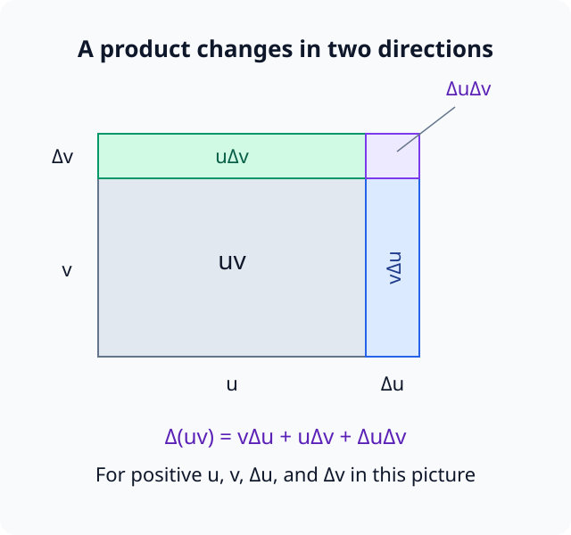
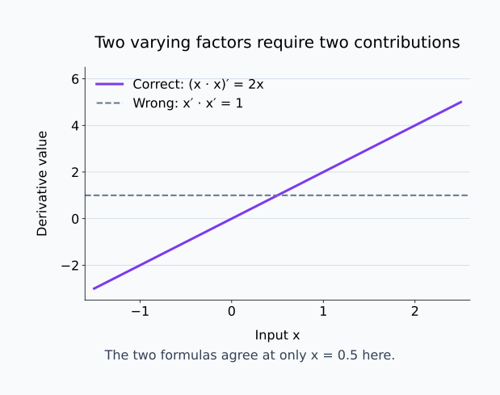
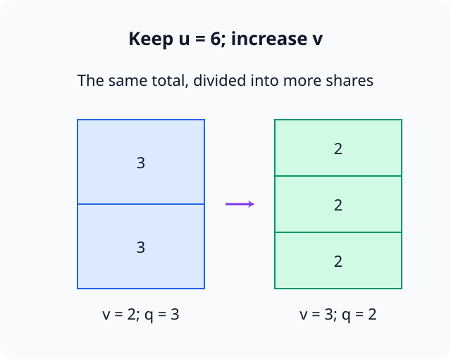
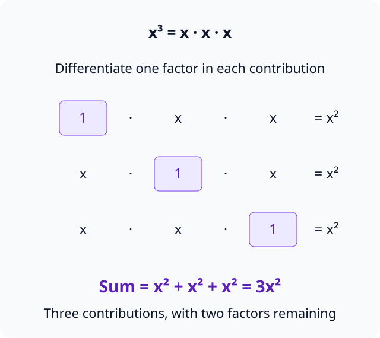
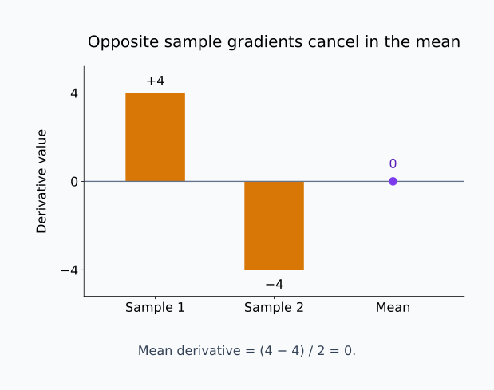

# M01-05. 합·곱·몫의 미분

## 이 단원이 필요한 이유

차분몫의 정의는 미분의 뜻을 보여 주지만, 함수식이 길어질 때마다 극한부터 다시 계산하면 같은 대수 전개를 반복하게 된다. 합, 곱과 몫의 미분 규칙을 사용하면 이미 아는 도함수를 조합해 새 도함수를 구할 수 있다.

신경망의 손실도 여러 항의 합과 평균으로 구성된다. 규칙을 정확히 적용하려면 어느 함수가 더해지고 곱해졌는지 먼저 구분해야 한다. 특히 곱의 미분을 각 도함수의 곱으로 쓰거나 몫에서 분모 조건을 빠뜨리면 계산 전체가 달라진다.

## 학습 목표

이 단원을 마치면 다음을 할 수 있다.

- 상수배, 합과 차의 미분 규칙을 적용할 수 있다.
- 곱의 미분법에서 두 항의 변화가 각각 기여하는 구조를 설명할 수 있다.
- 몫의 미분법을 적용하고 분모 조건을 확인할 수 있다.
- 양의 정수 거듭제곱의 도함수를 구할 수 있다.
- 표본별 손실의 합과 평균을 스칼라 파라미터에 대해 미분할 수 있다.

## 선수지식 확인

- 선수 단원: [M01-03 미분과 순간변화율](M01-03-derivative-instantaneous-rate.md)
- 선수 단원: [M01-04 도함수와 그래프](M01-04-derivative-and-graphs.md)
- 확인 질문: $f'(x)$가 함수 $f$의 각 입력에서 무엇을 나타내는지 설명할 수 있는가?
- 확인 질문: $(x+h)^2$을 전개해 $x^2$의 도함수를 정의에서 구할 수 있는가?

차분몫과 도함수의 구분이 어렵다면 M01-03을 먼저 복습한다.

## 기호와 용어

| 기호·용어 | Common spoken reading | 의미 | 조건 |
|---|---|---|---|
| $u(x),v(x)$ | `u of x and v of x` | 같은 입력 $x$에 의존하는 두 함수 | 필요한 점에서 미분 가능하다고 가정한다. |
| $(uv)'$ | `u v prime` | 두 함수의 곱 $u(x)v(x)$의 도함수 | $u'v+uv'$로 계산한다. |
| $\left(\frac{u}{v}\right)'$ | `u over v prime` | 두 함수의 몫의 도함수 | $v(x)\ne0$이어야 한다. |
| 곱의 미분법 | `product rule` | 함수 두 개를 곱한 식의 미분 규칙 | 두 기여를 더한다. |
| 몫의 미분법 | `quotient rule` | 함수 두 개를 나눈 식의 미분 규칙 | 분모의 제곱이 나타난다. |

## 핵심 개념 1. 미분은 합과 상수배에 선형적으로 작용한다

$c$를 $x$와 무관한 상수라고 하자. 상수배 규칙은

\[
\frac{d}{dx}\bigl[c\,u(x)\bigr]
=
c\,u'(x)
\]

이다. 상수는 그대로 두고 함수의 변화율에 곱한다.

합과 차에서는 각 항을 따로 미분한다.

\[
\frac{d}{dx}\bigl[u(x)+v(x)\bigr]
=
u'(x)+v'(x)
\]

\[
\frac{d}{dx}\bigl[u(x)-v(x)\bigr]
=
u'(x)-v'(x)
\]

이를 합의 미분법(sum rule)이라고 한다. 유한한 여러 항의 합에도 같은 규칙을 적용한다.

\[
\frac{d}{dx}
\sum_{i=1}^{N}u_i(x)
=
\sum_{i=1}^{N}u_i'(x)
\]

$N$은 고정된 유한한 정수라고 가정한다. 이 규칙은 합 전체의 출력 변화량이 각 항의 출력 변화량을 더한 값이라는 사실에서 나온다. 두 함수의 합에 대해 차분몫을 쓰면

\[
\frac{[u(x+h)+v(x+h)]-[u(x)+v(x)]}{h}
=
\frac{u(x+h)-u(x)}{h}
+
\frac{v(x+h)-v(x)}{h}
\]

이다. 각 함수가 미분 가능하면 오른쪽 두 항의 극한이 $u'(x)$와 $v'(x)$이므로 이들을 더한다. 상수배에서는 출력 변화량과 차분몫이 모두 $c$배가 되므로 극한도 $c$배다. 여기서 상수라는 말은 입력 $x$를 바꾸는 동안 $c$를 고정한다는 뜻이다. $c$도 $x$에 따라 변하면 다음의 곱의 미분법을 사용해야 한다.

## 핵심 개념 2. 곱에서는 두 함수의 변화를 모두 센다

$u$와 $v$가 모두 $x$에 따라 변한다고 하자. 기준 입력에서의 값을 $u=u(x)$, $v=v(x)$로 줄여 쓰고, 입력을 $x+h$로 바꿨을 때의 변화량을 $\Delta u=u(x+h)-u(x)$, $\Delta v=v(x+h)-v(x)$로 둔다. 곱의 변화량은

\[
(u+\Delta u)(v+\Delta v)-uv
\]

이다. 전개하면

\[
u\Delta v+v\Delta u+\Delta u\Delta v
\]

가 된다. 앞의 두 항은 각각 한 함수만 바뀔 때의 기여이고, 마지막 항은 두 함수가 함께 바뀌면서 추가되는 기여다. 미분에서는 이 출력 변화량을 입력 변화량 $h$로 나눈다. 마지막 교차항은

\[
\frac{\Delta u\Delta v}{h}
=
\frac{\Delta u}{h}\,\Delta v
\]

로 쓸 수 있다. $u$가 미분 가능하면 $\Delta u/h$는 유한한 값 $u'(x)$로 간다. $v$도 미분 가능하므로 연속이고 $\Delta v$는 $0$으로 간다. 따라서 교차항의 극한은 $0$이다. 나머지 두 항을 $h$로 나눈 극한은 $uv'$와 $vu'$이며, 이를 더하면 곱의 미분법을 얻는다.

\[
\frac{d}{dx}\bigl[u(x)v(x)\bigr]
=
u'(x)v(x)+u(x)v'(x)
\]

짧게는

\[
(uv)'=u'v+uv'
\]

로 쓴다. 첫 항은 $u$의 변화가 만드는 기여이고, 둘째 항은 $v$의 변화가 만드는 기여다.

각 도함수만 곱한 $u'v'$는 곱의 미분 결과가 아니다. 예를 들어 $u(x)=v(x)=x$이면 $uv=x^2$의 도함수는 $2x$이지만 $u'v'=1$이다.

아래 넓이 그림은 양수인 두 길이와 양의 변화량을 사용해 곱의 변화량을 세 조각으로 나눈다.

<figure class="lesson-figure" markdown="1">

<figcaption>오른쪽 띠는 u가 변할 때의 기여이고 위쪽 띠는 v가 변할 때의 기여이다. 모서리 조각 ΔuΔv도 유한한 변화량에는 포함되지만 h로 나눈 뒤 극한을 취하면 사라진다.</figcaption>
</figure>

다음 그래프는 두 함수가 모두 x인 경우의 올바른 도함수와 각 도함수만 곱한 결과를 비교한다.

<figure class="lesson-figure lesson-figure--wide" markdown="1">

<figcaption>x²의 도함수는 2x이므로 입력에 따라 달라진다. 잘못된 계산 x′·x′=1은 이 변화를 표현하지 못한다.</figcaption>
</figure>

## 핵심 개념 3. 몫에서는 분모의 변화를 빼서 반영한다

\[
q(x)=\frac{u(x)}{v(x)},
\qquad v(x)\ne0
\]

라고 하자. $qv=u$라는 항등식에 곱의 미분법을 적용하면

\[
q'v+qv'=u'
\]

이다. $q=u/v$를 대입하고 $q'$에 대해 정리한다.

\[
q'
=
\frac{u'-qv'}{v}
=
\frac{u'}{v}-\frac{uv'}{v^2}
\]

두 항을 공통 분모 $v^2$로 맞추면

\[
q'
=
\frac{u'v-uv'}{v^2}
\]

따라서 몫의 미분법은

\[
\frac{d}{dx}
\left(\frac{u(x)}{v(x)}\right)
=
\frac{u'(x)v(x)-u(x)v'(x)}{[v(x)]^2}
\]

이다.

분모의 제곱은 $q$ 안에 있던 나눗셈 $u/v$와 $q'$를 구하기 위해 다시 $v$로 나눈 과정에서 생긴다. 뺄셈은 $q'v+qv'=u'$에서 $qv'$를 오른쪽으로 옮긴 결과다. 분모가 변하는 기여를 빼야 두 함수의 곱 $qv$가 분자 $u$와 같은 변화율을 갖는다.

분자의 순서는 `분자의 도함수 곱하기 분모, 빼기 분자 곱하기 분모의 도함수`다. 순서를 바꾸면 전체 부호가 달라진다. 원래 함수와 도함수 모두 $v(x)=0$인 점에서는 이 식으로 값을 정할 수 없다.

아래 그림에서는 양수인 분자를 고정하고 분모만 늘린다. 같은 전체를 더 많은 몫으로 나누면 한 몫의 크기는 작아진다.

<figure class="lesson-figure" markdown="1">

<figcaption>분자 u=6을 고정하면 분모 v가 2에서 3으로 증가할 때 몫 q는 3에서 2로 감소한다. 분모의 변화가 몫에 반대 방향으로 작용하는 경우를 보여 준다.</figcaption>
</figure>

## 핵심 개념 4. 양의 정수 거듭제곱의 미분

$n$이 양의 정수이면 $x^n$은 $x$를 $n$번 곱한 함수다. 곱의 미분법을 반복하면 각 위치의 $x$를 한 번씩 미분한 항이 $n$개 생긴다.

각 항에서 미분한 인자 $x$는 $1$이 되고 나머지 $n-1$개의 $x$는 그대로 남는다. 따라서 항 하나가 $x^{n-1}$이고, 같은 항을 $n$개 더한 결과가 $nx^{n-1}$이다. 지수가 하나 줄어드는 이유와 앞에 $n$이 붙는 이유를 이 곱의 구조에서 함께 읽을 수 있다.

\[
\frac{d}{dx}x^n
=
nx^{n-1}
\]

이를 거듭제곱 법칙(power rule)이라고 한다. 예를 들면

\[
\frac{d}{dx}x^3=3x^2,
\qquad
\frac{d}{dx}x^5=5x^4
\]

이다.

$x^0=1$은 상수함수이므로 도함수가 $0$이다. 음의 정수 지수와 분수 지수에도 거듭제곱 법칙을 확장할 수 있지만 정의역 조건이 달라진다. 이 단원에서는 다항식과 몫으로 직접 다룰 수 있는 범위를 사용한다.

아래 그림에서 세제곱의 세 인자를 하나씩 미분하면 같은 항이 세 번 생기는 과정을 확인할 수 있다.

<figure class="lesson-figure lesson-figure--wide" markdown="1">

<figcaption>각 줄에서 보라색 1은 그 위치의 x를 미분한 결과이다. 나머지 두 인자가 x²을 만들고 세 줄의 기여를 더하면 3x²이 된다.</figcaption>
</figure>

## 핵심 개념 5. 규칙을 적용하기 전에 식의 구조를 읽는다

다음 두 식은 기호가 비슷하지만 구조가 다르다.

\[
u(x)+v(x)
\]

\[
u(x)v(x)
\]

첫 식은 합의 미분법을 사용한다. 둘째 식은 곱의 미분법을 사용한다. 괄호 안의 식 전체가 곱의 한 인자가 될 수도 있다.

\[
(x^2+1)(x-3)
\]

에서는 $u(x)=x^2+1$, $v(x)=x-3$으로 놓는다. 먼저 각 도함수를 구한 뒤

\[
u'v+uv'
\]

에 대입한다. 식을 전개한 뒤 항별로 미분해도 같은 결과가 나와야 한다. 두 계산을 비교하면 부호와 항 누락을 검산할 수 있다.

## 핵심 개념 6. 평균 손실의 미분은 표본별 도함수의 평균이다

스칼라 파라미터 $\theta$에 대한 표본별 손실을 $\ell_i(\theta)$라고 하자. 평균 손실은

\[
\mathcal L(\theta)
=
\frac{1}{N}
\sum_{i=1}^{N}\ell_i(\theta)
\]

이다. 각 $\ell_i$가 현재 $\theta$에서 미분 가능하다고 하자. $N$은 $\theta$와 무관한 고정된 표본 수다. $\theta$를 바꿔도 합에 들어가는 표본과 $1/N$은 그대로이며 각 표본의 손실값만 변한다. 따라서 상수배와 합의 미분법을 적용하면

\[
\mathcal L'(\theta)
=
\frac{1}{N}
\sum_{i=1}^{N}\ell_i'(\theta)
\]

이다.

따라서 전체 평균의 변화율은 표본별 변화율의 평균이다. 평균값이 $0$이어도 각 표본의 도함수가 모두 $0$이라는 뜻은 아니다. 양수와 음수 기여가 상쇄될 수 있다.

## 예제 1. 다항식 미분

\[
f(x)=3x^4-2x^2+5x-7
\]

을 미분하자. 각 항에 상수배, 합과 거듭제곱 법칙을 적용한다.

\[
f'(x)
=
3\cdot4x^3-2\cdot2x+5
\]

따라서

\[
f'(x)=12x^3-4x+5
\]

이다. 상수항 $-7$의 도함수는 $0$이다.

## 예제 2. 곱의 미분

\[
f(x)=(x^2+1)(x-3)
\]

에서

\[
u(x)=x^2+1,
\qquad
v(x)=x-3
\]

으로 놓으면

\[
u'(x)=2x,
\qquad
v'(x)=1
\]

이다. 곱의 미분법으로

\[
f'(x)
=
2x(x-3)+(x^2+1)
\]

이다. 정리하면

\[
f'(x)=3x^2-6x+1
\]

이다. 원래 식을 $x^3-3x^2+x-3$으로 전개해 미분해도 같은 결과를 얻는다.

## 예제 3. 몫의 미분

\[
g(x)=\frac{x^2+1}{x-1},
\qquad x\ne1
\]

이라고 하자. $u=x^2+1$, $v=x-1$이면 $u'=2x$, $v'=1$이다.

\[
g'(x)
=
\frac{2x(x-1)-(x^2+1)}{(x-1)^2}
\]

분자를 정리하면

\[
g'(x)
=
\frac{x^2-2x-1}{(x-1)^2},
\qquad x\ne1
\]

이다. 도함수 식에서도 $x=1$은 허용하지 않는다.

## 예제 4. 표본별 변화율의 상쇄

$N=2$이고 현재 파라미터에서

\[
\ell_1'(\theta)=4,
\qquad
\ell_2'(\theta)=-4
\]

라고 하자. 평균 손실의 도함수는

\[
\mathcal L'(\theta)
=
\frac{4+(-4)}{2}
=0
\]

이다. 평균 기울기는 $0$이지만 두 표본의 손실은 서로 반대 방향으로 변한다. 평균 하나만 보고 모든 표본이 정지했다고 해석하면 안 된다.

아래 그림은 평균을 계산하기 전의 두 기여와 계산한 평균을 함께 표시한다.

<figure class="lesson-figure lesson-figure--wide" markdown="1">

<figcaption>두 표본의 기울기는 크기가 같고 방향이 반대여서 평균에서 상쇄된다. 보라색 평균 0은 주황색 표본별 기울기가 모두 0이라는 뜻이 아니다.</figcaption>
</figure>

## 흔한 오해

### 오해 1. 곱의 도함수는 $u'v'$이다

곱에서는 $u$의 변화와 $v$의 변화를 각각 센다. 결과는 $u'v+uv'$다.

### 오해 2. 몫의 도함수는 $u'/v'$이다

분모가 변하면 몫 전체에 미치는 효과가 분모 제곱과 뺄셈으로 나타난다. $\frac{u'v-uv'}{v^2}$를 사용한다.

### 오해 3. 상수항은 미분한 뒤에도 남는다

입력 $x$와 무관한 상수함수의 변화율은 $0$이다.

### 오해 4. 평균 손실의 도함수가 $0$이면 각 표본의 도함수도 $0$이다

표본별 양수와 음수 도함수가 평균에서 상쇄될 수 있다. 표본 단위의 결론에는 표본별 값을 확인해야 한다.

## 연습문제

### 1. 합과 상수배의 미분

\[
f(x)=4x^3-5x+9
\]

의 도함수를 구하라.

해설 보기

항별로 미분한다.

\[
\frac{d}{dx}(4x^3)=12x^2,
\qquad
\frac{d}{dx}(-5x)=-5,
\qquad
\frac{d}{dx}9=0
\]

따라서

\[
f'(x)=12x^2-5
\]

이다.

### 2. 곱의 미분

\[
f(x)=x^2(x+2)
\]

의 도함수를 곱의 미분법으로 구하라.

해설 보기

$u=x^2$, $v=x+2$로 놓으면 $u'=2x$, $v'=1$이다.

\[
f'(x)
=
u'v+uv'
=
2x(x+2)+x^2
\]

따라서

\[
f'(x)=3x^2+4x
\]

이다. $f(x)=x^3+2x^2$로 전개해 미분해도 같은 결과를 얻는다.

### 3. 곱의 미분 오류 찾기

$u(x)=x^2$, $v(x)=x^3$에 대해 한 학습자가 $(uv)'=u'v'=6x^3$이라고 계산했다. 오류를 고치고 정답을 구하라.

해설 보기

곱의 미분법은 $u'v+uv'$다.

\[
(uv)'
=
(2x)(x^3)+(x^2)(3x^2)
\]

\[
=
2x^4+3x^4
=5x^4
\]

이다. 원래 곱이 $x^5$이므로 거듭제곱 법칙으로도 $5x^4$를 얻는다.

### 4. 몫의 미분

\[
g(x)=\frac{x}{x+1}
\]

의 도함수와 허용되는 $x$의 범위를 구하라.

해설 보기

$u=x$, $v=x+1$이면 $u'=1$, $v'=1$이다.

\[
g'(x)
=
\frac{1\cdot(x+1)-x\cdot1}{(x+1)^2}
=
\frac{1}{(x+1)^2}
\]

이다. 원래 함수의 분모가 $0$이 되는 $x=-1$은 허용하지 않는다. 따라서 정의역은 $x\ne-1$이다.

### 5. 규칙 선택

다음 각 함수에서 가장 바깥쪽 연산에 먼저 적용할 미분 규칙을 답하라.

1. $a(x)=x^3+x$
2. $b(x)=(x^2+1)(x-4)$
3. $c(x)=\frac{x^2}{x+2}$

해설 보기

1. 두 항을 더했으므로 합의 미분법을 사용한다.
2. 두 괄호를 곱했으므로 곱의 미분법을 사용한다.
3. 분자와 분모를 나눴으므로 몫의 미분법을 사용한다. $x=-2$는 정의역에서 제외한다.

식의 가장 바깥 연산을 찾으면 규칙 선택이 정해진다.

### 6. 평균 손실 미분

\[
\mathcal L(\theta)
=
\frac{1}{3}
\bigl[\ell_1(\theta)+\ell_2(\theta)+\ell_3(\theta)\bigr]
\]

이고 현재 점에서 $\ell_1'=3$, $\ell_2'=-1$, $\ell_3'=4$다. $\mathcal L'(\theta)$를 구하라.

해설 보기

합과 상수배의 미분법을 적용한다.

\[
\mathcal L'(\theta)
=
\frac{1}{3}(3-1+4)
=
\frac{6}{3}
=2
\]

이다. 평균 손실은 현재 점에서 $\theta$가 증가하는 방향으로 증가하는 국소 기울기를 가진다.

### 7. 평균 기울기 주장 판단

훈련 데이터 전체의 평균 손실에서 $\mathcal L'(\theta)=0$을 얻었다. 연구자가 “모든 훈련 표본의 손실이 파라미터 $\theta$에 둔감하다”고 주장했다. 이 결론을 비판하고 확인할 값을 제시하라.

해설 보기

평균 도함수 $0$은 표본별 도함수의 합이 $0$이라는 사실을 지지한다. 각 $\ell_i'(\theta)$가 $0$인지는 알 수 없다. 양수와 음수 값이 상쇄됐을 수 있다.

표본별 둔감성을 주장하려면 각 표본의 $\ell_i'(\theta)$ 또는 그 분포를 확인해야 한다. 다른 파라미터 방향과 평가 데이터에 관한 결론도 이 스칼라 평균만으로 얻을 수 없다.

## 단원 요약

- 상수배는 상수를 유지한 채 미분하고, 합과 차는 항별로 미분한다.
- 곱의 미분법은 $(uv)'=u'v+uv'$다.
- 몫의 미분법은 $\left(\frac{u}{v}\right)'=\frac{u'v-uv'}{v^2}$이며 $v\ne0$ 조건이 필요하다.
- 양의 정수 $n$에 대해 $\frac{d}{dx}x^n=nx^{n-1}$이다.
- 평균 손실의 도함수는 표본별 도함수의 평균이며, 평균값은 개별 값을 숨길 수 있다.

## 통과 기준

다음 질문에 자료를 보지 않고 답할 수 있으면 통과한다.

- 합과 상수배의 미분 규칙을 식으로 쓸 수 있는가?
- 곱의 미분에서 두 항이 생기는 이유를 설명할 수 있는가?
- 몫의 미분 공식을 쓰고 분모 조건을 확인할 수 있는가?
- 간단한 다항식, 곱과 몫의 도함수를 계산할 수 있는가?
- 평균 손실의 도함수와 표본별 도함수의 관계를 설명할 수 있는가?

## 다음 단원

- [M01-06 합성함수와 연쇄법칙](M01-06-composition-chain-rule.md)

## 집필자 점검표

- [x] 학습 목표가 관찰 가능한 행동으로 작성됐다.
- [x] 합·곱·몫의 규칙과 조건을 사용 전에 설명했다.
- [x] 곱과 몫의 예제를 다른 전개로 검산했다.
- [x] 모든 문제에 해설이 있다.
- [x] 평균 손실과 표본별 손실에 관한 주장 범위를 구분했다.
- [x] 용어집과 표기 규칙을 따랐다.
- [x] 연쇄법칙이나 지수·로그 미분을 선수지식으로 요구하지 않았다.
- [x] 내부 링크와 수식 구분자를 확인했다.
- [x] Common spoken reading이 실제 영어 학술 발화이며 한글 음역이나 기계적 직역을 포함하지 않는다.
