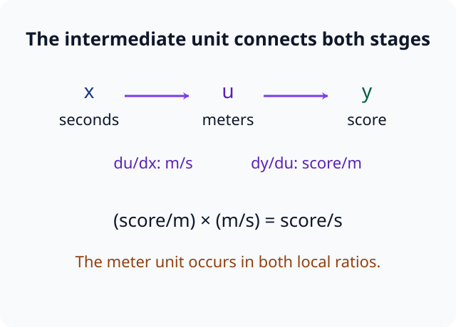
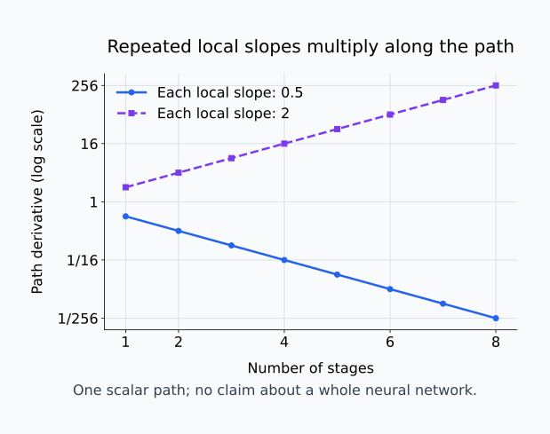
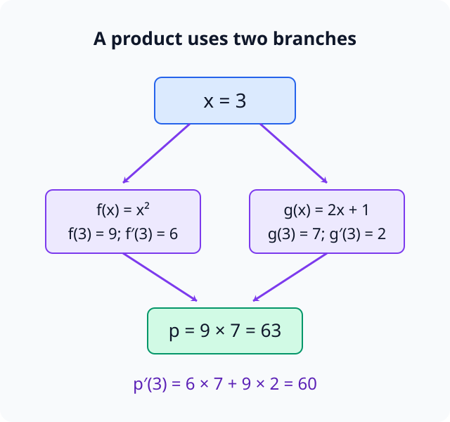
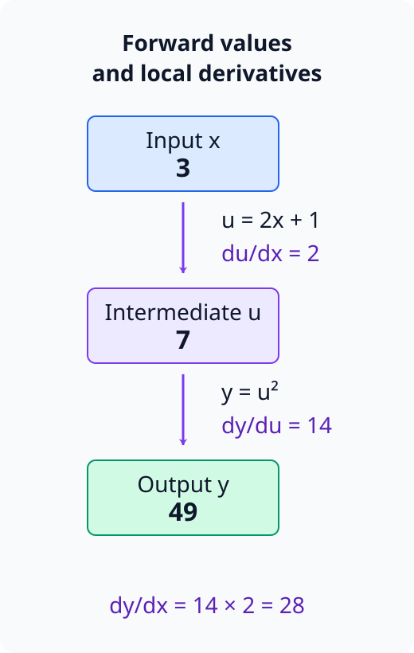
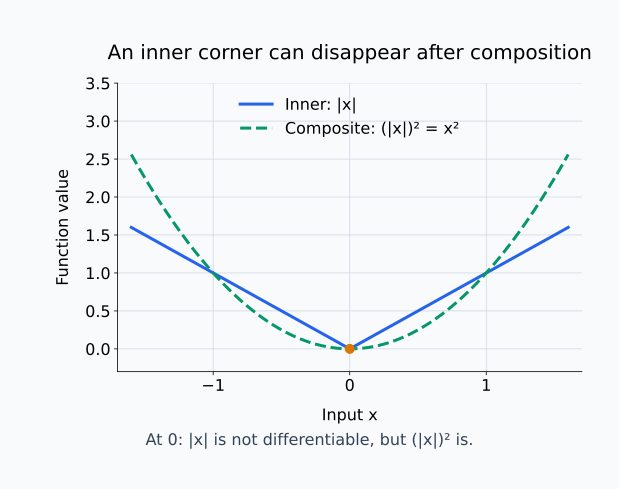

# M01-06. 합성함수와 연쇄법칙

## 이 단원이 필요한 이유

신경망은 한 함수의 출력을 다음 함수의 입력으로 전달한다. 입력에서 손실까지의 변화율을 구하려면 각 단계의 국소 변화율을 경로 순서대로 연결해야 한다. 연쇄법칙은 이 연결을 곱으로 나타낸다.

합성함수에서 바깥 함수만 미분하면 안쪽 함수가 입력을 얼마나 바꾸는지 빠진다. 계산 순서를 분리해 적으면 괄호가 여러 겹인 함수와 작은 계산 그래프에서도 같은 규칙을 사용할 수 있다.

## 학습 목표

이 단원을 마치면 다음을 할 수 있다.

- 합성함수에서 안쪽 함수와 바깥 함수를 구분할 수 있다.
- 연쇄법칙을 함수 표기와 중간변수 표기로 쓸 수 있다.
- 두 단계와 세 단계 합성함수의 도함수를 계산할 수 있다.
- 계산 그래프의 경로에서 국소 도함수를 곱할 수 있다.
- 연쇄법칙으로 얻은 변화율이 허용하는 모델 해석 주장의 범위를 설명할 수 있다.

## 선수지식 확인

- 선수 단원: [M00-08 함수 합성과 역함수](../M00/M00-08-composition-inverse.md)
- 선수 단원: [M01-05 합·곱·몫의 미분](M01-05-sum-product-quotient-rules.md)
- 확인 질문: $(f\circ g)(x)$에서 어느 함수를 먼저 계산하는지 설명할 수 있는가?
- 확인 질문: $x^n$, 함수의 합과 곱을 미분할 수 있는가?

함수의 계산 순서가 불분명하면 M00-08을 먼저 복습한다.

## 기호와 용어

| 기호·용어 | Common spoken reading | 의미 | 조건 |
|---|---|---|---|
| $(f\circ g)(x)$ | `f composed with g at x` | $g(x)$를 먼저 계산한 뒤 그 결과에 $f$를 적용한 함수 | $g(x)$가 $f$의 정의역에 속해야 한다. |
| $u=g(x)$ | `u equals g of x` | 합성의 중간값 | $u$는 $x$에 의존한다. |
| $\frac{dy}{du}$ | `d y over d u` | 바깥 함수의 입력 $u$에 대한 출력 $y$의 변화율 | 해당 점에서 미분 가능해야 한다. |
| $\frac{du}{dx}$ | `d u over d x` | 입력 $x$에 대한 중간값 $u$의 변화율 | 해당 점에서 미분 가능해야 한다. |
| 연쇄법칙 | `chain rule` | 합성함수의 도함수를 국소 도함수의 곱으로 구하는 규칙 | 합성에 참여한 함수가 필요한 점에서 미분 가능해야 한다. |
| 국소 도함수 | `local derivative` | 계산 한 단계의 출력이 그 단계 입력에 대해 갖는 도함수 | 계산 그래프의 각 변에 대응한다. |

## 핵심 개념 1. 합성함수는 중간값을 거친다

\[
y=f(g(x))
\]

에서 $g$가 안쪽 함수이고 $f$가 바깥 함수다. 중간변수

\[
u=g(x)
\]

를 두면 전체 계산은

\[
x\longmapsto u\longmapsto y
\]

이고

\[
y=f(u)
\]

이다.

입력 변화는 먼저 $u$를 바꾸고, $u$의 변화가 $y$를 바꾼다. 전체 변화율에는 두 단계가 모두 들어가야 한다.

## 핵심 개념 2. 연쇄법칙은 단계별 변화율을 곱한다

$u=g(x)$와 $y=f(u)$가 필요한 점에서 미분 가능하면

\[
\frac{dy}{dx}
=
\frac{dy}{du}
\frac{du}{dx}
\]

이다. 함수 표기로는

\[
\frac{d}{dx}f(g(x))
=
f'(g(x))g'(x)
\]

라고 쓴다.

$f'(g(x))$는 바깥 함수 $f$의 도함수에 중간값 $g(x)$를 넣은 값이다. $g'(x)$는 안쪽 함수가 입력 변화를 중간값 변화로 바꾸는 비율이다.

작은 입력 변화량을 $\Delta x$라고 하면, 미분계수의 뜻에 따라 중간값의 변화량은 $\Delta u\approx g'(x)\Delta x$다. 바깥 함수에서는 $\Delta y\approx f'(u)\Delta u$이므로 앞의 관계를 넣으면

\[
\Delta y\approx f'(g(x))g'(x)\Delta x
\]

를 얻는다. 두 단계가 입력 변화를 차례로 전달하므로 변화율을 곱한다. $f'$를 평가할 입력이 $x$가 아니라 $g(x)$인 이유도 여기에 있다. 바깥 함수는 원래 입력을 직접 받지 않고 안쪽 함수가 만든 값을 받는다. 이 변화량 설명은 미분 가능할 때의 국소 근사이며, 유한한 간격에서 두 근삿값을 정확한 등식으로 바꾸는 주장은 아니다.

미분 기호가 분수처럼 이어져 보이지만, 이 식은 연쇄법칙이 보장하는 관계다. 기호 모양만 보고 임의의 식에서 $du$를 약분하는 규칙으로 사용하지 않는다.

## 핵심 개념 3. 계산 순서를 분리하면 항을 빠뜨리지 않는다

\[
y=(3x+1)^4
\]

를 미분한다고 하자. 다음 순서로 계산한다.

1. 안쪽 함수를 $u=3x+1$로 둔다.
2. 바깥 함수를 $y=u^4$로 쓴다.
3. 각 국소 도함수를 구한다.

\[
\frac{dy}{du}=4u^3,
\qquad
\frac{du}{dx}=3
\]

4. 곱한 뒤 $u=3x+1$을 되돌려 넣는다.

\[
\frac{dy}{dx}
=
4u^3\cdot3
=
12(3x+1)^3
\]

바깥 함수만 미분한 $4(3x+1)^3$에는 안쪽 변화율 $3$이 빠져 있다.

## 핵심 개념 4. 변화율의 단위도 경로를 따라 곱해진다

$x$의 단위가 초, 중간값 $u$의 단위가 미터, 출력 $y$의 단위가 점수라고 하자.

\[
\frac{du}{dx}
\quad\text{단위: 미터/초}
\]

\[
\frac{dy}{du}
\quad\text{단위: 점수/미터}
\]

두 변화율을 곱하면

\[
\frac{dy}{du}\frac{du}{dx}
\quad\text{단위: 점수/초}
\]

가 된다. 중간 단위인 미터가 연결되고 전체 입력과 출력의 단위가 남는다. 단위 검사는 변수의 연결이나 단계 누락을 찾는 데 도움이 된다. 스칼라 변화율의 곱은 순서를 바꿔도 같은 값이므로 단위만으로 계산 경로의 순서까지 정할 수는 없다.

아래 그림에서 중간값의 단위가 두 국소 변화율에 각각 나타나는 위치를 확인한다.

<figure class="lesson-figure lesson-figure--wide" markdown="1">

<figcaption>입력에서 중간값까지는 미터/초이고 중간값에서 출력까지는 점수/미터이다. 두 비율을 곱하면 중간 단위가 연결되어 점수/초가 남는다.</figcaption>
</figure>

## 핵심 개념 5. 세 단계 이상에서도 경로의 도함수를 모두 곱한다

\[
x\longmapsto u=g(x)
\longmapsto v=h(u)
\longmapsto y=f(v)
\]

라면

\[
\frac{dy}{dx}
=
\frac{dy}{dv}
\frac{dv}{du}
\frac{du}{dx}
\]

이다. 함수 표기로는

\[
\frac{d}{dx}f(h(g(x)))
=
f'(h(g(x)))
h'(g(x))
g'(x)
\]

이다.

중간 단계 하나의 도함수가 $0$이면 전체 곱도 $0$이 된다. 여러 단계의 도함수 절댓값이 계속 $1$보다 작으면 전체 곱이 작아질 수 있고, 계속 크면 커질 수 있다. 깊은 신경망의 기울기 소실과 폭주를 이해할 때 이 곱 구조를 다시 사용한다.

아래 그림은 단계별 변화율을 0.5 또는 2로 고정한 스칼라 한 경로의 곱을 비교한다. 세로축은 곱의 큰 범위를 읽기 위한 로그 눈금이다.

<figure class="lesson-figure lesson-figure--wide" markdown="1">

<figcaption>8단계에서 0.5의 곱은 1/256이고 2의 곱은 256이다. 이 그림은 스칼라 경로의 곱 구조를 설명하며 전체 신경망의 기울기를 측정한 결과가 아니다.</figcaption>
</figure>

## 핵심 개념 6. 연쇄법칙과 곱의 미분법을 구분한다

\[
u(x)v(x)
\]

는 두 함수값을 곱한 식이다. 곱의 미분법

\[
u'v+uv'
\]

를 사용한다.

\[
f(g(x))
\]

는 한 함수의 출력을 다른 함수에 넣은 식이다. 연쇄법칙

\[
f'(g(x))g'(x)
\]

을 사용한다.

두 구조가 한 식에 함께 나타날 수도 있다. 예를 들어

\[
x^2(x+1)^3
\]

에서는 바깥쪽 곱에 곱의 미분법을 적용하고, $(x+1)^3$을 미분할 때 연쇄법칙을 적용한다.

아래 그림은 같은 입력을 두 함수가 각각 받는 곱의 계산 구조다. 한 함수의 출력이 다음 함수의 입력이 되는 합성과 경로를 비교한다.

<figure class="lesson-figure lesson-figure--wide" markdown="1">

<figcaption>두 갈래의 값 9와 7을 곱하면 63이다. 입력 변화는 두 갈래를 모두 바꾸므로 도함수는 두 기여 6×7과 9×2를 더한 60이다.</figcaption>
</figure>

## 핵심 개념 7. 계산 그래프에서 순방향 값과 국소 도함수를 분리한다

\[
x\longrightarrow u=2x+1
\longrightarrow y=u^2
\]

라는 계산 그래프를 생각하자. $x=3$에서 순방향 계산은

\[
u=2\cdot3+1=7,
\qquad
y=7^2=49
\]

이다. 각 변의 국소 도함수는

\[
\frac{du}{dx}=2,
\qquad
\frac{dy}{du}=2u=14
\]

이다. 입력에서 출력까지의 도함수는

\[
\frac{dy}{dx}
=
14\cdot2
=28
\]

이다.

신경망의 역전파는 출력 쪽에서 시작해 이 국소 도함수들을 역순으로 곱한다. 스칼라 한 경로에서는 곱셈 순서가 수치에 영향을 주지 않지만, 뒤에서 벡터와 행렬 도함수를 다룰 때는 shape과 곱셈 순서를 지켜야 한다.

아래 그림에서 상자 안의 계산값과 상자 사이의 국소 변화율을 구분해 읽는다.

<figure class="lesson-figure" markdown="1">

<figcaption>순방향 값은 3→7→49이고 전체 변화율은 14×2=28이다. 바깥 제곱 함수의 도함수 2u는 원래 입력 3이 아니라 중간값 u=7에서 평가한다.</figcaption>
</figure>

## 핵심 개념 8. 연쇄법칙에는 미분 가능 조건이 필요하다

$g$가 $x=a$에서 미분 가능하고 $f$가 $u=g(a)$에서 미분 가능하면 $f\circ g$도 $a$에서 미분 가능하며 연쇄법칙을 적용할 수 있다.

중간 함수가 모서리를 가지면 공식만 기계적으로 적용할 수 없다. 예를 들어

\[
y=\operatorname{ReLU}(2x)
\]

는 $x=0$에서 안쪽 값이 ReLU의 모서리 $0$에 도달한다. 수학적 도함수는 그 점에서 존재하지 않는다. 프레임워크가 $0$에서 사용할 값을 정했더라도 그 선택과 수학적 미분 가능성을 구분한다.

위 조건은 연쇄법칙 공식을 적용할 수 있는 충분한 조건이다. 한 단계가 미분 불가능하다고 해서 모든 합성 결과가 미분 불가능한 것은 아니다. 예를 들어 $g(x)=|x|$와 $f(u)=u^2$의 합성은 $f(g(x))=x^2$이므로 $0$에서도 미분 가능하다. 이때는 $g'(0)$을 공식에 넣을 수 없지만, 합성한 함수 자체를 미분해 답을 구할 수 있다.

아래 그림에서 안쪽 절댓값의 모서리와 합성한 제곱의 매끈한 원점을 비교한다.

<figure class="lesson-figure lesson-figure--wide" markdown="1">

<figcaption>|x|은 원점에서 미분 불가능하지만 (|x|)²=x²은 미분 가능하다. 안쪽 도함수가 없는 점에서 공식을 적용하지 못한다는 사실과 합성 함수 자체의 미분 가능성은 구분한다.</figcaption>
</figure>

## 예제 1. 이차함수 안의 일차함수

\[
f(x)=(2x-3)^2
\]

에서 $u=2x-3$, $f=u^2$로 둔다.

\[
\frac{df}{du}=2u,
\qquad
\frac{du}{dx}=2
\]

이므로

\[
f'(x)
=
2u\cdot2
=
4(2x-3)
\]

이다. 원래 식을 $4x^2-12x+9$로 전개해 미분하면 $8x-12$이며, $4(2x-3)$과 같다.

## 예제 2. 세 단계 합성

\[
y=\bigl((x^2+1)^3-2\bigr)^2
\]

에서

\[
u=x^2+1,
\qquad
v=u^3-2,
\qquad
y=v^2
\]

로 둔다. 국소 도함수는

\[
\frac{du}{dx}=2x,
\qquad
\frac{dv}{du}=3u^2,
\qquad
\frac{dy}{dv}=2v
\]

이다. 따라서

\[
\frac{dy}{dx}
=
2v\cdot3u^2\cdot2x
\]

이고 중간변수를 되돌려 넣으면

\[
\frac{dy}{dx}
=
12x(x^2+1)^2
\bigl((x^2+1)^3-2\bigr)
\]

이다.

## 예제 3. 곱의 미분과 연쇄법칙 함께 쓰기

\[
p(x)=x^2(x+1)^3
\]

에서 $a(x)=x^2$, $b(x)=(x+1)^3$로 둔다. 연쇄법칙으로

\[
b'(x)=3(x+1)^2
\]

이다. 곱의 미분법을 적용하면

\[
p'(x)
=
2x(x+1)^3
+
x^2\,3(x+1)^2
\]

이다. 공통인자를 묶으면

\[
p'(x)
=
x(x+1)^2(5x+2)
\]

이다.

## 예제 4. 손실까지 이어지는 경로

스칼라 파라미터 $\theta$에서

\[
z=3\theta-1,
\qquad
\mathcal L=z^2
\]

라고 하자. 국소 도함수는

\[
\frac{dz}{d\theta}=3,
\qquad
\frac{d\mathcal L}{dz}=2z
\]

이다. 연쇄법칙으로

\[
\frac{d\mathcal L}{d\theta}
=
2z\cdot3
=
6(3\theta-1)
\]

이다. $\theta=1$에서는 $z=2$이고 손실 도함수는 $12$다.

이 값은 정해진 계산 경로와 점에서의 국소 변화율이다. 파라미터가 데이터 생성 과정에서 어떤 인과적 역할을 한다는 결론이나 다른 입력에서의 변화율을 직접 제공하지 않는다.

## 흔한 오해

### 오해 1. 바깥 함수만 미분하면 된다

바깥 함수의 도함수에 안쪽 함수의 도함수를 곱해야 한다. $(3x+1)^4$에서 계수 $3$을 빠뜨리면 안 된다.

### 오해 2. $f'(g(x))$와 $f'(x)$는 같다

바깥 함수의 도함수는 중간값 $g(x)$에서 평가한다. $g(x)$가 $x$와 같다는 조건이 없으면 두 값은 다르다.

### 오해 3. 합성함수와 함수의 곱은 같은 규칙으로 미분한다

$f(g(x))$에는 연쇄법칙을, $f(x)g(x)$에는 곱의 미분법을 적용한다. 먼저 가장 바깥 연산을 확인한다.

### 오해 4. 경로 도함수 하나가 $0$이어도 전체 변화율은 남을 수 있다

단일 경로의 연쇄법칙은 국소 도함수의 곱이다. 곱의 한 인자가 $0$이면 그 경로의 전체 변화율도 $0$이다. 여러 경로가 합쳐지는 계산은 각 경로의 기여를 더 따져야 한다.

### 오해 5. 프레임워크가 도함숫값을 반환하면 수학적으로 미분 가능하다

프레임워크는 ReLU의 모서리처럼 도함수가 없는 점에 계산 규칙을 정할 수 있다. 구현의 반환값과 도함수의 존재를 구분한다.

## 연습문제

### 1. 안쪽 함수와 바깥 함수 찾기

\[
y=(x^2+4)^5
\]

에서 안쪽 함수와 바깥 함수를 쓰고 계산 순서를 설명하라.

해설 보기

안쪽 함수는

\[
u=g(x)=x^2+4
\]

이고 바깥 함수는

\[
y=f(u)=u^5
\]

이다. 먼저 $x$로 $u$를 계산한 뒤 $u$를 다섯 제곱해 $y$를 얻는다.

### 2. 일차함수의 제곱 미분

\[
f(x)=(5x-2)^2
\]

의 도함수를 구하라.

해설 보기

$u=5x-2$로 두면 $f=u^2$다.

\[
\frac{df}{du}=2u,
\qquad
\frac{du}{dx}=5
\]

이므로

\[
f'(x)
=
2u\cdot5
=
10(5x-2)
\]

이다.

### 3. 안쪽 도함수 누락 고치기

$g(x)=(x^2+1)^3$을 $g'(x)=3(x^2+1)^2$라고 계산한 답의 오류를 찾고 고쳐라.

해설 보기

바깥 세제곱은 미분했지만 안쪽 함수 $x^2+1$의 도함수 $2x$를 곱하지 않았다.

\[
g'(x)
=
3(x^2+1)^2\cdot2x
=
6x(x^2+1)^2
\]

이다.

### 4. 세 단계 연쇄법칙

\[
y=\bigl((2x+1)^2+3\bigr)^4
\]

의 도함수를 구하라.

해설 보기

\[
u=2x+1,
\qquad
v=u^2+3,
\qquad
y=v^4
\]

로 둔다. 국소 도함수는

\[
\frac{du}{dx}=2,
\qquad
\frac{dv}{du}=2u,
\qquad
\frac{dy}{dv}=4v^3
\]

이다. 따라서

\[
\frac{dy}{dx}
=
4v^3\cdot2u\cdot2
=
16u v^3
\]

이고 중간변수를 되돌리면

\[
\frac{dy}{dx}
=
16(2x+1)
\bigl((2x+1)^2+3\bigr)^3
\]

이다.

### 5. 곱과 합성 구분하기

\[
p(x)=x(x^2+1)^2
\]

의 도함수를 구하고 사용한 규칙의 순서를 설명하라.

해설 보기

가장 바깥 연산은 $x$와 $(x^2+1)^2$의 곱이므로 곱의 미분법을 먼저 적용한다. 둘째 인자는 합성함수이므로 연쇄법칙을 사용한다.

\[
p'(x)
=
1\cdot(x^2+1)^2
+
x\bigl[2(x^2+1)\cdot2x\bigr]
\]

따라서

\[
p'(x)
=
(x^2+1)^2+4x^2(x^2+1)
\]

이다.

### 6. 계산 그래프의 국소 도함수

\[
x\longrightarrow u=4x-1
\longrightarrow y=u^3
\]

에서 $x=2$일 때 $u$, $y$, $\frac{du}{dx}$, $\frac{dy}{du}$와 $\frac{dy}{dx}$를 구하라.

해설 보기

순방향 값은

\[
u=4\cdot2-1=7,
\qquad
y=7^3=343
\]

이다. 국소 도함수는

\[
\frac{du}{dx}=4,
\qquad
\frac{dy}{du}=3u^2=147
\]

이다. 전체 도함수는

\[
\frac{dy}{dx}
=
147\cdot4
=588
\]

이다.

### 7. 경로 변화율 주장 판단

한 입력과 한 파라미터 상태에서 계산 경로의 도함수 곱이 $0$이었다. 연구자가 “이 입력은 다른 상태에서도 모델 출력과 무관하다”고 주장했다. 확인된 내용과 추가로 조사할 내용을 구분하라.

해설 보기

계산한 결과는 선택한 입력, 파라미터 상태, 출력과 경로에서 국소 도함수가 $0$이라는 사실을 지지한다. 경로 중 한 단계의 국소 도함수가 $0$이면 해당 경로의 일차 변화율이 막힐 수 있다.

다른 출력이나 경로, 다른 입력점과 파라미터 상태의 변화율은 확인되지 않았다. 유한한 크기의 입력 변화가 출력에 미치는 효과도 국소 도함수 하나로 정할 수 없다. 범위를 넓히려면 대상 출력과 경로를 명시하고 여러 점에서의 도함수나 직접 개입 결과를 조사해야 한다.

## 단원 요약

- 합성함수 $f(g(x))$는 중간값 $u=g(x)$를 거쳐 출력 $f(u)$를 계산한다.
- 연쇄법칙은 $\frac{dy}{dx}=\frac{dy}{du}\frac{du}{dx}$이며 단계별 국소 도함수를 곱한다.
- 세 단계 이상에서는 입력에서 출력까지 경로에 놓인 도함수를 모두 곱한다.
- 곱의 미분법은 함수값의 곱에, 연쇄법칙은 함수 합성에 적용한다.
- 계산 그래프의 경로 도함수는 선택한 점의 국소 변화율이며 전역 영향이나 인과효과를 보장하지 않는다.

## 통과 기준

다음 질문에 자료를 보지 않고 답할 수 있으면 통과한다.

- 합성함수에서 안쪽 함수와 바깥 함수를 구분할 수 있는가?
- 연쇄법칙을 함수 표기와 중간변수 표기로 쓸 수 있는가?
- 두 단계와 세 단계 합성함수의 도함수를 계산할 수 있는가?
- 곱의 미분법과 연쇄법칙을 식의 구조에 맞게 선택할 수 있는가?
- 계산 그래프에서 순방향 값과 국소 도함수를 분리해 계산할 수 있는가?

## 다음 단원

다음 단원은 [M01-07 지수·로그함수의 미분](M01-07-exponential-log-derivatives.md)이다. 연쇄법칙을 사용해 소프트맥스와 로그우도에 등장하는 변화율을 계산한다.

## 집필자 점검표

- [x] 학습 목표가 관찰 가능한 행동으로 작성됐다.
- [x] 합성함수, 중간변수와 국소 도함수를 사용 전에 정의했다.
- [x] 두 단계와 세 단계 연쇄법칙 계산을 검산했다.
- [x] 곱의 미분법과 연쇄법칙을 구분했다.
- [x] 모든 문제에 해설이 있다.
- [x] 국소 경로 변화율과 전역·인과 주장을 구분했다.
- [x] 용어집과 표기 규칙을 따랐다.
- [x] 지수·로그 미분이나 다변수 미분을 선수지식으로 요구하지 않았다.
- [x] 내부 링크와 수식 구분자를 확인했다.
- [x] Common spoken reading이 실제 영어 학술 발화이며 한글 음역이나 기계적 직역을 포함하지 않는다.
