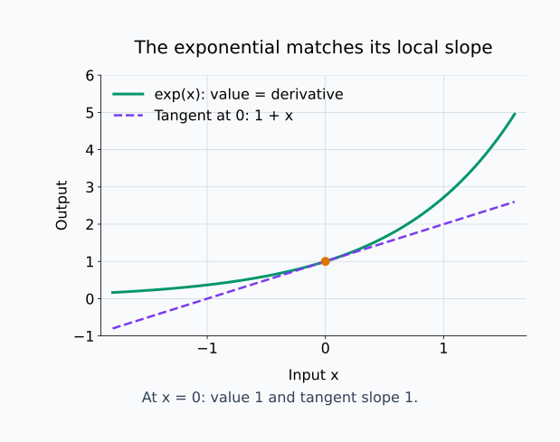
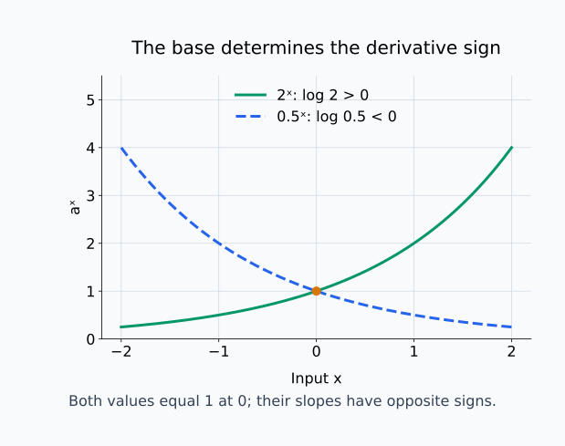
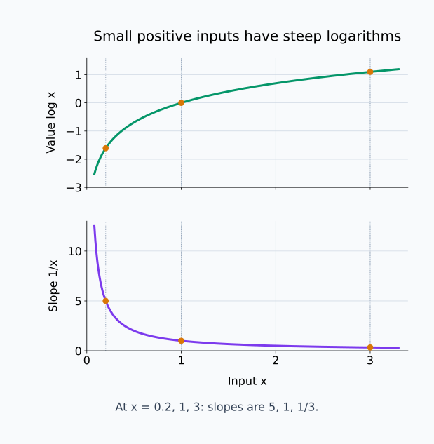
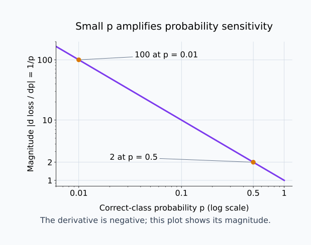
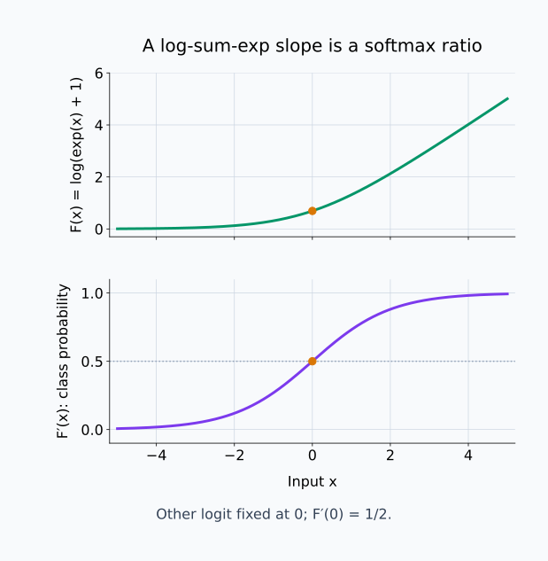

# M01-07. 지수·로그함수의 미분

## 이 단원이 필요한 이유

소프트맥스는 지수함수로 로짓을 양수로 바꾸고, 음의 로그우도와 교차엔트로피는 확률에 로그를 적용한다. 이 함수들의 변화율을 알아야 점수 변화가 확률과 손실에 어떻게 전달되는지 계산할 수 있다.

자연지수함수는 도함수가 자기 자신이고, 자연로그의 도함수는 입력의 역수다. 연쇄법칙을 함께 적용하면 긴 확률모형의 미분도 중간함수 단위로 나눌 수 있다. 로그에는 양수 입력 조건이 있으므로 미분식과 정의역을 같이 확인해야 한다.

## 학습 목표

이 단원을 마치면 다음을 할 수 있다.

- 자연지수함수와 일반 지수함수의 도함수를 구할 수 있다.
- 자연로그의 도함수와 정의역을 설명할 수 있다.
- $\exp(g(x))$와 $\log(g(x))$에 연쇄법칙을 적용할 수 있다.
- 음의 로그 손실의 변화율을 계산할 수 있다.
- 로그합지수의 일변수 도함수와 소프트맥스 확률의 관계를 설명할 수 있다.

## 선수지식 확인

- 선수 단원: [M00-05 지수와 로그](../M00/M00-05-exponents-logarithms.md)
- 선수 단원: [M01-06 합성함수와 연쇄법칙](M01-06-composition-chain-rule.md)
- 확인 질문: $\log(\exp(x))=x$인 이유와 $\log x$의 정의역을 설명할 수 있는가?
- 확인 질문: $f(g(x))$의 도함수를 $f'(g(x))g'(x)$로 계산할 수 있는가?

지수와 로그의 역관계가 불분명하면 M00-05를 먼저 복습한다.

## 기호와 용어

| 기호·용어 | Common spoken reading | 의미 | 조건 |
|---|---|---|---|
| $e$ | `e` | 자연지수함수의 밑인 자연상수 | $e\approx2.71828$ |
| $\exp(x)$ | `the exponential of x` | 자연지수함수 $e^x$ | 모든 실수 $x$에서 양수다. |
| $\log x$ | `log of x` | 이 교재에서 사용하는 자연로그 | $x>0$ |
| $a^x$ | `a to the x` | 밑이 $a$인 지수함수 | $a>0$이며 보통 $a\ne1$ |
| $\prod_{i=1}^{N}u_i$ | `product over i from one to N of u sub i` | $u_1u_2\cdots u_N$을 나타내는 곱 기호 | $N$은 양의 정수다. |
| 로그합지수 | `log sum exp` | 지수값의 합에 로그를 취한 함수 | 로그 입력이 양수여야 한다. |

## 핵심 개념 1. 자연지수함수의 도함수는 자기 자신이다

자연상수 $e$는 지수함수의 순간변화율이 함수값과 같아지도록 정한 밑이다. 따라서

\[
\frac{d}{dx}e^x=e^x
\]

이고 같은 식을 $\exp$ 표기로 쓰면

\[
\frac{d}{dx}\exp(x)=\exp(x)
\]

이다.

이 성질을 차분몫으로 읽으면 밑의 역할이 드러난다. 지수법칙 $e^{x+h}=e^xe^h$를 적용하면

\[
\frac{e^{x+h}-e^x}{h}
=
e^x\frac{e^h-1}{h}
\]

이다. 기준 입력 $x$를 고정하면 $e^x$는 $h$와 무관하다. 자연상수 $e$에서는 $(e^h-1)/h$의 $h\to0$ 극한이 $1$이므로 전체 극한이 $e^x$가 된다. 즉, 입력 위치에 따른 함수값 $e^x$와 밑에 따른 변화율 계수를 분리했을 때 그 계수가 $1$인 경우다.

$x=0$에서는 $e^0=1$이므로 접선 기울기도 $1$이다. $x$가 커져 함수값이 커지면 도함숫값도 같은 크기로 커진다. 자연지수함수는 모든 실수에서 양수이므로 도함수도 양수이고 함수는 증가한다.

아래 그림에서는 원점의 함수 높이와 그 점에서 접선의 기울기가 모두 1인 경우를 확인한다.

<figure class="lesson-figure lesson-figure--wide" markdown="1">

<figcaption>x=0에서 초록색 곡선의 높이는 1이고 보라색 접선의 기울기도 1이다. 다른 입력에서도 자연지수함수의 값과 도함숫값은 같다.</figcaption>
</figure>

## 핵심 개념 2. 일반 지수함수에는 $\log a$가 붙는다

$a>0$일 때

\[
a^x=e^{x\log a}
\]

로 쓸 수 있다. $\log(a^x)=x\log a$라는 로그 법칙에 지수함수를 적용하여 원래 양수 값 $a^x$를 되찾은 식이다. 여기서 안쪽 함수는 $x\log a$다. 밑 $a$를 고정하면 $\log a$는 상수이므로 안쪽 도함수는 $\log a$이고, 연쇄법칙을 적용하면

\[
\frac{d}{dx}a^x
=
e^{x\log a}\log a
\]

이므로

\[
\frac{d}{dx}a^x
=
a^x\log a
\]

이다.

$a=e$이면 $\log e=1$이므로 자연지수함수의 공식과 같아진다. $a>1$이면 $\log a>0$이라 도함수가 양수다. $0<a<1$이면 $\log a<0$이라 도함수가 음수이고 함수는 감소한다.

아래 그림에서 밑이 1보다 큰 경우와 작은 경우의 변화 방향을 비교한다.

<figure class="lesson-figure lesson-figure--wide" markdown="1">

<figcaption>2ˣ은 log 2가 양수라 증가하고 0.5ˣ은 log 0.5가 음수라 감소한다. 두 함수가 x=0에서 같은 값을 가져도 기울기 방향은 다르다.</figcaption>
</figure>

## 핵심 개념 3. 자연로그의 도함수는 $1/x$다

$y=\log x$라고 하자. 지수와 로그의 역관계에서

\[
e^y=x
\]

이다. $y$는 $x$에 따라 변하는 $\log x$이므로 왼쪽은 합성함수 $\exp(y(x))$다. 양변을 $x$에 대해 미분할 때 바깥 지수함수의 도함수 $e^y$에 안쪽 도함수 $dy/dx$를 곱한다. 오른쪽 $x$의 도함수는 $1$이다.

\[
e^y\frac{dy}{dx}=1
\]

$e^y=x$를 대입하면

\[
x\frac{dy}{dx}=1
\]

이므로

\[
\frac{d}{dx}\log x
=
\frac1x,
\qquad x>0
\]

이다.

$x$가 $0$의 오른쪽에 가까워지면 $1/x$가 커진다. 로그함수는 작은 양수 영역에서 입력 변화에 민감하다. $x\le0$에서는 실수 자연로그가 정의되지 않으므로 이 공식도 적용하지 않는다.

아래 두 그래프에서 같은 입력의 로그값과 기울기를 대응시켜 읽는다. 0 이하의 입력에는 로그 곡선을 그리지 않는다.

<figure class="lesson-figure lesson-figure--wide" markdown="1">

<figcaption>x=0.2, 1, 3에서 로그의 기울기는 각각 5, 1, 1/3이다. 로그의 높이가 작아지는 것과 기울기가 커지는 것은 서로 다른 양의 변화이다.</figcaption>
</figure>

## 핵심 개념 4. 합성된 지수와 로그에는 연쇄법칙을 적용한다

$g$가 필요한 점에서 미분 가능하다고 하고 $u=g(x)$라고 두자. 지수함수의 합성은

\[
\frac{d}{dx}\exp(g(x))
=
\exp(g(x))g'(x)
\]

이다.

로그함수의 합성은

\[
\frac{d}{dx}\log(g(x))
=
\frac{g'(x)}{g(x)}
\]

이다. 로그 조건

\[
g(x)>0
\]

을 먼저 확인한다.

로그 미분식의 $g'(x)/g(x)$는 출력의 절대 변화보다 입력값에 대한 상대 변화와 연결된다. 같은 $g'(x)$라도 $g(x)$가 작으면 로그의 변화율 절댓값이 커진다.

여기서 상대 변화는 $g$의 변화량을 현재 값 $g(x)$로 나눈 양이다. 작은 $\Delta x$에서 $\Delta g\approx g'(x)\Delta x$이므로 상대 변화는 약 $[g'(x)/g(x)]\Delta x$다. 로그의 변화량도 같은 일차 근사를 갖는다. 분모는 원래 입력 $x$가 아니라 로그에 들어가는 현재 값 $g(x)$라는 점을 구분한다.

## 핵심 개념 5. 로그는 곱의 도함수를 합으로 바꿔 읽게 한다

$u(x)>0$, $v(x)>0$이면

\[
\log(u(x)v(x))
=
\log u(x)+\log v(x)
\]

이다. 양변을 미분하면

\[
\frac{u'v+uv'}{uv}
=
\frac{u'}u+\frac{v'}v
\]

가 된다.

왼쪽은 곱 $uv$에 로그를 취했으므로 곱의 도함수 $u'v+uv'$를 현재 곱의 값 $uv$로 나눈 결과다. 이를 두 항으로 나누면 $u'v/(uv)=u'/u$, $uv'/(uv)=v'/v$다. 따라서 곱 전체의 상대 변화율이 각 인자의 상대 변화율을 더한 값이 된다. 로그 법칙과 미분 규칙이 같은 관계를 서로 다른 순서로 계산한 것이다.

여러 양수 항의 곱에도 같은 구조가 이어진다. 곱 기호는

\[
\prod_{i=1}^{N}u_i(x)
=
u_1(x)u_2(x)\cdots u_N(x)
\]

를 뜻한다. 따라서

\[
\frac{d}{dx}
\log\left(\prod_{i=1}^{N}u_i(x)\right)
=
\sum_{i=1}^{N}
\frac{u_i'(x)}{u_i(x)}
\]

확률값의 곱을 로그우도의 합으로 바꾸는 이유가 여기에 있다. 각 항이 양수라는 조건을 확인해야 한다.

## 핵심 개념 6. 음의 로그 손실은 작은 확률에서 큰 변화율을 가진다

정답 class에 모델이 부여한 확률을 $p$라고 하자. 음의 로그 손실은

\[
\ell(p)=-\log p,
\qquad 0<p\le1
\]

이다. $p$에 대한 도함수는

\[
\ell'(p)=-\frac1p
\]

다.

$p$가 작을수록 $|\ell'(p)|$가 커진다. 예를 들어

\[
\ell'(0.5)=-2,
\qquad
\ell'(0.01)=-100
\]

이다. 정답 확률이 작은 예에서는 확률의 작은 증가가 손실을 더 크게 낮추는 국소 변화율을 만든다.

$p$가 다시 파라미터 $\theta$의 함수라면 연쇄법칙으로

\[
\frac{d\ell}{d\theta}
=
-\frac{1}{p(\theta)}p'(\theta)
\]

이다. 확률에 대한 민감도와 파라미터가 확률을 바꾸는 비율을 곱한다.

아래 그림은 확률에 대한 음의 로그 손실 도함수의 절댓값을 그린다. 작은 확률의 넓은 범위를 표시하기 위해 두 축에 로그 눈금을 사용한다.

<figure class="lesson-figure lesson-figure--wide" markdown="1">

<figcaption>p가 0.5에서 0.01로 작아지면 확률에 대한 민감도 크기는 2에서 100으로 커진다. 실제 도함수는 음수이며 파라미터에 대한 변화율에는 dp/dθ도 필요하다.</figcaption>
</figure>

## 핵심 개념 7. 로그합지수의 도함수에 소프트맥스 비율이 나타난다

상수 $c$를 고정하고

\[
F(x)=\log\left(e^x+e^c\right)
\]

라고 하자. 연쇄법칙과 합의 미분법을 적용한다.

안쪽 함수는 $u(x)=e^x+e^c$다. $c$를 고정했으므로 $e^c$의 $x$에 대한 도함수는 $0$이고, $u'(x)=e^x$다. 바깥 로그의 도함수 $1/u$에 이를 곱하면

\[
F'(x)
=
\frac{e^x}{e^x+e^c}
\]

분자는 양수이고 분모에는 양수 $e^c$가 추가로 들어 있어 분자보다 크므로

\[
0<F'(x)<1
\]

이다. 이 비율은 두 로짓 $x$와 $c$에 소프트맥스를 적용했을 때 첫 번째 class의 확률과 같다.

여기서는 $c$를 고정하고 $x$ 하나만 바꿨다. 여러 로짓이 함께 변하는 소프트맥스의 전체 도함수는 다변수 미분과 야코비안에서 다룬다.

## 예제 1. 합성된 자연지수함수

\[
f(x)=\exp(3x-2)
\]

에서 안쪽 함수는 $u=3x-2$이고 $u'=3$이다. 따라서

\[
f'(x)
=
\exp(3x-2)\cdot3
=
3\exp(3x-2)
\]

이다.

## 예제 2. 합성된 로그함수

\[
g(x)=\log(x^2+1)
\]

에서 $x^2+1>0$이므로 모든 실수 $x$에서 정의된다. 연쇄법칙으로

\[
g'(x)
=
\frac{2x}{x^2+1}
\]

이다.

## 예제 3. 로그 정의역이 제한되는 경우

\[
h(x)=\log(2x-1)
\]

은

\[
2x-1>0
\]

일 때만 정의되므로 $x>1/2$가 필요하다. 도함수는

\[
h'(x)
=
\frac{2}{2x-1},
\qquad x>\frac12
\]

이다. 도함수만 적고 정의역을 모든 실수로 넓히면 안 된다.

## 예제 4. 고정된 다른 로짓과의 비교

$c=0$으로 두면

\[
F(x)=\log(e^x+1)
\]

이고

\[
F'(x)=\frac{e^x}{e^x+1}
\]

이다. $x=0$에서는

\[
F'(0)=\frac{1}{2}
\]

다. 두 로짓이 같으므로 소프트맥스가 두 class에 같은 확률을 준다. 이 계산은 다른 로짓을 $0$으로 고정한 일변수 결과다.

아래 그림은 로그합지수의 높이와 해당 입력에서의 소프트맥스 비율을 위아래로 나누어 표시한다.

<figure class="lesson-figure lesson-figure--wide" markdown="1">

<figcaption>위 그래프는 F의 값이고 아래 그래프는 F′이다. 아래 값은 첫 class의 확률이며 x=0에서 1/2, 다른 유한한 입력에서도 0과 1 사이에 있다.</figcaption>
</figure>

## 흔한 오해

### 오해 1. $e^x$의 도함수는 $xe^{x-1}$이다

그 식은 $x^n$의 거듭제곱 법칙을 지수함수에 잘못 적용한 결과다. 자연지수함수의 도함수는 $e^x$다.

### 오해 2. $\log x$의 도함수는 $\log(1/x)$이다

자연로그의 도함수는 $1/x$이다. 로그를 한 번 더 적용하지 않는다.

### 오해 3. $\log(g(x))$의 도함수는 $1/g(x)$이다

연쇄법칙에 따라 안쪽 도함수 $g'(x)$를 곱해야 한다. 결과는 $g'(x)/g(x)$다.

### 오해 4. 로그 도함수 식만 유한하면 원래 로그도 정의된다

$\log(g(x))$에는 $g(x)>0$ 조건이 필요하다. 대수적으로 쓴 식의 모양만으로 정의역을 넓힐 수 없다.

### 오해 5. 한 로짓에 대한 도함수가 소프트맥스 전체의 변화를 설명한다

다른 로짓을 고정한 일변수 변화율은 한 방향의 정보만 준다. 여러 로짓의 동시 변화에는 모든 입력 방향을 포함하는 도함수 구조가 필요하다.

## 연습문제

### 1. 자연지수함수 미분

\[
f(x)=5e^x-2
\]

의 도함수를 구하라.

해설 보기

$e^x$의 도함수는 $e^x$이고 상수항의 도함수는 $0$이다.

\[
f'(x)=5e^x
\]

이다.

### 2. 일반 지수함수 미분

\[
g(x)=2^x
\]

의 도함수를 구하고 부호를 설명하라.

해설 보기

일반 지수함수 공식으로

\[
g'(x)=2^x\log2
\]

이다. $2^x>0$이고 $\log2>0$이므로 도함수는 모든 실수 $x$에서 양수다. 따라서 $2^x$는 증가한다.

### 3. 지수함수와 연쇄법칙

\[
h(x)=\exp(-x^2)
\]

의 도함수를 구하라.

해설 보기

안쪽 함수 $u=-x^2$의 도함수는 $u'=-2x$다. 연쇄법칙으로

\[
h'(x)
=
\exp(-x^2)(-2x)
=
-2x\exp(-x^2)
\]

이다.

### 4. 로그함수와 정의역

\[
q(x)=\log(3x+6)
\]

의 정의역과 도함수를 구하라.

해설 보기

로그 입력이 양수여야 하므로

\[
3x+6>0
\]

이고 정의역은 $x>-2$다. 연쇄법칙으로

\[
q'(x)
=
\frac{3}{3x+6}
=
\frac{1}{x+2},
\qquad x>-2
\]

이다.

### 5. 음의 로그 손실

\[
\ell(p)=-\log p
\]

일 때 $\ell'(0.2)$를 구하고 부호를 해석하라.

해설 보기

\[
\ell'(p)=-\frac1p
\]

이므로

\[
\ell'(0.2)=-5
\]

다. $p=0.2$ 주변에서 정답 확률 $p$가 증가하면 손실이 감소하는 방향을 가진다. 이 값은 $p$에 대한 변화율이며, 모델 파라미터에 대한 변화율에는 $dp/d\theta$가 더 필요하다.

### 6. 로그합지수 미분

\[
F(x)=\log(e^x+e^2)
\]

의 도함수를 구하고 $F'(2)$를 계산하라.

해설 보기

합의 도함수와 연쇄법칙을 적용한다.

\[
F'(x)=\frac{e^x}{e^x+e^2}
\]

이다. $x=2$에서는 두 지수값이 같으므로

\[
F'(2)
=
\frac{e^2}{e^2+e^2}
=
\frac12
\]

이다.

### 7. 작은 확률의 큰 변화율 주장 판단

한 표본의 정답 확률이 $p=0.001$이어서 음의 로그 손실의 $p$에 대한 도함수 절댓값이 $1000$이었다. 연구자가 “이 표본은 모든 파라미터에 대해 가장 큰 변화율을 만든다”고 주장했다. 이 결론을 비판하라.

해설 보기

$|d\ell/dp|=1000$은 손실이 정답 확률 $p$의 변화에 민감하다는 사실을 지지한다. 파라미터 $\theta$에 대해서는

\[
\frac{d\ell}{d\theta}
=
\frac{d\ell}{dp}
\frac{dp}{d\theta}
\]

이므로 $dp/d\theta$도 필요하다. 어떤 파라미터에서는 확률 변화율이 작거나 $0$일 수 있다. 다른 표본과의 크기 비교에도 같은 파라미터, 단위와 평가 조건을 맞춰야 한다.

## 단원 요약

- 자연지수함수는 $\frac{d}{dx}e^x=e^x$를 만족한다.
- 일반 지수함수는 $\frac{d}{dx}a^x=a^x\log a$다.
- 자연로그는 $x>0$에서 $\frac{d}{dx}\log x=1/x$다.
- 합성함수에서는 $\frac{d}{dx}\exp(g)=\exp(g)g'$와 $\frac{d}{dx}\log(g)=g'/g$를 사용한다.
- 음의 로그 손실과 로그합지수의 도함수는 확률 손실과 소프트맥스 계산의 변화를 읽게 해 준다.

## 통과 기준

다음 질문에 자료를 보지 않고 답할 수 있으면 통과한다.

- $e^x$, $a^x$와 $\log x$의 도함수를 쓸 수 있는가?
- 합성된 지수·로그함수에 연쇄법칙을 적용할 수 있는가?
- 로그함수의 정의역 조건을 도함수와 함께 확인할 수 있는가?
- 음의 로그 손실이 작은 확률에서 큰 변화율을 갖는 이유를 설명할 수 있는가?
- 고정된 다른 로짓 아래 로그합지수의 도함수를 계산할 수 있는가?

## 다음 단원

- [M01-08 적분과 누적](M01-08-integration-accumulation.md)

## 집필자 점검표

- [x] 학습 목표가 관찰 가능한 행동으로 작성됐다.
- [x] 자연지수함수, 자연로그와 정의역을 사용 전에 확인했다.
- [x] 지수·로그와 연쇄법칙 예제를 검산했다.
- [x] 로그합지수를 일변수 범위로 제한했다.
- [x] 모든 문제에 해설이 있다.
- [x] 확률에 대한 변화율과 파라미터 변화율 주장을 구분했다.
- [x] 용어집과 표기 규칙을 따랐다.
- [x] 다변수 미분을 선수지식으로 요구하지 않았다.
- [x] 내부 링크와 수식 구분자를 확인했다.
- [x] Common spoken reading이 실제 영어 학술 발화이며 한글 음역이나 기계적 직역을 포함하지 않는다.
