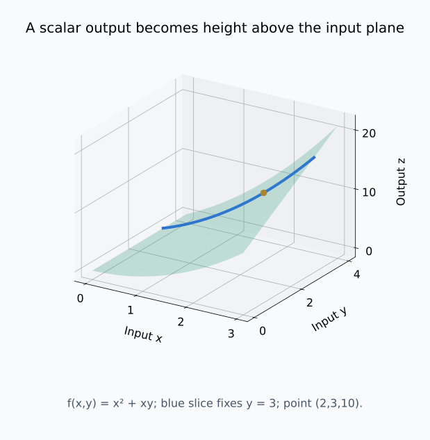
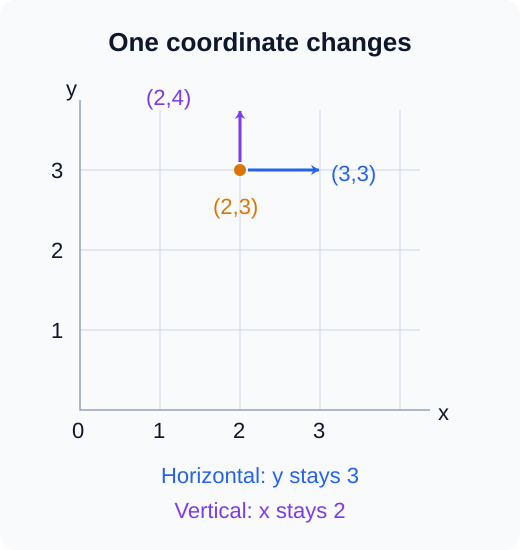
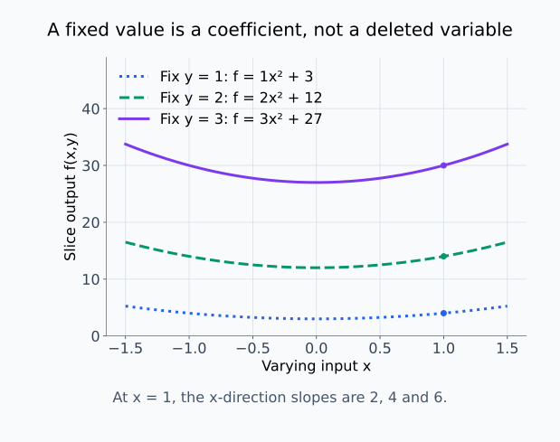
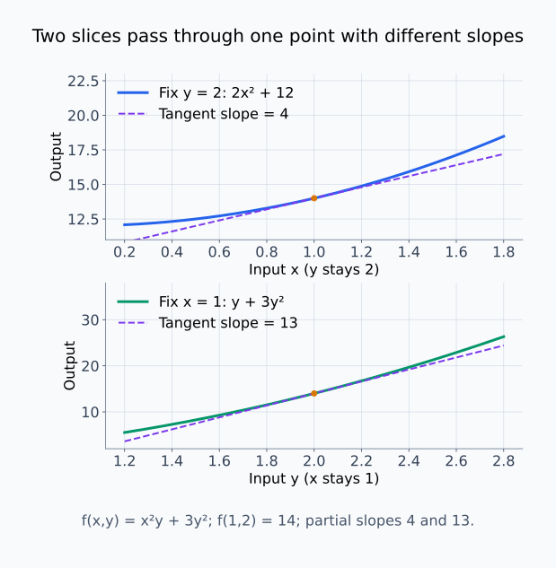
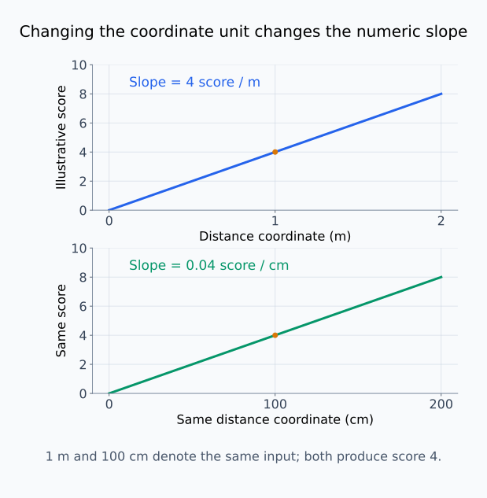
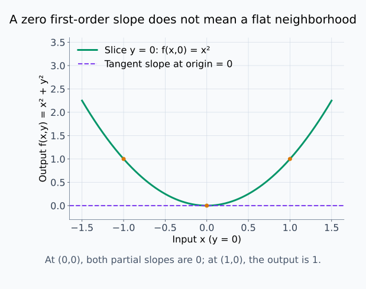
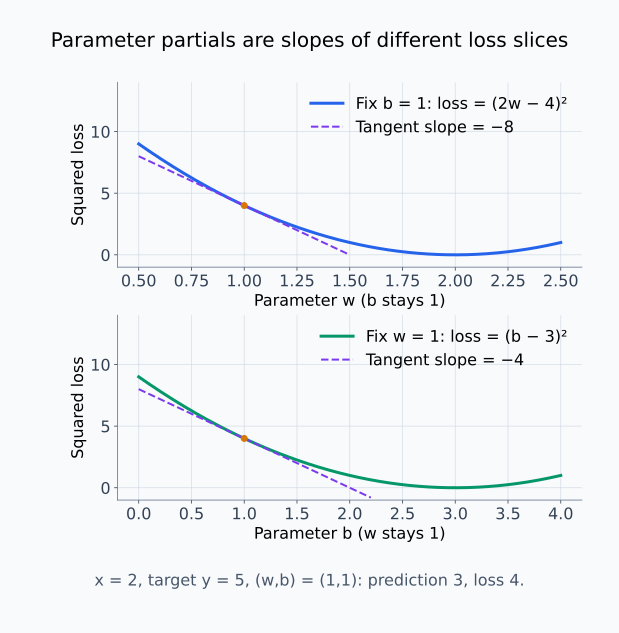
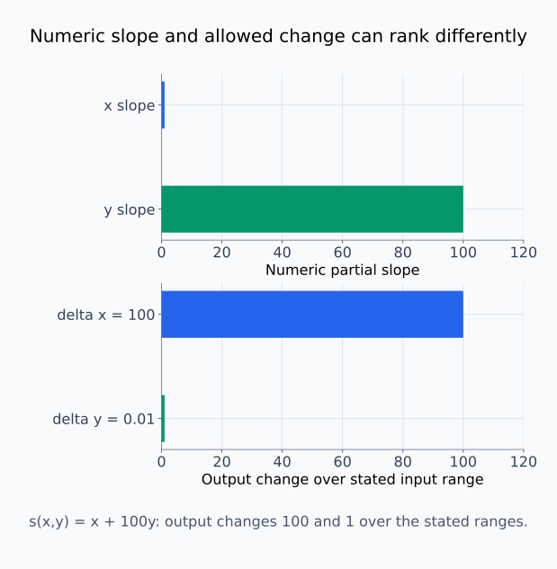

# M01-10. 여러 변수와 편미분

## 이 단원이 필요한 이유

모델의 출력은 여러 입력과 파라미터에 의존한다. 한 파라미터가 변할 때 손실이 어떻게 달라지는지 묻고 싶다면 나머지 입력을 고정한 변화율을 구해야 한다. 편미분은 이 질문을 좌표별로 나눈다.

편미분 하나는 선택한 점과 한 좌표 방향의 국소 변화만 나타낸다. 여러 변수가 함께 변하는 효과나 전체 민감도를 말하려면 좌표별 편미분을 더 조직해야 한다. 이번 단원은 각 좌표의 변화율을 계산하고, 다음 단원에서 방향미분과 그래디언트로 묶을 준비를 한다.

## 학습 목표

이 단원을 마치면 다음을 할 수 있다.

- 여러 변수의 스칼라 함수와 입력 좌표를 식으로 나타낼 수 있다.
- 편미분을 다른 변수를 고정한 순간변화율로 설명할 수 있다.
- $\partial$ 기호를 읽고 간단한 함수의 편도함수를 계산할 수 있다.
- 편도함수를 한 점에서 평가하고 부호와 단위를 해석할 수 있다.
- 한 좌표의 편미분이 지지하는 모델 해석 주장의 범위를 판단할 수 있다.

## 선수지식 확인

- 선수 단원: [M00-09 스칼라·벡터·행렬의 shape](../M00/M00-09-scalars-vectors-matrices-shape.md)
- 선수 단원: [M01-06 합성함수와 연쇄법칙](M01-06-composition-chain-rule.md)
- 선수 단원: [M01-07 지수·로그함수의 미분](M01-07-exponential-log-derivatives.md)
- 확인 질문: $f(x)=x^2$의 도함수와 $f'(2)$을 구분할 수 있는가?
- 확인 질문: 함수 $z=f(x,y)$가 입력 두 개와 출력 하나를 가진다는 뜻을 설명할 수 있는가?

입력과 출력의 종류가 불분명하면 M00-09를 먼저 복습한다.

## 기호와 용어

| 기호·용어 | Common spoken reading | 의미 | shape·조건 |
|---|---|---|---|
| $f:\mathbb R^2\to\mathbb R$ | `f maps R squared into R` | 실수 입력 두 개를 스칼라 하나로 보내는 함수 | 입력 $(x,y)$, 출력 $f(x,y)$ |
| $\frac{\partial f}{\partial x}$ | `partial f over partial x` | $y$를 고정하고 $x$만 바꾼 변화율 | 스칼라 함수다. |
| $\frac{\partial f}{\partial y}$ | `partial f over partial y` | $x$를 고정하고 $y$만 바꾼 변화율 | 스칼라 함수다. |
| $f_x,f_y$ | `f sub x and f sub y` | 두 편도함수의 축약 표기 | 문헌의 정의를 확인한다. |
| 편미분 | `partial differentiation` | 다른 입력을 고정하고 한 입력에 대해 미분하는 과정 | 선택한 좌표를 명시한다. |
| 편도함수 | `partial derivative function` | 각 점에 한 좌표 방향의 편미분계수를 대응시키는 함수 | 출력은 스칼라다. |

## 핵심 개념 1. 여러 변수의 함수는 입력점 전체를 받는다

\[
f(x,y)=x^2+xy
\]

는 실수 두 개 $x,y$를 받아 실수 하나를 출력한다.

\[
f:\mathbb R^2\to\mathbb R
\]

입력은 좌표쌍 $(x,y)$다. 예를 들어

\[
f(2,3)=2^2+2\cdot3=10
\]

이다.

일변수 함수의 그래프가 평면의 곡선이라면, 두 변수 함수의 그래프 $z=f(x,y)$는 삼차원 좌표에서 곡면으로 나타낼 수 있다. 편미분은 이 곡면을 한 좌표 방향으로 잘라 얻은 곡선의 기울기다.

입력점 $(x,y)$는 입력 평면에 놓이고, 그래프를 그릴 때는 출력 높이 $z$를 추가해 $(x,y,f(x,y))$로 표시한다. $y=b$를 고정하면 그래프 위의 점들은 $(x,b,f(x,b))$가 된다. 이 단면에서는 $x$만 움직이므로 $x$에 대한 변화율을 일변수 곡선의 기울기로 읽을 수 있다.

입력 평면 위의 위치와 출력 높이를 함께 그리면, 좌표쌍을 받는 함수가 어떻게 곡면을 만드는지 확인할 수 있다.

<figure class="lesson-figure lesson-figure--wide" markdown="1">
  
  <figcaption>초록색 곡면은 z=x²+xy이고 파란색 곡선은 y=3인 단면이다. 입력 (2,3)의 출력 10은 곡면 위의 점 (2,3,10)의 높이로 표시된다. 파란 곡선을 따라 이동할 때 바뀌는 입력은 x뿐이다.</figcaption>
</figure>

## 핵심 개념 2. $x$에 대한 편미분은 다른 변수를 고정한다

점 $(a,b)$에서 $x$에 대한 편미분계수는

\[
\frac{\partial f}{\partial x}(a,b)
\coloneqq
\lim_{h\to0}
\frac{f(a+h,b)-f(a,b)}{h}
\]

이다. $y=b$를 고정하고 $x$만 $a$에서 $a+h$로 바꾼다.

$y$에 대한 편미분계수는

\[
\frac{\partial f}{\partial y}(a,b)
\coloneqq
\lim_{h\to0}
\frac{f(a,b+h)-f(a,b)}{h}
\]

이다. 이번에는 $x=a$를 고정한다.

각 극한이 유한한 실수로 존재할 때 해당 편미분계수를 얻는다. 첫 정의에서는 $g(x)=f(x,b)$라는 일변수 함수를 만든 뒤 $g'(a)$를 구한 것과 같다. 고정한다는 말은 두 함수값에서 $b$를 같은 값으로 사용한다는 뜻이지, $b$를 $0$으로 바꾸거나 식에서 없앤다는 뜻이 아니다. $x$를 바꿀 때 $y$도 함께 바꾸면 다른 경로의 변화율을 구하게 된다.

두 정의는 서로 다른 입력 방향을 측정한다. 같은 점에서도 값과 부호가 다를 수 있다.

어느 입력을 고정했는지는 출력 그래프를 보기 전에도 입력 평면에서 구분할 수 있다.

<figure class="lesson-figure" markdown="1">
  
  <figcaption>가로 이동은 y=3을 유지하고 x만 바꾼다. 세로 이동은 x=2를 유지하고 y만 바꾼다. 이 그림은 입력의 이동을 보여 주며, 함수값의 높이나 변화율을 표시한 것은 아니다.</figcaption>
</figure>

## 핵심 개념 3. 계산할 때 나머지 변수를 상수로 취급한다

\[
f(x,y)=x^2y+3y^2
\]

를 생각하자. $x$에 대해 편미분할 때 $y$를 상수로 둔다.

\[
\frac{\partial f}{\partial x}
=
2xy
\]

$3y^2$은 $x$와 무관하므로 $x$에 대한 변화율이 $0$이다.

반면 $x^2y$에서는 고정한 $y$가 $x^2$의 계수다. 상수배 규칙으로 $y\cdot2x=2xy$가 된다. 고정한 변수가 곱의 계수로 남는 경우와 그 변수만으로 이루어진 항이 미분되어 $0$이 되는 경우를 구분해야 한다.

$y$에 대해 편미분할 때 $x$를 상수로 둔다.

\[
\frac{\partial f}{\partial y}
=
x^2+6y
\]

두 편도함수는 입력 $(x,y)$에 따라 값이 달라지는 함수다.

상수로 취급한다는 판단은 어느 변수로 미분하는지에 달려 있다. $y$로 미분할 때 $x^2y$의 $x^2$는 계수로 남고, $y$의 도함수가 $1$이므로 첫 항이 $x^2$다. 또 $x$에 대한 편도함수에 $y$가 남아 있다는 것은 모순이 아니다. 한 단면에서 $y$를 고정해 미분한 뒤, 다른 단면을 조사하면 고정값 $y$도 달라질 수 있다.

서로 다른 고정값을 선택하면 서로 다른 일변수 단면이 생긴다. 고정한 변수는 각 단면에서 계수로 남는다.

<figure class="lesson-figure lesson-figure--wide" markdown="1">
  
  <figcaption>y를 1, 2, 3으로 고정하면 단면은 각각 x²+3, 2x²+12, 3x²+27이다. 같은 x=1에서도 기울기는 2, 4, 6으로 달라진다. y를 고정한다는 것은 y를 지우는 것이 아니다.</figcaption>
</figure>

## 핵심 개념 4. 점에서 평가하면 좌표 방향의 기울기를 얻는다

앞의 함수에서 $(x,y)=(1,2)$를 대입하면

\[
\frac{\partial f}{\partial x}(1,2)
=
2\cdot1\cdot2
=4
\]

이고

\[
\frac{\partial f}{\partial y}(1,2)
=
1^2+6\cdot2
=13
\]

이다.

첫 값은 $y=2$를 고정한 채 $x$를 늘릴 때의 국소 변화율이다. 둘째 값은 $x=1$을 고정한 채 $y$를 늘릴 때의 국소 변화율이다. 두 수의 크기를 비교하려면 $x$와 $y$의 단위와 척도를 함께 확인해야 한다.

같은 입력점의 출력 높이는 하나지만, 어느 좌표를 바꾸는지에 따라 단면의 접선 기울기는 달라진다.

<figure class="lesson-figure lesson-figure--wide" markdown="1">
  
  <figcaption>두 그래프의 주황색 점은 모두 원래 입력 (1,2)의 출력 14를 나타낸다. 위에서는 y=2를 고정한 x 방향 기울기가 4이고, 아래에서는 x=1을 고정한 y 방향 기울기가 13이다. 가로축이 서로 다른 입력임에 주의한다.</figcaption>
</figure>

## 핵심 개념 5. $d$와 $\partial$은 입력 구조를 구분한다

일변수 함수 $g(x)$에는

\[
\frac{dg}{dx}
\]

를 사용한다. 여러 변수 함수 $f(x,y)$에서 한 변수를 선택해 미분할 때는

\[
\frac{\partial f}{\partial x},
\qquad
\frac{\partial f}{\partial y}
\]

를 사용한다.

기호 $\partial$은 다른 독립변수가 있다는 사실을 드러낸다. 모든 변수가 한 경로 파라미터에 의존하면 전체 경로의 변화율에는 편도함수와 각 변수의 변화율이 함께 들어간다. 그 결합은 다음 단원의 방향미분에서 다룬다.

## 핵심 개념 6. 편미분에도 일변수 미분 규칙을 적용한다

다른 변수를 고정한 뒤에는 합, 곱과 연쇄법칙을 그대로 사용할 수 있다.

\[
f(x,y)=\exp(xy)
\]

에서 $y$를 상수로 보면 안쪽 함수 $xy$의 $x$에 대한 도함수는 $y$다.

\[
\frac{\partial f}{\partial x}
=
y\exp(xy)
\]

반대로 $x$를 상수로 보면

\[
\frac{\partial f}{\partial y}
=
x\exp(xy)
\]

이다.

로그에서도 정의역을 확인한다. $g(x,y)>0$이면

\[
\frac{\partial}{\partial x}\log g(x,y)
=
\frac{1}{g(x,y)}
\frac{\partial g}{\partial x}(x,y)
\]

이다.

## 핵심 개념 7. 단위는 선택한 입력 좌표에 따라 달라진다

온도 $T$와 압력 $P$에 따른 점수를 $s(T,P)$라고 하자.

\[
\frac{\partial s}{\partial T}
\]

의 단위는 `점수/온도`이고

\[
\frac{\partial s}{\partial P}
\]

의 단위는 `점수/압력`이다. 두 값은 단위가 다르므로 수치의 절댓값만 비교해 어느 변수가 더 중요하다고 정할 수 없다.

입력 재척도도 편도함숫값을 바꾼다. 미터 대신 센티미터를 사용하면 좌표 숫자가 100배 달라지고 그 좌표에 대한 변화율은 반대 비율로 달라진다. 민감도 비교에는 단위와 허용 변화 범위를 명시해야 한다.

센티미터 좌표를 $1$만큼 늘리는 것은 미터 좌표를 $0.01$만큼 늘리는 것과 같은 물리적 변화다. 같은 출력 변화량을 센티미터의 변화량으로 나누면 미터의 변화량으로 나눴을 때보다 $1/100$인 변화율을 얻는다. 함수의 물리적 반응이 달라진 것이 아니라 변화량을 재는 입력 단위가 달라진 것이다.

같은 물리적 입력을 서로 다른 단위로 표시하면, 그래프의 가로축 척도와 기울기의 숫자가 함께 달라진다.

<figure class="lesson-figure lesson-figure--wide" markdown="1">
  
  <figcaption>설명용 점수는 거리를 미터로 표시하면 기울기 4, 센티미터로 표시하면 기울기 0.04다. 두 주황색 점은 같은 거리 1m=100cm와 같은 점수 4를 나타낸다. 출력의 반응이 바뀐 것이 아니라 입력 숫자의 척도가 바뀌었다.</figcaption>
</figure>

## 핵심 개념 8. 한 좌표의 편미분은 다른 방향을 설명하지 않는다

\[
\frac{\partial f}{\partial x}(a,b)=0
\]

은 $y=b$를 고정한 $x$ 방향의 일차 변화율이 $0$이라는 뜻이다. $y$ 방향이나 $x$와 $y$를 함께 바꾸는 방향의 변화율은 이 값에서 알 수 없다.

편미분이 $0$이어도 유한한 크기의 변화 뒤에는 함수값이 달라질 수 있다. 예를 들어 $f(x,y)=x^2+y^2$에서 원점의 두 편미분은 $0$이지만 원점에서 떨어진 점의 함수값은 양수다.

일차 변화율이 0이라는 것과 유한한 이동 뒤 함수값이 같다는 것은 다른 주장이다.

<figure class="lesson-figure lesson-figure--wide" markdown="1">
  
  <figcaption>원점에서 두 편미분은 0이다. 그중 y=0인 단면을 보면 원점의 접선은 수평이지만, x를 1만큼 이동한 함수값은 1이다. 접선은 국소 일차 변화만 나타낸다.</figcaption>
</figure>

## 예제 1. 다항식의 편도함수

\[
f(x,y)=3x^2y-2xy^2+5
\]

에서 $y$를 고정하고 $x$에 대해 미분한다.

\[
\frac{\partial f}{\partial x}
=
6xy-2y^2
\]

$x$를 고정하고 $y$에 대해 미분하면

\[
\frac{\partial f}{\partial y}
=
3x^2-4xy
\]

이다.

## 예제 2. 한 좌표를 고정한 단면

\[
f(x,y)=x^2+xy
\]

에서 $y=3$으로 고정하면 일변수 단면은

\[
g(x)=f(x,3)=x^2+3x
\]

이다. 이 단면의 도함수는

\[
g'(x)=2x+3
\]

이고 원래 함수의 편도함수에 $y=3$을 넣어도

\[
\frac{\partial f}{\partial x}(x,3)
=
2x+3
\]

을 얻는다.

## 예제 3. 선형 예측의 제곱손실

입력 $x$와 정답 $y$를 고정하고, 파라미터 $w,b$에 대한 예측과 손실을

\[
\hat y=wx+b
\]

\[
\mathcal L(w,b)=(\hat y-y)^2
\]

라고 하자. 오차를

\[
e=wx+b-y
\]

로 두면 $\mathcal L=e^2$다. 연쇄법칙으로

\[
\frac{\partial\mathcal L}{\partial w}
=
2e\frac{\partial e}{\partial w}
=
2ex
\]

이고

\[
\frac{\partial\mathcal L}{\partial b}
=
2e\frac{\partial e}{\partial b}
=
2e
\]

이다.

$x=2$, $y=5$, $w=1$, $b=1$이면 $e=2+1-5=-2$다. 따라서

\[
\frac{\partial\mathcal L}{\partial w}=-8,
\qquad
\frac{\partial\mathcal L}{\partial b}=-4
\]

이다.

손실에서도 다른 파라미터를 고정한 두 단면을 그리면, 두 편미분이 각각 어느 기울기인지 확인할 수 있다.

<figure class="lesson-figure lesson-figure--wide" markdown="1">
  
  <figcaption>입력과 정답을 고정한 상태에서 (w,b)=(1,1)의 손실은 4다. 위 그래프는 b를 고정하고 w만 바꾸며 기울기는 −8이다. 아래는 w를 고정하고 b만 바꾸며 기울기는 −4다. 두 점은 같은 파라미터 상태에서 얻었다.</figcaption>
</figure>

## 예제 4. 같은 함수에서 다른 좌표 민감도

\[
s(x,y)=x+100y
\]

이면

\[
\frac{\partial s}{\partial x}=1,
\qquad
\frac{\partial s}{\partial y}=100
\]

이다. 수치만 보면 $y$ 방향이 더 민감해 보인다. 그러나 $x$의 자연스러운 변화 범위가 $100$이고 $y$의 변화 범위가 $0.01$이라면 허용 범위에서의 출력 변화는 다른 비교를 만든다. 편도함숫값과 입력 척도를 함께 제시해야 한다.

이 선형 함수에서는 기울기에 실제 입력 변화량을 곱한 출력 변화가 정확하다. 허용 범위를 붙이면 숫자 기울기만 비교했을 때와 순서가 달라진다.

<figure class="lesson-figure lesson-figure--wide" markdown="1">
  
  <figcaption>위에서는 y의 편도함숫값 100이 x의 값 1보다 크다. 아래에서는 x를 100만큼 바꾼 출력 변화 100이 y를 0.01만큼 바꾼 변화 1보다 크다. 막대의 비교 대상과 가로축이 위아래에서 다르다.</figcaption>
</figure>

## 흔한 오해

### 오해 1. $x$에 대해 편미분할 때 다른 변수를 $0$으로 둔다

다른 변수는 현재 값을 유지한 상수로 취급한다. $0$을 대입하는 규칙이 아니다.

### 오해 2. $\partial f/\partial x$는 한 개의 고정된 수다

편도함수는 입력점에 따라 값이 달라지는 함수다. 점을 대입한 $\frac{\partial f}{\partial x}(a,b)$가 스칼라 값이다.

### 오해 3. 한 편미분이 $0$이면 함수는 그 점 주변에서 변하지 않는다

해당 좌표 방향의 일차 변화율만 $0$이다. 다른 방향과 유한한 변화는 남을 수 있다.

### 오해 4. 편도함수 절댓값이 가장 큰 좌표가 가장 중요한 원인이다

편도함수는 단위와 좌표 척도에 의존하는 국소 민감도다. 인과적 중요성에는 개입과 대조 조건이 필요하다.

### 오해 5. 벡터 출력도 편도함수 하나로 표현한다

이 단원은 스칼라 출력 함수를 다룬다. 벡터 출력의 모든 성분과 입력 좌표 사이 변화율은 야코비안으로 정리한다.

## 연습문제

### 1. 편미분 기호 읽기

\[
\frac{\partial f}{\partial x}(2,-1)=3
\]

을 한국어 문장으로 설명하라.

해설 보기

점 $(2,-1)$에서 $y=-1$을 고정하고 $x$만 바꿀 때 함수 $f$의 순간변화율이 $3$이라는 뜻이다. $x$ 방향 단면의 접선 기울기가 $3$이라고도 말할 수 있다.

### 2. 두 편도함수 계산

\[
f(x,y)=x^2+3xy+y^2
\]

의 $x$와 $y$에 대한 편도함수를 구하라.

해설 보기

$y$를 상수로 두고 $x$에 대해 미분한다.

\[
\frac{\partial f}{\partial x}
=
2x+3y
\]

$x$를 상수로 두고 $y$에 대해 미분한다.

\[
\frac{\partial f}{\partial y}
=
3x+2y
\]

이다.

### 3. 한 점에서 평가하기

문제 2의 편도함수를 $(x,y)=(1,2)$에서 평가하라.

해설 보기

\[
\frac{\partial f}{\partial x}(1,2)
=
2\cdot1+3\cdot2
=8
\]

이고

\[
\frac{\partial f}{\partial y}(1,2)
=
3\cdot1+2\cdot2
=7
\]

이다. 첫 값은 $y=2$를 고정한 $x$ 방향 변화율이고 둘째 값은 $x=1$을 고정한 $y$ 방향 변화율이다.

### 4. 지수함수 편미분

\[
g(x,y)=\exp(x+2y)
\]

의 두 편도함수를 구하라.

해설 보기

$x$에 대해 미분할 때 안쪽 함수 $x+2y$의 변화율은 $1$이다.

\[
\frac{\partial g}{\partial x}
=
\exp(x+2y)
\]

$y$에 대해 미분할 때 안쪽 변화율은 $2$다.

\[
\frac{\partial g}{\partial y}
=
2\exp(x+2y)
\]

이다.

### 5. 제곱손실의 파라미터 편미분

\[
\mathcal L(w,b)=(3w+b-4)^2
\]

의 $w$와 $b$에 대한 편도함수를 구하라.

해설 보기

$e=3w+b-4$로 두면 $\mathcal L=e^2$다.

\[
\frac{\partial\mathcal L}{\partial w}
=
2e\cdot3
=
6(3w+b-4)
\]

이고

\[
\frac{\partial\mathcal L}{\partial b}
=
2e\cdot1
=
2(3w+b-4)
\]

이다.

### 6. 편미분이 0인 점

\[
f(x,y)=x^2+y
\]

에서 $\frac{\partial f}{\partial x}(0,2)$을 구하고, 이 결과만으로 $f$가 $(0,2)$ 주변의 모든 방향에서 일정하다고 말할 수 있는지 판단하라.

해설 보기

\[
\frac{\partial f}{\partial x}=2x
\]

이므로

\[
\frac{\partial f}{\partial x}(0,2)=0
\]

이다. 이는 $y=2$를 고정한 $x$ 방향의 일차 변화율이 $0$이라는 뜻이다. $y$에 대한 편도함수는 $1$이므로 $y$ 방향에서는 함수가 변한다. 모든 방향에서 일정하다는 결론은 성립하지 않는다.

### 7. 좌표 민감도 주장 판단

표준화하지 않은 두 입력 $x_1,x_2$에 대해 한 점에서

\[
\left|\frac{\partial s}{\partial x_1}\right|=50,
\qquad
\left|\frac{\partial s}{\partial x_2}\right|=2
\]

를 얻었다. 연구자가 “$x_1$이 $x_2$보다 모델 출력의 원인으로 25배 중요하다”고 주장했다. 이 결론을 비판하고 필요한 정보를 제시하라.

해설 보기

두 값은 선택한 점에서 각 좌표를 따로 바꿀 때의 국소 민감도다. 입력 단위와 척도가 다르면 절댓값의 비 $25$를 중요도 비로 해석할 수 없다.

허용할 입력 변화 범위, 단위와 여러 데이터점에서의 민감도를 확인해야 한다. 원인이라는 주장을 하려면 데이터 생성 과정과 통제된 개입, 대조 조건도 필요하다.

## 단원 요약

- 여러 변수의 스칼라 함수는 입력점 $(x,y)$ 전체를 받아 스칼라를 출력한다.
- $\partial f/\partial x$는 다른 변수를 고정하고 $x$만 바꾼 국소 변화율이다.
- 편미분할 때 고정한 변수는 상수로 취급하며 일변수 미분 규칙을 적용한다.
- 편도함숫값은 점, 좌표 방향, 단위와 척도에 의존한다.
- 한 좌표의 편미분은 다른 방향의 변화나 인과효과를 설명하지 않는다.

## 통과 기준

다음 질문에 자료를 보지 않고 답할 수 있으면 통과한다.

- $f:\mathbb R^2\to\mathbb R$의 입력과 출력을 설명할 수 있는가?
- 편미분 정의에서 어떤 변수를 고정하는지 말할 수 있는가?
- 다항식과 합성함수의 두 편도함수를 계산할 수 있는가?
- 편도함수를 한 점에서 평가하고 부호와 단위를 해석할 수 있는가?
- 한 좌표의 편미분이 $0$일 때 말할 수 없는 내용을 구분할 수 있는가?

## 다음 단원

다음 단원은 [M01-11 방향미분과 gradient](M01-11-directional-derivative-gradient.md)이다. 좌표별 편미분을 벡터로 모으고 임의의 방향에서의 변화율과 연결한다.

## 집필자 점검표

- [x] 학습 목표가 관찰 가능한 행동으로 작성됐다.
- [x] 다변수 스칼라 함수와 편미분 기호를 사용 전에 정의했다.
- [x] 다른 변수를 고정한다는 계산 원칙을 예제로 확인했다.
- [x] 다항식, 지수함수와 제곱손실 편미분을 검산했다.
- [x] 모든 문제에 해설이 있다.
- [x] 좌표 민감도와 인과 중요도 주장을 구분했다.
- [x] 용어집과 표기 규칙을 따랐다.
- [x] 방향미분, 그래디언트와 야코비안을 선수지식으로 요구하지 않았다.
- [x] 내부 링크와 수식 구분자를 확인했다.
- [x] Common spoken reading이 실제 영어 학술 발화이며 한글 음역이나 기계적 직역을 포함하지 않는다.
