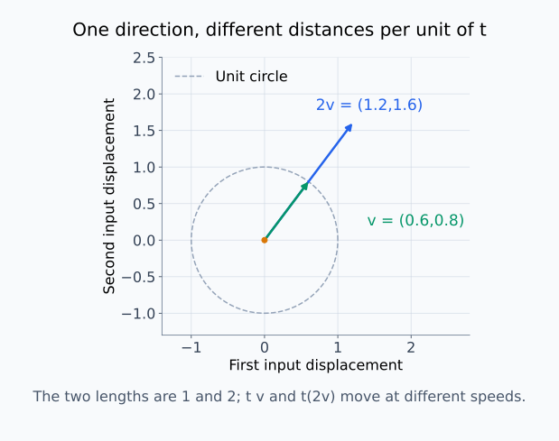
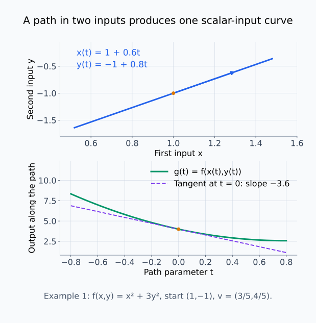
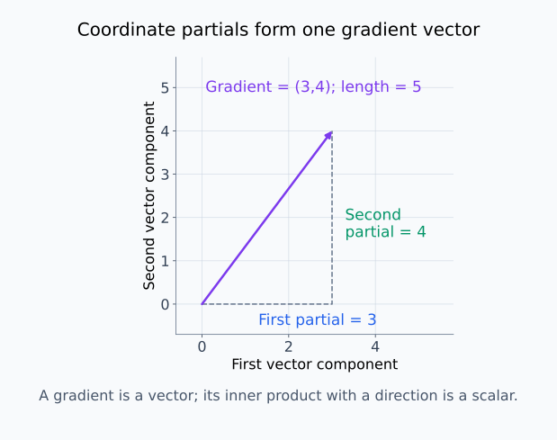
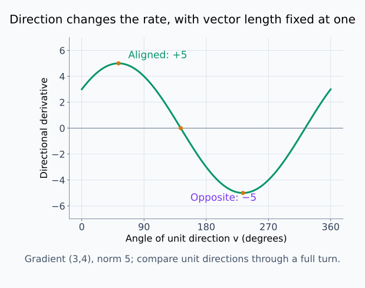
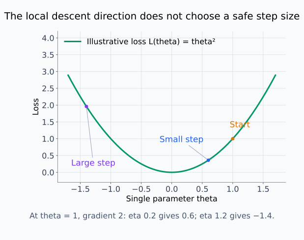
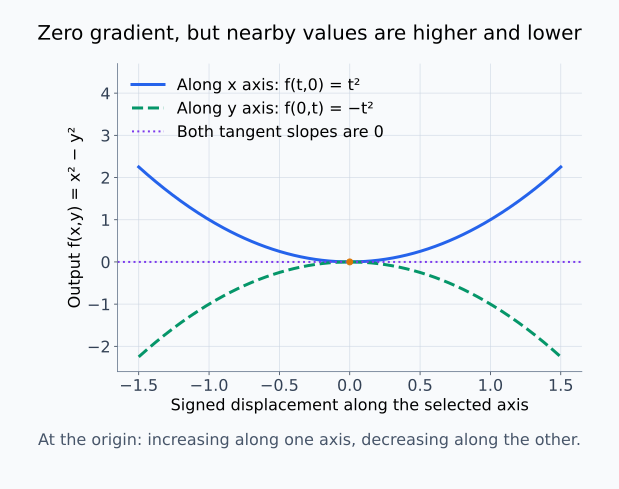
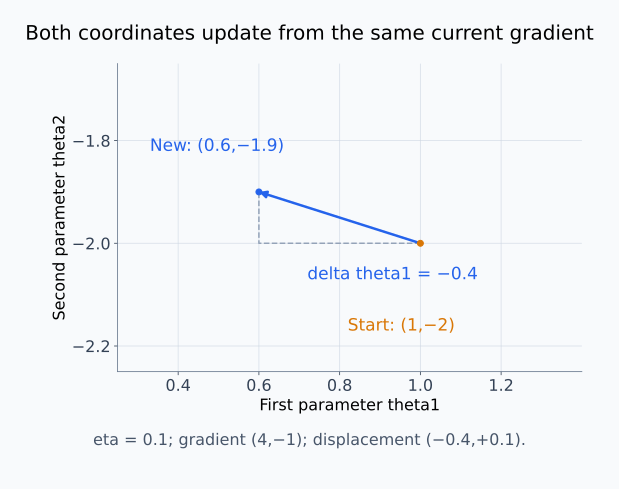

# M01-11. 방향미분과 gradient

## 이 단원이 필요한 이유

편미분은 좌표축 하나를 따라 측정한 변화율이다. 실제 입력이나 파라미터는 여러 좌표가 함께 바뀔 수 있다. 방향미분은 선택한 방향으로 움직일 때 스칼라 함수가 얼마나 변하는지 측정하고, 그래디언트는 모든 좌표 편미분을 한 벡터에 모은다.

그래디언트는 역전파, 최적화와 입력 민감도 분석에서 반복해서 등장한다. 그래디언트의 크기와 방향은 좌표계와 단위에 의존하므로, 큰 성분을 곧바로 인과적 중요도로 읽지 않아야 한다.

## 학습 목표

이 단원을 마치면 다음을 할 수 있다.

- 방향벡터와 단위벡터를 구분할 수 있다.
- 방향미분을 한 경로의 일변수 미분으로 정의할 수 있다.
- 편도함수를 열벡터로 모아 그래디언트를 계산할 수 있다.
- 방향미분을 그래디언트와 방향벡터의 내적으로 구할 수 있다.
- 최급상승·하강 방향과 그래디언트의 한계를 설명할 수 있다.

## 선수지식 확인

- 선수 단원: [M00-09 스칼라·벡터·행렬의 shape](../M00/M00-09-scalars-vectors-matrices-shape.md)
- 선수 단원: [M01-10 여러 변수와 편미분](M01-10-multivariable-partial-derivatives.md)
- 확인 질문: 두 벡터의 내적이 스칼라라는 사실을 설명할 수 있는가?
- 확인 질문: $f(x,y)$의 두 편도함수를 계산할 수 있는가?

벡터 shape이나 편미분이 불분명하면 선수 단원을 먼저 복습한다.

## 기호와 용어

| 기호·용어 | Common spoken reading | 의미 | shape·조건 |
|---|---|---|---|
| $\mathbf x$ | `x` | 여러 입력 좌표를 모은 열벡터 | $\mathbf x\in\mathbb R^n$ |
| $\mathbf v$ | `v` | 입력공간에서 움직일 방향을 나타내는 열벡터 | $\mathbf v\in\mathbb R^n$ |
| $\|\mathbf v\|_2$ | `the L two norm of v` | 방향벡터의 유클리드 길이 | 단위방향이면 $\|\mathbf v\|_2=1$ |
| $D_{\mathbf v}f(\mathbf x)$ | `the directional derivative of f at x along v` | 점 $\mathbf x$에서 방향 $\mathbf v$로의 변화율 | 이 단원에서는 주로 단위벡터를 쓴다. |
| $\nabla_{\mathbf x}f$ | `the gradient of f with respect to x` | 좌표별 편도함수를 모은 열벡터 | $\nabla_{\mathbf x}f\in\mathbb R^n$ |
| $\nabla f(\mathbf x)^\top\mathbf v$ | `the gradient of f at x transpose times v` | 그래디언트와 방향벡터의 내적 | 결과는 스칼라다. |

## 핵심 개념 1. 방향벡터는 여러 좌표의 이동 비율을 정한다

점

\[
\mathbf x=
\begin{bmatrix}
x_1\\
x_2
\end{bmatrix}
\]

에서 방향

\[
\mathbf v=
\begin{bmatrix}
v_1\\
v_2
\end{bmatrix}
\]

으로 $t$만큼 움직이면 새 점은

\[
\mathbf x+t\mathbf v
=
\begin{bmatrix}
x_1+tv_1\\
x_2+tv_2
\end{bmatrix}
\]

이다. $v_1$과 $v_2$는 두 좌표가 함께 변하는 비율을 정한다.

길이가 $1$인 벡터를 단위벡터(unit vector)라고 한다.

\[
\|\mathbf v\|_2
=
\sqrt{v_1^2+v_2^2}
=1
\]

방향미분에서 단위벡터를 사용하면 방향과 이동 속도를 분리할 수 있다. 길이가 $2$인 벡터를 쓰면 같은 방향이라도 $t$ 한 단위당 두 배 멀리 움직인다.

같은 방향의 화살표도 길이가 다르면 같은 t에 대한 이동 거리가 다르다.

<figure class="lesson-figure lesson-figure--wide" markdown="1">
  
  <figcaption>초록색 벡터 (0.6,0.8)의 길이는 1이고 파란색 벡터 (1.2,1.6)의 길이는 2다. 방향은 같지만 t를 1만큼 늘렸을 때 파란 경로가 두 배 멀리 이동한다. 회색 점선 원은 길이 1인 벡터의 끝점들을 나타낸다.</figcaption>
</figure>

## 핵심 개념 2. 방향미분은 경로를 만든 뒤 일변수로 미분한다

스칼라 함수 $f:\mathbb R^n\to\mathbb R$에서 점 $\mathbf x$와 방향 $\mathbf v$를 고정한다. 일변수 함수

\[
g(t)=f(\mathbf x+t\mathbf v)
\]

를 만들면 $t=0$에서의 도함수가 방향미분이다.

\[
D_{\mathbf v}f(\mathbf x)
\coloneqq
g'(0)
\]

극한으로 쓰면

\[
D_{\mathbf v}f(\mathbf x)
=
\lim_{t\to0}
\frac{f(\mathbf x+t\mathbf v)-f(\mathbf x)}{t}
\]

이다. 결과는 선택한 점과 방향에서의 스칼라 변화율이다.

$g(0)=f(\mathbf x)$이므로 $t=0$은 출발점이고, $t$를 바꾸면 경로 위의 입력점 전체가 움직인다. $t<0$은 $\mathbf v$의 반대쪽으로 접근하는 경우다. 극한의 분모는 입력 벡터가 아니라 경로 파라미터의 변화량 $t$다. 단위방향을 쓰면 $t$의 크기가 이동 거리와 같지만, 일반 방향벡터에서는 그 길이만큼 이동 속도도 달라진다.

예제 1의 입력 경로를 그린 뒤 출력만 t의 함수로 다시 그리면, 방향미분이 어느 그래프의 기울기인지 구분할 수 있다.

<figure class="lesson-figure lesson-figure--wide" markdown="1">
  
  <figcaption>위는 입력 평면에서 x와 y가 함께 바뀌는 경로다. 아래는 그 입력들을 f에 넣은 출력 g(t)다. 출발점 t=0에서 아래 곡선의 기울기 −3.6이 방향미분이며, 위 화살표의 좌표 성분 자체와는 다른 양이다.</figcaption>
</figure>

## 핵심 개념 3. 그래디언트는 좌표별 편도함수의 열벡터다

$f:\mathbb R^n\to\mathbb R$의 그래디언트(gradient)는

\[
\nabla_{\mathbf x}f(\mathbf x)
=
\begin{bmatrix}
\frac{\partial f}{\partial x_1}(\mathbf x)\\
\vdots\\
\frac{\partial f}{\partial x_n}(\mathbf x)
\end{bmatrix}
\in\mathbb R^n
\]

이다. 이 교재는 그래디언트를 열벡터로 쓴다.

두 변수 함수에서는

\[
\nabla f(x,y)
=
\begin{bmatrix}
f_x(x,y)\\
f_y(x,y)
\end{bmatrix}
\]

이다. 그래디언트의 각 성분은 해당 좌표축 방향의 변화율이다.

두 좌표 편미분을 벡터 성분으로 놓으면 방향과 길이를 가진 하나의 화살표가 된다.

<figure class="lesson-figure lesson-figure--wide" markdown="1">
  
  <figcaption>예제 2의 그래디언트 (3,4)를 벡터 성분 좌표에 그렸다. 점선 가로·세로 길이는 각 편미분 3과 4이고, 보라색 화살표의 길이는 5다. 이 그림의 원점은 벡터의 꼬리를 놓은 기준이며 원래 함수의 평가점을 뜻하지 않는다.</figcaption>
</figure>

## 핵심 개념 4. 방향미분은 그래디언트와 방향의 내적이다

$f$가 점 $\mathbf x$에서 미분 가능하면

\[
D_{\mathbf v}f(\mathbf x)
=
\nabla f(\mathbf x)^\top\mathbf v
\]

이다. 두 변수에서는

\[
D_{\mathbf v}f(x,y)
=
f_x(x,y)v_1
+
f_y(x,y)v_2
\]

로 펼쳐진다.

여러 변수에서 미분 가능하다는 것은 모든 작은 입력 변화에 대해 하나의 일차식으로 출력 변화를 근사할 수 있다는 뜻이다. 그 근사의 오차는 입력 변화의 크기에 비해서도 작아져야 한다. 두 변수에서는 이 일차식이

\[
\Delta f\approx f_x(x,y)\Delta x+f_y(x,y)\Delta y
\]

다. 방향 $\mathbf v$의 경로에서는 $\Delta x=tv_1$, $\Delta y=tv_2$이므로 오른쪽은 $t[f_xv_1+f_yv_2]$가 된다. $t$로 나눈 뒤 $t\to0$의 극한을 취하면 방향미분 공식을 얻는다. 좌표별 편미분이 존재한다는 사실만으로 모든 작은 변화에 이 같은 근사가 성립하는 것은 아니므로, 위 공식의 미분 가능 조건을 유지해야 한다.

각 편미분에 그 좌표가 방향 안에서 차지하는 비율을 곱해 더한다. 좌표축 단위벡터

\[
\mathbf e_1=
\begin{bmatrix}1\\0\end{bmatrix},
\qquad
\mathbf e_2=
\begin{bmatrix}0\\1\end{bmatrix}
\]

를 넣으면 각각 $f_x$와 $f_y$를 얻는다. 편미분은 방향미분의 좌표축 특수한 경우다.

## 핵심 개념 5. 그래디언트는 최급상승 방향을 나타낸다

단위벡터 $\mathbf v$ 중 방향미분

\[
\nabla f(\mathbf x)^\top\mathbf v
\]

를 가장 크게 만드는 방향은 그래디언트 방향이다. 그래디언트가 0이 아니면 최급상승 단위방향은

\[
\frac{\nabla f(\mathbf x)}{\|\nabla f(\mathbf x)\|_2}
\]

이고 그 방향미분의 최댓값은

\[
\|\nabla f(\mathbf x)\|_2
\]

이다.

같은 점에서의 $0$이 아닌 그래디언트를 그 노름으로 나누어 길이 $1$로 만든 벡터를 $\mathbf u$라고 하자. 두 단위벡터 $\mathbf u,\mathbf v$에 대해 각 좌표 차이의 제곱을 더하면

\[
0\le\|\mathbf u-\mathbf v\|_2^2
=2-2\mathbf u^\top\mathbf v
\]

이므로 $\mathbf u^\top\mathbf v\le1$이다. 방향미분은 $\|\nabla f\|_2\mathbf u^\top\mathbf v$이므로 최대가 $\|\nabla f\|_2$를 넘을 수 없다. $\mathbf v=\mathbf u$로 고르면 내적이 $1$이 되어 그 최댓값을 얻는다. 단위길이를 고정하기 때문에 방향을 비교할 수 있으며, 벡터 길이까지 자유롭게 늘려 얻은 큰 변화율과는 구분한다.

반대 방향

\[
-\frac{\nabla f(\mathbf x)}{\|\nabla f(\mathbf x)\|_2}
\]

은 최급하강 방향이다. 이 결론은 선택한 좌표와 유클리드 길이 아래에서의 국소 결과다.

벡터 길이를 1로 고정하고 방향만 한 바퀴 돌리면, 내적이 어떻게 양수·0·음수로 바뀌는지 볼 수 있다.

<figure class="lesson-figure lesson-figure--wide" markdown="1">
  
  <figcaption>그래디언트가 (3,4)일 때 같은 방향의 단위벡터는 변화율 5, 반대 방향은 −5를 얻는다. 그 사이의 수직 방향에서는 0이다. 가로축은 이동 거리가 아니라 단위방향의 각도다.</figcaption>
</figure>

## 핵심 개념 6. 그래디언트 하강은 반대 방향으로 이동한다

파라미터 벡터를 $\boldsymbol\theta\in\mathbb R^n$, 손실을 $\mathcal L(\boldsymbol\theta)$라고 하자. 그래디언트 하강의 기본 갱신은

\[
\boldsymbol\theta_{\mathrm{new}}
=
\boldsymbol\theta
-
\eta\nabla_{\boldsymbol\theta}\mathcal L(\boldsymbol\theta),
\qquad \eta>0
\]

이다. $\eta$는 학습률이다.

현재 그래디언트를 $\mathbf g=\nabla\mathcal L(\boldsymbol\theta)$라고 쓰면 이동량은 $\Delta\boldsymbol\theta=-\eta\mathbf g$다. 앞의 일차 변화식을 적용하면

\[
\Delta\mathcal L
\approx\mathbf g^\top\Delta\boldsymbol\theta
=-\eta\mathbf g^\top\mathbf g
=-\eta\|\mathbf g\|_2^2
\]

이다. $\eta>0$이고 $\mathbf g\ne\mathbf0$이면 이 일차 변화는 음수다. 각 좌표에서는 해당 편미분의 반대 부호로 움직이고, 전체 이동량의 길이는 $\eta\|\mathbf g\|_2$다. 최급하강 단위벡터 자체를 빼는 것이 아니라 그래디언트의 크기도 이동량에 반영한다.

이 갱신은 현재 점에서 손실이 가장 빠르게 감소하는 유클리드 방향을 사용한다. 학습률이 크면 국소 정보가 유효한 범위를 벗어날 수 있고, 그래디언트가 0인 점이 최솟값이라는 보장도 없다.

같은 하강 방향으로 움직여도 학습률이 달라지면 도착점의 손실은 다를 수 있다.

<figure class="lesson-figure lesson-figure--wide" markdown="1">
  
  <figcaption>설명용 손실 θ²에서 θ=1의 그래디언트는 2다. 학습률 0.2는 θ=0.6으로 이동해 손실을 0.36으로 줄이지만, 1.2는 θ=−1.4로 지나쳐 손실이 1.96이 된다. 두 이동은 모두 처음에는 음의 그래디언트 방향이다.</figcaption>
</figure>

## 핵심 개념 7. 그래디언트 크기는 좌표 단위에 의존한다

입력 좌표 $x_i$를 새 좌표 $z_i=cx_i$로 바꾸면 같은 물리적 변화를 다른 숫자로 표현한다. $c$는 $0$이 아닌 고정된 상수다. 같은 함수를 새 좌표로 쓰려면 원래 식의 $x_i$ 자리에 $z_i/c$를 넣는다. 이 안쪽 함수의 $z_i$에 대한 도함수가 $1/c$이므로 연쇄법칙에 따라

\[
\frac{\partial f}{\partial z_i}
=
\frac{1}{c}
\frac{\partial f}{\partial x_i}
\]

이다. 좌표 척도 $c$가 바뀌면 그래디언트 성분과 노름도 바뀐다.

따라서 서로 다른 단위의 입력 성분을 그래디언트 절댓값만으로 비교하면 척도 효과가 섞인다. 입력 표준화, 허용 교란 크기와 사용할 노름을 함께 밝혀야 한다.

## 핵심 개념 8. 그래디언트는 국소 일차 민감도다

그래디언트는 선택한 점에서 작은 변화에 대한 일차 정보를 모은다. 그래디언트 성분이 크다는 사실은 그 좌표 방향의 국소 민감도가 크다는 뜻이다.

이 정보는 유한한 변화 뒤의 출력, 데이터 분포 전체의 행동이나 인과효과를 결정하지 않는다. 입력 성분들이 서로 의존하면 한 성분만 움직이는 방향이 실제 데이터에서 벗어날 수도 있다.

## 예제 1. 방향미분 계산

\[
f(x,y)=x^2+3y^2
\]

이면

\[
\nabla f(x,y)
=
\begin{bmatrix}
2x\\
6y
\end{bmatrix}
\]

이다. 점 $(1,-1)$에서

\[
\nabla f(1,-1)
=
\begin{bmatrix}
2\\
-6
\end{bmatrix}
\]

이다. 단위방향

\[
\mathbf v=
\begin{bmatrix}
3/5\\
4/5
\end{bmatrix}
\]

에 대한 방향미분은

\[
D_{\mathbf v}f(1,-1)
=
\begin{bmatrix}2&-6\end{bmatrix}
\begin{bmatrix}3/5\\4/5\end{bmatrix}
=
\frac65-\frac{24}{5}
=
-\frac{18}{5}
\]

이다. 이 방향으로 움직이면 함수는 처음에 감소한다.

## 예제 2. 최급상승과 최급하강 방향

어떤 점에서

\[
\nabla f=
\begin{bmatrix}
3\\
4
\end{bmatrix}
\]

라고 하자. 노름은

\[
\|\nabla f\|_2=5
\]

이다. 최급상승 단위방향은

\[
\begin{bmatrix}
3/5\\
4/5
\end{bmatrix}
\]

이고 최급하강 단위방향은 그 반대다. 최급상승 방향미분은 $5$다.

## 예제 3. 그래디언트가 0인 안장점

\[
f(x,y)=x^2-y^2
\]

의 그래디언트는

\[
\nabla f(x,y)
=
\begin{bmatrix}
2x\\
-2y
\end{bmatrix}
\]

이다. 원점에서는 그래디언트가 0이다. 그러나 $x$축에서는 $f(x,0)=x^2\ge0$이고 $y$축에서는 $f(0,y)=-y^2\le0$이다. 원점은 국소 최솟값도 최댓값도 아니다. 이런 점을 안장점(saddle point)이라고 한다.

원점의 수평 접선들만 보지 않고 두 좌표 단면을 함께 보면, 안장점이 극값이 아닌 이유가 드러난다.

<figure class="lesson-figure lesson-figure--wide" markdown="1">
  
  <figcaption>x축 단면은 원점보다 큰 값으로 올라가고 y축 단면은 작은 값으로 내려간다. 두 단면의 원점 기울기는 모두 0이다. 따라서 그래디언트 0이라는 정보만으로 최솟값이나 최댓값을 정할 수 없다.</figcaption>
</figure>

## 예제 4. 두 파라미터의 손실 갱신

현재 파라미터와 손실 그래디언트가

\[
\boldsymbol\theta=
\begin{bmatrix}1\\-2\end{bmatrix},
\qquad
\nabla\mathcal L=
\begin{bmatrix}4\\-1\end{bmatrix}
\]

이고 학습률이 $\eta=0.1$이라고 하자.

\[
\boldsymbol\theta_{\mathrm{new}}
=
\begin{bmatrix}1\\-2\end{bmatrix}
-
0.1
\begin{bmatrix}4\\-1\end{bmatrix}
=
\begin{bmatrix}0.6\\-1.9\end{bmatrix}
\]

이다. 이 계산은 갱신 방향을 정한다. 새 점의 손실이 줄었는지는 손실을 평가해 확인해야 한다.

각 좌표의 갱신 부호와 최종 이동은 파라미터 평면에서 함께 확인할 수 있다.

<figure class="lesson-figure lesson-figure--wide" markdown="1">
  
  <figcaption>첫 좌표는 0.4 감소하고 둘째 좌표는 0.1 증가한다. 화살표는 두 좌표를 함께 갱신한 이동이다. 이 그림에는 손실 곡면을 그리지 않았으므로 이동 전후 손실값의 감소를 보여 주는 것은 아니다.</figcaption>
</figure>

## 흔한 오해

### 오해 1. 방향벡터의 길이는 방향미분에 영향을 주지 않는다

벡터 길이는 $t$ 한 단위당 이동 거리를 바꾼다. 방향만 비교할 때는 단위벡터를 사용한다.

### 오해 2. 그래디언트는 스칼라다

스칼라 출력 함수의 그래디언트는 입력 좌표 수와 같은 길이의 벡터다. 방향미분은 그래디언트와 방향벡터의 내적으로 얻는 스칼라다.

### 오해 3. 그래디언트가 0이면 국소 최솟값이다

정지점일 뿐이다. 국소 최댓값이나 안장점일 수 있다.

### 오해 4. 가장 큰 그래디언트 성분이 가장 중요한 원인이다

그래디언트 성분은 좌표 단위와 점에 의존하는 국소 민감도다. 인과적 중요성에는 개입 증거가 필요하다.

### 오해 5. 그래디언트 방향은 큰 이동에서도 최급상승 방향이다

최급상승 성질은 현재 점의 국소 일차 변화에 관한 결과다. 함수의 곡률 때문에 멀리 이동하면 방향 관계가 달라질 수 있다.

## 연습문제

### 1. 단위방향 확인

\[
\mathbf v=
\begin{bmatrix}3/5\\4/5\end{bmatrix}
\]

가 단위벡터인지 확인하라.

해설 보기

\[
\|\mathbf v\|_2
=
\sqrt{(3/5)^2+(4/5)^2}
=
\sqrt{25/25}
=1
\]

이므로 단위벡터다.

### 2. 그래디언트 계산

\[
f(x,y)=x^2+2xy+4y^2
\]

의 그래디언트를 구하라.

해설 보기

\[
\frac{\partial f}{\partial x}=2x+2y,
\qquad
\frac{\partial f}{\partial y}=2x+8y
\]

이므로

\[
\nabla f(x,y)
=
\begin{bmatrix}
2x+2y\\
2x+8y
\end{bmatrix}
\]

이다.

### 3. 방향미분 계산

문제 2의 함수에서 점 $(1,0)$과 단위방향 $\mathbf v=(0,1)^\top$에 대한 방향미분을 구하라.

해설 보기

\[
\nabla f(1,0)
=
\begin{bmatrix}2\\2\end{bmatrix}
\]

이다. 따라서

\[
D_{\mathbf v}f(1,0)
=
\begin{bmatrix}2&2\end{bmatrix}
\begin{bmatrix}0\\1\end{bmatrix}
=2
\]

이다. 이 방향은 $y$ 좌표축 방향이므로 결과는 $f_y(1,0)$과 같다.

### 4. 최급상승 단위방향

어떤 점에서

\[
\nabla f=
\begin{bmatrix}-6\\8\end{bmatrix}
\]

이다. 최급상승 단위방향과 최대 방향미분을 구하라.

해설 보기

그래디언트 노름은

\[
\sqrt{(-6)^2+8^2}=10
\]

이다. 최급상승 단위방향은

\[
\frac{1}{10}
\begin{bmatrix}-6\\8\end{bmatrix}
=
\begin{bmatrix}-3/5\\4/5\end{bmatrix}
\]

이고 최대 방향미분은 $10$이다.

### 5. 그래디언트 하강 갱신

\[
\boldsymbol\theta=
\begin{bmatrix}2\\1\end{bmatrix},
\qquad
\nabla\mathcal L=
\begin{bmatrix}3\\-4\end{bmatrix},
\qquad
\eta=0.2
\]

일 때 한 번의 그래디언트 하강 갱신을 계산하라.

해설 보기

\[
\boldsymbol\theta_{\mathrm{new}}
=
\begin{bmatrix}2\\1\end{bmatrix}
-
0.2
\begin{bmatrix}3\\-4\end{bmatrix}
\]

\[
=
\begin{bmatrix}2-0.6\\1+0.8\end{bmatrix}
=
\begin{bmatrix}1.4\\1.8\end{bmatrix}
\]

이다.

### 6. 그래디언트 0 해석

$f(x,y)=x^2-y^2$에서 원점의 그래디언트를 구하고 원점이 최솟값인지 판단하라.

해설 보기

\[
\nabla f(x,y)=
\begin{bmatrix}2x\\-2y\end{bmatrix}
\]

이므로 $\nabla f(0,0)=\mathbf0$이다. 그러나 $x$축으로 움직이면 함수값이 양수이고 $y$축으로 움직이면 음수다. 원점 주변에 더 작은 값과 더 큰 값이 모두 있으므로 최솟값이 아니다. 원점은 안장점이다.

### 7. 입력 그래디언트 주장 판단

한 이미지에서 특정 픽셀의 입력 그래디언트 성분이 가장 컸다. 연구자가 “이 픽셀이 모든 이미지에서 예측의 핵심 원인이다”라고 주장했다. 주어진 결과가 지지하는 내용과 추가로 필요한 검사를 설명하라.

해설 보기

결과는 선택한 이미지와 출력, 현재 모델 상태에서 해당 좌표의 국소 민감도 절댓값이 가장 컸다는 사실을 지지한다. 픽셀 단위와 비교 기준도 함께 확인해야 한다.

다른 이미지에서의 행동, 유한한 픽셀 변경 효과와 인과적 필요성은 확인되지 않았다. 여러 입력에서의 분포, 허용 가능한 교란과 픽셀 개입 실험을 추가해야 한다.

## 단원 요약

- 방향미분은 $g(t)=f(\mathbf x+t\mathbf v)$의 $t=0$ 도함수다.
- 그래디언트는 좌표별 편도함수를 모은 열벡터다.
- 미분 가능한 함수에서는 $D_{\mathbf v}f=\nabla f^\top\mathbf v$다.
- 그래디언트 방향은 단위방향 중 국소 최급상승 방향이고 반대는 최급하강 방향이다.
- 그래디언트는 좌표 척도와 점에 의존하는 국소 일차 민감도다.

## 통과 기준

다음 질문에 자료를 보지 않고 답할 수 있으면 통과한다.

- 방향벡터와 단위방향벡터를 구분할 수 있는가?
- 방향미분을 일변수 경로의 도함수로 정의할 수 있는가?
- 편도함수를 모아 열벡터 그래디언트를 만들 수 있는가?
- 그래디언트와 방향벡터의 내적으로 방향미분을 계산할 수 있는가?
- 그래디언트 하강 방향과 그래디언트 기반 중요도 주장의 한계를 설명할 수 있는가?

## 다음 단원

- [M01-12 Taylor 근사](M01-12-taylor-approximation.md)

## 집필자 점검표

- [x] 학습 목표가 관찰 가능한 행동으로 작성됐다.
- [x] 방향벡터, 방향미분과 그래디언트를 사용 전에 정의했다.
- [x] 그래디언트를 열벡터로 일관되게 표기했다.
- [x] 방향미분, 최급방향과 갱신 예제를 검산했다.
- [x] 모든 문제에 해설이 있다.
- [x] 국소 민감도와 인과 중요도 주장을 구분했다.
- [x] 용어집과 표기 규칙을 따랐다.
- [x] Hessian이나 야코비안을 선수지식으로 요구하지 않았다.
- [x] 내부 링크와 수식 구분자를 확인했다.
- [x] Common spoken reading이 실제 영어 학술 발화이며 한글 음역이나 기계적 직역을 포함하지 않는다.
