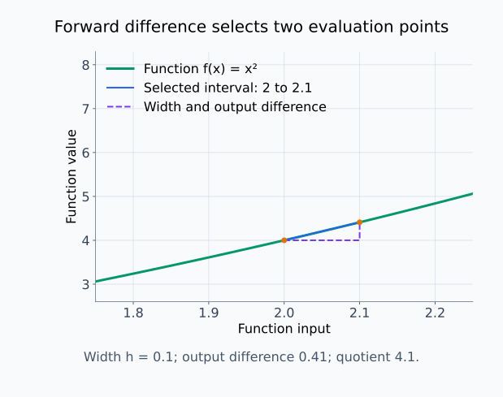
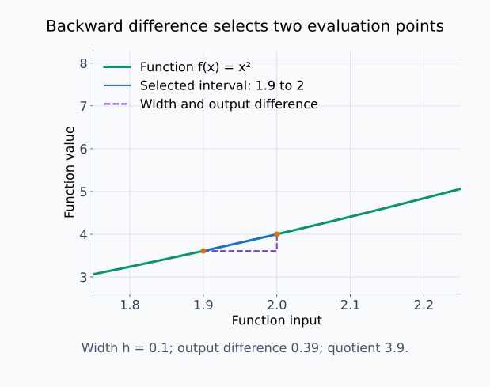
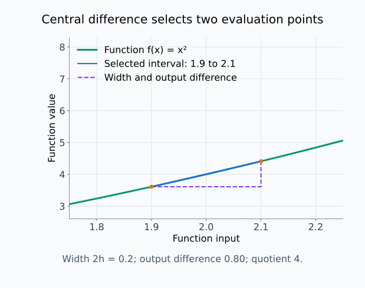
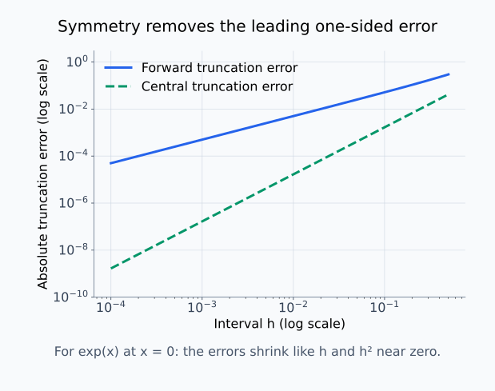
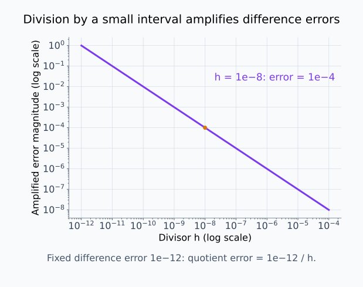
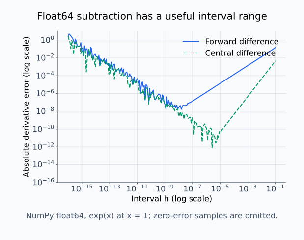
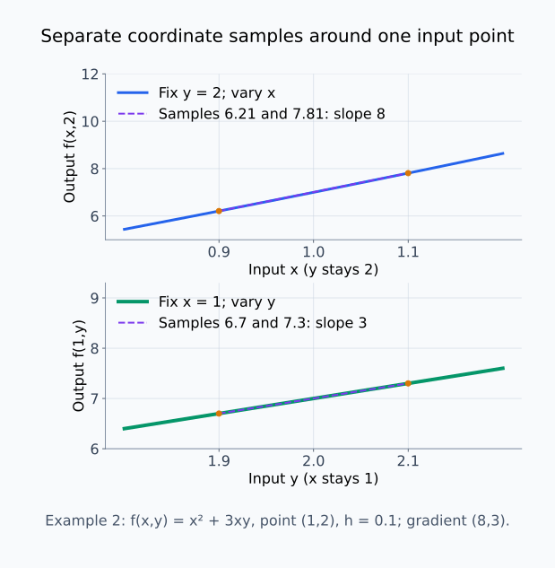
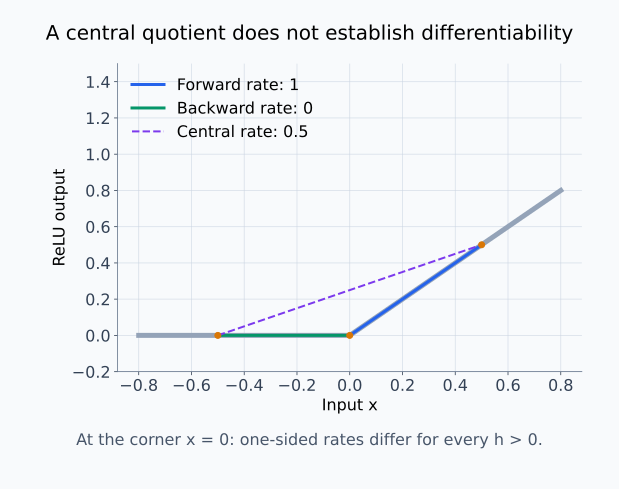

# M01-13. 수치미분과 오차

## 이 단원이 필요한 이유

도함수 식을 알 수 없거나 구현된 그래디언트를 검산할 때는 함수값을 가까운 두 점에서 계산해 변화율을 근사할 수 있다. 이를 수치미분이라고 한다. 유한한 간격을 사용하므로 Taylor 근사에서 버린 항이 오차를 만들고, 간격을 지나치게 줄이면 부동소수점 뺄셈이 불안정해진다.

수치미분은 자동미분 구현을 검사하고 블랙박스 함수의 국소 민감도를 추정하는 도구다. 근삿값이므로 차분 방식, 간격과 함수 평가의 잡음을 함께 보고해야 한다.

## 학습 목표

이 단원을 마치면 다음을 할 수 있다.

- 전진차분, 후진차분과 중앙차분 공식을 적용할 수 있다.
- 절단오차와 반올림오차가 생기는 이유를 구분할 수 있다.
- 간격 $h$가 너무 크거나 작을 때의 문제를 설명할 수 있다.
- 다변수 함수의 좌표별 수치 그래디언트를 계산할 수 있다.
- 비미분점과 잡음이 수치미분 해석에 미치는 영향을 판단할 수 있다.

## 선수지식 확인

- 선수 단원: [M01-03 미분과 순간변화율](M01-03-derivative-instantaneous-rate.md)
- 선수 단원: [M01-11 방향미분과 gradient](M01-11-directional-derivative-gradient.md)
- 선수 단원: [M01-12 Taylor 근사](M01-12-taylor-approximation.md)
- 확인 질문: 차분몫과 도함수 극한의 차이를 설명할 수 있는가?
- 확인 질문: 일차 Taylor 근사에서 버린 항이 오차가 된다는 뜻을 설명할 수 있는가?

차분몫이나 Taylor 잔차가 불분명하면 선수 단원을 먼저 복습한다.

## 기호와 용어

| 기호·용어 | Common spoken reading | 의미 | 조건 |
|---|---|---|---|
| $h$ | `h` | 기준점에서 앞이나 뒤의 평가점까지 이동하는 간격 | $h>0$으로 둔다. 중앙차분의 두 평가점 사이는 $2h$다. |
| 전진차분 | `forward difference` | $x$와 $x+h$를 사용하는 도함수 근사 | 한쪽 값만 앞으로 이동한다. |
| 후진차분 | `backward difference` | $x-h$와 $x$를 사용하는 도함수 근사 | 한쪽 값만 뒤로 이동한다. |
| 중앙차분 | `central difference` | $x-h$와 $x+h$를 대칭으로 사용하는 도함수 근사 | 함수 평가가 두 번 필요하다. |
| 절단오차 | `truncation error` | Taylor 전개의 높은 차수 항을 버려 생기는 오차 | $h$를 줄이면 보통 감소한다. |
| 반올림오차 | `roundoff error` | 유한 정밀도 계산에서 수를 저장·연산하며 생기는 오차 | $h$가 너무 작으면 커질 수 있다. |
| 그래디언트 검사 | `gradient check` | 해석적 또는 자동미분 그래디언트를 수치차분과 비교하는 절차 | 같은 함수와 점을 사용한다. |

## 핵심 개념 1. 유한한 간격으로 도함수를 근사한다

도함수의 정의는

\[
f'(x)
=
\lim_{h\to0}
\frac{f(x+h)-f(x)}{h}
\]

이다. 컴퓨터는 $h=0$인 극한 과정을 그대로 계산하지 않는다. 작은 양수 $h$를 고르고 차분몫을 근삿값으로 사용한다.

전진차분은

\[
f'(x)
\approx
\frac{f(x+h)-f(x)}{h}
\]

이다. 함수값 $f(x)$와 $f(x+h)$ 두 개가 필요하다.

전진차분이 고르는 두 점과 출력 차이는 예제 1의 숫자로 확인할 수 있다.

<figure class="lesson-figure lesson-figure--wide" markdown="1">
  
  <figcaption>주황색 두 점은 기준점 2와 오른쪽 평가점 2.1이다. 점선 가로 길이 0.1과 세로 길이 0.41을 나누면 4.1이다. 기준점의 정확한 미분값 4가 아니라 이 두 점 사이의 평균변화율을 계산한다.</figcaption>
</figure>

## 핵심 개념 2. 후진차분은 반대쪽 값을 사용한다

후진차분은

\[
f'(x)
\approx
\frac{f(x)-f(x-h)}{h}
\]

이다. 왼쪽 점 $x-h$에서 기준점 $x$로 이동하는 입력 변화량은 $x-(x-h)=h$다. 그래서 출력 차이도 $f(x)-f(x-h)$ 순서로 뺀다. 분자와 분모의 이동 방향을 맞춘 평균변화율이다. 전진차분은 오른쪽, 후진차분은 왼쪽의 유한한 구간을 사용한다.

정의역 경계에서는 한쪽 차분이 필요할 수 있다. 예를 들어 $x\ge0$에서만 정의된 함수의 $x=0$ 근처에서는 $x-h<0$이 정의역을 벗어나므로 전진차분을 선택한다.

후진차분은 같은 기준점의 왼쪽 구간을 고르므로 출력 차이도 왼쪽에서 기준점으로 향하는 순서로 뺀다.

<figure class="lesson-figure lesson-figure--wide" markdown="1">
  
  <figcaption>평가점은 1.9와 2다. 가로 변화 0.1에 대응하는 출력 변화는 4−3.61=0.39이므로 차분몫은 3.9다. 전진차분과 기준점은 같지만 조사한 구간이 다르다.</figcaption>
</figure>

## 핵심 개념 3. 중앙차분은 대칭점 두 개를 사용한다

중앙차분은

\[
f'(x)
\approx
\frac{f(x+h)-f(x-h)}{2h}
\]

이다. $x$의 양쪽을 대칭으로 사용한다. 두 평가점 사이의 거리는 $(x+h)-(x-h)=2h$이므로 분모는 $h$가 아닌 $2h$다. 두 한쪽 차분을 평균해도 같은 식을 얻는다.

\[
\frac12\left(
\frac{f(x+h)-f(x)}{h}
+\frac{f(x)-f(x-h)}{h}
\right)
=\frac{f(x+h)-f(x-h)}{2h}
\]

가운데 값 $f(x)$는 더하는 과정에서 소거된다.

Taylor 식을 쓰면

\[
f(x+h)
\approx
f(x)+f'(x)h+\frac12f''(x)h^2+\cdots
\]

\[
f(x-h)
\approx
f(x)-f'(x)h+\frac12f''(x)h^2+\cdots
\]

이다. $h$를 $-h$로 바꾸면 일차항의 부호는 바뀌고 이차항의 부호는 유지된다. 두 식을 빼면 상수항과 이차항이 없어지고 일차항 $2f'(x)h$가 남는다. 이를 $2h$로 나누면 목표인 $f'(x)$를 얻는다.

이차도함수를 한 번 더 미분한 것이 삼차도함수다. 기준점 주변에서 삼차도함수까지 연속이면, 이차항 다음에 남는 주된 항은 $h^3$ 크기다. 중앙차분에서는 이 항을 $2h$로 나누므로 오차의 주된 크기가 $h^2$가 된다. 전진·후진차분은 이차항이 남은 분자를 $h$로 나누므로 주된 오차가 $h$ 크기다. 이 설명은 작은 $h$에서의 절단오차에 관한 것이며, 해당 계수가 0인 함수에서는 오차가 더 작거나 아예 없을 수 있다.

중앙차분은 기준점 자체 대신 양옆 두 점을 잇는다. 두 점 사이의 폭은 한쪽 이동량의 두 배다.

<figure class="lesson-figure lesson-figure--wide" markdown="1">
  
  <figcaption>두 주황색 점 사이의 폭은 2h=0.2이고 출력 차이는 4.41−3.61=0.8이다. 차분몫은 4다. 이차함수에서 기울기가 정확해지는 것이며, 이 두 점을 잇는 할선이 기준점의 함수값까지 반드시 지나는 것은 아니다.</figcaption>
</figure>

## 핵심 개념 4. $h$가 크면 절단오차가 커진다

유한차분은 짧은 구간의 평균변화율로 순간변화율을 근사한다. $h$가 크면 기준점에서 멀리 떨어진 함수 모양이 섞인다.

전진차분의 Taylor 식은

\[
\frac{f(x+h)-f(x)}{h}
\approx
f'(x)+\frac12f''(x)h+\cdots
\]

이다. 원래 함수값에서 $h^2$에 곱해졌던 항도 차분몫에서는 $h$로 한 번 나누어져 남는다. 이 항을 버리고 $f'(x)$와 같다고 취급하는 데서 절단오차가 생긴다. 함수값을 무한한 정밀도로 계산하더라도 유한한 간격 때문에 생기는 차이다. 함수의 곡률이 크면 같은 $h$에서도 오차가 커질 수 있다.

매끄러운 함수의 절단오차만 비교하면 중앙차분에서 대칭성이 제거한 항의 효과가 보인다.

<figure class="lesson-figure lesson-figure--wide" markdown="1">
  
  <figcaption>eˣ의 입력 0에서 참 미분값은 1이다. 전진차분의 오차는 작은 h에서 h 크기, 중앙차분의 오차는 h² 크기로 줄어든다. 이 그림은 안정된 식으로 평가한 절단오차 비교이며, 지나치게 작은 h의 뺄셈 불안정까지 포함한 것은 아니다.</figcaption>
</figure>

## 핵심 개념 5. $h$가 너무 작으면 반올림오차가 커질 수 있다

컴퓨터는 실수를 유한한 비트로 저장한다. $h$가 매우 작으면 $f(x+h)$와 $f(x)$가 저장된 값에서 거의 같아진다. 비슷한 두 수를 빼면 유효한 숫자가 사라지고, 그 작은 차이를 다시 $h$로 나누면서 오차가 확대될 수 있다.

예를 들어 두 함수값이 각각 약 1이고 차이는 $10^{-8}$이라고 하자. 각 평가값에 $10^{-12}$ 정도의 저장·계산 오차가 있다면, 차이 자체의 오차도 $10^{-12}$ 정도일 수 있다. 이를 $h=10^{-8}$로 나누면 도함수 근삿값에는 $10^{-4}$ 정도의 오차가 들어간다. 각 함수값에 비해 작은 오차도 차분몫에서는 무시하기 어려워진다. 간격을 더 줄이면 컴퓨터가 $x+h$를 $x$와 같은 값으로 저장하거나 두 함수값을 같은 값으로 반올림할 수도 있다.

따라서 $h$를 줄인다고 오차가 계속 감소하지 않는다. 여러 $h$에서 결과를 계산하면 보통 처음에는 절단오차가 줄어들다가 작은 $h$에서 반올림오차가 커지는 형태가 나타난다. 안정된 구간에서 여러 자릿수가 일치하는지 확인한다.

작은 차이 안의 오차는 그 차이를 h로 나누면서 확대된다. 확대 비율 자체는 오차의 원인이 저장 정밀도인지 함수 평가의 잡음인지와 별개다.

<figure class="lesson-figure lesson-figure--wide" markdown="1">
  
  <figcaption>분자 차이의 오차를 10⁻¹²로 고정한 설명용 관계다. h=10⁻⁸로 나누면 근사 변화율의 오차는 10⁻⁴가 된다. 실제 반올림오차나 잡음이 모든 h에서 일정하다는 가정은 아니다.</figcaption>
</figure>

직접적인 float64 뺄셈으로 지수함수를 차분하면 큰 h와 매우 작은 h가 서로 다른 이유로 오차를 만드는 모습을 확인할 수 있다.

<figure class="lesson-figure lesson-figure--wide" markdown="1">
  
  <figcaption>NumPy float64로 입력 1의 eˣ를 전진·중앙차분하고 참값 e와의 차이를 계산했다. 오른쪽의 큰 h에서는 절단오차가 보이고, 왼쪽의 아주 작은 h에서는 수치 오차가 커진다. 가장 작은 h가 가장 좋은 선택은 아니며 세부 곡선은 수치 구현에 의존한다.</figcaption>
</figure>

## 핵심 개념 6. 다변수 함수는 좌표별로 차분한다

$f:\mathbb R^n\to\mathbb R$에서 $i$번째 좌표 단위벡터를 $\mathbf e_i$라고 하자. 중앙차분으로 $i$번째 편미분을 근사하면

\[
\frac{\partial f}{\partial x_i}(\mathbf x)
\approx
\frac{f(\mathbf x+h\mathbf e_i)-f(\mathbf x-h\mathbf e_i)}{2h}
\]

이다. $\mathbf e_i$는 $i$번째 성분만 1이고 나머지는 0이다. 따라서 $\mathbf x\pm h\mathbf e_i$는 $i$번째 좌표만 $\pm h$만큼 바꾸고 다른 좌표는 고정한 입력이다. 편미분의 조건을 두 함수 평가에 그대로 적용한다.

각 좌표에 이 계산을 반복해 수치 그래디언트를 만든다.

\[
\nabla f(\mathbf x)
\approx
\begin{bmatrix}
\dfrac{f(\mathbf x+h\mathbf e_1)-f(\mathbf x-h\mathbf e_1)}{2h}\\
\vdots\\
\dfrac{f(\mathbf x+h\mathbf e_n)-f(\mathbf x-h\mathbf e_n)}{2h}
\end{bmatrix}
\]

함수 평가가 좌표마다 두 번 필요하므로 입력 차원이 크면 비용이 커진다.

예제 2의 중앙차분은 같은 입력점 주변에서 좌표마다 별도의 평가점 쌍을 만든다.

<figure class="lesson-figure lesson-figure--wide" markdown="1">
  
  <figcaption>위에서는 y=2를 고정한 두 x 입력의 출력 차이 1.6을 0.2로 나누어 8을 얻는다. 아래에서는 x=1을 고정한 두 y 입력의 출력 차이 0.6을 같은 폭으로 나누어 3을 얻는다. 두 결과를 같은 평가점 (1,2)의 그래디언트로 모은다.</figcaption>
</figure>

## 핵심 개념 7. 그래디언트 검사는 같은 함수와 점을 비교한다

자동미분이나 손계산으로 얻은 값을 $g_{\mathrm{ana}}$, 중앙차분 값을 $g_{\mathrm{num}}$이라고 하자. 한 가지 비교 척도는

\[
\operatorname{err}
=
\frac{|g_{\mathrm{ana}}-g_{\mathrm{num}}|}
{\max(1,|g_{\mathrm{ana}}|,|g_{\mathrm{num}}|)}
\]

이다. 분모는 값의 크기가 큰 경우 상대 차이를 보고, 두 값이 0에 가까울 때 분모가 지나치게 작아지는 일을 막는다.

그래디언트 검사를 할 때는 다음 조건을 맞춘다.

- 같은 입력, 파라미터와 스칼라 출력을 사용한다.
- dropout이나 무작위 표본추출 같은 변동을 고정한다.
- 여러 $h$에서 결과가 안정되는 구간을 찾는다.

작은 오차는 두 계산이 가까움을 보여 준다. 두 방식이 같은 잘못된 함수를 미분했는지까지 검사하지는 못한다.

## 핵심 개념 8. 비미분점과 잡음은 차분 결과를 바꾼다

ReLU $r(x)=\max(0,x)$를 $x=0$에서 차분하자.

\[
\frac{r(h)-r(0)}{h}=1
\]

이므로 전진차분은 $1$이다.

\[
\frac{r(0)-r(-h)}{h}=0
\]

이므로 후진차분은 $0$이다. 중앙차분은

\[
\frac{r(h)-r(-h)}{2h}
=
\frac12
\]

이다. 세 값이 다르며 어느 값도 수학적 도함수의 존재를 뜻하지 않는다. 좌우미분계수가 다르기 때문이다.

함수 평가에 잡음이 있으면 분자의 작은 차이가 잡음에 묻힐 수 있다. 반복 평가의 변동, seed와 평균 방식까지 기록해야 수치미분 결과를 해석할 수 있다.

ReLU 원점에서는 선택한 점 쌍마다 서로 다른 할선 기울기를 얻는다. 중앙차분의 숫자는 좌우 기울기의 불일치를 없애 주지 않는다.

<figure class="lesson-figure lesson-figure--wide" markdown="1">
  
  <figcaption>오른쪽 두 점의 기울기는 1, 왼쪽 두 점은 0이다. 양옆 점을 잇는 보라색 중앙 할선의 기울기는 0.5다. 그림은 h=0.5이며 세 차분 값은 어떤 양의 h에서도 같지만, 원점의 수학적 도함수는 존재하지 않는다.</figcaption>
</figure>

## 예제 1. 제곱함수에서 세 차분 비교

$f(x)=x^2$, $x=2$, $h=0.1$이라고 하자. 정확한 도함수는 $f'(2)=4$다.

전진차분은

\[
\frac{f(2.1)-f(2)}{0.1}
=
\frac{4.41-4}{0.1}
=4.1
\]

이다. 후진차분은

\[
\frac{f(2)-f(1.9)}{0.1}
=
\frac{4-3.61}{0.1}
=3.9
\]

이다. 중앙차분은

\[
\frac{f(2.1)-f(1.9)}{0.2}
=
\frac{4.41-3.61}{0.2}
=4
\]

이다. 이차함수에서는 대칭 차분에서 이차항이 소거돼 정확한 값을 얻는다.

## 예제 2. 다변수 중앙차분

\[
f(x,y)=x^2+3xy
\]

를 점 $(1,2)$에서 $h=0.1$로 차분하자.

$x$ 방향 함수값은

\[
f(1.1,2)=7.81,
\qquad
f(0.9,2)=6.21
\]

이므로

\[
\frac{\partial f}{\partial x}(1,2)
\approx
\frac{7.81-6.21}{0.2}
=8
\]

이다.

$y$ 방향 함수값은

\[
f(1,2.1)=7.3,
\qquad
f(1,1.9)=6.7
\]

이므로

\[
\frac{\partial f}{\partial y}(1,2)
\approx
\frac{7.3-6.7}{0.2}
=3
\]

이다. 해석적 그래디언트 $(2x+3y,3x)^\top$에 $(1,2)$를 넣은 $(8,3)^\top$과 같다.

## 예제 3. 여러 간격에서 안정성 확인

어떤 도함수의 참값을 모른다고 하자. 중앙차분 결과가 다음과 같았다.

| $h$ | 근삿값 |
|---:|---:|
| $10^{-1}$ | $1.046$ |
| $10^{-2}$ | $1.0005$ |
| $10^{-3}$ | $1.0000$ |
| $10^{-6}$ | $1.0000$ |
| $10^{-12}$ | $0.9984$ |

$10^{-3}$부터 $10^{-6}$ 사이에서 값이 안정된다. $10^{-1}$에서는 절단오차가 크고, $10^{-12}$에서는 반올림오차의 영향을 의심할 수 있다. 한 간격의 값만 보고 자릿수 전체를 신뢰하지 않는다.

## 예제 4. 블랙박스 점수의 유한차분

모델 내부 미분에 접근할 수 없지만 입력 점수 $s(x)$를 조회할 수 있다고 하자. 중앙차분

\[
\frac{s(x+h)-s(x-h)}{2h}
\]

는 $x$ 방향의 국소 민감도를 근사한다.

이 값은 조회한 점 근처의 함수값 변화만 사용한다. 모델이 해당 특성을 내부에서 어떤 방식으로 처리하는지, 변화가 데이터 분포에서 타당한지와 인과효과는 별도 실험이 필요하다.

## 흔한 오해

### 오해 1. $h$를 가장 작은 수로 고르면 가장 정확하다

작은 $h$는 절단오차를 줄이지만 반올림오차와 뺄셈 불안정을 키울 수 있다. 여러 간격을 비교해야 한다.

### 오해 2. 중앙차분 값이 나오면 도함수가 존재한다

ReLU 원점처럼 도함수가 없는 점에서도 중앙차분은 숫자를 반환한다. 좌우차분을 비교해야 한다.

### 오해 3. 수치 그래디언트와 자동미분이 같으면 구현 전체가 맞다

두 계산이 같은 스칼라 함수를 미분했다는 전제에서 도함수 구현을 검산한다. 데이터 처리나 목적함수 정의 오류까지 자동으로 찾지 못한다.

### 오해 4. 한 번의 함수 평가 차이는 잡음과 무관하다

확률적 모델과 무작위 연산은 같은 입력에서도 다른 값을 낼 수 있다. seed와 평가 모드를 고정하고 반복 변동을 확인해야 한다.

### 오해 5. 블랙박스 유한차분은 내부 인과 메커니즘을 보여 준다

유한차분은 입출력의 국소 변화를 측정한다. 내부 계산 경로나 인과적 사용 여부는 직접 보여 주지 않는다.

## 연습문제

### 1. 전진차분 계산

$f(x)=x^2$, $x=3$, $h=0.01$일 때 전진차분을 계산하라.

해설 보기

\[
\frac{f(3.01)-f(3)}{0.01}
=
\frac{9.0601-9}{0.01}
=6.01
\]

이다. 정확한 도함수 $f'(3)=6$과의 차이는 $0.01$이다.

### 2. 중앙차분 계산

$f(x)=x^2$, $x=3$, $h=0.01$일 때 중앙차분을 계산하라.

해설 보기

\[
f(3.01)=9.0601,
\qquad
f(2.99)=8.9401
\]

이다. 따라서

\[
\frac{9.0601-8.9401}{0.02}
=
\frac{0.12}{0.02}
=6
\]

이다. 이차함수의 중앙차분은 정확한 도함수와 같다.

### 3. 차분 방식 비교

예제 1의 $f(x)=x^2$, $x=2$, $h=0.1$에서 전진차분과 후진차분의 평균을 구하고 중앙차분과 비교하라.

해설 보기

전진차분은 $4.1$, 후진차분은 $3.9$다. 평균은

\[
\frac{4.1+3.9}{2}=4
\]

이다. 중앙차분 값 $4$와 같다. 대칭점의 정보를 결합하면서 한쪽 차분의 반대 방향 오차가 소거된다.

### 4. ReLU 원점 차분

$r(x)=\max(0,x)$와 $h>0$에 대해 $x=0$에서 전진차분, 후진차분과 중앙차분을 구하고 미분 가능성을 판단하라.

해설 보기

전진차분은

\[
\frac{r(h)-r(0)}h=1
\]

이고 후진차분은

\[
\frac{r(0)-r(-h)}h=0
\]

이다. 중앙차분은

\[
\frac{r(h)-r(-h)}{2h}=\frac12
\]

이다. 좌우 변화율이 다르므로 $x=0$에서 도함수는 존재하지 않는다.

### 5. 간격 선택 설명

수치미분에서 $h$가 너무 클 때와 너무 작을 때 생기는 주된 오차를 각각 설명하라.

해설 보기

$h$가 크면 유한한 구간의 평균변화율이 기준점의 순간변화율과 달라져 절단오차가 커진다. 함수의 높은 차수 항과 곡률을 충분히 제거하지 못한다.

$h$가 너무 작으면 가까운 함수값의 뺄셈에서 유효 숫자가 사라지고, 그 차이를 작은 $h$로 나누면서 반올림오차가 확대될 수 있다. 여러 $h$에서 안정된 구간을 찾아야 한다.

### 6. 그래디언트 검사 오차

$g_{\mathrm{ana}}=2.0000$, $g_{\mathrm{num}}=2.0002$일 때

\[
\operatorname{err}
=
\frac{|g_{\mathrm{ana}}-g_{\mathrm{num}}|}
{\max(1,|g_{\mathrm{ana}}|,|g_{\mathrm{num}}|)}
\]

를 계산하라.

해설 보기

분자는 $0.0002$이고 분모는 $2.0002$다.

\[
\operatorname{err}
=
\frac{0.0002}{2.0002}
\approx
9.999\times10^{-5}
\]

이다. 약 $10^{-4}$의 정규화된 차이다. 허용 기준은 계산 정밀도와 함수의 매끄러움에 맞춰 정해야 한다.

### 7. M01 누적 확인과제: 합성함수의 gradient와 수치 검산

다음 계산 그래프를 생각하라.

\[
(x,y)
\longrightarrow
u=2x-y
\longrightarrow
\mathcal L=(u-1)^2
\]

점 $(x,y)=(2,1)$에서 다음을 수행하라.

1. 순방향 값 $u$와 $\mathcal L$을 계산하라.
2. 연쇄법칙으로 $\nabla\mathcal L$을 구하라.
3. 단위방향 $\mathbf v=(3/5,4/5)^\top$의 방향미분을 구하라.
4. 중앙차분으로 $x$에 대한 편미분을 검산하라.
5. 이 결과만으로 말할 수 없는 모델 해석 주장 한 가지를 적어라.

해설 보기

순방향 계산은

\[
u=2\cdot2-1=3
\]

\[
\mathcal L=(3-1)^2=4
\]

이다.

국소 도함수는

\[
\frac{\partial\mathcal L}{\partial u}=2(u-1)=4,
\qquad
\frac{\partial u}{\partial x}=2,
\qquad
\frac{\partial u}{\partial y}=-1
\]

이다. 연쇄법칙으로

\[
\frac{\partial\mathcal L}{\partial x}=4\cdot2=8,
\qquad
\frac{\partial\mathcal L}{\partial y}=4(-1)=-4
\]

이므로

\[
\nabla\mathcal L(2,1)
=
\begin{bmatrix}8\\-4\end{bmatrix}
\]

이다.

방향미분은

\[
D_{\mathbf v}\mathcal L
=
\begin{bmatrix}8&-4\end{bmatrix}
\begin{bmatrix}3/5\\4/5\end{bmatrix}
=
\frac{24}{5}-\frac{16}{5}
=
\frac85
\]

이다.

$h>0$에 대해 $y=1$을 고정하면

\[
\mathcal L(2+h,1)=(2+2h)^2
\]

\[
\mathcal L(2-h,1)=(2-2h)^2
\]

이다. 중앙차분은

\[
\frac{(2+2h)^2-(2-2h)^2}{2h}
=
\frac{16h}{2h}
=8
\]

이므로 해석적 편미분과 같다.

이 결과는 선택한 함수와 점에서의 국소 변화율을 확인한다. 실제 모델의 일반화 성능, 다른 데이터점의 민감도나 입력 $x,y$의 인과적 중요성은 보여 주지 않는다.

## 단원 요약

- 전진차분과 후진차분은 기준점의 한쪽 함수값으로 도함수를 근사한다.
- 중앙차분은 대칭점의 함수값을 사용해 매끄러운 함수에서 주된 절단오차를 줄인다.
- 큰 $h$는 절단오차를, 지나치게 작은 $h$는 반올림오차와 뺄셈 불안정을 키울 수 있다.
- 좌표별 중앙차분으로 수치 그래디언트를 만들고 자동미분 결과를 검산할 수 있다.
- 수치미분은 국소 입출력 변화의 근사이며 미분 가능성, 내부 메커니즘이나 인과효과를 보장하지 않는다.

## 통과 기준

다음 질문에 자료를 보지 않고 답할 수 있으면 통과한다.

- 전진·후진·중앙차분 공식을 쓸 수 있는가?
- 절단오차와 반올림오차를 구분할 수 있는가?
- 여러 $h$를 비교해야 하는 이유를 설명할 수 있는가?
- 좌표별 중앙차분으로 수치 그래디언트를 계산할 수 있는가?
- 비미분점에서 차분값을 도함수로 단정할 수 없는 이유를 설명할 수 있는가?

## M01 단계 통과 기준

다음 작업을 자료 없이 수행할 수 있으면 M01 단계를 통과한다.

- 평균변화율의 극한에서 도함수를 정의한다.
- 합·곱·몫과 연쇄법칙으로 합성함수를 미분한다.
- 편도함수를 그래디언트로 모으고 방향미분을 계산한다.
- 일차 Taylor 식으로 작은 변화를 근사한다.
- 해석적 그래디언트를 중앙차분으로 검산하고 오차 원인을 설명한다.
- 미분값에서 직접 말할 수 있는 국소 민감도와 추가 증거가 필요한 인과 주장을 구분한다.

## 다음 단원

- [M02-01 벡터와 벡터 연산](../M02/M02-01-vectors-vector-operations.md)

## 집필자 점검표

- [x] 학습 목표가 관찰 가능한 행동으로 작성됐다.
- [x] 세 유한차분과 두 오차 유형을 정의했다.
- [x] 일변수·다변수 수치미분 예제를 검산했다.
- [x] 비미분점과 확률적 함수의 주의점을 설명했다.
- [x] 모든 문제에 해설이 있다.
- [x] M01 누적 확인과제와 단계 통과 기준을 포함했다.
- [x] 수치 민감도와 내부·인과 주장을 구분했다.
- [x] 용어집과 표기 규칙을 따랐다.
- [x] 내부 링크와 수식 구분자를 확인했다.
- [x] Common spoken reading이 실제 영어 학술 발화이며 한글 음역이나 기계적 직역을 포함하지 않는다.
