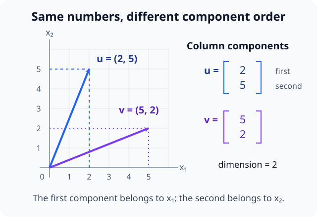
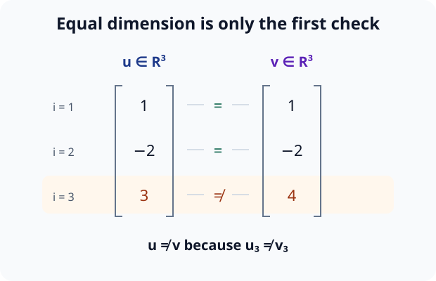
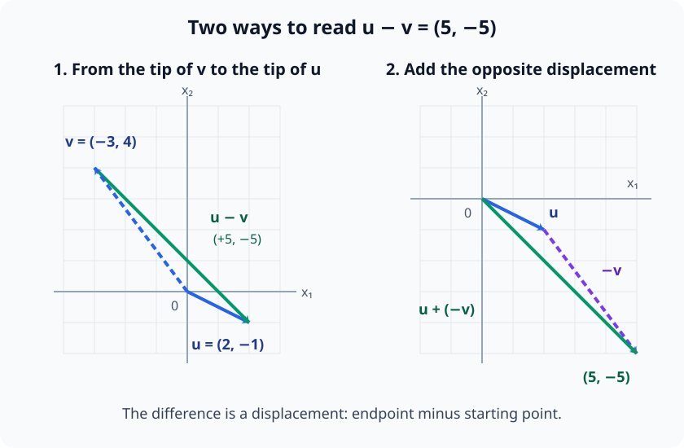
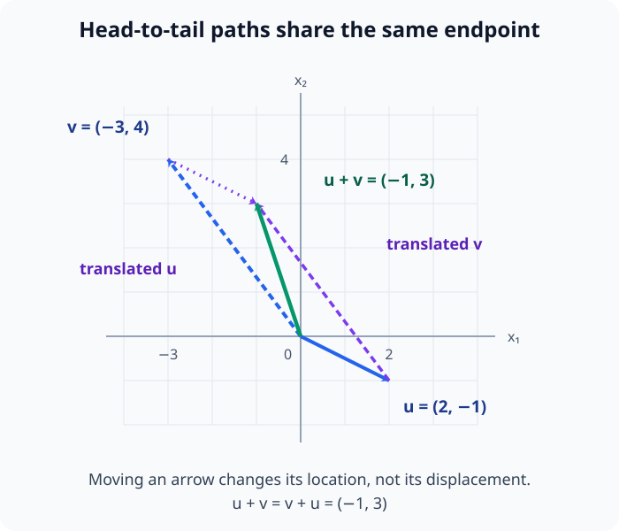
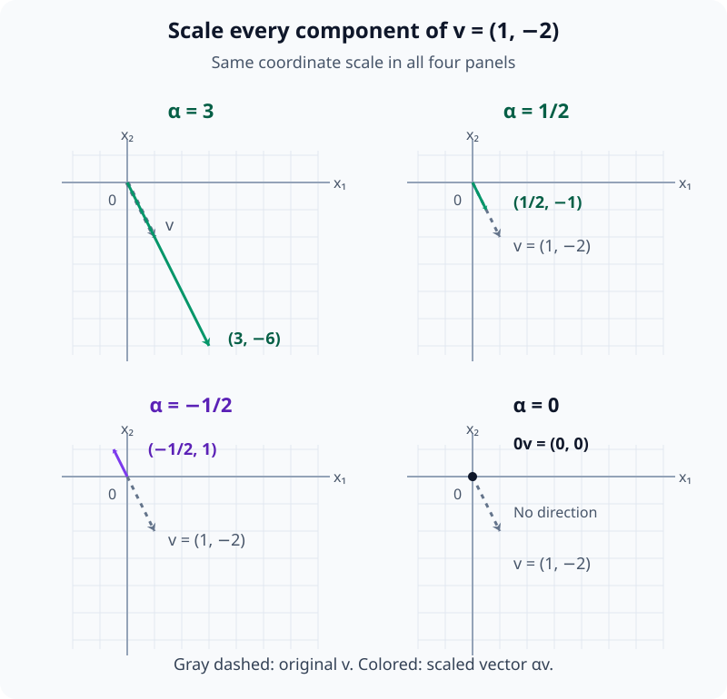
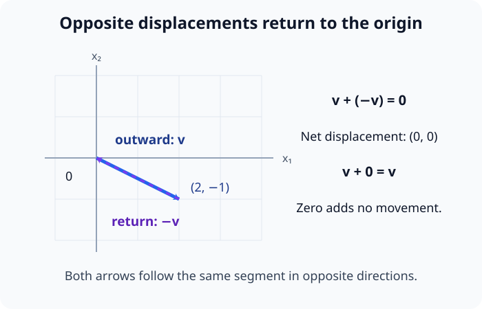
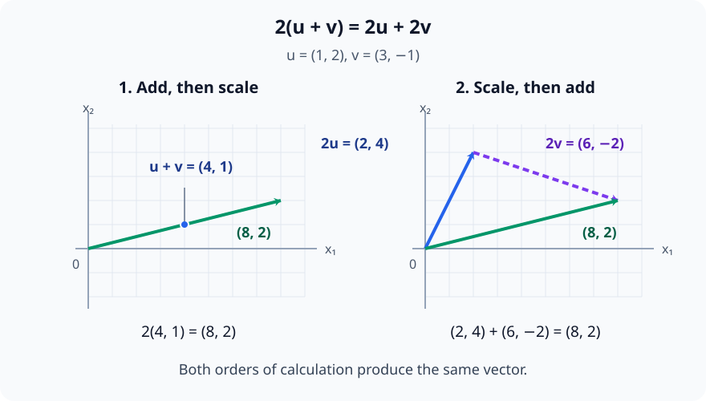
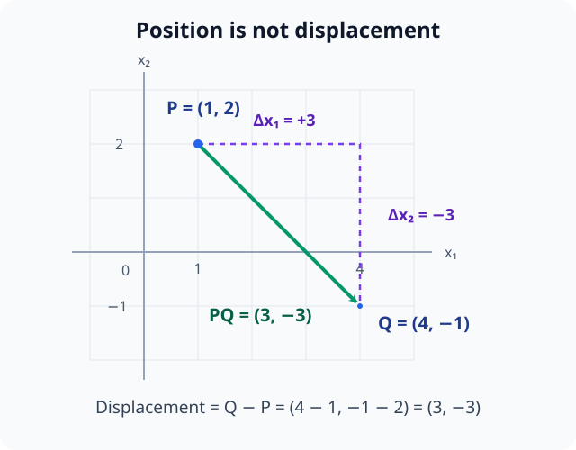

# M02-01. 벡터와 벡터 연산

## 이 단원이 필요한 이유

신경망은 입력, 파라미터와 중간 활성값을 여러 수의 묶음으로 다룬다. 이 묶음을 벡터로 보면 각 성분을 따로 계산하는 방식과 전체 방향을 한꺼번에 해석하는 방식을 연결할 수 있다. 잔차 연결에서 두 표현을 더하거나 학습률을 그래디언트에 곱하는 계산도 벡터의 기본 연산이다.

이 단원에서는 벡터의 덧셈과 스칼라곱을 좌표 계산과 화살표의 이동으로 함께 익힌다. 길이, 각도와 내적은 M02-03에서 다룬다.

## 학습 목표

이 단원을 마치면 다음을 할 수 있다.

- 벡터, 성분과 dimension을 구분해 설명할 수 있다.
- 같은 dimension의 벡터를 성분별로 더하고 뺄 수 있다.
- 스칼라곱이 벡터의 방향과 크기에 미치는 영향을 설명할 수 있다.
- 영벡터와 덧셈 역원의 역할을 계산으로 확인할 수 있다.
- 신경망의 벡터 덧셈에서 필요한 shape 조건과 해석 범위를 판단할 수 있다.

## 선수지식 확인

- 선수 단원: [M00-04 좌표와 그래프](../M00/M00-04-coordinates-graphs.md)
- 선수 단원: [M00-09 스칼라·벡터·행렬의 shape](../M00/M00-09-scalars-vectors-matrices-shape.md)
- 확인 질문: 점 $(2,-1)$의 두 좌표를 순서대로 말할 수 있는가?
- 확인 질문: shape이 $(3,)$인 배열과 $(4,)$인 배열을 성분별로 더할 수 없는 이유를 설명할 수 있는가?

좌표와 shape이 불분명하면 선수 단원을 먼저 복습한다.

## 기호와 용어

| 기호·용어 | Common spoken reading | 의미 | shape·범위 |
|---|---|---|---|
| $\mathbf v$ | `v` | 벡터 | 이 단원에서는 주로 $\mathbf v\in\mathbb R^n$ |
| $v_i$ | `v sub i` | $\mathbf v$의 $i$번째 성분 | $v_i\in\mathbb R$ |
| $n$ | `n` | 벡터의 dimension | 양의 정수 |
| $\mathbf 0$ | `the zero vector` | 모든 성분이 0인 벡터 | 문맥에 맞는 dimension |
| $\alpha$ | `alpha` | 벡터에 곱하는 스칼라 | $\alpha\in\mathbb R$ |
| $-\mathbf v$ | `minus v` | $\mathbf v$의 덧셈 역원 | $\mathbf v$와 같은 dimension |

## 핵심 개념 1. 벡터는 순서가 있는 성분으로 표현한다

$n$개의 실수 성분을 갖는 벡터를 열벡터로 쓰면

\[
\mathbf v
=
\begin{bmatrix}
v_1\\
v_2\\
\vdots\\
v_n
\end{bmatrix}
\in\mathbb R^n
\]

이다. $v_i$는 $i$번째 성분이고 $n$은 dimension이다. 성분의 순서는 역할을 구분한다. 예를 들어 $\begin{bmatrix}2\\5\end{bmatrix}$와 $\begin{bmatrix}5\\2\end{bmatrix}$는 일반적으로 다른 벡터다.

좌표는 벡터를 나타내는 수의 목록이다. 이후 M02-07과 M03-03에서는 같은 벡터도 기저를 바꾸면 다른 좌표로 나타날 수 있음을 배운다. 지금은 표준 좌표를 사용한다.

아래 그림에서 첫째 성분을 가로축, 둘째 성분을 세로축과 대응시키면 성분 순서를 바꿀 때 이동이 어떻게 달라지는지 확인할 수 있다.

<figure class="lesson-figure lesson-figure--wide" markdown="1">

<figcaption>두 벡터 모두 dimension은 2이지만, (2,5)ᵀ와 (5,2)ᵀ는 각 축의 이동량이 달라 서로 다른 끝점에 도달한다. 점선으로 축과 열벡터의 대응 성분을 확인한다.</figcaption>
</figure>

## 핵심 개념 2. 벡터의 등식은 대응 성분을 비교한다

\[
\mathbf u=\mathbf v
\]

라는 식은 두 벡터의 dimension이 같고 모든 $i$에 대해 $u_i=v_i$라는 뜻이다. 성분 하나라도 다르면 두 벡터는 다르다.

\[
\begin{bmatrix}1\\-2\\3\end{bmatrix}
\ne
\begin{bmatrix}1\\-2\\4\end{bmatrix}
\]

이다. 마지막 성분이 다르기 때문이다.

아래 그림에서는 같은 행의 성분끼리 비교한다. 처음 두 성분이 일치해도 마지막 비교에서 벡터의 등식이 성립하지 않음을 확인할 수 있다.

<figure class="lesson-figure" markdown="1">

<figcaption>dimension이 같은지 확인한 뒤 모든 대응 성분을 비교한다. 셋째 성분의 3≠4가 두 벡터의 불일치를 결정한다.</figcaption>
</figure>

## 핵심 개념 3. 벡터 덧셈과 뺄셈은 성분별로 계산한다

$\mathbf u,\mathbf v\in\mathbb R^n$이면

\[
\mathbf u+\mathbf v
=
\begin{bmatrix}
u_1+v_1\\
u_2+v_2\\
\vdots\\
u_n+v_n
\end{bmatrix}
\]

이다. 두 벡터의 dimension이 같아야 대응 성분을 정할 수 있다.

뺄셈은 덧셈 역원을 더하는 연산이다.

\[
\mathbf u-\mathbf v
=
\mathbf u+(-\mathbf v)
\]

여기서 $-\mathbf v$는 모든 성분의 부호를 바꾼 벡터다.

두 벡터를 같은 원점에서 출발하는 화살표로 놓으면 $\mathbf u-\mathbf v$는 $\mathbf v$의 끝점에서 $\mathbf u$의 끝점으로 가는 변위다. $\mathbf v+(\mathbf u-\mathbf v)=\mathbf u$이므로, 현재 위치벡터 $\mathbf v$에 이 차이를 더하면 목표 위치벡터 $\mathbf u$에 도달한다. 뺄셈 순서를 바꾸면 이동 방향도 반대로 바뀐다.

아래 두 장면은 예제 1의 차벡터를 나타낸다. 왼쪽에서는 $\mathbf v$의 끝점에서 $\mathbf u$의 끝점으로 이동하고, 오른쪽에서는 원점에서 $\mathbf u$를 따라간 뒤 $-\mathbf v$를 이어 붙인다.

<figure class="lesson-figure lesson-figure--wide" markdown="1">

<figcaption>(2,-1)ᵀ−(-3,4)ᵀ=(5,-5)ᵀ다. 왼쪽 초록색 화살표의 시작점은 원점이 아니지만, 오른쪽 초록색 화살표와 같은 변위 (5,-5)ᵀ를 나타낸다.</figcaption>
</figure>

## 핵심 개념 4. 덧셈은 이동을 이어 붙인다

$\mathbb R^2$의 벡터를 화살표로 나타내자. $\mathbf u$의 끝점에서 $\mathbf v$만큼 다시 이동하면 전체 이동은 $\mathbf u+\mathbf v$다. 시작점을 같게 놓으면 두 화살표가 만드는 평행사변형의 대각선이 합벡터다.

여기서 두 번째 화살표를 옮겨 그려도 벡터 $\mathbf v$의 성분은 바뀌지 않는다. 성분은 끝점의 절대 위치가 아니라 시작점에서 끝점까지의 좌표별 변화량이기 때문이다. 예제 1의 $\mathbf u=(2,-1)^\top$, $\mathbf v=(-3,4)^\top$를 이어 붙이면 원점에서 $(2,-1)$로 간 뒤 첫 좌표는 3만큼 감소하고 둘째 좌표는 4만큼 증가해 $(-1,3)$에 도착한다. 성분별 덧셈과 이동의 합성이 같은 결과를 나타낸다.

아래 그림의 보라색 점선은 끝점으로 옮긴 화살표다. 두 가지 이동 순서가 평행사변형의 같은 꼭짓점에 도착하고, 초록색 대각선이 전체 이동을 나타낸다.

<figure class="lesson-figure lesson-figure--wide" markdown="1">

<figcaption>u 뒤에 v를 이어 붙이든 v 뒤에 u를 이어 붙이든 합벡터의 끝점은 (-1,3)이다. 옮겨 그린 화살표는 위치만 달라지고 성분은 유지된다.</figcaption>
</figure>

벡터 덧셈은 다음 법칙을 만족한다.

\[
\mathbf u+\mathbf v=\mathbf v+\mathbf u
\]

\[
(\mathbf u+\mathbf v)+\mathbf w
=
\mathbf u+(\mathbf v+\mathbf w)
\]

첫 식은 덧셈 순서를 바꿔도 최종 이동이 같다는 뜻이고, 둘째 식은 세 이동을 묶는 방식이 결과를 바꾸지 않는다는 뜻이다.

## 핵심 개념 5. 스칼라곱은 모든 성분에 같은 수를 곱한다

$\alpha\in\mathbb R$와 $\mathbf v\in\mathbb R^n$에 대해

\[
\alpha\mathbf v
=
\begin{bmatrix}
\alpha v_1\\
\alpha v_2\\
\vdots\\
\alpha v_n
\end{bmatrix}
\]

이다. 다음 방향 설명은 $\mathbf v\ne\mathbf 0$일 때 적용한다.

- $\alpha>1$이면 같은 방향으로 늘어난다.
- $0<\alpha<1$이면 같은 방향으로 줄어든다.
- $\alpha<0$이면 방향이 반대로 바뀌고 $|\alpha|$에 따라 늘거나 줄어든다.
- $\alpha=0$이면 영벡터가 된다.

$\alpha=1$이면 원래 벡터를 유지한다. 모든 성분에 같은 수를 곱하므로 좌표별 이동의 비율을 유지한 채 전체 크기를 바꾼다. 예를 들어 $(1,-2)^\top$에 3을 곱하면 두 성분을 모두 세 배로 바꾼 $(3,-6)^\top$를 얻는다. 성분 하나만 바꾸면 이 스칼라곱과 달리 방향도 달라질 수 있다.

여기서 스칼라곱은 스칼라와 벡터의 곱이다. 두 벡터를 스칼라로 보내는 내적과 구분한다.

아래 그림은 같은 좌표 축척에서 $\mathbf v=(1,-2)^\top$와 네 가지 스칼라곱을 비교한다. 회색 점선과 결과 화살표를 비교하면 배율의 크기와 부호가 각각 무엇을 바꾸는지 볼 수 있다.

<figure class="lesson-figure lesson-figure--wide" markdown="1">

<figcaption>3v는 같은 방향으로 세 배, (1/2)v는 같은 방향으로 절반 크기다. −(1/2)v는 반대 방향으로 절반 크기이며, 0v는 방향이 없는 영벡터다.</figcaption>
</figure>

## 핵심 개념 6. 영벡터와 덧셈 역원은 이동을 되돌린다

영벡터는

\[
\mathbf 0
=
\begin{bmatrix}
0\\
\vdots\\
0
\end{bmatrix}
\]

이며 어떤 $\mathbf v\in\mathbb R^n$에 대해서도

\[
\mathbf v+\mathbf 0=\mathbf v
\]

를 만족한다.

$\mathbf v$가 영벡터가 아니면 $-\mathbf v$는 $\mathbf v$와 반대 방향의 벡터이며

\[
\mathbf v+(-\mathbf v)=\mathbf 0
\]

이다. 한 이동 뒤에 정확히 반대 이동을 하면 시작 위치로 돌아오는 것과 같다.

영벡터는 이동량이 0이므로 방향을 정하지 않는다. 영벡터에 어떤 스칼라를 곱해도 각 성분은 0이고, 덧셈 역원도 영벡터 자신이다.

아래 그림에서 파란색 이동을 한 뒤 같은 선분을 보라색 점선의 반대 방향으로 되돌아가면 출발점에 도착한다. 영벡터를 더할 때는 이 출발·도착 위치를 바꾸는 이동이 없다.

<figure class="lesson-figure lesson-figure--wide" markdown="1">

<figcaption>v+(−v)=0은 왕복 뒤의 전체 변위가 영벡터임을 뜻한다. v+0=v에서는 추가 이동이 없어 원래 벡터를 유지한다.</figcaption>
</figure>

## 핵심 개념 7. 덧셈과 스칼라곱은 서로 분배된다

벡터 연산은 다음 분배법칙을 만족한다.

\[
\alpha(\mathbf u+\mathbf v)
=
\alpha\mathbf u+\alpha\mathbf v
\]

\[
(\alpha+\beta)\mathbf v
=
\alpha\mathbf v+\beta\mathbf v
\]

첫 식의 $i$번째 성분은 왼쪽에서 $\alpha(u_i+v_i)$, 오른쪽에서 $\alpha u_i+\alpha v_i$다. 실수의 분배법칙으로 이 둘이 같다. 둘째 식도 $i$번째 성분끼리 $(\alpha+\beta)v_i=\alpha v_i+\beta v_i$로 일치한다. 모든 대응 성분이 같으므로 두 벡터의 등식이 성립한다. 이 법칙 덕분에 여러 벡터에 계수를 곱해 더하는 선형결합을 일관되게 계산할 수 있다.

아래 그림은 연습문제 5의 두 계산 순서를 좌표에서 비교한다. 합벡터를 두 배로 늘리는 경로와 각 벡터를 두 배로 늘린 뒤 이어 붙이는 경로의 최종 변위가 같다.

<figure class="lesson-figure lesson-figure--wide" markdown="1">

<figcaption>왼쪽은 (4,1)ᵀ를 두 배로 늘려 (8,2)ᵀ를 얻는다. 오른쪽은 (2,4)ᵀ와 (6,-2)ᵀ를 이어 붙여 같은 끝점에 도달한다.</figcaption>
</figure>

## 예제 1. 벡터의 덧셈과 뺄셈

\[
\mathbf u=
\begin{bmatrix}2\\-1\end{bmatrix},
\qquad
\mathbf v=
\begin{bmatrix}-3\\4\end{bmatrix}
\]

라고 하자.

\[
\mathbf u+\mathbf v
=
\begin{bmatrix}
2+(-3)\\
-1+4
\end{bmatrix}
=
\begin{bmatrix}-1\\3\end{bmatrix}
\]

이다.

\[
\mathbf u-\mathbf v
=
\begin{bmatrix}
2-(-3)\\
-1-4
\end{bmatrix}
=
\begin{bmatrix}5\\-5\end{bmatrix}
\]

이다. 두 결과 모두 입력과 같은 $\mathbb R^2$의 벡터다.

## 예제 2. 스칼라곱의 방향

\[
\mathbf v=
\begin{bmatrix}1\\-2\end{bmatrix}
\]

일 때

\[
3\mathbf v
=
\begin{bmatrix}3\\-6\end{bmatrix}
\]

는 같은 방향으로 세 배 늘어난 벡터다.

\[
-\frac12\mathbf v
=
\begin{bmatrix}-\frac12\\1\end{bmatrix}
\]

는 반대 방향으로 절반 크기가 된 벡터다. 정확한 길이 계산은 M02-03에서 배운다.

## 예제 3. 점과 변위 벡터

점 $P=(1,2)$에서 점 $Q=(4,-1)$로 이동하는 변위 벡터는 끝점에서 시작점을 뺀 값이다.

\[
\overrightarrow{PQ}
=
\begin{bmatrix}
4-1\\
-1-2
\end{bmatrix}
=
\begin{bmatrix}3\\-3\end{bmatrix}
\]

점은 위치를 나타내고 벡터는 이동을 나타낸다. 표준 좌표에서는 둘 다 수의 순서쌍으로 적을 수 있지만 역할은 다르다.

아래 그림에서 파란 점은 위치 $P,Q$, 초록색 화살표는 그 사이의 변위다. 보라색 점선을 따라 각 좌표의 변화량을 읽으면 끝점과 시작점의 차이를 확인할 수 있다.

<figure class="lesson-figure lesson-figure--wide" markdown="1">

<figcaption>P에서 Q로 이동하면 첫 좌표는 3만큼 증가하고 둘째 좌표는 3만큼 감소한다. 변위 (3,-3)ᵀ는 점 P나 Q의 좌표와 구분한다.</figcaption>
</figure>

## 예제 4. 잔차 연결에서의 벡터 덧셈

한 token의 잔차 스트림 벡터가 $\mathbf h\in\mathbb R^d$이고 한 sublayer의 출력이 $\mathbf r\in\mathbb R^d$라면 잔차 연결은

\[
\mathbf h_{\mathrm{new}}
=
\mathbf h+\mathbf r
\]

로 쓸 수 있다. 두 벡터가 같은 좌표별로 더해지려면 dimension이 같아야 한다.

이 식만으로 각 성분의 의미나 $\mathbf r$이 행동을 인과적으로 만드는지는 알 수 없다. 덧셈 구조와 shape 조건을 확인한 것이다.

## 흔한 오해

### 오해 1. 벡터는 화살표 그림 자체다

화살표는 $\mathbb R^2$나 $\mathbb R^3$의 벡터를 시각화하는 방법이다. 신경망의 벡터는 dimension이 훨씬 클 수 있으며 그림 없이도 같은 연산 법칙을 따른다.

### 오해 2. 성분 개수만 같으면 의미가 다른 벡터도 더해도 된다

같은 dimension은 연산이 형식상 가능하다는 조건이다. 온도 벡터와 위치 벡터처럼 좌표의 역할이나 단위가 다른 대상을 더한 결과가 의미 있으려면 별도의 정의가 필요하다.

### 오해 3. 점과 벡터는 같은 대상이다

좌표 표기는 같아 보여도 점은 위치, 벡터는 변위를 나타낸다. 원점을 기준으로 점을 위치벡터와 대응시킬 수 있지만 그 선택을 생략하면 혼동이 생긴다.

### 오해 4. 스칼라곱은 내적이다

$\alpha\mathbf v$는 스칼라와 벡터를 받아 벡터를 만든다. 내적 $\mathbf u^\top\mathbf v$는 두 벡터를 받아 스칼라를 만든다.

## 연습문제

### 1. 기호 읽기

\[
\mathbf v=
\begin{bmatrix}v_1\\v_2\\v_3\end{bmatrix}
\in\mathbb R^3
\]

를 기호별로 읽고 $\mathbf v$의 dimension을 말하라.

해설 보기

$\mathbf v$는 세 실수 성분 $v_1,v_2,v_3$을 순서대로 가진 열벡터다. $\mathbb R^3$의 원소이므로 dimension은 3이다.

### 2. 덧셈과 뺄셈

\[
\mathbf u=
\begin{bmatrix}4\\-2\\1\end{bmatrix},
\qquad
\mathbf v=
\begin{bmatrix}-1\\3\\5\end{bmatrix}
\]

일 때 $\mathbf u+\mathbf v$와 $\mathbf u-\mathbf v$를 구하라.

해설 보기

대응 성분끼리 계산하면

\[
\mathbf u+\mathbf v
=
\begin{bmatrix}3\\1\\6\end{bmatrix}
\]

이고

\[
\mathbf u-\mathbf v
=
\begin{bmatrix}5\\-5\\-4\end{bmatrix}
\]

이다.

### 3. 스칼라곱

\[
\mathbf v=
\begin{bmatrix}2\\-4\end{bmatrix}
\]

일 때 $0\mathbf v$, $\frac12\mathbf v$와 $-2\mathbf v$를 구하고 방향 변화를 설명하라.

해설 보기

\[
0\mathbf v=\begin{bmatrix}0\\0\end{bmatrix},
\qquad
\frac12\mathbf v=\begin{bmatrix}1\\-2\end{bmatrix},
\qquad
-2\mathbf v=\begin{bmatrix}-4\\8\end{bmatrix}
\]

이다. $\frac12\mathbf v$는 같은 방향으로 줄어들고, $-2\mathbf v$는 반대 방향으로 두 배 늘어난다.

### 4. 연산 가능성

다음 덧셈이 정의되는지 판단하고 이유를 설명하라.

\[
\begin{bmatrix}1\\2\end{bmatrix}
+
\begin{bmatrix}3\\4\\5\end{bmatrix}
\]

해설 보기

첫 벡터는 $\mathbb R^2$, 둘째 벡터는 $\mathbb R^3$의 원소다. dimension이 달라 모든 대응 성분을 정할 수 없으므로 이 벡터 덧셈은 정의되지 않는다.

### 5. 분배법칙 확인

\[
\mathbf u=
\begin{bmatrix}1\\2\end{bmatrix},
\qquad
\mathbf v=
\begin{bmatrix}3\\-1\end{bmatrix}
\]

일 때 $2(\mathbf u+\mathbf v)$와 $2\mathbf u+2\mathbf v$를 각각 계산하라.

해설 보기

\[
\mathbf u+\mathbf v
=
\begin{bmatrix}4\\1\end{bmatrix}
\]

이므로

\[
2(\mathbf u+\mathbf v)
=
\begin{bmatrix}8\\2\end{bmatrix}
\]

이다. 한편

\[
2\mathbf u+2\mathbf v
=
\begin{bmatrix}2\\4\end{bmatrix}
+
\begin{bmatrix}6\\-2\end{bmatrix}
=
\begin{bmatrix}8\\2\end{bmatrix}
\]

이다. 두 결과가 같아 분배법칙을 확인할 수 있다.

### 6. 변위 벡터

점 $A=(-2,1)$에서 점 $B=(3,4)$로 이동하는 변위 벡터 $\overrightarrow{AB}$를 구하라. 그 뒤 반대 이동 $\overrightarrow{BA}$와의 합을 구하라.

해설 보기

\[
\overrightarrow{AB}
=
\begin{bmatrix}
3-(-2)\\
4-1
\end{bmatrix}
=
\begin{bmatrix}5\\3\end{bmatrix}
\]

이고

\[
\overrightarrow{BA}
=
\begin{bmatrix}-5\\-3\end{bmatrix}
=
-\overrightarrow{AB}
\]

이다. 따라서 두 벡터의 합은 영벡터다.

### 7. 모델 연결과 주장 범위

$\mathbf h,\mathbf r\in\mathbb R^{768}$이고 $\mathbf h_{\mathrm{new}}=\mathbf h+\mathbf r$라고 하자.

1. 출력의 dimension은 얼마인가?
2. $\mathbf r$의 10번째 성분이 양수라는 관찰만으로 10번째 좌표가 특정 개념을 인과적으로 담당한다고 결론 내릴 수 있는가?

해설 보기

대응 성분을 더하므로 $\mathbf h_{\mathrm{new}}\in\mathbb R^{768}$이다.

두 번째 결론은 낼 수 없다. 한 성분의 부호는 선택한 좌표계에서의 관찰이다. 특정 개념과의 관계, 다른 입력에서의 안정성, 모델이 그 성분을 실제로 사용하는지는 별도의 분석과 개입이 필요하다.

## 단원 요약

- $\mathbb R^n$의 벡터는 순서가 있는 $n$개 실수 성분으로 표현한다.
- 같은 dimension의 벡터는 대응 성분끼리 더하고 뺀다.
- 스칼라곱은 모든 성분에 같은 스칼라를 곱하며 부호에 따라 방향이 바뀐다.
- 영벡터는 덧셈의 결과를 바꾸지 않고, 덧셈 역원은 원래 이동을 되돌린다.
- shape이 같다는 사실은 연산 가능성을 보여 주지만 의미나 인과적 역할을 보장하지 않는다.

## 통과 기준

다음 질문에 자료를 보지 않고 답할 수 있으면 통과한다.

- 벡터의 성분과 dimension을 구분할 수 있는가?
- 두 벡터의 합과 차를 성분별로 계산할 수 있는가?
- 양수, 0과 음수의 스칼라곱을 기하적으로 설명할 수 있는가?
- 영벡터와 덧셈 역원의 역할을 설명할 수 있는가?
- 같은 shape이라는 사실에서 말할 수 있는 범위를 구분할 수 있는가?

## 다음 단원

- [M02-02 선형결합과 span](M02-02-linear-combinations-span.md)

## 집필자 점검표

- [x] 학습 목표가 관찰 가능한 행동으로 작성됐다.
- [x] 모든 새 기호가 사용 전에 정의됐다.
- [x] 벡터를 열벡터로 쓰는 표기 규칙을 따랐다.
- [x] 좌표 계산과 기하학적 이동을 연결했다.
- [x] 예제 계산을 검산했다.
- [x] 모든 문제에 해설이 있다.
- [x] shape 조건과 의미 해석을 구분했다.
- [x] 용어집과 표기 규칙을 따랐다.
- [x] 선수지식 밖의 내적과 노름 계산을 요구하지 않는다.
- [x] 내부 링크와 수식 구분자를 확인했다.
- [x] Common spoken reading이 실제 영어 학술 발화이며 한글 음역이나 기계적 직역을 포함하지 않는다.
