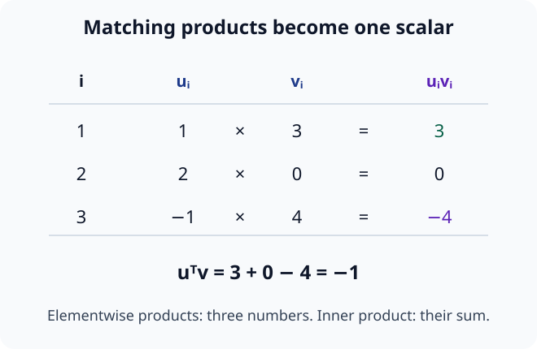
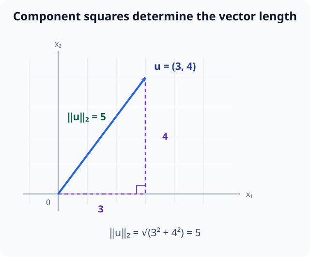
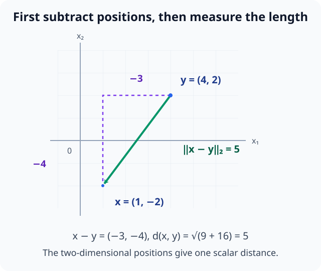
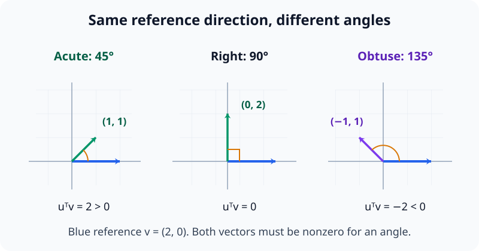
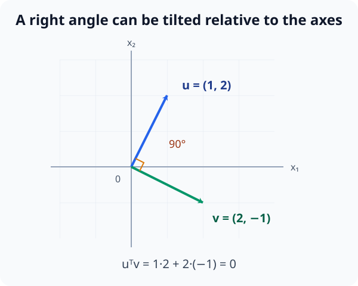
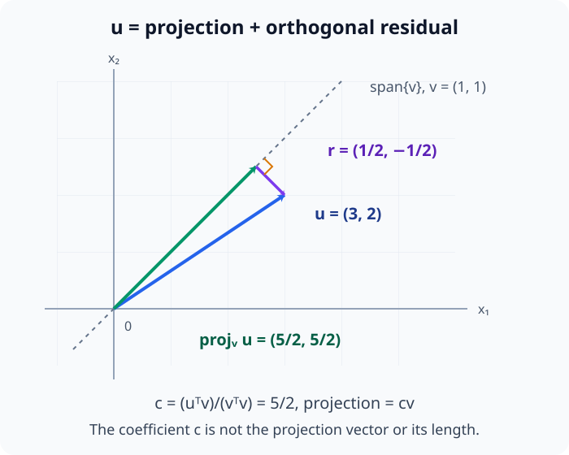
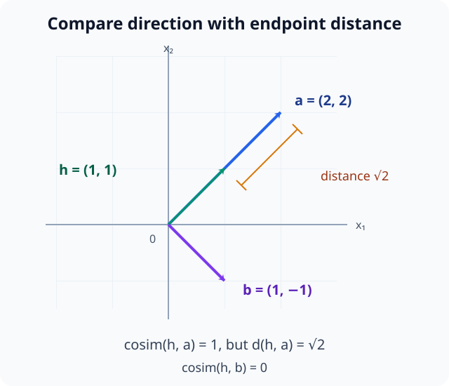

# M02-03. 내적, 길이와 각도

## 이 단원이 필요한 이유

벡터 두 개의 내적을 계산하면 두 방향이 얼마나 나란한지, 서로 직교하는지, 한 벡터가 다른 방향으로 얼마나 놓여 있는지 알 수 있다. 벡터의 길이와 두 점 사이의 거리도 내적에서 나온다.

신경망에서는 임베딩 유사도, attention score와 정사영에서 같은 계산이 나타난다. 내적값은 벡터의 길이와 좌표계의 척도에 영향을 받으므로 계산 조건을 함께 확인해야 한다.

## 학습 목표

이 단원을 마치면 다음을 할 수 있다.

- 두 벡터의 내적을 성분별 곱의 합으로 계산할 수 있다.
- 내적에서 Euclidean norm과 거리를 구할 수 있다.
- 내적의 부호와 cosine으로 두 벡터 사이의 각도를 판단할 수 있다.
- 직교 조건을 검사하고 한 벡터를 다른 벡터 위로 정사영할 수 있다.
- cosine similarity가 보여 주는 유사성과 보여 주지 않는 모델 사용을 구분할 수 있다.

## 선수지식 확인

- 선수 단원: [M02-01 벡터와 벡터 연산](M02-01-vectors-vector-operations.md)
- 선수 단원: [M02-02 선형결합과 span](M02-02-linear-combinations-span.md)
- 확인 질문: 같은 dimension의 벡터를 성분별로 더하고 스칼라를 곱할 수 있는가?
- 확인 질문: 한 벡터의 모든 실수배가 만드는 생성공간을 설명할 수 있는가?

벡터 연산이나 span이 불분명하면 선수 단원을 먼저 복습한다.

## 기호와 용어

| 기호·용어 | Common spoken reading | 의미 | 조건 |
|---|---|---|---|
| $\langle\mathbf u,\mathbf v\rangle$ | `the inner product of u and v` | 대응 성분의 곱을 더한 스칼라 | $\mathbf u,\mathbf v\in\mathbb R^n$ |
| $\mathbf u^\top\mathbf v$ | `u transpose v` | 표준 Euclidean 내적의 행렬 표기 | 결과는 scalar |
| $\|\mathbf v\|_2$ | `the L two norm of v` | 벡터의 Euclidean 길이 | 0 이상 |
| $d(\mathbf x,\mathbf y)$ | `the distance between x and y` | $\|\mathbf x-\mathbf y\|_2$ | 같은 dimension |
| $\theta$ | `theta` | 두 영이 아닌 벡터 사이의 각도 | $0\le\theta\le\pi$ |
| $\operatorname{proj}_{\mathbf v}\mathbf u$ | `the projection of u onto v` | $\mathbf u$의 $\mathbf v$ 방향 성분 | $\mathbf v\ne\mathbf 0$ |

## 핵심 개념 1. 내적은 대응 성분의 곱을 더한다

$\mathbf u,\mathbf v\in\mathbb R^n$의 표준 Euclidean 내적은

\[
\langle\mathbf u,\mathbf v\rangle
=
\mathbf u^\top\mathbf v
=
\sum_{i=1}^{n}u_i v_i
\]

이다. 두 벡터를 입력으로 받아 scalar 하나를 출력한다.

예를 들어

\[
\begin{bmatrix}1\\2\\-1\end{bmatrix}^{\top}
\begin{bmatrix}3\\0\\4\end{bmatrix}
=
1\cdot3+2\cdot0+(-1)\cdot4
=
-1
\]

이다.

아래 그림에서는 대응 성분을 곱한 결과를 행별로 확인한 뒤 모두 더한다. 행별 곱의 목록과 최종 scalar를 구분한다.

<figure class="lesson-figure lesson-figure--wide" markdown="1">

<figcaption>원소별 곱은 (3,0,-4)ᵀ의 세 성분을 남기지만, 내적은 이들을 더한 −1 하나를 출력한다.</figcaption>
</figure>

## 핵심 개념 2. 자기 자신과의 내적에서 길이가 나온다

벡터 $\mathbf v$의 Euclidean norm은

\[
\|\mathbf v\|_2
=
\sqrt{\mathbf v^\top\mathbf v}
=
\sqrt{\sum_{i=1}^{n}v_i^2}
\]

이다. 각 성분의 제곱을 더한 뒤 제곱근을 취한다.

\[
\|\mathbf v\|_2\ge0
\]

이며 $\|\mathbf v\|_2=0$인 경우는 $\mathbf v=\mathbf 0$뿐이다. 제곱한 성분은 모두 0 이상이므로 그 합이 0이 되려면 모든 성분이 0이어야 하기 때문이다. $\mathbb R^2$에서는 피타고라스 정리의 빗변 길이와 같다.

스칼라 $\alpha$를 곱하면 각 성분의 제곱에는 $\alpha^2$이 곱해진다. 따라서

\[
\|\alpha\mathbf v\|_2
=\sqrt{\alpha^2\sum_i v_i^2}
=|\alpha|\,\|\mathbf v\|_2
\]

이다. 길이는 음수가 될 수 없어 $\alpha$가 아닌 $|\alpha|$를 사용한다. 스칼라곱의 부호가 방향을 바꾸는 효과와 길이에 주는 배율을 분리한 식이다.

아래 그림은 예제 1의 $(3,4)^\top$를 직각삼각형으로 나타낸다. 성분은 직각변의 이동량이고 norm은 원점에서 끝점까지의 빗변 길이다.

<figure class="lesson-figure lesson-figure--wide" markdown="1">

<figcaption>두 직각변의 길이는 3과 4이며 벡터의 길이는 √(3²+4²)=5다. 성분 두 개를 길이 하나로 합치는 계산을 확인한다.</figcaption>
</figure>

## 핵심 개념 3. 두 점 사이의 거리는 차이 벡터의 길이다

$\mathbf x,\mathbf y\in\mathbb R^n$ 사이의 Euclidean 거리는

\[
d(\mathbf x,\mathbf y)
=
\|\mathbf x-\mathbf y\|_2
\]

로 정의한다. 먼저 $\mathbf y$에서 $\mathbf x$로 가는 차이 벡터 $\mathbf x-\mathbf y$를 구한 뒤 그 길이를 잰다. 반대 이동은 $\mathbf y-\mathbf x=-(\mathbf x-\mathbf y)$이고 길이는 같으므로 두 점을 비교하는 순서는 거리를 바꾸지 않는다.

거리와 dimension은 다른 양이다. dimension은 성분의 수이고, 거리는 두 벡터 사이의 차이를 scalar로 나타낸다.

아래 그림은 연습문제 2의 두 위치를 연결한다. 원점에서의 길이 대신, 한 끝점에서 다른 끝점으로 가는 차이 벡터의 길이를 잰다.

<figure class="lesson-figure lesson-figure--wide" markdown="1">

<figcaption>y에서 x로 가는 변위는 (-3,-4)ᵀ이고 거리는 5다. 반대 방향으로 이동해도 제곱한 성분과 길이는 같다.</figcaption>
</figure>

## 핵심 개념 4. 내적은 길이와 각도를 연결한다

영이 아닌 두 벡터 $\mathbf u,\mathbf v$ 사이의 각도를 $\theta$로 둔다.

각도는 radian으로도 적으며 $\pi$가 $180^\circ$, $\pi/2$가 $90^\circ$에 해당한다. $\cos\theta$는 길이를 1로 맞춘 방향을 기준 방향으로 내려 보았을 때의 부호 있는 길이다. 예각에서는 직각삼각형의 인접변 길이를 빗변 길이로 나눈 비와 같다. 같은 방향에서는 1, 직각에서는 0, 반대 방향에서는 -1이고, 둔각에서는 음수다.

내적과의 관계는

\[
\mathbf u^\top\mathbf v
=
\|\mathbf u\|_2\|\mathbf v\|_2\cos\theta
\]

이다. 따라서

\[
\cos\theta
=
\frac{\mathbf u^\top\mathbf v}
{\|\mathbf u\|_2\|\mathbf v\|_2}
\]

로 각도의 cosine을 계산할 수 있다. 내적을 두 길이의 곱으로 나누면 벡터가 길어서 커진 배율을 제거하고 방향의 관계만 남긴다. 반대로 내적 자체는 방향 관계에 두 벡터의 길이 배율까지 곱한 값이다.

- 내적이 양수이면 $0\le\theta<\frac{\pi}{2}$이다. $\theta=0$이면 같은 방향이고, $0<\theta<\frac{\pi}{2}$이면 예각이다.
- 내적이 0이면 $\theta=\frac{\pi}{2}$이다.
- 내적이 음수이면 $\frac{\pi}{2}<\theta\le\pi$이다. $\theta=\pi$이면 반대 방향이고, $\frac{\pi}{2}<\theta<\pi$이면 둔각이다.

영벡터는 방향이 없으므로 영벡터와의 각도와 cosine similarity를 정의하지 않는다.

아래 세 장면은 같은 기준 방향에서 내적의 부호를 비교한다. 주황색 각도 표시와 내적의 부호를 함께 읽는다.

<figure class="lesson-figure lesson-figure--wide" markdown="1">

<figcaption>같은 기준 벡터 (2,0)ᵀ에 대해 예각에서는 내적이 양수, 직각에서는 0, 둔각에서는 음수다. 각도 해석은 두 벡터가 모두 영이 아닐 때 적용한다.</figcaption>
</figure>

## 핵심 개념 5. 내적이 0인 벡터는 직교한다

\[
\mathbf u^\top\mathbf v=0
\]

이면 두 벡터가 직교한다고 한다. 두 벡터가 모두 영이 아니면 사이각은 $90^\circ$다.

직교는 선형독립보다 강한 조건이다. 영이 아닌 직교 벡터들은 서로 배수가 아니므로 독립 방향을 제공한다. 선형독립의 정확한 정의는 M02-07에서 다룬다.

영벡터도 어떤 벡터와의 내적이 0이므로 대수적으로는 모든 벡터와 직교한다. 다만 영벡터에는 방향이 없어 $90^\circ$라는 각도 해석이나 독립 방향이라는 설명은 적용하지 않는다.

아래 그림은 예제 2의 두 방향을 나타낸다. 좌표축에 맞춘 화살표가 아니어도 대응 성분의 곱이 상쇄되면 두 방향이 직교한다.

<figure class="lesson-figure lesson-figure--wide" markdown="1">

<figcaption>(1,2)ᵀ와 (2,-1)ᵀ의 내적은 2−2=0이다. 기울어진 두 방향 사이의 직각과 이 대수적 조건이 일치한다.</figcaption>
</figure>

## 핵심 개념 6. 정사영은 한 방향의 성분을 뽑는다

$\mathbf v\ne\mathbf 0$일 때 $\mathbf u$를 $\mathbf v$가 만드는 직선 위로 정사영한 벡터는

\[
\operatorname{proj}_{\mathbf v}\mathbf u
=
\frac{\mathbf u^\top\mathbf v}
{\mathbf v^\top\mathbf v}
\mathbf v
\]

이다.

분수 부분은 $\mathbf v$를 몇 배 해야 $\mathbf u$의 $\mathbf v$ 방향 성분이 되는지 정하는 계수다. 정사영 결과는 $\mathbf v$의 배수이므로 $\operatorname{span}\{\mathbf v\}$에 속한다.

이 계수는 남은 변위가 직선에 직교하도록 정한다. 정사영 벡터를 $c\mathbf v$로 놓으면 잔차는 $\mathbf u-c\mathbf v$이고, 직교 조건은

\[
(\mathbf u-c\mathbf v)^\top\mathbf v
=\mathbf u^\top\mathbf v-c\,\mathbf v^\top\mathbf v
=0
\]

이다. 이를 $c$에 대해 풀면 $c=(\mathbf u^\top\mathbf v)/(\mathbf v^\top\mathbf v)$를 얻는다. $\mathbf v\ne\mathbf 0$이면 분모는 양수여서 계수를 하나로 정할 수 있다. 계수 $c$는 배율이고 $c\mathbf v$가 실제 정사영 벡터이며, $\mathbf v$의 길이가 1이 아닌 한 배율 자체를 정사영의 부호 있는 길이로 읽지 않는다.

잔차 벡터를

\[
\mathbf r
=
\mathbf u-\operatorname{proj}_{\mathbf v}\mathbf u
\]

라고 하면

\[
\mathbf r^\top\mathbf v=0
\]

이다. 정사영 뒤 남은 성분은 $\mathbf v$와 직교한다.

아래 그림에서 예제 3의 파란 벡터를 초록색 정사영과 보라색 잔차로 분리한다. 정사영은 회색 직선 위에 있고 잔차는 그 직선과 직교한다.

<figure class="lesson-figure lesson-figure--wide" markdown="1">

<figcaption>u=(3,2)ᵀ에서 정사영 (5/2,5/2)ᵀ를 빼면 잔차 (1/2,-1/2)ᵀ가 남는다. 계수 5/2와 정사영 벡터, 그 벡터의 길이는 각각 다른 양이다.</figcaption>
</figure>

## 핵심 개념 7. cosine similarity는 방향을 비교한다

영이 아닌 벡터의 cosine similarity는

\[
\operatorname{cosim}(\mathbf u,\mathbf v)
=
\frac{\mathbf u^\top\mathbf v}
{\|\mathbf u\|_2\|\mathbf v\|_2}
\]

이다. 값은 $-1$ 이상 $1$ 이하이며 벡터의 양의 크기 변화에 영향을 받지 않는다.

\[
\operatorname{cosim}(2\mathbf u,5\mathbf v)
=
\operatorname{cosim}(\mathbf u,\mathbf v)
\]

이다. 분자 내적에는 $2\cdot5$가 곱해지고, 분모의 두 길이에도 같은 $2\cdot5$가 곱해져 약분되기 때문이다. 두 배율이 양수라는 조건으로 방향을 유지한다. 반면 Euclidean 거리는 크기 변화에 영향을 받는다. 예제 4의 $\mathbf h=(1,1)^\top$과 $\mathbf a=(2,2)^\top$는 같은 방향이라 cosine이 1이지만, 두 끝점은 다르고 거리는 $\sqrt2$다. 방향 유사도와 거리 유사도는 서로 다른 질문에 답한다.

아래 그림에서 같은 방향의 두 화살표 끝점을 비교한다. 주황색 표시로 잰 끝점 사이의 거리는 0이 아니며, 보라색 벡터는 두 벡터와 직교한다.

<figure class="lesson-figure lesson-figure--wide" markdown="1">

<figcaption>h와 a는 cosine이 1이지만 거리는 √2다. h와 b는 cosine이 0이므로 방향이 직교한다.</figcaption>
</figure>

## 예제 1. 내적과 norm 계산

\[
\mathbf u=
\begin{bmatrix}3\\4\end{bmatrix},
\qquad
\mathbf v=
\begin{bmatrix}2\\-1\end{bmatrix}
\]

라고 하자. 내적은

\[
\mathbf u^\top\mathbf v
=
3\cdot2+4(-1)
=
2
\]

이다.

\[
\|\mathbf u\|_2
=
\sqrt{3^2+4^2}
=
5
\]

이고

\[
\|\mathbf v\|_2
=
\sqrt{2^2+(-1)^2}
=
\sqrt5
\]

이다.

## 예제 2. 직교 조건 확인

\[
\mathbf u=
\begin{bmatrix}1\\2\end{bmatrix},
\qquad
\mathbf v=
\begin{bmatrix}2\\-1\end{bmatrix}
\]

이면

\[
\mathbf u^\top\mathbf v
=
1\cdot2+2(-1)
=
0
\]

이다. 두 벡터는 직교한다.

## 예제 3. 한 벡터 위로 정사영

\[
\mathbf u=
\begin{bmatrix}3\\2\end{bmatrix},
\qquad
\mathbf v=
\begin{bmatrix}1\\1\end{bmatrix}
\]

라고 하자.

\[
\mathbf u^\top\mathbf v=5,
\qquad
\mathbf v^\top\mathbf v=2
\]

이므로

\[
\operatorname{proj}_{\mathbf v}\mathbf u
=
\frac52
\begin{bmatrix}1\\1\end{bmatrix}
=
\begin{bmatrix}5/2\\5/2\end{bmatrix}
\]

이다.

잔차는

\[
\mathbf r
=
\begin{bmatrix}3\\2\end{bmatrix}
-
\begin{bmatrix}5/2\\5/2\end{bmatrix}
=
\begin{bmatrix}1/2\\-1/2\end{bmatrix}
\]

이며 $\mathbf r^\top\mathbf v=0$이다.

## 예제 4. 임베딩의 cosine similarity

세 임베딩이

\[
\mathbf h=
\begin{bmatrix}1\\1\end{bmatrix},
\qquad
\mathbf a=
\begin{bmatrix}2\\2\end{bmatrix},
\qquad
\mathbf b=
\begin{bmatrix}1\\-1\end{bmatrix}
\]

라고 하자.

\[
\operatorname{cosim}(\mathbf h,\mathbf a)=1
\]

이고

\[
\operatorname{cosim}(\mathbf h,\mathbf b)=0
\]

이다. $\mathbf a$는 $\mathbf h$와 같은 방향이고 $\mathbf b$는 직교한다.

이 관찰은 선택한 표현에서 두 방향의 관계를 보여 준다. 두 token의 의미가 같거나 모델이 해당 방향을 예측에 사용한다는 결론에는 행동 평가나 개입 증거가 더 필요하다.

## 흔한 오해

### 오해 1. 내적은 벡터의 원소별 곱이다

원소별 곱은 벡터를 출력하지만 내적은 원소별 곱을 모두 더해 scalar를 출력한다.

### 오해 2. 내적이 크면 두 벡터의 방향이 가깝다

내적은 두 벡터의 길이에도 영향을 받는다. 방향만 비교하려면 각 벡터의 norm으로 나눈 cosine similarity를 사용한다.

### 오해 3. 직교하면 통계적으로 독립이다

직교는 선택한 내적에서 벡터의 각도가 $90^\circ$라는 기하학적 관계다. 확률변수의 독립은 결합분포에 관한 조건이다.

### 오해 4. cosine similarity가 높으면 모델이 같은 개념으로 처리한다

높은 cosine similarity는 측정한 두 벡터의 방향이 가깝다는 관찰이다. 개념의 동일성이나 기능적 사용은 별도의 실험으로 확인해야 한다.

## 연습문제

### 1. 내적 계산

\[
\mathbf u=
\begin{bmatrix}2\\-1\\3\end{bmatrix},
\qquad
\mathbf v=
\begin{bmatrix}4\\2\\0\end{bmatrix}
\]

일 때 $\mathbf u^\top\mathbf v$를 구하라.

해설 보기

\[
\mathbf u^\top\mathbf v
=
2\cdot4+(-1)\cdot2+3\cdot0
=
6
\]

이다. 대응 성분의 곱을 모두 더한 scalar다.

### 2. norm과 거리

\[
\mathbf x=
\begin{bmatrix}1\\-2\end{bmatrix},
\qquad
\mathbf y=
\begin{bmatrix}4\\2\end{bmatrix}
\]

일 때 $\|\mathbf x\|_2$와 $d(\mathbf x,\mathbf y)$를 구하라.

해설 보기

\[
\|\mathbf x\|_2
=
\sqrt{1^2+(-2)^2}
=
\sqrt5
\]

이다. 차이 벡터는

\[
\mathbf x-\mathbf y
=
\begin{bmatrix}-3\\-4\end{bmatrix}
\]

이므로

\[
d(\mathbf x,\mathbf y)
=
\sqrt{(-3)^2+(-4)^2}
=
5
\]

이다.

### 3. 각도의 범위

두 영이 아닌 벡터의 내적이 각각 양수, 0, 음수일 때 사이각의 범위를 설명하라. 같은 방향과 반대 방향인 끝점도 포함하라.

해설 보기

\[
\mathbf u^\top\mathbf v
=
\|\mathbf u\|_2\|\mathbf v\|_2\cos\theta
\]

에서 두 norm은 양수다. 내적이 양수이면 $0\le\theta<\frac{\pi}{2}$이고, $\theta=0$은 같은 방향이다. 내적이 0이면 $\theta=\frac{\pi}{2}$로 직각이다. 내적이 음수이면 $\frac{\pi}{2}<\theta\le\pi$이고, $\theta=\pi$는 반대 방향이다.

### 4. 직교하는 미지수

\[
\mathbf u=
\begin{bmatrix}1\\3\end{bmatrix},
\qquad
\mathbf v=
\begin{bmatrix}a\\2\end{bmatrix}
\]

가 직교하도록 $a$를 구하라.

해설 보기

직교 조건은

\[
\mathbf u^\top\mathbf v
=
a+6
=
0
\]

이다. 따라서 $a=-6$이다.

### 5. 정사영 계산

\[
\mathbf u=
\begin{bmatrix}4\\3\end{bmatrix},
\qquad
\mathbf v=
\begin{bmatrix}1\\0\end{bmatrix}
\]

일 때 $\operatorname{proj}_{\mathbf v}\mathbf u$와 잔차를 구하라.

해설 보기

\[
\mathbf u^\top\mathbf v=4,
\qquad
\mathbf v^\top\mathbf v=1
\]

이므로

\[
\operatorname{proj}_{\mathbf v}\mathbf u
=
4
\begin{bmatrix}1\\0\end{bmatrix}
=
\begin{bmatrix}4\\0\end{bmatrix}
\]

이다. 잔차는

\[
\begin{bmatrix}4\\3\end{bmatrix}
-
\begin{bmatrix}4\\0\end{bmatrix}
=
\begin{bmatrix}0\\3\end{bmatrix}
\]

이다. 잔차와 $\mathbf v$의 내적은 0이다.

### 6. cosine과 크기 변화

$\mathbf u,\mathbf v$가 영이 아닌 벡터이고 $\alpha,\beta>0$일 때

\[
\operatorname{cosim}(\alpha\mathbf u,\beta\mathbf v)
=
\operatorname{cosim}(\mathbf u,\mathbf v)
\]

임을 식으로 보이라.

해설 보기

분자는

\[
(\alpha\mathbf u)^\top(\beta\mathbf v)
=
\alpha\beta\mathbf u^\top\mathbf v
\]

이고 분모는

\[
\|\alpha\mathbf u\|_2\|\beta\mathbf v\|_2
=
\alpha\beta\|\mathbf u\|_2\|\mathbf v\|_2
\]

이다. $\alpha\beta$가 약분되므로 원래 cosine similarity와 같다.

### 7. 유사도 주장의 범위

두 activation 벡터의 cosine similarity가 $0.97$로 관찰됐다. 다음 중 이 결과만으로 말할 수 있는 문장과 추가 증거가 필요한 문장을 구분하라.

1. 선택한 내적에서 두 벡터의 방향이 가깝다.
2. 두 입력은 모델에 같은 의미를 갖는다.
3. 두 벡터의 Euclidean 거리가 작다.
4. 이 방향이 출력 행동의 원인이다.

해설 보기

첫 문장은 cosine similarity의 정의에서 직접 말할 수 있다. 둘째 문장은 의미에 대한 별도 기준이 필요하다. 셋째 문장은 벡터의 길이를 모르므로 판단할 수 없다. 넷째 문장은 개입과 대조군이 필요하다.

## 단원 요약

- Euclidean 내적은 대응 성분의 곱을 더해 scalar를 만든다.
- 자기 자신과의 내적에서 norm을 구하고, 차이 벡터의 norm으로 거리를 잰다.
- 내적은 두 벡터의 길이와 사이각을 연결하며 내적 0은 직교를 뜻한다.
- 정사영은 한 벡터에서 지정한 방향의 성분을 추출한다.
- cosine similarity는 방향을 비교하며 의미 동일성이나 인과적 사용을 보장하지 않는다.

## 통과 기준

다음 질문에 자료를 보지 않고 답할 수 있으면 통과한다.

- 내적, norm과 거리를 작은 벡터에서 계산할 수 있는가?
- 내적의 부호로 사이각의 종류를 판단할 수 있는가?
- 직교 조건을 식으로 쓸 수 있는가?
- 한 벡터 위의 정사영과 직교 잔차를 계산할 수 있는가?
- cosine similarity의 해석 범위를 설명할 수 있는가?

## 다음 단원

- [M02-04 행렬과 행렬곱](M02-04-matrices-matrix-multiplication.md)

## 집필자 점검표

- [x] 학습 목표가 관찰 가능한 행동으로 작성됐다.
- [x] 내적, norm, 거리와 각도의 조건을 정의했다.
- [x] 영벡터에서 각도와 cosine이 정의되지 않음을 밝혔다.
- [x] 정사영과 직교 잔차를 계산했다.
- [x] 모든 문제에 해설이 있다.
- [x] cosine 관찰과 모델 사용 주장을 구분했다.
- [x] 용어집과 표기 규칙을 따랐다.
- [x] 선수지식 밖의 행렬 정사영을 요구하지 않는다.
- [x] 내부 링크와 수식 구분자를 확인했다.
- [x] Common spoken reading이 실제 영어 학술 발화이며 한글 음역이나 기계적 직역을 포함하지 않는다.
