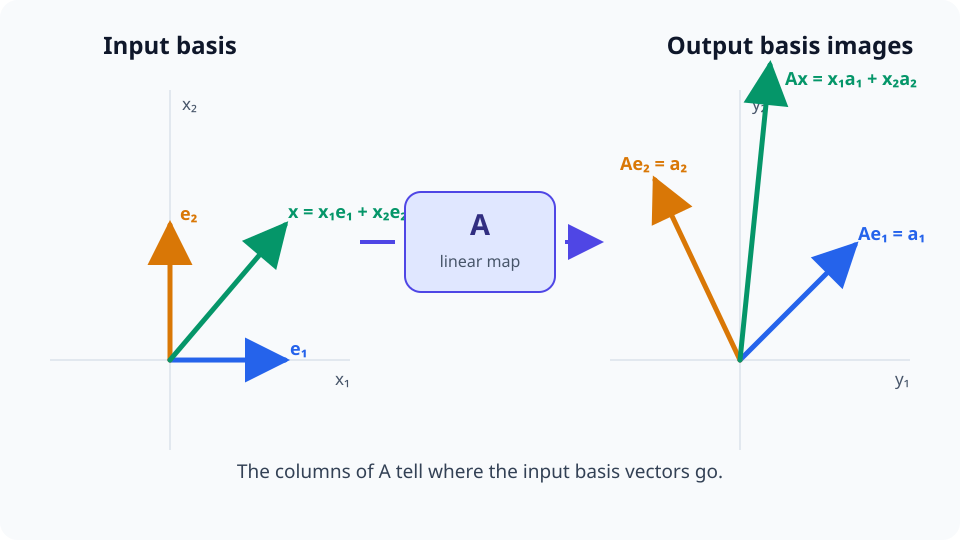

# M02-05. 행렬을 선형변환으로 보기

## 이 단원이 필요한 이유

행렬을 수의 표로만 보면 곱셈 절차는 알 수 있지만 계산이 공간에 하는 일을 놓치기 쉽다. 행렬 $\mathbf A$는 입력 벡터를 출력 벡터로 보내는 함수

\[
T(\mathbf x)=\mathbf A\mathbf x
\]

를 나타낸다. 행렬의 열은 입력 좌표축이 어디로 가는지 보여 주며, 행렬곱은 변환을 차례로 적용하는 합성을 나타낸다.

신경망의 가중치 행렬도 입력 표현의 방향을 섞고 확대하거나 줄인다. 편향과 비선형함수가 추가되면 전체 층은 선형변환과 다른 성질을 갖는다.

## 학습 목표

이 단원을 마치면 다음을 할 수 있다.

- 행렬을 $\mathbb R^n$에서 $\mathbb R^m$으로 가는 함수로 읽을 수 있다.
- 선형변환이 벡터 덧셈과 스칼라곱을 보존하는지 검사할 수 있다.
- 행렬의 열을 표준기저 벡터의 변환 결과로 해석할 수 있다.
- 확대·축소, 반사, 회전과 투영 행렬을 작은 벡터에 적용할 수 있다.
- 행렬곱의 순서와 변환 합성의 순서를 연결할 수 있다.
- 선형변환, 아핀변환과 비선형 연산을 구분할 수 있다.

## 선수지식 확인

- 선수 단원: [M02-02 선형결합과 span](M02-02-linear-combinations-span.md)
- 선수 단원: [M02-04 행렬과 행렬곱](M02-04-matrices-matrix-multiplication.md)
- 확인 질문: $\mathbf A\mathbf x$를 $\mathbf A$의 열벡터들의 선형결합으로 쓸 수 있는가?
- 확인 질문: 두 행렬곱의 순서를 바꾸면 결과가 달라질 수 있음을 설명할 수 있는가?

선형결합이나 행렬곱이 불분명하면 선수 단원을 먼저 복습한다.

## 기호와 용어

| 기호·용어 | Common spoken reading | 의미 | 조건 |
|---|---|---|---|
| $T:\mathbb R^n\to\mathbb R^m$ | `T maps R to the n into R to the m` | 입력 벡터를 출력 벡터에 대응시키는 변환 | 입력 dimension $n$, 출력 dimension $m$ |
| $T(\mathbf x)=\mathbf A\mathbf x$ | `T of x equals A x` | 행렬 $\mathbf A$로 표현한 선형변환 | $\mathbf A\in\mathbb R^{m\times n}$ |
| $\mathbf e_j$ | `e sub j` | $j$번째 성분만 1인 표준기저 벡터 | $\mathbf e_j\in\mathbb R^n$ |
| $S\circ T$ | `S composed with T` | $T$를 적용한 뒤 $S$를 적용하는 변환 | 출력과 다음 입력 dimension이 맞아야 한다. |
| 아핀변환 | `affine transformation` | 선형변환 뒤 고정 벡터를 더하는 변환 | $\mathbf x\mapsto\mathbf A\mathbf x+\mathbf b$ |

## 핵심 개념 1. 행렬은 입력 벡터를 출력 벡터로 보낸다

$\mathbf A\in\mathbb R^{m\times n}$이면

\[
T:\mathbb R^n\to\mathbb R^m,
\qquad
T(\mathbf x)=\mathbf A\mathbf x
\]

로 변환을 정의할 수 있다. $\mathbf A$의 열 수 $n$이 입력 dimension이고 행 수 $m$이 출력 dimension이다.

행렬이 정사각형일 필요는 없다. $m<n$이면 출력 좌표 수가 줄고, $m>n$이면 더 많은 출력 좌표를 만든다. 좌표 수의 변화만으로 정보가 얼마나 보존되는지는 판단할 수 없다. kernel과 rank를 M02-08에서 배운 뒤 판단한다.

## 핵심 개념 2. 선형변환은 선형결합을 보존한다

변환 $T$가 모든 벡터 $\mathbf u,\mathbf v$와 모든 scalar $\alpha,\beta$에 대해

\[
T(\alpha\mathbf u+\beta\mathbf v)
=
\alpha T(\mathbf u)+\beta T(\mathbf v)
\]

를 만족하면 선형변환이라고 한다.

$T(\mathbf x)=\mathbf A\mathbf x$는 행렬곱의 분배법칙 때문에 이 조건을 만족한다.

\[
\mathbf A(\alpha\mathbf u+\beta\mathbf v)
=
\alpha\mathbf A\mathbf u+\beta\mathbf A\mathbf v
\]

이다. 특히

\[
T(\mathbf 0)=\mathbf 0
\]

이다. 영벡터를 영벡터가 아닌 곳으로 보내는 변환은 선형변환이 아니다.

## 핵심 개념 3. 행렬의 열은 표준기저의 도착점이다

$\mathbb R^n$의 표준기저 벡터를 $\mathbf e_1,\ldots,\mathbf e_n$이라고 하자. $\mathbf A$의 $j$번째 열을 $\mathbf a_j$라고 하면

\[
T(\mathbf e_j)
=
\mathbf A\mathbf e_j
=
\mathbf a_j
\]

이다.

임의의 입력은

\[
\mathbf x=x_1\mathbf e_1+\cdots+x_n\mathbf e_n
\]

로 쓸 수 있다. 선형성에 따라

\[
T(\mathbf x)
=
x_1T(\mathbf e_1)+\cdots+x_nT(\mathbf e_n)
=
x_1\mathbf a_1+\cdots+x_n\mathbf a_n
\]

이다. 표준기저의 도착점을 알면 모든 입력의 출력을 정할 수 있다.

### 시각적 직관: 기저벡터의 도착점이 변환 전체를 정한다

<figure class="lesson-figure" markdown="1">

<figcaption>입력 기저 e₁, e₂가 행렬의 두 열 a₁, a₂로 이동하면, 임의의 입력 x도 같은 계수로 두 열을 결합한 출력에 도착한다.</figcaption>
</figure>

그림의 파란색과 주황색 화살표는 각각 한 기저벡터의 이동을 나타낸다. 초록색 입력 벡터를 따로 외워서 이동시키는 규칙은 필요 없다. 선형성 때문에 입력에서 사용한 계수 $x_1,x_2$를 출력에서도 그대로 사용해 두 열을 결합하면 된다.

여기서 휘어지는 것은 좌표선이 아니다. 하나의 고정 행렬이 수행하는 선형변환은 원점을 지나는 직선을 다시 직선으로 보낸다. 비선형함수를 뒤에 적용하거나 위치마다 서로 다른 Jacobian을 사용해 국소 변환을 이어 붙일 때에야 전체 mapping이 직선을 곡선으로 보낼 수 있다.

## 핵심 개념 4. 대각행렬은 좌표축별로 확대하거나 줄인다

\[
\mathbf D=
\begin{bmatrix}
s_x&0\\
0&s_y
\end{bmatrix}
\]

이면

\[
\mathbf D
\begin{bmatrix}x\\y\end{bmatrix}
=
\begin{bmatrix}s_xx\\s_yy\end{bmatrix}
\]

이다. 첫 좌표축은 $s_x$, 둘째 좌표축은 $s_y$배 된다.

$s_x$나 $s_y$가 음수이면 해당 좌표축 방향이 뒤집힌다. 예를 들어

\[
\begin{bmatrix}
-1&0\\
0&1
\end{bmatrix}
\]

은 $y$축에 대한 반사를 나타낸다.

## 핵심 개념 5. 회전과 투영도 행렬로 표현한다

평면을 반시계 방향으로 각도 $\theta$만큼 회전하는 행렬은

\[
\mathbf R_\theta
=
\begin{bmatrix}
\cos\theta&-\sin\theta\\
\sin\theta&\cos\theta
\end{bmatrix}
\]

이다. $\theta=90^\circ$이면

\[
\mathbf R_{90^\circ}
=
\begin{bmatrix}
0&-1\\
1&0
\end{bmatrix}
\]

이고 $(x,y)$를 $(-y,x)$로 보낸다.

$x$축 위로 투영하는 행렬은

\[
\mathbf P_x
=
\begin{bmatrix}
1&0\\
0&0
\end{bmatrix}
\]

이다.

\[
\mathbf P_x
\begin{bmatrix}x\\y\end{bmatrix}
=
\begin{bmatrix}x\\0\end{bmatrix}
\]

이므로 세로 성분을 없애고 가로 성분을 남긴다.

## 핵심 개념 6. 행렬곱은 변환의 합성을 나타낸다

\[
T(\mathbf x)=\mathbf A\mathbf x,
\qquad
S(\mathbf y)=\mathbf B\mathbf y
\]

라고 하자. $T$를 먼저 적용하고 $S$를 적용하면

\[
(S\circ T)(\mathbf x)
=
S(T(\mathbf x))
=
\mathbf B(\mathbf A\mathbf x)
=
(\mathbf B\mathbf A)\mathbf x
\]

이다.

먼저 적용하는 변환의 행렬이 오른쪽에 놓인다. $\mathbf A\mathbf B$와 $\mathbf B\mathbf A$가 다른 이유를 기하적으로 보면 변환 적용 순서가 다르기 때문이다.

## 핵심 개념 7. 편향을 더하면 아핀변환이 된다

신경망 층의 pre-activation은

\[
\mathbf z=\mathbf W\mathbf x+\mathbf b
\]

형태로 나타난다. $\mathbf W\mathbf x$는 선형변환이고 $\mathbf b$는 모든 입력을 같은 벡터만큼 이동시킨다.

$\mathbf b\ne\mathbf 0$이면

\[
T(\mathbf 0)=\mathbf b
\]

이므로 이 전체 변환은 선형변환 조건을 만족하지 않는다. 이를 아핀변환이라고 한다.

ReLU 같은 활성화함수를 추가한

\[
\mathbf h=\operatorname{ReLU}(\mathbf W\mathbf x+\mathbf b)
\]

는 일반적으로 비선형 함수다. 행렬이 공간을 선형적으로 바꾼다는 설명은 $\mathbf W\mathbf x$ 부분에 적용된다.

## 예제 1. 행렬의 열에서 변환 읽기

\[
\mathbf A=
\begin{bmatrix}
2&1\\
0&3
\end{bmatrix}
\]

라고 하자. 표준기저의 변환은

\[
T(\mathbf e_1)
=
\begin{bmatrix}2\\0\end{bmatrix},
\qquad
T(\mathbf e_2)
=
\begin{bmatrix}1\\3\end{bmatrix}
\]

이다. 두 결과가 $\mathbf A$의 첫째 열과 둘째 열이다.

\[
\mathbf x=
\begin{bmatrix}4\\-1\end{bmatrix}
=
4\mathbf e_1-\mathbf e_2
\]

이므로

\[
T(\mathbf x)
=
4T(\mathbf e_1)-T(\mathbf e_2)
=
\begin{bmatrix}7\\-3\end{bmatrix}
\]

이다.

## 예제 2. 회전 뒤 확대

$90^\circ$ 회전 행렬과 두 배 확대 행렬을

\[
\mathbf R=
\begin{bmatrix}0&-1\\1&0\end{bmatrix},
\qquad
\mathbf D=
\begin{bmatrix}2&0\\0&2\end{bmatrix}
\]

라고 하자. $\mathbf x=\begin{bmatrix}1\\3\end{bmatrix}$를 먼저 회전하고 확대하면

\[
\mathbf R\mathbf x
=
\begin{bmatrix}-3\\1\end{bmatrix}
\]

\[
\mathbf D(\mathbf R\mathbf x)
=
\begin{bmatrix}-6\\2\end{bmatrix}
\]

이다. 합성행렬은

\[
\mathbf D\mathbf R
=
\begin{bmatrix}0&-2\\2&0\end{bmatrix}
\]

이며 같은 출력을 만든다.

## 예제 3. 투영은 같은 방향으로 두 번 적용해도 결과가 같다

\[
\mathbf P_x=
\begin{bmatrix}1&0\\0&0\end{bmatrix}
\]

이면

\[
\mathbf P_x^2
=
\begin{bmatrix}1&0\\0&0\end{bmatrix}
\begin{bmatrix}1&0\\0&0\end{bmatrix}
=
\mathbf P_x
\]

이다. 첫 투영에서 이미 $y$ 성분을 없앴으므로 같은 투영을 다시 적용해도 결과가 바뀌지 않는다.

## 예제 4. 선형 층과 활성화함수 구분

\[
\mathbf W=
\begin{bmatrix}
1&-1\\
2&1
\end{bmatrix},
\qquad
\mathbf b=
\begin{bmatrix}1\\0\end{bmatrix}
\]

라고 하자. $\mathbf x=\begin{bmatrix}2\\3\end{bmatrix}$에 대해

\[
\mathbf W\mathbf x
=
\begin{bmatrix}-1\\7\end{bmatrix}
\]

이고

\[
\mathbf z=\mathbf W\mathbf x+\mathbf b
=
\begin{bmatrix}0\\7\end{bmatrix}
\]

이다. ReLU를 적용하면

\[
\mathbf h=
\begin{bmatrix}0\\7\end{bmatrix}
\]

이다.

$\mathbf W$는 선형변환을 표현한다. 편향까지 포함한 계산은 아핀변환이고 ReLU까지 포함한 층은 비선형 함수다.

## 흔한 오해

### 오해 1. 행렬은 좌표를 저장하는 표일 뿐이다

행렬은 특정 기저에서 선형변환을 나타낸다. 열을 읽으면 각 입력 기저 방향의 도착점을 알 수 있다.

### 오해 2. 입력 dimension과 출력 dimension이 같아야 선형변환이다

선형변환은 서로 다른 dimension의 공간 사이에도 정의된다. 덧셈과 스칼라곱을 보존하는지가 기준이다.

### 오해 3. $\mathbf W\mathbf x+\mathbf b$를 선형변환이라고 불러도 조건이 같다

$\mathbf b\ne\mathbf 0$이면 영벡터가 영벡터로 가지 않는다. 이 계산은 아핀변환이다.

### 오해 4. 비선형함수의 출력 공간이 휘었다는 말은 자동으로 성립한다

비선형함수는 선형결합 보존 조건을 만족하지 않는 함수다. 공간의 곡률을 말하려면 거리, 좌표와 manifold 구조를 따로 정의해야 한다.

## 연습문제

### 1. 입력과 출력 dimension

\[
\mathbf A\in\mathbb R^{4\times3},
\qquad
T(\mathbf x)=\mathbf A\mathbf x
\]

일 때 $T$의 정의역과 공역을 쓰고 입력과 출력 dimension을 말하라.

해설 보기

행렬의 열 수가 입력 dimension이고 행 수가 출력 dimension이다.

\[
T:\mathbb R^3\to\mathbb R^4
\]

이며 입력 dimension은 3, 출력 dimension은 4다.

### 2. 선형성 검사

$T:\mathbb R^2\to\mathbb R^2$를

\[
T\left(
\begin{bmatrix}x\\y\end{bmatrix}
\right)
=
\begin{bmatrix}2x-y\\3y\end{bmatrix}
\]

로 정의했다. 이 변환의 행렬을 쓰고 선형변환인지 판단하라.

해설 보기

\[
T\left(
\begin{bmatrix}x\\y\end{bmatrix}
\right)
=
\begin{bmatrix}
2&-1\\
0&3
\end{bmatrix}
\begin{bmatrix}x\\y\end{bmatrix}
\]

이다. 고정된 행렬과 벡터의 곱으로 나타나므로 덧셈과 스칼라곱을 보존하는 선형변환이다.

### 3. 표준기저의 도착점

\[
\mathbf A=
\begin{bmatrix}
1&-2\\
3&4\\
0&5
\end{bmatrix}
\]

가 나타내는 변환에서 $T(\mathbf e_1)$과 $T(\mathbf e_2)$를 구하라.

해설 보기

표준기저 벡터를 곱하면 대응하는 열이 나온다.

\[
T(\mathbf e_1)
=
\begin{bmatrix}1\\3\\0\end{bmatrix},
\qquad
T(\mathbf e_2)
=
\begin{bmatrix}-2\\4\\5\end{bmatrix}
\]

이다.

### 4. 기하 변환 적용

\[
\mathbf R=
\begin{bmatrix}0&-1\\1&0\end{bmatrix},
\qquad
\mathbf P_x=
\begin{bmatrix}1&0\\0&0\end{bmatrix},
\qquad
\mathbf x=
\begin{bmatrix}2\\-3\end{bmatrix}
\]

일 때 $\mathbf R\mathbf x$와 $\mathbf P_x\mathbf x$를 구하고 각각의 기하학적 의미를 설명하라.

해설 보기

\[
\mathbf R\mathbf x
=
\begin{bmatrix}3\\2\end{bmatrix}
\]

이다. 원래 벡터를 반시계 방향으로 $90^\circ$ 회전한 결과다.

\[
\mathbf P_x\mathbf x
=
\begin{bmatrix}2\\0\end{bmatrix}
\]

이다. $y$ 성분을 제거하고 $x$축 위로 투영한 결과다.

### 5. 합성 순서

\[
\mathbf A=
\begin{bmatrix}2&0\\0&1\end{bmatrix},
\qquad
\mathbf B=
\begin{bmatrix}1&1\\0&1\end{bmatrix},
\qquad
\mathbf x=
\begin{bmatrix}1\\2\end{bmatrix}
\]

일 때 $\mathbf B\mathbf A\mathbf x$와 $\mathbf A\mathbf B\mathbf x$를 계산하고 적용 순서를 설명하라.

해설 보기

$\mathbf B\mathbf A\mathbf x$에서는 $\mathbf A$를 먼저 적용한다.

\[
\mathbf A\mathbf x=
\begin{bmatrix}2\\2\end{bmatrix},
\qquad
\mathbf B\mathbf A\mathbf x=
\begin{bmatrix}4\\2\end{bmatrix}
\]

이다.

$\mathbf A\mathbf B\mathbf x$에서는 $\mathbf B$를 먼저 적용한다.

\[
\mathbf B\mathbf x=
\begin{bmatrix}3\\2\end{bmatrix},
\qquad
\mathbf A\mathbf B\mathbf x=
\begin{bmatrix}6\\2\end{bmatrix}
\]

이다. 적용 순서가 달라 출력도 다르다.

### 6. 아핀변환 판정

\[
F(\mathbf x)=\mathbf A\mathbf x+\mathbf b
\]

에서 $\mathbf b\ne\mathbf 0$이라고 하자. $F(\mathbf 0)$을 계산하고 $F$가 선형변환이 아닌 이유를 설명하라.

해설 보기

\[
F(\mathbf 0)
=
\mathbf A\mathbf 0+\mathbf b
=
\mathbf b
\ne
\mathbf 0
\]

이다. 선형변환은 영벡터를 영벡터로 보내야 한다. 따라서 $\mathbf b\ne\mathbf 0$인 $F$는 아핀변환이며 선형변환이 아니다.

### 7. 신경망 층의 주장 구분

\[
\mathbf h=\operatorname{ReLU}(\mathbf W\mathbf x+\mathbf b)
\]

에 대해 다음을 수행하라.

1. 선형변환, 아핀변환과 비선형 연산에 해당하는 부분을 구분하라.
2. $\mathbf W$의 한 열이 특정 입력 좌표의 변환 결과라는 설명이 맞는지 판단하라.
3. 그 열만 보고 해당 좌표가 모델 출력의 원인이라고 결론 내릴 수 있는지 판단하라.

해설 보기

$\mathbf W\mathbf x$는 선형변환이다. $\mathbf W\mathbf x+\mathbf b$는 아핀변환이고 ReLU를 포함한 전체 함수는 비선형 연산이다.

$\mathbf W$의 $j$번째 열은 표준기저 입력 $\mathbf e_j$에 선형 부분을 적용한 결과이므로 둘째 설명은 맞다.

열의 값만으로 기능적 인과를 결론 낼 수 없다. 실제 데이터에서 해당 입력 방향이 어떻게 나타나는지, 뒤의 층이 그 변화를 사용하는지와 개입 결과를 확인해야 한다.

## 단원 요약

- $m\times n$ 행렬은 $\mathbb R^n$의 입력을 $\mathbb R^m$의 출력으로 보내는 선형변환을 나타낸다.
- 선형변환은 벡터의 선형결합을 보존하며 영벡터를 영벡터로 보낸다.
- 행렬의 $j$번째 열은 $j$번째 표준기저 벡터의 변환 결과다.
- 확대·축소, 반사, 회전과 투영을 행렬로 표현할 수 있다.
- 변환 합성에서는 먼저 적용하는 행렬이 곱의 오른쪽에 놓인다.
- 편향을 더한 계산은 아핀변환이며 활성화함수를 포함한 층은 일반적으로 비선형이다.

## 통과 기준

다음 질문에 자료를 보지 않고 답할 수 있으면 통과한다.

- 행렬의 shape에서 변환의 입력과 출력 dimension을 읽을 수 있는가?
- 선형결합 보존 조건으로 선형성을 검사할 수 있는가?
- 행렬의 열을 표준기저의 도착점으로 설명할 수 있는가?
- 작은 회전, 확대와 투영 행렬을 벡터에 적용할 수 있는가?
- 행렬곱과 변환 합성의 순서를 연결할 수 있는가?
- 선형변환, 아핀변환과 비선형함수를 구분할 수 있는가?

## 다음 단원

- [M02-06 연립방정식과 역행렬](M02-06-linear-systems-inverse.md)

## 집필자 점검표

- [x] 학습 목표가 관찰 가능한 행동으로 작성됐다.
- [x] 선형변환의 정의역, 공역과 shape을 연결했다.
- [x] 선형결합 보존 조건과 영벡터 조건을 설명했다.
- [x] 행렬의 열을 표준기저의 도착점으로 해석했다.
- [x] 기하 변환과 합성 예제를 검산했다.
- [x] 모든 문제에 해설이 있다.
- [x] 선형 부분과 모델 전체의 인과 주장을 구분했다.
- [x] 용어집과 표기 규칙을 따랐다.
- [x] 내부 링크와 수식 구분자를 확인했다.
- [x] Common spoken reading이 실제 영어 학술 발화이며 한글 음역이나 기계적 직역을 포함하지 않는다.
