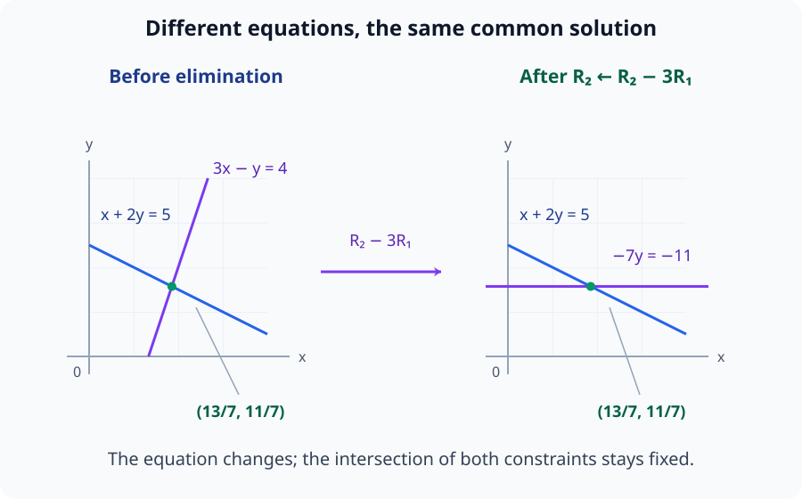
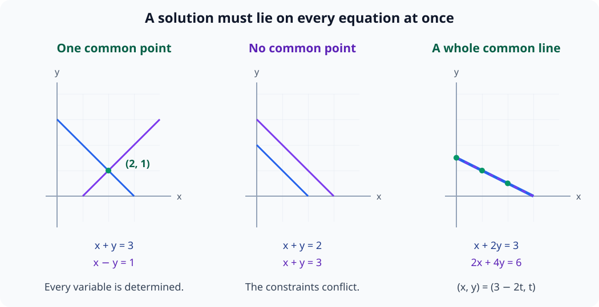
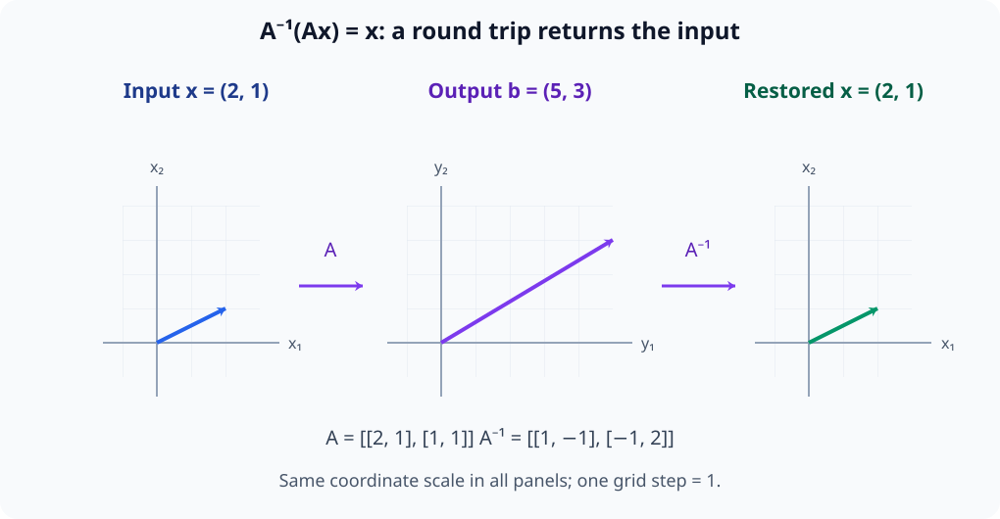
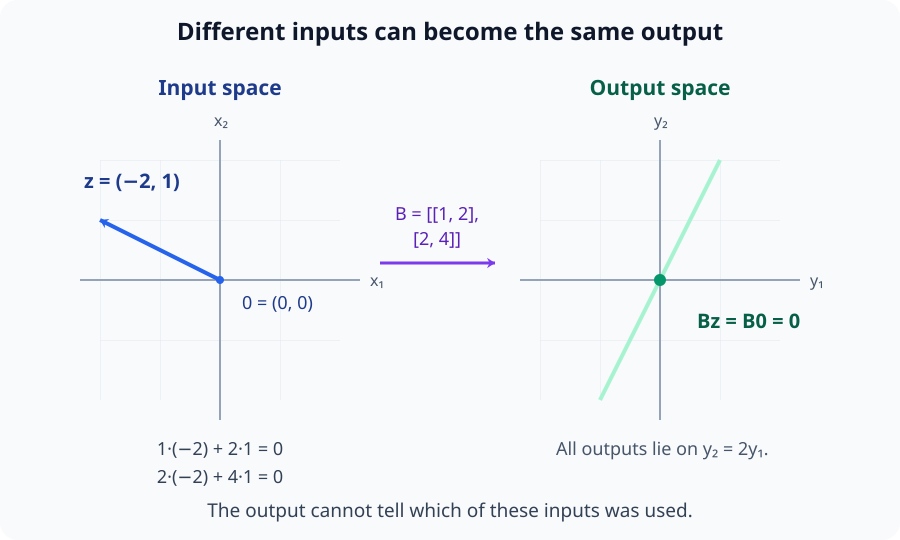
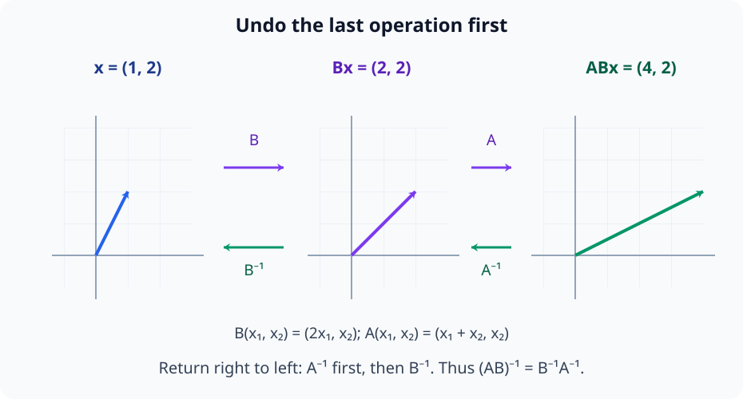
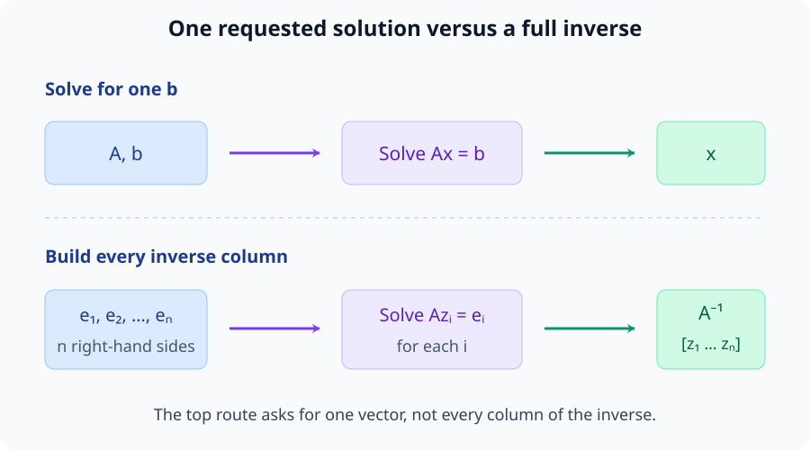

# M02-06. 연립방정식과 역행렬

## 이 단원이 필요한 이유

여러 일차방정식을 행렬식

\[
\mathbf A\mathbf x=\mathbf b
\]

로 묶으면 해를 구하는 계산과 선형변환의 성질을 함께 볼 수 있다. 해가 존재한다는 말은 변환 $\mathbf A$가 목표 $\mathbf b$를 출력할 입력을 가진다는 뜻이다. 해가 하나뿐인지, 여러 개인지, 없는지는 행렬이 입력 방향을 보존하거나 겹치게 만드는 방식에 달려 있다.

역행렬은 가역인 정사각행렬의 변환을 되돌린다. 모든 행렬에 역행렬이 있는 것은 아니며, 실제 수치 계산에서 연립방정식을 풀기 위해 역행렬을 직접 만들 필요도 없다.

## 학습 목표

이 단원을 마치면 다음을 할 수 있다.

- 일차연립방정식을 $\mathbf A\mathbf x=\mathbf b$로 옮길 수 있다.
- 확대행렬에 행 기본변환을 적용해 작은 연립방정식을 풀 수 있다.
- 해가 하나, 없음, 무한히 많음인 경우를 행 사다리꼴에서 구분할 수 있다.
- 역행렬의 정의와 존재 조건을 설명할 수 있다.
- $2\times2$ 역행렬을 구하고 해를 검산할 수 있다.
- 역행렬을 변환의 역방향으로 해석하고 사용 범위를 판단할 수 있다.

## 선수지식 확인

- 선수 단원: [M02-04 행렬과 행렬곱](M02-04-matrices-matrix-multiplication.md)
- 선수 단원: [M02-05 행렬을 선형변환으로 보기](M02-05-matrix-as-linear-transformation.md)
- 확인 질문: 행렬-벡터 곱을 성분별 방정식으로 펼칠 수 있는가?
- 확인 질문: 항등행렬이 벡터를 바꾸지 않는 이유를 설명할 수 있는가?

행렬곱이나 선형변환이 불분명하면 선수 단원을 먼저 복습한다.

## 기호와 용어

| 기호·용어 | Common spoken reading | 의미 | 조건 |
|---|---|---|---|
| $\mathbf A\mathbf x=\mathbf b$ | `A x equals b` | 미지수 벡터에 관한 일차연립방정식 | $\mathbf A\in\mathbb R^{m\times n}$ |
| $[\mathbf A\mid\mathbf b]$ | `the augmented matrix A bar b` | 계수행렬과 우변을 나란히 붙인 행렬 | $m\times(n+1)$ |
| pivot | `pivot` | 행 사다리꼴에서 한 행의 첫 0이 아닌 원소 위치 | 해의 제약을 나타낸다. |
| 자유변수 | `free variable` | pivot이 놓이지 않은 열의 미지수 | 값을 자유롭게 정할 수 있다. |
| $\mathbf A^{-1}$ | `A inverse` | $\mathbf A$의 선형변환을 되돌리는 행렬 | 가역인 정사각행렬에서만 존재 |
| 특이행렬 | `singular matrix` | 역행렬이 없는 정사각행렬 | 입력 방향 일부가 겹치거나 사라진다. |

## 핵심 개념 1. 연립방정식을 행렬식으로 묶는다

연립방정식

\[
\begin{aligned}
a_{11}x_1+\cdots+a_{1n}x_n&=b_1\\
\vdots\qquad\quad&\ \vdots\\
a_{m1}x_1+\cdots+a_{mn}x_n&=b_m
\end{aligned}
\]

은

\[
\mathbf A\mathbf x=\mathbf b
\]

와 같다. $\mathbf A$의 $i$번째 행과 $\mathbf x$의 내적이 $b_i$가 된다.

열의 관점에서는

\[
x_1\mathbf a_1+\cdots+x_n\mathbf a_n=\mathbf b
\]

이다. 해를 구한다는 말은 $\mathbf A$의 열들을 어떤 계수로 선형결합해야 $\mathbf b$가 되는지 찾는다는 뜻이다.

## 핵심 개념 2. 행 기본변환은 해집합을 보존한다

확대행렬

\[
[\mathbf A\mid\mathbf b]
\]

에 다음 세 연산을 적용할 수 있다.

1. 두 행을 맞바꾼다.
2. 한 행에 0이 아닌 scalar를 곱한다.
3. 한 행에 다른 행의 scalar배를 더한다.

이 연산은 계수뿐 아니라 우변을 포함한 행 전체에 적용한다. 두 행 교환은 방정식 순서만 바꾼다. 0이 아닌 수를 곱한 행은 그 수로 나누어 되돌릴 수 있다. 한 행에 다른 행의 배수를 더한 경우에도, 다른 행을 유지했으므로 같은 배수를 빼면 원래 행을 복원한다. 각 연산을 거꾸로 수행할 수 있어 원래 방정식의 해와 새 방정식의 해가 일치한다. 0을 곱하면 방정식 하나를 지워 되돌릴 수 없으므로 허용하지 않는다.

행 사다리꼴에서는 모든 원소가 0인 행을 아래에 놓고, 아래쪽 행의 첫 0이 아닌 원소는 위쪽 행의 첫 0이 아닌 원소보다 오른쪽에 놓는다. 그 첫 원소가 pivot이며 같은 열의 아래 원소는 0이다. 이런 모양으로 바꾸면 아래 행부터 pivot 미지수를 구해 위 행에 대입할 수 있다. 이 과정을 Gaussian 소거법이라고 한다.

아래 그림은 예제 1의 행 소거를 두 직선의 교점으로 비교한다. 둘째 방정식의 직선은 달라지지만 첫째 방정식과 함께 만족해야 하는 점은 그대로다.

<figure class="lesson-figure lesson-figure--wide" markdown="1">

<figcaption>둘째 행에서 첫째 행의 3배를 빼면 둘째 직선이 수평선으로 바뀐다. 두 방정식의 공통 교점은 보존되므로 새 식으로 계산한 해도 원래 두 식을 만족한다.</figcaption>
</figure>

## 핵심 개념 3. 연립방정식의 해는 세 경우로 나뉜다

행 소거 뒤

\[
\begin{bmatrix}
0&\cdots&0&\mid&c
\end{bmatrix},
\qquad
c\ne0
\]

인 행이 생기면 $0=c$라는 모순이므로 해가 없다.

모순이 없고 모든 미지수 열에 pivot이 있으면 해가 하나다. 모순이 없지만 pivot이 없는 미지수 열이 있으면 자유변수가 생기며 해가 무한히 많다.

pivot 미지수는 같은 행의 다른 미지수 값을 정하면 방정식으로 계산할 수 있다. 모든 미지수에 pivot이 있으면 마지막 행부터 거슬러 올라가며 각각을 하나로 정한다. 자유변수가 있으면 그 값을 먼저 고른 뒤 나머지 pivot 미지수를 계산한다. 자유변수에 서로 다른 실숫값을 넣을 수 있으므로 모순이 없는 경우에는 서로 다른 해가 무한히 나온다. 예제 3의 $y=t$, $x=3-2t$가 이 경우다.

이 분류는 실수 위의 정확한 연립방정식에 적용한다. 부동소수점 계산에서는 0에 가까운 값을 0으로 볼 허용오차가 필요하다.

아래 그림은 두 미지수에 관한 방정식의 해집합을 직선의 공통 부분으로 나타낸다. 자유변수는 오른쪽 그림처럼 공통 직선을 따라 서로 다른 해를 고를 수 있는 경우에 해당한다.

<figure class="lesson-figure lesson-figure--wide" markdown="1">

<figcaption>교점 하나가 있으면 해가 하나이고 서로 다른 평행선이면 해가 없다. 두 식이 같은 직선을 나타내면 그 직선 위의 모든 점이 해이며, 매개변수 t로 서로 다른 점을 지정할 수 있다.</figcaption>
</figure>

## 핵심 개념 4. 역행렬은 양쪽에서 항등행렬을 만든다

정사각행렬 $\mathbf A\in\mathbb R^{n\times n}$에 대해

\[
\mathbf A^{-1}\mathbf A
=
\mathbf A\mathbf A^{-1}
=
\mathbf I_n
\]

을 만족하는 행렬 $\mathbf A^{-1}$가 있으면 $\mathbf A$를 가역행렬이라고 한다.

역행렬이 존재하면

\[
\mathbf A\mathbf x=\mathbf b
\]

의 양변 왼쪽에 $\mathbf A^{-1}$를 곱해

\[
\mathbf x
=
\mathbf A^{-1}\mathbf b
\]

를 얻는다. 모든 $\mathbf b\in\mathbb R^n$에 대해 해가 하나 존재한다.

왼쪽 곱의 결합법칙으로 $\mathbf A^{-1}(\mathbf A\mathbf x)=(\mathbf A^{-1}\mathbf A)\mathbf x=\mathbf x$가 되기 때문이다. 또 후보 $\mathbf A^{-1}\mathbf b$를 원래 식에 넣으면 $\mathbf A(\mathbf A^{-1}\mathbf b)=\mathbf b$이므로 실제 해가 존재한다. 어떤 해도 왼쪽에 $\mathbf A^{-1}$를 곱하면 같은 후보로 정해지므로 해가 유일하다. 두 항등식이 각각 입력 복원과 출력 목표 도달을 보장한다.

아래 그림은 예제 4의 행렬과 역행렬을 같은 척도의 좌표계에서 차례로 적용한다. 출력에서 원래 입력으로 돌아오는 두 번째 단계가 $\mathbf A^{-1}\mathbf A=\mathbf I$의 의미다.

<figure class="lesson-figure lesson-figure--wide" markdown="1">

<figcaption>A가 입력 (2,1)을 출력 (5,3)으로 보내고 A inverse가 이를 (2,1)로 복원한다. 가운데 출력에 역행렬을 적용하는 것은 성분의 단순한 나눗셈이 아니라 또 하나의 선형변환이다.</figcaption>
</figure>

## 핵심 개념 5. $2\times2$ 역행렬은 한 scalar 조건으로 판정한다

\[
\mathbf A=
\begin{bmatrix}
a&b\\
c&d
\end{bmatrix}
\]

에서

\[
ad-bc\ne0
\]

이면

\[
\mathbf A^{-1}
=
\frac{1}{ad-bc}
\begin{bmatrix}
d&-b\\
-c&a
\end{bmatrix}
\]

이다. 위 분자의 행렬을 곱하면

\[
\begin{bmatrix}a&b\\c&d\end{bmatrix}
\begin{bmatrix}d&-b\\-c&a\end{bmatrix}
=\begin{bmatrix}ad-bc&-ab+ba\\cd-dc&ad-bc\end{bmatrix}
=(ad-bc)\mathbf I_2
\]

가 된다. 반대쪽 순서로 곱해도 같은 결과다. 따라서 $ad-bc\ne0$이면 이 수로 나누어 양쪽 곱을 항등행렬로 만들 수 있다.

$ad-bc=0$일 때는 단지 공식의 분모를 계산하지 못하는 문제가 아니다. 첫 행 $(a,b)$가 영이 아니면 영이 아닌 입력 $(b,-a)^\top$를 $\mathbf A$가 영벡터로 보낸다. 첫 행이 영이고 둘째 행 $(c,d)$가 영이 아니면 $(d,-c)^\top$가 같은 역할을 한다. 모든 원소가 0이면 모든 입력이 영벡터로 간다. 각 경우에 서로 다른 입력들이 같은 출력으로 가므로 이를 되돌리는 역행렬은 존재할 수 없다. $ad-bc$는 M02-10에서 determinant로 해석한다.

공식을 사용한 뒤

\[
\mathbf A\mathbf A^{-1}=\mathbf I_2
\]

인지 곱해서 검산한다.

아래 그림은 문제 5의 특이행렬이 영이 아닌 입력 방향을 지우는 모습을 보여 준다. 출력 하나에서 입력 둘을 구별할 수 없다는 사실이 역행렬 부재의 원인이다.

<figure class="lesson-figure lesson-figure--wide" markdown="1">

<figcaption>행렬 B는 입력 (−2,1)과 영벡터를 모두 영벡터로 보낸다. 가능한 출력도 한 직선에 놓이므로, 입력과 출력 공간의 차원이 같다는 이유만으로 입력을 복원할 수는 없다.</figcaption>
</figure>

## 핵심 개념 6. 가역성은 정보 손실이 없는 선형변환을 뜻한다

$T(\mathbf x)=\mathbf A\mathbf x$가 가역이면 출력 $\mathbf y$에서

\[
\mathbf x=\mathbf A^{-1}\mathbf y
\]

로 입력을 하나만 복원할 수 있다.

두 서로 다른 입력이 같은 출력으로 가면 역변환은 어느 입력을 돌려줄지 정할 수 없다. 특정 입력 방향이 영벡터로 사라지는 경우도 같다. kernel과 가역성의 관계는 M02-08에서 정확히 다룬다.

같은 크기의 가역 정사각행렬 $\mathbf A,\mathbf B$의 합성변환은 순서를 반대로 되돌린다.

\[
(\mathbf A\mathbf B)^{-1}
=
\mathbf B^{-1}\mathbf A^{-1}
\]

이다. 먼저 적용한 $\mathbf B$를 마지막에, 나중에 적용한 $\mathbf A$를 먼저 되돌린다.

곱으로 검산하면 $\mathbf A\mathbf B\mathbf B^{-1}\mathbf A^{-1}=\mathbf A\mathbf I\mathbf A^{-1}=\mathbf I$다. 반대쪽 곱도 $\mathbf B^{-1}\mathbf A^{-1}\mathbf A\mathbf B=\mathbf I$가 된다. 나열 순서를 교환하지 않고 결합법칙으로 이웃한 역행렬 쌍을 묶은 것이다.

아래 그림은 합성의 중간 상태를 남겨 두고 같은 경로를 거꾸로 따라간다. 마지막에 적용한 A를 먼저 되돌려야 중간 벡터 Bx에 도달할 수 있다.

<figure class="lesson-figure lesson-figure--wide" markdown="1">

<figcaption>위쪽 화살표는 B 다음 A를 적용하는 순서이고, 아래쪽 화살표는 오른쪽에서 왼쪽으로 복원하는 순서다. 따라서 합성 AB의 역변환은 A inverse 다음 B inverse를 적용한다.</figcaption>
</figure>

## 핵심 개념 7. 연립방정식을 풀 때 역행렬을 직접 만들 필요는 없다

수식

\[
\mathbf x=\mathbf A^{-1}\mathbf b
\]

는 가역성의 의미를 보여 준다. 컴퓨터에서 $\mathbf x$를 구할 때는 Gaussian 소거법이나 분해법으로 $\mathbf A\mathbf x=\mathbf b$를 직접 푼다. 역행렬 전체를 만든 뒤 곱하면 필요한 계산과 오차가 늘 수 있다.

우변 $\mathbf b$ 하나에 필요한 것은 해 벡터 하나다. 반면 역행렬의 각 열은 $\mathbf A\mathbf x=\mathbf e_i$라는 서로 다른 표준 우변의 해를 모아 둔 것이다. 한 우변을 풀기 위해 모든 우변에 대한 역변환 행렬부터 만들 필요는 없다.

직사각행렬에는 양쪽 역행렬이 없다. 해가 존재하거나 최소제곱 근사를 구할 수는 있지만, 그 문제를 정사각 역행렬 공식으로 처리하지 않는다.

아래 그림은 우변 하나의 해를 구하는 작업과 역행렬의 모든 열을 만드는 작업이 요구하는 출력의 차이를 비교한다.

<figure class="lesson-figure lesson-figure--wide" markdown="1">

<figcaption>위 경로는 주어진 b의 해 x 하나를 구한다. 아래 경로는 각 표준 우변의 해를 모두 모아 역행렬을 만들므로, 필요한 출력이 해 하나일 때 반드시 거칠 과정은 아니다.</figcaption>
</figure>

## 예제 1. 행 소거로 유일한 해 구하기

\[
\begin{aligned}
x+2y&=5\\
3x-y&=4
\end{aligned}
\]

를 확대행렬로 쓰면

\[
\left[
\begin{array}{cc|c}
1&2&5\\
3&-1&4
\end{array}
\right]
\]

이다. 둘째 행에서 첫째 행의 3배를 빼면

\[
\left[
\begin{array}{cc|c}
1&2&5\\
0&-7&-11
\end{array}
\right]
\]

이다. 따라서

\[
y=\frac{11}{7}
\]

이고 첫 식에 대입하면

\[
x
=
5-\frac{22}{7}
=
\frac{13}{7}
\]

이다. 두 미지수 열에 pivot이 있으므로 해는 하나다.

## 예제 2. 해가 없는 경우

\[
\begin{aligned}
x+y&=2\\
2x+2y&=5
\end{aligned}
\]

에서 둘째 식에서 첫째 식의 2배를 빼면

\[
0=1
\]

이 된다. 확대행렬에는

\[
\begin{bmatrix}0&0&\mid&1\end{bmatrix}
\]

인 행이 생긴다. 두 방정식의 왼쪽은 같은 직선을 요구하지만 우변이 일치하지 않으므로 해가 없다.

## 예제 3. 해가 무한히 많은 경우

\[
\begin{aligned}
x+2y&=3\\
2x+4y&=6
\end{aligned}
\]

에서 둘째 식은 첫째 식의 2배다. 소거하면 둘째 행이 모두 0이 된다. $y=t$를 자유변수로 두면

\[
x=3-2t
\]

이므로

\[
\begin{bmatrix}x\\y\end{bmatrix}
=
\begin{bmatrix}3\\0\end{bmatrix}
+
t
\begin{bmatrix}-2\\1\end{bmatrix},
\qquad
t\in\mathbb R
\]

이다. 해집합은 한 점을 지나며 한 방향으로 뻗는 직선이다.

## 예제 4. 역행렬로 해를 검산하기

\[
\mathbf A=
\begin{bmatrix}
2&1\\
1&1
\end{bmatrix},
\qquad
\mathbf b=
\begin{bmatrix}5\\3\end{bmatrix}
\]

라고 하자. $ad-bc=2\cdot1-1\cdot1=1$이므로

\[
\mathbf A^{-1}
=
\begin{bmatrix}
1&-1\\
-1&2
\end{bmatrix}
\]

이다.

\[
\mathbf x
=
\mathbf A^{-1}\mathbf b
=
\begin{bmatrix}
1&-1\\
-1&2
\end{bmatrix}
\begin{bmatrix}5\\3\end{bmatrix}
=
\begin{bmatrix}2\\1\end{bmatrix}
\]

이다. 원래 식에 넣으면

\[
\mathbf A\mathbf x
=
\begin{bmatrix}5\\3\end{bmatrix}
=
\mathbf b
\]

이므로 해가 맞다.

## 흔한 오해

### 오해 1. 정사각행렬이면 역행렬이 존재한다

정사각형은 역행렬 존재의 필요조건이다. 열 방향이 겹치거나 어떤 입력 방향이 사라지면 정사각행렬도 특이행렬이 된다.

### 오해 2. 방정식 수와 미지수 수가 같으면 해가 하나다

방정식이 서로 중복되거나 모순되면 해가 무한히 많거나 없다. pivot 구조를 확인해야 한다.

### 오해 3. $\mathbf A\mathbf x=\mathbf b$는 항상 $\mathbf x=\mathbf A^{-1}\mathbf b$로 푼다

$\mathbf A^{-1}$는 가역인 정사각행렬에만 존재한다. 수치 계산에서는 선형계 풀이 알고리즘을 직접 사용한다.

### 오해 4. 출력 dimension이 입력 dimension과 같으면 정보를 보존한다

같은 dimension의 특이행렬은 서로 다른 입력을 같은 출력으로 보낼 수 있다. 가역성은 shape만으로 결정되지 않는다.

## 연습문제

### 1. 행렬식으로 옮기기

다음 연립방정식을 $\mathbf A\mathbf x=\mathbf b$로 나타내라.

\[
\begin{aligned}
2x-y&=1\\
x+3y&=8
\end{aligned}
\]

해설 보기

\[
\begin{bmatrix}
2&-1\\
1&3
\end{bmatrix}
\begin{bmatrix}x\\y\end{bmatrix}
=
\begin{bmatrix}1\\8\end{bmatrix}
\]

이다. 각 방정식의 계수가 행렬의 한 행이 된다.

### 2. 행 소거

문제 1의 연립방정식을 행 소거로 풀어라.

해설 보기

확대행렬은

\[
\left[
\begin{array}{cc|c}
2&-1&1\\
1&3&8
\end{array}
\right]
\]

이다. 첫째 행과 둘째 행을 바꾸고, 둘째 행에서 새 첫째 행의 2배를 빼면

\[
\left[
\begin{array}{cc|c}
1&3&8\\
0&-7&-15
\end{array}
\right]
\]

이다. 따라서

\[
y=\frac{15}{7},
\qquad
x=8-3\cdot\frac{15}{7}
=
\frac{11}{7}
\]

이다.

### 3. 해의 개수 판정

다음 행 사다리꼴 확대행렬이 나타내는 연립방정식의 해가 하나, 없음, 무한히 많음 중 어느 경우인지 판단하라.

\[
\left[
\begin{array}{ccc|c}
1&0&2&3\\
0&1&-1&4\\
0&0&0&0
\end{array}
\right]
\]

해설 보기

모순행은 없고 셋째 미지수 열에는 pivot이 없다. $x_3$를 자유변수로 정할 수 있으므로 해가 무한히 많다.

$x_3=t$로 두면

\[
x_1=3-2t,
\qquad
x_2=4+t
\]

이다.

### 4. $2\times2$ 역행렬

\[
\mathbf A=
\begin{bmatrix}
3&1\\
2&1
\end{bmatrix}
\]

의 역행렬을 구하고 $\mathbf A\mathbf A^{-1}=\mathbf I_2$를 확인하라.

해설 보기

\[
ad-bc=3\cdot1-1\cdot2=1
\]

이므로

\[
\mathbf A^{-1}
=
\begin{bmatrix}
1&-1\\
-2&3
\end{bmatrix}
\]

이다.

\[
\mathbf A\mathbf A^{-1}
=
\begin{bmatrix}
3&1\\
2&1
\end{bmatrix}
\begin{bmatrix}
1&-1\\
-2&3
\end{bmatrix}
=
\begin{bmatrix}
1&0\\
0&1
\end{bmatrix}
\]

이다.

### 5. 특이행렬 판정

\[
\mathbf B=
\begin{bmatrix}
1&2\\
2&4
\end{bmatrix}
\]

에 역행렬이 존재하는지 판단하고, 서로 다른 두 입력이 같은 출력으로 가는 예를 찾아라.

해설 보기

\[
ad-bc=1\cdot4-2\cdot2=0
\]

이므로 역행렬이 존재하지 않는다.

\[
\mathbf B
\begin{bmatrix}0\\0\end{bmatrix}
=
\begin{bmatrix}0\\0\end{bmatrix}
\]

이고

\[
\mathbf B
\begin{bmatrix}-2\\1\end{bmatrix}
=
\begin{bmatrix}0\\0\end{bmatrix}
\]

이다. 서로 다른 두 입력이 같은 출력으로 가므로 역변환을 정할 수 없다.

### 6. 합성의 역

가역행렬 $\mathbf A,\mathbf B$에 대해

\[
(\mathbf A\mathbf B)(\mathbf B^{-1}\mathbf A^{-1})
=
\mathbf I
\]

임을 행렬곱의 결합법칙으로 보이라.

해설 보기

\[
\begin{aligned}
(\mathbf A\mathbf B)(\mathbf B^{-1}\mathbf A^{-1})
&=
\mathbf A(\mathbf B\mathbf B^{-1})\mathbf A^{-1}\\
&=
\mathbf A\mathbf I\mathbf A^{-1}\\
&=
\mathbf A\mathbf A^{-1}\\
&=
\mathbf I
\end{aligned}
\]

이다. 반대쪽 곱도 같은 방식으로 항등행렬이 되므로 $(\mathbf A\mathbf B)^{-1}=\mathbf B^{-1}\mathbf A^{-1}$이다.

### 7. 모델 계산의 역복원 주장

가중치 $\mathbf W\in\mathbb R^{64\times128}$와 $\mathbf h=\mathbf W\mathbf x$가 있다고 하자.

1. $\mathbf W^{-1}$를 정의할 수 있는가?
2. $\mathbf h$에서 $\mathbf x$를 하나로 복원할 수 있다고 shape만으로 결론 내릴 수 있는가?
3. 추가로 조사해야 할 대수적 성질을 적어라.

해설 보기

$\mathbf W$는 정사각행렬이 아니므로 양쪽 역행렬 $\mathbf W^{-1}$를 정의할 수 없다.

동차연립방정식 $\mathbf W\mathbf z=\mathbf 0$에는 미지수가 128개이고 방정식이 64개다. pivot은 많아도 64개이므로 자유변수가 생기고 $\mathbf z\ne\mathbf 0$인 해가 존재한다. 따라서 $\mathbf W\mathbf x=\mathbf W(\mathbf x+\mathbf z)$가 되어 모든 $\mathbf x$를 $\mathbf h$에서 하나로 복원할 수 없다.

어떤 방향이 사라지는지는 kernel을, 가능한 출력 방향의 수는 rank를 조사해야 한다. 두 개념은 M02-08에서 다룬다.

## 단원 요약

- 일차연립방정식은 $\mathbf A\mathbf x=\mathbf b$로 묶이며 해는 열벡터의 선형결합 계수다.
- 행 기본변환은 해집합을 보존하고 pivot과 자유변수를 드러낸다.
- 모순행과 pivot 구조로 해가 없음, 하나, 무한히 많음을 구분한다.
- 역행렬은 가역인 정사각행렬의 선형변환을 되돌린다.
- 실제 수치 계산에서는 역행렬 전체를 만들기보다 선형계를 직접 푼다.
- 직사각행렬이나 특이행렬에는 양쪽 역행렬이 없다.

## 통과 기준

다음 질문에 자료를 보지 않고 답할 수 있으면 통과한다.

- 연립방정식과 확대행렬을 서로 변환할 수 있는가?
- 행 소거로 작은 연립방정식을 풀 수 있는가?
- 행 사다리꼴에서 해의 개수를 판정할 수 있는가?
- 역행렬의 정의와 존재 조건을 설명할 수 있는가?
- $2\times2$ 역행렬을 구하고 검산할 수 있는가?
- 역행렬과 실제 선형계 풀이를 구분할 수 있는가?

## 다음 단원

- [M02-07 선형독립, 기저와 차원](M02-07-linear-independence-basis-dimension.md)

## 집필자 점검표

- [x] 학습 목표가 관찰 가능한 행동으로 작성됐다.
- [x] 연립방정식, 확대행렬과 열의 선형결합을 연결했다.
- [x] 세 가지 해의 경우를 예제로 구분했다.
- [x] 역행렬의 정의와 존재 조건을 밝혔다.
- [x] $2\times2$ 계산과 검산을 포함했다.
- [x] 모든 문제에 해설이 있다.
- [x] 역복원 가능성과 shape만의 주장을 구분했다.
- [x] 용어집과 표기 규칙을 따랐다.
- [x] 내부 링크와 수식 구분자를 확인했다.
- [x] Common spoken reading이 실제 영어 학술 발화이며 한글 음역이나 기계적 직역을 포함하지 않는다.
