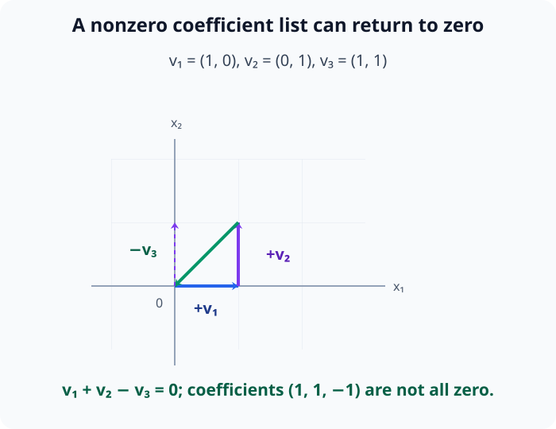
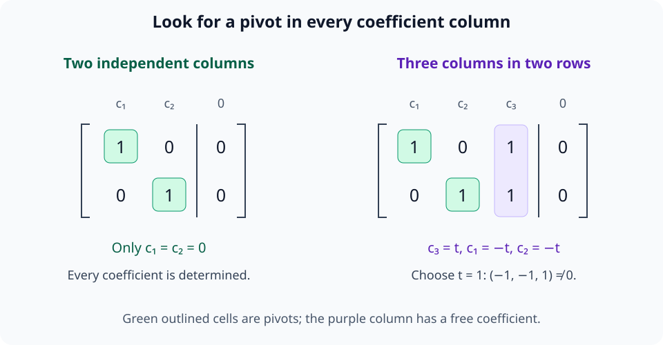
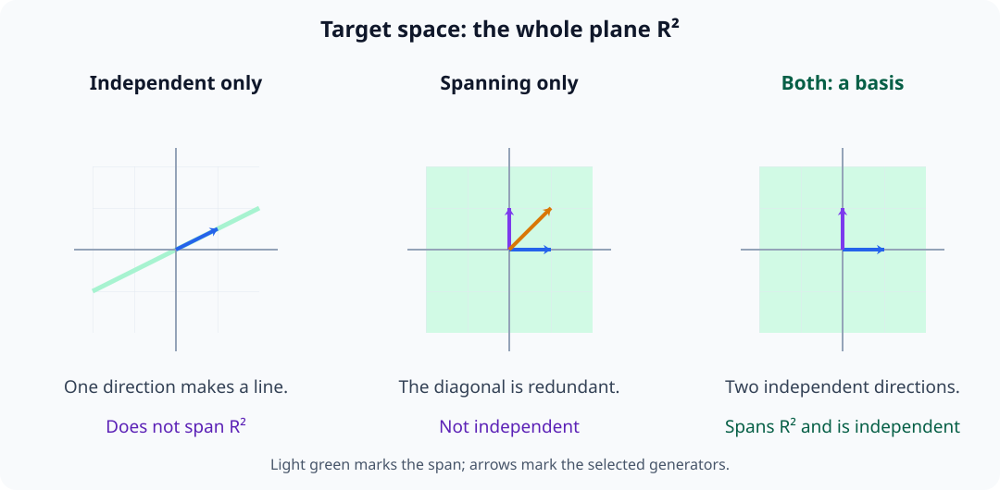
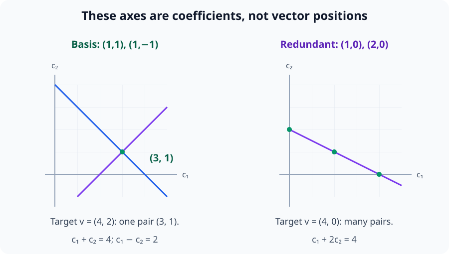
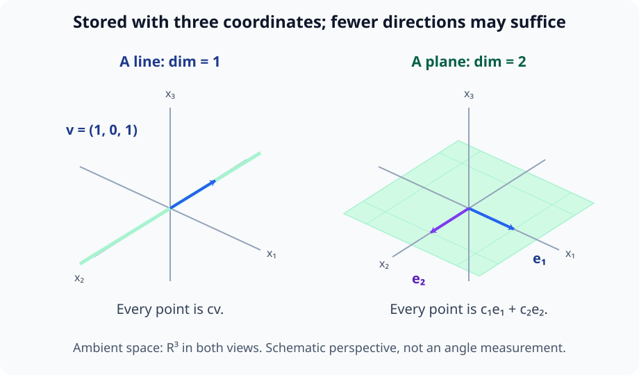
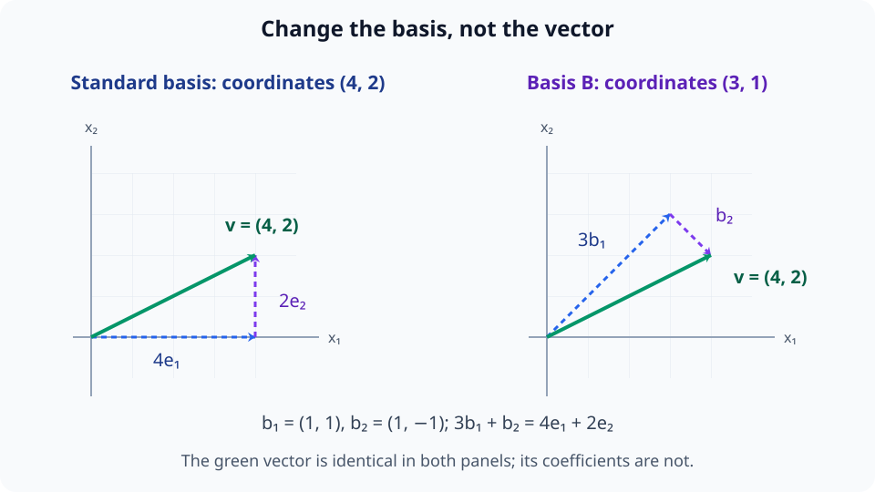

# M02-07. 선형독립, 기저와 차원

## 이 단원이 필요한 이유

여러 벡터가 같은 span을 만들더라도 일부 벡터는 다른 벡터들의 선형결합으로 대체될 수 있다. 이런 중복을 제거하면 공간을 만드는 데 필요한 독립 방향만 남는다. 독립 방향의 집합이 공간 전체를 생성할 때 그 집합을 기저라고 한다.

기저를 정하면 추상적인 벡터를 좌표로 기록할 수 있다. 차원은 특정 배열의 길이가 아니라 공간을 표현하는 데 필요한 기저 벡터의 수다. 신경망 표현을 좌표별로 해석할 때는 선택한 기저가 결론에 미치는 영향을 확인해야 한다.

## 학습 목표

이 단원을 마치면 다음을 할 수 있다.

- 선형독립과 선형종속을 계수 조건으로 판정할 수 있다.
- 생성집합에서 중복 벡터를 찾아 제거할 수 있다.
- 기저가 선형독립인 생성집합이라는 뜻을 설명할 수 있다.
- 기저에 대한 좌표를 구하고 유일성을 확인할 수 있다.
- 공간과 부분공간의 차원을 계산할 수 있다.
- 좌표별 모델 해석이 기저 선택에 의존하는 이유를 설명할 수 있다.

## 선수지식 확인

- 선수 단원: [M02-02 선형결합과 span](M02-02-linear-combinations-span.md)
- 선수 단원: [M02-06 연립방정식과 역행렬](M02-06-linear-systems-inverse.md)
- 확인 질문: 목표 벡터가 주어진 벡터들의 span에 속하는지 계수 방정식으로 판단할 수 있는가?
- 확인 질문: 동차연립방정식 $\mathbf A\mathbf c=\mathbf 0$의 해를 행 소거로 찾을 수 있는가?

span이나 연립방정식 풀이가 불분명하면 선수 단원을 먼저 복습한다.

## 기호와 용어

| 기호·용어 | Common spoken reading | 의미 | 조건 |
|---|---|---|---|
| 선형독립 | `linear independence` | 영벡터를 만드는 선형결합이 자명한 경우뿐인 관계 | 계수가 모두 0이어야 한다. |
| 선형종속 | `linear dependence` | 영벡터를 만드는 0이 아닌 계수 조합이 있는 관계 | 벡터 사이에 중복 방향이 있다. |
| $\mathcal B=(\mathbf b_1,\ldots,\mathbf b_k)$ | `the basis B consisting of b one through b k` | 공간을 생성하는 선형독립 벡터의 순서 있는 목록 | 좌표 순서를 정한다. |
| $[\mathbf v]_{\mathcal B}$ | `the coordinates of v in the basis B` | $\mathbf v$를 기저 벡터로 나타낸 계수 벡터 | $k$차원 열벡터 |
| $\dim V$ | `the dimension of V` | $V$의 한 기저가 가진 벡터 수 | 유한차원 공간에서 정의 |

## 핵심 개념 1. 선형독립은 영벡터를 만드는 계수로 정의한다

벡터 $\mathbf v_1,\ldots,\mathbf v_k$에 대해

\[
c_1\mathbf v_1+\cdots+c_k\mathbf v_k=\mathbf 0
\]

을 만족하는 계수가

\[
c_1=\cdots=c_k=0
\]

뿐이면 이 벡터들은 선형독립이다.

0이 아닌 계수가 하나라도 포함된 해가 있으면 선형종속이다. 선형종속인 집합에서는 적어도 한 벡터를 나머지 벡터들의 선형결합으로 나타낼 수 있다.

모든 계수를 0으로 두면 어떤 벡터 목록에서도 합은 영벡터다. 독립성은 이 공통 해 이외의 방법으로도 합을 0으로 만들 수 있는지 묻는다. 종속 조건에서 계수가 모두 0이 아니어야 하는 것은 아니다. 한 계수만 0이 아니어도 계수 벡터 전체는 영벡터가 아니다.

종속인 조합에서 $c_j\ne0$인 계수를 하나 고르면, 해당 항을 남기고 나머지를 반대편으로 옮긴 뒤 $c_j$로 나눌 수 있다.

\[
\mathbf v_j
=-\sum_{i\ne j}\frac{c_i}{c_j}\mathbf v_i
\]

이 식으로 그 벡터를 다른 재료들로 대체할 수 있다. 반대로 한 벡터가 나머지의 선형결합이면 모든 항을 한쪽으로 모아 영벡터를 만드는 0이 아닌 계수 조합을 얻는다. 예제 2의 $\mathbf v_3=\mathbf v_1+\mathbf v_2$에서 $(1,1,-1)$이 그런 조합이다. 세 벡터가 둘씩 서로 배수가 아니라는 사실만으로 목록 전체의 독립성을 판단할 수는 없다.

아래 그림은 서로 배수가 아닌 세 벡터도 목록 전체로는 종속일 수 있음을 보여 준다. 합의 결과가 원점으로 돌아오는 경로에 0이 아닌 계수들이 붙어 있다.

<figure class="lesson-figure lesson-figure--wide" markdown="1">

<figcaption>첫 두 벡터를 더한 뒤 세 번째 벡터를 빼면 출발점으로 돌아온다. 계수 (1,1,−1)이 모두 0이 아니므로 세 벡터는 종속이며, 두 벡터씩 서로 배수인지만 검사해서는 이 중복을 찾지 못한다.</figcaption>
</figure>

## 핵심 개념 2. 열벡터를 행렬로 묶어 독립성을 검사한다

\[
\mathbf A=
\begin{bmatrix}
\mathbf v_1&\cdots&\mathbf v_k
\end{bmatrix}
\]

로 두면

\[
\mathbf A\mathbf c=\mathbf 0
\]

은

\[
c_1\mathbf v_1+\cdots+c_k\mathbf v_k=\mathbf 0
\]

과 같다. 행 소거 뒤 모든 계수 열에 pivot이 있으면 $\mathbf c=\mathbf 0$만 가능하므로 열벡터들이 선형독립이다. 자유변수가 있으면 0이 아닌 해를 만들 수 있으므로 선형종속이다.

아래 그림은 소거한 동차연립방정식에서 계수 열마다 pivot이 있는지 비교한다. 오른쪽에서는 셋째 계수를 자유롭게 고르면 나머지 두 계수가 그 값에 맞춰 정해진다.

<figure class="lesson-figure lesson-figure--wide" markdown="1">

<figcaption>왼쪽의 계수는 모두 0으로 결정된다. 오른쪽에서는 자유계수 t를 1로 고르면 (−1,−1,1)이라는 비영 계수 벡터를 얻으며, 행이 둘뿐이어서 세 계수 열 모두에 pivot을 둘 수 없다는 점도 드러난다.</figcaption>
</figure>

## 핵심 개념 3. 영벡터와 지나치게 많은 벡터는 종속을 만든다

벡터 목록에 $\mathbf 0$이 있으면 그 벡터의 계수만 1로 두어 영벡터를 만들 수 있으므로 선형종속이다.

$\mathbb R^n$에서 $n$개보다 많은 벡터를 고르면 선형종속이다. 열이 $n$개보다 많은 행렬은 각 열에 pivot을 둘 수 없고 자유변수가 생기기 때문이다.

반대로 벡터 수가 $n$ 이하라는 사실만으로 독립성이 보장되지는 않는다. 서로 배수인 두 벡터는 $\mathbb R^n$에서도 종속이다.

## 핵심 개념 4. 기저는 독립성과 생성 조건을 함께 만족한다

벡터 목록

\[
\mathcal B=(\mathbf b_1,\ldots,\mathbf b_k)
\]

가 공간 $V$의 기저이려면 다음 두 조건을 만족해야 한다.

1. $\mathbf b_1,\ldots,\mathbf b_k$가 선형독립이다.
2. $\operatorname{span}\{\mathbf b_1,\ldots,\mathbf b_k\}=V$다.

생성 조건만 있으면 불필요한 벡터가 섞일 수 있다. 독립 조건만 있으면 공간 전체를 만들지 못할 수 있다.

$\mathbb R^n$의 표준기저

\[
\mathcal E=(\mathbf e_1,\ldots,\mathbf e_n)
\]

는 두 조건을 모두 만족한다.

표준기저의 선형결합은 $\sum_i c_i\mathbf e_i=(c_1,\ldots,c_n)^\top$다. 이 합이 영벡터이면 모든 성분 $c_i$가 0이므로 독립이다. 임의의 목표 좌표를 그 계수로 선택하면 목표 벡터를 만들 수 있으므로 공간 전체도 생성한다.

아래 그림은 목표 공간을 $\mathbb R^2$로 고정한 채 독립 조건과 생성 조건을 따로 확인한다. 옅은 초록색은 선택한 벡터들이 만들 수 있는 span이다.

<figure class="lesson-figure lesson-figure--wide" markdown="1">

<figcaption>영이 아닌 벡터 하나는 독립이지만 평면을 전부 생성하지 못한다. 표준기저 둘에 대각선 벡터를 더한 목록은 평면을 생성하지만 중복이 있으며, 표준기저 둘만 남기면 두 조건을 모두 만족한다.</figcaption>
</figure>

## 핵심 개념 5. 기저를 정하면 좌표가 하나로 정해진다

$\mathcal B=(\mathbf b_1,\ldots,\mathbf b_k)$가 $V$의 기저이면 모든 $\mathbf v\in V$는

\[
\mathbf v
=
c_1\mathbf b_1+\cdots+c_k\mathbf b_k
\]

로 표현된다. 이때

\[
[\mathbf v]_{\mathcal B}
=
\begin{bmatrix}
c_1\\
\vdots\\
c_k
\end{bmatrix}
\]

를 $\mathcal B$에 대한 $\mathbf v$의 좌표벡터라고 한다.

생성 조건은 계수 표현이 적어도 하나 존재하게 한다. 독립 조건은 그 표현을 하나로 제한한다. 같은 벡터에 대해 계수 목록 $(c_1,\ldots,c_k)$와 $(d_1,\ldots,d_k)$가 있다고 하면 두 표현을 빼서

\[
\mathbf 0
=\sum_{i=1}^k(c_i-d_i)\mathbf b_i
\]

를 얻는다. 기저 벡터들이 독립이므로 각 차이 $c_i-d_i$는 0이어야 한다. 두 목록의 모든 대응 계수가 같으므로 좌표가 유일하다. 생성은 존재를, 독립은 유일성을 보장한다.

아래 그림의 좌표축은 원래 벡터의 성분이 아니라 표현에 쓰는 계수 $c_1,c_2$다. 왼쪽에서는 목표 벡터를 만드는 두 성분 조건이 계수 한 쌍을 정하고, 오른쪽에서는 중복 재료 때문에 계수의 자유가 남는다.

<figure class="lesson-figure lesson-figure--wide" markdown="1">

<figcaption>기저 (1,1), (1,−1)로 목표 (4,2)를 만들 계수는 (3,1) 하나다. 반면 중복 벡터 (1,0), (2,0)로 목표 (4,0)를 만드는 계수는 한 직선 전체에 놓인다. 이는 서로 다른 목표의 위치 비교가 아니라 표현 계수의 유일성 비교다.</figcaption>
</figure>

## 핵심 개념 6. 차원은 기저 벡터의 수다

유한차원 공간 $V$의 모든 기저는 같은 수의 벡터를 갖는다. 그 수를

\[
\dim V
\]

라고 한다.

\[
\dim\mathbb R^n=n
\]

이다. $\mathbb R^3$ 안의 원점을 지나는 직선은 기저 벡터 하나를 가지므로 차원이 1이고, 원점을 지나는 평면은 기저 벡터 두 개를 가지므로 차원이 2다.

배열의 shape과 공간의 차원은 관련되지만 문맥을 구분해야 한다. $\mathbb R^{100}$의 데이터가 모두 원점을 지나는 한 직선 위에 놓이고 영이 아닌 표본을 포함하면, 주변 공간의 차원은 100이지만 데이터가 생성하는 부분공간의 차원은 1이다. 각 표본을 저장할 때는 성분 100개를 쓰지만, 그 직선의 비영벡터 하나를 기저로 정하면 표본마다 배율 하나로 표현할 수 있다. 모든 표본이 영벡터이면 독립 방향이 없고 생성공간의 차원은 0이다.

아래 그림은 주변 공간이 같은 $\mathbb R^3$이어도 직선과 평면을 만드는 독립 방향 수는 다름을 비교한다. 원근 표현은 공간의 포함 관계를 보여 주기 위한 것이며 그림에서 각도를 측정하지 않는다.

<figure class="lesson-figure lesson-figure--wide" markdown="1">

<figcaption>직선 위 벡터는 비영벡터 하나의 배율로, 좌표평면 위 벡터는 두 독립 기저 벡터의 계수로 표현한다. 두 경우 모두 저장할 성분은 셋이지만 부분공간의 차원은 각각 1과 2다.</figcaption>
</figure>

## 핵심 개념 7. 기저가 바뀌면 좌표가 바뀐다

$\mathbb R^2$에서

\[
\mathcal E=
\left(
\begin{bmatrix}1\\0\end{bmatrix},
\begin{bmatrix}0\\1\end{bmatrix}
\right)
\]

와

\[
\mathcal B=
\left(
\begin{bmatrix}1\\1\end{bmatrix},
\begin{bmatrix}1\\-1\end{bmatrix}
\right)
\]

는 서로 다른 기저다.

\[
\mathbf v=
\begin{bmatrix}4\\2\end{bmatrix}
\]

는 표준기저에서 좌표가

\[
[\mathbf v]_{\mathcal E}
=
\begin{bmatrix}4\\2\end{bmatrix}
\]

다. $\mathcal B$에서는

\[
\mathbf v
=
3
\begin{bmatrix}1\\1\end{bmatrix}
+
1
\begin{bmatrix}1\\-1\end{bmatrix}
\]

이므로

\[
[\mathbf v]_{\mathcal B}
=
\begin{bmatrix}3\\1\end{bmatrix}
\]

이다. 벡터는 같고 좌표가 달라졌다.

$[\mathbf v]_{\mathcal B}$의 첫 성분 3은 표준 좌표의 첫 성분이 아니라 $\mathbf b_1=(1,1)^\top$에 붙는 계수다. 둘째 성분 1은 $\mathbf b_2=(1,-1)^\top$에 붙는다. 이 재료로 다시 결합하면 $(4,2)^\top$를 얻으므로, 좌표벡터 $(3,1)^\top$를 보고 원래 벡터가 표준 좌표의 점 $(3,1)$로 이동했다고 읽으면 안 된다. 같은 벡터를 다른 재료와 계수로 기록한 것이다. 기저 벡터의 순서만 바꾸어도 대응 계수의 순서가 바뀌므로 좌표에는 기저의 순서도 필요하다.

아래 그림은 같은 표준 좌표계를 두 번 그려 벡터의 끝점은 고정하고 분해에 사용하는 기저만 바꾼다. 오른쪽의 (3,1)은 이동한 끝점이 아니라 두 기저 벡터에 붙는 계수다.

<figure class="lesson-figure lesson-figure--wide" markdown="1">

<figcaption>초록색 벡터는 양쪽 모두 (4,2)로 향한다. 왼쪽의 분해 계수는 (4,2), 오른쪽의 분해 계수는 (3,1)이지만, 각 기저 벡터와 결합한 결과는 같다.</figcaption>
</figure>

## 예제 1. 두 벡터의 독립성 판정

\[
\mathbf v_1=
\begin{bmatrix}1\\2\end{bmatrix},
\qquad
\mathbf v_2=
\begin{bmatrix}3\\1\end{bmatrix}
\]

에 대해

\[
c_1\mathbf v_1+c_2\mathbf v_2=\mathbf 0
\]

을 쓰면

\[
\begin{aligned}
c_1+3c_2&=0\\
2c_1+c_2&=0
\end{aligned}
\]

이다. 첫 식에서 $c_1=-3c_2$이고 둘째 식에 대입하면 $-5c_2=0$이다. 따라서 $c_2=0$, $c_1=0$이며 두 벡터는 선형독립이다.

## 예제 2. 종속 벡터 제거

\[
\mathbf v_1=
\begin{bmatrix}1\\0\\1\end{bmatrix},
\qquad
\mathbf v_2=
\begin{bmatrix}0\\1\\1\end{bmatrix},
\qquad
\mathbf v_3=
\begin{bmatrix}1\\1\\2\end{bmatrix}
\]

이면

\[
\mathbf v_3=\mathbf v_1+\mathbf v_2
\]

이다. 세 벡터는 선형종속이며 $\mathbf v_3$를 제거해도 span은 바뀌지 않는다.

## 예제 3. 부분공간의 기저와 차원

\[
V=
\left\{
\begin{bmatrix}x\\y\\z\end{bmatrix}
\in\mathbb R^3
\;\middle|\;
x+y+z=0
\right\}
\]

라고 하자. $z=-x-y$이므로

\[
\begin{bmatrix}x\\y\\z\end{bmatrix}
=
x
\begin{bmatrix}1\\0\\-1\end{bmatrix}
+
y
\begin{bmatrix}0\\1\\-1\end{bmatrix}
\]

이다. 두 생성 벡터는 서로 배수가 아니므로 독립이다. 따라서

\[
\mathcal B=
\left(
\begin{bmatrix}1\\0\\-1\end{bmatrix},
\begin{bmatrix}0\\1\\-1\end{bmatrix}
\right)
\]

는 $V$의 기저이고 $\dim V=2$다.

## 예제 4. 표현 좌표와 모델 해석

한 activation $\mathbf h\in\mathbb R^d$의 $j$번째 좌표가 크다고 하자. 기저를 바꾸면 같은 벡터의 좌표들이 섞이고 $j$번째 값도 달라질 수 있다.

좌표 하나와 개념을 연결하려면 선택한 기저를 명시해야 한다. 여러 기저나 모델 재매개화에서도 유지되는 부분공간 수준의 결과는 좌표 하나에 대한 결과와 다른 종류의 증거다. 어느 쪽도 개입 없이 모델의 기능적 사용을 입증하지 않는다.

## 흔한 오해

### 오해 1. 서로 다른 벡터는 선형독립이다

서로 다른 두 벡터도 한 벡터가 다른 벡터의 배수이면 선형종속이다.

### 오해 2. 공간을 생성하는 벡터 목록은 모두 기저다

생성집합에 중복 벡터가 있으면 선형독립 조건을 만족하지 않는다. 기저는 생성과 독립을 함께 요구한다.

### 오해 3. 벡터의 좌표는 대상 자체의 고정된 숫자다

좌표는 선택한 기저에 의존한다. 같은 벡터도 기저를 바꾸면 다른 계수 목록을 갖는다.

### 오해 4. 주변 공간의 dimension이 데이터의 독립 방향 수와 같다

데이터가 $\mathbb R^d$에 저장돼도 데이터가 생성하는 부분공간의 차원은 $d$보다 작을 수 있다.

## 연습문제

### 1. 정의 적용

\[
\mathbf v_1=
\begin{bmatrix}1\\2\end{bmatrix},
\qquad
\mathbf v_2=
\begin{bmatrix}2\\4\end{bmatrix}
\]

가 선형독립인지 판단하고, 종속이면 영벡터를 만드는 0이 아닌 계수를 찾아라.

해설 보기

$\mathbf v_2=2\mathbf v_1$이므로

\[
2\mathbf v_1-\mathbf v_2=\mathbf 0
\]

이다. 계수 $(2,-1)$은 둘 다 0인 조합이 아니므로 두 벡터는 선형종속이다.

### 2. 세 벡터의 독립성

\[
\mathbf v_1=
\begin{bmatrix}1\\0\\0\end{bmatrix},
\quad
\mathbf v_2=
\begin{bmatrix}0\\1\\0\end{bmatrix},
\quad
\mathbf v_3=
\begin{bmatrix}1\\1\\0\end{bmatrix}
\]

가 선형독립인지 판단하라.

해설 보기

\[
\mathbf v_3=\mathbf v_1+\mathbf v_2
\]

이므로

\[
\mathbf v_1+\mathbf v_2-\mathbf v_3=\mathbf 0
\]

이라는 0이 아닌 계수 조합이 있다. 따라서 세 벡터는 선형종속이다.

### 3. 기저 판정

\[
\mathcal B=
\left(
\begin{bmatrix}1\\1\end{bmatrix},
\begin{bmatrix}1\\-1\end{bmatrix}
\right)
\]

가 $\mathbb R^2$의 기저인지 판단하라.

해설 보기

두 벡터는 서로 배수가 아니므로 선형독립이다. 임의의 $\begin{bmatrix}x\\y\end{bmatrix}$에 대해

\[
c_1+c_2=x,
\qquad
c_1-c_2=y
\]

를 풀면

\[
c_1=\frac{x+y}{2},
\qquad
c_2=\frac{x-y}{2}
\]

를 얻는다. 모든 벡터를 생성하므로 $\mathcal B$는 $\mathbb R^2$의 기저다.

### 4. 기저 좌표 구하기

문제 3의 기저 $\mathcal B$에 대해

\[
\mathbf v=
\begin{bmatrix}5\\1\end{bmatrix}
\]

의 좌표벡터 $[\mathbf v]_{\mathcal B}$를 구하라.

해설 보기

\[
c_1+c_2=5,
\qquad
c_1-c_2=1
\]

을 풀면 $c_1=3$, $c_2=2$다. 따라서

\[
[\mathbf v]_{\mathcal B}
=
\begin{bmatrix}3\\2\end{bmatrix}
\]

이다.

### 5. 부분공간의 기저

\[
W=
\left\{
\begin{bmatrix}x\\y\\z\end{bmatrix}
\in\mathbb R^3
\;\middle|\;
x-2y=0
\right\}
\]

의 기저 하나와 차원을 구하라.

해설 보기

$x=2y$이고 $y=s$, $z=t$로 두면

\[
\begin{bmatrix}x\\y\\z\end{bmatrix}
=
s
\begin{bmatrix}2\\1\\0\end{bmatrix}
+
t
\begin{bmatrix}0\\0\\1\end{bmatrix}
\]

이다. 두 벡터는 독립이며 $W$ 전체를 생성한다. 따라서 한 기저는

\[
\left(
\begin{bmatrix}2\\1\\0\end{bmatrix},
\begin{bmatrix}0\\0\\1\end{bmatrix}
\right)
\]

이고 $\dim W=2$다.

### 6. 너무 많은 벡터

$\mathbb R^4$에서 벡터 6개가 선형독립일 수 없는 이유를 pivot 수로 설명하라.

해설 보기

벡터 6개를 열로 놓으면 $4\times6$ 행렬이 된다. 행이 4개이므로 pivot은 많아도 4개다. 적어도 두 열에는 pivot이 없고 동차연립방정식에 자유변수가 생긴다. 따라서 영벡터를 만드는 0이 아닌 계수 조합이 존재하며 여섯 벡터는 선형종속이다.

### 7. 좌표별 해석의 범위

같은 activation 벡터를 두 기저 $\mathcal E$와 $\mathcal B$에서 나타냈더니 큰 좌표의 위치가 달라졌다. 다음을 설명하라.

1. 벡터 자체가 달라졌는가?
2. 좌표 하나가 특정 개념을 나타낸다는 주장에 기저를 명시해야 하는 이유는 무엇인가?
3. 모델이 그 방향을 사용한다는 결론에 어떤 추가 증거가 필요한가?

해설 보기

기저만 바꿨다면 벡터 자체는 같다. 좌표는 기저 벡터에 붙는 계수이므로 기저를 바꾸면 값과 위치가 달라진다.

좌표 하나에 대한 주장은 선택한 기저에서만 정의된다. 다른 기저에서도 유지되는 주장을 원하면 부분공간이나 기저변환 아래의 불변량을 조사해야 한다.

기능적 사용을 말하려면 해당 방향을 제거하거나 바꾸는 개입과 적절한 대조군에서 모델 행동이 변하는지 확인해야 한다.

## 단원 요약

- 선형독립인 벡터들은 영벡터를 자명한 계수 조합으로만 만든다.
- 선형종속인 생성집합에서는 중복 벡터를 제거해도 span이 유지될 수 있다.
- 기저는 공간 전체를 생성하는 선형독립 벡터 목록이다.
- 기저를 정하면 각 벡터의 좌표가 하나로 정해진다.
- 차원은 공간의 기저 벡터 수이며 주변 공간과 데이터 부분공간의 차원을 구분해야 한다.
- 좌표별 해석은 기저에 의존하며 기능적 사용에는 개입 증거가 필요하다.

## 통과 기준

다음 질문에 자료를 보지 않고 답할 수 있으면 통과한다.

- 계수 조건으로 선형독립과 선형종속을 정의할 수 있는가?
- 행 소거로 열벡터의 독립성을 검사할 수 있는가?
- 생성집합과 기저를 구분할 수 있는가?
- 주어진 기저에서 좌표벡터를 구할 수 있는가?
- 부분공간의 기저와 차원을 구할 수 있는가?
- 기저가 바뀔 때 좌표별 해석이 달라지는 이유를 설명할 수 있는가?

## 다음 단원

- [M02-08 kernel, image와 rank](M02-08-kernel-image-rank.md)

## 집필자 점검표

- [x] 학습 목표가 관찰 가능한 행동으로 작성됐다.
- [x] 독립성과 종속성을 동차연립방정식으로 정의했다.
- [x] 생성집합, 기저와 차원을 구분했다.
- [x] 기저 좌표의 존재와 유일성을 설명했다.
- [x] 부분공간의 기저 계산을 포함했다.
- [x] 모든 문제에 해설이 있다.
- [x] 좌표 의존성과 기능적 사용 주장을 구분했다.
- [x] 용어집과 표기 규칙을 따랐다.
- [x] 내부 링크와 수식 구분자를 확인했다.
- [x] Common spoken reading이 실제 영어 학술 발화이며 한글 음역이나 기계적 직역을 포함하지 않는다.
