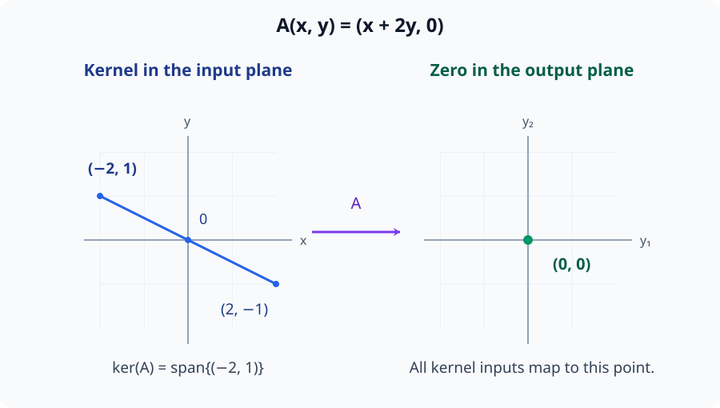
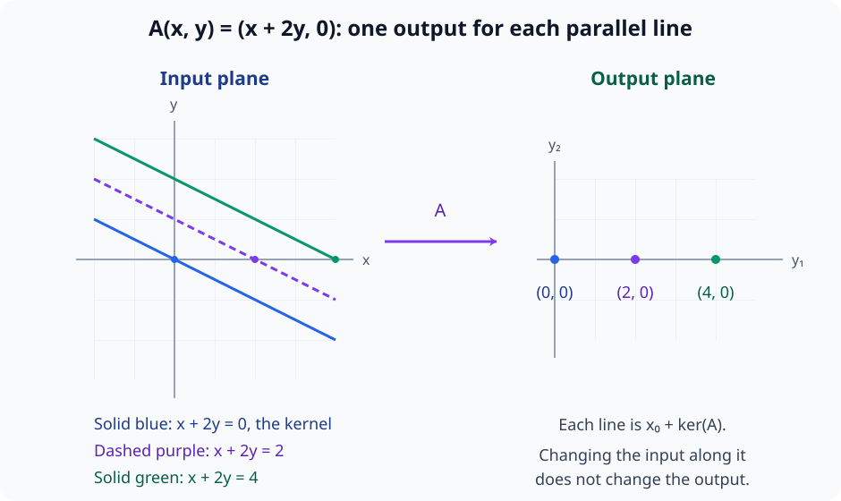
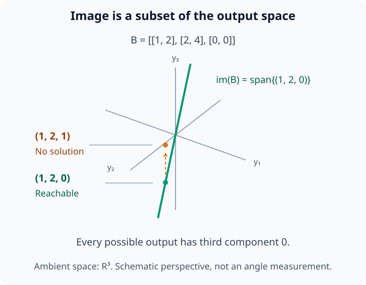
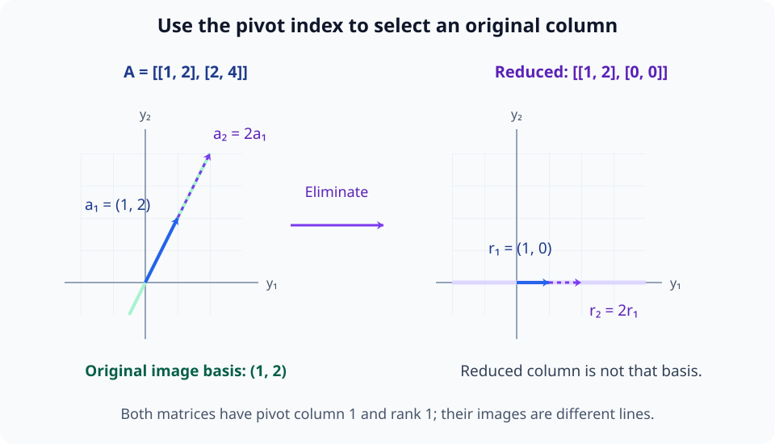
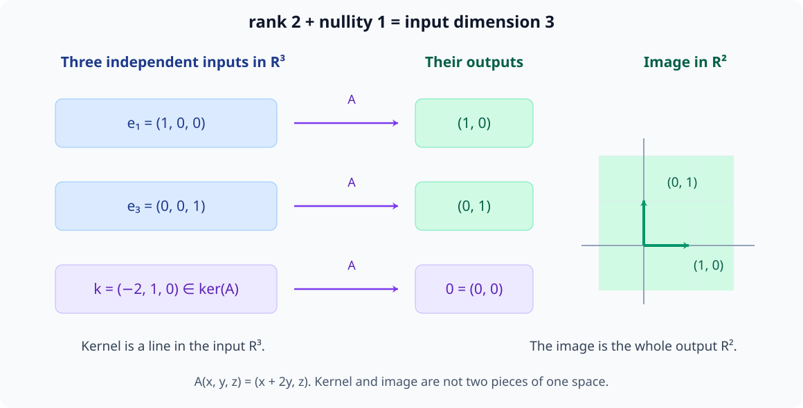

# M02-08. kernel, image와 rank

## 이 단원이 필요한 이유

선형변환은 일부 입력 방향을 영벡터로 보내고, 출력공간의 일부 방향만 만들 수 있다. kernel은 사라지는 입력 방향을 모으며 image는 실제로 만들 수 있는 출력 전체를 모은다. rank는 image에 남은 독립 방향의 수다.

세 개념을 연결하면 연립방정식의 해가 존재하는지, 입력을 출력에서 유일하게 복원할 수 있는지 판단할 수 있다. 신경망 가중치 행렬을 분석할 때도 어떤 표현 방향이 제거되고 출력이 어느 부분공간에 제한되는지 같은 질문을 던질 수 있다.

## 학습 목표

이 단원을 마치면 다음을 할 수 있다.

- 선형변환의 kernel과 image를 집합으로 정의할 수 있다.
- 행렬의 kernel을 동차연립방정식으로 구할 수 있다.
- image를 행렬 열벡터들의 span으로 구할 수 있다.
- pivot 수에서 rank를 구하고 rank-nullity 정리를 적용할 수 있다.
- $\mathbf A\mathbf x=\mathbf b$의 존재성과 유일성을 image와 kernel로 판단할 수 있다.
- weight matrix의 rank에서 직접 말할 수 있는 구조와 모델 행동 주장을 구분할 수 있다.

## 선수지식 확인

- 선수 단원: [M02-05 행렬을 선형변환으로 보기](M02-05-matrix-as-linear-transformation.md)
- 선수 단원: [M02-06 연립방정식과 역행렬](M02-06-linear-systems-inverse.md)
- 선수 단원: [M02-07 선형독립, 기저와 차원](M02-07-linear-independence-basis-dimension.md)
- 확인 질문: 동차연립방정식의 자유변수에서 해집합의 기저를 구할 수 있는가?
- 확인 질문: 행렬 열벡터의 span과 기저를 구분할 수 있는가?

동차연립방정식, span이나 차원이 불분명하면 선수 단원을 먼저 복습한다.

## 기호와 용어

| 기호·용어 | Common spoken reading | 의미 | 조건 |
|---|---|---|---|
| $\ker(T)$ | `the kernel of T` | $T$가 영벡터로 보내는 입력의 집합 | 정의역의 부분공간 |
| $\operatorname{im}(T)$ | `the image of T` | $T$가 실제로 만드는 출력의 집합 | 공역의 부분공간 |
| $\operatorname{rank}(\mathbf A)$ | `the rank of A` | $\mathbf A$의 image 차원 | pivot 수와 같다. |
| $\operatorname{nullity}(\mathbf A)$ | `the nullity of A` | $\mathbf A$의 kernel 차원 | 자유변수 수와 같다. |
| 열공간 | `column space` | 행렬 열벡터들이 생성하는 공간 | $\operatorname{im}(\mathbf A)$와 같다. |

## 핵심 개념 1. kernel은 영벡터로 사라지는 입력을 모은다

$T:\mathbb R^n\to\mathbb R^m$이 선형변환이면

\[
\ker(T)
=
\left\{
\mathbf x\in\mathbb R^n
\;\middle|\;
T(\mathbf x)=\mathbf 0
\right\}
\]

이다.

$T(\mathbf x)=\mathbf A\mathbf x$이면

\[
\ker(\mathbf A)
=
\left\{
\mathbf x\in\mathbb R^n
\;\middle|\;
\mathbf A\mathbf x=\mathbf 0
\right\}
\]

로 쓴다. 동차연립방정식을 풀어 kernel의 벡터를 찾는다.

집합 안의 조건은 출력이 영벡터인지를 검사한다. 이 조건을 통과한 대상은 입력 벡터이므로 kernel은 $\mathbb R^n$ 안에 있다. 입력의 어떤 성분이 0이어야 한다는 뜻은 아니다. 여러 성분의 기여가 상쇄되어 출력 전체가 0이 되는 입력도 포함한다.

선형성에 의해 $T(\mathbf 0)=\mathbf 0$이므로 영벡터는 kernel에 속한다. 두 kernel 벡터 $\mathbf u,\mathbf v$와 실수 $c$에 대해

\[
T(\mathbf u+\mathbf v)=T(\mathbf u)+T(\mathbf v)=\mathbf 0,
\qquad
T(c\mathbf u)=cT(\mathbf u)=\mathbf 0
\]

이다. 따라서 kernel은 벡터 덧셈과 스칼라곱에 닫혀 있는 입력공간의 부분공간이다.

아래 그림은 두 입력 성분의 기여가 상쇄되는 kernel 직선을 입력공간에 그린다. 직선 위 점들의 성분은 서로 다르지만 출력 조건은 모두 같다.

<figure class="lesson-figure lesson-figure--wide" markdown="1">

<figcaption>A(x,y)=(x+2y,0)에서 x+2y=0인 입력들은 모두 영출력을 만든다. kernel은 오른쪽 영점 자체가 아니라 왼쪽 입력 직선 전체이며, 입력 성분이 각각 0일 필요는 없다.</figcaption>
</figure>

## 핵심 개념 2. kernel은 입력 구별 가능성을 결정한다

두 입력 $\mathbf x_1,\mathbf x_2$가 같은 출력으로 간다고 하자.

\[
\mathbf A\mathbf x_1=\mathbf A\mathbf x_2
\]

이면

\[
\mathbf A(\mathbf x_1-\mathbf x_2)=\mathbf 0
\]

이다. 차이 $\mathbf x_1-\mathbf x_2$가 kernel에 속한다.

\[
\ker(\mathbf A)=\{\mathbf 0\}
\]

이면 서로 다른 두 입력이 같은 출력으로 갈 수 없으므로 변환은 일대일이다. 반대로 $\mathbf z\ne\mathbf 0$이 kernel에 속하면

\[
\mathbf A(\mathbf x+\mathbf z)
=\mathbf A\mathbf x+\mathbf A\mathbf z
=\mathbf A\mathbf x
\]

이다. $\mathbf x$와 $\mathbf x+\mathbf z$는 다른 입력이지만 출력은 같다. kernel의 모든 배수도 kernel에 속하므로 이 방향으로 얼마를 이동하든 출력이 유지된다.

아래 그림은 kernel에 평행한 서로 다른 입력 직선을 비교한다. 한 직선 안에서는 입력을 움직여도 출력이 고정되고, 다른 직선으로 옮기면 출력이 달라진다.

<figure class="lesson-figure lesson-figure--wide" markdown="1">

<figcaption>각 입력 직선은 한 특정 입력 x₀에 kernel의 벡터들을 더한 집합이다. 같은 직선 위의 입력 차이는 kernel에 속하므로 출력에서 구별되지 않으며, 색과 선 모양이 같은 출력 대응을 나타낸다.</figcaption>
</figure>

## 핵심 개념 3. image는 가능한 출력을 모은다

선형변환 $T$의 상(image)은

\[
\operatorname{im}(T)
=
\left\{
T(\mathbf x)
\;\middle|\;
\mathbf x\in\mathbb R^n
\right\}
\]

이다.

$\mathbf A$의 열을 $\mathbf a_1,\ldots,\mathbf a_n$이라고 하면

\[
\mathbf A\mathbf x
=
x_1\mathbf a_1+\cdots+x_n\mathbf a_n
\]

이므로

\[
\operatorname{im}(\mathbf A)
=
\operatorname{span}\{\mathbf a_1,\ldots,\mathbf a_n\}
\]

이다. 한쪽으로는 모든 출력이 열벡터의 선형결합이다. 다른 쪽으로는 열벡터의 선형결합에서 사용한 계수를 입력 $\mathbf x$의 성분으로 선택하면 그 결합이 실제 출력이 된다. 두 집합이 같다는 것은 이 두 방향을 모두 포함한다.

image는 행렬의 열공간이며 공역 $\mathbb R^m$의 부분공간이다. kernel에서처럼 입력을 모으는 것이 아니라, 입력을 바꾸어 도달할 수 있는 출력을 모은다. 공역의 벡터라고 해서 모두 image에 속하는 것은 아니며, 해당 벡터를 출력으로 만드는 입력이 있어야 한다.

아래 그림은 예제 3의 image를 출력공간 안에 그린다. 목표 벡터가 공역에 포함된다는 사실과 실제 출력으로 만들 수 있다는 사실은 다르다.

<figure class="lesson-figure lesson-figure--wide" markdown="1">

<figcaption>B의 두 열은 (1,2,0)의 배수이므로 image는 초록색 직선이다. 목표 (1,2,1)은 같은 공역 R³에 있지만 셋째 성분이 1이어서 그 직선에 속하지 않으며, 이 목표를 만드는 입력은 없다.</figcaption>
</figure>

## 핵심 개념 4. rank는 살아남은 출력 방향의 수다

행렬의 rank는 image의 차원이다.

\[
\operatorname{rank}(\mathbf A)
=
\dim\operatorname{im}(\mathbf A)
\]

image의 기저를 찾으려면 열 중에서 서로 독립이면서 나머지 열을 생성하는 벡터들을 골라야 한다. 행 소거를 한 행 사다리꼴에서는 pivot 열들이 서로 다른 선도 위치를 가져 독립이다. 나머지 열은 pivot 열의 선형결합으로 만들 수 있다. 아래쪽 pivot 행부터 계수를 맞추어 올라가면 각 비영 행의 성분을 맞출 수 있고, 영 행에서는 맞출 성분이 남지 않는다. 따라서 pivot 열의 수가 rank다.

행 기본변환은 되돌릴 수 있으므로 열 사이의 선형결합 관계를 보존한다. 원래 행렬의 열들이 어떤 계수로 합쳐져 영벡터가 되는지는 소거 뒤에도 같다. 따라서 원래 행렬에서 pivot 열에 해당하는 열벡터들을 고르면 원래 열공간의 기저를 얻는다.

다만 소거된 열벡터 자체를 원래 image의 기저로 사용하면 안 된다. 행 기본변환은 열의 성분, 즉 출력 벡터의 좌표를 바꾼다. 독립 방향의 수와 열 사이의 관계는 같아도 실제 image가 같은 집합일 필요는 없다.

$\mathbf A\in\mathbb R^{m\times n}$이면

\[
\operatorname{rank}(\mathbf A)
\le
\min(m,n)
\]

이다. 출력이 $\mathbb R^m$에 있으므로 독립 출력 방향은 $m$개를 넘을 수 없다. 또한 $n$개의 열이 생성하는 공간이므로 독립 열 방향은 $n$개를 넘을 수 없다.

아래 그림은 행 소거가 열 사이의 배수 관계는 보존해도 image의 위치까지 보존하지는 않음을 보여 준다. pivot의 열 번호를 찾은 다음에는 원래 행렬의 해당 열로 돌아가야 한다.

<figure class="lesson-figure lesson-figure--wide" markdown="1">

<figcaption>두 행렬 모두 둘째 열이 첫째 열의 2배이고 pivot 열은 첫째 열이다. 그러나 소거 뒤의 image는 수평선으로 바뀌므로, 원래 image의 기저는 소거된 (1,0)이 아니라 원래 첫 열 (1,2)에서 골라야 한다.</figcaption>
</figure>

## 핵심 개념 5. rank-nullity 정리는 남은 방향과 사라진 방향을 센다

nullity는 kernel의 차원이다.

\[
\operatorname{nullity}(\mathbf A)
=
\dim\ker(\mathbf A)
\]

$\mathbf A\in\mathbb R^{m\times n}$에 대해

\[
\operatorname{rank}(\mathbf A)
+
\operatorname{nullity}(\mathbf A)
=
n
\]

이다. 입력공간의 dimension $n$은 image에 독립적으로 남은 방향 수와 kernel로 사라진 방향 수의 합이다.

이 차원 관계는 동차연립방정식의 자유변수에서 확인할 수 있다. 자유변수의 값을 먼저 정하면 pivot 변수는 역대입으로 정해진다. 자유변수 하나만 1이고 나머지는 0인 해를 각각 만들면, 임의의 해는 이 해들의 선형결합이다. 또한 이 해들의 자유변수 성분을 보면 서로 독립임을 확인할 수 있다. 따라서 자유변수 수가 kernel의 기저 벡터 수, 즉 nullity다.

rank는 pivot 변수 수다. 전체 미지수 $n$개는 pivot 변수와 자유변수로 나뉘므로 두 수의 합이 $n$이 된다. 이 식은 입력공간의 차원과 출력 image의 차원을 연결한다. kernel과 image가 같은 공간 안의 두 부분이라는 뜻은 아니다. kernel은 $\mathbb R^n$에, image는 $\mathbb R^m$에 놓인다.

아래 그림은 예제 1의 입력공간에서 서로 독립인 세 방향을 고르고 각 출력을 비교한다. 사라지는 방향과 살아남는 방향의 수를 세되, kernel과 image가 놓인 공간을 구분한다.

<figure class="lesson-figure lesson-figure--wide" markdown="1">

<figcaption>입력 e₁과 e₃는 출력의 두 독립 방향으로 가고, 입력 (−2,1,0)은 영출력으로 간다. rank 2와 nullity 1의 합은 입력 차원 3이며, 출력 전체에 도달하더라도 이 비영 kernel 방향 때문에 입력 복원은 유일하지 않다.</figcaption>
</figure>

## 핵심 개념 6. image는 해의 존재를, kernel은 유일성을 결정한다

\[
\mathbf A\mathbf x=\mathbf b
\]

에 해가 존재할 필요충분조건은

\[
\mathbf b\in\operatorname{im}(\mathbf A)
\]

이다. image가 가능한 출력 전체이기 때문이다.

한 해 $\mathbf x_0$가 있다고 하자. 모든 해는

\[
\mathbf x
=
\mathbf x_0+\mathbf z,
\qquad
\mathbf z\in\ker(\mathbf A)
\]

형태다. 실제로

\[
\mathbf A(\mathbf x_0+\mathbf z)
=
\mathbf b+\mathbf 0
=
\mathbf b
\]

이다. 반대로 어떤 해 $\mathbf x$를 골라도

\[
\mathbf A(\mathbf x-\mathbf x_0)
=\mathbf b-\mathbf b
=\mathbf 0
\]

이므로 $\mathbf x-\mathbf x_0$는 kernel에 속한다. kernel 벡터를 더해 만든 것이 해라는 사실과, 모든 해를 그렇게 쓸 수 있다는 사실이 함께 성립한다.

따라서 kernel이 $\{\mathbf 0\}$이면 존재하는 해가 유일하다. kernel에 0이 아닌 벡터가 있으면 한 해에 kernel 벡터를 더해 다른 해를 만들 수 있다.

## 핵심 개념 7. 가역성은 kernel, image와 rank로 판정할 수 있다

정사각행렬 $\mathbf A\in\mathbb R^{n\times n}$에 대해 다음 조건들은 서로 동치다.

- $\mathbf A$가 가역이다.
- $\ker(\mathbf A)=\{\mathbf 0\}$이다.
- $\operatorname{im}(\mathbf A)=\mathbb R^n$이다.
- $\operatorname{rank}(\mathbf A)=n$이다.
- 모든 $\mathbf b\in\mathbb R^n$에 대해 $\mathbf A\mathbf x=\mathbf b$의 해가 하나다.

rank-nullity 정리에서 rank가 $n$이면 nullity는 0이다. kernel은 영벡터만 포함하고, 모든 열이 독립이다. 정사각행렬에서는 출력공간의 차원도 $n$이므로 이 $n$개의 독립 열이 출력공간 전체의 기저가 된다. 따라서 모든 목표 출력에 해가 존재하고 그 해는 유일하다. M02-06의 역행렬은 각 출력을 이 유일한 입력으로 되돌리는 변환이다.

직사각행렬에서는 입력 차원 $n$과 출력 차원 $m$이 다를 수 있어 두 조건이 갈린다. $\operatorname{rank}(\mathbf A)=n$이면 nullity가 0이어서 일대일이다. $\operatorname{rank}(\mathbf A)=m$이면 image가 $\mathbb R^m$ 전체다. 예를 들어 $m<n$이면 rank가 최대 $m$이므로 nullity는 적어도 $n-m$이다. 모든 출력을 만들 수 있더라도 입력을 유일하게 복원하지 못할 수 있다.

## 예제 1. kernel, image와 rank를 함께 구하기

\[
\mathbf A=
\begin{bmatrix}
1&2&0\\
0&0&1
\end{bmatrix}
\]

라고 하자. kernel을 구하려면

\[
\begin{bmatrix}
1&2&0\\
0&0&1
\end{bmatrix}
\begin{bmatrix}x\\y\\z\end{bmatrix}
=
\begin{bmatrix}0\\0\end{bmatrix}
\]

을 푼다. 방정식은

\[
x+2y=0,
\qquad
z=0
\]

이다. $y=t$로 두면

\[
\begin{bmatrix}x\\y\\z\end{bmatrix}
=
t
\begin{bmatrix}-2\\1\\0\end{bmatrix}
\]

이므로

\[
\ker(\mathbf A)
=
\operatorname{span}
\left\{
\begin{bmatrix}-2\\1\\0\end{bmatrix}
\right\}
\]

이고 nullity는 1이다.

첫째 열과 셋째 열이 독립이며 둘째 열은 첫째 열의 2배다. 따라서

\[
\operatorname{im}(\mathbf A)
=
\operatorname{span}
\left\{
\begin{bmatrix}1\\0\end{bmatrix},
\begin{bmatrix}0\\1\end{bmatrix}
\right\}
=
\mathbb R^2
\]

이고 rank는 2다. rank-nullity 식은 $2+1=3$이다.

## 예제 2. 해집합을 특정 해와 kernel로 쓰기

예제 1의 행렬에 대해

\[
\mathbf A\mathbf x
=
\begin{bmatrix}5\\3\end{bmatrix}
\]

을 풀면

\[
x+2y=5,
\qquad
z=3
\]

이다. 한 해는

\[
\mathbf x_0=
\begin{bmatrix}5\\0\\3\end{bmatrix}
\]

이다. 모든 해는

\[
\mathbf x
=
\begin{bmatrix}5\\0\\3\end{bmatrix}
+
t
\begin{bmatrix}-2\\1\\0\end{bmatrix},
\qquad
t\in\mathbb R
\]

이다. kernel 방향으로 입력을 바꿔도 출력이 유지된다.

## 예제 3. image 밖의 목표는 만들 수 없다

\[
\mathbf B=
\begin{bmatrix}
1&2\\
2&4\\
0&0
\end{bmatrix}
\]

의 두 열은 모두

\[
\begin{bmatrix}1\\2\\0\end{bmatrix}
\]

의 배수다. 따라서

\[
\operatorname{im}(\mathbf B)
=
\operatorname{span}
\left\{
\begin{bmatrix}1\\2\\0\end{bmatrix}
\right\}
\]

이고 rank는 1이다.

\[
\mathbf b=
\begin{bmatrix}1\\2\\1\end{bmatrix}
\]

는 셋째 성분이 1이므로 이 image에 속하지 않는다. 따라서 $\mathbf B\mathbf x=\mathbf b$에는 해가 없다.

## 예제 4. 신경망 가중치의 kernel과 image

\[
\mathbf W\in\mathbb R^{64\times128}
\]

이면

\[
\operatorname{rank}(\mathbf W)\le64
\]

이고 rank-nullity 정리에 따라

\[
\operatorname{nullity}(\mathbf W)
=
128-\operatorname{rank}(\mathbf W)
\ge64
\]

이다. 적어도 64개의 독립 입력 방향이 선형 부분에서 영벡터로 간다.

이 결론은 $\mathbf W$라는 선형변환의 구조를 말한다. 실제 데이터가 kernel 방향으로 변하는지, 편향과 비선형함수 뒤에서 행동이 어떻게 달라지는지, 모델이 특정 방향을 기능적으로 사용하는지는 별도 분석이 필요하다.

## 흔한 오해

### 오해 1. kernel은 행렬의 값이 작은 원소를 모은 집합이다

kernel은 원소 크기가 아니라 $\mathbf A\mathbf x=\mathbf 0$을 만족하는 입력 벡터의 집합이다.

### 오해 2. image는 공역과 같다

image는 변환이 실제로 도달하는 출력만 포함한다. rank가 출력 dimension보다 작으면 image는 공역의 진부분공간이다.

### 오해 3. rank는 0이 아닌 열의 개수다

0이 아닌 열들도 서로 종속일 수 있다. rank는 독립인 열 방향의 수이며 pivot 수로 계산한다.

### 오해 4. 낮은 rank가 곧 모델 성능 저하를 뜻한다

낮은 rank는 선형변환의 출력 방향 수가 제한됨을 뜻한다. 성능 영향은 데이터 분포, 뒤의 계산과 과제에 따라 달라지므로 행동 평가가 필요하다.

## 연습문제

### 1. kernel 구하기

\[
\mathbf A=
\begin{bmatrix}
1&1&0\\
0&1&1
\end{bmatrix}
\]

의 kernel 기저와 nullity를 구하라.

해설 보기

\[
x+y=0,
\qquad
y+z=0
\]

이다. $y=t$로 두면 $x=-t$, $z=-t$이므로

\[
\begin{bmatrix}x\\y\\z\end{bmatrix}
=
t
\begin{bmatrix}-1\\1\\-1\end{bmatrix}
\]

이다. 따라서

\[
\ker(\mathbf A)
=
\operatorname{span}
\left\{
\begin{bmatrix}-1\\1\\-1\end{bmatrix}
\right\}
\]

이고 nullity는 1이다.

### 2. image와 rank 구하기

문제 1의 행렬에서 image의 기저와 rank를 구하라.

해설 보기

열벡터는

\[
\mathbf a_1=
\begin{bmatrix}1\\0\end{bmatrix},
\quad
\mathbf a_2=
\begin{bmatrix}1\\1\end{bmatrix},
\quad
\mathbf a_3=
\begin{bmatrix}0\\1\end{bmatrix}
\]

이다. $\mathbf a_1$과 $\mathbf a_2$는 독립이며 $\mathbf a_3=\mathbf a_2-\mathbf a_1$이다. 따라서 image의 한 기저는 $(\mathbf a_1,\mathbf a_2)$이고 rank는 2다.

### 3. rank-nullity 확인

문제 1의 행렬에 대해 rank-nullity 정리를 확인하라.

해설 보기

입력 dimension은 열 수 3이다. 문제 1에서 nullity는 1이고 문제 2에서 rank는 2이므로

\[
\operatorname{rank}(\mathbf A)
+
\operatorname{nullity}(\mathbf A)
=
2+1
=
3
\]

이다.

### 4. 해의 존재성

\[
\mathbf B=
\begin{bmatrix}
1&2\\
2&4\\
3&6
\end{bmatrix}
\]

에 대해 다음 두 벡터가 $\operatorname{im}(\mathbf B)$에 속하는지 판단하라.

\[
\mathbf b_1=
\begin{bmatrix}2\\4\\6\end{bmatrix},
\qquad
\mathbf b_2=
\begin{bmatrix}1\\2\\4\end{bmatrix}
\]

해설 보기

$\mathbf B$의 image는

\[
\operatorname{span}
\left\{
\begin{bmatrix}1\\2\\3\end{bmatrix}
\right\}
\]

이다. $\mathbf b_1$은 이 생성 벡터의 2배이므로 image에 속한다. $\mathbf b_2$는 첫 성분에 맞춘 계수가 1이지만 셋째 성분이 3이 아니라 4이므로 image에 속하지 않는다.

따라서 $\mathbf B\mathbf x=\mathbf b_1$에는 해가 있고, $\mathbf B\mathbf x=\mathbf b_2$에는 해가 없다.

### 5. 해의 유일성

$\mathbf A\mathbf x=\mathbf b$에 한 해 $\mathbf x_0$가 있고

\[
\ker(\mathbf A)
=
\operatorname{span}\{\mathbf z_1,\mathbf z_2\}
\]

라고 하자. 모든 해를 쓰고 해가 유일한지 판단하라.

해설 보기

모든 해는

\[
\mathbf x
=
\mathbf x_0+s\mathbf z_1+t\mathbf z_2,
\qquad
s,t\in\mathbb R
\]

이다. kernel에 독립 방향 두 개가 있으므로 계수 $s,t$를 바꾸어 여러 해를 만들 수 있다. 해는 유일하지 않다.

### 6. 가역성 판정

\[
\mathbf C=
\begin{bmatrix}
1&0&2\\
0&1&-1\\
0&0&3
\end{bmatrix}
\]

의 rank를 구하고 가역성을 판단하라.

해설 보기

세 행과 세 열에 pivot이 하나씩 있으므로

\[
\operatorname{rank}(\mathbf C)=3
\]

이다. $\mathbf C$는 $3\times3$ 정사각행렬이며 rank가 3이므로 kernel은 $\{\mathbf 0\}$이고 image는 $\mathbb R^3$다. 따라서 가역이다.

### 7. 모델 해석 주장 비판

가중치 행렬 $\mathbf W$의 rank가 20이고 입력 dimension이 64라고 하자.

1. nullity를 구하라.
2. 선형 부분에서 사라지는 독립 입력 방향 수를 말하라.
3. 이 결과만으로 모델이 20개의 인간 해석 가능한 feature만 사용한다고 결론 내릴 수 있는지 판단하라.

해설 보기

rank-nullity 정리에 따라

\[
\operatorname{nullity}(\mathbf W)
=
64-20
=
44
\]

다. kernel의 차원이 44이므로 선형 부분은 44개의 독립 입력 방향을 영벡터로 보낸다.

rank 20은 image의 독립 방향 수를 말한다. 각 방향이 인간이 이름 붙인 feature와 일대일로 대응하는지, 데이터가 그 방향들을 사용하는지, 뒤의 층이 행동에 활용하는지는 말하지 않는다. feature 해석과 기능적 사용에는 데이터 분석과 개입 실험이 필요하다.

## 단원 요약

- kernel은 영벡터로 가는 입력의 부분공간이며 입력 구별 가능성을 결정한다.
- image는 실제 가능한 출력의 부분공간이며 행렬 열벡터들의 span이다.
- rank는 image의 차원이고 nullity는 kernel의 차원이다.
- rank-nullity 정리는 두 차원의 합이 입력 dimension과 같음을 말한다.
- $\mathbf A\mathbf x=\mathbf b$의 존재성은 $\mathbf b$의 image 소속으로, 유일성은 kernel로 판단한다.
- weight matrix의 rank는 선형 구조를 설명하며 feature 의미나 모델 행동을 직접 입증하지 않는다.

## 통과 기준

다음 질문에 자료를 보지 않고 답할 수 있으면 통과한다.

- kernel과 image를 집합 표기로 정의할 수 있는가?
- 동차연립방정식에서 kernel 기저를 구할 수 있는가?
- 원래 행렬의 pivot 열에서 image 기저를 찾을 수 있는가?
- rank와 nullity를 계산해 정리를 확인할 수 있는가?
- 해의 존재성과 유일성을 image와 kernel로 설명할 수 있는가?
- rank에 관한 대수적 주장과 모델 기능 주장을 구분할 수 있는가?

## 다음 단원

- [M02-09 직교기저와 정사영](M02-09-orthogonal-basis-projection.md)

## 집필자 점검표

- [x] 학습 목표가 관찰 가능한 행동으로 작성됐다.
- [x] kernel과 image를 정의역·공역의 부분공간으로 정의했다.
- [x] image와 열공간의 관계를 설명했다.
- [x] rank-nullity 정리를 pivot과 자유변수로 연결했다.
- [x] 해의 존재성, 유일성과 가역성을 교차 연결했다.
- [x] 모든 문제에 해설이 있다.
- [x] rank와 모델 feature 주장의 범위를 구분했다.
- [x] 용어집과 표기 규칙을 따랐다.
- [x] 내부 링크와 수식 구분자를 확인했다.
- [x] Common spoken reading이 실제 영어 학술 발화이며 한글 음역이나 기계적 직역을 포함하지 않는다.
