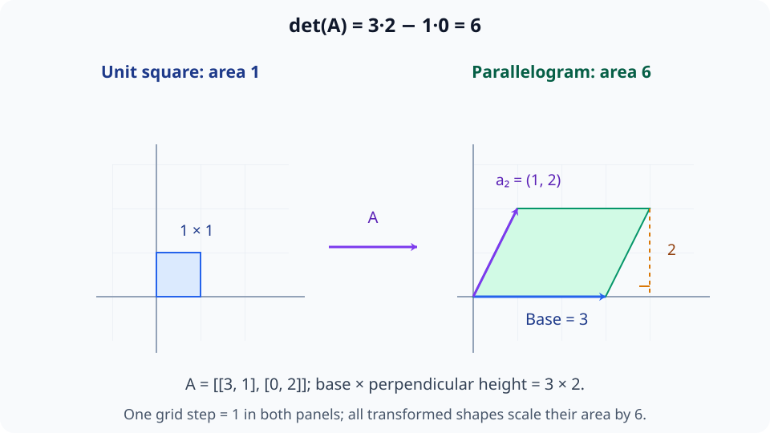
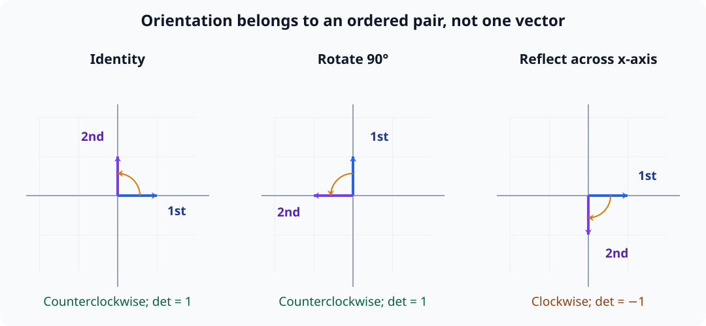
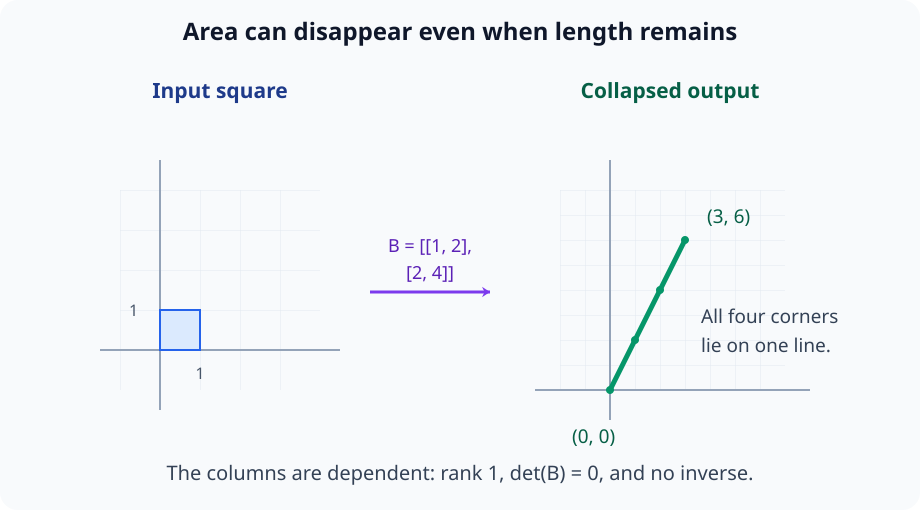
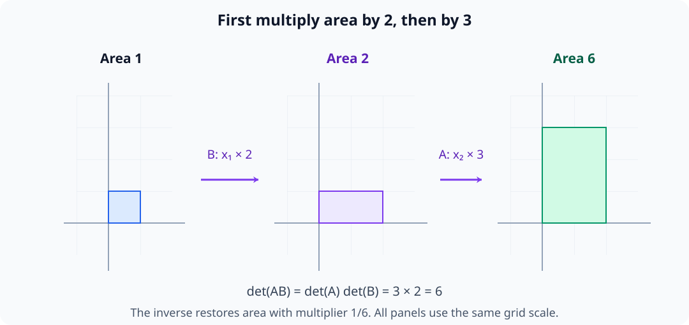
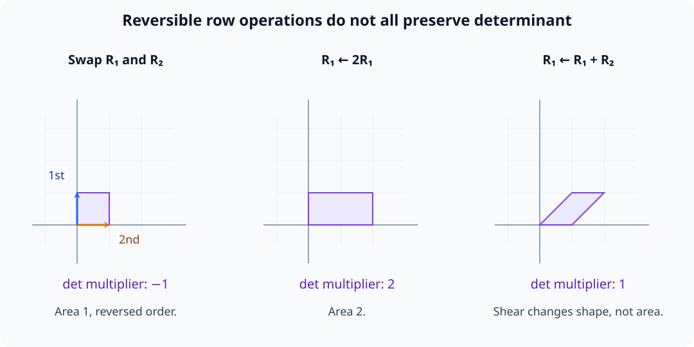
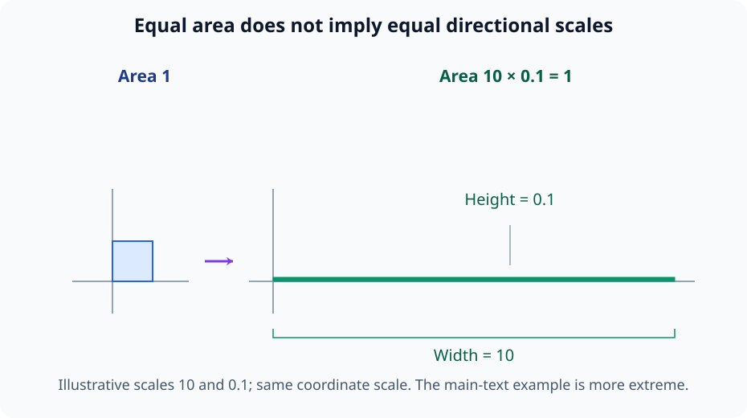

# M02-10. determinant의 최소 이해

## 이 단원이 필요한 이유

determinant는 정사각행렬이 부피를 몇 배로 바꾸는지 나타내는 scalar다. 값이 0이면 어떤 dimension이 납작해져 역변환을 만들 수 없다. 값의 부호는 공간의 방향 순서가 뒤집혔는지를 기록한다.

모델 해석에서 determinant를 자주 직접 계산하지는 않는다. 가역성, 고유값의 특성방정식과 Jacobian의 국소 부피 변화를 읽으려면 뜻을 알아야 한다. 큰 행렬에서 determinant 하나만으로 수치 안정성이나 모델 중요도를 판단해서는 안 된다.

## 학습 목표

이 단원을 마치면 다음을 할 수 있다.

- $2\times2$ determinant를 계산할 수 있다.
- determinant의 절댓값을 면적 또는 부피 배율로 설명할 수 있다.
- determinant의 부호와 방향 순서의 반전을 연결할 수 있다.
- determinant가 0인 경우와 가역성, rank를 연결할 수 있다.
- 곱, 역행렬과 행 기본변환에서 determinant가 어떻게 변하는지 계산할 수 있다.
- determinant의 크기만으로 수치 안정성이나 모델 기능을 단정할 수 없는 이유를 설명할 수 있다.

## 선수지식 확인

- 선수 단원: [M02-05 행렬을 선형변환으로 보기](M02-05-matrix-as-linear-transformation.md)
- 선수 단원: [M02-06 연립방정식과 역행렬](M02-06-linear-systems-inverse.md)
- 선수 단원: [M02-08 kernel, image와 rank](M02-08-kernel-image-rank.md)
- 확인 질문: 가역행렬, 특이행렬과 full rank 정사각행렬의 관계를 설명할 수 있는가?
- 확인 질문: 행렬의 열벡터가 만드는 평행사변형을 그릴 수 있는가?

가역성이나 rank가 불분명하면 선수 단원을 먼저 복습한다.

## 기호와 용어

| 기호·용어 | Common spoken reading | 의미 | 조건 |
|---|---|---|---|
| $\det(\mathbf A)$ | `the determinant of A` | 정사각행렬의 방향 있는 부피 배율 | scalar |
| $\lvert\det(\mathbf A)\rvert$ | `the absolute value of the determinant of A` | 부호를 제외한 부피 배율 | 0 이상 |
| 방향 순서 | `orientation` | 기저의 축 순서가 오른손·왼손 방식 중 어느 쪽인지 나타내는 성질 | determinant 부호와 연결 |
| 삼각행렬 | `triangular matrix` | 대각선 한쪽이 모두 0인 정사각행렬 | determinant는 대각 원소의 곱 |

## 핵심 개념 1. $2\times2$ determinant는 교차곱의 차다

\[
\mathbf A=
\begin{bmatrix}
a&b\\
c&d
\end{bmatrix}
\]

이면

\[
\det(\mathbf A)
=
ad-bc
\]

이다.

이 값은 $\mathbf A$의 두 열벡터가 만드는 평행사변형의 방향 있는 면적이다. 실제 면적은

\[
|\det(\mathbf A)|
\]

이다. 두 열 $\mathbf u=(a,c)^\top$, $\mathbf v=(b,d)^\top$를 평행사변형의 모서리로 보면 이 공식과 밑변·높이를 연결할 수 있다. $\mathbf u\ne\mathbf 0$일 때 밑변 길이는 $\sqrt{a^2+c^2}$다. $\mathbf u$에 수직인 단위벡터는

\[
\frac{1}{\sqrt{a^2+c^2}}
\begin{bmatrix}-c\\a\end{bmatrix}
\]

로 잡을 수 있다. 이 벡터와 $\mathbf v$의 내적은 $(ad-bc)/\sqrt{a^2+c^2}$다. 그 절댓값은 둘째 모서리의 수직 성분 길이, 즉 높이다. 밑변과 높이를 곱하면 $\sqrt{a^2+c^2}$가 약분되어 $|ad-bc|$를 얻는다. 첫째 열이 영벡터인 경우에는 밑변과 면적이 0이고 공식도 0을 준다.

## 핵심 개념 2. determinant의 절댓값은 부피 배율이다

정사각행렬 $\mathbf A\in\mathbb R^{n\times n}$이 단위 정육면체를 변환하면 평행다포체가 된다. 변환 뒤 $n$차원 부피는 원래 부피의

\[
|\det(\mathbf A)|
\]

배다. 2차원에서 단위 정사각형의 점은 $s\mathbf e_1+t\mathbf e_2$로 쓰며 $s,t$는 0과 1 사이에 있다. 두 열을 $\mathbf a_1,\mathbf a_2$라고 하면 변환 뒤의 점은 $s\mathbf a_1+t\mathbf a_2$다. 이 점들은 두 열벡터를 모서리로 하는 평행사변형을 채운다. 원래 면적이 1이므로 변환 뒤 면적 $|\det(\mathbf A)|$가 곧 배율이다. 고차원에서도 각 열을 모서리로 하는 도형의 부피로 같은 관계를 읽는다.

이 배율은 단위 도형에서만 쓰는 값이 아니다. 같은 선형변환을 적용한 도형의 부피는 원래 부피에 $|\det(\mathbf A)|$를 곱한 값이다. 이동에 따라 배율이 바뀌지 않는 선형변환의 성질이다.

- $|\det(\mathbf A)|>1$이면 부피가 늘어난다.
- $0<|\det(\mathbf A)|<1$이면 부피가 줄어든다.
- $\det(\mathbf A)=0$이면 부피가 0이 되어 낮은 차원으로 납작해진다.

determinant는 전체 부피 배율 하나를 요약한다. 각 방향이 얼마나 늘거나 줄었는지는 따로 보여 주지 않는다.

아래 그림은 예제 1의 두 열을 모서리로 삼아 단위 정사각형의 변환 전후를 비교한다. 밑변에 수직인 높이를 사용하면 면적이 determinant 절댓값과 연결된다.

<figure class="lesson-figure lesson-figure--wide" markdown="1">

<figcaption>첫 열 (3,0)은 밑변을, 둘째 열 (1,2)은 기울어진 다른 모서리를 만든다. 높이는 둘째 모서리의 길이가 아니라 수직 성분 2이므로 면적은 3×2=6이며, 원래 면적 1에 대한 배율도 6이다.</figcaption>
</figure>

## 핵심 개념 3. 부호는 방향 순서의 반전을 기록한다

$\det(\mathbf A)>0$이면 변환이 기저의 방향 순서를 보존하고, $\det(\mathbf A)<0$이면 방향 순서를 뒤집는다.

2차원에서는 순서 있는 두 열벡터로 이 말을 읽을 수 있다. 표준기저는 첫째 벡터 $\mathbf e_1$에서 둘째 벡터 $\mathbf e_2$로 반시계 방향으로 돈다. 독립인 두 열에서도 첫째 열에서 둘째 열로 가는 더 작은 회전이 반시계 방향이면 determinant가 양수이고, 시계 방향이면 음수다. 두 열의 순서를 바꾸면 회전 방향도 바뀌어 determinant의 부호가 바뀐다.

여기서 방향 순서는 벡터 하나가 어느 쪽을 향하는지와 다른 정보다. 두 벡터를 함께 회전해도 이 순서는 유지될 수 있다. determinant가 0이면 열들이 독립인 방향을 만들지 못하므로 보존·반전을 부호로 구분하지 않는다.

예를 들어 $x$축 반사행렬

\[
\mathbf R=
\begin{bmatrix}
1&0\\
0&-1
\end{bmatrix}
\]

은

\[
\det(\mathbf R)=-1
\]

이다. 면적은 유지하지만 방향 순서를 한 번 뒤집는다.

$90^\circ$ 회전행렬은 determinant가 1이다. 면적과 방향 순서를 모두 보존한다.

아래 그림은 첫째 기저 방향에서 둘째 기저 방향으로 가는 순서를 표시한다. 회전은 두 방향을 함께 옮기고 반사는 그 순서를 뒤집는다.

<figure class="lesson-figure lesson-figure--wide" markdown="1">

<figcaption>항등변환과 90도 회전에서는 첫 방향에서 둘째 방향으로 반시계 순서가 유지된다. x축 반사는 이를 시계 순서로 바꾸며, 면적은 같아도 determinant 부호가 음수가 된다.</figcaption>
</figure>

## 핵심 개념 4. determinant 0은 가역성 상실을 뜻한다

정사각행렬 $\mathbf A\in\mathbb R^{n\times n}$에 대해 다음 조건들은 서로 동치다.

\[
\det(\mathbf A)\ne0
\]

\[
\mathbf A\text{가 가역이다}
\]

\[
\operatorname{rank}(\mathbf A)=n
\]

\[
\ker(\mathbf A)=\{\mathbf 0\}
\]

독립인 $n$개의 열은 $n$차원 부피를 가진 도형을 만든다. 열이 종속이면 모든 모서리가 더 낮은 차원의 부분공간에 놓여 $n$차원 부피는 0이다. 그 낮은 차원 안에서 길이나 면적이 남아 있어도 $n$차원 부피는 없다.

열의 종속 관계에서 0이 아닌 계수벡터를 $\mathbf z$로 모으면 $\mathbf A\mathbf z=\mathbf 0$이다. 따라서 kernel에 0이 아닌 입력 방향이 있다. M02-08에서 본 것처럼 이 방향으로 다른 입력들이 같은 출력에 도달하므로 역변환을 만들 수 없다. 반대로 열이 독립이면 rank가 $n$이고 가역이다. 부피의 소실과 입력 구별의 실패가 같은 열의 종속성을 나타낸다.

아래 그림은 예제 2에서 정사각형의 네 꼭짓점이 한 직선으로 보내지는 모습을 그린다. 선분이 남는 것과 2차원 면적이 남는 것은 다르다.

<figure class="lesson-figure lesson-figure--wide" markdown="1">

<figcaption>두 열이 같은 방향의 배수라서 두 모서리가 독립인 면적을 만들지 못한다. 변환 뒤 길이는 남아 있지만 면적은 0이고, 이는 rank 부족과 역행렬 부재에 해당한다.</figcaption>
</figure>

## 핵심 개념 5. 합성변환의 부피 배율은 곱해진다

같은 크기의 정사각행렬에 대해

\[
\det(\mathbf A\mathbf B)
=
\det(\mathbf A)\det(\mathbf B)
\]

이다. $\mathbf A\mathbf B$에서는 $\mathbf B$를 먼저 적용한다. 보통의 부피는 먼저 $|\det(\mathbf B)|$배, 다시 $|\det(\mathbf A)|$배가 된다. 방향 순서까지 포함한 배율은 부호 있는 determinant로 곱한다. 한 변환만 순서를 뒤집으면 결과도 반전되고, 둘 다 뒤집으면 두 음수의 곱처럼 순서가 보존된다. 어느 변환의 determinant가 0이면 전체 부피도 0이다.

$\mathbf A$가 가역이면

\[
\det(\mathbf A^{-1})
=
\frac{1}{\det(\mathbf A)}
\]

이다. 실제로

\[
1
=
\det(\mathbf I)
=
\det(\mathbf A\mathbf A^{-1})
=
\det(\mathbf A)\det(\mathbf A^{-1})
\]

이다.

아래 그림은 같은 좌표 척도에서 가로 확대와 세로 확대를 차례로 적용한다. 두 단계의 면적 배율은 서로 더하지 않고 곱한다.

<figure class="lesson-figure lesson-figure--wide" markdown="1">

<figcaption>가로를 2배 늘린 뒤 세로를 3배 늘리면 면적은 1→2→6으로 변한다. 전체 determinant는 3×2이며, 역변환은 전체 면적에 1/6을 곱해 원래 크기로 되돌린다.</figcaption>
</figure>

## 핵심 개념 6. 행 기본변환의 효과를 추적할 수 있다

정사각행렬의 행에 기본변환을 적용하면 determinant는 다음과 같이 변한다.

1. 두 행을 맞바꾸면 부호가 바뀐다.
2. 한 행에 0이 아닌 scalar $c$를 곱하면 determinant도 $c$배 된다.
3. 한 행에 다른 행의 scalar배를 더하면 determinant는 바뀌지 않는다.

행 연산은 출력 좌표에 기본변환을 적용하는 것으로도 읽을 수 있다. 두 행 교환은 두 출력 축의 교환, 한 행의 배율 변경은 한 출력 좌표의 확대·축소다. 다른 행의 배수를 더하는 연산은 한 좌표를 다른 좌표에 따라 밀어내는 전단이며 부피를 유지한다. M02-06에서 세 연산은 모두 되돌릴 수 있었지만, determinant 값까지 모두 보존하는 것은 아니다.

이 규칙으로 행렬을 삼각행렬로 바꾸면 determinant를 계산할 수 있다. 삼각행렬에서는

\[
\det(\mathbf U)
=
\prod_{i=1}^{n}u_{ii}
\]

이다. $2\times2$ 위삼각행렬에서는 $c=0$이므로 $ad-bc=ad$가 되어 대각 원소의 곱만 남는다. 고차원 삼각행렬도 대각 원소의 곱을 사용한다. 소거로 얻은 삼각행렬 $\mathbf U$의 determinant가 원래 determinant와 같은지는 행 연산 기록으로 판단한다.

행을 $s$번 교환하고, 행에 곱한 모든 비영 배율의 곱을 $p$라고 하면

\[
\det(\mathbf U)=(-1)^s p\det(\mathbf A)
\]

이다. 행 배율 변경을 하지 않았다면 $p=1$이다. 원래 determinant를 구할 때는 $\det(\mathbf U)$를 $(-1)^s p$로 나누어 행 연산의 효과를 되돌린다. 다른 행의 배수를 더한 횟수는 이 배율에 영향을 주지 않는다.

아래 그림은 항등행렬의 행에 세 기본변환을 각각 따로 적용한 도형이다. 같은 가역 연산이어도 면적과 방향 순서에 미치는 효과는 다르다.

<figure class="lesson-figure lesson-figure--wide" markdown="1">

<figcaption>행 교환은 축의 순서를 바꿔 부호를 뒤집고, 한 행의 2배 확대는 면적을 2배 만든다. 행에 다른 행을 더하는 전단은 모양을 기울이지만 면적과 방향 순서를 유지한다.</figcaption>
</figure>

## 핵심 개념 7. determinant 하나는 방향별 민감도를 보여 주지 않는다

\[
\mathbf A=
\begin{bmatrix}
1000&0\\
0&0.001
\end{bmatrix}
\]

이면

\[
\det(\mathbf A)=1
\]

이다. 면적은 유지되지만 첫 방향은 1000배 늘고 둘째 방향은 1000분의 1로 줄어든다. 역변환은 둘째 출력 방향의 작은 오차를 크게 확대할 수 있다.

따라서 $|\det(\mathbf A)|$가 1에 가깝다는 사실은 수치 안정성을 보장하지 않는다. 방향별 증폭은 singular value와 condition number로 조사하며 M02-13과 M02-15에서 다룬다.

아래 그림은 같은 현상을 화면에서 구분할 수 있도록 배율을 10과 0.1로 완화해 그린다. 본문의 1000과 0.001에서도 면적 보존과 방향별 배율 차이의 관계는 같다.

<figure class="lesson-figure lesson-figure--wide" markdown="1">

<figcaption>같은 좌표 척도에서 가로 10, 세로 0.1인 얇은 직사각형의 면적도 1이다. 전체 면적 하나만으로는 한 방향의 확대와 다른 방향의 축소를 알아볼 수 없다.</figcaption>
</figure>

## 예제 1. 면적 배율 계산

\[
\mathbf A=
\begin{bmatrix}
3&1\\
0&2
\end{bmatrix}
\]

이면

\[
\det(\mathbf A)
=
3\cdot2-1\cdot0
=
6
\]

이다. 단위 정사각형은 면적 6인 평행사변형으로 간다. 부호가 양수이므로 방향 순서도 보존된다.

## 예제 2. 납작해지는 변환

\[
\mathbf B=
\begin{bmatrix}
1&2\\
2&4
\end{bmatrix}
\]

이면

\[
\det(\mathbf B)
=
1\cdot4-2\cdot2
=
0
\]

이다. 두 번째 열이 첫 번째 열의 2배이므로 두 독립 방향이 한 직선으로 겹친다. rank는 1이고 역행렬은 없다.

## 예제 3. 합성변환의 determinant

\[
\mathbf A=
\begin{bmatrix}
2&0\\
0&3
\end{bmatrix},
\qquad
\mathbf R=
\begin{bmatrix}
0&-1\\
1&0
\end{bmatrix}
\]

이면

\[
\det(\mathbf A)=6,
\qquad
\det(\mathbf R)=1
\]

이다. 따라서

\[
\det(\mathbf A\mathbf R)=6
\]

이다. 회전이 면적을 보존한 뒤 두 축 확대가 면적을 6배로 만든다.

## 예제 4. Jacobian determinant 미리보기

비선형함수 $f:\mathbb R^n\to\mathbb R^n$도 한 점 근처에서는 Jacobian $\mathbf J_f(\mathbf x)$로 선형근사할 수 있다. 이때

\[
|\det(\mathbf J_f(\mathbf x))|
\]

는 그 점 근처의 작은 부피가 얼마나 변하는지 나타낸다.

이는 국소 부피 변화에 관한 값이다. 함수가 특정 개념을 학습했는지, 어떤 좌표가 행동의 원인인지와는 다른 주장이다. Jacobian은 M03-11에서 계산한다.

## 흔한 오해

### 오해 1. determinant는 모든 행렬에 정의된다

이 단원에서 determinant는 정사각행렬에만 정의한다. 직사각행렬의 크기 변화는 singular value로 분석한다.

### 오해 2. determinant가 음수이면 부피가 음수다

기하학적 부피는 $|\det(\mathbf A)|$로 계산한다. 음수 부호는 방향 순서가 뒤집혔음을 나타낸다.

### 오해 3. determinant가 작으면 rank가 낮다

정확히 0일 때만 rank가 부족하다고 결론 낼 수 있다. 0이 아닌 작은 값은 가역이지만 특정 방향에서 큰 민감도를 가질 수 있다.

### 오해 4. determinant 절댓값이 크면 모델에서 더 중요한 행렬이다

determinant는 전체 부피 배율이다. 모델 성능, feature 의미와 인과적 기여는 이 scalar 하나로 결정되지 않는다.

## 연습문제

### 1. $2\times2$ 계산

\[
\mathbf A=
\begin{bmatrix}
4&-1\\
2&3
\end{bmatrix}
\]

의 determinant를 구하라.

해설 보기

\[
\det(\mathbf A)
=
4\cdot3-(-1)\cdot2
=
14
\]

이다.

### 2. 면적과 방향 순서

$\det(\mathbf B)=-5$인 $2\times2$ 행렬이 면적 3인 도형에 작용했다. 변환 뒤 면적과 방향 순서의 변화를 설명하라.

해설 보기

면적은 determinant 절댓값만큼 변하므로

\[
3\cdot|-5|=15
\]

다. determinant가 음수이므로 방향 순서는 뒤집힌다.

### 3. 가역성 판정

\[
\mathbf C=
\begin{bmatrix}
2&6\\
1&3
\end{bmatrix}
\]

가 가역인지 determinant로 판단하고 rank를 구하라.

해설 보기

\[
\det(\mathbf C)
=
2\cdot3-6\cdot1
=
0
\]

이다. 따라서 가역이 아니다. 두 번째 열이 첫 번째 열의 3배이므로 rank는 1이다.

### 4. 삼각행렬

\[
\mathbf U=
\begin{bmatrix}
2&1&4\\
0&-3&5\\
0&0&6
\end{bmatrix}
\]

의 determinant를 구하라.

해설 보기

삼각행렬의 determinant는 대각 원소의 곱이다.

\[
\det(\mathbf U)
=
2(-3)6
=
-36
\]

이다.

### 5. 행 기본변환

$\det(\mathbf A)=7$이라고 하자. 다음 연산 뒤 determinant를 각각 구하라.

1. 첫째 행과 둘째 행을 맞바꾼다.
2. 첫째 행에 4를 곱한다.
3. 둘째 행에 첫째 행의 3배를 더한다.

각 연산은 원래 $\mathbf A$에 따로 적용한다.

해설 보기

행 교환은 부호를 바꾸므로 $-7$이다. 한 행에 4를 곱하면 determinant도 4배가 되어 $28$이다. 다른 행의 배수를 더하는 연산은 determinant를 바꾸지 않으므로 $7$이다.

### 6. 역행렬의 determinant

$\det(\mathbf A)=\frac14$인 가역행렬에 대해 $\det(\mathbf A^{-1})$를 구하라.

해설 보기

\[
\det(\mathbf A^{-1})
=
\frac{1}{\det(\mathbf A)}
=
4
\]

이다. 원래 변환이 바꾼 부피 배율을 역변환이 되돌린다.

### 7. 안정성 주장 비판

\[
\mathbf D=
\begin{bmatrix}
10^6&0\\
0&10^{-6}
\end{bmatrix}
\]

에 대해 determinant를 구하고, 그 값만으로 수치적으로 안정하다고 결론 낼 수 있는지 판단하라.

해설 보기

\[
\det(\mathbf D)
=
10^6\cdot10^{-6}
=
1
\]

이다. 전체 면적은 유지된다.

첫 방향은 $10^6$배 확대되고 둘째 방향은 $10^{-6}$배 축소된다. 방향별 배율 차이가 크므로 determinant 1만으로 안정성을 결론 낼 수 없다. singular value와 condition number를 확인해야 한다.

## 단원 요약

- $2\times2$ determinant는 $ad-bc$이며 정사각행렬의 방향 있는 부피 배율이다.
- 절댓값은 부피 배율이고 부호는 방향 순서의 보존 또는 반전을 나타낸다.
- determinant가 0인 정사각행렬은 rank가 부족하고 역행렬이 없다.
- 합성변환의 determinant는 각 determinant의 곱이다.
- 행 기본변환과 삼각행렬 성질을 이용해 determinant를 계산할 수 있다.
- determinant 하나는 방향별 증폭과 수치 안정성, 모델의 기능적 중요도를 보여 주지 않는다.

## 통과 기준

다음 질문에 자료를 보지 않고 답할 수 있으면 통과한다.

- $2\times2$ determinant를 계산할 수 있는가?
- determinant의 절댓값과 부호를 기하적으로 설명할 수 있는가?
- determinant 0과 가역성·rank를 연결할 수 있는가?
- 곱과 역행렬의 determinant를 계산할 수 있는가?
- 행 기본변환이 determinant에 미치는 영향을 설명할 수 있는가?
- determinant가 안정성 지표로 부족한 이유를 예로 설명할 수 있는가?

## 다음 단원

- [M02-11 고유값과 고유벡터](M02-11-eigenvalues-eigenvectors.md)

## 집필자 점검표

- [x] 학습 목표가 관찰 가능한 행동으로 작성됐다.
- [x] $2\times2$ 공식과 부피 배율을 연결했다.
- [x] 부호, 가역성, rank와 kernel의 관계를 설명했다.
- [x] 곱과 행 기본변환 성질을 포함했다.
- [x] 방향별 증폭이 숨는 반례를 제시했다.
- [x] 모든 문제에 해설이 있다.
- [x] determinant와 모델 기능 주장을 구분했다.
- [x] 용어집과 표기 규칙을 따랐다.
- [x] 내부 링크와 수식 구분자를 확인했다.
- [x] Common spoken reading이 실제 영어 학술 발화이며 한글 음역이나 기계적 직역을 포함하지 않는다.
