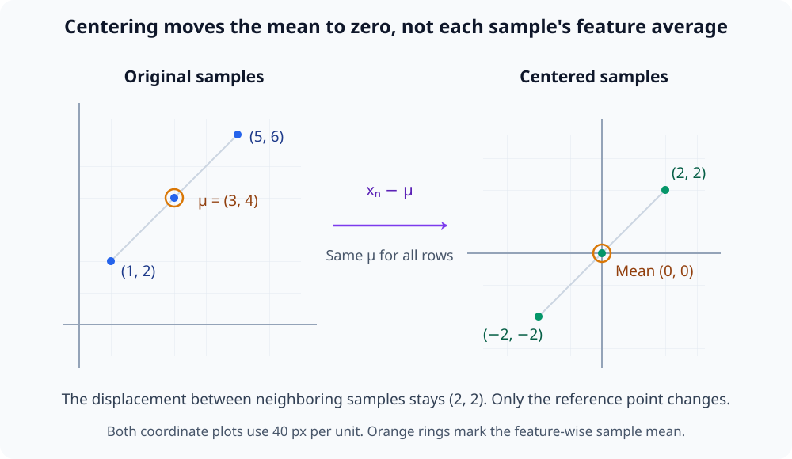
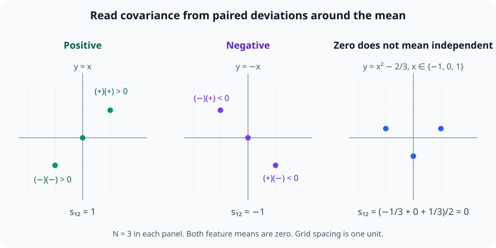
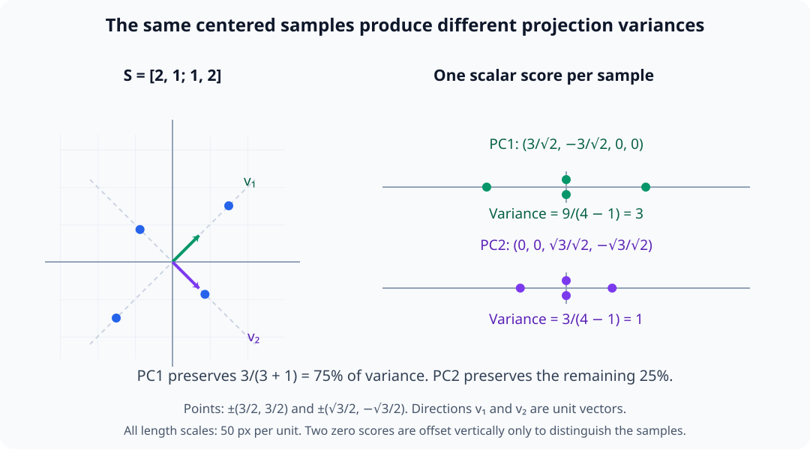
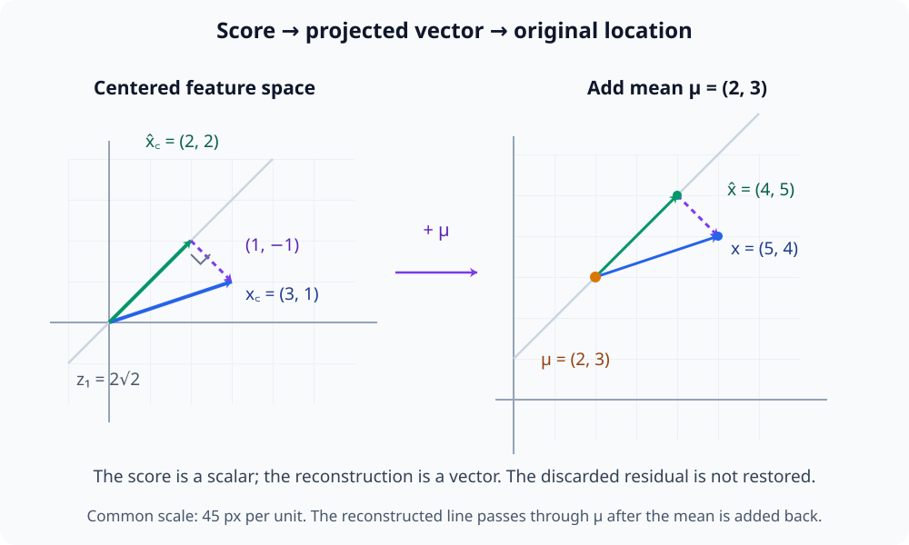
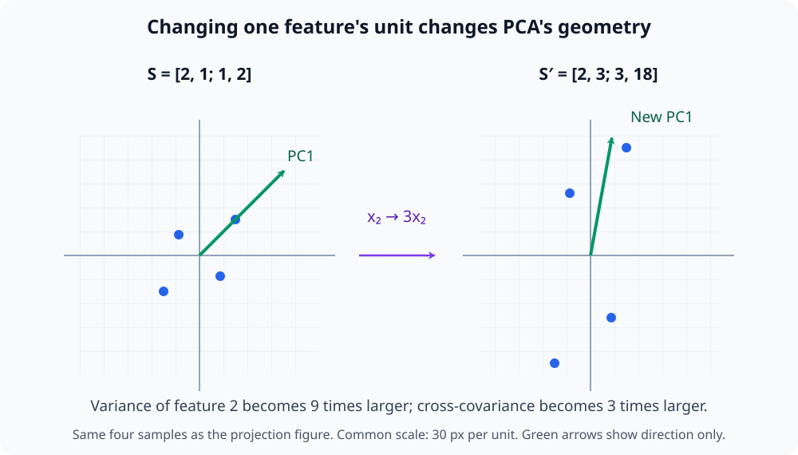

# M02-14. 공분산과 PCA

## 이 단원이 필요한 이유

activation 행렬에는 표본마다 함께 변하는 feature 방향이 있다. 공분산행렬은 feature별 분산과 feature 쌍의 공동변화를 기록한다. 주성분분석(principal component analysis, PCA)은 공분산이 큰 직교 방향을 찾아 데이터 변동을 적은 좌표로 요약한다.

PCA는 분산과 선형 재구성 오차를 기준으로 방향을 고른다. 큰 분산 방향이 모델의 의미 feature나 인과적 회로라는 결론은 자동으로 따라오지 않는다. 데이터 선택, 중심화와 feature 스케일을 함께 보고해야 한다.

## 학습 목표

이 단원을 마치면 다음을 할 수 있다.

- 행 단위 데이터의 평균벡터를 구하고 중심화할 수 있다.
- 중심화된 데이터에서 표본 공분산행렬을 계산할 수 있다.
- 공분산행렬의 대칭성과 양의 준정부호를 설명할 수 있다.
- 고유값분해로 주성분 방향과 설명분산비율을 구할 수 있다.
- 데이터 SVD와 PCA의 관계를 shape과 식으로 설명할 수 있다.
- 주성분 점수와 rank-$k$ 재구성을 계산하고 해석 범위를 판단할 수 있다.

## 선수지식 확인

- 선수 단원: [M02-12 대칭행렬과 스펙트럼 정리](M02-12-symmetric-matrices-spectral-theorem.md)
- 선수 단원: [M02-13 특이값분해](M02-13-singular-value-decomposition.md)
- 확인 질문: 대칭 PSD 행렬의 고유값 부호와 정규직교 고유기저를 설명할 수 있는가?
- 확인 질문: 중심화된 행렬의 오른쪽 특이벡터가 feature 공간에 놓인다는 뜻을 설명할 수 있는가?

스펙트럼 분해나 SVD가 불분명하면 선수 단원을 먼저 복습한다.

## 기호와 용어

| 기호·용어 | Common spoken reading | 의미 | shape·조건 |
|---|---|---|---|
| $\mathbf X$ | `X` | 표본을 행으로 쌓은 데이터 행렬 | $\mathbf X\in\mathbb R^{N\times d}$ |
| $\boldsymbol\mu$ | `mu` | feature별 표본평균 벡터 | $\boldsymbol\mu\in\mathbb R^d$ |
| $\mathbf X_c$ | `X sub c` | 평균을 뺀 중심화 데이터 | $N\times d$ |
| $\mathbf S$ | `S` | 표본 공분산행렬 | $\mathbf S=\frac{1}{N-1}\mathbf X_c^\top\mathbf X_c$ |
| $\mathbf v_i$ | `v sub i` | $i$번째 주성분 방향 | feature 공간의 단위벡터 |
| $\lambda_i$ | `lambda sub i` | $i$번째 주성분 방향의 표본분산 | $\lambda_1\ge\cdots\ge0$ |
| $\mathbf Z$ | `Z` | 주성분 점수 행렬 | $\mathbf Z=\mathbf X_c\mathbf V_k$ |

## 핵심 개념 1. PCA는 평균을 뺀 데이터에서 시작한다

$N$개 표본 $\mathbf x_1,\ldots,\mathbf x_N\in\mathbb R^d$를 행으로 쌓아

\[
\mathbf X=
\begin{bmatrix}
\mathbf x_1^\top\\
\vdots\\
\mathbf x_N^\top
\end{bmatrix}
\in\mathbb R^{N\times d}
\]

로 둔다. 평균벡터는

\[
\boldsymbol\mu
=
\frac{1}{N}\sum_{n=1}^{N}\mathbf x_n
\]

이다.

각 행에서 평균을 빼면

\[
\mathbf X_c
=
\mathbf X-\mathbf 1\boldsymbol\mu^\top
\]

이다. $\mathbf 1$은 성분이 모두 1인 $N$성분 열벡터다. 따라서 $\mathbf 1\boldsymbol\mu^\top$의 모든 행은 같은 평균벡터의 전치이고, 표본마다 같은 feature 평균을 뺀다. 한 표본 안의 feature들을 평균 내어 빼는 연산과는 다르다.

중심화된 표본의 합은 $\sum_n\mathbf x_n-N\boldsymbol\mu=\mathbf 0$이므로 각 feature 열의 합도 0이다. 이 데이터의 원점은 원래 좌표의 영벡터가 아니라 표본의 평균 위치다. 중심화된 각 행은 그 평균에서 얼마나 벗어났는지를 나타낸다. 중심화를 생략하면 PCA가 변동 대신 원점에서 멀리 떨어진 평균 위치를 큰 방향으로 잡을 수 있다.

아래 그림은 세 표본에서 같은 평균벡터를 빼는 연산을 좌표 이동으로 나타낸다. 표본 사이의 차이는 그대로이며 평균의 위치만 원점으로 옮겨진다.

<figure class="lesson-figure lesson-figure--wide" markdown="1">

<figcaption>각 표본에서 (3,4)를 빼면 평균이 (0,0)이 된다. feature별 평균을 빼는 것은 각 점을 같은 벡터만큼 옮기는 연산이며, 한 표본의 두 feature를 서로 평균 내는 연산이 아니다.</figcaption>
</figure>

## 핵심 개념 2. 공분산행렬은 feature의 공동변화를 기록한다

$N\ge2$일 때 표본 공분산행렬을

\[
\mathbf S
=
\frac{1}{N-1}\mathbf X_c^\top\mathbf X_c
\in\mathbb R^{d\times d}
\]

로 정의한다. 원소는

\[
s_{ij}
=
\frac{1}{N-1}
\sum_{n=1}^{N}
(x_{ni}-\mu_i)(x_{nj}-\mu_j)
\]

이다.

행렬곱의 $(i,j)$ 원소는 중심화된 $i$번째 열과 $j$번째 열의 내적이다. 같은 표본 번호 $n$의 두 성분을 곱해 합하므로 서로 다른 표본의 feature를 짝짓지 않는다. $i=j$에서는 편차의 제곱을 합해 $i$번째 feature의 표본분산 $s_{ii}$를 얻는다.

비대각에서는 두 편차의 부호가 같으면 양의 항, 다르면 음의 항을 더한다. 따라서 $s_{ij}$는 두 feature가 각자의 평균에서 같은 쪽으로 벗어나는지, 반대쪽으로 벗어나는지를 요약한다. 합이 0인 것은 이런 선형 공동변화가 상쇄된다는 뜻이며 일반적인 통계적 독립을 보장하지 않는다.

아래 그림은 이미 중심화된 표본들의 위치와 두 편차의 곱을 함께 보여 준다. 오른쪽 표본은 두 feature 사이에 관계가 있어도 양의 곱과 음의 곱이 상쇄되는 경우다.

<figure class="lesson-figure lesson-figure--wide" markdown="1">

<figcaption>두 편차의 곱은 같은 부호의 사분면에서 양수, 반대 부호의 사분면에서 음수다. 공분산 0은 이 곱들의 합이 0이라는 뜻이며, 오른쪽처럼 비선형 관계가 있는 표본에서도 나타날 수 있다.</figcaption>
</figure>

이 단원은 $N-1$로 나누는 표본 공분산의 관례를 사용한다. 중심화된 열은 합이 0이므로 편차 $N-1$개를 정하면 마지막 편차도 정해진다. 표본분산 추정의 통계적 근거는 M04에서 다룬다. $N$으로 나누는 문헌에서는 공분산 고유값의 배율이 달라지지만, 같은 중심화 데이터의 주성분 방향과 설명분산비율은 같아진다.

## 핵심 개념 3. 공분산행렬은 대칭이고 PSD다

\[
\mathbf S^\top
=
\left(
\frac{1}{N-1}\mathbf X_c^\top\mathbf X_c
\right)^\top
=
\mathbf S
\]

이므로 공분산행렬은 대칭이다.

임의의 $\mathbf v\in\mathbb R^d$에 대해

\[
\mathbf v^\top\mathbf S\mathbf v
=
\frac{1}{N-1}
\|\mathbf X_c\mathbf v\|_2^2
\ge0
\]

이므로 PSD다. 따라서 고유값은 모두 0 이상이고 정규직교 고유기저를 선택할 수 있다.

## 핵심 개념 4. 첫 주성분은 투영 분산을 최대화한다

단위방향 $\mathbf v$에 각 중심화 표본을 투영한 점수는

\[
\mathbf z=\mathbf X_c\mathbf v
\]

이다. 이 점수의 표본분산은

\[
\frac{1}{N-1}\|\mathbf X_c\mathbf v\|_2^2
=
\mathbf v^\top\mathbf S\mathbf v
\]

이다. 점수의 합은 중심화된 표본의 합과 $\mathbf v$의 내적이므로 0이다. 따라서 점수 평균도 0이고, 분산을 계산할 때 다시 평균을 빼는 항 없이 제곱합을 사용한다. 단위방향 조건은 방향의 선택과 단순한 배율 확대를 구분한다. 이 조건이 없으면 같은 방향을 큰 scalar로 늘려 분산값만 키울 수 있다.

\[
\|\mathbf v\|_2=1
\]

조건에서 이 값을 가장 크게 만드는 방향은 $\mathbf S$의 가장 큰 고유값 $\lambda_1$에 대응하는 고유벡터 $\mathbf v_1$이다. 이를 M02-12의 quadratic form으로 확인할 수 있다. 후보 방향을 정규직교 고유기저에서 $\mathbf v=\sum_i c_i\mathbf v_i$로 쓰면 $\sum_i c_i^2=1$이고

\[
\mathbf v^\top\mathbf S\mathbf v
=\sum_i\lambda_i c_i^2
\le\lambda_1\sum_i c_i^2
=\lambda_1
\]

이다. $\mathbf v=\mathbf v_1$을 고르면 등호가 된다. 다음 방향을 $\mathbf v_1$과 직교하도록 제한하면 $c_1=0$이므로 남은 계수 중 가장 큰 $\lambda_2$가 상한이다. 이 과정을 반복해 이후 주성분을 고른다.

아래 그림은 예제 2의 공분산을 갖는 작은 중심화 표본 집합을 두 단위방향에 투영한다. 주성분은 왼쪽 feature 공간의 방향이고, 점수는 오른쪽처럼 각 표본마다 하나씩 얻는 scalar다.

<figure class="lesson-figure lesson-figure--wide" markdown="1">

<figcaption>같은 네 점에서 첫 방향의 점수 분산은 3, 직교하는 둘째 방향은 1이다. 이 두 값의 합 4가 전체 분산이므로 첫 주성분의 설명분산비율은 75%이며, 큰 분산은 점수들이 더 넓게 퍼진다는 뜻이다.</figcaption>
</figure>

## 핵심 개념 5. 설명분산비율은 보존한 분산의 비율이다

공분산행렬의 고유값을

\[
\lambda_1\ge\lambda_2\ge\cdots\ge\lambda_d\ge0
\]

로 둔다. 정사각행렬의 대각 원소 합을 trace라고 하며

\[
\operatorname{tr}(\mathbf S)
=
\sum_{j=1}^{d}s_{jj}
\]

이다. 전체 분산은

\[
\operatorname{tr}(\mathbf S)
=
\sum_{i=1}^{d}\lambda_i
\]

이다. 스펙트럼 분해에서 $j$번째 대각 원소는 각 $\lambda_i$에 $\mathbf v_i$의 $j$번째 성분 제곱을 곱해 합한 값이다. 모든 $j$에 걸쳐 더하면 각 고유벡터의 성분 제곱합이 1이므로 $\sum_i\lambda_i$가 남는다. 표준 feature 좌표의 분산 합과 정규직교 주성분 좌표의 분산 합이 같은 것이다.

$i$번째 주성분의 설명분산비율은

\[
\frac{\lambda_i}
{\sum_{j=1}^{d}\lambda_j}
\]

이고 상위 $k$개 누적 설명분산비율은

\[
\frac{\sum_{i=1}^{k}\lambda_i}
{\sum_{j=1}^{d}\lambda_j}
\]

이다. 전체 분산이 0인 데이터에서는 이 비율을 정의할 수 없다.

## 핵심 개념 6. PCA는 중심화 데이터의 SVD와 같다

\[
\mathbf X_c
=
\mathbf U\boldsymbol\Sigma\mathbf V^\top
\]

라고 하자. 그러면

\[
\mathbf S
=
\frac{1}{N-1}
\mathbf V\boldsymbol\Sigma^\top\boldsymbol\Sigma\mathbf V^\top
\]

이다.

공분산행렬의 고유벡터는 $\mathbf X_c$의 오른쪽 특이벡터이고

\[
\lambda_i
=
\frac{\sigma_i^2}{N-1}
\]

이다. M02-13의 $\mathbf X_c^\top\mathbf X_c$ 분해에 양의 공통 배율 $1/(N-1)$을 곱했으므로 고유벡터는 그대로이고 고유값만 그 배율로 바뀐다. 직사각 SVD의 대각 위치를 넘는 feature 고유방향이 있으면 그 공분산 고유값은 0이다.

여기서 오른쪽 특이벡터는 $d$성분의 feature 방향이다. $\mathbf X_c\mathbf v_i$를 계산하면 그 방향에 대한 $N$개 표본의 점수를 얻는다. 표본 수가 feature 수보다 훨씬 작을 때는 $d\times d$ 공분산행렬을 직접 만들지 않고 $N\times d$ 중심화 데이터의 SVD로 PCA를 계산할 수 있다.

## 핵심 개념 7. 점수와 재구성은 저차원 좌표와 근삿값을 만든다

상위 $k$개 주성분을 열로 모은

\[
\mathbf V_k\in\mathbb R^{d\times k}
\]

에 대해 점수 행렬은

\[
\mathbf Z
=
\mathbf X_c\mathbf V_k
\in\mathbb R^{N\times k}
\]

이다. $(n,i)$ 원소는 $n$번째 중심화 표본과 $i$번째 주성분 방향의 내적이다. 따라서 각 행은 그 표본의 $k$개 방향 계수이며, 주성분 방향 벡터 자체를 데이터로 저장하는 것이 아니다.

중심화 데이터의 rank-$k$ 재구성은

\[
\widehat{\mathbf X}_c
=
\mathbf Z\mathbf V_k^\top
=
\mathbf X_c\mathbf V_k\mathbf V_k^\top
\]

이고 평균을 되돌리면

\[
\widehat{\mathbf X}
=
\widehat{\mathbf X}_c
+
\mathbf 1\boldsymbol\mu^\top
\]

이다. M02-09에서는 열벡터 $\mathbf x_c$의 정사영을 $\mathbf V_k\mathbf V_k^\top\mathbf x_c$로 썼다. 여기서는 표본이 행에 있으므로 그 전치인 $\mathbf x_c^\top\mathbf V_k\mathbf V_k^\top$을 각 행에 적용한다. 점수에서 기저를 다시 결합해 원래 $d$성분 공간의 벡터를 만들지만, 버린 방향 성분까지 복원하지는 않는다.

PCA 재구성은 각 표본을 상위 주성분 부분공간에 정사영한 결과다. 중심화 데이터에서는 truncated SVD와 같은 행렬을 얻으므로 Frobenius norm의 재구성 오차를 최소화한다. 분산도 특이값 제곱에 같은 배율 $1/(N-1)$을 곱한 값이므로, 누적 설명분산비율은 이 근사가 보존한 중심화 데이터의 제곱 Frobenius norm 비율과 같다. 평균을 더하는 마지막 단계는 원래 데이터의 위치를 되돌리는 단계다.

아래 그림의 왼쪽은 예제 3의 점수와 재구성이며, 오른쪽은 평균이 $(2,3)^\top$인 경우를 별도로 붙여 평균 복원의 역할을 보여 준다. 두 장면에서 버린 방향의 잔차는 그대로다.

<figure class="lesson-figure lesson-figure--wide" markdown="1">

<figcaption>점수 2√2에 단위 주성분을 곱하면 중심화 공간의 (2,2)를 얻는다. 평균을 더하면 근사점은 원래 위치로 돌아가지만, 버린 성분 (1,−1)까지 되살아나는 것은 아니다.</figcaption>
</figure>

## 핵심 개념 8. feature 스케일과 표본 선택이 PCA를 바꾼다

분산은 측정 단위의 제곱에 비례한다. 한 feature에 scalar $c$를 곱하면 그 feature의 편차도 $c$배이고, 분산은 $c^2$배다. 다른 feature와의 공분산은 $c$배다. 이 배율은 공분산행렬 전체에 같은 값을 곱하는 것이 아니므로 주성분 방향이 바뀔 수 있다.

아래 그림은 투영 분산 그림의 같은 네 표본에서 둘째 feature만 3배 한다. 표본의 대응은 유지되지만 점들의 기하가 세로로 늘어나고, 가장 큰 분산 방향도 그에 따라 달라진다.

<figure class="lesson-figure lesson-figure--wide" markdown="1">

<figcaption>둘째 feature의 분산은 9배, 두 feature의 공분산은 3배가 된다. 첫 주성분은 원래 45도 방향에서 세로에 가까운 방향으로 바뀌므로 feature 단위를 바꾼 결과를 같은 기하라고 읽으면 안 된다.</figcaption>
</figure>

각 중심화 feature를 자기 표준편차로 나누는 표준화는 단위 차이를 줄이지만 분석 질문도 바꾼다. 표준편차는 해당 분산의 제곱근이며, 0인 상수 feature는 이 방식으로 나눌 수 없다. 원래 크기의 변동을 보려면 중심화만 하고, feature별 상대 변동을 보려면 표준화를 고려한다. 사용한 전처리를 결과와 함께 기록한다.

PCA 방향은 분석한 데이터 분포에도 의존한다. layer, token, 입력 집합이나 표본 가중치를 바꾸면 공분산과 주성분이 달라질 수 있다.

주성분 벡터의 부호는 하나로 정해지지 않는다. $\mathbf v_i$ 대신 $-\mathbf v_i$를 사용하면 점수 부호도 바뀌지만 정사영과 재구성 부분공간은 같다. 서로 다른 실행의 주성분을 비교할 때 부호와 반복 고유값 부분공간을 정렬해야 한다.

## 예제 1. 한 축에서만 변하는 데이터

세 표본이

\[
\mathbf x_1=
\begin{bmatrix}2\\0\end{bmatrix},
\qquad
\mathbf x_2=
\begin{bmatrix}0\\0\end{bmatrix},
\qquad
\mathbf x_3=
\begin{bmatrix}-2\\0\end{bmatrix}
\]

라고 하자. 평균은 영벡터이고

\[
\mathbf X_c=
\begin{bmatrix}
2&0\\
0&0\\
-2&0
\end{bmatrix}
\]

이다.

\[
\mathbf S
=
\frac{1}{2}
\mathbf X_c^\top\mathbf X_c
=
\begin{bmatrix}
4&0\\
0&0
\end{bmatrix}
\]

이다. 첫 주성분은 $\mathbf e_1$, 고유값은 4다. 둘째 고유값은 0이므로 모든 변동이 첫 좌표축에 있다.

## 예제 2. 회전된 주성분

\[
\mathbf S=
\begin{bmatrix}
2&1\\
1&2
\end{bmatrix}
\]

이면 고유값은 3과 1이고 정규직교 고유벡터는

\[
\mathbf v_1=
\frac{1}{\sqrt2}
\begin{bmatrix}1\\1\end{bmatrix},
\qquad
\mathbf v_2=
\frac{1}{\sqrt2}
\begin{bmatrix}1\\-1\end{bmatrix}
\]

이다. 첫 주성분은 두 feature가 같은 부호로 함께 변하는 방향이다.

설명분산비율은

\[
\frac34
\qquad\text{및}\qquad
\frac14
\]

이다.

## 예제 3. 한 주성분으로 재구성

예제 2의 첫 주성분만 사용한다고 하자. 중심화된 표본

\[
\mathbf x_c=
\begin{bmatrix}3\\1\end{bmatrix}
\]

의 점수는

\[
z_1
=
\mathbf x_c^\top\mathbf v_1
=
\frac{4}{\sqrt2}
=
2\sqrt2
\]

이다. 재구성은

\[
\widehat{\mathbf x}_c
=
z_1\mathbf v_1
=
\begin{bmatrix}2\\2\end{bmatrix}
\]

이다. 잔차 $\begin{bmatrix}1\\-1\end{bmatrix}$는 첫 주성분과 직교한다.

## 예제 4. activation PCA

$N$개 입력에서 한 layer와 token 위치의 activation을 모아

\[
\mathbf H\in\mathbb R^{N\times d}
\]

를 만들 수 있다. 행 평균을 빼지 않고 feature별 표본평균을 빼서 $\mathbf H_c$를 만든 뒤 SVD를 적용한다. 오른쪽 특이벡터는 activation feature 공간의 주성분 방향이다.

상위 성분의 높은 설명분산비율은 선택한 표본에서 activation 변동이 낮은 dimension의 선형 부분공간에 집중됨을 보여 준다. feature의 의미, 모델 사용과 다른 데이터에서의 재현성은 추가 실험이 필요하다.

## 흔한 오해

### 오해 1. PCA는 평균을 포함한 원점 기준 방향을 찾는다

표준 PCA는 각 feature의 평균을 뺀 뒤 변동 방향을 찾는다. 중심화를 생략하면 결과가 평균 위치의 영향을 받는다.

### 오해 2. 첫 주성분은 원래 feature 중 하나다

주성분은 원래 feature들의 선형결합이다. 공분산 구조에 따라 좌표축과 다른 방향을 가질 수 있다.

### 오해 3. 공분산 0은 두 feature가 독립이라는 뜻이다

공분산 0은 선형 공동변화가 없음을 나타낸다. 비선형 의존성은 남을 수 있다.

### 오해 4. 설명분산비율이 높은 방향은 모델이 사용하는 개념이다

설명분산비율은 표본 변동의 기하학적 집중도를 측정한다. 의미와 기능적 사용은 label 대조, 안정성 검사와 개입으로 검증해야 한다.

## 연습문제

### 1. 평균과 중심화

\[
\mathbf X=
\begin{bmatrix}
1&2\\
3&4\\
5&6
\end{bmatrix}
\]

의 평균벡터와 중심화 행렬 $\mathbf X_c$를 구하라.

해설 보기

feature별 평균은

\[
\boldsymbol\mu=
\begin{bmatrix}3\\4\end{bmatrix}
\]

이다. 각 행에서 평균을 빼면

\[
\mathbf X_c=
\begin{bmatrix}
-2&-2\\
0&0\\
2&2
\end{bmatrix}
\]

이다. 각 열의 합은 0이다.

### 2. 공분산행렬

문제 1의 $\mathbf X_c$에서 표본 공분산행렬을 구하라.

해설 보기

$N=3$이므로 $N-1=2$다.

\[
\mathbf X_c^\top\mathbf X_c
=
\begin{bmatrix}
8&8\\
8&8
\end{bmatrix}
\]

이므로

\[
\mathbf S
=
\frac12
\begin{bmatrix}
8&8\\
8&8
\end{bmatrix}
=
\begin{bmatrix}
4&4\\
4&4
\end{bmatrix}
\]

이다.

### 3. 주성분과 고유값

문제 2의 공분산행렬에서 첫 주성분 방향과 두 고유값을 구하라.

해설 보기

\[
\mathbf S
\begin{bmatrix}1\\1\end{bmatrix}
=
\begin{bmatrix}8\\8\end{bmatrix}
=
8
\begin{bmatrix}1\\1\end{bmatrix}
\]

이므로 첫 고유값은 8이고 정규화한 첫 주성분은

\[
\mathbf v_1=
\frac{1}{\sqrt2}
\begin{bmatrix}1\\1\end{bmatrix}
\]

이다. 직교 방향 $\begin{bmatrix}1\\-1\end{bmatrix}$의 고유값은 0이다.

### 4. 설명분산비율

PCA 고유값이 $9,3,2,1$일 때 첫 주성분과 상위 두 주성분의 설명분산비율을 구하라.

해설 보기

전체 분산은

\[
9+3+2+1=15
\]

이다. 첫 주성분의 비율은

\[
\frac{9}{15}=0.6
\]

이고 상위 두 성분의 누적 비율은

\[
\frac{9+3}{15}=0.8
\]

이다.

### 5. PCA와 SVD

$N=101$인 중심화 데이터의 특이값이 $\sigma_1=20$, $\sigma_2=10$이라고 하자. 대응 공분산 고유값을 구하라.

해설 보기

\[
\lambda_i
=
\frac{\sigma_i^2}{N-1}
\]

이고 $N-1=100$이다. 따라서

\[
\lambda_1=\frac{400}{100}=4,
\qquad
\lambda_2=\frac{100}{100}=1
\]

이다.

### 6. 점수와 재구성 shape

\[
\mathbf X_c\in\mathbb R^{200\times64},
\qquad
\mathbf V_5\in\mathbb R^{64\times5}
\]

라고 하자. $\mathbf Z=\mathbf X_c\mathbf V_5$와 $\widehat{\mathbf X}_c=\mathbf Z\mathbf V_5^\top$의 shape을 구하라.

해설 보기

\[
\mathbf Z\in\mathbb R^{200\times5}
\]

이고

\[
\widehat{\mathbf X}_c\in\mathbb R^{200\times64}
\]

이다. 각 표본을 5차원 점수로 줄인 뒤 원래 64차원 feature 공간에 재구성한다.

### 7. activation PCA 주장 비판

한 모델의 특정 layer activation에서 첫 8개 주성분이 분산의 90%를 설명했다. 다음을 구분해 적어라.

1. 이 데이터에서 직접 말할 수 있는 내용
2. 재현성을 위해 보고할 조건
3. 개입 없이 말할 수 없는 주장

해설 보기

선택한 activation 표본은 상위 8개 주성분 부분공간에 전체 표본분산의 90%를 갖는다고 말할 수 있다.

모델과 checkpoint, layer와 token 위치, 입력 데이터, 중심화·표준화 방식, 표본 수와 seed를 보고해야 한다. 다른 표본이나 모델에서도 주성분 부분공간이 유지되는지 비교해야 한다.

각 주성분이 하나의 인간 해석 가능한 개념인지, 모델이 예측에 이 부분공간을 사용하는지, 8차원이 과제에 충분한지는 PCA만으로 결론 낼 수 없다. label 기반 검증과 개입 실험이 필요하다.

## 단원 요약

- PCA는 표본을 행으로 쌓고 feature 평균을 뺀 중심화 데이터에서 시작한다.
- 표본 공분산행렬은 $\frac{1}{N-1}\mathbf X_c^\top\mathbf X_c$이며 대칭 PSD다.
- 주성분은 공분산행렬의 정규직교 고유벡터이고 고유값은 투영 점수의 분산이다.
- 설명분산비율은 전체 분산 중 각 주성분이 차지하는 비율이다.
- 중심화 데이터의 오른쪽 특이벡터가 PCA 방향이며 $\lambda_i=\sigma_i^2/(N-1)$이다.
- PCA 결과는 데이터·전처리와 기저의 부호에 의존하며 의미와 기능적 사용을 직접 입증하지 않는다.

## 통과 기준

다음 질문에 자료를 보지 않고 답할 수 있으면 통과한다.

- 데이터 행렬을 중심화하고 공분산행렬을 계산할 수 있는가?
- 공분산행렬이 대칭 PSD인 이유를 설명할 수 있는가?
- 고유값분해에서 주성분과 설명분산비율을 구할 수 있는가?
- PCA와 중심화 데이터 SVD의 관계를 설명할 수 있는가?
- 주성분 점수와 rank-$k$ 재구성의 shape을 추적할 수 있는가?
- PCA 결과의 전처리·데이터 의존성과 주장 범위를 설명할 수 있는가?

## 다음 단원

- [M02-15 norm과 condition number](M02-15-norm-condition-number.md)

## 집필자 점검표

- [x] 학습 목표가 관찰 가능한 행동으로 작성됐다.
- [x] 행 단위 데이터 관례와 중심화를 명시했다.
- [x] 공분산행렬의 원소, 대칭성과 PSD를 설명했다.
- [x] PCA의 분산 최대화와 설명분산비율을 연결했다.
- [x] SVD, 점수와 재구성 shape을 제시했다.
- [x] 모든 문제에 해설이 있다.
- [x] 데이터·전처리 의존성과 기능 주장 한계를 구분했다.
- [x] 용어집과 표기 규칙을 따랐다.
- [x] 내부 링크와 수식 구분자를 확인했다.
- [x] Common spoken reading이 실제 영어 학술 발화이며 한글 음역이나 기계적 직역을 포함하지 않는다.
