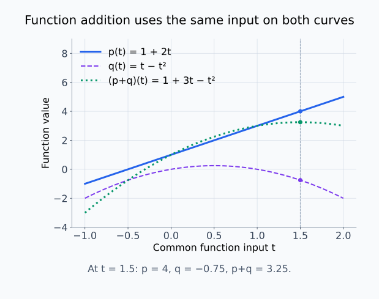
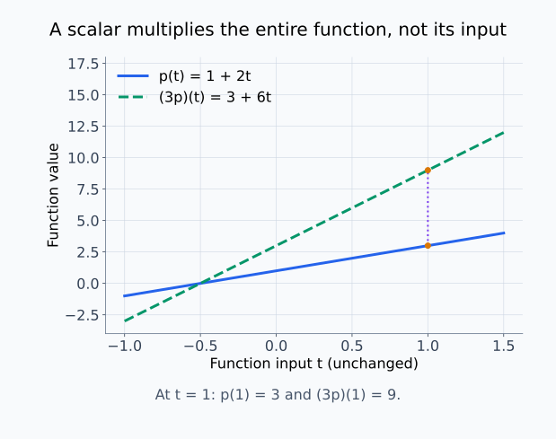
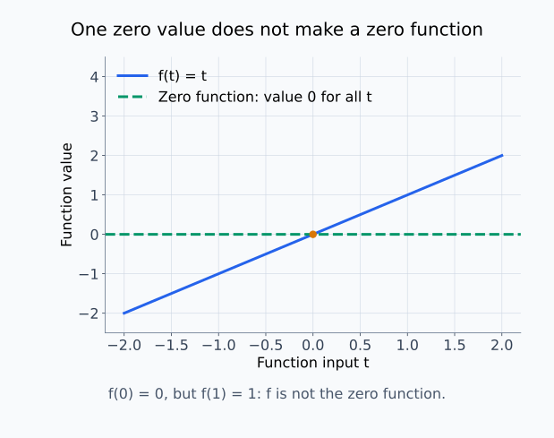
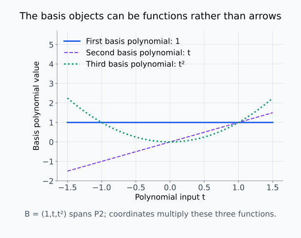
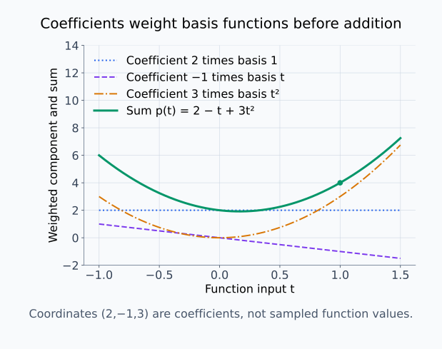
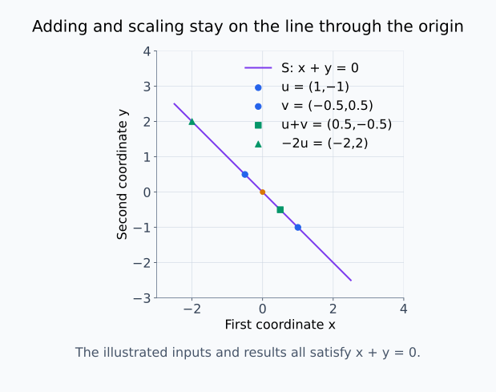
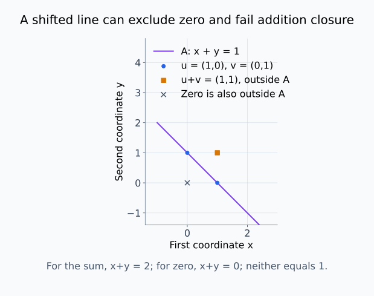

# M03-01. 추상 벡터공간

## 이 단원이 필요한 이유

지금까지 벡터는 주로 숫자를 세로로 쌓은 열벡터였다. 그러나 선형대수의 규칙은 숫자 배열에만 적용되지 않는다. 다항식, 함수, 행렬도 서로 더하고 실수를 곱할 수 있으며, 그 연산이 같은 법칙을 만족하면 벡터공간으로 다룰 수 있다.

이 관점은 모델의 파라미터, activation, 함수 자체를 구분할 때 필요하다. 파라미터는 유한차원 좌표로 저장되지만 모델 하나는 입력을 출력으로 보내는 함수이기도 하다. 두 대상을 모두 벡터라고 부를 수 있는 경우에도 어떤 공간의 원소인지 먼저 정해야 같은 덧셈과 같은 기저를 말하는지 판단할 수 있다.

## 학습 목표

이 단원을 마치면 다음을 할 수 있다.

- 실수 벡터공간의 연산과 핵심 공리를 설명할 수 있다.
- 열벡터, 다항식, 함수와 행렬에서 영벡터와 스칼라곱을 찾을 수 있다.
- 주어진 집합이 벡터공간인지 덧셈과 스칼라곱의 닫힘으로 판정할 수 있다.
- 추상 벡터와 그 벡터의 좌표 열을 구분할 수 있다.
- 선형결합, 생성공간, 기저와 차원을 일반 벡터공간에 적용할 수 있다.

## 선수지식 확인

- 선수 단원: [M02-01 벡터와 벡터 연산](../M02/M02-01-vectors-vector-operations.md)
- 선수 단원: [M02-02 선형결합과 span](../M02/M02-02-linear-combinations-span.md)
- 선수 단원: [M02-07 선형독립, 기저와 차원](../M02/M02-07-linear-independence-basis-dimension.md)
- 확인 질문: 열벡터의 덧셈과 스칼라곱을 계산할 수 있는가?
- 확인 질문: 기저가 벡터를 유일한 계수로 나타내는 독립 생성집합인 이유를 설명할 수 있는가?

선형결합과 기저가 불분명하면 선수 단원을 먼저 복습한다.

## 기호와 용어

| 기호·용어 | Common spoken reading | 의미 | 범위 |
|---|---|---|---|
| $V$ | `V` | 벡터들이 속한 집합 | 이 단원에서는 실수 벡터공간 |
| $\mathbf u,\mathbf v$ | `u and v` | $V$의 원소 | 배열일 필요가 없다. |
| $\alpha,\beta$ | `alpha and beta` | 벡터에 곱하는 scalar | $\alpha,\beta\in\mathbb R$ |
| $\mathbf 0_V$ | `the zero vector in V` | $V$에서 덧셈의 항등원 | 공간마다 모양이 다르다. |
| $\mathcal P_2$ | `calligraphic P sub two` | 차수가 2 이하인 실수계수 다항식의 공간 | $\{a+bt+ct^2:a,b,c\in\mathbb R\}$ |
| $[\,\mathbf v\,]_{\mathcal B}$ | `the coordinates of v in the basis B` | 기저 $\mathcal B$에 대한 계수 열 | $\mathbb R^n$의 열벡터 |

## 핵심 개념 1. 벡터는 공간이 정한 연산의 대상이다

추상 벡터공간에서 벡터는 화살표나 숫자 열로 정의되지 않는다. 집합 $V$에 다음 두 연산이 주어진다.

- 벡터 덧셈: $\mathbf u+\mathbf v\in V$
- 스칼라곱: $\alpha\mathbf v\in V$

여기서 scalar는 이 단원에서 실수다. 두 연산이 벡터공간 공리를 만족하면 $V$를 실수 벡터공간이라고 한다. 따라서 어떤 대상이 벡터인지는 대상의 외형보다 그 대상이 속한 공간과 연산으로 정해진다.

예를 들어 다항식 $p(t)=1+2t$와 $q(t)=t-t^2$를 더하면

\[
(p+q)(t)=1+3t-t^2
\]

이고, 실수 3을 곱하면

\[
(3p)(t)=3+6t
\]

이다. 결과가 다시 실수계수 다항식이므로 같은 공간 안에서 연산할 수 있다.

여기서 $t$는 다항식에 넣는 입력이고, 3은 다항식 전체에 곱하는 scalar다. 다항식을 더한다는 것은 같은 차수의 계수를 더한다는 뜻이다. 차수가 2 이하인 다항식끼리 더하거나 scalar를 곱해도 3차 이상의 항은 생기지 않으므로 $\mathcal P_2$ 안에 머문다. 반면 차수가 정확히 2인 다항식만 모으면 $p+(-p)$가 영다항식이 되어 집합을 벗어난다. 대상이 다항식이라는 사실뿐 아니라 어떤 다항식을 모았는지도 확인해야 한다.

함수공간에서도 연산을 먼저 정한다. 공통 정의역의 실수함수 $f,g$에 대해 $(f+g)(t)=f(t)+g(t)$와 $(\alpha f)(t)=\alpha f(t)$로 정의하면, 같은 입력에서의 값을 더하거나 배율을 적용한 결과가 다시 함수가 된다. 이를 점별 연산이라고 한다.

앞의 다항식을 곡선으로 그려 보면, 덧셈은 같은 입력 위치의 높이를 더하는 연산이다.

<figure class="lesson-figure lesson-figure--wide" markdown="1">
  
  <figcaption>입력 t=1.5에서 p의 값 4와 q의 값 −0.75를 더하면 합의 함수값은 3.25다. 다른 입력에서도 같은 위치의 값을 더해 초록색 합의 곡선을 만든다. 이 곡선 자체가 함수공간의 한 원소다.</figcaption>
</figure>

스칼라곱에서는 입력을 유지하고 각 입력에서의 출력값에 같은 배율을 곱한다.

<figure class="lesson-figure lesson-figure--wide" markdown="1">
  
  <figcaption>t=1의 높이는 p에서 3, 3p에서 9다. 보라색 점선은 같은 입력 위치의 두 높이를 연결한다. 입력 t를 세 배로 바꾸는 계산과 다항식 전체에 3을 곱하는 계산은 구분한다.</figcaption>
</figure>

## 핵심 개념 2. 벡터공간 공리는 계산 규칙을 고정한다

모든 $\mathbf u,\mathbf v,\mathbf w\in V$와 $\alpha,\beta\in\mathbb R$에 대해 다음 법칙이 성립해야 한다.

1. 덧셈의 교환법칙: $\mathbf u+\mathbf v=\mathbf v+\mathbf u$
2. 덧셈의 결합법칙: $(\mathbf u+\mathbf v)+\mathbf w=\mathbf u+(\mathbf v+\mathbf w)$
3. 영벡터의 존재: $\mathbf v+\mathbf 0_V=\mathbf v$
4. 덧셈 역원의 존재: $\mathbf v+(-\mathbf v)=\mathbf 0_V$
5. 분배법칙: $\alpha(\mathbf u+\mathbf v)=\alpha\mathbf u+\alpha\mathbf v$
6. scalar 덧셈에 대한 분배법칙: $(\alpha+\beta)\mathbf v=\alpha\mathbf v+\beta\mathbf v$
7. 스칼라곱의 결합법칙: $\alpha(\beta\mathbf v)=(\alpha\beta)\mathbf v$
8. scalar 1의 작용: $1\mathbf v=\mathbf v$

덧셈과 스칼라곱은 $V$ 안에서 결과를 내야 한다. 이를 닫힘이라고 한다. 공리를 매번 전부 확인하기보다, 이미 알려진 벡터공간의 부분집합이라면 영벡터 포함 여부와 덧셈·스칼라곱의 닫힘을 먼저 검사하는 방법이 효율적이다.

이 부분공간 판정에서는 원래 공간의 연산을 그대로 사용한다. 교환법칙·결합법칙·분배법칙은 원래 공간에서 성립하므로 부분집합의 원소에도 성립한다. 영벡터가 포함되고 스칼라곱에 닫혀 있으면 $-\mathbf v=(-1)\mathbf v$도 부분집합에 있으므로 덧셈 역원 조건까지 충족한다. 따라서 이 세 조건을 확인하면 나머지 공리를 다시 증명하지 않아도 된다. 임의로 다른 연산을 정한 집합에는 이 판정을 그대로 적용할 수 없다.

공리에서 $0\mathbf v=\mathbf 0_V$도 따라온다. $(0+0)\mathbf v=0\mathbf v+0\mathbf v$의 왼쪽은 $0\mathbf v$이므로 양변에서 $0\mathbf v$를 더하기 역원으로 소거하면 $\mathbf 0_V=0\mathbf v$다. 이 식은 scalar 0과 영벡터를 구분하면서도 둘의 관계를 설명한다.

## 핵심 개념 3. 영벡터의 모양은 공간마다 다르다

영벡터는 숫자 0 하나가 아니라 덧셈의 항등원이다.

| 공간 | 원소의 예 | 영벡터 |
|---|---|---|
| $\mathbb R^3$ | $(1,2,3)^\top$ | $(0,0,0)^\top$ |
| $\mathcal P_2$ | $1-2t+t^2$ | 영다항식 $0+0t+0t^2$ |
| 실수함수의 공간 | $f(t)=\sin t$ | 모든 입력에서 0인 함수 |
| $\mathbb R^{2\times2}$ | $2\times2$ 실수행렬 | $2\times2$ 영행렬 |

영함수와 영다항식은 값이 항상 0이지만 각각 함수공간과 다항식공간의 원소다. 같은 기호 0을 쓰더라도 소속 공간을 확인해야 한다.

함수 $f$가 한 입력에서 0이라는 사실은 $f$가 영함수라는 뜻이 아니다. 예를 들어 $f(t)=t$는 $f(0)=0$이지만 다른 입력에서는 0이 아닐 수 있다. 영함수는 정의역의 모든 입력에서 0이어야 하며, 그래야 점별 덧셈에서 모든 함수 $g$에 대해 $g+f=g$가 된다.

한 점의 영값과 영함수는 그래프에서도 구분된다.

<figure class="lesson-figure lesson-figure--wide" markdown="1">
  
  <figcaption>주황색 점에서는 f(t)=t도 값이 0이지만, 다른 입력의 높이는 0이 아니다. 초록색 영함수는 모든 입력의 높이가 0이어서 어느 함수에 점별로 더해도 그 함수값을 바꾸지 않는다.</figcaption>
</figure>

## 핵심 개념 4. 익숙한 대수 개념은 대상의 종류와 무관하다

$\mathbf v_1,\ldots,\mathbf v_k\in V$의 선형결합은

\[
\alpha_1\mathbf v_1+\cdots+\alpha_k\mathbf v_k
\]

이다. 가능한 모든 선형결합의 집합이 생성공간이다. 이 정의에는 벡터의 성분이 등장하지 않는다.

벡터들이 선형독립이라는 말은

\[
\alpha_1\mathbf v_1+\cdots+\alpha_k\mathbf v_k=\mathbf 0_V
\]

을 만족하는 계수가 $\alpha_1=\cdots=\alpha_k=0$뿐이라는 뜻이다. $V$를 생성하면서 선형독립인 순서 있는 벡터 목록이 기저다.

예를 들어

\[
\mathcal B=(1,t,t^2)
\]

는 $\mathcal P_2$의 기저다. 모든 $p(t)=a+bt+ct^2$는

\[
p=a\cdot1+b\cdot t+c\cdot t^2
\]

로 유일하게 표현된다. 따라서 $\dim\mathcal P_2=3$이다.

기저 조건을 나누어 보면, $\mathcal P_2$의 정의상 모든 다항식을 $1,t,t^2$의 선형결합으로 쓸 수 있으므로 생성 조건을 만족한다. 또한 $a\cdot1+b\cdot t+c\cdot t^2$가 영다항식이라는 것은 모든 계수가 0이라는 뜻이므로 $a=b=c=0$이다. 이것이 선형독립 조건이다. 계수 세 개가 있는 표현을 찾은 것만으로 기저라고 결론 내리는 것이 아니라, 생성과 독립을 함께 확인한 것이다.

두 계수 목록이 같은 다항식을 나타낸다고 하면 두 표현을 빼서 영다항식을 얻는다. 선형독립에 의해 계수 차이가 모두 0이므로 두 목록은 같다. M02에서 배운 좌표의 유일성 논리가 다항식에도 그대로 적용된다.

다항식 기저의 세 원소도 각각 입력을 값으로 보내는 함수다.

<figure class="lesson-figure lesson-figure--wide" markdown="1">
  
  <figcaption>기저 (1,t,t²)의 세 원소를 각각 그렸다. 이 함수들에 계수를 곱해 더하면 2차 이하의 다항식을 얻는다. 서로 다른 모양으로 보인다는 사실만으로 독립성을 증명하는 것은 아니며, 독립성은 앞의 영다항식 계수 논리로 확인한다.</figcaption>
</figure>

## 핵심 개념 5. 벡터와 좌표 열은 같은 대상이 아니다

기저 $\mathcal B=(\mathbf b_1,\ldots,\mathbf b_n)$가 정해지면

\[
\mathbf v
=
c_1\mathbf b_1+\cdots+c_n\mathbf b_n
\]

의 계수를 모아

\[
[\mathbf v]_{\mathcal B}
=
\begin{bmatrix}
c_1\\
\vdots\\
c_n
\end{bmatrix}
\]

로 쓴다. $\mathbf v$는 원래 공간 $V$의 벡터이고, $[\mathbf v]_{\mathcal B}$는 $\mathbb R^n$의 열벡터다.

다항식

\[
p(t)=2-t+3t^2
\]

자체는 함수인 다항식이고, $\mathcal B=(1,t,t^2)$에 대한 좌표는

\[
[p]_{\mathcal B}
=
\begin{bmatrix}
2\\
-1\\
3
\end{bmatrix}
\]

이다. 기저를 바꾸면 좌표 열은 달라지지만 다항식 $p$는 달라지지 않는다.

좌표는 원래 벡터를 다시 조립하는 정보다. 위 열의 세 원소를 차례로 $1,t,t^2$에 곱해 더하면 $p$를 복원한다. 이때 각 원소는 다항식의 특정 입력에서의 값이 아니라 기저다항식에 붙는 계수다. 기저의 순서까지 정해야 어느 계수를 어느 다항식에 곱할지 알 수 있다.

같은 기저에서 $\mathbf u=\sum_i a_i\mathbf b_i$와 $\mathbf v=\sum_i c_i\mathbf b_i$라면, 분배법칙에 의해 $\alpha\mathbf u+\beta\mathbf v=\sum_i(\alpha a_i+\beta c_i)\mathbf b_i$다. 따라서

\[
[\alpha\mathbf u+\beta\mathbf v]_{\mathcal B}
=\alpha[\mathbf u]_{\mathcal B}+\beta[\mathbf v]_{\mathcal B}
\]

이다. 추상 벡터와 좌표 열은 다른 대상이지만, 고정된 기저에서의 좌표 기록은 선형결합을 보존한다. 이것이 추상 공간의 계산을 열벡터 계산으로 옮길 수 있는 이유다.

좌표 열의 계수를 실제 기저함수에 곱하면 원래 다항식을 다시 조립할 수 있다.

<figure class="lesson-figure lesson-figure--wide" markdown="1">
  
  <figcaption>계수 2, −1, 3이 만드는 세 곡선의 높이를 더하면 초록색 p를 얻는다. 입력 1의 함수값은 4이며 좌표의 둘째 성분 −1과 다르다. 좌표는 선택한 기저에 붙는 계수이고, 함수값은 재조립한 함수에 입력을 넣은 결과다.</figcaption>
</figure>

## 예제 1. 부분집합이 벡터공간인지 판정하기

### 문제

\[
S=\{(x,y)^\top\in\mathbb R^2:x+y=0\}
\]

과

\[
A=\{(x,y)^\top\in\mathbb R^2:x+y=1\}
\]

이 각각 $\mathbb R^2$의 부분공간인지 판정하라.

### 풀이

$S$에는 $(0,0)^\top$이 들어 있다. $\mathbf u=(u_1,u_2)^\top$와 $\mathbf v=(v_1,v_2)^\top$가 $S$에 있으면

\[
u_1+u_2=0,
\qquad
v_1+v_2=0
\]

이다. 따라서

\[
(u_1+v_1)+(u_2+v_2)=0
\]

이므로 $\mathbf u+\mathbf v\in S$다. 또한 $\alpha\in\mathbb R$에 대해

\[
\alpha u_1+\alpha u_2=\alpha(u_1+u_2)=0
\]

이므로 $\alpha\mathbf u\in S$다. 따라서 $S$는 부분공간이다.

$A$에는 영벡터가 들어 있지 않다. 실제로 $0+0\ne1$이다. 그러므로 $A$는 부분공간이 아니다.

### 결과의 의미

$S$는 원점을 지나는 직선이고 $A$는 그 직선을 평행이동한 affine 집합이다. 둘 다 직선처럼 보이지만 벡터공간은 영벡터를 포함해야 한다.

원점을 지나는 직선에서는 덧셈과 스칼라곱의 결과도 같은 직선에 남는다. 다음은 닫힘을 확인하는 구체적 좌표들이다.

<figure class="lesson-figure lesson-figure--wide" markdown="1">
  
  <figcaption>파란 두 입력의 합과 −2배 결과는 모두 x+y=0을 만족해 같은 직선에 놓인다. 주황색 원점도 직선에 속한다. 표시한 좌표들은 앞의 일반적인 닫힘 계산을 보여 주는 예다.</figcaption>
</figure>

평행이동한 직선에서는 같은 종류의 연산이 집합을 벗어날 수 있다.

<figure class="lesson-figure lesson-figure--wide" markdown="1">
  
  <figcaption>(1,0)과 (0,1)은 직선에 속하지만 합 (1,1)은 x+y=2여서 직선 밖이다. 회색 원점 역시 x+y=1을 만족하지 않는다. 직선의 외형보다 영벡터 포함과 연산의 닫힘을 확인해야 한다.</figcaption>
</figure>

## 예제 2. 다항식을 벡터처럼 계산하기

### 문제

$\mathcal P_2$에서

\[
p(t)=1+t,
\qquad
q(t)=2-t+t^2
\]

일 때 $2p-q$를 구하고, 기저 $\mathcal B=(1,t,t^2)$에 대한 좌표를 구하라.

### 풀이

\[
2p(t)-q(t)
=
2(1+t)-(2-t+t^2)
=
3t-t^2
\]

이다. 따라서

\[
[2p-q]_{\mathcal B}
=
\begin{bmatrix}
0\\
3\\
-1
\end{bmatrix}
\]

이다.

### 결과의 의미

함수의 덧셈과 스칼라곱을 사용했지만 계수 계산은 열벡터 계산과 같다. 기저가 추상 벡터를 숫자 좌표로 옮겼기 때문이다.

## 예제 3. 모델에서 서로 다른 벡터공간 구분하기

폭이 $d$인 층의 한 token activation은 보통 $\mathbf h\in\mathbb R^d$로 나타낸다. 같은 모델의 가중치행렬은 $\mathbf W\in\mathbb R^{m\times d}$에 속한다. 두 대상은 모두 벡터공간의 원소로 볼 수 있지만 서로 다른 공간에 속한다.

\[
\mathbf W\mathbf h\in\mathbb R^m
\]

은 정의되지만 $\mathbf W+\mathbf h$는 일반적으로 정의되지 않는다. 추상적으로 모두 벡터라는 사실만으로 서로 더할 수 있는 것은 아니다. 소속 공간과 연산의 입력 조건을 함께 확인해야 한다.

모델 함수 $f$와 $g$도 입력과 출력의 종류가 같다면 점별 덧셈

\[
(f+g)(\mathbf x)=f(\mathbf x)+g(\mathbf x)
\]

을 정의할 수 있다. 다만 특정 신경망 구조로 표현 가능한 함수들의 집합은 보통 이 덧셈에 닫혀 있다고 자동으로 결론 내릴 수 없다. 전체 함수공간과 특정 구조가 나타내는 함수족을 구분해야 한다.

## 흔한 오해

### 오해 1. 벡터는 화살표 또는 숫자 열이다

화살표와 숫자 열은 대표적인 벡터의 표현이다. 벡터공간 공리를 만족하는 다항식, 함수와 행렬도 벡터가 될 수 있다.

### 오해 2. 부분집합이 직선이나 평면이면 부분공간이다

원점을 지나지 않는 affine 직선이나 평면은 영벡터를 포함하지 않으므로 부분공간이 아니다.

### 오해 3. 모든 벡터는 서로 더할 수 있다

덧셈은 같은 벡터공간 안에서 정의된다. $\mathbb R^d$의 activation과 $\mathbb R^{m\times d}$의 가중치행렬은 서로 다른 공간의 원소다.

### 오해 4. 좌표 열이 바뀌면 벡터도 바뀐다

같은 벡터를 다른 기저로 표현하면 좌표가 바뀐다. 대상 자체와 그 대상의 좌표 표현을 구분해야 한다.

## 연습문제

### 1. 공리 읽기

\[
\alpha(\mathbf u+\mathbf v)=\alpha\mathbf u+\alpha\mathbf v
\]

를 한국어 문장으로 설명하라.

해설 보기

두 벡터를 먼저 더한 뒤 scalar $\alpha$를 곱한 결과는 각 벡터에 $\alpha$를 곱한 뒤 더한 결과와 같다. 스칼라곱이 벡터 덧셈에 대해 분배된다는 공리다.

### 2. 영벡터 찾기

$\mathcal P_3$, 실수함수의 공간, $\mathbb R^{2\times3}$에서 영벡터를 각각 설명하라.

해설 보기

$\mathcal P_3$에서는 모든 계수가 0인 영다항식이다. 함수공간에서는 모든 입력을 0으로 보내는 영함수다. $\mathbb R^{2\times3}$에서는 모든 원소가 0인 $2\times3$ 영행렬이다. 세 대상은 모양은 다르지만 각 공간의 덧셈 항등원이다.

### 3. 부분공간 판정

\[
S=\{(x,y,z)^\top\in\mathbb R^3:x-2y+z=0\}
\]

가 부분공간인지 판정하라.

해설 보기

영벡터는 식을 만족한다. $\mathbf u,\mathbf v\in S$이면 각 좌변이 0이므로 두 벡터를 더한 좌변도 0이다. $\alpha\mathbf u$의 좌변도 원래 좌변에 $\alpha$를 곱한 0이다. 영벡터 포함, 덧셈과 스칼라곱의 닫힘을 만족하므로 부분공간이다.

### 4. 벡터공간이 아닌 집합

\[
C=\{(x,y)^\top\in\mathbb R^2:x\ge0,\ y\ge0\}
\]

가 실수 벡터공간이 아닌 이유를 하나 제시하라.

해설 보기

$(1,1)^\top\in C$지만 scalar $-1$을 곱한 $(-1,-1)^\top$은 $C$에 없다. 실수 스칼라곱에 닫혀 있지 않으므로 실수 벡터공간이 아니다.

### 5. 다항식 좌표

$p(t)=4-2t+t^2$의 기저 $\mathcal B=(1,t,t^2)$에 대한 좌표를 구하라. 좌표와 $p$ 자체의 차이도 설명하라.

해설 보기

\[
[p]_{\mathcal B}
=
\begin{bmatrix}
4\\
-2\\
1
\end{bmatrix}
\]

이다. $p$는 입력 $t$를 값으로 보내는 다항식이고, 좌표는 선택한 기저에서 $p$를 조립하는 계수를 모은 열벡터다.

### 6. 기저와 차원

$\mathbb R^{2\times2}$에서 다음 네 행렬이 기저가 되는 이유를 설명하라.

\[
\mathbf E_{11}=
\begin{bmatrix}1&0\\0&0\end{bmatrix},
\quad
\mathbf E_{12}=
\begin{bmatrix}0&1\\0&0\end{bmatrix},
\quad
\mathbf E_{21}=
\begin{bmatrix}0&0\\1&0\end{bmatrix},
\quad
\mathbf E_{22}=
\begin{bmatrix}0&0\\0&1\end{bmatrix}
\]

해설 보기

임의의 $\mathbf A=\begin{bmatrix}a&b\\c&d\end{bmatrix}$는

\[
\mathbf A
=
a\mathbf E_{11}+b\mathbf E_{12}+c\mathbf E_{21}+d\mathbf E_{22}
\]

로 유일하게 표현된다. 따라서 네 행렬은 공간을 생성하고 선형독립이다. 그러므로 기저이며 $\dim\mathbb R^{2\times2}=4$다.

### 7. 모델 주장 비판

“activation과 가중치는 모두 벡터이므로 직접 더해서 하나의 표현으로 분석할 수 있다”는 문장을 비판하라.

해설 보기

activation과 가중치를 각각 어떤 공간의 원소로 보는지 먼저 밝혀야 한다. 보통 activation은 $\mathbb R^d$의 열벡터이고 가중치는 $\mathbb R^{m\times d}$의 행렬이므로 직접 덧셈이 정의되지 않는다. 임의로 펼치거나 사상한 뒤 더할 수는 있지만, 그때는 새 표현공간과 사상 규칙을 명시해야 한다.

## 단원 요약

- 벡터공간은 벡터 덧셈과 스칼라곱이 정해지고 공리를 만족하는 집합이다.
- 다항식, 함수와 행렬도 적절한 연산 아래 벡터공간의 원소가 된다.
- 부분공간은 영벡터를 포함하고 덧셈과 스칼라곱에 닫혀 있어야 한다.
- 선형결합, 생성공간, 선형독립, 기저와 차원은 성분 표현 없이 정의된다.
- 추상 벡터와 선택한 기저에서의 좌표 열은 서로 다른 대상이다.

## 통과 기준

다음 질문에 자료를 보지 않고 답할 수 있으면 통과한다.

- 실수 벡터공간의 두 연산과 핵심 공리를 설명할 수 있는가?
- 함수공간과 행렬공간의 영벡터를 찾을 수 있는가?
- 부분집합이 부분공간인지 닫힘으로 판정할 수 있는가?
- 다항식의 기저와 좌표를 계산할 수 있는가?
- 추상 벡터와 좌표 열을 구분할 수 있는가?

## 다음 단원

- [M03-02 선형사상과 행렬 표현](M03-02-linear-maps-matrix-representation.md)

## 집필자 점검표

- [x] 학습 목표가 관찰 가능한 행동으로 작성됐다.
- [x] 실수 벡터공간의 연산과 공리를 구분했다.
- [x] 다항식, 함수와 행렬의 예를 포함했다.
- [x] 추상 벡터와 좌표 열을 구분했다.
- [x] 예제 계산을 검산했다.
- [x] 모든 문제에 해설이 있다.
- [x] 모델 해석 주장의 강도를 구분했다.
- [x] 용어집과 표기 규칙을 따랐다.
- [x] 선수지식 밖의 내용을 몰래 요구하지 않는다.
- [x] 내부 링크와 수식 구분자를 확인했다.
- [x] Common spoken reading이 실제 영어 학술 발화이며 한글 음역이나 기계적 직역을 포함하지 않는다.
