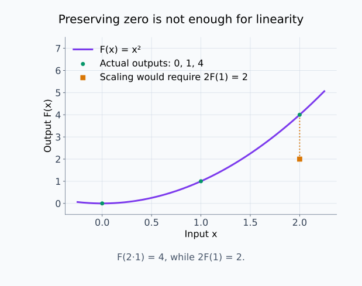
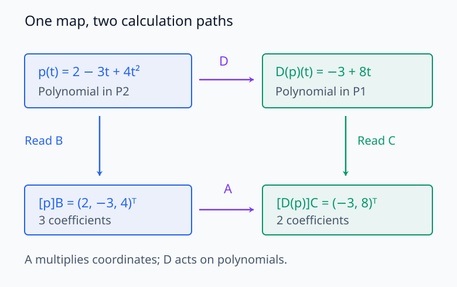
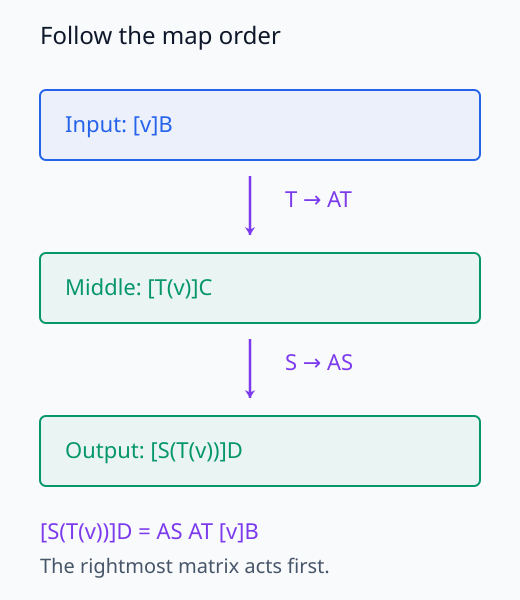
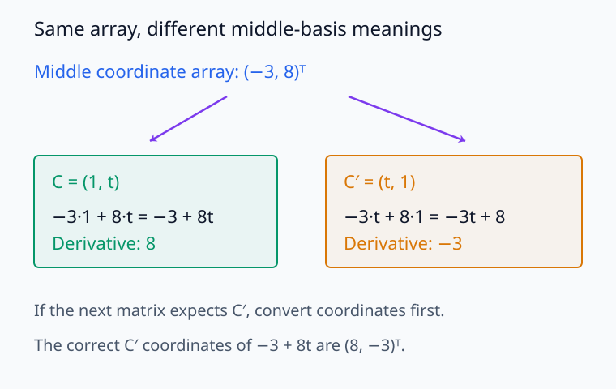
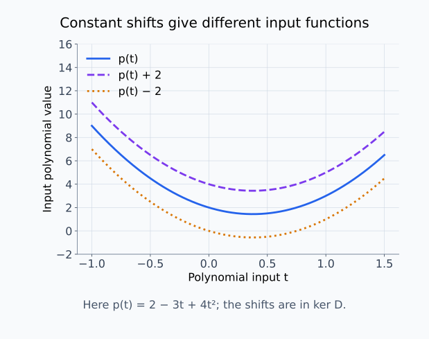
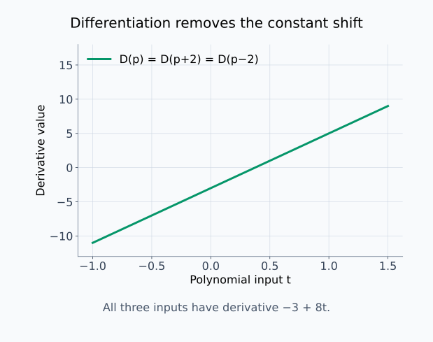
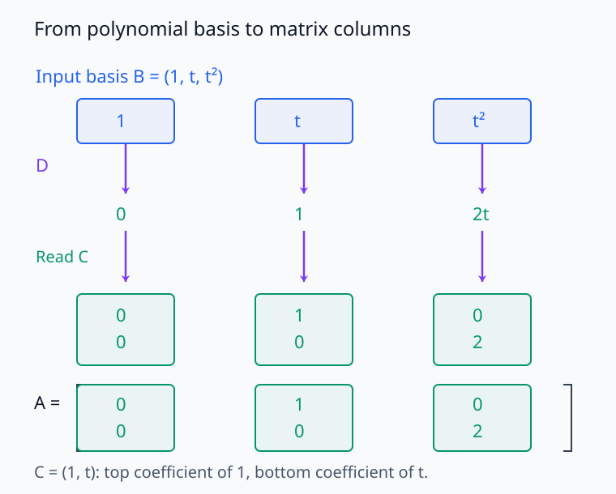

# M03-02. 선형사상과 행렬 표현

## 이 단원이 필요한 이유

행렬은 선형변환을 계산하는 도구지만 선형변환 자체와 항상 같은 대상은 아니다. 함수나 다항식 사이의 미분 연산처럼 입력과 출력이 숫자 열이 아닌 선형사상도 있다. 기저를 고르면 이런 사상을 행렬로 나타낼 수 있다.

이 구분은 서로 다른 모델의 가중치나 표현을 비교할 때 중요하다. 같은 선형사상도 입력과 출력 기저가 바뀌면 행렬 원소가 달라진다. 행렬 원소 하나를 곧바로 사상의 고유한 의미로 해석하려면 먼저 기저가 고정되어 있는지 확인해야 한다.

## 학습 목표

이 단원을 마치면 다음을 할 수 있다.

- 선형사상의 정의를 덧셈 보존과 스칼라곱 보존으로 설명할 수 있다.
- 추상 벡터공간 사이의 사상이 선형인지 판정할 수 있다.
- 순서 있는 정의역 기저와 공역 기저에서 행렬 표현을 만들 수 있다.
- 좌표식 $[T(\mathbf v)]_{\mathcal C}=[T]_{\mathcal C\leftarrow\mathcal B}[\mathbf v]_{\mathcal B}$를 계산할 수 있다.
- 합성, kernel과 image를 사상과 행렬 표현 양쪽에서 연결할 수 있다.

## 선수지식 확인

- 선수 단원: [M03-01 추상 벡터공간](M03-01-abstract-vector-spaces.md)
- 선수 단원: [M02-04 행렬과 행렬곱](../M02/M02-04-matrices-matrix-multiplication.md)
- 선수 단원: [M02-08 kernel, image와 rank](../M02/M02-08-kernel-image-rank.md)
- 확인 질문: 추상 벡터와 기저 좌표를 구분할 수 있는가?
- 확인 질문: 행렬의 각 열이 표준기저벡터의 변환 결과라는 사실을 설명할 수 있는가?

기저 좌표나 행렬곱이 불분명하면 선수 단원을 먼저 복습한다.

## 기호와 용어

| 기호·용어 | Common spoken reading | 의미 | 조건 |
|---|---|---|---|
| $T:V\to W$ | `T maps V to W` | 정의역 $V$의 벡터를 공역 $W$의 벡터로 보내는 사상 | 이 단원에서는 선형사상 |
| $\mathcal B=(\mathbf b_1,\ldots,\mathbf b_n)$ | `the basis B consisting of b one through b n` | $V$의 순서 있는 기저 | $\dim V=n$ |
| $\mathcal C=(\mathbf c_1,\ldots,\mathbf c_m)$ | `the basis C consisting of c one through c m` | $W$의 순서 있는 기저 | $\dim W=m$ |
| $[T]_{\mathcal C\leftarrow\mathcal B}$ | `the matrix of T from the basis B to the basis C` | $T$의 기저별 행렬 표현 | $\mathbb R^{m\times n}$ |
| $\ker T$ | `the kernel of T` | $T(\mathbf v)=\mathbf 0_W$가 되는 입력의 집합 | $V$의 부분공간 |
| $\operatorname{im}T$ | `the image of T` | 가능한 모든 출력의 집합 | $W$의 부분공간 |

화살표 $\mathcal C\leftarrow\mathcal B$는 입력 좌표가 $\mathcal B$이고 출력 좌표가 $\mathcal C$라는 뜻이다.

## 핵심 개념 1. 선형사상은 선형결합을 보존한다

$T:V\to W$가 선형이라는 말은 모든 $\mathbf u,\mathbf v\in V$와 $\alpha,\beta\in\mathbb R$에 대해

\[
T(\alpha\mathbf u+\beta\mathbf v)
=
\alpha T(\mathbf u)+\beta T(\mathbf v)
\]

가 성립한다는 뜻이다.

이 식은 다음 두 조건을 한 번에 나타낸다.

\[
T(\mathbf u+\mathbf v)=T(\mathbf u)+T(\mathbf v)
\]

\[
T(\alpha\mathbf v)=\alpha T(\mathbf v)
\]

첫 조건은 입력을 먼저 더한 뒤 $T$를 적용해도, 각각에 $T$를 적용한 뒤 출력을 더해도 결과가 같다는 뜻이다. 둘째 조건도 입력에 scalar를 먼저 곱할지, 출력에 곱할지의 순서를 바꾸어도 같다는 뜻이다. 선형결합 식에서 $\alpha=\beta=1$로 놓으면 첫 조건을 얻고, $\beta=0$으로 놓으면 둘째 조건을 얻는다. 반대로 두 조건이 성립하면 $T(\alpha\mathbf u+\beta\mathbf v)=T(\alpha\mathbf u)+T(\beta\mathbf v)=\alpha T(\mathbf u)+\beta T(\mathbf v)$이므로 선형결합 식이 성립한다. 두 정의는 같은 조건을 나타낸다.

선형사상은 반드시 영벡터를 영벡터로 보낸다. 실제로

\[
T(\mathbf 0_V)
=
T(0\mathbf v)
=
0T(\mathbf v)
=
\mathbf 0_W
\]

이다. 따라서 $T(\mathbf 0_V)\ne\mathbf 0_W$이면 다른 계산 없이도 선형이 아니라고 판정할 수 있다.

다만 영벡터를 영벡터로 보낸다는 조건 하나만으로 선형성이 보장되지는 않는다. $F(x)=x^2$는 $F(0)=0$이지만 $F(2\cdot1)=4\ne2F(1)$이므로 스칼라곱을 보존하지 않는다. 영벡터 조건은 선형성을 부정하는 데 쓸 수 있는 필요조건이지 충분조건은 아니다.

<figure class="lesson-figure lesson-figure--wide" markdown="1">
  
  <figcaption>곡선이 원점을 지나도 선형은 아닐 수 있다. 입력 1을 두 배로 한 실제 출력은 4지만, 출력 1을 두 배로 하면 2이므로 두 경로가 일치하지 않는다.</figcaption>
</figure>

그래프의 주황색 사각형은 실제 함수값이 아니라 선형이라면 도달해야 할 값이다.

## 핵심 개념 2. 선형사상은 기저벡터의 출력으로 결정된다

$\mathcal B=(\mathbf b_1,\ldots,\mathbf b_n)$가 $V$의 기저라 하자. 임의의 $\mathbf v\in V$는

\[
\mathbf v
=
v_1\mathbf b_1+\cdots+v_n\mathbf b_n
\]

으로 유일하게 나타난다. 선형성 때문에

\[
T(\mathbf v)
=
v_1T(\mathbf b_1)+\cdots+v_nT(\mathbf b_n)
\]

이다. 따라서 모든 입력에서 $T$를 알기 위해서는 기저벡터 $n$개의 출력만 알면 된다.

이 사실이 행렬 표현을 만든다. 각 $T(\mathbf b_j)$를 공역 기저 $\mathcal C$의 좌표로 나타내 열로 세우면

\[
[T]_{\mathcal C\leftarrow\mathcal B}
=
\begin{bmatrix}
[T(\mathbf b_1)]_{\mathcal C}
&
\cdots
&
[T(\mathbf b_n)]_{\mathcal C}
\end{bmatrix}
\]

이다. 이 행렬의 $j$번째 열은 정의역의 $j$번째 기저벡터가 어디로 가는지를 공역 좌표로 기록한다.

여기서 입력 기저벡터들이 독립이라는 사실과 그 출력들이 독립이라는 주장은 다르다. 서로 다른 기저벡터가 같은 출력으로 가거나 영벡터로 갈 수 있다. 입력의 표현은 유일하므로 출력끼리 중복되어도 $T(\mathbf v)$를 정하는 데 모호함은 없다. 다만 그때는 출력만으로 입력을 유일하게 복원하지 못할 수 있다.

## 핵심 개념 3. 행렬은 좌표 사이의 계산을 수행한다

$\mathbf v\in V$에 대해

\[
[T(\mathbf v)]_{\mathcal C}
=
[T]_{\mathcal C\leftarrow\mathcal B}
[\mathbf v]_{\mathcal B}
\]

이다.

shape을 확인하면

\[
\underbrace{[T(\mathbf v)]_{\mathcal C}}_{m\times1}
=
\underbrace{[T]_{\mathcal C\leftarrow\mathcal B}}_{m\times n}
\underbrace{[\mathbf v]_{\mathcal B}}_{n\times1}
\]

이다. 왼쪽은 추상 출력 $T(\mathbf v)$가 아니라 그 출력의 $\mathcal C$ 좌표다. 오른쪽 행렬도 $T$ 자체가 아니라 두 기저를 선택해 얻은 숫자 표현이다.

이 좌표식은 앞 절의 선형결합에서 나온다. $\mathbf v=\sum_j v_j\mathbf b_j$이면 $T(\mathbf v)=\sum_j v_jT(\mathbf b_j)$이고, M03-01에서 확인했듯 같은 기저에서 좌표 기록은 선형결합을 보존한다. 따라서

\[
[T(\mathbf v)]_{\mathcal C}
=\sum_{j=1}^n v_j[T(\mathbf b_j)]_{\mathcal C}
\]

이다. 오른쪽은 행렬의 $j$번째 열에 입력 좌표 $v_j$를 곱해 더하는 계산, 즉 행렬과 열벡터의 곱이다. 각 열에는 출력 기저의 계수 $m$개가 있고 입력 기저벡터는 $n$개이므로 행렬의 크기가 $m\times n$이다. 행렬을 만든다는 것은 추상 출력을 그대로 배열에 넣는 것이 아니라 그 출력의 계수 열을 넣는 것이다.

<figure class="lesson-figure lesson-figure--wide" markdown="1">
  
  <figcaption>예제 1의 다항식을 위쪽에서는 직접 미분하고, 아래쪽에서는 계수 열에 행렬을 곱한다. 도착한 두 출력은 같은 도함수와 그 좌표이지만, 다항식 자체와 숫자 열은 구분해야 한다.</figcaption>
</figure>

세 입력 계수가 두 출력 계수로 바뀌므로 이 행렬은 $2\times3$이다. 아래 경로의 행렬은 다음 예제에서 각 기저의 미분 결과로 구성한다.

## 핵심 개념 4. 합성은 행렬곱으로 표현된다

\[
T:V\to W,
\qquad
S:W\to U
\]

가 선형이고 각 공간의 순서 있는 기저가 $\mathcal B,\mathcal C,\mathcal D$라 하자. 그러면

\[
[S\circ T]_{\mathcal D\leftarrow\mathcal B}
=
[S]_{\mathcal D\leftarrow\mathcal C}
[T]_{\mathcal C\leftarrow\mathcal B}
\]

이다.

오른쪽 행렬이 먼저 $\mathcal B$ 좌표의 입력으로부터 $T(\mathbf v)$의 $\mathcal C$ 좌표를 계산하고, 왼쪽 행렬이 그 출력으로부터 $S(T(\mathbf v))$의 $\mathcal D$ 좌표를 계산한다. 같은 벡터의 좌표만 바꾸는 것이 아니라 두 사상을 차례로 적용하는 계산이다.

실제로

\[
[S(T(\mathbf v))]_{\mathcal D}
=[S]_{\mathcal D\leftarrow\mathcal C}[T(\mathbf v)]_{\mathcal C}
=[S]_{\mathcal D\leftarrow\mathcal C}
[T]_{\mathcal C\leftarrow\mathcal B}[\mathbf v]_{\mathcal B}
\]

이다. 따라서 합성을 나타내는 행렬에는 먼저 적용하는 $T$의 행렬이 오른쪽에 놓인다.

행렬곱의 크기가 맞는 것과 중간 기저가 맞는 것은 구분해야 한다. 한 행렬이 $W$의 어떤 기저로 출력한 숫자를 다음 행렬이 다른 기저의 좌표로 해석하면, 크기가 같아 행렬곱을 계산할 수는 있어도 위 합성을 나타내지는 않는다. 중간 출력 기저와 다음 입력 기저를 같은 순서로 맞추거나, 그 사이에 좌표변환을 넣어야 한다.

<figure class="lesson-figure" markdown="1">
  
  <figcaption>계산 경로에서는 T를 거친 중간 좌표가 S의 입력이 된다. 식에 두 행렬을 나란히 적으면 입력 열벡터에 가까운 오른쪽 행렬이 먼저 작용한다.</figcaption>
</figure>

<figure class="lesson-figure lesson-figure--wide" markdown="1">
  
  <figcaption>같은 숫자 열 (−3,8)ᵀ을 (1,t)의 좌표로 읽으면 −3+8t이고, (t,1)의 좌표로 읽으면 −3t+8이다. 그 다음에 미분해도 각각 8과 −3으로 달라진다. 크기가 맞아도 중간 기저를 확인해야 하는 이유다.</figcaption>
</figure>

두 번째 경로에 같은 다항식을 넘기려면 숫자를 그대로 넘기지 않고 기저 순서에 맞춰 $(8,-3)^\top$으로 바꿔야 한다.

## 핵심 개념 5. kernel과 image는 사상의 구조다

선형사상 $T:V\to W$의 kernel과 image는

\[
\ker T
=
\{\mathbf v\in V:T(\mathbf v)=\mathbf 0_W\}
\]

\[
\operatorname{im}T
=
\{T(\mathbf v):\mathbf v\in V\}
\]

이다. 기저를 고르면 이들은 행렬의 null space와 column space 좌표로 계산할 수 있다.

행렬 표현을 $\mathbf A=[T]_{\mathcal C\leftarrow\mathcal B}$라 쓰자. 벡터가 영벡터일 때에만 모든 기저 계수가 0이므로, 좌표식에서

\[
\mathbf v\in\ker T
\quad\Longleftrightarrow\quad
\mathbf A[\mathbf v]_{\mathcal B}=\mathbf 0
\]

를 얻는다. 행렬의 null space에 속한 열벡터는 원래 kernel 벡터 자체가 아니라 그 벡터의 $\mathcal B$ 좌표다. 그 계수로 기저벡터를 조립하면 $\ker T$의 원소를 얻는다.

마찬가지로 입력 좌표 $\mathbf x\in\mathbb R^n$가 모든 열벡터를 지날 때 $\mathbf A\mathbf x$는 column space 전체를 지난다. 따라서 column space의 열벡터는 $\operatorname{im}T$의 원소를 $\mathcal C$ 기저로 기록한 좌표다. 각 공간에서 좌표를 읽고 다시 조립하는 과정은 일대일로 대응하고 선형결합을 보존한다. 그러므로 생성과 선형독립도 유지되어, kernel과 image의 차원을 각각 행렬의 nullity와 rank로 계산할 수 있다.

기저가 바뀌면 kernel 벡터의 좌표와 image 벡터의 좌표는 달라진다. 그러나 어떤 추상 벡터가 kernel에 속하는지, image의 차원이 얼마인지는 사상 자체의 성질이다.

<figure class="lesson-figure lesson-figure--wide" markdown="1">
  
  <figcaption>예제 1의 p(t)와 여기에 상수 2를 더하거나 뺀 다항식은 서로 다른 입력이다. 곡선의 수직 이동은 미분으로 사라지는 상수 방향의 차이를 보여 준다.</figcaption>
</figure>

<figure class="lesson-figure lesson-figure--wide" markdown="1">
  
  <figcaption>세 입력의 도함수는 모두 −3+8t로 겹친다. 입력의 차이가 kernel에 있으면 같은 출력이 나올 수 있으므로, 이 출력만으로 원래 상수항을 복원할 수 없다.</figcaption>
</figure>

위 두 그림은 서로 다른 입력과 같은 출력을 나누어 보여 준다. 출력에서 사라진 것은 모든 입력 정보가 아니라 상수 방향의 차이다.

## 예제 1. 다항식 미분의 행렬 표현

### 문제

미분사상

\[
D:\mathcal P_2\to\mathcal P_1,
\qquad
D(p)=p'
\]

를 생각하자. 정의역 기저를

\[
\mathcal B=(1,t,t^2)
\]

로, 공역 기저를

\[
\mathcal C=(1,t)
\]

로 잡는다. $[D]_{\mathcal C\leftarrow\mathcal B}$를 구하고 $p(t)=2-3t+4t^2$의 도함수를 행렬로 계산하라.

### 풀이

정의역 기저벡터를 미분하면

\[
D(1)=0,
\qquad
D(t)=1,
\qquad
D(t^2)=2t
\]

이다. 각 결과의 $\mathcal C$ 좌표는

\[
[D(1)]_{\mathcal C}
=
\begin{bmatrix}0\\0\end{bmatrix},
\quad
[D(t)]_{\mathcal C}
=
\begin{bmatrix}1\\0\end{bmatrix},
\quad
[D(t^2)]_{\mathcal C}
=
\begin{bmatrix}0\\2\end{bmatrix}
\]

이다. 따라서

\[
[D]_{\mathcal C\leftarrow\mathcal B}
=
\begin{bmatrix}
0&1&0\\
0&0&2
\end{bmatrix}
\]

이다.

\[
[p]_{\mathcal B}
=
\begin{bmatrix}
2\\
-3\\
4
\end{bmatrix}
\]

이므로

\[
[D(p)]_{\mathcal C}
=
\begin{bmatrix}
0&1&0\\
0&0&2
\end{bmatrix}
\begin{bmatrix}
2\\
-3\\
4
\end{bmatrix}
=
\begin{bmatrix}
-3\\
8
\end{bmatrix}
\]

이다. 따라서 $D(p)(t)=-3+8t$다.

### 결과의 의미

미분사상은 다항식을 다항식으로 보내는 추상 연산이다. 기저를 고른 뒤에는 $2\times3$ 행렬로 계산할 수 있다.

<figure class="lesson-figure lesson-figure--wide" markdown="1">
  
  <figcaption>세 입력 기저를 하나씩 미분한 결과 0,1,2t를 출력 기저 (1,t)의 계수로 기록한다. 이 계수 열을 입력 기저 순서대로 놓은 것이 미분행렬이며, 첫 열이 0인 것은 상수 기저가 영다항식으로 간다는 뜻이다.</figcaption>
</figure>

같은 열 안에서 위 숫자는 상수 기저의 계수, 아래 숫자는 $t$ 기저의 계수다. 열의 순서와 행의 의미를 함께 읽는다.

## 예제 2. 선형이 아닌 사상 판정하기

### 문제

\[
F:\mathbb R^2\to\mathbb R^2,
\qquad
F(\mathbf x)=\mathbf A\mathbf x+\mathbf b
\]

에서 $\mathbf b\ne\mathbf 0$일 때 $F$가 선형인지 판정하라.

### 풀이

\[
F(\mathbf 0)
=
\mathbf A\mathbf 0+\mathbf b
=
\mathbf b
\ne
\mathbf 0
\]

이다. 선형사상은 영벡터를 영벡터로 보내야 하므로 $F$는 선형이 아니다.

### 결과의 의미

신경망 층의 $\mathbf W\mathbf x+\mathbf b$는 bias가 0이 아니면 affine 사상이다. 구현에서 linear layer라고 부르더라도 수학적으로는 affine일 수 있다.

## 예제 3. 모델 가중치행렬을 표현으로 읽기

activation 공간을 $V=\mathbb R^d$, 다음 층의 pre-activation 공간을 $W=\mathbb R^m$라 하고 bias를 제외한 사상을

\[
T(\mathbf h)=\mathbf W\mathbf h
\]

로 정의하자. 표준기저를 쓰면 $[T]_{\mathcal E_W\leftarrow\mathcal E_V}=\mathbf W$다.

$\mathbf W$의 $j$번째 열은 입력 표준기저벡터 $\mathbf e_j$의 출력 좌표다.

\[
T(\mathbf e_j)=\mathbf W\mathbf e_j
\]

따라서 열 하나는 선택한 입력 좌표 방향 하나에 대한 반응을 기록한다. 이 열의 의미는 입력 기저와 출력 기저에 의존한다. 선형사상 $T$와 특정 표준기저에서 저장된 배열 $\mathbf W$를 구분해야 한다.

## 흔한 오해

### 오해 1. 모든 선형사상은 처음부터 행렬이다

선형사상은 벡터공간 사이의 함수다. 유한차원 공간에서 입력과 출력 기저를 고르면 행렬로 표현할 수 있다.

### 오해 2. 행렬의 $j$번째 열은 언제나 $T(\mathbf e_j)$다

정의역 기저가 표준기저이고 공역 좌표도 표준기저일 때 그렇게 쓸 수 있다. 일반적으로 $j$번째 열은 $[T(\mathbf b_j)]_{\mathcal C}$다.

### 오해 3. $T(\mathbf x)=\mathbf A\mathbf x+\mathbf b$는 항상 선형이다

$\mathbf b\ne\mathbf 0$이면 영벡터를 영벡터로 보내지 않으므로 affine 사상이지 선형사상이 아니다.

### 오해 4. 항등사상은 모든 기저 조합에서 항등행렬이다

정의역과 공역에 같은 순서의 기저를 쓸 때 항등사상의 행렬이 $\mathbf I$다. 서로 다른 기저를 쓰면 항등사상의 행렬은 좌표변환행렬이 된다.

## 연습문제

### 1. 선형성 판정

\[
T:\mathcal P_2\to\mathbb R,
\qquad
T(p)=p(1)
\]

이 선형인지 판정하라.

해설 보기

$p,q\in\mathcal P_2$와 $\alpha,\beta\in\mathbb R$에 대해

\[
T(\alpha p+\beta q)
=(\alpha p+\beta q)(1)
=\alpha p(1)+\beta q(1)
=\alpha T(p)+\beta T(q)
\]

이다. 따라서 선형이다. 이를 점 $1$에서의 평가사상이라고 부른다.

### 2. 선형이 아닌 함수

\[
F:\mathbb R\to\mathbb R,
\qquad
F(x)=x^2
\]

가 선형이 아님을 반례 하나로 보여라.

해설 보기

$F(2\cdot1)=F(2)=4$지만 $2F(1)=2$다. 스칼라곱을 보존하지 않으므로 선형이 아니다.

### 3. 행렬 표현 만들기

$T:\mathbb R^2\to\mathbb R^2$가

\[
T(x,y)^\top=(x+y,x-y)^\top
\]

로 주어진다. 정의역과 공역에 표준기저를 쓸 때 행렬을 구하라.

해설 보기

\[
T(\mathbf e_1)
=
\begin{bmatrix}1\\1\end{bmatrix},
\qquad
T(\mathbf e_2)
=
\begin{bmatrix}1\\-1\end{bmatrix}
\]

이므로 두 출력을 열로 세워

\[
[T]_{\mathcal E\leftarrow\mathcal E}
=
\begin{bmatrix}
1&1\\
1&-1
\end{bmatrix}
\]

을 얻는다.

### 4. 좌표식 계산

앞 문제의 행렬과 $\mathbf v=(3,2)^\top$를 사용해 $T(\mathbf v)$를 구하라.

해설 보기

\[
\begin{bmatrix}
1&1\\
1&-1
\end{bmatrix}
\begin{bmatrix}
3\\
2
\end{bmatrix}
=
\begin{bmatrix}
5\\
1
\end{bmatrix}
\]

이다. 직접 식에 대입해도 $(3+2,3-2)^\top=(5,1)^\top$을 얻는다.

### 5. 미분사상의 kernel과 image

예제 1의 $D:\mathcal P_2\to\mathcal P_1$에서 $\ker D$와 $\operatorname{im}D$를 구하라.

해설 보기

도함수가 영다항식인 다항식은 상수다. 따라서

\[
\ker D=\operatorname{span}\{1\}
\]

이다. 임의의 $a+bt\in\mathcal P_1$은

\[
D(at+\tfrac{b}{2}t^2)=a+bt
\]

로 얻을 수 있으므로

\[
\operatorname{im}D=\mathcal P_1
\]

이다.

### 6. 합성의 행렬

\[
\mathbf A=
\begin{bmatrix}
1&2\\
0&1
\end{bmatrix},
\qquad
\mathbf B=
\begin{bmatrix}
2&0\\
1&3
\end{bmatrix}
\]

가 표준기저에서 각각 $T$와 $S$를 나타낸다. $S\circ T$의 행렬을 구하라.

해설 보기

$T$가 먼저 적용되므로

\[
[S\circ T]=\mathbf B\mathbf A
=
\begin{bmatrix}
2&0\\
1&3
\end{bmatrix}
\begin{bmatrix}
1&2\\
0&1
\end{bmatrix}
=
\begin{bmatrix}
2&4\\
1&5
\end{bmatrix}
\]

이다. 행렬 순서를 바꾸면 일반적으로 다른 합성을 나타낸다.

### 7. 모델 주장 비판

“가중치행렬의 한 원소가 크므로 그 원소는 기저와 무관하게 중요한 feature 연결이다”라는 주장을 비판하라.

해설 보기

행렬 원소는 입력과 출력 기저를 선택한 뒤 얻은 좌표값이다. 기저를 바꾸면 같은 선형사상도 다른 행렬 원소를 갖는다. 고정된 구현 좌표에서 민감도나 개입 효과를 측정할 수는 있지만, 원소 크기만으로 기저와 무관한 feature 중요도를 결론 내릴 수 없다.

## 단원 요약

- 선형사상은 모든 선형결합을 보존하는 벡터공간 사이의 함수다.
- 유한차원 선형사상은 정의역 기저벡터의 출력으로 결정된다.
- 행렬 표현의 각 열은 정의역 기저벡터 출력의 공역 좌표다.
- 행렬은 추상 입력이 아니라 입력 좌표를 받아 출력 좌표를 만든다.
- 사상의 합성은 기저가 맞을 때 행렬곱으로 표현된다.
- kernel과 image는 사상의 구조이며 기저를 고르면 좌표 계산으로 구할 수 있다.

## 통과 기준

다음 질문에 자료를 보지 않고 답할 수 있으면 통과한다.

- 사상의 선형성을 선형결합 보존 식으로 검사할 수 있는가?
- 기저벡터의 출력으로 행렬 표현을 만들 수 있는가?
- 행렬 표현의 아래첨자와 shape을 읽을 수 있는가?
- 다항식 미분사상을 행렬로 계산할 수 있는가?
- 합성사상의 행렬곱 순서를 정할 수 있는가?
- 사상과 특정 기저에서의 행렬을 구분할 수 있는가?

## 다음 단원

- [M03-03 기저변환과 좌표 의존성](M03-03-change-of-basis-coordinate-dependence.md)

## 집필자 점검표

- [x] 학습 목표가 관찰 가능한 행동으로 작성됐다.
- [x] 선형사상과 행렬 표현을 구분했다.
- [x] 정의역·공역 기저와 행렬 아래첨자를 일관되게 썼다.
- [x] 다항식 미분 예제를 직접 계산했다.
- [x] 합성, kernel과 image를 연결했다.
- [x] 모든 문제에 해설이 있다.
- [x] 모델 해석 주장의 강도를 구분했다.
- [x] 용어집과 표기 규칙을 따랐다.
- [x] 선수지식 밖의 내용을 몰래 요구하지 않는다.
- [x] 내부 링크와 수식 구분자를 확인했다.
- [x] Common spoken reading이 실제 영어 학술 발화이며 한글 음역이나 기계적 직역을 포함하지 않는다.
