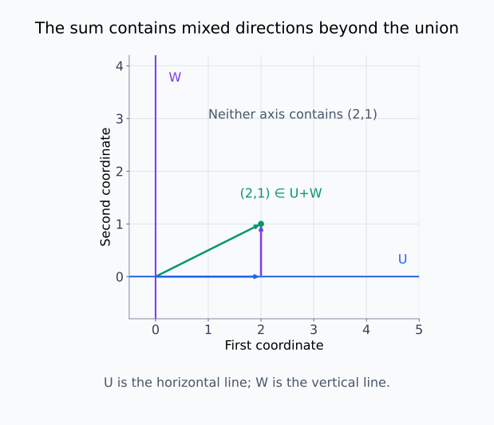
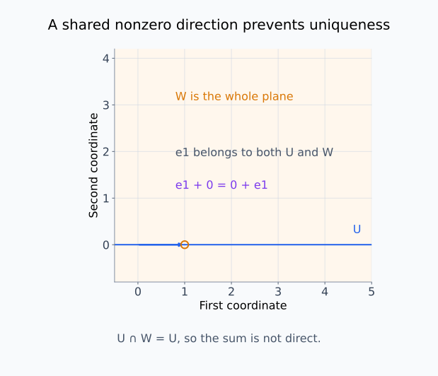
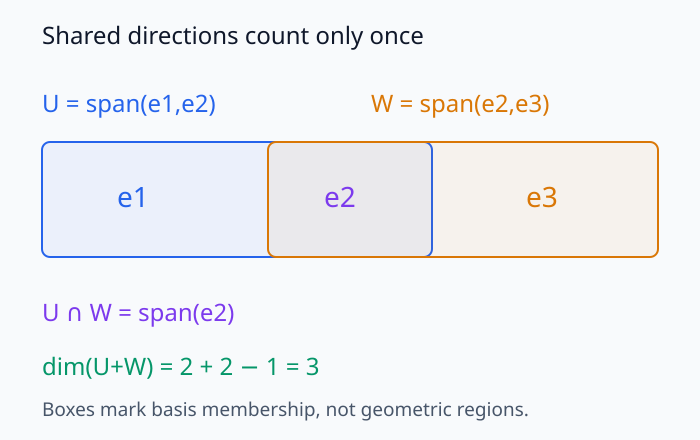
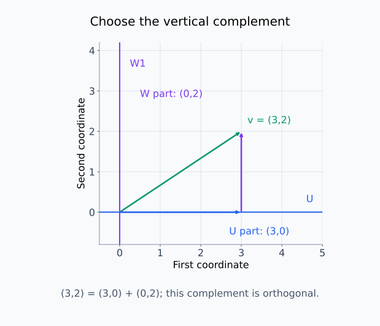
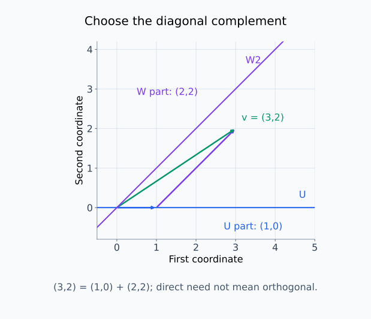
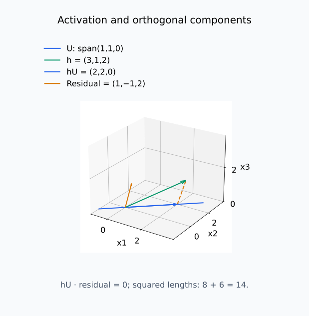
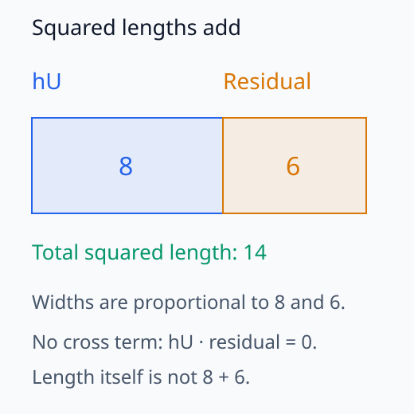

# M03-05. 부분공간, 직합과 분해

## 이 단원이 필요한 이유

표현공간을 여러 성분으로 나눌 때 각 성분이 부분공간인지, 서로 겹치는지, 원래 벡터를 유일하게 복원하는지 확인해야 한다. 두 부분공간의 벡터를 더해 원래 공간을 만들 수 있어도 분해가 유일하지 않을 수 있다. 겹침이 없는 직합(direct sum)은 이 유일성을 보장한다.

모델 해석에서는 activation을 특정 feature 부분공간과 나머지 성분으로 분해하거나, 저랭크 부분공간에 투영한 뒤 잔차를 분석한다. 분해 결과는 선택한 부분공간과 내적에 의존한다. 부분공간에서 정보를 복원했다는 결과만으로 모델이 그 부분공간을 기능적으로 사용한다고 결론 내릴 수는 없다.

## 학습 목표

이 단원을 마치면 다음을 할 수 있다.

- 두 부분공간의 합과 교집합을 정의하고 작은 예제에서 구할 수 있다.
- 부분공간의 합이 직합인지 교집합으로 판정할 수 있다.
- 직합에서 벡터 분해가 유일함을 설명할 수 있다.
- 차원 공식을 사용해 부분공간 합의 차원을 계산할 수 있다.
- 직교여공간과 정사영으로 벡터를 신호 성분과 잔차로 분해할 수 있다.
- 모델 표현의 부분공간 분해가 허용하는 주장과 허용하지 않는 주장을 구분할 수 있다.

## 선수지식 확인

- 선수 단원: [M03-01 추상 벡터공간](M03-01-abstract-vector-spaces.md)
- 선수 단원: [M02-08 kernel, image와 rank](../M02/M02-08-kernel-image-rank.md)
- 선수 단원: [M02-09 직교기저와 정사영](../M02/M02-09-orthogonal-basis-projection.md)
- 확인 질문: 부분공간을 영벡터 포함과 연산의 닫힘으로 판정할 수 있는가?
- 확인 질문: 정규직교기저를 사용해 벡터를 부분공간에 정사영할 수 있는가?

부분공간과 정사영 계산이 불분명하면 선수 단원을 먼저 복습한다.

## 기호와 용어

| 기호·용어 | Common spoken reading | 의미 | 조건 |
|---|---|---|---|
| $U,W$ | `U and W` | 벡터공간 $V$의 부분공간 | $U,W\le V$ |
| $U+W$ | `U plus W` | $\mathbf u+\mathbf w$ 꼴 벡터들의 부분공간 | $\mathbf u\in U,\mathbf w\in W$ |
| $U\cap W$ | `U intersection W` | 두 부분공간에 모두 속하는 벡터들의 공간 | 적어도 영벡터를 포함한다. |
| $U\oplus W$ | `U direct sum W` | 교집합이 영공간인 부분공간 합 | 각 벡터의 분해가 유일하다. |
| $U^\perp$ | `U perp` | $U$의 모든 벡터와 직교하는 벡터들의 공간 | 내적이 정해져야 한다. |
| $\operatorname{proj}_U\mathbf x$ | `the projection of x onto U` | $U$에서 $\mathbf x$에 가장 가까운 벡터 | Euclidean 내적 기준 |

## 핵심 개념 1. 부분공간의 합은 두 공간의 성분을 더해 만든다

$U,W\le V$는 $U,W$가 $V$의 부분공간이라는 뜻이다. 두 부분공간의 합을

\[
U+W
=
\{\mathbf u+\mathbf w:\mathbf u\in U,\ \mathbf w\in W\}
\]

로 정의한다. $U+W$는 $U\cup W$와 다르다. 합에는 두 공간의 벡터를 섞은 선형결합도 들어간다.

$U,W$에는 각각 영벡터가 있으므로 $\mathbf u=\mathbf u+\mathbf 0$과 $\mathbf w=\mathbf 0+\mathbf w$도 이 합에 속한다. 따라서 합은 두 부분공간을 모두 포함한다. 또한 $\alpha\mathbf u\in U$, $\beta\mathbf w\in W$이므로 $\alpha\mathbf u+\beta\mathbf w$처럼 계수를 붙인 결합도 같은 정의에 들어간다. 정의의 한 항 $\mathbf u$나 $\mathbf w$가 생성벡터 하나로 제한되는 것은 아니다.

$U+W$는 $V$의 부분공간이다. 영벡터는 $\mathbf 0_U+\mathbf 0_W$로 쓸 수 있다. 두 원소

\[
\mathbf x=\mathbf u_1+\mathbf w_1,
\qquad
\mathbf y=\mathbf u_2+\mathbf w_2
\]

를 더하면

\[
\mathbf x+\mathbf y
=
(\mathbf u_1+\mathbf u_2)+(\mathbf w_1+\mathbf w_2)
\]

이고 각 괄호는 해당 부분공간에 남는다. 스칼라곱도 같은 방식으로 닫혀 있다.

<figure class="lesson-figure lesson-figure--wide" markdown="1">
  
  <figcaption>수평 부분공간과 수직 부분공간에서 각각 (2,0)ᵀ과 (0,1)ᵀ을 골라 더하면 (2,1)ᵀ을 얻는다. 이 끝점은 두 축 어느 쪽에도 없지만 부분공간의 합에는 속한다.</figcaption>
</figure>

합집합은 두 축만 포함한다. 반면 두 성분의 크기를 자유롭게 고르는 합은 이 평면의 모든 끝점을 만들 수 있다.

## 핵심 개념 2. 교집합은 두 분해 성분의 겹침을 나타낸다

\[
U\cap W
=
\{\mathbf v\in V:\mathbf v\in U\text{이고 }\mathbf v\in W\}
\]

이다. 두 부분공간은 영벡터를 함께 가지므로 교집합이 공집합일 수 없다.

교집합에 영벡터가 아닌 $\mathbf z$가 있으면 같은 벡터를 여러 방식으로 나눌 수 있다. $\mathbf x=\mathbf u+\mathbf w$라 할 때

\[
\mathbf x
=
(\mathbf u+\mathbf z)+(\mathbf w-\mathbf z)
\]

도 같은 분해다. $\mathbf z\in U$이므로 $\mathbf u+\mathbf z\in U$이고, $\mathbf z\in W$이므로 $\mathbf w-\mathbf z\in W$다.

<figure class="lesson-figure lesson-figure--wide" markdown="1">
  
  <figcaption>예제 2에서는 평면 전체인 W가 수평선 U를 포함한다. 표시한 e₁을 U 성분에 모두 넣거나 W 성분에 모두 넣어도 합은 같으므로 분해가 유일하지 않다.</figcaption>
</figure>

이 겹침은 원점 한 점의 공유가 아니라, 어느 쪽 성분으로도 옮길 수 있는 비영 방향의 공유다.

## 핵심 개념 3. 직합은 유일한 분해를 보장한다

\[
V=U\oplus W
\]

라는 표기는 다음 두 조건을 뜻한다.

1. $V=U+W$
2. $U\cap W=\{\mathbf 0\}$

이 조건에서 모든 $\mathbf v\in V$는

\[
\mathbf v=\mathbf u+\mathbf w
\]

로 유일하게 분해된다.

유일성을 확인하려면 두 분해를 가정한다.

\[
\mathbf v
=
\mathbf u_1+\mathbf w_1
=
\mathbf u_2+\mathbf w_2
\]

그러면

\[
\mathbf u_1-\mathbf u_2
=
\mathbf w_2-\mathbf w_1
\]

이다. 왼쪽은 $U$에 있고 오른쪽은 $W$에 있으므로 이 벡터는 $U\cap W$에 있다. 교집합이 영공간이면 두 차이는 모두 영벡터이고

\[
\mathbf u_1=\mathbf u_2,
\qquad
\mathbf w_1=\mathbf w_2
\]

다.

## 핵심 개념 4. 차원 공식은 겹친 방향을 한 번 뺀다

유한차원 부분공간에서는

\[
\dim(U+W)
=
\dim U+\dim W-\dim(U\cap W)
\]

가 성립한다. $U$와 $W$의 차원을 더하면 교집합의 방향을 두 번 세므로 한 번 뺀다.

기저를 선택하는 과정으로 이 계산을 확인할 수 있다. $k=\dim(U\cap W)$, $p=\dim U$, $q=\dim W$라 하자. 먼저 교집합의 기저 $k$개를 고른다. 현재 span 밖의 벡터를 추가하면서 이를 $U$의 기저로 늘리면 $p-k$개가 추가되고, 같은 교집합 기저를 $W$의 기저로 늘리면 $q-k$개가 추가된다.

교집합의 기저는 한 번만 넣고 두 쪽의 추가 벡터를 함께 모으면 $U+W$를 생성한다. 이 목록은 선형독립이기도 하다.

목록의 선형결합이 0이라고 가정하면, $U$ 쪽 추가 벡터들의 결합은 공통 기저와 $W$ 쪽 벡터들의 결합을 음수로 바꾼 것과 같다. 따라서 그 벡터는 $U\cap W$에 있다. 그러나 $U$의 기저는 공통 기저와 추가 벡터를 함께 포함하므로, 추가 벡터들의 결합이 공통 기저의 span에 있으려면 추가 계수가 모두 0이어야 한다. 남은 식에서도 $W$의 기저 독립성을 적용하면 나머지 계수가 0이다.

따라서 합의 기저 크기는 $k+(p-k)+(q-k)=p+q-k$다. “겹친 방향을 뺀다”는 설명은 임의로 고른 두 기저에 같은 열이 보인다는 뜻이 아니라, 공통 부분공간의 기저를 한 번만 센다는 뜻이다.

직합이면 $U\cap W=\{\mathbf 0\}$이고 영공간의 차원은 0이므로

\[
\dim(U\oplus W)
=
\dim U+\dim W
\]

이다.

차원만 맞는다고 직합이 되는 것은 아니다. 합이 전체 공간을 만드는지와 교집합이 영공간인지 함께 확인해야 한다.

<figure class="lesson-figure lesson-figure--wide" markdown="1">
  
  <figcaption>작은 좌표 예시에서 U=span{e₁,e₂}와 W=span{e₂,e₃}는 e₂ 방향을 공유한다. 합의 기저에서는 이를 한 번만 넣으므로 독립 방향은 세 개다.</figcaption>
</figure>

사각형의 겹침은 기저 방향이 어느 공간에 속하는지 표시한 것이다. 실제 부분공간을 유한한 사각형 영역으로 그린 것은 아니다.

## 핵심 개념 5. 여공간은 전체 공간의 나머지 방향을 채운다

$V=U\oplus W$를 만족하는 $W$를 $U$의 여공간(complement)이라고 한다. 한 부분공간의 여공간은 일반적으로 여러 개다.

예를 들어 $V=\mathbb R^2$와 $U=\operatorname{span}\{(1,0)^\top\}$에서

\[
W_1=\operatorname{span}\{(0,1)^\top\}
\]

과

\[
W_2=\operatorname{span}\{(1,1)^\top\}
\]

는 모두 $U$의 여공간이다. 두 직선 모두 $U$와 영벡터에서만 만나고 $U$와 함께 $\mathbb R^2$를 생성한다.

같은 벡터 $(a,b)^\top$을 두 여공간으로 나누면

\[
\begin{bmatrix}a\\b\end{bmatrix}
=\underbrace{\begin{bmatrix}a\\0\end{bmatrix}}_{\in U}
+\underbrace{\begin{bmatrix}0\\b\end{bmatrix}}_{\in W_1}
=\underbrace{\begin{bmatrix}a-b\\0\end{bmatrix}}_{\in U}
+\underbrace{\begin{bmatrix}b\\b\end{bmatrix}}_{\in W_2}
\]

다. 각각의 여공간을 고정하면 분해는 유일하지만, 여공간을 바꾸면 $U$ 성분도 달라질 수 있다. 따라서 여공간은 벡터에서 자동으로 정해지는 나머지가 아니라 분해를 위해 선택한 부분공간이다. 직합은 직교 조건을 요구하지 않으며 $W_2$는 Euclidean 내적에서 $U$와 직교하지 않는다.

내적이 정해지면 직교여공간

\[
U^\perp
=
\{\mathbf v\in V:\langle\mathbf v,\mathbf u\rangle=0
\text{ for every }\mathbf u\in U\}
\]

을 고를 수 있다. 유한차원 내적공간에서는

\[
V=U\oplus U^\perp
\]

이다.

$U^\perp$에 속하려면 $U$의 벡터 하나가 아니라 모든 벡터와 직교해야 한다. 실제 계산에서는 $U$의 기저벡터들과의 내적이 모두 0인지 확인하면 된다. 임의의 $\mathbf u\in U$는 그 기저의 선형결합이므로, 내적의 선형성에 의해 나머지 벡터들과의 내적도 0이기 때문이다. 내적을 바꾸면 이 판정식이 바뀌므로 직교여공간의 선택도 달라질 수 있다.

<figure class="lesson-figure lesson-figure--wide" markdown="1">
  
  <figcaption>본문의 (a,b)에 (3,2)를 대입했다. 수직 여공간 W₁을 고르면 U 성분은 (3,0)ᵀ, W₁ 성분은 (0,2)ᵀ이다.</figcaption>
</figure>

<figure class="lesson-figure lesson-figure--wide" markdown="1">
  
  <figcaption>대각선 여공간 W₂를 고르면 같은 벡터의 U 성분이 (1,0)ᵀ으로 달라진다. 두 부분공간이 원점에서만 만나는 직합이어도 두 성분이 직교할 필요는 없다.</figcaption>
</figure>

두 그림의 초록색 벡터는 같지만 파란색 성분은 다르다. 유일성은 여공간을 하나로 고정한 뒤의 성질이다.

## 핵심 개념 6. 정사영은 직교 직합의 두 성분을 계산한다

Euclidean 공간 $\mathbb R^n$에서 $\mathbf P_U$를 $U$ 위로의 정사영행렬이라 하면

\[
\mathbf x
=
\underbrace{\mathbf P_U\mathbf x}_{\mathbf x_U\in U}
+
\underbrace{(\mathbf I-\mathbf P_U)\mathbf x}_{\mathbf x_\perp\in U^\perp}
\]

이다. 두 성분은 직교한다.

\[
\langle\mathbf x_U,\mathbf x_\perp\rangle=0
\]

잔차가 $U^\perp$에 있다는 조건은 $\mathbf x_U$ 한 벡터와 직교한다는 조건보다 강하다. M02-09처럼 $U$의 정규직교기저를 열로 쌓은 $\mathbf Q$를 쓰면 $\mathbf P_U=\mathbf Q\mathbf Q^\top$이며

\[
\mathbf Q^\top\mathbf x_\perp
=\mathbf Q^\top(\mathbf I-\mathbf Q\mathbf Q^\top)\mathbf x
=\mathbf Q^\top\mathbf x-\mathbf Q^\top\mathbf x
=\mathbf 0
\]

이다. 각 기저벡터와 잔차의 내적이 0이므로 잔차는 $U$의 모든 벡터와 직교한다. 따라서 모든 $\mathbf x$가 $U+U^\perp$에 속한다. 또한 $\mathbf z\in U\cap U^\perp$이면 자기 자신과도 직교하여 $\langle\mathbf z,\mathbf z\rangle=0$이므로 $\mathbf z=\mathbf 0$다. 두 조건을 함께 사용하면 이 합이 직합임을 얻는다.

합의 제곱 norm을 전개하면 두 성분의 제곱 norm에 $2\langle\mathbf x_U,\mathbf x_\perp\rangle$이 더해진다. 위 직교 조건으로 이 교차항이 0이므로 Pythagorean 관계

\[
\|\mathbf x\|_2^2
=
\|\mathbf x_U\|_2^2+\|\mathbf x_\perp\|_2^2
\]

가 성립한다. 이 분해는 부분공간 $U$와 내적을 고정했을 때 유일하다.

## 예제 1. 좌표 부분공간의 직합

### 문제

$V=\mathbb R^3$에서

\[
U=\operatorname{span}
\left\{
\begin{bmatrix}1\\0\\0\end{bmatrix},
\begin{bmatrix}0\\1\\0\end{bmatrix}
\right\},
\qquad
W=\operatorname{span}
\left\{
\begin{bmatrix}0\\0\\1\end{bmatrix}
\right\}
\]

라 하자. $V=U\oplus W$임을 확인하고

\[
\mathbf x=
\begin{bmatrix}
2\\
-1\\
4
\end{bmatrix}
\]

를 분해하라.

### 풀이

$U$의 벡터는 $(a,b,0)^\top$ 꼴이고 $W$의 벡터는 $(0,0,c)^\top$ 꼴이다. 두 꼴을 모두 만족하는 벡터는 영벡터뿐이므로

\[
U\cap W=\{\mathbf 0\}
\]

이다. 모든 $(x_1,x_2,x_3)^\top$은

\[
\begin{bmatrix}
x_1\\x_2\\x_3
\end{bmatrix}
=
\begin{bmatrix}
x_1\\x_2\\0
\end{bmatrix}
+
\begin{bmatrix}
0\\0\\x_3
\end{bmatrix}
\]

로 쓸 수 있으므로 $U+W=V$다. 따라서 $V=U\oplus W$다.

주어진 벡터의 분해는

\[
\mathbf x
=
\underbrace{
\begin{bmatrix}
2\\-1\\0
\end{bmatrix}}_{\in U}
+
\underbrace{
\begin{bmatrix}
0\\0\\4
\end{bmatrix}}_{\in W}
\]

이다.

### 결과의 의미

$U$는 첫 두 좌표 성분을 담고 $W$는 셋째 좌표 성분을 담는다. 두 부분공간이 겹치지 않으므로 세 좌표를 두 성분으로 나누는 방법이 유일하다.

## 예제 2. 합이 직합이 아닌 경우

### 문제

$V=\mathbb R^2$에서

\[
U=\operatorname{span}\{\mathbf e_1\},
\qquad
W=\mathbb R^2
\]

라 하자. $U+W$와 $U\cap W$를 구하고 $\mathbf e_1$의 서로 다른 두 분해를 제시하라.

### 풀이

$U\subset W$이므로

\[
U+W=W=\mathbb R^2
\]

이고

\[
U\cap W=U
\]

이다. 교집합에 영벡터가 아닌 $\mathbf e_1$이 있으므로 합은 직합이 아니다.

\[
\mathbf e_1
=
\mathbf e_1+\mathbf 0
\]

과

\[
\mathbf e_1
=
\mathbf 0+\mathbf e_1
\]

은 각각 첫 성분이 $U$, 둘째 성분이 $W$에 속하는 서로 다른 분해다.

### 결과의 의미

두 부분공간이 전체 공간을 생성한다는 조건만으로는 유일한 성분 분해를 얻지 못한다.

## 예제 3. activation을 방향과 잔차로 분해하기

정규화된 방향

\[
\mathbf u
=
\frac{1}{\sqrt2}
\begin{bmatrix}
1\\
1\\
0
\end{bmatrix}
\]

이 생성하는 부분공간을 $U=\operatorname{span}\{\mathbf u\}$라 하자. activation

\[
\mathbf h=
\begin{bmatrix}
3\\
1\\
2
\end{bmatrix}
\]

의 $U$ 성분은

\[
\mathbf h_U
=
(\mathbf u^\top\mathbf h)\mathbf u
=
\frac{4}{\sqrt2}
\frac{1}{\sqrt2}
\begin{bmatrix}
1\\1\\0
\end{bmatrix}
=
\begin{bmatrix}
2\\2\\0
\end{bmatrix}
\]

이다. 잔차는

\[
\mathbf h_\perp
=
\mathbf h-\mathbf h_U
=
\begin{bmatrix}
1\\-1\\2
\end{bmatrix}
\]

이다. 두 벡터의 내적은

\[
\mathbf h_U^\top\mathbf h_\perp
=
2\cdot1+2\cdot(-1)+0\cdot2
=
0
\]

이다. 또한

\[
\|\mathbf h\|_2^2=14,
\qquad
\|\mathbf h_U\|_2^2=8,
\qquad
\|\mathbf h_\perp\|_2^2=6
\]

이므로 제곱 norm도 합해진다.

이 계산은 선택한 방향에 대한 activation 성분을 정한다. 그 방향이 개념을 나타내는지, 모델이 그 성분을 예측에 사용하는지는 데이터와 개입으로 따로 검증해야 한다.

<figure class="lesson-figure lesson-figure--wide" markdown="1">
  
  <figcaption>예제 3의 파란색 투영 성분과 주황색 잔차를 더하면 초록색 activation에 도달한다. 점선은 잔차를 투영 끝점으로 평행이동한 표시이며, 잔차는 U 방향과 직교한다.</figcaption>
</figure>

입체 투영 화면에서는 직각이 눈에 직각으로 보이지 않을 수 있다. 직교 여부는 표시한 좌표의 내적이 0이라는 계산으로 확인한다.

<figure class="lesson-figure" markdown="1">
  
  <figcaption>같은 높이의 두 영역 넓이는 두 성분의 제곱 norm 8과 6에 비례한다. 직교로 교차항이 사라져 전체 제곱 norm 14가 되며, 길이 자체를 8과 6으로 더하는 식은 아니다.</figcaption>
</figure>

## 흔한 오해

### 오해 1. $U+W$는 $U\cup W$다

$U+W$는 한 벡터를 $U$에서, 다른 벡터를 $W$에서 골라 더한 모든 결과를 포함한다. 합집합보다 클 수 있다.

### 오해 2. 두 부분공간이 전체 공간을 만들면 직합이다

전체 공간을 만드는 조건은 $U+W=V$다. 직합에는 $U\cap W=\{\mathbf 0\}$ 조건도 필요하다.

### 오해 3. 여공간은 하나뿐이다

일반 여공간은 여러 개일 수 있다. 내적을 고정하면 직교여공간 $U^\perp$가 정해진다.

### 오해 4. 부분공간 정사영은 기저와 metric에 무관하다

같은 추상 부분공간도 선택한 내적이 달라지면 직교 조건과 정사영이 달라질 수 있다. 좌표행렬을 사용할 때는 기저와 내적을 함께 확인해야 한다.

## 연습문제

### 1. 부분공간의 합

$U=\operatorname{span}\{\mathbf e_1\}$와 $W=\operatorname{span}\{\mathbf e_2\}$가 $\mathbb R^2$의 부분공간일 때 $U+W$를 구하라.

해설 보기

임의의 $(a,b)^\top$은

\[
\begin{bmatrix}
a\\b
\end{bmatrix}
=
a\mathbf e_1+b\mathbf e_2
\]

로 쓸 수 있다. 첫 항은 $U$, 둘째 항은 $W$에 있으므로 $U+W=\mathbb R^2$다.

### 2. 직합 판정

\[
U=\operatorname{span}
\left\{
\begin{bmatrix}1\\1\end{bmatrix}
\right\},
\qquad
W=\operatorname{span}
\left\{
\begin{bmatrix}1\\-1\end{bmatrix}
\right\}
\]

일 때 $\mathbb R^2=U\oplus W$인지 판정하라.

해설 보기

두 생성벡터는 서로 scalar 배가 아니므로 선형독립이다. 따라서 두 직선의 교집합은 영벡터뿐이고 두 벡터는 $\mathbb R^2$를 생성한다. 그러므로 $\mathbb R^2=U\oplus W$다.

### 3. 직합 분해 계산

연습문제 2의 $U,W$에 대해 $\mathbf x=(4,2)^\top$을 $\mathbf u+\mathbf w$로 분해하라.

해설 보기

\[
\begin{bmatrix}
4\\2
\end{bmatrix}
=
a
\begin{bmatrix}
1\\1
\end{bmatrix}
+
b
\begin{bmatrix}
1\\-1
\end{bmatrix}
\]

에서 $a+b=4$, $a-b=2$다. 두 식을 풀면 $a=3$, $b=1$이다. 따라서

\[
\mathbf u=
\begin{bmatrix}
3\\3
\end{bmatrix},
\qquad
\mathbf w=
\begin{bmatrix}
1\\-1
\end{bmatrix}
\]

이다.

### 4. 차원 공식

$\dim U=4$, $\dim W=3$, $\dim(U\cap W)=2$일 때 $\dim(U+W)$를 구하라.

해설 보기

\[
\dim(U+W)
=
4+3-2
=
5
\]

다. 두 공간의 공통 방향 두 개를 중복해서 세었으므로 한 번 뺀다.

### 5. 여러 여공간

$U=\operatorname{span}\{(1,0)^\top\}$의 여공간이 될 수 있는 직선 두 개를 제시하고, 여공간이 될 수 없는 직선 하나를 제시하라.

해설 보기

\[
\operatorname{span}\{(0,1)^\top\},
\qquad
\operatorname{span}\{(1,1)^\top\}
\]

은 각각 $U$와 영벡터에서만 만나며 함께 $\mathbb R^2$를 생성하므로 여공간이다. $U$ 자체는 교집합이 $U$이므로 $U$의 여공간이 될 수 없다.

### 6. 정사영 분해

$U=\operatorname{span}\{(1,0)^\top\}$이고 $\mathbf x=(3,-2)^\top$일 때 $\mathbf x_U$와 $\mathbf x_\perp$를 구하라.

해설 보기

$U$ 위로의 정사영은 첫 좌표만 남기므로

\[
\mathbf x_U=
\begin{bmatrix}
3\\0
\end{bmatrix}
\]

이다. 잔차는

\[
\mathbf x_\perp
=
\mathbf x-\mathbf x_U
=
\begin{bmatrix}
0\\-2
\end{bmatrix}
\]

이다. 두 성분은 직교하고 합은 원래 벡터다.

### 7. 모델 주장 비판

“개념 probe가 부분공간 $U$에서 높은 정확도를 얻었으므로 모델은 예측할 때 $U$만 사용한다”는 결론을 비판하라.

해설 보기

probe 결과는 $U$에서 개념 정보를 복원할 수 있다는 증거다. 모델이 $U$를 기능적으로 사용하는지, $U^\perp$에도 중복 정보가 있는지, $U$를 제거하면 예측이 변하는지는 이 결과로 정해지지 않는다. $U$ 성분 제거, 대조 부분공간과 matched control을 사용한 개입이 추가로 필요하다.

## 단원 요약

- $U+W$는 두 부분공간에서 고른 벡터를 더해 만든 부분공간이다.
- 직합 $U\oplus W$는 교집합이 영공간이며 각 벡터의 분해가 유일한 합이다.
- 부분공간 합의 차원은 두 차원의 합에서 교집합의 차원을 뺀 값이다.
- 여공간은 여러 개일 수 있으며 내적을 고정하면 직교여공간을 고를 수 있다.
- 정사영은 벡터를 부분공간 성분과 직교 잔차로 유일하게 분해한다.
- 부분공간에서의 정보 복원과 모델의 기능적 사용은 다른 주장이다.

## 통과 기준

다음 질문에 자료를 보지 않고 답할 수 있으면 통과한다.

- $U+W$와 $U\cap W$를 정의하고 예제에서 구할 수 있는가?
- 두 부분공간의 합이 직합인지 판정할 수 있는가?
- 직합 분해가 유일한 이유를 설명할 수 있는가?
- 차원 공식을 적용할 수 있는가?
- 여공간과 직교여공간을 구분할 수 있는가?
- 정사영 성분과 잔차를 계산할 수 있는가?
- 부분공간 분석이 허용하는 주장 범위를 제한할 수 있는가?

## 다음 단원

- [M03-06 동치관계와 몫공간](M03-06-equivalence-relations-quotient-spaces.md)

## 집필자 점검표

- [x] 학습 목표가 관찰 가능한 행동으로 작성됐다.
- [x] 부분공간 합과 합집합을 구분했다.
- [x] 직합의 두 조건과 유일성을 설명했다.
- [x] 차원 공식과 직교분해를 계산했다.
- [x] 여공간의 비유일성을 밝혔다.
- [x] 모든 문제에 해설이 있다.
- [x] 모델 해석 주장의 강도를 구분했다.
- [x] 용어집과 표기 규칙을 따랐다.
- [x] 선수지식 밖의 내용을 몰래 요구하지 않는다.
- [x] 내부 링크와 수식 구분자를 확인했다.
- [x] Common spoken reading이 실제 영어 학술 발화이며 한글 음역이나 기계적 직역을 포함하지 않는다.
