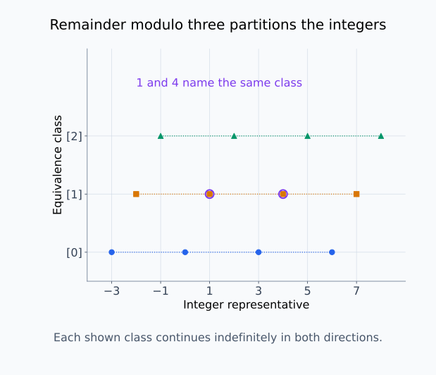
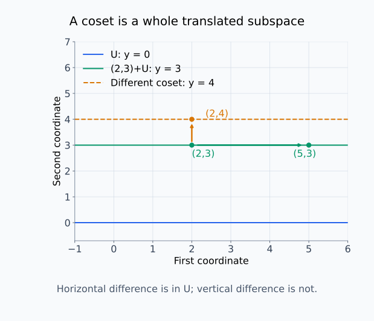
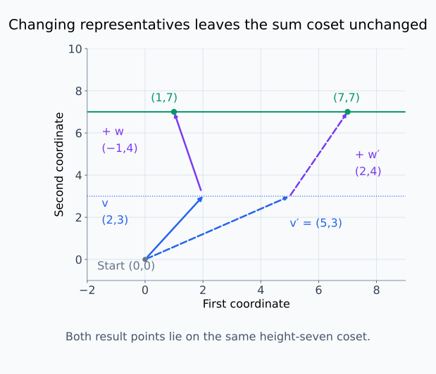
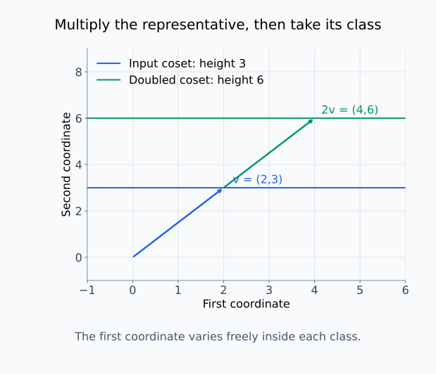
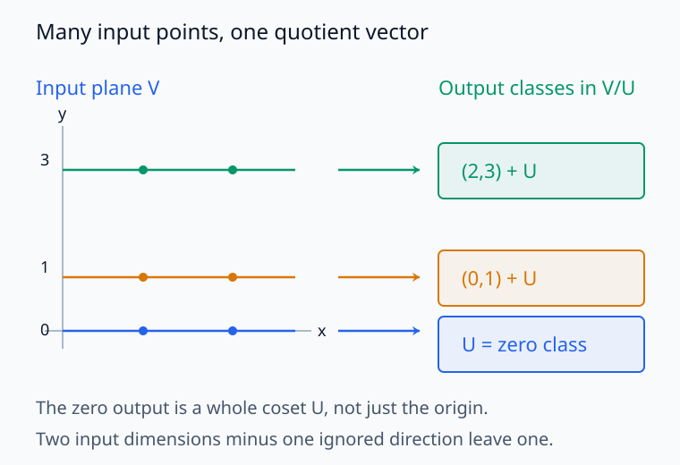
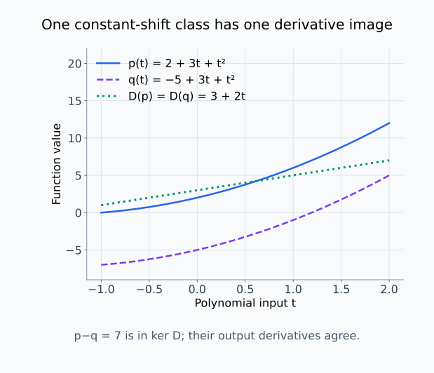
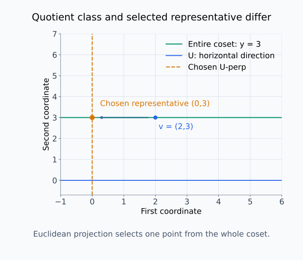

# M03-06. 동치관계와 몫공간

## 이 단원이 필요한 이유

서로 다른 표현을 같은 대상으로 취급하려면 “같다”의 기준을 먼저 정해야 한다. 동치관계(equivalence relation)는 여러 원소를 겹치지 않는 동치류로 묶는다. 벡터공간에서는 지정한 부분공간 방향으로만 차이 나는 벡터들을 같은 동치류로 묶어 몫공간(quotient space)을 만든다.

모델 표현에서 특정 nuisance 방향을 무시하거나, 파라미터 대칭성 때문에 같은 함수를 나타내는 여러 파라미터를 하나로 묶는 생각에 이 구조가 등장한다. 어떤 차이를 버리는지 밝히지 않으면 몫공간이 보존하는 정보와 잃는 정보를 판단할 수 없다.

## 학습 목표

이 단원을 마치면 다음을 할 수 있다.

- 반사성, 대칭성과 추이성으로 동치관계를 판정할 수 있다.
- 동치류와 대표원을 구분하고 동치류들이 집합을 분할하는 이유를 설명할 수 있다.
- 부분공간 $U$를 사용해 $\mathbf v\sim\mathbf w$를 정의하고 세 조건을 확인할 수 있다.
- 몫공간 $V/U$의 원소와 덧셈·스칼라곱을 계산할 수 있다.
- quotient map의 kernel과 몫공간의 차원을 구할 수 있다.
- quotient와 정사영, 파라미터 대칭성을 구분할 수 있다.

## 선수지식 확인

- 선수 단원: [M03-01 추상 벡터공간](M03-01-abstract-vector-spaces.md)
- 선수 단원: [M03-02 선형사상과 행렬 표현](M03-02-linear-maps-matrix-representation.md)
- 선수 단원: [M03-05 부분공간, 직합과 분해](M03-05-subspaces-direct-sums-decomposition.md)
- 확인 질문: 부분공간이 덧셈과 스칼라곱에 닫혀 있음을 설명할 수 있는가?
- 확인 질문: 선형사상의 kernel과 image를 구할 수 있는가?

부분공간과 kernel이 불분명하면 선수 단원을 먼저 복습한다.

## 기호와 용어

| 기호·용어 | Common spoken reading | 의미 | 범위 |
|---|---|---|---|
| $x\sim y$ | `x is equivalent to y` | 정한 기준에서 두 원소를 같은 것으로 취급한다. | 동치관계가 필요하다. |
| $[x]$ | `the equivalence class of x` | $x$와 동치인 모든 원소의 집합 | $x$는 대표원이다. |
| $\mathbf v+U$ | `v plus U` | $\mathbf v$에 $U$의 모든 벡터를 더한 집합 | $U$의 coset |
| $V/U$ | `V mod U` | $U$ 방향 차이를 무시한 동치류들의 집합 | quotient space |
| $\pi:V\to V/U$ | `pi maps V to V mod U` | 벡터를 자기 동치류로 보내는 quotient map | $\pi(\mathbf v)=\mathbf v+U$ |
| 대표원 | `representative` | 동치류를 표시하기 위해 고른 한 원소 | 같은 동치류에 여러 대표원이 있다. |

## 핵심 개념 1. 동치관계는 같은 것으로 취급할 규칙이다

집합 $X$ 위의 관계 $\sim$가 동치관계가 되려면 모든 $x,y,z\in X$에 대해 다음 조건을 만족해야 한다.

1. 반사성: $x\sim x$
2. 대칭성: $x\sim y$이면 $y\sim x$
3. 추이성: $x\sim y$이고 $y\sim z$이면 $x\sim z$

정수에서

\[
a\sim b
\quad\Longleftrightarrow\quad
a-b\text{가 }3\text{의 배수다}
\]

라고 정의하면 동치관계다. 각 정수는 나머지가 0, 1, 2인 세 부류 중 하나에 들어간다.

반사성에서는 $a-a=0=3\cdot0$을 쓴다. 대칭성에서는 $a-b=3k$인 정수 $k$가 있으면 $b-a=3(-k)$도 3의 배수다. 추이성에서는 $a-b=3k$와 $b-c=3\ell$을 더해 $a-c=3(k+\ell)$을 얻는다. 따라서 한 부류에 넣은 원소들을 서로 바꾸어 비교해도 같은 기준을 유지할 수 있다.

세 조건 중 하나라도 빠지면 동치류가 일관된 묶음을 만들지 못할 수 있다. 예를 들어 실수에서 $x\le y$는 반사성과 추이성을 만족하지만 대칭성을 만족하지 않는다.

## 핵심 개념 2. 동치류는 동치인 원소를 한 묶음으로 만든다

$x\in X$의 동치류를

\[
[x]
=
\{y\in X:y\sim x\}
\]

로 정의한다. $x$는 동치류의 대표원 한 개다.

$x\sim y$이면

\[
[x]=[y]
\]

이다. $x$와 $y$가 동치가 아니면 두 동치류는 겹치지 않는다. 따라서 동치류들은 $X$를 서로 겹치지 않는 부분집합으로 나눈다. 이를 분할(partition)이라고 한다.

대표원은 유일하지 않다. 같은 동치류의 어느 원소를 써도 같은 묶음을 나타낸다.

분할의 두 조건인 전체 포함과 겹침 없음을 나누어 확인할 수 있다. 반사성에 의해 $x\in[x]$이므로 모든 원소가 적어도 한 동치류에 들어간다. 한편 $x\sim y$이고 $z\in[x]$이면 $z\sim x\sim y$이므로 $z\in[y]$다. 반대 방향도 같아 $[x]=[y]$를 얻는다.

두 동치류가 한 원소 $z$를 공유하면 $z\sim x$와 $z\sim y$다. 대칭성과 추이성으로 $x\sim z\sim y$가 되어 두 동치류는 전체가 같다. 따라서 두 동치류가 일부만 겹치는 경우는 없으며, 같은 묶음이거나 서로 겹치지 않는 묶음이다.

<figure class="lesson-figure lesson-figure--wide" markdown="1">
  
  <figcaption>정수의 표시 구간을 나머지 0, 1, 2에 따라 세 줄로 나눴다. 1과 4는 숫자는 다르지만 차이가 3의 배수라 같은 부류를 대표한다. 각 줄은 양쪽으로 계속 이어지며 모든 정수는 한 줄에만 속한다.</figcaption>
</figure>

한 점은 대표원이고 그 점과 같은 줄에 있는 원소 전체가 동치류다.

## 핵심 개념 3. 부분공간 방향의 차이를 동치로 정의할 수 있다

$U\le V$라 하자. 두 벡터 $\mathbf v,\mathbf w\in V$에 대해

\[
\mathbf v\sim_U\mathbf w
\quad\Longleftrightarrow\quad
\mathbf v-\mathbf w\in U
\]

로 정의한다. 이 관계는 동치관계다.

반사성은

\[
\mathbf v-\mathbf v=\mathbf 0\in U
\]

에서 따른다. 대칭성은 $\mathbf v-\mathbf w\in U$일 때

\[
\mathbf w-\mathbf v=-(\mathbf v-\mathbf w)\in U
\]

이므로 성립한다. 추이성은

\[
\mathbf v-\mathbf z
=
(\mathbf v-\mathbf w)+(\mathbf w-\mathbf z)\in U
\]

에서 따른다. 세 단계에서 $U$가 영벡터를 포함하고 스칼라곱과 덧셈에 닫혀 있다는 성질을 사용했다.

## 핵심 개념 4. 동치류는 부분공간의 평행이동이다

$\mathbf v$의 동치류는

\[
[\mathbf v]
=
\{\mathbf w\in V:\mathbf w-\mathbf v\in U\}
=
\mathbf v+U
\]

로 쓸 수 있다. 여기서

\[
\mathbf v+U
=
\{\mathbf v+\mathbf u:\mathbf u\in U\}
\]

를 $U$의 coset이라고 한다.

첫 식의 두 집합이 같은 이유는 $\mathbf w-\mathbf v=\mathbf u\in U$를 $\mathbf w=\mathbf v+\mathbf u$로 다시 쓸 수 있기 때문이다. 반대로 $\mathbf w=\mathbf v+\mathbf u$인 벡터의 차이는 $\mathbf u\in U$다. 따라서 차이로 정의한 동치류와 평행이동으로 정의한 coset이 같은 원소들을 포함한다.

$\mathbf v$와 $\mathbf v+\mathbf u_0$는 $\mathbf u_0\in U$일 때 같은 coset을 나타낸다.

\[
(\mathbf v+\mathbf u_0)+U
=
\mathbf v+U
\]

따라서 $\mathbf v$는 동치류의 이름을 적기 위한 대표원이며 동치류 자체와 같지 않다.

평행이동 뒤에도 집합이 같은 것은 $\mathbf u_0+U=U$이기 때문이다. $U$의 덧셈 닫힘으로 한쪽 포함을 얻고, 임의의 $\mathbf u\in U$를 $\mathbf u_0+(\mathbf u-\mathbf u_0)$로 쓰면 반대 포함을 얻는다. 특히 $\mathbf v\in U$이면 $\mathbf v+U=U$다. 반면 $\mathbf v\notin U$이면 그 coset에는 영벡터가 없으므로 원래 공간 $V$의 부분공간이 아니다. 몫공간에서는 이런 집합 하나를 새 벡터 하나로 취급한다.

<figure class="lesson-figure lesson-figure--wide" markdown="1">
  
  <figcaption>예제 1에서 (2,3)ᵀ과 (5,3)ᵀ은 같은 수평선에 있다. 두 점의 수평 차이는 U에 속하지만 (2,4)ᵀ까지의 수직 차이는 U에 속하지 않아 다른 동치류다.</figcaption>
</figure>

수평선 전체가 coset 하나다. 높이가 0인 선만 원점을 포함하는 부분공간 $U$이고, 다른 높이의 선은 그 평행이동이다.

## 핵심 개념 5. 몫공간은 동치류를 벡터로 사용한다

모든 coset의 집합을

\[
V/U
=
\{\mathbf v+U:\mathbf v\in V\}
\]

로 쓴다. 이 집합에 다음 연산을 정의한다.

\[
(\mathbf v+U)+(\mathbf w+U)
=
(\mathbf v+\mathbf w)+U
\]

\[
\alpha(\mathbf v+U)
=
(\alpha\mathbf v)+U
\]

대표원을 다르게 골라도 결과 동치류가 같아야 한다. 이를 연산이 well-defined라고 표현한다.

$\mathbf v'=\mathbf v+\mathbf u_1$과 $\mathbf w'=\mathbf w+\mathbf u_2$이고 $\mathbf u_1,\mathbf u_2\in U$라 하자. 그러면

\[
(\mathbf v'+\mathbf w')-(\mathbf v+\mathbf w)
=
\mathbf u_1+\mathbf u_2\in U
\]

이므로

\[
(\mathbf v'+\mathbf w')+U
=
(\mathbf v+\mathbf w)+U
\]

다. 스칼라곱에서도 $\alpha\mathbf v'-\alpha\mathbf v=\alpha\mathbf u_1\in U$이므로 대표원을 바꾼 결과가 같은 coset이다. 여기에는 $\alpha=0$도 포함된다.

이 연산에서 영벡터는 $\mathbf 0+U=U$ 자체다. $(\mathbf v+U)+U=\mathbf v+U$이므로 덧셈의 항등원이고, $(-\mathbf v)+U$를 더하면 $U$가 되므로 덧셈 역원도 있다. 덧셈의 결합법칙과 분배법칙은 대표원에서 계산한 뒤 동치류를 취하면 원래 공간의 법칙에서 따른다. 대표원 선택이 결과를 바꾸지 않는다는 확인 덕분에, 이 법칙들을 특정 대표원에서 계산해도 동치류의 법칙으로 사용할 수 있다.

<figure class="lesson-figure lesson-figure--wide" markdown="1">
  
  <figcaption>실선 경로는 예제 2의 대표원 (2,3)ᵀ과 (−1,4)ᵀ을 더한다. 점선 경로는 각각 같은 coset의 다른 대표원 (5,3)ᵀ과 (2,4)ᵀ을 더한다. 결과 점은 달라도 둘 다 높이 7인 같은 선에 도착한다.</figcaption>
</figure>

<figure class="lesson-figure lesson-figure--wide" markdown="1">
  
  <figcaption>대표원 (2,3)ᵀ과 같은 변위를 두 번 이어 놓으면 두 배인 (4,6)ᵀ에 도달한다. 몫공간에서의 결과는 이 한 점이 아니라 높이 6인 수평선 전체로 정해진다.</figcaption>
</figure>

두 그림은 대표원 수준의 계산과 결과 동치류의 선택을 구분한다. 첫 좌표가 바뀌는 것은 결과 coset을 바꾸지 않는다.

## 핵심 개념 6. quotient map은 버리는 방향을 kernel로 갖는다

quotient map

\[
\pi:V\to V/U,
\qquad
\pi(\mathbf v)=\mathbf v+U
\]

는 선형이다. 영벡터에 해당하는 몫공간 원소는

\[
U=\mathbf 0+U
\]

다. 따라서

\[
\ker\pi
=
\{\mathbf v:\mathbf v+U=U\}
=
U
\]

이다. $\pi$는 $U$ 방향을 영벡터로 보내고, $U$ 방향으로만 다른 벡터들을 같은 출력으로 보낸다.

선형성은 몫공간의 연산 정의에서 확인한다.

\[
\pi(\alpha\mathbf v+\beta\mathbf w)
=(\alpha\mathbf v+\beta\mathbf w)+U
=\alpha(\mathbf v+U)+\beta(\mathbf w+U)
=\alpha\pi(\mathbf v)+\beta\pi(\mathbf w)
\]

kernel 식의 $\mathbf v+U=U$는 $\mathbf v\in U$와 동치다. $\mathbf v\in U$이면 앞 절의 평행이동 성질로 coset이 $U$이고, coset이 $U$이면 그 대표원 $\mathbf v=\mathbf v+\mathbf 0$도 $U$에 있다. 또한 몫공간의 어떤 원소를 골라도 $\mathbf v+U$ 꼴이므로 그 대표원 $\mathbf v$가 quotient map의 입력이다. 이것이 image가 몫공간 전체인 이유다.

유한차원에서는 rank-nullity 정리를 적용해

\[
\dim(V/U)
=
\dim V-\dim U
\]

를 얻는다. quotient map의 image가 $V/U$ 전체이고 kernel이 $U$이기 때문이다.

<figure class="lesson-figure lesson-figure--wide" markdown="1">
  
  <figcaption>왼쪽에서는 같은 높이의 모든 점을 오른쪽 coset 하나로 보낸다. 영벡터로 가는 입력은 원점만이 아니라 수평 부분공간 U 전체이므로 quotient map의 kernel은 U다.</figcaption>
</figure>

오른쪽 사각형은 대표원 점 하나가 아니라 coset을 원소로 표시한 것이다. 수평 차이를 지운 뒤에도 서로 다른 높이의 coset은 구분한다.

## 핵심 개념 7. kernel로 나눈 공간은 image와 같은 선형 구조를 갖는다

선형사상 $T:V\to W$에서

\[
\mathbf v-\mathbf w\in\ker T
\]

이면

\[
T(\mathbf v)-T(\mathbf w)
=
T(\mathbf v-\mathbf w)
=
\mathbf 0
\]

이므로 $T(\mathbf v)=T(\mathbf w)$다. $T$는 같은 kernel coset에 속한 입력을 구분하지 않는다.

역방향도 성립한다. $T(\mathbf v)=T(\mathbf w)$이면 선형성에 의해 $T(\mathbf v-\mathbf w)=\mathbf 0$이므로 차이가 kernel에 있다. 따라서 “같은 출력을 낸다”는 조건과 “같은 kernel coset에 속한다”는 조건이 정확히 일치한다.

이에 따라

\[
\widetilde T:V/\ker T\to\operatorname{im}T,
\qquad
\widetilde T(\mathbf v+\ker T)=T(\mathbf v)
\]

를 정의할 수 있다. 이 사상은 일대일이고 전사인 선형사상이다. 따라서

\[
V/\ker T\cong\operatorname{im}T
\]

로 쓴다. 이 결과는 선형사상이 잃는 방향을 kernel로 제거하면 남은 입력 구조가 실제 출력 구조와 대응한다는 뜻이다.

$\widetilde T$를 계산할 때 같은 coset의 다른 대표원을 골라도 출력 $T(\mathbf v)$가 같으므로 사상이 well-defined다. 서로 다른 두 coset의 출력이 같다고 하면 방금 확인한 역방향에 의해 두 coset도 같아야 하므로 일대일이다. $\operatorname{im}T$의 모든 벡터는 어떤 $T(\mathbf v)$이므로 $\mathbf v+\ker T$에서 얻을 수 있어 전사다. 마지막으로 coset의 선형결합은 대표원의 선형결합으로 계산하고 $T$가 그 결합을 보존하므로 $\widetilde T$도 선형이다.

$\cong$는 두 공간이 문자 그대로 같은 집합이라는 뜻이 아니라, 선형결합을 보존하는 일대일 대응이 있다는 뜻이다. 왼쪽의 원소는 입력 벡터들의 coset이고 오른쪽의 원소는 실제 출력 벡터다. 이 대응만으로 길이나 각도가 보존된다고 주장하는 것은 아니다.

## 예제 1. 평면을 한 방향으로 나누기

### 문제

$V=\mathbb R^2$와

\[
U=\operatorname{span}
\left\{
\begin{bmatrix}1\\0\end{bmatrix}
\right\}
\]

를 생각하자. $\mathbf v=(2,3)^\top$의 동치류를 구하고 $(5,3)^\top$, $(2,4)^\top$가 같은 동치류에 속하는지 판정하라.

### 풀이

$U$는 $x$축이므로

\[
\mathbf v+U
=
\left\{
\begin{bmatrix}
2+a\\
3
\end{bmatrix}
:a\in\mathbb R
\right\}
\]

이다. 이는 높이가 3인 수평선이다.

\[
\begin{bmatrix}5\\3\end{bmatrix}
-
\begin{bmatrix}2\\3\end{bmatrix}
=
\begin{bmatrix}3\\0\end{bmatrix}
\in U
\]

이므로 $(5,3)^\top$는 같은 동치류에 속한다.

\[
\begin{bmatrix}2\\4\end{bmatrix}
-
\begin{bmatrix}2\\3\end{bmatrix}
=
\begin{bmatrix}0\\1\end{bmatrix}
\notin U
\]

이므로 $(2,4)^\top$는 다른 동치류에 속한다.

### 결과의 의미

$V/U$에서는 첫 좌표의 차이를 무시하고 둘째 좌표만 구분한다. 각 몫공간 원소는 점 하나가 아니라 수평선 하나다.

## 예제 2. 몫공간 연산 계산하기

### 문제

예제 1의 $U$에 대해

\[
\mathbf v=
\begin{bmatrix}2\\3\end{bmatrix},
\qquad
\mathbf w=
\begin{bmatrix}-1\\4\end{bmatrix}
\]

일 때 $(\mathbf v+U)+(\mathbf w+U)$와 $2(\mathbf v+U)$를 구하라.

### 풀이

\[
(\mathbf v+U)+(\mathbf w+U)
=
(\mathbf v+\mathbf w)+U
=
\begin{bmatrix}
1\\7
\end{bmatrix}
+U
\]

이다. 이 coset은 높이가 7인 수평선이다.

\[
2(\mathbf v+U)
=
(2\mathbf v)+U
=
\begin{bmatrix}
4\\6
\end{bmatrix}
+U
\]

이고 높이가 6인 수평선이다.

### 결과의 의미

첫 좌표는 대표원에 따라 달라질 수 있다. 연산 결과 동치류는 둘째 좌표 7과 6으로 정해진다.

## 예제 3. 미분사상에서 상수항 없애기

미분사상

\[
D:\mathcal P_2\to\mathcal P_1,
\qquad
D(p)=p'
\]

의 kernel은 상수다항식 공간

\[
\ker D=\operatorname{span}\{1\}
\]

이다. $p(t)=2+3t+t^2$와 $q(t)=-5+3t+t^2$는 상수항만 다르므로

\[
p-q=7\in\ker D
\]

이고 같은 동치류에 속한다. 실제로

\[
D(p)=3+2t=D(q)
\]

다.

몫공간 $\mathcal P_2/\ker D$에서는 상수항 차이를 무시한다. 각 동치류는 $bt+ct^2$의 두 계수로 구분되므로 차원이 2다.

\[
\dim(\mathcal P_2/\ker D)
=
3-1
=
2
\]

미분사상의 image인 $\mathcal P_1$도 차원이 2이며, $p+\ker D$를 $p'$로 보내는 사상이 두 공간을 연결한다.

<figure class="lesson-figure lesson-figure--wide" markdown="1">
  
  <figcaption>두 입력 곡선은 상수 7만큼 떨어져 있지만 초록색 도함수는 하나로 같다. 상수 차이를 묶은 입력 coset 하나가 실제 출력 다항식 하나에 대응한다.</figcaption>
</figure>

그림의 파란색과 보라색 두 곡선은 coset의 두 대표원만 보여 준다. 상수항을 어떤 값으로 바꾸어도 같은 coset과 같은 도함수에 속한다.

## 예제 4. 표현에서 nuisance 부분공간 무시하기

activation 공간 $V=\mathbb R^d$에서 분석자가 nuisance 방향들의 부분공간 $U$를 정했다고 하자. quotient 표현

\[
\mathbf h+U
\]

는 $\mathbf h$와 $\mathbf h+\mathbf u$를 모든 $\mathbf u\in U$에 대해 같은 원소로 취급한다.

몫공간은 대표원 하나를 자동으로 고르지 않는다. Euclidean 내적을 사용해

\[
\operatorname{proj}_{U^\perp}\mathbf h
\]

를 대표원으로 고를 수 있지만, 이는 직교여공간과 metric을 추가로 선택한 결과다. quotient 자체는 $U$ 방향의 차이를 무시한다는 동치관계만 정한다.

M03-05의 직교분해 $\mathbf h=\mathbf h_U+\mathbf h_\perp$에서 $\mathbf h-\mathbf h_\perp=\mathbf h_U\in U$이므로 $\mathbf h_\perp$는 같은 coset의 대표원이다. 한 coset에 $U^\perp$의 대표원이 둘 있다면 그 차이는 $U$와 $U^\perp$에 동시에 속하므로 영벡터다. 따라서 이 내적을 고정하면 각 coset에서 직교 잔차 하나를 유일하게 고를 수 있다.

분석자가 nuisance 방향을 잘못 정하면 과제에 필요한 정보도 같은 동치류 안에서 사라진다. quotient 결과를 사용하려면 $U$의 선택 근거와 제거 전후의 과제 성능을 함께 보고해야 한다.

<figure class="lesson-figure lesson-figure--wide" markdown="1">
  
  <figcaption>수평선 전체를 묶는 quotient와, Euclidean 직교여공간인 수직선을 골라 (0,3)ᵀ 하나를 선택하는 정사영은 서로 다른 단계다. 선택한 점은 같은 coset의 대표원이지만 coset 자체는 아니다.</figcaption>
</figure>

## 흔한 오해

### 오해 1. 비슷해 보이는 관계는 동치관계다

동치관계는 반사성, 대칭성과 추이성을 모두 만족해야 한다. 거리 임계값 안에 있다는 관계는 추이성을 만족하지 않을 수 있다.

### 오해 2. 동치류는 대표원 하나다

대표원은 동치류를 표시하는 한 원소다. 동치류는 그 대표원과 동치인 원소 전체의 집합이다.

### 오해 3. $V/U$는 벡터를 성분별로 나누는 연산이다

$V/U$는 scalar 나눗셈이 아니다. $U$ 방향으로 차이 나는 벡터들을 같은 원소로 묶어 만든 새 벡터공간이다.

### 오해 4. quotient는 정사영과 같다

quotient는 동치류를 원소로 사용한다. 정사영은 내적과 여공간을 사용해 각 동치류에서 특정 대표원을 고르는 한 방법이다.

### 오해 5. 모든 모델 대칭성의 quotient는 벡터공간이다

부분공간의 덧셈 차이로 정의한 quotient는 벡터공간이다. neuron 순열이나 비선형 재매개화로 생긴 동치류는 일반적인 vector-space quotient가 아닐 수 있다.

## 연습문제

### 1. 동치관계 판정

정수에서

\[
a\sim b
\quad\Longleftrightarrow\quad
a-b\text{가 짝수다}
\]

라고 정의한다. 반사성, 대칭성과 추이성을 확인하라.

해설 보기

$a-a=0$은 짝수이므로 반사성을 만족한다. $a-b$가 짝수이면 $b-a=-(a-b)$도 짝수이므로 대칭성을 만족한다. $a-b$와 $b-c$가 짝수이면 합인 $a-c$도 짝수이므로 추이성을 만족한다. 따라서 동치관계다.

### 2. 동치류 구하기

연습문제 1의 관계에서 $[0]$과 $[1]$을 설명하라.

해설 보기

$[0]$은 0과 차이가 짝수인 모든 짝수의 집합이다. $[1]$은 1과 차이가 짝수인 모든 홀수의 집합이다. 두 동치류는 겹치지 않으며 모든 정수는 둘 중 하나에 속한다.

### 3. coset 판정

$V=\mathbb R^3$와 $U=\operatorname{span}\{\mathbf e_1,\mathbf e_2\}$에서

\[
\mathbf v=
\begin{bmatrix}1\\2\\3\end{bmatrix},
\qquad
\mathbf w=
\begin{bmatrix}5\\-1\\3\end{bmatrix}
\]

가 같은 coset을 나타내는지 판정하라.

해설 보기

\[
\mathbf v-\mathbf w
=
\begin{bmatrix}
-4\\3\\0
\end{bmatrix}
\]

는 $\mathbf e_1,\mathbf e_2$의 선형결합이므로 $U$에 속한다. 따라서 $\mathbf v\sim_U\mathbf w$이고 $\mathbf v+U=\mathbf w+U$다.

### 4. 몫공간 연산

연습문제 3의 $U$에 대해

\[
\left(
\begin{bmatrix}1\\0\\2\end{bmatrix}
+U
\right)
+
\left(
\begin{bmatrix}0\\4\\-1\end{bmatrix}
+U
\right)
\]

을 계산하라.

해설 보기

대표원을 더하면

\[
\begin{bmatrix}1\\0\\2\end{bmatrix}
+
\begin{bmatrix}0\\4\\-1\end{bmatrix}
=
\begin{bmatrix}1\\4\\1\end{bmatrix}
\]

이므로 결과는

\[
\begin{bmatrix}1\\4\\1\end{bmatrix}
+U
\]

다. 이 quotient에서는 첫째와 둘째 좌표 차이를 무시하므로 셋째 좌표가 1인 모든 벡터가 같은 coset에 속한다.

### 5. 몫공간 차원

$\dim V=8$이고 $\dim U=3$일 때 $\dim(V/U)$를 구하라.

해설 보기

\[
\dim(V/U)
=
\dim V-\dim U
=
8-3
=
5
\]

다. quotient map의 kernel이 $U$이고 image가 $V/U$ 전체이므로 rank-nullity 정리에서도 같은 값을 얻는다.

### 6. quotient와 image

$T:\mathbb R^3\to\mathbb R^2$가

\[
T(x,y,z)^\top=(x,y)^\top
\]

로 주어진다. $\ker T$, $\operatorname{im}T$와 $\mathbb R^3/\ker T$의 차원을 구하라.

해설 보기

\[
\ker T
=
\operatorname{span}
\left\{
\begin{bmatrix}0\\0\\1\end{bmatrix}
\right\}
\]

이고 $\operatorname{im}T=\mathbb R^2$다. 따라서

\[
\dim(\mathbb R^3/\ker T)
=
3-1
=
2
\]

다. quotient의 동치류는 셋째 좌표 차이를 무시하며, 각 동치류는 출력 $(x,y)^\top$와 일대일로 대응한다.

### 7. 모델 주장 비판

“nuisance 부분공간 $U$로 quotient를 취하면 의미 정보만 남는다”는 주장을 비판하라.

해설 보기

quotient는 $U$ 방향의 모든 차이를 제거하지만 그 방향이 nuisance만 담는지는 보장하지 않는다. $U$가 과제 관련 정보도 포함하면 그 정보도 사라진다. 분석자는 $U$의 추정 절차, 독립 데이터에서의 안정성, quotient 전후 복원·과제 성능과 대조 부분공간을 검사해야 한다.

## 단원 요약

- 동치관계는 반사성, 대칭성과 추이성을 만족해 원소들을 동치류로 나눈다.
- 부분공간 $U$에 대해 $\mathbf v-\mathbf w\in U$이면 두 벡터를 동치로 둘 수 있다.
- 동치류 $\mathbf v+U$는 $U$의 평행이동이며 대표원은 유일하지 않다.
- 몫공간 $V/U$는 coset을 원소로 사용하고 대표원과 무관한 연산을 갖는다.
- quotient map의 kernel은 $U$이고 유한차원에서 $\dim(V/U)=\dim V-\dim U$다.
- $V/\ker T$는 $\operatorname{im}T$와 같은 선형 구조를 갖는다.
- quotient는 동치류를 만들고 정사영은 추가한 내적에 따라 대표원을 고른다.

## 통과 기준

다음 질문에 자료를 보지 않고 답할 수 있으면 통과한다.

- 관계가 반사성, 대칭성과 추이성을 만족하는지 검사할 수 있는가?
- 동치류와 대표원을 구분할 수 있는가?
- 부분공간으로 만든 관계가 동치관계임을 확인할 수 있는가?
- coset과 몫공간의 연산을 계산할 수 있는가?
- quotient map의 kernel과 몫공간의 차원을 구할 수 있는가?
- $V/\ker T$와 $\operatorname{im}T$의 대응을 설명할 수 있는가?
- quotient와 정사영을 구분할 수 있는가?

## 다음 단원

- [M03-07 쌍대공간과 covector](M03-07-dual-spaces-covectors.md)

## 집필자 점검표

- [x] 학습 목표가 관찰 가능한 행동으로 작성됐다.
- [x] 동치관계의 세 조건을 확인했다.
- [x] 동치류, 대표원과 coset을 구분했다.
- [x] 몫공간 연산의 well-defined 조건을 설명했다.
- [x] quotient map과 kernel·image를 연결했다.
- [x] 정사영 및 일반 모델 대칭성과의 차이를 밝혔다.
- [x] 모든 문제에 해설이 있다.
- [x] 모델 해석 주장의 강도를 구분했다.
- [x] 용어집과 표기 규칙을 따랐다.
- [x] 내부 링크와 수식 구분자를 확인했다.
- [x] Common spoken reading이 실제 영어 학술 발화이며 한글 음역이나 기계적 직역을 포함하지 않는다.
