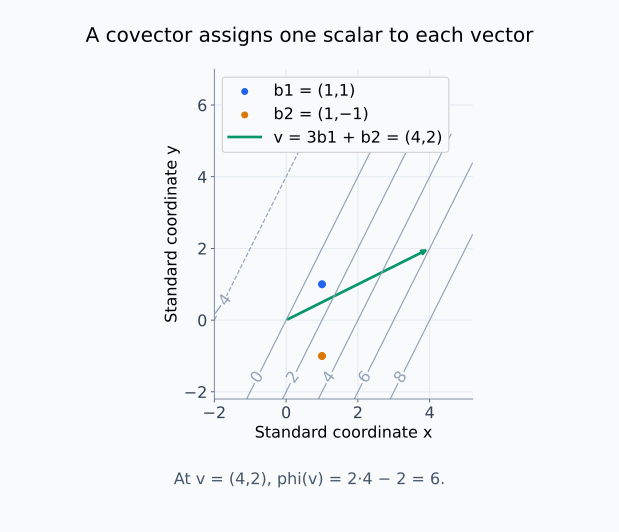
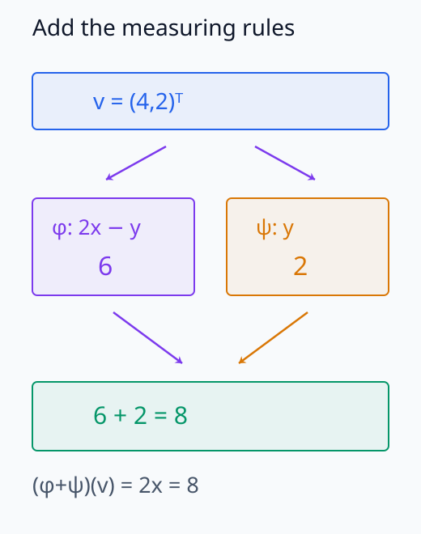
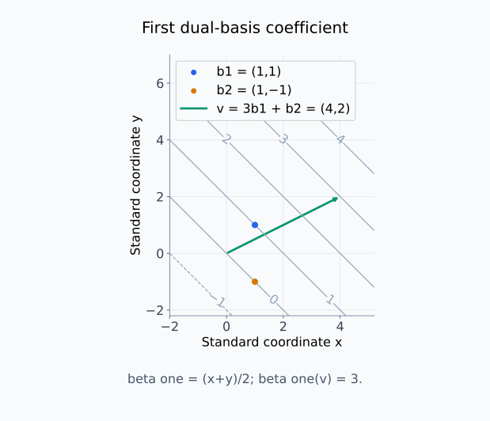
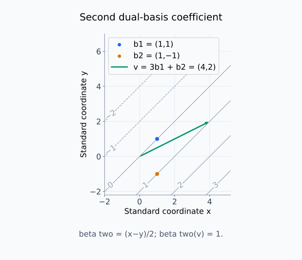
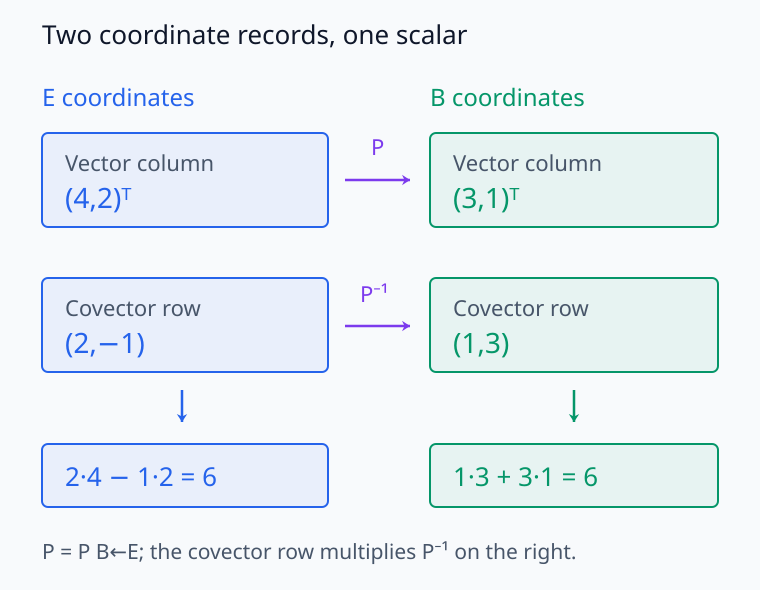
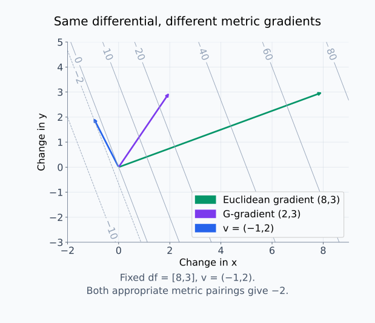

# M03-07. 쌍대공간과 covector

## 이 단원이 필요한 이유

벡터는 방향을 가진 변화량을 나타낼 수 있다. covector는 벡터를 입력받아 scalar를 내놓는 선형함수다. 미분에서 differential은 입력 변화벡터를 함수값의 일차 변화량으로 보낸다. gradient는 내적을 사용해 그 covector를 벡터로 나타낸 결과다.

Euclidean 좌표에서는 differential과 gradient가 같은 숫자 목록으로 보이기 때문에 둘을 섞기 쉽다. 기저나 내적을 바꾸면 벡터와 covector의 좌표변환 법칙이 달라지고, 같은 differential에 대응하는 gradient도 달라질 수 있다. 이 구분은 Jacobian, VJP와 역전파를 읽는 데 필요하다.

## 학습 목표

이 단원을 마치면 다음을 할 수 있다.

- covector를 벡터공간에서 실수로 가는 선형사상으로 정의할 수 있다.
- 쌍대공간과 dual basis를 작은 예제에서 구성할 수 있다.
- covector가 벡터에 작용해 scalar를 만드는 계산을 수행할 수 있다.
- 기저변환 아래 벡터 좌표와 covector 좌표가 반대 방식으로 변하는 이유를 설명할 수 있다.
- differential과 gradient를 내적을 사용해 연결할 수 있다.
- 선형 probe의 가중치와 표현 방향을 구분할 수 있다.

## 선수지식 확인

- 선수 단원: [M03-02 선형사상과 행렬 표현](M03-02-linear-maps-matrix-representation.md)
- 선수 단원: [M03-03 기저변환과 좌표 의존성](M03-03-change-of-basis-coordinate-dependence.md)
- 선수 단원: [M01-11 방향미분과 gradient](../M01/M01-11-directional-derivative-gradient.md)
- 확인 질문: 선형사상의 입력과 출력 공간을 구분할 수 있는가?
- 확인 질문: 좌표변환행렬의 방향을 아래첨자로 읽을 수 있는가?
- 확인 질문: 방향미분을 gradient와 방향벡터의 내적으로 계산할 수 있는가?

선형사상이나 기저변환이 불분명하면 선수 단원을 먼저 복습한다.

## 기호와 용어

| 기호·용어 | Common spoken reading | 의미 | 타입 |
|---|---|---|---|
| $V^*$ | `V star` | $V$ 위의 모든 covector가 이루는 쌍대공간 | 벡터공간 |
| $\varphi:V\to\mathbb R$ | `phi maps V to R` | 벡터를 scalar로 보내는 선형함수 | covector |
| $\mathcal B=(\mathbf b_1,\ldots,\mathbf b_n)$ | `the basis B consisting of b one through b n` | $V$의 순서 있는 기저 | basis |
| $\mathcal B^*=(\beta^1,\ldots,\beta^n)$ | `the dual basis B star` | $\beta^i(\mathbf b_j)=\delta_{ij}$를 만족하는 기저 | $V^*$의 basis |
| $\boldsymbol\omega^\top$ | `omega transpose` | covector의 좌표 행 | $1\times n$ |
| $df_{\mathbf x}$ | `d f at x` | 변화벡터를 함수값의 일차 변화로 보내는 differential | covector |
| $\nabla f(\mathbf x)$ | `the gradient of f at x` | 선택한 내적 아래 $df_{\mathbf x}$에 대응하는 벡터 | vector |

## 핵심 개념 1. covector는 벡터를 측정하는 선형함수다

벡터공간 $V$ 위의 covector $\varphi$는

\[
\varphi:V\to\mathbb R
\]

인 선형사상이다. 모든 $\mathbf u,\mathbf v\in V$와 $\alpha,\beta\in\mathbb R$에 대해

\[
\varphi(\alpha\mathbf u+\beta\mathbf v)
=
\alpha\varphi(\mathbf u)+\beta\varphi(\mathbf v)
\]

를 만족한다.

$V=\mathbb R^n$에 표준좌표를 사용하면 covector는 행벡터로 나타낼 수 있다.

\[
\varphi(\mathbf v)
=
\boldsymbol\omega^\top\mathbf v
\]

shape은

\[
\underbrace{\boldsymbol\omega^\top}_{1\times n}
\underbrace{\mathbf v}_{n\times1}
\in\mathbb R
\]

이다. 행벡터 $\boldsymbol\omega^\top$은 선택한 기저에서의 좌표 표현이며 covector 자체는 선형함수다.

<figure class="lesson-figure lesson-figure--wide" markdown="1">
  
  <figcaption>예제 2의 φ(x,y)=2x−y를 같은 측정값의 선들로 표시했다. 벡터 끝점 (4,2)가 값 6인 선에 놓이므로 φ(v)=6이다. covector는 화살표 끝점을 다른 벡터로 옮기는 것이 아니라 scalar를 읽는다.</figcaption>
</figure>

회색 선의 숫자는 측정값이며, 초록색 화살표는 측정할 입력벡터다.

## 핵심 개념 2. 모든 covector가 이루는 집합도 벡터공간이다

$V$ 위의 모든 covector를 모아

\[
V^*
=
\{\varphi:V\to\mathbb R\mid\varphi\text{는 선형이다}\}
\]

로 쓰고 $V$의 쌍대공간(dual space)이라고 한다.

두 covector의 합과 스칼라곱은 점별로 정의한다.

\[
(\varphi+\psi)(\mathbf v)
=
\varphi(\mathbf v)+\psi(\mathbf v)
\]

\[
(\alpha\varphi)(\mathbf v)
=
\alpha\varphi(\mathbf v)
\]

결과가 다시 covector인지도 확인해야 한다. 두 입력 $\mathbf u,\mathbf v$와 scalar $a,b$에 대해

\[
(\varphi+\psi)(a\mathbf u+b\mathbf v)
=a\bigl(\varphi(\mathbf u)+\psi(\mathbf u)\bigr)
+b\bigl(\varphi(\mathbf v)+\psi(\mathbf v)\bigr)
\]

이다. 각 함수의 선형성을 적용한 뒤 $\mathbf u$ 항과 $\mathbf v$ 항을 모았으므로 합도 선형이다. scalar를 곱한 함수도 같은 분배법칙으로 선형성을 유지한다. 영벡터는 모든 $\mathbf v$를 0으로 보내는 영함수이고, $\varphi$의 덧셈 역원은 $-\varphi$다. 나머지 벡터공간 법칙은 함수의 점별 연산에서 따른다.

$V$가 유한차원이라면

\[
\dim V^*=\dim V
\]

이다. 차원이 같다는 사실만으로 $V$와 $V^*$를 같은 공간으로 취급할 수는 없다. 벡터는 $V$의 원소이고 covector는 $V$에서 scalar로 가는 함수다. 두 공간을 대응시키려면 기저나 내적 같은 추가 구조를 선택해야 한다.

<figure class="lesson-figure" markdown="1">
  
  <figcaption>작은 예시에서 같은 입력을 φ(x,y)=2x−y와 ψ(x,y)=y로 각각 읽고 결과를 더한다. 이는 처음부터 두 규칙을 더한 (φ+ψ)(x,y)=2x로 측정하는 것과 같다.</figcaption>
</figure>

여기서 더하는 대상은 입력벡터 두 개가 아니라 두 측정함수다. 입력벡터는 위쪽에서 하나로 고정돼 있다.

## 핵심 개념 3. dual basis는 기저 계수를 하나씩 읽는다

$V$의 기저가

\[
\mathcal B=(\mathbf b_1,\ldots,\mathbf b_n)
\]

일 때 dual basis

\[
\mathcal B^*=(\beta^1,\ldots,\beta^n)
\]

는

\[
\beta^i(\mathbf b_j)=\delta_{ij}
\]

를 만족한다. $\delta_{ij}$는 $i=j$이면 1이고 다르면 0이다.

\[
\mathbf v
=
v^1\mathbf b_1+\cdots+v^n\mathbf b_n
\]

이면

\[
\beta^i(\mathbf v)=v^i
\]

다. $\beta^i$는 $\mathcal B$ 좌표의 $i$번째 값을 읽는다.

이 함수는 기저 표현의 유일성으로 정의된다. 한 벡터의 $i$번째 계수가 두 값일 수 없으며, 좌표 기록은 선형결합을 보존하므로 계수 하나를 읽는 $\beta^i$도 선형이다. 또한

\[
\beta^i(\mathbf v)
=\sum_{j=1}^n v^j\beta^i(\mathbf b_j)
=\sum_{j=1}^n v^j\delta_{ij}
=v^i
\]

이다. $\delta_{ij}$가 $j=i$인 항만 남기는 것이다. 여기서 $v^i$와 $\beta^i$의 윗첨자 $i$는 거듭제곱이 아니라 계수와 함수의 자리 번호다.

임의의 covector $\varphi\in V^*$도

\[
\varphi
=
\omega_1\beta^1+\cdots+\omega_n\beta^n
\]

로 유일하게 나타낼 수 있다. 이때

\[
\varphi(\mathbf v)
=
\sum_{i=1}^{n}\omega_i v^i
\]

이다.

계수는 $\omega_i=\varphi(\mathbf b_i)$다. 선형성에 의해 $\varphi(\mathbf v)=\sum_i v^i\varphi(\mathbf b_i)$이므로 이 계수로 만든 $\sum_i\omega_i\beta^i$는 모든 입력에서 $\varphi$와 같다. 또한 $\sum_i c_i\beta^i$가 영함수이면 $\mathbf b_j$에 적용해 $c_j=0$을 얻는다. 따라서 dual basis는 모든 covector를 생성하고 선형독립이며, $n$개 함수가 기저를 이루어 $\dim V^*=n$이다.

<figure class="lesson-figure lesson-figure--wide" markdown="1">
  
  <figcaption>예제 1의 첫 dual 함수는 β¹(x,y)=(x+y)/2다. b₁에서는 1, b₂에서는 0을 읽으며, 3b₁+b₂인 초록색 벡터에서는 첫 계수 3을 읽는다.</figcaption>
</figure>

<figure class="lesson-figure lesson-figure--wide" markdown="1">
  
  <figcaption>둘째 dual 함수 β²(x,y)=(x−y)/2는 b₁을 0, b₂를 1로 읽는다. 같은 초록색 벡터에 적용하면 둘째 계수 1을 얻는다.</figcaption>
</figure>

두 그림의 입력벡터는 같고 읽는 규칙만 다르다. dual basis의 두 함수가 각각 어떤 기저 계수를 선택하는지 선의 값을 비교한다.

## 핵심 개념 4. 벡터와 covector 좌표는 서로 반대로 변한다

두 기저 $\mathcal B,\mathcal C$ 사이에서 벡터 좌표가

\[
[\mathbf v]_{\mathcal C}
=
\mathbf P_{\mathcal C\leftarrow\mathcal B}
[\mathbf v]_{\mathcal B}
\]

로 변한다고 하자. covector의 두 좌표 행을

\[
\boldsymbol\omega_{\mathcal B}^\top,
\qquad
\boldsymbol\omega_{\mathcal C}^\top
\]

로 쓴다. 같은 scalar 값은 기저와 무관해야 하므로

\[
\boldsymbol\omega_{\mathcal B}^\top[\mathbf v]_{\mathcal B}
=
\boldsymbol\omega_{\mathcal C}^\top[\mathbf v]_{\mathcal C}
\]

이다. 벡터 좌표변환을 대입하면

\[
\boldsymbol\omega_{\mathcal B}^\top[\mathbf v]_{\mathcal B}
=
\boldsymbol\omega_{\mathcal C}^\top
\mathbf P_{\mathcal C\leftarrow\mathcal B}
[\mathbf v]_{\mathcal B}
\]

이므로

\[
\boldsymbol\omega_{\mathcal C}^\top
=
\boldsymbol\omega_{\mathcal B}^\top
\mathbf P_{\mathcal B\leftarrow\mathcal C}
\]

이다. 벡터 좌표가 $\mathbf P$로 변하면 covector의 행 좌표는 $\mathbf P^{-1}$로 변한다. 이 반대 변환 때문에 두 좌표의 곱인 scalar가 유지된다.

행 좌표를 결정하는 위 등식은 한 벡터에서만이 아니라 모든 $[\mathbf v]_{\mathcal B}$에서 성립해야 한다. 좌표 단위벡터들을 차례로 넣으면 두 행의 각 계수가 같아야 하므로 $\boldsymbol\omega_{\mathcal B}^\top=\boldsymbol\omega_{\mathcal C}^\top\mathbf P_{\mathcal C\leftarrow\mathcal B}$를 얻는다. 여기에 오른쪽에서 좌표변환의 역행렬을 곱한 것이 covector의 변환식이다.

covector 계수를 열로 쓰면 같은 식은

\[
\boldsymbol\omega_{\mathcal C}
=
\mathbf P_{\mathcal C\leftarrow\mathcal B}^{-\top}
\boldsymbol\omega_{\mathcal B}
\]

가 된다. 여기서 $\mathbf P^{-\top}$는 $(\mathbf P^{-1})^\top$라는 뜻이다. 행 좌표의 식을 전치하면 곱의 순서가 뒤집혀 역전치행렬이 왼쪽에 놓인다. 계수를 열로 저장하더라도 이 배열이 나타내는 대상은 여전히 covector다.

<figure class="lesson-figure lesson-figure--wide" markdown="1">
  
  <figcaption>예제 2의 벡터 열은 (4,2)ᵀ에서 (3,1)ᵀ으로 바뀌고, covector 행은 (2,−1)에서 (1,3)으로 바뀐다. 반대 변환을 함께 적용하기 때문에 작용한 scalar 6은 그대로다.</figcaption>
</figure>

위쪽 $\mathbf P$는 벡터 열의 왼쪽에 작용한다. 아래쪽 $\mathbf P^{-1}$는 covector 행의 오른쪽에 곱한다.

## 핵심 개념 5. 내적은 covector를 gradient vector로 나타낸다

유한차원 실수 벡터공간 $V$에서 scalar 함수 $f:V\to\mathbb R$가 점 $\mathbf x$에서 미분 가능하다고 하자. 이 점에서 differential

\[
df_{\mathbf x}:V\to\mathbb R
\]

은 변화벡터 $\mathbf v$를 일차 변화량으로 보낸다.

\[
df_{\mathbf x}(\mathbf v)
\]

는 $\mathbf v$ 방향의 방향미분이다. differential은 $\mathbf v$에 대해 선형이므로 covector다.

점 $\mathbf x$는 고정하고 변화벡터 $\mathbf v$를 입력으로 넣는다. 작은 scalar $\varepsilon$에 대해 $f(\mathbf x+\varepsilon\mathbf v)$의 일차 변화는 $\varepsilon\,df_{\mathbf x}(\mathbf v)$로 나타난다. $f$ 자체가 비선형이어도 그 점에서의 일차 변화 규칙은 $\mathbf v$에 대해 선형이다. 미분 가능성과 전체 일차 근사의 조건은 M03-10에서 구체화한다.

내적 $\langle\cdot,\cdot\rangle$을 고르면

\[
df_{\mathbf x}(\mathbf v)
=
\langle\nabla f(\mathbf x),\mathbf v\rangle
\]

를 모든 $\mathbf v$에서 만족하는 벡터 $\nabla f(\mathbf x)$가 하나 정해진다. 이 벡터가 선택한 내적에 대한 gradient다.

모든 변화벡터에서 같은 값을 내야 한다는 조건이 gradient를 유일하게 정한다. 두 후보의 차이를 $\mathbf w$라 하면 모든 $\mathbf v$에 대해 $\langle\mathbf w,\mathbf v\rangle=0$이어야 한다. $\mathbf v=\mathbf w$를 넣으면 $\langle\mathbf w,\mathbf w\rangle=0$이므로 $\mathbf w=\mathbf 0$이다.

$V=\mathbb R^n$의 표준 Euclidean 내적에서는

\[
df_{\mathbf x}(\mathbf v)
=
\nabla f(\mathbf x)^\top\mathbf v
\]

이다.

이 표준좌표에서 단위벡터 $\mathbf e_i$를 differential에 넣으면 $i$번째 변수만 바꾸는 편미분을 얻는다. 따라서 $df_{\mathbf x}$의 행 계수는 각 편미분이고, Euclidean gradient는 그 계수를 열로 세운 벡터다.

내적을

\[
\langle\mathbf a,\mathbf b\rangle_{\mathbf G}
=
\mathbf a^\top\mathbf G\mathbf b
\]

로 바꾸고 $\mathbf G$가 대칭 양의 정부호라면, differential의 좌표 열을 $\boldsymbol\omega$라 할 때

\[
\boldsymbol\omega^\top\mathbf v
=
\nabla_{\mathbf G}f(\mathbf x)^\top
\mathbf G\mathbf v
\]

이므로

\[
\nabla_{\mathbf G}f(\mathbf x)
=
\mathbf G^{-1}\boldsymbol\omega
\]

다. differential은 같은 선형함수로 남지만 gradient vector는 내적 선택에 따라 달라진다.

이 식에서 $\mathbf G$는 선택한 좌표의 내적을 기록한다. 대칭성은 $\mathbf G^\top=\mathbf G$이고, 양의 정부호성은 비영벡터 $\mathbf z$에 대해 $\mathbf z^\top\mathbf G\mathbf z>0$이라는 조건이다. $\mathbf G\mathbf z=\mathbf 0$인 비영벡터는 이 조건에 어긋나므로 $\mathbf G$는 가역이다.

등식이 모든 $\mathbf v$에서 성립해야 하므로 $\boldsymbol\omega^\top=\nabla_{\mathbf G}f(\mathbf x)^\top\mathbf G$다. 전치하고 $\mathbf G$의 대칭성을 쓰면 $\boldsymbol\omega=\mathbf G\nabla_{\mathbf G}f(\mathbf x)$이고, 이를 풀어 위 역행렬 식을 얻는다. 내적을 바꿀 때에는 differential을 고정한 채 그 값을 내적으로 표현하는 벡터를 바꾸는 것이다.

## 예제 1. dual basis로 좌표 읽기

### 문제

$V=\mathbb R^2$에서

\[
\mathbf b_1=
\begin{bmatrix}1\\1\end{bmatrix},
\qquad
\mathbf b_2=
\begin{bmatrix}1\\-1\end{bmatrix}
\]

로 기저 $\mathcal B$를 만든다. dual basis $\beta^1,\beta^2$를 표준좌표의 행벡터로 구하라.

### 풀이

\[
\mathbf P_{\mathcal E\leftarrow\mathcal B}
=
\begin{bmatrix}
1&1\\
1&-1
\end{bmatrix}
\]

이다. dual basis의 행을 쌓은 행렬은 기저행렬의 역행렬이다.

dual basis의 행을 쌓은 행렬을 $\mathbf R$이라 쓰면 $\mathbf R\mathbf P_{\mathcal E\leftarrow\mathcal B}$의 $(i,j)$ 원소는 $\beta^i(\mathbf b_j)=\delta_{ij}$다. 따라서 이 곱은 항등행렬이고, $\mathbf R$은 기저행렬의 역행렬이다. 기저벡터를 행으로 뒤집는 것이 아니라 기저 계수를 읽는 행들을 구하는 계산이다.

\[
\mathbf P_{\mathcal E\leftarrow\mathcal B}^{-1}
=
\frac12
\begin{bmatrix}
1&1\\
1&-1
\end{bmatrix}
\]

따라서

\[
\beta^1(\mathbf v)
=
\frac12
\begin{bmatrix}
1&1
\end{bmatrix}
\mathbf v
\]

\[
\beta^2(\mathbf v)
=
\frac12
\begin{bmatrix}
1&-1
\end{bmatrix}
\mathbf v
\]

이다.

검산하면

\[
\beta^1(\mathbf b_1)=1,
\quad
\beta^1(\mathbf b_2)=0,
\quad
\beta^2(\mathbf b_1)=0,
\quad
\beta^2(\mathbf b_2)=1
\]

이다.

### 결과의 의미

$\beta^1$과 $\beta^2$는 각각 $\mathcal B$ 좌표의 첫째 계수와 둘째 계수를 읽는다.

## 예제 2. covector의 기저별 좌표

### 문제

표준좌표에서 covector가

\[
\varphi(\mathbf v)
=
\begin{bmatrix}
2&-1
\end{bmatrix}
[\mathbf v]_{\mathcal E}
\]

로 주어진다. 예제 1의 $\mathcal B$ 좌표에서 $\varphi$의 행 좌표를 구하라.

### 풀이

\[
[\mathbf v]_{\mathcal E}
=
\mathbf P_{\mathcal E\leftarrow\mathcal B}
[\mathbf v]_{\mathcal B}
\]

이므로

\[
\varphi(\mathbf v)
=
\begin{bmatrix}
2&-1
\end{bmatrix}
\begin{bmatrix}
1&1\\
1&-1
\end{bmatrix}
[\mathbf v]_{\mathcal B}
\]

이다. 행렬곱을 계산하면

\[
\begin{bmatrix}
2&-1
\end{bmatrix}
\begin{bmatrix}
1&1\\
1&-1
\end{bmatrix}
=
\begin{bmatrix}
1&3
\end{bmatrix}
\]

이므로

\[
\boldsymbol\omega_{\mathcal B}^\top
=
\begin{bmatrix}
1&3
\end{bmatrix}
\]

이다.

$[\mathbf v]_{\mathcal B}=(3,1)^\top$이면

\[
\varphi(\mathbf v)
=
\begin{bmatrix}
1&3
\end{bmatrix}
\begin{bmatrix}
3\\1
\end{bmatrix}
=
6
\]

이다. 같은 벡터의 표준좌표는 $(4,2)^\top$이고

\[
\begin{bmatrix}
2&-1
\end{bmatrix}
\begin{bmatrix}
4\\2
\end{bmatrix}
=
6
\]

으로 같은 scalar를 얻는다.

### 결과의 의미

벡터와 covector의 좌표는 모두 바뀌지만 covector가 벡터에 작용한 scalar는 유지된다.

## 예제 3. differential과 두 gradient

### 문제

\[
f(x,y)=x^2+3xy
\]

일 때 점 $\mathbf x=(1,2)^\top$에서 differential을 구하고, 변화벡터 $\mathbf v=(-1,2)^\top$에 적용하라. Euclidean 내적과

\[
\mathbf G=
\begin{bmatrix}
4&0\\
0&1
\end{bmatrix}
\]

가 정한 내적에서 gradient도 각각 구하라.

### 풀이

편미분은

\[
\frac{\partial f}{\partial x}=2x+3y,
\qquad
\frac{\partial f}{\partial y}=3x
\]

이다. $(1,2)$에서 differential의 행 좌표는

\[
\boldsymbol\omega^\top
=
\begin{bmatrix}
8&3
\end{bmatrix}
\]

이다. 따라서

\[
df_{\mathbf x}(\mathbf v)
=
\begin{bmatrix}
8&3
\end{bmatrix}
\begin{bmatrix}
-1\\2
\end{bmatrix}
=
-8+6
=
-2
\]

다.

Euclidean gradient는

\[
\nabla f(\mathbf x)
=
\begin{bmatrix}
8\\3
\end{bmatrix}
\]

이다. $\mathbf G$ 내적에 대한 gradient는

\[
\nabla_{\mathbf G}f(\mathbf x)
=
\mathbf G^{-1}\boldsymbol\omega
=
\begin{bmatrix}
\frac14&0\\
0&1
\end{bmatrix}
\begin{bmatrix}
8\\3
\end{bmatrix}
=
\begin{bmatrix}
2\\3
\end{bmatrix}
\]

이다.

두 gradient는 서로 다르지만

\[
\nabla f(\mathbf x)^\top\mathbf v=-2
\]

이고

\[
\nabla_{\mathbf G}f(\mathbf x)^\top
\mathbf G\mathbf v
=
\begin{bmatrix}
2&3
\end{bmatrix}
\begin{bmatrix}
-4\\2
\end{bmatrix}
=
-2
\]

로 같은 differential 값을 나타낸다.

### 결과의 의미

differential은 점에서의 일차 변화 규칙이다. gradient는 선택한 내적으로 그 규칙을 벡터로 표현한다.

<figure class="lesson-figure lesson-figure--wide" markdown="1">
  
  <figcaption>예제 3에서 같은 differential을 Euclidean 내적으로 표현한 초록색 벡터는 (8,3)ᵀ이고, G=diag(4,1)의 내적으로 표현한 보라색 벡터는 (2,3)ᵀ이다. 각 내적에 맞게 파란 변화벡터와 짝지으면 둘 다 −2를 얻는다.</figcaption>
</figure>

축은 기준점 자체의 위치가 아니라 변화벡터의 좌표다. 회색 선은 고정된 $df_{(1,2)}(\Delta x,\Delta y)=8\Delta x+3\Delta y$의 값이며, gradient가 달라져도 이 측정함수는 바뀌지 않는다.

## 예제 4. 선형 readout을 covector로 보기

activation $\mathbf h\in\mathbb R^d$에서 scalar score를

\[
s(\mathbf h)=\mathbf w^\top\mathbf h+b
\]

로 계산한다고 하자. bias를 제외한

\[
\mathbf h\longmapsto\mathbf w^\top\mathbf h
\]

는 covector다. $\mathbf w$를 “score 방향”이라고 부를 때는 Euclidean 내적으로 covector와 벡터를 대응시켰다는 가정이 들어간다.

선형 probe가 높은 정확도를 얻으면 activation에서 label 관련 정보를 이 covector로 복원할 수 있음을 보인다. 모델이 같은 covector를 내부 계산에 사용한다는 결론에는 개입이나 회로 증거가 더 필요하다.

## 흔한 오해

### 오해 1. covector는 벡터를 가로로 쓴 것이다

행벡터는 선택한 기저에서 covector를 나타내는 좌표다. covector 자체는 벡터를 scalar로 보내는 선형함수다.

### 오해 2. $V$와 $V^*$는 차원이 같으므로 같은 공간이다

두 공간의 원소 타입이 다르다. 내적이나 기저를 선택하면 둘 사이의 대응을 만들 수 있지만 그 선택을 생략해서는 안 된다.

### 오해 3. differential과 gradient는 언제나 같은 대상이다

differential은 covector다. gradient는 선택한 내적을 통해 differential에 대응시킨 벡터다.

### 오해 4. probe weight는 기저와 무관한 feature 방향이다

probe weight의 좌표는 activation 기저와 feature scaling에 의존한다. 방향으로 해석할 때 사용한 내적과 전처리도 함께 밝혀야 한다.

## 연습문제

### 1. covector 판정

$\varphi:\mathbb R^2\to\mathbb R$가

\[
\varphi(x,y)=3x-2y
\]

로 주어진다. 선형성을 확인하고 표준좌표의 행 표현을 적어라.

해설 보기

두 벡터 $\mathbf u,\mathbf v$와 scalar $\alpha,\beta$에 대해 각 좌표의 선형결합을 대입하면

\[
\varphi(\alpha\mathbf u+\beta\mathbf v)
=
\alpha\varphi(\mathbf u)+\beta\varphi(\mathbf v)
\]

가 성립한다. 행 표현은

\[
\boldsymbol\omega^\top=
\begin{bmatrix}
3&-2
\end{bmatrix}
\]

이다.

### 2. covector 작용 계산

\[
\boldsymbol\omega^\top=
\begin{bmatrix}
1&-3&2
\end{bmatrix},
\qquad
\mathbf v=
\begin{bmatrix}
2\\1\\-1
\end{bmatrix}
\]

일 때 $\boldsymbol\omega^\top\mathbf v$를 구하라.

해설 보기

\[
\boldsymbol\omega^\top\mathbf v
=
1\cdot2+(-3)\cdot1+2\cdot(-1)
=
-3
\]

이다. covector가 벡터에 작용한 결과는 scalar다.

### 3. 표준 dual basis

$\mathbb R^3$의 표준기저에 대한 dual basis $\varepsilon^1,\varepsilon^2,\varepsilon^3$가 벡터 $(a,b,c)^\top$에 어떻게 작용하는지 적어라.

해설 보기

\[
\varepsilon^1(a,b,c)^\top=a,
\qquad
\varepsilon^2(a,b,c)^\top=b,
\qquad
\varepsilon^3(a,b,c)^\top=c
\]

이다. 각 covector는 대응하는 표준좌표 하나를 읽는다.

### 4. 기저변환과 scalar 보존

벡터 좌표가 $\mathbf v_{\mathcal C}=\mathbf P\mathbf v_{\mathcal B}$로 변한다. $\boldsymbol\omega_{\mathcal C}^\top\mathbf v_{\mathcal C}=\boldsymbol\omega_{\mathcal B}^\top\mathbf v_{\mathcal B}$가 되도록 $\boldsymbol\omega_{\mathcal C}^\top$을 구하라.

해설 보기

\[
\boldsymbol\omega_{\mathcal C}^\top
\mathbf P\mathbf v_{\mathcal B}
=
\boldsymbol\omega_{\mathcal B}^\top\mathbf v_{\mathcal B}
\]

가 모든 $\mathbf v_{\mathcal B}$에서 성립해야 하므로

\[
\boldsymbol\omega_{\mathcal C}^\top\mathbf P
=
\boldsymbol\omega_{\mathcal B}^\top
\]

이다. 따라서

\[
\boldsymbol\omega_{\mathcal C}^\top
=
\boldsymbol\omega_{\mathcal B}^\top\mathbf P^{-1}
\]

이다.

### 5. differential 계산

\[
f(x,y)=x^2+y^2
\]

에서 $\mathbf x=(1,-2)^\top$일 때 $df_{\mathbf x}$의 행 좌표를 구하고 $\mathbf v=(3,1)^\top$에 적용하라.

해설 보기

편미분은 $2x$와 $2y$이므로

\[
df_{\mathbf x}
\longleftrightarrow
\begin{bmatrix}
2&-4
\end{bmatrix}
\]

이다. 따라서

\[
df_{\mathbf x}(\mathbf v)
=
\begin{bmatrix}
2&-4
\end{bmatrix}
\begin{bmatrix}
3\\1
\end{bmatrix}
=
2
\]

다.

### 6. metric에 따른 gradient

differential의 좌표 열이

\[
\boldsymbol\omega=
\begin{bmatrix}
6\\2
\end{bmatrix}
\]

이고

\[
\mathbf G=
\begin{bmatrix}
3&0\\
0&2
\end{bmatrix}
\]

일 때 $\mathbf G$ 내적에 대한 gradient를 구하라.

해설 보기

\[
\nabla_{\mathbf G}f
=
\mathbf G^{-1}\boldsymbol\omega
=
\begin{bmatrix}
\frac13&0\\
0&\frac12
\end{bmatrix}
\begin{bmatrix}
6\\2
\end{bmatrix}
=
\begin{bmatrix}
2\\1
\end{bmatrix}
\]

이다.

### 7. 모델 주장 비판

“probe weight와 activation 벡터가 모두 $\mathbb R^d$의 열이므로 같은 종류의 feature다”라는 문장을 비판하라.

해설 보기

activation은 표현공간의 벡터다. probe weight는 activation을 score로 보내는 covector의 좌표이며, Euclidean 내적을 선택할 때 열벡터와 대응시킬 수 있다. 두 배열의 shape이 같다는 사실만으로 타입과 변환 법칙이 같아지지 않는다.

## 단원 요약

- covector는 벡터를 scalar로 보내는 선형함수이고 모든 covector는 쌍대공간 $V^*$를 이룬다.
- dual basis는 원래 기저의 좌표 계수를 하나씩 읽는다.
- 벡터 좌표와 covector 좌표는 반대 변환 법칙을 따라 scalar 작용값을 보존한다.
- differential은 변화벡터를 일차 변화량으로 보내는 covector다.
- gradient는 선택한 내적을 사용해 differential을 벡터로 나타낸 결과다.
- 선형 readout 가중치를 방향으로 해석할 때 기저, scaling과 내적을 밝혀야 한다.

## 통과 기준

다음 질문에 자료를 보지 않고 답할 수 있으면 통과한다.

- covector와 쌍대공간을 정의할 수 있는가?
- dual basis가 기저 좌표를 읽는 방식을 설명할 수 있는가?
- covector가 벡터에 작용하는 계산을 수행할 수 있는가?
- 기저변환 아래 covector 좌표의 변화를 유도할 수 있는가?
- differential과 gradient를 타입과 내적 기준으로 구분할 수 있는가?
- probe weight를 covector로 해석할 때 필요한 가정을 말할 수 있는가?

## 다음 단원

- [M03-08 bilinear form과 quadratic form](M03-08-bilinear-quadratic-forms.md)

## 집필자 점검표

- [x] 학습 목표가 관찰 가능한 행동으로 작성됐다.
- [x] covector를 선형함수로 정의했다.
- [x] dual basis와 기저변환을 계산했다.
- [x] differential과 gradient의 타입을 구분했다.
- [x] metric에 따른 gradient 변화를 포함했다.
- [x] 모든 문제에 해설이 있다.
- [x] 모델 해석 주장의 강도를 구분했다.
- [x] 용어집과 표기 규칙을 따랐다.
- [x] 선수지식 밖의 내용을 몰래 요구하지 않는다.
- [x] 내부 링크와 수식 구분자를 확인했다.
- [x] Common spoken reading이 실제 영어 학술 발화이며 한글 음역이나 기계적 직역을 포함하지 않는다.
