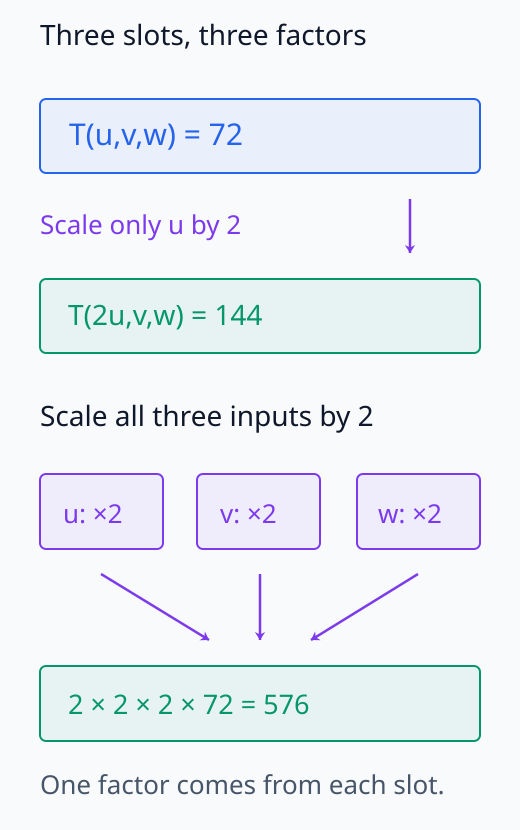
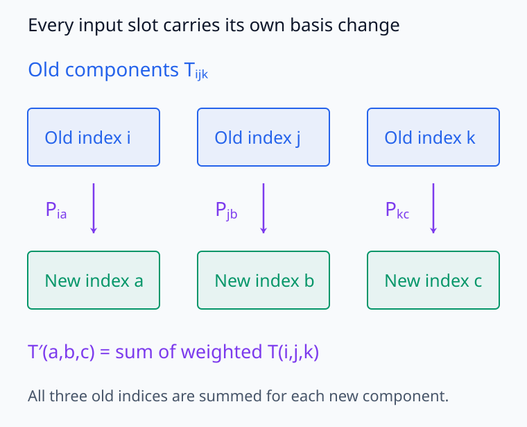
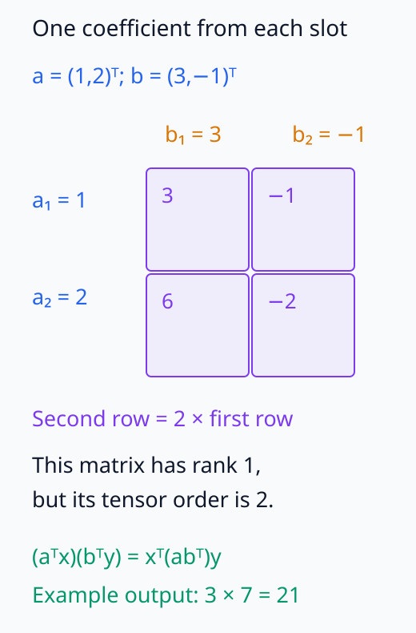
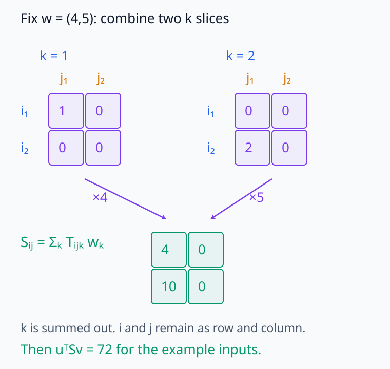
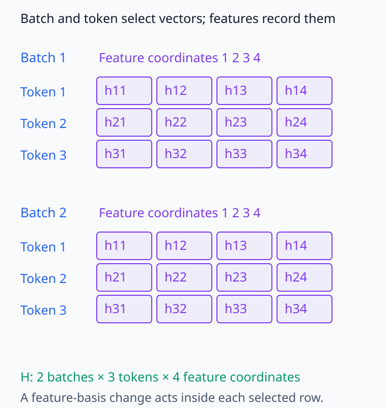
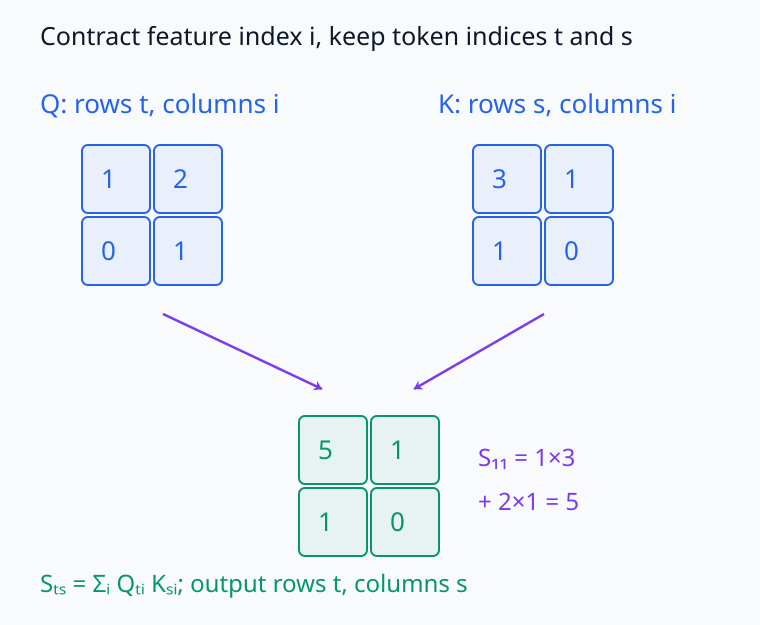
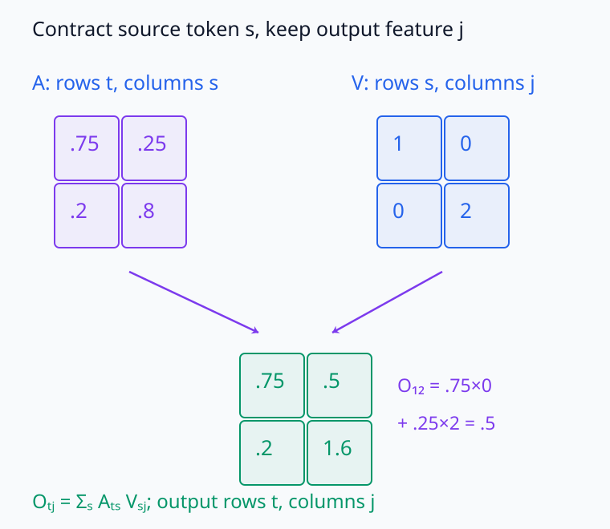

# M03-09. tensor와 multilinear map

## 이 단원이 필요한 이유

신경망 코드에서는 여러 축을 가진 배열을 tensor라고 부른다. 수학에서는 tensor를 기저를 바꿔도 같은 대상으로 해석할 수 있는 multilinear 구조로 정의한다. 좌표 배열은 tensor의 성분을 저장하지만, 배열의 shape만으로 수학적 tensor의 입력·출력 타입과 변환 법칙이 정해지지는 않는다.

activation, attention score와 고차 미분을 읽으려면 축의 의미와 합을 취하는 인덱스를 추적해야 한다. multilinear map은 여러 입력 중 하나씩 고정했을 때 남은 입력에 선형이다. 이 관점은 행렬곱, bilinear score와 tensor contraction을 같은 계산 규칙으로 연결한다.

## 학습 목표

이 단원을 마치면 다음을 할 수 있다.

- multilinear map을 각 입력별 선형성으로 정의할 수 있다.
- covector와 bilinear form을 낮은 order의 tensor로 연결할 수 있다.
- 기저에서 tensor 성분을 만들고 작은 tensor를 벡터들에 적용할 수 있다.
- tensor order, 배열 shape와 행렬 rank를 구분할 수 있다.
- tensor product와 contraction의 결과 shape을 계산할 수 있다.
- 신경망 배열 연산에서 batch, token과 feature 축의 역할을 추적할 수 있다.

## 선수지식 확인

- 선수 단원: [M03-07 쌍대공간과 covector](M03-07-dual-spaces-covectors.md)
- 선수 단원: [M03-08 bilinear form과 quadratic form](M03-08-bilinear-quadratic-forms.md)
- 선수 단원: [M00-09 스칼라·벡터·행렬의 shape](../M00/M00-09-scalars-vectors-matrices-shape.md)
- 확인 질문: covector와 vector의 타입을 구분할 수 있는가?
- 확인 질문: bilinear map이 두 입력 각각에 대해 선형이라는 뜻을 설명할 수 있는가?
- 확인 질문: 행렬곱의 공유 dimension을 찾을 수 있는가?

bilinear form이나 shape 추적이 불분명하면 선수 단원을 먼저 복습한다.

## 기호와 용어

| 기호·용어 | Common spoken reading | 의미 | 타입·shape |
|---|---|---|---|
| $T:V_1\times\cdots\times V_k\to\mathbb R$ | `T maps V one cross through V k to R` | 각 입력에 대해 선형인 함수 | $k$-linear map |
| $\mathcal T$ | `calligraphic T` | 좌표와 구분한 tensor 객체 | 문맥에서 타입 명시 |
| $T_{i_1\ldots i_k}$ | `T sub i one through i k` | 선택한 기저에서의 tensor 성분 | $k$개 인덱스 |
| $\alpha\otimes\beta$ | `alpha tensor beta` | 두 covector로 만든 order-2 tensor | $(\alpha\otimes\beta)(\mathbf x,\mathbf y)=\alpha(\mathbf x)\beta(\mathbf y)$ |
| tensor order | `tensor order` | tensor가 가진 vector·covector 입력 자리의 수 | 배열 축 수와 문맥상 대응 |
| contraction | `contraction` | 한 입력을 넣거나 대응 인덱스를 합해 order를 줄이는 연산 | 결과 shape 확인 필요 |

## 핵심 개념 1. multilinear map은 각 입력 자리에 대해 선형이다

\[
T:V_1\times\cdots\times V_k\to\mathbb R
\]

가 multilinear라는 말은 나머지 입력을 고정했을 때 각 입력 하나에 대한 함수가 선형이라는 뜻이다.

$r$번째 입력 자리에서

\[
T(\ldots,\alpha\mathbf u+\beta\mathbf v,\ldots)
=
\alpha T(\ldots,\mathbf u,\ldots)
+
\beta T(\ldots,\mathbf v,\ldots)
\]

가 성립해야 한다.

$k=1$이면 covector이고 $k=2$이면 bilinear map이다. $k=3$이면 세 입력을 받는 trilinear map이다. bilinear form이라는 이름은 M03-08처럼 두 입력이 같은 공간에 속하는 경우에 사용한다.

$k>1$인 multilinear map은 일반적으로 모든 입력을 묶은 하나의 벡터에 대한 선형함수가 아니다. 각 입력을 모두 $\alpha$배하면

\[
T(\alpha\mathbf v_1,\ldots,\alpha\mathbf v_k)
=
\alpha^kT(\mathbf v_1,\ldots,\mathbf v_k)
\]

이다. 배율은 각 입력 자리의 선형성을 적용할 때 하나씩 나오므로, $k$개의 자리를 모두 늘리면 배율 $k$개를 곱한다. 한 자리만 늘릴 때의 선형성과 모든 자리를 동시에 늘릴 때의 배율을 구분해야 한다.

예제 1의 값 72에서 각 자리의 배율을 따로 추적해 보자.

<figure class="lesson-figure" markdown="1">
  
  <figcaption>한 자리만 두 배로 바꾸면 144지만 세 자리를 모두 두 배로 바꾸면 2³×72=576이다. 입력 세 개를 묶은 하나의 선형함수라면 나올 수 없는 차이다.</figcaption>
</figure>

## 핵심 개념 2. tensor는 multilinear 구조와 변환 법칙을 가진다

한 벡터공간 $V$에서 실수값을 내는 covariant order-$k$ tensor를

\[
\mathcal T:V^k\to\mathbb R
\]

인 multilinear map으로 정의할 수 있다.

$V^k$는 $V$의 벡터 $k$개를 순서대로 받는 $V\times\cdots\times V$라는 뜻이다. 여러 입력을 하나씩 기저로 전개할 수 있다는 구조가 tensor의 성분 계산을 정한다.

- order 0 tensor는 scalar다.
- covariant order 1 tensor는 covector다.
- covariant order 2 tensor는 bilinear form이다.

벡터는 contravariant order 1 tensor로 분류한다. 벡터 $\mathbf v$를 고정하면 covector $\varphi$에 대해 $\varphi\mapsto\varphi(\mathbf v)$라는 선형 측정을 정의할 수 있다. 이 관점에서 벡터는 covector를 입력받고, 위 covariant tensor는 vector를 입력받는다. 더 일반적인 tensor는 vector와 covector를 받는 입력 자리를 함께 가질 수 있다. 이 단원에서는 covariant tensor와 좌표 배열을 중심으로 다룬다.

tensor 객체는 기저와 무관하다. 기저를 바꾸면 성분 배열이 정해진 법칙에 따라 변하고, tensor를 벡터들에 적용한 scalar는 유지된다.

## 핵심 개념 3. 기저는 tensor를 다축 성분 배열로 바꾼다

$V$의 기저를 $\mathcal B=(\mathbf b_1,\ldots,\mathbf b_n)$라 하자. order-$k$ covariant tensor의 성분은

\[
T_{i_1\ldots i_k}
=
\mathcal T(
\mathbf b_{i_1},\ldots,\mathbf b_{i_k}
)
\]

이다. 각 입력벡터를

\[
\mathbf v_r
=
\sum_{i_r=1}^{n}v_r^{i_r}\mathbf b_{i_r}
\]

로 쓰면 multilinearity에 따라

\[
\mathcal T(\mathbf v_1,\ldots,\mathbf v_k)
=
\sum_{i_1=1}^{n}\cdots\sum_{i_k=1}^{n}
T_{i_1\ldots i_k}
v_1^{i_1}\cdots v_k^{i_k}
\]

이다.

order 2에서는

\[
\mathcal T(\mathbf x,\mathbf y)
=
\sum_{i=1}^{n}\sum_{j=1}^{n}
T_{ij}x^iy^j
=
\mathbf x^\top\mathbf T\mathbf y
\]

가 되어 bilinear form의 행렬 표현을 얻는다.

일반 평가식의 $v_r^{i_r}$는 $r$번째 입력벡터의 $i_r$번째 기저 계수다. 윗첨자는 거듭제곱이 아니다. 첫 입력을 선형결합으로 펼치면 $i_1$에 대한 합이 생기고, 각 항에서 둘째 입력을 펼치면 $i_2$에 대한 합이 생긴다. 이 과정을 입력 자리마다 반복하면 기저벡터를 한 개씩 고른 모든 조합을 합하게 된다. 각 조합에는 그 tensor 성분과 선택된 입력 계수 $k$개의 곱이 붙는다.

모든 입력 공간이 같은 $n$차원 $V$이면 성분 배열의 shape은 $n\times\cdots\times n$이고 성분 수는 $n^k$다. 입력 공간이 서로 다른 경우에는 각 공간의 기저 크기가 각 인덱스 범위를 정한다. 따라서 shape $2\times3\times4$는 차원이 각각 2, 3, 4인 세 입력 공간의 multilinear map을 기록할 수 있다.

## 핵심 개념 4. 각 tensor 인덱스는 기저변환에 참여한다

covector 성분은 vector 좌표의 역변환을 따른다. covariant tensor는 vector 입력 자리를 여러 개 가지며, 한 자리를 제외한 입력을 고정하면 그 자리에 작용하는 covector가 된다. 각 인덱스는 그 자리에 대응하는 covector 성분의 변환을 하나씩 받는다.

order 2 bilinear form에서는 M03-08의

\[
\mathbf T_{\mathcal C}
=
\mathbf P_{\mathcal B\leftarrow\mathcal C}^\top
\mathbf T_{\mathcal B}
\mathbf P_{\mathcal B\leftarrow\mathcal C}
\]

가 그 법칙이다. order 3 tensor는 세 입력 좌표를 바꾸므로 세 개의 변환 인자가 성분에 작용한다.

이를 기저벡터에 직접 적용해 확인할 수 있다. $\mathbf P=\mathbf P_{\mathcal B\leftarrow\mathcal C}$라 쓰면 새 기저의 $a$번째 벡터는 $\mathbf c_a=\sum_iP_{ia}\mathbf b_i$다. order 3에서는 새 기저벡터 세 개를 넣고 각 입력의 선형성을 적용하여

\[
(\mathbf T_{\mathcal C})_{abc}
=\sum_i\sum_j\sum_k
P_{ia}P_{jb}P_{kc}(\mathbf T_{\mathcal B})_{ijk}
\]

를 얻는다. $\mathbf T_{\mathcal B}$와 $\mathbf T_{\mathcal C}$는 각 기저에서의 성분 배열이다. 한 입력을 옛 기저로 펼칠 때마다 $\mathbf P$의 성분 하나가 붙어 세 인자가 생긴다. 이 $\mathbf P$는 새 좌표에서 옛 좌표로 가는 행렬이므로, vector 좌표의 옛→새 변환 $\mathbf P^{-1}$과 covector 성분의 역방향 변환이 일치한다.

배열이 tensor 성분을 나타내려면 기저가 바뀔 때 이 변환 법칙을 따라야 한다. 저장된 숫자 배열 하나만으로는 어떤 인덱스가 vector형인지 covector형인지 알 수 없다. 축의 수학적 의미를 함께 정의해야 한다.

각 인덱스는 한 입력 자리의 기저와 연결되어 있다. 따라서 어느 한 축에만 변환을 적용하면 일반적으로 같은 tensor의 새 성분이 되지 않는다.

<figure class="lesson-figure lesson-figure--wide" markdown="1">
  
  <figcaption>Order-3 covariant tensor에서는 세 입력을 모두 새 기저로 전개한다. 새 성분 하나를 얻을 때도 기존의 i,j,k를 모두 합하며, 각 자리에서 기저변환 계수가 하나씩 들어온다.</figcaption>
</figure>

## 핵심 개념 5. tensor product는 입력 자리를 결합한다

두 covector $\alpha\in V^*$와 $\beta\in W^*$의 tensor product는

\[
\alpha\otimes\beta:V\times W\to\mathbb R
\]

이고

\[
(\alpha\otimes\beta)(\mathbf x,\mathbf y)
=
\alpha(\mathbf x)\beta(\mathbf y)
\]

로 정의한다. 각 입력에 대해 선형이므로 order-2 tensor다.

첫 입력을 바꿀 때 $\beta(\mathbf y)$는 고정된 scalar이므로 $\alpha$의 선형성으로 첫 자리의 선형성을 얻는다. 둘째 자리에서도 $\alpha(\mathbf x)$를 고정하고 $\beta$의 선형성을 사용한다. 출력 두 개를 곱했지만 각각의 입력 자리에 대해서는 선형성이 유지되는 이유다.

$\dim V=m$, $\dim W=n$이고 각 공간에 기저를 골랐다고 하자. $\alpha,\beta$의 좌표 열을 각각 $\mathbf a,\mathbf b$라 하면 성분 행렬은

\[
\mathbf a\mathbf b^\top
\]

이다. 이를 outer product라고 한다. shape은

\[
\underbrace{\mathbf a}_{m\times1}
\underbrace{\mathbf b^\top}_{1\times n}
\in\mathbb R^{m\times n}
\]

이다.

성분이 $a_i b_j$인 이유는 $\alpha(\mathbf x)\beta(\mathbf y)=(\sum_i a_i x^i)(\sum_j b_j y^j)=\sum_i\sum_j a_i b_jx^iy^j$이기 때문이다. 한 outer product의 각 열은 $\mathbf a$의 scalar 배다. $\mathbf a,\mathbf b$가 둘 다 비영벡터이면 행렬 rank가 1이며, 하나가 영벡터이면 영행렬이다.

같은 입력 공간의 outer product들을 더하면 일반적인 order-2 tensor를 표현할 수 있다. 계수 열의 표준단위벡터 $\mathbf e_i,\mathbf e_j$로 만든 $\mathbf e_i\mathbf e_j^\top$는 $(i,j)$ 성분만 1이다. 각 성분값을 이 행렬에 곱해 더하면 어떤 성분 행렬도 복원된다. 따라서 한 outer product로 표현된다는 조건은 order가 2라는 조건보다 강하다.

Outer product에서는 각 행 계수와 열 계수의 조합이 한 성분을 만든다. 예제 2의 행렬에서 이 관계와 rank를 함께 읽을 수 있다.

<figure class="lesson-figure" markdown="1">
  
  <figcaption>두 입력 자리를 결합했으므로 order는 2다. 그러나 둘째 행이 첫째 행의 두 배여서 행렬 rank는 1이다. Order와 matrix rank가 서로 다른 정보를 준다는 예다.</figcaption>
</figure>

## 핵심 개념 6. contraction은 입력을 넣고 인덱스를 합한다

order-3 tensor 성분 $T_{ijk}$에 벡터 $\mathbf z$를 셋째 입력으로 넣으면

\[
S_{ij}
=
\sum_{k}T_{ijk}z^k
\]

를 얻는다. 결과는 두 입력이 남은 order-2 tensor다. 이 연산은 셋째 인덱스에 대한 contraction이다.

고정된 $\mathbf z$에 대해 $S(\mathbf x,\mathbf y)=\mathcal T(\mathbf x,\mathbf y,\mathbf z)$라고 쓰면, 원래 tensor의 첫째·둘째 자리 선형성이 남으므로 $S$가 bilinear임을 알 수 있다. 그 성분을 구하려고 두 자리에 기저벡터를 넣고 $\mathbf z$만 펼친 결과가 위 $S_{ij}$ 식이다. $\mathbf z$는 셋째 입력 공간의 벡터여야 하며, 그 공간의 기저 계수와 $T$의 셋째 인덱스를 짝지어 합한다.

모든 입력을 넣으면

\[
\mathcal T(\mathbf x,\mathbf y,\mathbf z)
=
\sum_i\sum_j\sum_k
T_{ijk}x^iy^jz^k
\]

인 scalar를 얻는다.

행렬-벡터 곱

\[
y_i=\sum_jA_{ij}x_j
\]

도 공유 인덱스 $j$를 합하는 contraction으로 읽을 수 있다. 구현에서는 einsum 같은 표기가 어떤 축을 합하고 어떤 축을 남기는지 명시한다.

예제 3에서 세 번째 입력을 넣는 과정은 두 $k$ slice의 가중 합이다. 그 후에도 첫째·둘째 입력 자리는 남아 있다.

<figure class="lesson-figure lesson-figure--wide" markdown="1">
  
  <figcaption>w₁=4,w₂=5를 고정하면 k=1 slice를 4배, k=2 slice를 5배 하여 더한다. k는 사라지고 i,j가 남아 행렬 [[4,0],[10,0]]을 이룬다.</figcaption>
</figure>

## 핵심 개념 7. order, shape와 rank는 다른 정보다

다음 용어를 구분해야 한다.

| 용어 | 답하는 질문 | 예 |
|---|---|---|
| tensor order | multilinear 입력 자리가 몇 개인가? | $T_{ijk}$는 order 3 |
| 배열의 축 수 | 저장 배열에 인덱스가 몇 개인가? | shape $2\times3\times4$는 축 3개 |
| 각 축의 dimension | 각 인덱스가 몇 값을 갖는가? | 2, 3, 4 |
| 행렬 rank | 독립인 행·열 방향이 몇 개인가? | order-2 배열에서 계산 |
| tensor rank | rank-1 tensor 합이 몇 개 필요한가? | 정의와 계산법을 따로 명시 |

행렬은 order-2 배열이지만 행렬 rank가 2라는 뜻은 아니다. order-3 tensor의 rank도 축 수 3과 같지 않다.

## 핵심 개념 8. 머신러닝 tensor는 축 의미를 가진 다축 배열이다

신경망 구현은 scalar, vector와 matrix를 포함한 다축 배열을 tensor라고 부른다. 예를 들어 Transformer activation은

\[
\mathbf H^{(\ell)}
\in
\mathbb R^{B\times T\times d_{\mathrm{model}}}
\]

로 저장할 수 있다.

- 첫 축은 batch다.
- 둘째 축은 token 위치다.
- 셋째 축은 feature 좌표다.

세 축만으로 이 배열을 수학적 의미의 covariant order-3 tensor라고 결론 내릴 수 없다. batch와 token 축은 표본을 나열하는 인덱스일 수 있고, feature 축만 기저변환의 대상일 수 있다.

예를 들어 batch와 token을 고정하여 얻은 feature 좌표를 열벡터 $\mathbf h_{bt}\in\mathbb R^{d_{\mathrm{model}}}$라 쓰자. 옛 feature 좌표를 새 좌표에서 조립하는 기저행렬이 $\mathbf P$이면, 같은 표현벡터의 새 좌표는 $\widetilde{\mathbf h}_{bt}=\mathbf P^{-1}\mathbf h_{bt}$다. 이 계산은 각 $(b,t)$에 같은 feature 좌표변환을 적용한다. batch와 token의 목록 자체를 기저변환한 것이 아니므로 세 축에 모두 covariant 변환 인자를 붙이는 계산과 다르다.

배열 연산을 읽을 때는 shape과 축 의미를 먼저 확인한다. 좌표 독립적인 주장을 하려면 어떤 축에 어떤 기저변환이 작용하는지도 밝혀야 한다.

아래 배열에서는 batch와 token을 고르면 하나의 feature 벡터가 선택된다. Feature 기저변환은 그 벡터의 좌표에 작용하며 batch나 token 자체를 기저벡터로 바꾸는 연산이 아니다.

<figure class="lesson-figure lesson-figure--wide" markdown="1">
  
  <figcaption>같은 2×3×4 shape라도 축의 역할은 다르다. 그림의 hᵢⱼ는 각 batch 안에서 token i의 feature 좌표 j를 나타내는 표기이며, 실제 모델 측정값은 아니다.</figcaption>
</figure>

## 예제 1. order-3 tensor 평가하기

### 문제

$V=\mathbb R^2$에서 trilinear form을

\[
\mathcal T(\mathbf u,\mathbf v,\mathbf w)
=
u_1v_1w_1+2u_2v_1w_2
\]

로 정의한다.

\[
\mathbf u=
\begin{bmatrix}1\\2\end{bmatrix},
\quad
\mathbf v=
\begin{bmatrix}3\\-1\end{bmatrix},
\quad
\mathbf w=
\begin{bmatrix}4\\5\end{bmatrix}
\]

일 때 값을 계산하라.

### 풀이

정의에 좌표를 대입하면

\[
\mathcal T(\mathbf u,\mathbf v,\mathbf w)
=
1\cdot3\cdot4
+
2\cdot2\cdot3\cdot5
\]

\[
=
12+60
=
72
\]

다.

0이 아닌 성분은

\[
T_{111}=1,
\qquad
T_{212}=2
\]

뿐이다.

### 결과의 의미

성분 배열은 $2\times2\times2$ shape이지만 두 성분만 값이 있다. 세 입력 중 하나를 고정하면 남은 입력에 대해 bilinear map을 얻는다.

## 예제 2. tensor product와 outer product

### 문제

표준기저에서 두 covector의 좌표가

\[
\mathbf a=
\begin{bmatrix}1\\2\end{bmatrix},
\qquad
\mathbf b=
\begin{bmatrix}3\\-1\end{bmatrix}
\]

라고 하자. $\alpha\otimes\beta$의 성분 행렬을 구하고

\[
\mathbf x=
\begin{bmatrix}1\\1\end{bmatrix},
\qquad
\mathbf y=
\begin{bmatrix}2\\-1\end{bmatrix}
\]

에서 값을 계산하라.

### 풀이

성분 행렬은 outer product

\[
\mathbf a\mathbf b^\top
=
\begin{bmatrix}
1\\2
\end{bmatrix}
\begin{bmatrix}
3&-1
\end{bmatrix}
=
\begin{bmatrix}
3&-1\\
6&-2
\end{bmatrix}
\]

이다.

\[
\alpha(\mathbf x)
=
\begin{bmatrix}1&2\end{bmatrix}
\begin{bmatrix}1\\1\end{bmatrix}
=
3
\]

이고

\[
\beta(\mathbf y)
=
\begin{bmatrix}3&-1\end{bmatrix}
\begin{bmatrix}2\\-1\end{bmatrix}
=
7
\]

이므로

\[
(\alpha\otimes\beta)(\mathbf x,\mathbf y)
=
3\cdot7
=
21
\]

이다. 행렬로도

\[
\mathbf x^\top
\begin{bmatrix}
3&-1\\
6&-2
\end{bmatrix}
\mathbf y
=
21
\]

을 얻는다.

### 결과의 의미

tensor product는 두 개의 선형 측정을 곱해 두 입력을 받는 bilinear form을 만든다.

## 예제 3. 한 인덱스를 contraction하기

예제 1의 tensor에서 $\mathbf w=(4,5)^\top$을 셋째 입력에 넣자.

\[
S_{ij}
=
\sum_{k=1}^{2}T_{ijk}w^k
\]

이다. 0이 아닌 성분을 사용하면

\[
S_{11}=T_{111}w^1=4
\]

\[
S_{21}=T_{212}w^2=10
\]

이고 나머지는 0이다. 따라서

\[
\mathbf S=
\begin{bmatrix}
4&0\\
10&0
\end{bmatrix}
\]

이다. 남은 두 입력에서

\[
\mathbf u^\top\mathbf S\mathbf v
=
\begin{bmatrix}1&2\end{bmatrix}
\begin{bmatrix}
4&0\\
10&0
\end{bmatrix}
\begin{bmatrix}3\\-1\end{bmatrix}
=
72
\]

로 전체 평가값을 다시 얻는다.

## 예제 4. attention의 두 contraction

batch와 head를 생략하고

\[
\mathbf Q,\mathbf K\in\mathbb R^{T\times d_k},
\qquad
\mathbf V\in\mathbb R^{T\times d_v}
\]

라 하자. score 행렬의 성분은

\[
S_{ts}
=
\sum_{i=1}^{d_k}Q_{ti}K_{si}
\]

이다. feature 인덱스 $i$를 contraction해 $\mathbf S\in\mathbb R^{T\times T}$를 만든다.

attention weight $\mathbf A\in\mathbb R^{T\times T}$가 주어지면 출력 성분은

\[
O_{tj}
=
\sum_{s=1}^{T}A_{ts}V_{sj}
\]

이다. token 인덱스 $s$를 contraction해

\[
\mathbf O\in\mathbb R^{T\times d_v}
\]

를 얻는다. 두 식에서 합을 취한 축과 결과에 남은 축을 구분하면 행렬곱의 shape을 확인할 수 있다.

두 contraction에서는 합하는 축이 다르다. 아래 작은 수치 배열은 그 차이를 표시하기 위한 예시다.

<figure class="lesson-figure lesson-figure--wide" markdown="1">
  
  <figcaption>Score를 만들 때에는 같은 feature 인덱스 i를 곱해 더한다. 출력에 남는 t,s는 각각 query token과 key token이므로 결과는 token–token 행렬이다.</figcaption>
</figure>

<figure class="lesson-figure lesson-figure--wide" markdown="1">
  
  <figcaption>Value를 합칠 때에는 source token 인덱스 s를 합한다. 첫 출력의 둘째 feature는 0.75×0+0.25×2=0.5이며, 출력에는 query token t와 feature j가 남는다.</figcaption>
</figure>

## 흔한 오해

### 오해 1. 축이 세 개인 배열은 수학적으로 모두 같은 종류의 order-3 tensor다

배열 shape은 저장 구조를 나타낸다. 수학적 tensor의 타입을 정하려면 각 축이 어떤 공간에 속하고 기저변환에서 성분이 어떻게 변하는지 정의해야 한다.

### 오해 2. tensor order와 tensor rank는 같다

order는 입력 자리나 인덱스의 수다. tensor rank는 rank-1 tensor들의 합으로 표현하는 문제이며 별도의 정의다.

### 오해 3. multilinear map은 모든 입력을 묶어 선형이다

multilinearity는 다른 입력을 고정했을 때 한 입력씩 선형이라는 조건이다. 모든 입력을 같은 scalar로 늘리면 order $k$만큼 거듭제곱된 배율이 나온다.

### 오해 4. contraction은 배열 원소를 임의로 더하는 연산이다

contraction은 대응하는 공간의 인덱스를 짝지어 합한다. 어떤 축을 합하는지와 어떤 축이 남는지 지정해야 한다.

### 오해 5. 같은 shape의 activation tensor는 같은 표현이다

shape은 축의 크기만 알려 준다. 원소값, feature 기저, 표본 대응과 모델의 기능적 사용은 별도 정보다.

## 연습문제

### 1. multilinearity 판정

\[
T(\mathbf u,\mathbf v,\mathbf w)=u_1v_2w_1
\]

가 $\mathbb R^2$의 세 입력에 대해 multilinear인지 판정하라.

해설 보기

나머지 두 입력을 고정하면 각 입력에서 한 좌표에 고정된 scalar를 곱하는 함수가 된다. 각 입력의 덧셈과 스칼라곱을 보존하므로 trilinear다.

### 2. trilinear 값 계산

\[
T(\mathbf u,\mathbf v,\mathbf w)=u_1v_1w_2+u_2v_2w_1
\]

이고

\[
\mathbf u=
\begin{bmatrix}1\\2\end{bmatrix},
\quad
\mathbf v=
\begin{bmatrix}3\\4\end{bmatrix},
\quad
\mathbf w=
\begin{bmatrix}5\\6\end{bmatrix}
\]

일 때 $T(\mathbf u,\mathbf v,\mathbf w)$를 구하라.

해설 보기

\[
T(\mathbf u,\mathbf v,\mathbf w)
=
1\cdot3\cdot6+2\cdot4\cdot5
=
18+40
=
58
\]

이다.

### 3. order와 성분 수

$T_{ijk}$의 각 인덱스 범위가 각각 2, 3, 4일 때 배열 shape, order와 전체 성분 수를 구하라.

해설 보기

shape은 $2\times3\times4$이고 인덱스가 세 개이므로 order는 3이다. 전체 성분 수는

\[
2\cdot3\cdot4=24
\]

개다. order 3이라는 말은 성분 수가 3이거나 tensor rank가 3이라는 뜻이 아니다.

### 4. outer product

\[
\mathbf a=
\begin{bmatrix}2\\-1\end{bmatrix},
\qquad
\mathbf b=
\begin{bmatrix}3\\0\\4\end{bmatrix}
\]

일 때 $\mathbf a\mathbf b^\top$의 shape과 원소를 구하라.

해설 보기

shape은 $(2\times1)(1\times3)=2\times3$이다.

\[
\mathbf a\mathbf b^\top
=
\begin{bmatrix}
2\\-1
\end{bmatrix}
\begin{bmatrix}
3&0&4
\end{bmatrix}
=
\begin{bmatrix}
6&0&8\\
-3&0&-4
\end{bmatrix}
\]

이다.

### 5. contraction shape

$T_{ijk}$의 shape이 $2\times3\times4$이고 $\mathbf z\in\mathbb R^4$일 때

\[
S_{ij}=\sum_{k=1}^{4}T_{ijk}z_k
\]

의 shape과 order를 구하라.

해설 보기

$k$ 인덱스를 합으로 없애고 $i,j$를 남긴다. 따라서 $\mathbf S$의 shape은 $2\times3$이고 order는 2다.

### 6. attention shape 추적

\[
\mathbf Q,\mathbf K\in\mathbb R^{5\times3},
\qquad
\mathbf V\in\mathbb R^{5\times4}
\]

일 때 $\mathbf Q\mathbf K^\top$과 $\mathbf A\mathbf V$의 shape을 구하라. $\mathbf A$는 score에 softmax를 적용한 행렬이다.

해설 보기

\[
(5\times3)(3\times5)=5\times5
\]

이므로 $\mathbf Q\mathbf K^\top$의 shape은 $5\times5$다. 따라서 $\mathbf A\in\mathbb R^{5\times5}$이고

\[
(5\times5)(5\times4)=5\times4
\]

이므로 $\mathbf A\mathbf V$의 shape은 $5\times4$다.

### 7. 모델 주장 비판

“두 모델의 activation tensor shape이 모두 $B\times T\times d$이므로 두 모델은 같은 tensor 표현을 학습했다”는 문장을 비판하라.

해설 보기

같은 shape은 batch, token과 feature 축의 크기가 같다는 사실만 보인다. activation 값과 표본 대응, feature 기저, 허용 가능한 정렬, 정보 복원과 모델의 기능적 사용은 확인하지 못한다. 표현의 동일성을 주장하려면 비교 기준과 변환 불변성을 따로 정해야 한다.

## 단원 요약

- multilinear map은 각 입력 자리에 대해 따로 선형이다.
- covariant order-$k$ tensor는 $k$개의 벡터를 scalar로 보내는 multilinear map으로 볼 수 있다.
- 기저를 고르면 tensor는 다축 성분 배열로 나타나고 각 인덱스가 기저변환에 참여한다.
- tensor product는 입력 자리를 결합하고 contraction은 인덱스를 합해 order를 줄인다.
- tensor order, 배열 shape와 행렬·tensor rank는 서로 다른 정보다.
- 머신러닝 tensor를 해석할 때는 각 축의 의미와 contraction 축을 명시해야 한다.

## 통과 기준

다음 질문에 자료를 보지 않고 답할 수 있으면 통과한다.

- multilinear map의 각 입력별 선형성을 설명할 수 있는가?
- covector와 bilinear form을 tensor order와 연결할 수 있는가?
- tensor 성분으로 작은 multilinear 값을 계산할 수 있는가?
- tensor product와 contraction의 결과 shape을 구할 수 있는가?
- tensor order, 배열 축 수와 rank를 구분할 수 있는가?
- attention 식에서 합하는 축과 남는 축을 찾을 수 있는가?
- 배열 shape만으로 표현 동일성을 결론 낼 수 없는 이유를 설명할 수 있는가?

## 다음 단원

- [M03-10 total derivative와 differential](M03-10-total-derivative-differential.md)

## 집필자 점검표

- [x] 학습 목표가 관찰 가능한 행동으로 작성됐다.
- [x] multilinearity를 각 입력별로 정의했다.
- [x] tensor 객체와 성분 배열을 구분했다.
- [x] tensor order, shape와 rank를 구분했다.
- [x] tensor product와 contraction을 계산했다.
- [x] 신경망 배열 축과 수학적 tensor 타입을 구분했다.
- [x] 모든 문제에 해설이 있다.
- [x] 모델 해석 주장의 강도를 구분했다.
- [x] 용어집과 표기 규칙을 따랐다.
- [x] 내부 링크와 수식 구분자를 확인했다.
- [x] Common spoken reading이 실제 영어 학술 발화이며 한글 음역이나 기계적 직역을 포함하지 않는다.
