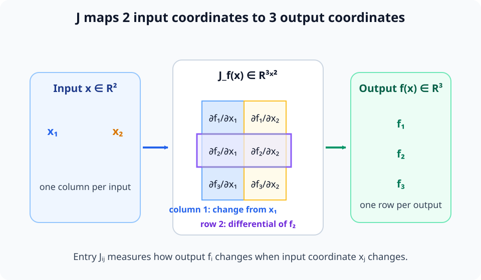
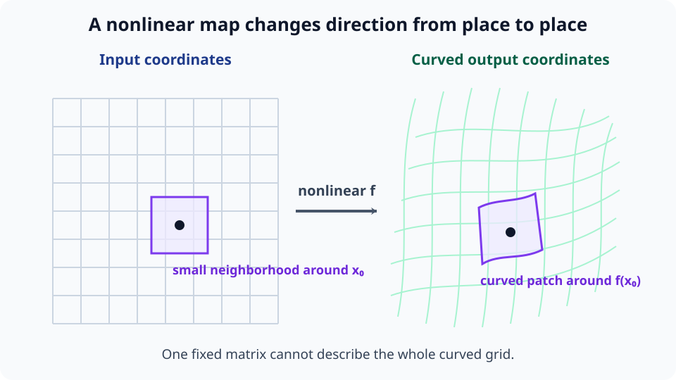
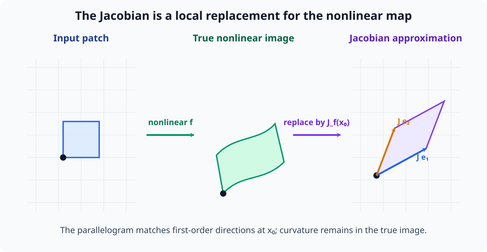
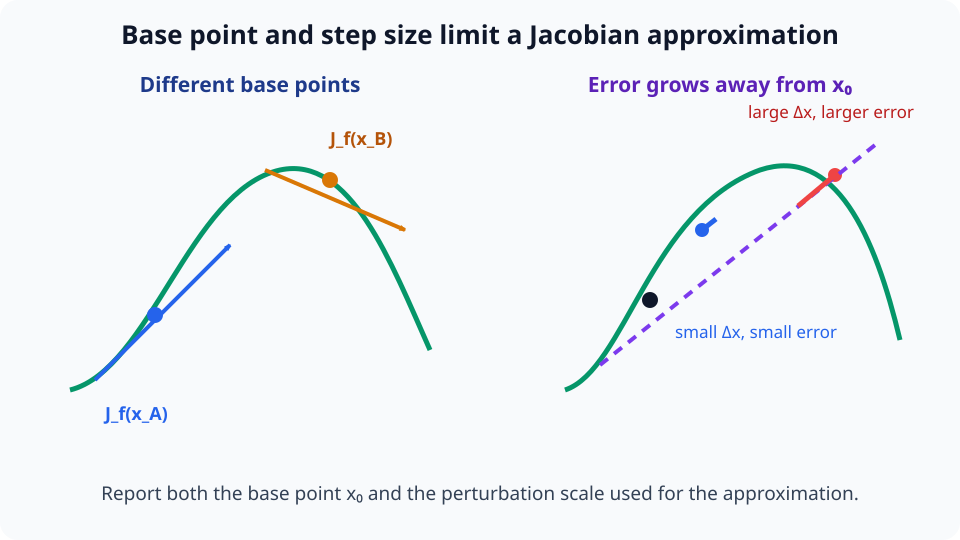
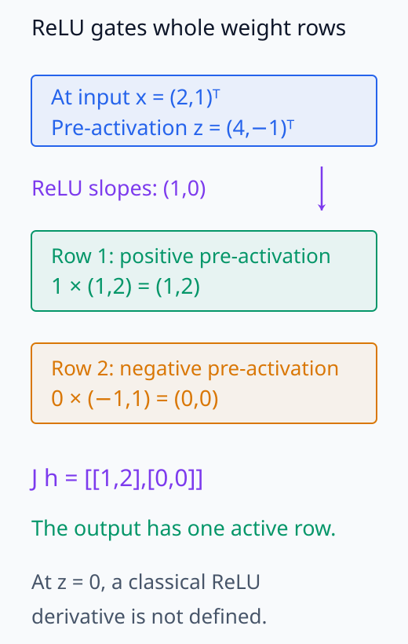
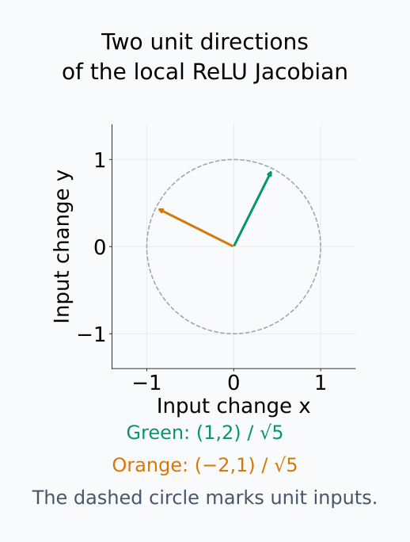
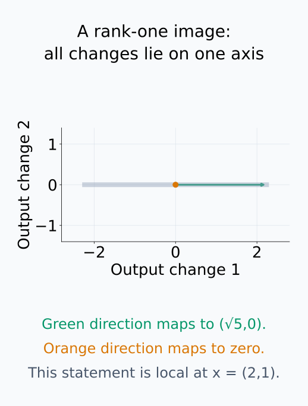
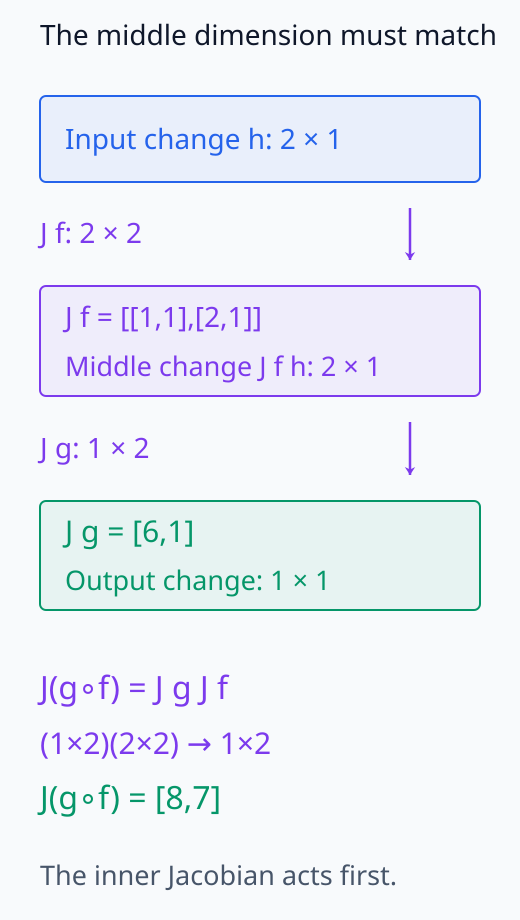

# M03-11. Jacobian

## 이 단원이 필요한 이유

total derivative는 작은 입력 변화를 작은 출력 변화로 보내는 선형사상이다. 기저를 고르면 이 사상을 행렬로 나타낼 수 있다. 그 행렬이 Jacobian이다.

신경망에서 Jacobian은 입력 perturbation이 activation이나 logit으로 전달되는 일차 효과를 계산한다. 행과 열의 convention을 고정하지 않으면 행렬곱의 순서와 shape이 뒤집힌다. 이 프로젝트는 출력 성분을 행, 입력 성분을 열로 둔다.

## 학습 목표

이 단원을 마치면 다음을 할 수 있다.

- vector 함수의 Jacobian을 출력 행·입력 열 convention으로 구성할 수 있다.
- Jacobian의 행, 열과 shape을 함수의 입력·출력에 연결할 수 있다.
- Jacobian-vector product로 방향별 출력 변화를 계산할 수 있다.
- 합성함수의 Jacobian을 올바른 순서의 행렬곱으로 계산할 수 있다.
- affine layer와 원소별 activation의 Jacobian을 구할 수 있다.
- rank, kernel과 singular value를 국소 민감도에 연결할 수 있다.
- 유한차분으로 Jacobian 계산을 점검할 수 있다.

## 선수지식 확인

- 선수 단원: [M03-10 total derivative와 differential](M03-10-total-derivative-differential.md)
- 선수 단원: [M02-08 kernel, image와 rank](../M02/M02-08-kernel-image-rank.md)
- 선수 단원: [M02-13 특이값분해](../M02/M02-13-singular-value-decomposition.md)
- 확인 질문: total derivative가 입력 변화벡터를 출력 변화벡터로 보내는 선형사상임을 설명할 수 있는가?
- 확인 질문: 행렬의 kernel, rank와 특이값을 방향별 증폭으로 해석할 수 있는가?

total derivative나 SVD가 불분명하면 선수 단원을 먼저 복습한다.

## 기호와 용어

| 기호·용어 | Common spoken reading | 의미 | shape |
|---|---|---|---|
| $f:\mathbb R^n\to\mathbb R^m$ | `f maps R to the n into R to the m` | $n$차원 입력을 $m$차원 출력으로 보내는 함수 | $f=(f_1,\ldots,f_m)^\top$ |
| $\mathbf J_f(\mathbf x)$ | `the Jacobian of f at x` | $Df(\mathbf x)$의 표준기저 행렬 | $m\times n$ |
| $J_{ij}$ | `J sub i j` | 출력 $f_i$의 입력 $x_j$에 대한 편미분 | scalar |
| $\mathbf J_f(\mathbf x)\mathbf v$ | `the Jacobian of f at x times v` | $\mathbf v$ 방향의 일차 출력 변화 | $m\times1$ |
| local sensitivity | `local sensitivity` | 기준점 주변의 작은 입력 변화에 대한 출력 변화 | norm과 방향을 밝혀야 한다. |

## 핵심 개념 1. Jacobian은 total derivative의 좌표행렬이다

\[
f(\mathbf x)
=
\begin{bmatrix}
f_1(\mathbf x)\\
\vdots\\
f_m(\mathbf x)
\end{bmatrix}
\]

라 하자. 이하에서는 $f$가 기준점 $\mathbf x$에서 미분 가능하다고 가정한다. 편미분들을 배열로 모을 수 있다는 것과 그 배열이 total derivative를 나타낸다는 것은 구분해야 한다. 후자는 M03-10의 전체 잔차 조건을 필요로 한다. 표준기저에서 Jacobian을

\[
\mathbf J_f(\mathbf x)
=
\left[
\frac{\partial f_i}{\partial x_j}(\mathbf x)
\right]
\in\mathbb R^{m\times n}
\]

로 정의한다.

행을 펼치면

\[
\mathbf J_f(\mathbf x)
=
\begin{bmatrix}
\dfrac{\partial f_1}{\partial x_1}
&
\cdots
&
\dfrac{\partial f_1}{\partial x_n}
\\
\vdots
&
\ddots
&
\vdots
\\
\dfrac{\partial f_m}{\partial x_1}
&
\cdots
&
\dfrac{\partial f_m}{\partial x_n}
\end{bmatrix}_{\mathbf x}
\]

이다. 출력 dimension $m$이 행 수이고 입력 dimension $n$이 열 수다.

큰 행렬 아래의 $\mathbf x$는 모든 편미분을 같은 기준점에서 평가한다는 뜻이다. $J_{ij}$에서 $i$는 무엇을 관찰하는지, $j$는 무엇을 변화시키는지를 고른다. 따라서 입력 한 좌표에 대한 $m$개 출력 변화율을 담는 열이 $n$개 필요하다.

## 핵심 개념 2. 각 행은 출력 성분의 differential이다

$i$번째 출력 $f_i:\mathbb R^n\to\mathbb R$의 differential은 covector다. 그 표준좌표 행은

\[
\begin{bmatrix}
\dfrac{\partial f_i}{\partial x_1}
&
\cdots
&
\dfrac{\partial f_i}{\partial x_n}
\end{bmatrix}
\]

이다. Jacobian은 $m$개 출력 differential을 행으로 쌓는다.

$j$번째 열은 입력 좌표 $x_j$만 변화시켰을 때 모든 출력 성분이 보이는 변화율이다.

\[
\mathbf J_f(\mathbf x)\mathbf e_j
=
\frac{\partial f}{\partial x_j}(\mathbf x)
\in\mathbb R^m
\]

행은 scalar 출력 하나를 측정하고, 열은 입력 방향 하나가 만드는 vector 출력을 기록한다.

임의의 입력 변화 $\Delta\mathbf x$에 대해 $i$번째 행이 계산하는 값은

\[
d(f_i)_{\mathbf x}(\Delta\mathbf x)
=\sum_{j=1}^n J_{ij}(\mathbf x)\Delta x_j
=\bigl(\mathbf J_f(\mathbf x)\Delta\mathbf x\bigr)_i
\]

다. 행 하나는 입력 변화 전체를 받아 출력 성분 하나의 일차 변화를 계산한다. 이 값들을 출력 번호 $i$ 순서로 쌓으면 전체 출력 변화벡터가 된다. 반대로 $\Delta\mathbf x=\mathbf e_j$를 넣으면 $\Delta x_j=1$이고 나머지 계수가 0이므로 $j$번째 열만 남는다.

<figure class="lesson-figure lesson-figure--wide" markdown="1">

<figcaption>열 하나는 입력 방향 하나가 만드는 전체 출력 변화를, 행 하나는 출력 성분 하나가 입력 변화를 측정하는 방식을 나타낸다.</figcaption>
</figure>

그림의 파란 첫째 열은 $\mathbf e_1$ 방향으로 움직였을 때 세 출력 성분이 함께 얼마나 변하는지를 모은다. 주황 첫째 행은 같은 입력 변화에서 출력 $f_1$만 어떻게 변하는지를 읽는다. 같은 배열을 열로 읽을 때는 vector 출력의 변화이고, 행으로 읽을 때는 scalar 출력의 differential이다.

## 핵심 개념 3. Jacobian은 국소 선형화를 계산한다

$f$가 $\mathbf x$에서 미분 가능하면

\[
f(\mathbf x+\Delta\mathbf x)
\approx
f(\mathbf x)
+
\mathbf J_f(\mathbf x)\Delta\mathbf x
\]

이다.

shape은

\[
\underbrace{\Delta\mathbf y}_{m\times1}
\approx
\underbrace{\mathbf J_f(\mathbf x)}_{m\times n}
\underbrace{\Delta\mathbf x}_{n\times1}
\]

이다.

실제 출력 변화는 $\Delta\mathbf y=f(\mathbf x+\Delta\mathbf x)-f(\mathbf x)$다. 행렬곱은 이 차이의 일차항을 계산하며, 새 출력값을 얻으려면 기준 출력 $f(\mathbf x)$를 더해야 한다. $\mathbf J_f(\mathbf x)\mathbf x$가 기준 출력과 같다는 뜻은 아니다.

잔차를 $\mathbf r_{\mathbf x}(\Delta\mathbf x)=\Delta\mathbf y-\mathbf J_f(\mathbf x)\Delta\mathbf x$라 하면 미분 가능성은

\[
\lim_{\Delta\mathbf x\to\mathbf 0}
\frac{\|\mathbf r_{\mathbf x}(\Delta\mathbf x)\|_2}
{\|\Delta\mathbf x\|_2}=0
\]

을 뜻한다. 이 극한에서는 기준점과 Jacobian을 고정하고 이동량만 줄인다. 기준점을 바꾸면 다른 잔차 조건을 검사하는 것이므로, 한 점의 미분 가능성에서 모든 점에 공통인 허용 이동량을 얻지는 못한다. 또한 이 조건만으로 잔차가 이동량의 제곱에 비례한다고 단정할 수 없다.

입력 변화 방향 $\mathbf v$를 넣은

\[
\mathbf J_f(\mathbf x)\mathbf v
\]

를 Jacobian-vector product(JVP)라고 한다. JVP는 $\mathbf v$ 방향의 출력 변화율이다. 큰 Jacobian을 만들지 않고 JVP를 계산하는 방법은 M03-13에서 다룬다.

예를 들어 실제 변위를 $t\mathbf v$로 줄이면 선형성으로 일차 출력 변화는 $t\mathbf J_f(\mathbf x)\mathbf v$다. 이를 $t$로 나눈 뒤 $t\to0$의 극한을 취해 변화율 $\mathbf J_f(\mathbf x)\mathbf v$를 얻는다. 예제 4의 유한차분은 이 극한을 작은 비영 $t$에서 점검하는 계산이다.

### 시각적 직관: 휘어진 좌표격자를 한 점에서 곧게 편다

<figure class="lesson-figure lesson-figure--wide" markdown="1">

<figcaption>비선형함수는 입력의 곧은 격자를 휘어진 격자로 보낼 수 있지만, 한 점 주변의 작은 영역은 평행사변형에 가까워진다.</figcaption>
</figure>

왼쪽의 같은 크기 정사각형들이 오른쪽에서는 위치에 따라 다른 방향과 크기로 휘어진다. 따라서 전체 변환을 행렬 하나로 나타낼 수는 없다. 다만 보라색 영역처럼 기준점 주변을 충분히 작게 보면, 휘어진 경계의 1차 변화만 남겨 선형변환으로 근사할 수 있다.

<figure class="lesson-figure lesson-figure--wide" markdown="1">

<figcaption>작은 입력 사각형의 두 변은 실제 함수에서 조금 휘지만, Jacobian은 같은 두 변을 평행사변형의 두 변으로 보낸다.</figcaption>
</figure>

입력 사각형의 두 변 $\mathbf e_1,\mathbf e_2$는 Jacobian을 거쳐 각각 $\mathbf J_f(\mathbf x)\mathbf e_1$, $\mathbf J_f(\mathbf x)\mathbf e_2$가 된다. 두 벡터가 만드는 평행사변형이 실제로 휘어진 작은 출력 영역의 1차 근사다. Jacobian은 입력점과 출력점을 직접 대응시키는 새 모델이 아니라, 이미 정한 기준점 $\mathbf x$에서 **변화량**을 대응시키는 선형사상이다.

기준점을 바꾸면 일반적으로 Jacobian도 달라진다. 그러므로 여러 점의 국소 선형화를 이어서 본 결과를 하나의 전역 행렬처럼 해석해서는 안 된다. $\Delta\mathbf x$가 충분히 작다는 조건과 어느 점에서 Jacobian을 계산했는지를 함께 기록해야 한다.

<figure class="lesson-figure lesson-figure--wide" markdown="1">

<figcaption>기준점이 달라지면 접선과 Jacobian이 달라지고, 같은 기준점에서도 이동량이 커질수록 선형 근사의 오차가 커진다.</figcaption>
</figure>

왼쪽은 같은 함수라도 기준점 $x_a$와 $x_b$에서 기울기가 다름을 보여 준다. 오른쪽에서 작은 이동은 접선과 실제 곡선이 거의 겹치지만, 큰 이동은 둘의 차이가 눈에 띈다. 그래서 Jacobian으로 민감도를 말할 때는 기준점과 변화 크기를 생략할 수 없다.

## 핵심 개념 4. scalar 함수의 Jacobian은 gradient의 전치다

$m=1$이면 Jacobian shape은 $1\times n$이다.

\[
\mathbf J_f(\mathbf x)
=
\begin{bmatrix}
\dfrac{\partial f}{\partial x_1}
&
\cdots
&
\dfrac{\partial f}{\partial x_n}
\end{bmatrix}
\]

표준 Euclidean 내적의 gradient는 열벡터이므로

\[
\mathbf J_f(\mathbf x)
=
\nabla f(\mathbf x)^\top
\]

이다. Jacobian 행은 differential의 좌표이고 gradient 열은 내적으로 그 covector를 나타낸 벡터다.

## 핵심 개념 5. 연쇄법칙은 Jacobian 행렬곱이다

\[
f:\mathbb R^n\to\mathbb R^m,
\qquad
g:\mathbb R^m\to\mathbb R^p
\]

라 하자. 합성의 Jacobian은

\[
\mathbf J_{g\circ f}(\mathbf x)
=
\mathbf J_g(f(\mathbf x))
\mathbf J_f(\mathbf x)
\]

이다.

shape은

\[
\underbrace{\mathbf J_{g\circ f}}_{p\times n}
=
\underbrace{\mathbf J_g}_{p\times m}
\underbrace{\mathbf J_f}_{m\times n}
\]

이다. 입력에 가까운 함수의 Jacobian이 오른쪽에 놓인다.

## 핵심 개념 6. 자주 쓰는 층의 Jacobian

affine 함수

\[
f(\mathbf x)=\mathbf W\mathbf x+\mathbf b
\]

의 Jacobian은 모든 $\mathbf x$에서

\[
\mathbf J_f(\mathbf x)=\mathbf W
\]

다. bias는 입력에 따라 변하지 않으므로 Jacobian에 나타나지 않는다.

입력을 $\Delta\mathbf x$만큼 바꾸어 두 출력값을 빼면 $\mathbf W(\mathbf x+\Delta\mathbf x)+\mathbf b-(\mathbf W\mathbf x+\mathbf b)=\mathbf W\Delta\mathbf x$다. 이 경우에는 선형예측 뒤의 잔차가 0이며, 입력 대신 weight나 bias를 미분하는 계산과는 대상이 다르다.

원소별 함수

\[
\sigma(\mathbf z)
=
\begin{bmatrix}
\sigma(z_1)\\
\vdots\\
\sigma(z_m)
\end{bmatrix}
\]

의 Jacobian은

\[
\mathbf J_\sigma(\mathbf z)
=
\operatorname{diag}
\left(
\sigma'(z_1),\ldots,\sigma'(z_m)
\right)
\]

이다.

여기서는 각 $\sigma'(z_i)$가 존재한다고 가정한다. 출력 $\sigma(z_i)$는 $z_i$에만 의존하므로 $z_j$로 미분하면 $i\ne j$일 때 0이고, $i=j$일 때 $\sigma'(z_i)$다. 좌표 사이의 교차항이 없어서 대각행렬이 된다.

따라서

\[
\mathbf h(\mathbf x)
=
\sigma(\mathbf W\mathbf x+\mathbf b)
\]

의 Jacobian은

\[
\mathbf J_{\mathbf h}(\mathbf x)
=
\operatorname{diag}
\left(
\sigma'(\mathbf W\mathbf x+\mathbf b)
\right)
\mathbf W
\]

이다. 대각행렬 표기 안의 vector에는 각 성분의 도함수를 적용한다.

오른쪽의 $\mathbf W$가 입력 변화를 pre-activation 변화로 보내고, 왼쪽 대각행렬이 각 출력좌표의 변화율을 곱한다. 행렬로 보면 $\mathbf W$의 $i$번째 행 전체에 $\sigma'(z_i)$를 곱하는 계산이다.

## 핵심 개념 7. rank와 특이값은 국소 방향을 설명한다

고정한 점 $\mathbf x$에서 Jacobian을 선형변환으로 보면

- $\ker\mathbf J_f(\mathbf x)$의 방향은 일차 출력 변화를 만들지 않는다.
- $\operatorname{im}\mathbf J_f(\mathbf x)$는 일차로 도달 가능한 출력 변화 방향이다.
- $\operatorname{rank}\mathbf J_f(\mathbf x)$는 독립적인 일차 출력 변화 방향의 수다.

SVD

\[
\mathbf J_f(\mathbf x)
=
\mathbf U\boldsymbol\Sigma\mathbf V^\top
\]

에서 오른쪽 특이벡터는 입력 perturbation 방향이고 특이값은 일차 증폭률이다. 가장 큰 특이값은 Euclidean norm에서의 최대 국소 증폭률이다.

SVD의 대응하는 단위 특이벡터들을 $\mathbf v_i,\mathbf u_i$라 쓰면 $\mathbf J_f(\mathbf x)\mathbf v_i=\sigma_i\mathbf u_i$다. 따라서 실제 입력을 $t\mathbf v_i$만큼 움직였을 때의 일차 출력 변화는 $t\sigma_i\mathbf u_i$다. 특이값은 단위 입력 방향의 변화율 크기를 정하며, 실제 유한 이동의 출력에는 앞 절의 잔차가 더해진다.

이 값들은 기준점과 좌표 scaling에 의존한다. 직교 기저변환은 singular value를 보존하지만 일반 가역 재매개화는 바꿀 수 있다.

## 예제 1. $2$차원 입력과 $3$차원 출력의 Jacobian

### 문제

\[
f(x,y)
=
\begin{bmatrix}
x^2y\\
\sin x\\
x+y
\end{bmatrix}
\]

의 Jacobian을 구하고 $(1,2)$에서 $\mathbf v=(1,-1)^\top$ 방향의 일차 변화를 계산하라.

### 풀이

각 출력 성분을 각 입력으로 편미분하면

\[
\mathbf J_f(x,y)
=
\begin{bmatrix}
2xy&x^2\\
\cos x&0\\
1&1
\end{bmatrix}
\]

이다. 점 $(1,2)$에서는

\[
\mathbf J_f(1,2)
=
\begin{bmatrix}
4&1\\
\cos1&0\\
1&1
\end{bmatrix}
\]

이다. 방향벡터를 곱하면

\[
\mathbf J_f(1,2)
\begin{bmatrix}
1\\-1
\end{bmatrix}
=
\begin{bmatrix}
3\\
\cos1\\
0
\end{bmatrix}
\]

이다.

### 결과의 의미

입력은 $(1,-1)$ 방향으로 움직이고, 세 출력 성분의 일차 변화율은 각각 $3$, $\cos1$, 0이다.

## 예제 2. ReLU 층의 Jacobian

\[
\mathbf W=
\begin{bmatrix}
1&2\\
-1&1
\end{bmatrix},
\qquad
\mathbf x=
\begin{bmatrix}
2\\1
\end{bmatrix},
\qquad
\mathbf b=\mathbf 0
\]

이고

\[
\mathbf h(\mathbf x)
=
\operatorname{ReLU}(\mathbf W\mathbf x)
\]

라 하자. pre-activation은

\[
\mathbf z
=
\mathbf W\mathbf x
=
\begin{bmatrix}
4\\-1
\end{bmatrix}
\]

이다. $z_1>0$이고 $z_2<0$이므로

\[
\mathbf J_{\operatorname{ReLU}}(\mathbf z)
=
\begin{bmatrix}
1&0\\
0&0
\end{bmatrix}
\]

이다. 연쇄법칙으로

\[
\mathbf J_{\mathbf h}(\mathbf x)
=
\begin{bmatrix}
1&0\\
0&0
\end{bmatrix}
\begin{bmatrix}
1&2\\
-1&1
\end{bmatrix}
=
\begin{bmatrix}
1&2\\
0&0
\end{bmatrix}
\]

이다.

둘째 출력은 이 점 주변의 작은 변화에 대해 비활성 상태이고 첫째 출력만 일차 변화를 전달한다. ReLU는 $z_i=0$에서 고전적 미분이 존재하지 않으므로 그 점에서는 별도 convention이 필요하다.

예제 2에서는 ReLU의 각 기울기를 weight 행 전체에 곱한다. 그 뒤에 남는 입력 방향과 출력 방향도 비교할 수 있다.

<figure class="lesson-figure" markdown="1">

<figcaption>z₁>0이므로 첫 행은 그대로, z₂<0이므로 둘째 행은 영행으로 바뀐다. 이 Jacobian은 입력에 대한 국소 변화율이며 영행이 전역적으로 사용되지 않는 feature를 뜻하지는 않는다.</figcaption>

</figure>

<figure class="lesson-figure" markdown="1">

<figcaption>초록 방향과 주황 방향은 모두 길이가 1이지만 Jacobian이 보내는 결과는 다르다. 주황 방향에서는 h₁+2h₂=0이 되어 일차 출력 변화가 상쇄된다.</figcaption>

</figure>

<figure class="lesson-figure" markdown="1">

<figcaption>두 입력 방향을 위 Jacobian으로 보내면 초록 방향의 출력 길이는 √5, 주황 방향의 출력은 영벡터다. 모든 일차 출력 변화는 첫 출력축에 놓이므로 rank는 1이다.</figcaption>

</figure>

## 예제 3. 합성 Jacobian의 shape과 값

\[
f(x,y)
=
\begin{bmatrix}
x+y\\
xy
\end{bmatrix},
\qquad
g(u,v)=u^2+v
\]

라 하자. M03-10에서 구한 식을 Jacobian 표기로 쓰면

\[
\mathbf J_f(1,2)
=
\begin{bmatrix}
1&1\\
2&1
\end{bmatrix}
\]

\[
\mathbf J_g(f(1,2))
=
\begin{bmatrix}
6&1
\end{bmatrix}
\]

이다. 따라서

\[
\mathbf J_{g\circ f}(1,2)
=
\begin{bmatrix}
6&1
\end{bmatrix}
\begin{bmatrix}
1&1\\
2&1
\end{bmatrix}
=
\begin{bmatrix}
8&7
\end{bmatrix}
\]

이다.

예제 3의 행렬곱에서는 중간 변화벡터의 두 성분이 다음 Jacobian의 두 열과 맞아야 한다.

<figure class="lesson-figure" markdown="1">

<figcaption>오른쪽 2×2 Jacobian이 먼저 입력 변화를 중간 변화로 보내고, 왼쪽 1×2 Jacobian이 scalar 변화를 만든다. 합성 결과는 원래 두 입력 성분에 작용하는 1×2 행이다.</figcaption>

</figure>

## 예제 4. 유한차분으로 JVP 점검하기

예제 1에서 $\varepsilon>0$을 작게 잡으면

\[
\frac{
f(\mathbf x+\varepsilon\mathbf v)-f(\mathbf x)
}{
\varepsilon
}
\approx
\mathbf J_f(\mathbf x)\mathbf v
\]

이다. $\mathbf x=(1,2)^\top$, $\mathbf v=(1,-1)^\top$에서 첫 출력은

\[
f_1(1+\varepsilon,2-\varepsilon)
=(1+\varepsilon)^2(2-\varepsilon)
\]

이다. 전개하면

\[
(1+2\varepsilon+\varepsilon^2)(2-\varepsilon)
=
2+3\varepsilon-\varepsilon^3
\]

이므로

\[
\frac{f_1(\mathbf x+\varepsilon\mathbf v)-f_1(\mathbf x)}
{\varepsilon}
=
3-\varepsilon^2
\to3
\]

이다. 이는 Jacobian이 계산한 첫 성분 3과 일치한다.

## 흔한 오해

### 오해 1. Jacobian의 행과 열 convention은 어디서나 같다

문헌과 소프트웨어가 다른 convention을 사용할 수 있다. 이 프로젝트는 출력 성분을 행, 입력 성분을 열로 둔다.

### 오해 2. scalar 함수의 Jacobian과 gradient는 같은 shape이다

Jacobian은 $1\times n$ 행이고 Euclidean gradient는 $n\times1$ 열이다. 둘은 전치 관계다.

### 오해 3. Jacobian의 0 원소는 해당 feature가 모델 전체에서 사용되지 않는다는 뜻이다

0은 지정한 점에서 해당 입력좌표가 해당 출력성분에 미치는 일차 변화율이 0이라는 뜻이다. 다른 점, 유한한 변화와 다른 출력 경로에서는 효과가 있을 수 있다.

### 오해 4. 큰 singular value 하나가 전역 불안정성을 증명한다

singular value는 지정한 점의 Euclidean 국소 증폭률이다. 전역 안정성에는 입력 영역 전체와 유한 perturbation을 평가하는 근거가 필요하다.

## 연습문제

### 1. Jacobian shape

$f:\mathbb R^4\to\mathbb R^3$의 Jacobian shape을 적고 $J_{2,4}$의 의미를 설명하라.

해설 보기

출력 dimension이 행 수, 입력 dimension이 열 수이므로 shape은 $3\times4$다.

\[
J_{2,4}
=
\frac{\partial f_2}{\partial x_4}
\]

이며 넷째 입력좌표 변화에 대한 둘째 출력성분의 국소 변화율이다.

### 2. Jacobian 계산

\[
f(x,y)
=
\begin{bmatrix}
x^2+y\\
xy
\end{bmatrix}
\]

의 Jacobian을 구하라.

해설 보기

첫 출력의 편미분은 $(2x,1)$이고 둘째 출력의 편미분은 $(y,x)$다. 따라서

\[
\mathbf J_f(x,y)
=
\begin{bmatrix}
2x&1\\
y&x
\end{bmatrix}
\]

이다.

### 3. JVP 계산

연습문제 2의 함수에서 $(1,2)$와 $\mathbf v=(3,-1)^\top$에 대한 JVP를 구하라.

해설 보기

\[
\mathbf J_f(1,2)
=
\begin{bmatrix}
2&1\\
2&1
\end{bmatrix}
\]

이므로

\[
\mathbf J_f(1,2)\mathbf v
=
\begin{bmatrix}
2&1\\
2&1
\end{bmatrix}
\begin{bmatrix}
3\\-1
\end{bmatrix}
=
\begin{bmatrix}
5\\5
\end{bmatrix}
\]

이다.

### 4. affine Jacobian

\[
f(\mathbf x)=\mathbf W\mathbf x+\mathbf b,
\qquad
\mathbf W\in\mathbb R^{5\times3}
\]

일 때 Jacobian과 그 shape을 적어라.

해설 보기

\[
\mathbf J_f(\mathbf x)=\mathbf W
\]

이고 shape은 $5\times3$이다. bias는 입력에 따라 변하지 않으므로 편미분에 기여하지 않는다.

### 5. 원소별 함수

\[
f(x_1,x_2)
=
\begin{bmatrix}
x_1^2\\
e^{x_2}
\end{bmatrix}
\]

의 Jacobian을 구하라.

해설 보기

각 출력은 대응하는 입력 하나에만 의존하므로

\[
\mathbf J_f(\mathbf x)
=
\begin{bmatrix}
2x_1&0\\
0&e^{x_2}
\end{bmatrix}
\]

이다.

### 6. 합성 shape

$f:\mathbb R^2\to\mathbb R^4$와 $g:\mathbb R^4\to\mathbb R^3$일 때 $\mathbf J_f$, $\mathbf J_g$와 $\mathbf J_{g\circ f}$의 shape을 적고 곱 순서를 써라.

해설 보기

\[
\mathbf J_f\in\mathbb R^{4\times2},
\qquad
\mathbf J_g\in\mathbb R^{3\times4}
\]

이므로

\[
\mathbf J_{g\circ f}
=
\mathbf J_g\mathbf J_f
\in
\mathbb R^{3\times2}
\]

이다.

### 7. 모델 주장 비판

“입력 Jacobian의 rank가 낮으므로 모델은 의미 있는 feature만 사용한다”는 문장을 비판하라.

해설 보기

낮은 rank는 지정한 입력점에서 일차 출력 변화가 낮은 차원의 부분공간에 놓인다는 뜻이다. 그 방향들이 인간이 정한 의미 feature인지, 다른 입력에서도 rank가 유지되는지, 유한 perturbation에서 같은 구조가 나타나는지는 정해지지 않는다. 여러 입력과 개입을 사용한 검증이 필요하다.

## 단원 요약

- Jacobian은 total derivative를 출력 행·입력 열 convention으로 나타낸 행렬이다.
- 각 행은 scalar 출력성분의 differential이고 각 열은 입력좌표 하나의 vector 변화율이다.
- Jacobian과 입력 변화벡터의 곱은 국소 출력 변화를 계산한다.
- 합성함수의 Jacobian은 바깥 함수 Jacobian과 안쪽 함수 Jacobian의 곱이다.
- affine layer의 Jacobian은 weight이고 원소별 activation의 Jacobian은 대각행렬이다.
- kernel, rank와 singular value는 지정한 점의 일차 민감도 구조를 설명한다.

## 통과 기준

다음 질문에 자료를 보지 않고 답할 수 있으면 통과한다.

- 함수의 입력·출력 dimension에서 Jacobian shape을 정할 수 있는가?
- 출력 행·입력 열 convention으로 Jacobian을 계산할 수 있는가?
- JVP로 방향별 출력 변화를 구할 수 있는가?
- 합성 Jacobian의 행렬곱 순서를 정할 수 있는가?
- affine layer와 원소별 activation의 Jacobian을 구할 수 있는가?
- Jacobian의 kernel, rank와 singular value를 국소적으로 해석할 수 있는가?
- 유한차분으로 계산을 점검할 수 있는가?

## 다음 단원

- [M03-12 Hessian](M03-12-hessian.md)

## 집필자 점검표

- [x] 학습 목표가 관찰 가능한 행동으로 작성됐다.
- [x] 출력 행·입력 열 convention을 고정했다.
- [x] Jacobian의 행, 열과 shape을 설명했다.
- [x] 합성 Jacobian과 JVP를 계산했다.
- [x] 신경망 층의 Jacobian을 포함했다.
- [x] 국소 민감도와 전역 주장을 구분했다.
- [x] 모든 문제에 해설이 있다.
- [x] 모델 해석 주장의 강도를 구분했다.
- [x] 용어집과 표기 규칙을 따랐다.
- [x] 내부 링크와 수식 구분자를 확인했다.
- [x] Common spoken reading이 실제 영어 학술 발화이며 한글 음역이나 기계적 직역을 포함하지 않는다.
