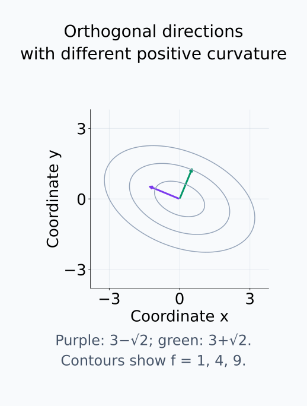
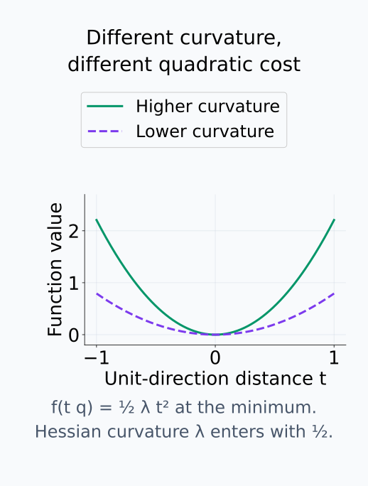
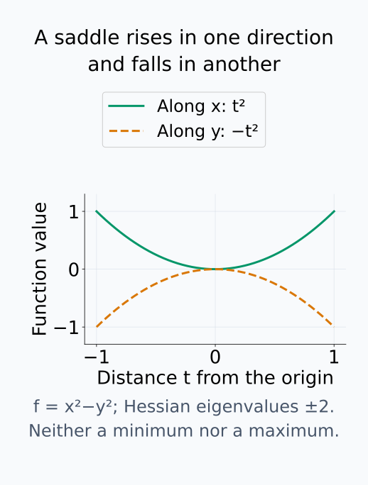
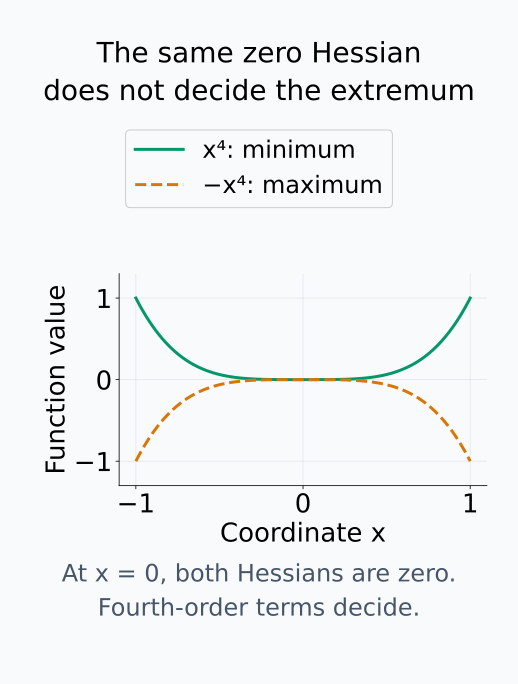
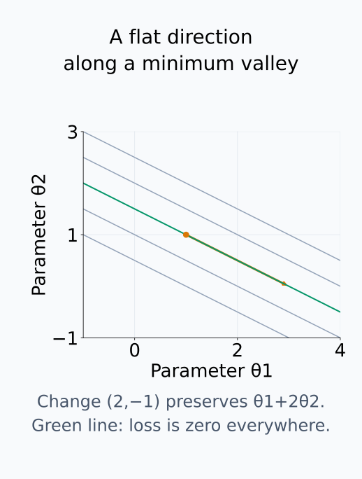
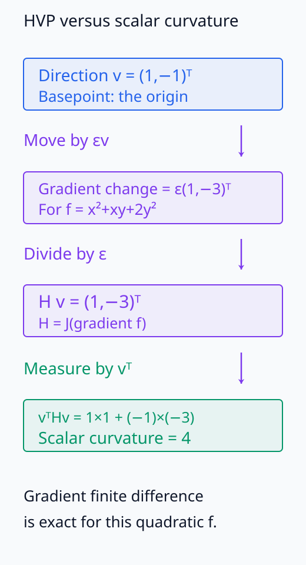
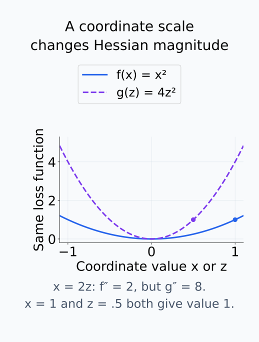

# M03-12. Hessian

## 이 단원이 필요한 이유

gradient는 한 점에서 scalar 함수의 일차 변화를 나타낸다. gradient가 입력에 따라 어떻게 변하는지 알려면 이차 미분이 필요하다. Hessian은 scalar 함수의 이차 편미분을 모은 행렬이며, 한 점 주변의 이차 곡률을 나타낸다.

학습 loss의 Hessian은 파라미터 방향별 곡률, 평평한 방향과 saddle 구조를 조사할 때 사용한다. Hessian의 원소와 고유값은 파라미터 좌표와 scaling에 의존한다. 한 지점의 Hessian만으로 전체 loss landscape나 학습 경로를 결론 내리면 안 된다.

## 학습 목표

이 단원을 마치면 다음을 할 수 있다.

- scalar 함수의 Hessian을 이차 편미분 행렬로 구성할 수 있다.
- 연속인 혼합편미분 조건에서 Hessian의 대칭성을 설명할 수 있다.
- second differential과 Hessian의 bilinear form을 연결할 수 있다.
- 이차 Taylor 근사와 방향별 곡률을 계산할 수 있다.
- 임계점에서 Hessian 고유값으로 최소·최대·saddle 후보를 판정할 수 있다.
- Hessian-vector product를 계산하고 큰 Hessian에서의 역할을 설명할 수 있다.
- Hessian 기반 주장의 좌표·지점 의존성을 제한할 수 있다.

## 선수지식 확인

- 선수 단원: [M01-12 Taylor 근사](../M01/M01-12-taylor-approximation.md)
- 선수 단원: [M03-08 bilinear form과 quadratic form](M03-08-bilinear-quadratic-forms.md)
- 선수 단원: [M03-11 Jacobian](M03-11-jacobian.md)
- 확인 질문: scalar 함수의 gradient를 계산할 수 있는가?
- 확인 질문: quadratic form $\mathbf v^\top\mathbf A\mathbf v$를 계산하고 대칭행렬의 고유값 부호를 해석할 수 있는가?
- 확인 질문: Jacobian이 vector 함수의 total derivative 행렬임을 설명할 수 있는가?

gradient, quadratic form이나 Jacobian이 불분명하면 선수 단원을 먼저 복습한다.

## 기호와 용어

| 기호·용어 | Common spoken reading | 의미 | shape |
|---|---|---|---|
| $f:\mathbb R^n\to\mathbb R$ | `f maps R to the n into R` | scalar 출력 함수 | loss 등 |
| $\mathbf H_f(\mathbf x)$ | `the Hessian of f at x` | $f$의 이차 편미분 행렬 | $n\times n$ |
| $H_{ij}$ | `H sub i j` | $\partial^2f/\partial x_i\partial x_j$ | scalar |
| $d^2f_{\mathbf x}$ | `the second differential of f at x` | 두 변화벡터를 scalar로 보내는 bilinear form | order 2 |
| $\mathbf v^\top\mathbf H_f\mathbf v$ | `v transpose H sub f v` | $\mathbf v$ 방향의 이차 변화율 | scalar |
| HVP | `H V P` | Hessian-vector product | $\mathbf H_f(\mathbf x)\mathbf v$ |

activation 행렬과 구분해야 할 때 본문에서 $\mathbf H_f$를 Hessian이라고 병기한다.

## 핵심 개념 1. Hessian은 gradient의 Jacobian이다

두 번 미분 가능한 scalar 함수

\[
f:\mathbb R^n\to\mathbb R
\]

의 Hessian을

\[
\mathbf H_f(\mathbf x)
=
\left[
\frac{\partial^2f}
{\partial x_i\partial x_j}
(\mathbf x)
\right]
\in\mathbb R^{n\times n}
\]

로 정의한다.

gradient를

\[
\nabla f(\mathbf x)
=
\begin{bmatrix}
\dfrac{\partial f}{\partial x_1}\\
\vdots\\
\dfrac{\partial f}{\partial x_n}
\end{bmatrix}
\]

로 쓰면

\[
\mathbf H_f(\mathbf x)
=
\mathbf J_{\nabla f}(\mathbf x)
\]

이다. Hessian의 $i$번째 행은 gradient의 $i$번째 성분이 각 입력좌표에 따라 변하는 비율이다.

여기서는 표준 Euclidean 내적의 gradient를 사용한다. 이 gradient는 $\mathbb R^n$에서 $\mathbb R^n$으로 가는 vector 함수이므로 Jacobian에 출력 $n$개와 입력 $n$개의 자리가 생긴다. Hessian의 $(i,j)$ 원소는 gradient의 $i$번째 성분인 $\partial f/\partial x_i$를 $x_j$로 한 번 더 미분한 값이다. 두 입력좌표가 달라도 같은 scalar 함수의 변화율을 두 번 조사한다는 점이 일반 vector 출력의 Jacobian과 다르다. 혼합편미분의 순서를 교환할 조건은 다음 절에서 확인한다.

## 핵심 개념 2. 충분히 매끄러운 함수의 Hessian은 대칭이다

점 주변에서 이차 혼합편미분이 연속이면 Clairaut 정리에 따라

\[
\frac{\partial^2f}
{\partial x_i\partial x_j}
=
\frac{\partial^2f}
{\partial x_j\partial x_i}
\]

이다. 따라서

\[
\mathbf H_f(\mathbf x)^\top
=
\mathbf H_f(\mathbf x)
\]

이다.

혼합편미분의 존재만으로 모든 병적인 경우까지 대칭성이 보장되는 것은 아니다. 이 교재의 주요 예제에서는 이차 편미분이 연속인 함수를 사용한다.

대칭 Hessian은 실수 고유값과 정규직교 고유기저를 갖는다. 각 고유벡터는 국소 곡률의 주방향이고 대응 고유값은 그 방향의 이차 변화율이다.

예제 1의 Hessian에서는 서로 직교하는 두 고유방향이 모두 양의 곡률을 가지지만 그 크기는 다르다.

<figure class="lesson-figure" markdown="1">

<figcaption>등고선은 예제 1의 f=1,4,9이며 화살표는 두 고유벡터의 방향이다. 같은 길이로 그린 화살표가 같은 곡률을 뜻하지는 않는다. 보라 방향은 3−√2, 초록 방향은 3+√2의 곡률을 가진다.</figcaption>

</figure>

## 핵심 개념 3. second differential은 bilinear form이다

점 $\mathbf x$에서 second differential은 두 변화벡터 $\mathbf u,\mathbf v$를 받아

\[
d^2f_{\mathbf x}(\mathbf u,\mathbf v)
=
\mathbf u^\top
\mathbf H_f(\mathbf x)
\mathbf v
\]

를 내는 bilinear form이다.

first differential $df_{\mathbf x}$는 변화벡터 하나를 받아 일차 변화율을 계산한다. 이번에는 $\mathbf u$를 고정하고 기준점을 $\mathbf v$ 방향으로 바꾸면서 그 변화율이 얼마나 변하는지 조사한다. 즉,

\[
d^2f_{\mathbf x}(\mathbf u,\mathbf v)
=\left.\frac{d}{dt}\left[df_{\mathbf x+t\mathbf v}(\mathbf u)\right]\right|_{t=0}
=\mathbf u^\top\mathbf H_f(\mathbf x)\mathbf v
\]

다. 첫째 자리는 측정할 일차 변화 방향이고 둘째 자리는 그 측정의 기준점을 변화시키는 방향이다. 기준점에서 Hessian을 고정하면 $\mathbf H_f\mathbf v$는 $\mathbf v$에 선형이고, $\mathbf u^\top$로 측정하는 값은 $\mathbf u$에 선형이므로 두 자리 각각의 선형성이 성립한다.

같은 방향을 두 번 넣으면

\[
d^2f_{\mathbf x}(\mathbf v,\mathbf v)
=
\mathbf v^\top
\mathbf H_f(\mathbf x)
\mathbf v
\]

인 quadratic form을 얻는다. 이는 곡선

\[
\phi(t)=f(\mathbf x+t\mathbf v)
\]

의 이차 도함수와 같다.

\[
\phi''(0)
=
\mathbf v^\top\mathbf H_f(\mathbf x)\mathbf v
\]

경로의 일차 도함수는 $\phi'(t)=\nabla f(\mathbf x+t\mathbf v)^\top\mathbf v$다. 고정된 $\mathbf v$는 미분하지 않고 gradient의 변화만 미분하면 위 이차 도함수를 얻는다. $\mathbf v$를 $\alpha$배하면 두 자리에 모두 배율이 붙어 이차 변화율은 $\alpha^2$배가 된다. 이 값은 경로 파라미터 $t$에 대한 이차 변화율이므로, 단위 거리 기준으로 방향들을 비교하려면 비영벡터 $\mathbf v$를 단위벡터로 정규화한다.

## 핵심 개념 4. Hessian은 Taylor 이차항을 만든다

함수가 기준점 주변에서 두 번 연속 미분 가능하면 작은 변화 $\mathbf h$에 대해

\[
f(\mathbf x+\mathbf h)
\approx
f(\mathbf x)
+
\nabla f(\mathbf x)^\top\mathbf h
+
\frac12
\mathbf h^\top
\mathbf H_f(\mathbf x)
\mathbf h
\]

이다.

세 항의 역할은 다음과 같다.

| 항 | 역할 |
|---|---|
| $f(\mathbf x)$ | 기준 함수값 |
| $\nabla f(\mathbf x)^\top\mathbf h$ | 일차 변화 |
| $\frac12\mathbf h^\top\mathbf H_f(\mathbf x)\mathbf h$ | 이차 곡률 보정 |

경로 $t\mapsto f(\mathbf x+t\mathbf h)$에 일변수 Taylor 전개를 적용하면 $t=0$의 일차 도함수는 $\nabla f(\mathbf x)^\top\mathbf h$이고 이차 도함수는 $\mathbf h^\top\mathbf H_f(\mathbf x)\mathbf h$다. 따라서 일변수 전개에서 이차 도함수에 붙는 $1/2$가 여기에서도 남는다. 각 입력좌표의 제곱항만 따로 더하는 식이 아니라 $\mathbf h$의 성분들을 두 번 곱한 quadratic form이므로 서로 다른 좌표의 교차항도 포함한다.

근사식에서 생략한 잔차를 $r(\mathbf h)$라 하면 위 매끄러움 조건 아래

\[
\lim_{\mathbf h\to\mathbf 0}
\frac{|r(\mathbf h)|}{\|\mathbf h\|_2^2}=0
\]

이다. M03-10의 일차 근사는 잔차를 입력 크기로 나눴고, 여기서는 이차항까지 뺀 잔차를 입력 크기의 제곱으로 나눈다. 기준점의 gradient와 Hessian은 고정한 채 $\mathbf h$를 줄이며, 이차항을 넣었다고 함수 전체가 quadratic이라는 뜻은 아니다.

임계점에서는 $\nabla f(\mathbf x)=\mathbf 0$이므로 Hessian의 quadratic form이 가장 낮은 차수의 변화가 될 수 있다.

고유방향을 단위 길이로 맞추고 원점에서 같은 거리 $t$만큼 움직이면 Hessian의 두 곡률을 함수값으로 비교할 수 있다.

<figure class="lesson-figure" markdown="1">

<figcaption>원점은 gradient가 0인 임계점이므로 이 예에서는 f(tq)=½λ t²다. Hessian 고유값은 이차 변화율이고 실제 Taylor 이차항에는 1/2가 붙는다.</figcaption>

</figure>

## 핵심 개념 5. 고유값 부호는 임계점의 국소 모양을 분류한다

앞 절처럼 기준점 주변에서 두 번 연속 미분 가능한 함수의 $\nabla f(\mathbf x)=\mathbf 0$인 임계점에서 Hessian의 부호를 조사한다. strict local minimum은 충분히 가까운 다른 점들의 함수값이 기준값보다 모두 큰 경우이며, strict local maximum은 모두 작은 경우다.

대칭 Hessian의 정규직교 고유벡터를 $\mathbf q_i$, 대응 고유값을 $\lambda_i$라 하자. $\mathbf h=\sum_i c_i\mathbf q_i$로 전개하면

\[
\mathbf h^\top\mathbf H_f(\mathbf x)\mathbf h
=\sum_i\lambda_i c_i^2,
\qquad
\|\mathbf h\|_2^2=\sum_i c_i^2
\]

이다. 고유기저에서 서로 다른 방향의 교차항이 사라져 각 방향의 제곱 변화량에 고유값을 곱한 합이 된다.

- 모든 고유값이 양수면 strict local minimum이다.
- 모든 고유값이 음수면 strict local maximum이다.
- 양수와 음수 고유값이 함께 있으면 saddle point다.
- 0인 고유값이 있으면 이차 정보만으로 결론이 나지 않을 수 있다.

모든 고유값이 양수이면 가장 작은 값 $\lambda_{\min}>0$에 의해 quadratic form은 $\lambda_{\min}\|\mathbf h\|_2^2$ 이상이다. Taylor의 이차항에는 그 절반이 붙고, 잔차는 $\|\mathbf h\|_2^2$에 비해 사라지므로 충분히 작은 비영 $\mathbf h$에서 함수값의 증가를 뒤집지 못한다. 모든 고유값이 음수인 경우에는 반대로 함수값이 감소한다. 부호가 섞이면 양수 고유벡터 방향으로는 증가하고 음수 고유벡터 방향으로는 감소하는 가까운 점들이 생겨 극대·극소가 될 수 없다.

양의 준정부호 Hessian만으로 strict minimum을 보장하지 않는다. 예를 들어 $f(x)=x^4$의 원점 Hessian은 0이지만 원점은 strict minimum이고, $f(x)=-x^4$에서는 같은 Hessian 0이지만 strict maximum이다.

부호가 섞인 경우와 영 고유값으로 판정이 끝나지 않는 경우는 다음 곡선들에서 구분된다.

<figure class="lesson-figure" markdown="1">

<figcaption>예제 2의 원점에서 x 방향으로는 증가하고 y 방향으로는 감소한다. 그래서 이차항의 부호가 섞인 원점은 최소도 최대도 아니다.</figcaption>

</figure>

<figure class="lesson-figure" markdown="1">

<figcaption>두 함수의 원점 gradient와 Hessian은 모두 0이다. 그러나 양의 4차항은 최소를, 음의 4차항은 최대를 만들므로 Hessian 0만으로 판정을 완료할 수 없다.</figcaption>

</figure>

## 핵심 개념 6. Hessian-vector product는 방향별 곡률을 계산한다

Hessian-vector product는

\[
\mathbf H_f(\mathbf x)\mathbf v
\]

이다. 한 번 더 $\mathbf v^\top$을 곱하면 방향별 곡률을 얻는다.

\[
\mathbf v^\top
\left(
\mathbf H_f(\mathbf x)\mathbf v
\right)
\]

gradient를 vector 함수로 보고 M03-11의 JVP를 적용하면

\[
\left.\frac{d}{dt}\nabla f(\mathbf x+t\mathbf v)\right|_{t=0}
=\mathbf J_{\nabla f}(\mathbf x)\mathbf v
=\mathbf H_f(\mathbf x)\mathbf v
\]

다. HVP 자체는 방향 이동에 따른 gradient의 변화율 vector이고, 같은 방향 $\mathbf v$로 이 vector를 한 번 더 측정한 값이 scalar 이차 변화율이다. Hessian의 열들을 $v_j$로 선형결합하는 계산이므로 모든 열을 따로 저장해야만 곱을 구할 수 있는 것은 아니다. 예제 4의 gradient 유한차분은 이 변화율을 점검한다.

파라미터가 $P$개인 모델의 Hessian은 $P\times P$라서 저장 비용이 $P^2$에 비례한다. HVP는 전체 행렬을 저장하지 않고 특정 방향의 곱을 계산하는 알고리즘에 사용된다. 자동미분을 이용한 HVP는 M03-14에서 다시 다룬다.

## 핵심 개념 7. Hessian은 좌표와 기준점에 의존한다

선형 재매개화

\[
\mathbf x=\mathbf P\mathbf z
\]

에서 $g(\mathbf z)=f(\mathbf P\mathbf z)$라 하면

\[
\mathbf H_g(\mathbf z)
=
\mathbf P^\top
\mathbf H_f(\mathbf x)
\mathbf P
\]

이다. 이는 congruence transformation이다. $\mathbf P$가 직교행렬이 아니면 Hessian 고유값의 크기는 달라질 수 있다.

재매개화에서는 $\mathbf P$를 고정된 가역행렬로 둔다. 새 변화벡터 $\mathbf h_z$가 옛 좌표의 $\mathbf h_x=\mathbf P\mathbf h_z$와 대응하므로 같은 이차항을 계산하면

\[
\mathbf h_x^\top\mathbf H_f\mathbf h_x
=\mathbf h_z^\top(\mathbf P^\top\mathbf H_f\mathbf P)\mathbf h_z
\]

다. 두 입력 자리에 좌표변환을 넣은 bilinear form이므로 양쪽에 $\mathbf P$와 $\mathbf P^\top$가 붙는다. 선형연산자의 similarity처럼 $\mathbf P^{-1}$을 곱하는 식이 아니다. 고유값의 수치가 바뀌어도 대응하는 변화벡터를 넣으면 같은 scalar 이차항을 계산한다.

비선형 재매개화에서는 좌표변환의 이차 미분과 gradient가 만드는 항도 더해진다. 따라서 서로 다른 파라미터화의 Hessian spectrum을 숫자 그대로 비교하려면 좌표 대응과 scaling을 통제해야 한다.

이 추가항은 일변수 연쇄법칙으로도 확인할 수 있다. $g(z)=f(x(z))$에서 두 함수가 두 번 미분 가능하면

\[
g''(z)=f''(x(z))\bigl(x'(z)\bigr)^2+f'(x(z))x''(z)
\]

다. 첫 항은 옛 함수의 이차 변화율에 좌표변환의 일차 배율을 두 번 곱한 것이다. 둘째 항은 좌표 경로 자체가 이차로 변하기 때문에 생기며, 선형변환이면 $x''(z)=0$이어서 사라진다.

Hessian은 한 점의 이차 정보다. 학습 궤적이나 넓은 영역의 loss 모양을 조사하려면 여러 지점과 실제 경로에서 loss를 평가해야 한다.

## 예제 1. 양의 정부호 Hessian

### 문제

\[
f(x,y)=x^2+xy+2y^2
\]

의 gradient와 Hessian을 구하고 원점을 분류하라. $\mathbf v=(1,-1)^\top$ 방향의 이차 변화율도 구하라.

### 풀이

\[
\nabla f(x,y)
=
\begin{bmatrix}
2x+y\\
x+4y
\end{bmatrix}
\]

이므로 원점은 임계점이다. Hessian은

\[
\mathbf H_f
=
\begin{bmatrix}
2&1\\
1&4
\end{bmatrix}
\]

이다.

특성방정식은

\[
\det
\begin{bmatrix}
2-\lambda&1\\
1&4-\lambda
\end{bmatrix}
=
\lambda^2-6\lambda+7
=
0
\]

이고 고유값은

\[
\lambda_1=3+\sqrt2,
\qquad
\lambda_2=3-\sqrt2
\]

다. 두 값이 모두 양수이므로 원점은 strict local minimum이다. 이 함수는 양의 정부호 quadratic form이므로 원점은 전역 minimum이기도 하다.

방향별 이차 변화율은

\[
\mathbf v^\top\mathbf H_f\mathbf v
=
\begin{bmatrix}
1&-1
\end{bmatrix}
\begin{bmatrix}
2&1\\
1&4
\end{bmatrix}
\begin{bmatrix}
1\\-1
\end{bmatrix}
=
4
\]

다.

### 결과의 의미

모든 방향에서 이차 변화율이 양수이므로 원점 주변에서 함수값이 증가한다.

## 예제 2. saddle point

\[
f(x,y)=x^2-y^2
\]

의 gradient와 Hessian은

\[
\nabla f(x,y)
=
\begin{bmatrix}
2x\\-2y
\end{bmatrix}
\]

\[
\mathbf H_f
=
\begin{bmatrix}
2&0\\
0&-2
\end{bmatrix}
\]

이다. 원점은 임계점이고 Hessian 고유값은 2와 $-2$다. $x$축 방향에서는 함수값이 증가하고 $y$축 방향에서는 감소하므로 원점은 saddle point다.

## 예제 3. 최소제곱 loss의 Hessian

파라미터

\[
\boldsymbol\theta=
\begin{bmatrix}
\theta_1\\\theta_2
\end{bmatrix}
\]

와 loss

\[
\mathcal L(\boldsymbol\theta)
=
\frac12
(\theta_1+2\theta_2-3)^2
\]

를 생각하자. $\mathbf a=(1,2)^\top$와 $r=\mathbf a^\top\boldsymbol\theta-3$을 쓰면

\[
\nabla\mathcal L
=
r\mathbf a
\]

이고

\[
\mathbf H_{\mathcal L}
=
\mathbf a\mathbf a^\top
=
\begin{bmatrix}
1&2\\
2&4
\end{bmatrix}
\]

이다.

이 Hessian은 양의 준정부호이고 rank가 1이다. 방향

\[
\mathbf v=
\begin{bmatrix}
2\\-1
\end{bmatrix}
\]

에서는

\[
\mathbf a^\top\mathbf v=0
\]

이므로

\[
\mathbf H_{\mathcal L}\mathbf v
=
\mathbf a(\mathbf a^\top\mathbf v)
=
\mathbf 0
\]

이다. 이 방향으로 파라미터를 바꾸면 $\theta_1+2\theta_2$가 유지되어 loss도 변하지 않는다.

예제 3의 영 곡률 방향은 loss가 같은 직선 위를 움직이는 방향이다.

<figure class="lesson-figure" markdown="1">

<figcaption>(1,1)에서 (2,−1)만큼 이동하면 (3,0)이며 두 점 모두 θ₁+2θ₂=3을 만족한다. 이 예에서는 직선 전체의 loss가 0이므로 영 곡률이 실제 평평한 방향과 일치한다.</figcaption>

</figure>

## 예제 4. HVP와 유한차분 점검

gradient가 미분 가능하면

\[
\mathbf H_f(\mathbf x)\mathbf v
\approx
\frac{
\nabla f(\mathbf x+\varepsilon\mathbf v)
-
\nabla f(\mathbf x)
}{
\varepsilon
}
\]

이다.

예제 1의 함수는

\[
\nabla f(\mathbf x)=\mathbf H_f\mathbf x
\]

인 quadratic 함수다. 따라서

\[
\nabla f(\mathbf x+\varepsilon\mathbf v)
-
\nabla f(\mathbf x)
=
\varepsilon\mathbf H_f\mathbf v
\]

이고 유한차분은 $\varepsilon\ne0$에서 정확히 HVP와 같다.

HVP는 gradient 변화율 vector를 먼저 얻는 계산이다. 같은 방향으로 한 번 더 측정해야 scalar 곡률이 된다. 좌표의 배율을 바꾸는 경우도 따로 비교하자.

<figure class="lesson-figure" markdown="1">

<figcaption>예제 1의 방향 v=(1,−1)ᵀ에 대해 HVP는 (1,−3)ᵀ지만 방향별 이차 변화율은 4다. 이 quadratic 함수에서는 gradient 유한차분도 정확히 같은 HVP를 준다.</figcaption>

</figure>

<figure class="lesson-figure" markdown="1">

<figcaption>x=2z로 같은 함수를 표현하면 두 변화 자리에 배율 2가 들어가 Hessian은 4배가 된다. 같은 대상을 나타내는 x=1,z=0.5의 함수값은 같지만 좌표 기준 곡률의 숫자는 다르다.</figcaption>

</figure>

## 흔한 오해

### 오해 1. Hessian은 vector 함수의 모든 이차 미분을 담는 하나의 행렬이다

이 단원의 Hessian은 scalar 함수에 대해 정의한 $n\times n$ 행렬이다. vector 출력의 이차 미분은 출력 성분마다 Hessian이 생겨 order-3 구조를 이룬다.

### 오해 2. Hessian이 양의 준정부호면 strict minimum이다

0인 고유값이 있으면 이차항이 판정하지 못하는 방향이 있다. 더 높은 차수나 주변 함수값을 확인해야 한다.

### 오해 3. Hessian 고유값은 파라미터화와 무관하다

파라미터 scaling과 재매개화는 Hessian 행렬과 고유값 크기를 바꿀 수 있다. 비교할 때 좌표 대응을 밝혀야 한다.

### 오해 4. 한 checkpoint의 Hessian spectrum이 학습 전체를 설명한다

Hessian은 한 파라미터 지점의 이차 정보다. 학습 동역학을 주장하려면 여러 checkpoint와 실제 업데이트 방향을 조사해야 한다.

## 연습문제

### 1. Hessian shape

$f:\mathbb R^5\to\mathbb R$의 Hessian shape을 적고 $H_{2,4}$의 의미를 설명하라.

해설 보기

입력 dimension이 5이므로 Hessian은 $5\times5$다.

\[
H_{2,4}
=
\frac{\partial^2f}
{\partial x_2\partial x_4}
\]

이며 gradient의 둘째 성분이 넷째 입력좌표에 따라 변하는 비율이다.

### 2. Hessian 계산

\[
f(x,y)=x^2+3xy+4y^2
\]

의 gradient와 Hessian을 구하라.

해설 보기

\[
\nabla f(x,y)
=
\begin{bmatrix}
2x+3y\\
3x+8y
\end{bmatrix}
\]

이므로

\[
\mathbf H_f
=
\begin{bmatrix}
2&3\\
3&8
\end{bmatrix}
\]

이다.

### 3. 대칭성 확인

\[
f(x,y)=x^2y+xy^2
\]

에서 두 혼합편미분을 계산해 Hessian의 대칭성을 확인하라.

해설 보기

\[
\frac{\partial f}{\partial x}
=
2xy+y^2
\]

이므로

\[
\frac{\partial^2f}{\partial y\partial x}
=
2x+2y
\]

이다. 또한

\[
\frac{\partial f}{\partial y}
=
x^2+2xy
\]

이므로

\[
\frac{\partial^2f}{\partial x\partial y}
=
2x+2y
\]

이다. 두 혼합편미분이 같아 Hessian의 비대각 원소가 대칭이다.

### 4. 방향별 곡률

\[
\mathbf H=
\begin{bmatrix}
4&1\\
1&2
\end{bmatrix},
\qquad
\mathbf v=
\begin{bmatrix}
1\\-1
\end{bmatrix}
\]

일 때 $\mathbf H\mathbf v$와 $\mathbf v^\top\mathbf H\mathbf v$를 구하라.

해설 보기

\[
\mathbf H\mathbf v
=
\begin{bmatrix}
3\\-1
\end{bmatrix}
\]

이고

\[
\mathbf v^\top\mathbf H\mathbf v
=
\begin{bmatrix}
1&-1
\end{bmatrix}
\begin{bmatrix}
3\\-1
\end{bmatrix}
=
4
\]

다.

### 5. 임계점 분류

임계점에서 Hessian 고유값이 다음과 같을 때 이차 판정을 적어라.

1. $2,5$
2. $-1,-4$
3. $3,-2$
4. $0,4$

해설 보기

1. 두 값이 양수이므로 strict local minimum이다.
2. 두 값이 음수이므로 strict local maximum이다.
3. 부호가 섞였으므로 saddle point다.
4. 양의 준정부호지만 0인 고유값이 있으므로 이차 정보만으로 결론 내릴 수 없다.

### 6. 최소제곱 Hessian

\[
\mathcal L(\boldsymbol\theta)
=
\frac12
(\mathbf a^\top\boldsymbol\theta-b)^2
\]

의 gradient와 Hessian을 구하라.

해설 보기

$r=\mathbf a^\top\boldsymbol\theta-b$라 하면

\[
\nabla\mathcal L=r\mathbf a
\]

이다. 이를 $\boldsymbol\theta$로 한 번 더 미분하면

\[
\mathbf H_{\mathcal L}
=
\mathbf a\mathbf a^\top
\]

이다. 이 행렬은 모든 $\mathbf v$에 대해

\[
\mathbf v^\top\mathbf H_{\mathcal L}\mathbf v
=(\mathbf a^\top\mathbf v)^2\ge0
\]

이므로 양의 준정부호다.

### 7. 모델 주장 비판

“학습된 모델의 Hessian 최대 고유값이 작으므로 다른 모델보다 더 잘 일반화한다”는 문장을 비판하라.

해설 보기

최대 고유값은 선택한 파라미터 좌표와 checkpoint에서의 국소 곡률을 나타낸다. 파라미터 scaling과 대칭적 재매개화가 값을 바꿀 수 있고, 작은 곡률만으로 test 성능이 정해지지 않는다. 같은 좌표 convention, 데이터, loss와 평가 절차를 통제하고 독립 test 결과를 함께 비교해야 한다.

## 단원 요약

- Hessian은 scalar 함수 gradient의 Jacobian이며 $n\times n$ 이차 편미분 행렬이다.
- 연속인 이차 혼합편미분 아래 Hessian은 대칭이다.
- second differential은 Hessian이 나타내는 bilinear form이고 방향별 곡률은 quadratic form이다.
- Hessian은 Taylor 근사의 이차항과 임계점의 국소 분류에 쓰인다.
- HVP는 전체 Hessian을 저장하지 않고 특정 방향의 곱을 계산하는 데 사용된다.
- Hessian 행렬과 spectrum은 기준점, 파라미터 좌표와 scaling에 의존한다.

## 통과 기준

다음 질문에 자료를 보지 않고 답할 수 있으면 통과한다.

- scalar 함수의 Hessian을 계산하고 shape을 정할 수 있는가?
- Hessian의 대칭성이 성립하는 조건을 설명할 수 있는가?
- second differential과 방향별 곡률을 계산할 수 있는가?
- 이차 Taylor 근사에서 Hessian 항을 찾을 수 있는가?
- 임계점에서 고유값 부호로 국소 모양을 판정할 수 있는가?
- HVP를 계산하고 쓰임을 설명할 수 있는가?
- Hessian spectrum 주장의 좌표·지점 의존성을 제한할 수 있는가?

## 다음 단원

- [M03-13 JVP와 VJP](M03-13-jvp-vjp.md)

## 집필자 점검표

- [x] 학습 목표가 관찰 가능한 행동으로 작성됐다.
- [x] Hessian convention과 shape을 명시했다.
- [x] symmetry 조건을 밝혔다.
- [x] second differential과 Taylor 이차항을 연결했다.
- [x] 임계점 판정의 충분조건과 불확정 경우를 구분했다.
- [x] HVP와 좌표 의존성을 설명했다.
- [x] 모든 문제에 해설이 있다.
- [x] 모델 해석 주장의 강도를 구분했다.
- [x] 용어집과 표기 규칙을 따랐다.
- [x] 내부 링크와 수식 구분자를 확인했다.
- [x] Common spoken reading이 실제 영어 학술 발화이며 한글 음역이나 기계적 직역을 포함하지 않는다.
