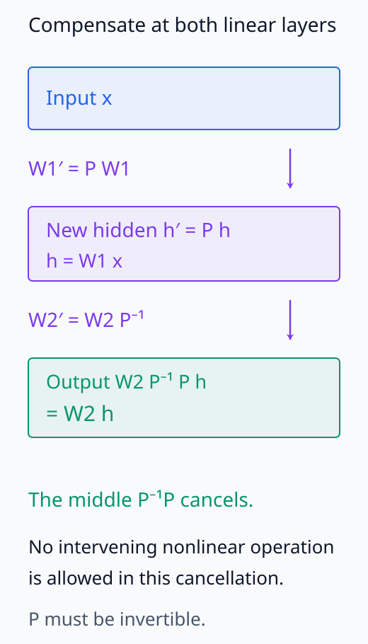
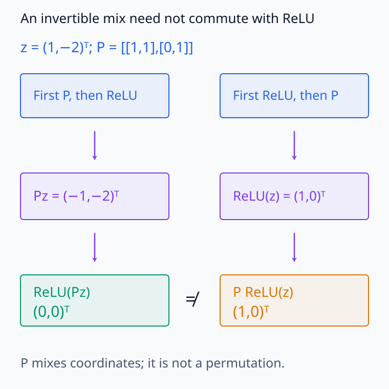
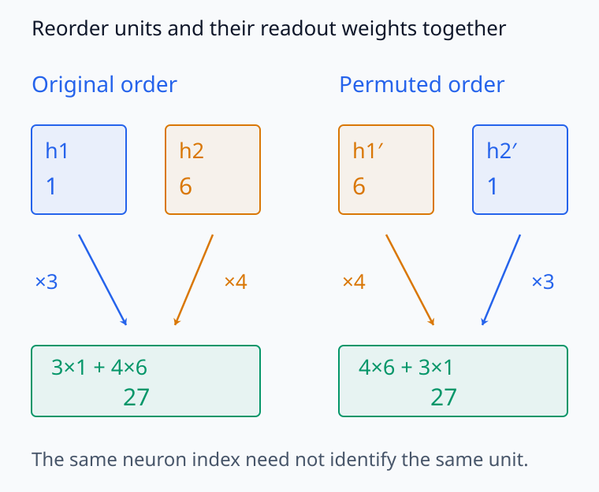
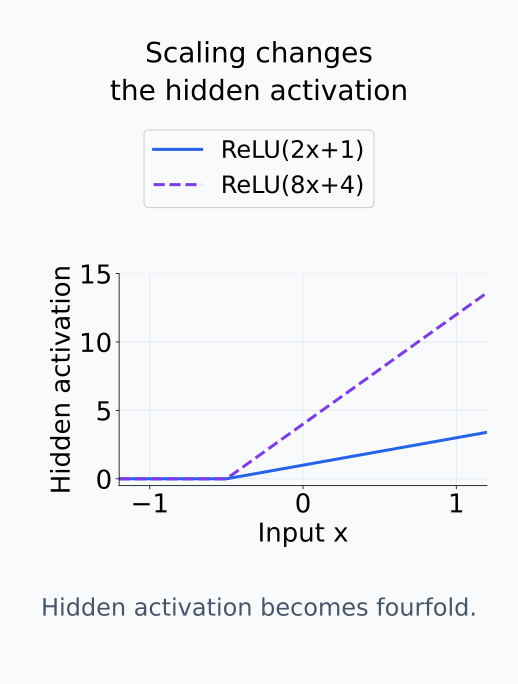
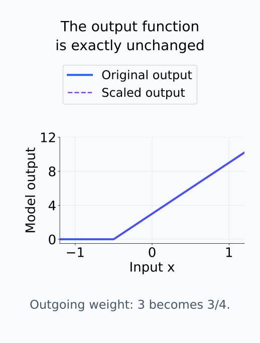
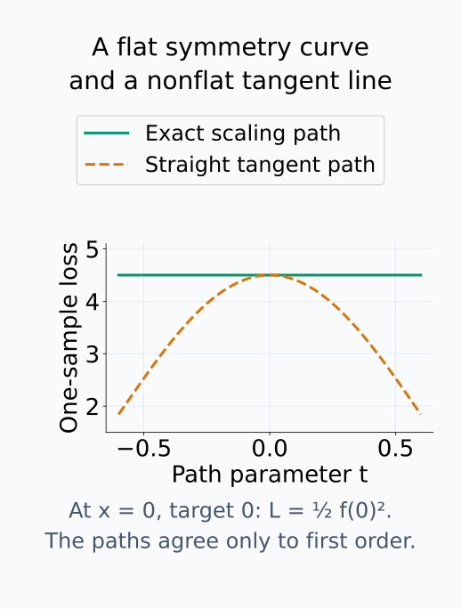
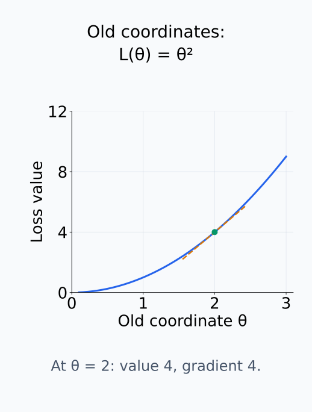
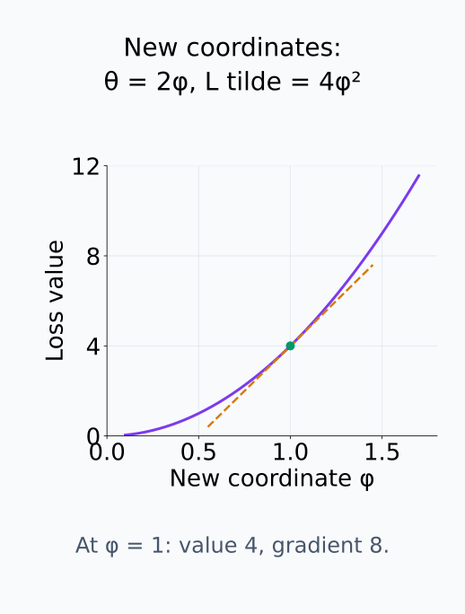

# M03-15. 재매개화와 모델 대칭성 입문

## 이 단원이 필요한 이유

신경망의 파라미터가 다르면 모델의 함수도 다르다고 생각하기 쉽다. 그러나 hidden unit의 순서를 바꾸거나 ReLU unit의 들어오는 weight와 나가는 weight를 반대로 scaling하면 입력-출력 함수가 그대로인 경우가 있다. 따라서 파라미터 한 좌표나 한 neuron의 값만 보고 기능을 고정해 해석하면 같은 모델을 서로 다르게 설명할 수 있다.

재매개화는 같은 대상이나 같은 함수족을 다른 파라미터로 표현하는 일이다. 모델 대칭성은 그중에서도 파라미터를 바꾸면서 모델 함수를 보존하는 변환이다. 이 구분은 loss landscape, neuron matching, model merging, representation comparison과 식별가능성을 공부할 때 필요하다.

## 학습 목표

이 단원을 마치면 다음을 할 수 있다.

- 재매개화와 모델 대칭성을 구분할 수 있다.
- 재매개화 아래 gradient 변환을 VJP로 나타낼 수 있다.
- 같은 모델 함수를 나타내는 파라미터의 동치관계를 정의할 수 있다.
- 선형 hidden basis change가 함수 출력을 보존함을 계산할 수 있다.
- hidden-unit permutation과 ReLU positive scaling symmetry를 확인할 수 있다.
- 임의의 basis change가 elementwise 비선형층의 대칭은 아님을 설명할 수 있다.
- 파라미터 비식별성이 모델 해석과 비교에 주는 제한을 설명할 수 있다.

## 선수지식 확인

- 선수 단원: [M03-03 기저변환과 좌표 의존성](M03-03-change-of-basis-coordinate-dependence.md)
- 선수 단원: [M03-06 동치관계와 몫공간](M03-06-equivalence-relations-quotient-spaces.md)
- 선수 단원: [M03-13 JVP와 VJP](M03-13-jvp-vjp.md)
- 선수 단원: [M03-14 자동미분과 역전파](M03-14-automatic-differentiation-backpropagation.md)
- 확인 질문: similarity transformation과 좌표변환을 구분할 수 있는가?
- 확인 질문: 동치관계가 여러 표현을 하나의 class로 묶는다는 뜻을 설명할 수 있는가?

## 기호와 용어

| 표기·용어 | Common spoken reading | 의미 |
|---|---|---|
| $f_{\boldsymbol\theta}$ | `f sub theta` | 파라미터 $\boldsymbol\theta$가 정하는 모델 함수 |
| $r(\boldsymbol\phi)=\boldsymbol\theta$ | `r of phi equals theta` | 새 파라미터에서 기존 파라미터로 가는 재매개화 map |
| $\boldsymbol\theta\sim\boldsymbol\theta'$ | `theta is equivalent to theta prime` | 두 파라미터가 같은 모델 함수를 나타낸다는 동치관계 |
| symmetry transformation | `symmetry transformation` | 모델 함수를 보존하는 파라미터 변환 |
| orbit | `orbit` | 정한 symmetry transformation들로 한 파라미터에서 도달하는 집합 |
| identifiability | `identifiability` | 관찰 가능한 함수나 분포로부터 파라미터를 유일하게 정할 수 있는 성질 |
| $\mathbf P$ | `P` | hidden unit을 바꾸거나 순열하는 가역행렬 |
| $\mathbf D$ | `D` | 양의 대각 scaling 행렬 |

## 핵심 개념 1. 재매개화는 파라미터 표현을 바꾼다

기존 파라미터를 $\boldsymbol\theta$라 하고 새 파라미터를 $\boldsymbol\phi$라 하자. map

\[
\boldsymbol\theta=r(\boldsymbol\phi)
\]

를 사용해 같은 모델족을

\[
f_{r(\boldsymbol\phi)}
\]

로 표현하면 재매개화이다. $r$이 일대일인 좌표변환일 수도 있고, 여러 $\boldsymbol\phi$가 같은 $\boldsymbol\theta$로 가는 중복 표현일 수도 있다.

같은 모델족이라는 말은 기존 모델족의 각 함수를 적어도 하나의 새 파라미터로 표현할 수 있다는 뜻이다. $r$의 범위가 일부 함수만 표현하면 모델족을 그대로 다시 적은 것이 아니라 범위를 제한한 것이다. 여러 파라미터가 같은 함수를 나타낼 수 있으므로, 모든 기존 파라미터 점을 빠짐없이 방문하는 조건과 모든 모델 함수를 표현하는 조건도 구분한다.

기존 파라미터가 $\boldsymbol\theta\in\mathbb R^p$, 새 파라미터가 $\boldsymbol\phi\in\mathbb R^q$이면 $\mathbf J_r(\boldsymbol\phi)$의 shape은 $p\times q$다. 미분 가능한 $r$은 새 변화벡터를 기존 파라미터의 일차 변화로 보내며, loss의 미분은 그 변화를 scalar로 측정한다.

loss를 $\widetilde L(\boldsymbol\phi)=L(r(\boldsymbol\phi))$로 쓰면 연쇄법칙에 따라

\[
\nabla_{\boldsymbol\phi}\widetilde L
=\mathbf J_r(\boldsymbol\phi)^\top
\nabla_{\boldsymbol\theta}L
\]

이다. 즉 새 좌표의 gradient는 기존 gradient를 재매개화 map을 따라 VJP한 결과이다. 같은 loss라도 Euclidean gradient의 성분과 norm은 파라미터 좌표에 따라 달라질 수 있다.

$L$의 gradient는 기존 점 $\boldsymbol\theta=r(\boldsymbol\phi)$에서 평가한다. 새 변화 $\Delta\boldsymbol\phi$에 대한 일차 loss 변화는 $\nabla_{\boldsymbol\theta}L^\top\mathbf J_r\Delta\boldsymbol\phi$다. 이를 $\Delta\boldsymbol\phi$에 작용하는 행으로 읽고 전치하면 위 $q$차원 gradient를 얻는다. 두 파라미터 공간에서 표준 Euclidean 내적을 사용하는 열 표현이며, $r$이 가역이 아니어도 이 연쇄법칙은 성립한다.

## 핵심 개념 2. 모델 대칭성은 함수를 보존하는 능동 변환이다

가역인 파라미터 변환 $T$가 모든 허용 입력 $\mathbf x$에 대해

\[
f_{T(\boldsymbol\theta)}(\mathbf x)=f_{\boldsymbol\theta}(\mathbf x)
\]

를 만족하면 $T$는 모델의 symmetry transformation이다. 여기서는 파라미터 공간 안에서 실제 수치를 바꾸므로 능동 변환으로 본다. 같은 vector를 다른 coordinate로 적는 수동 좌표변환과는 구분한다.

두 파라미터의 동치관계를

\[
\boldsymbol\theta\sim\boldsymbol\theta'
\quad\Longleftrightarrow\quad
f_{\boldsymbol\theta}(\mathbf x)=f_{\boldsymbol\theta'}(\mathbf x)
\text{ for all }\mathbf x
\]

로 정의할 수 있다. 해석 대상이 함수라면 개별 파라미터 점보다 이 동치 class가 본질적인 경우가 있다.

함수의 등식이 반사성·대칭성·추이성을 가지므로 이 관계도 동치관계다. 정한 symmetry transformation들을 한 점에 적용해 도달하는 집합은 그 점의 orbit이며, 각 변환이 함수를 보존하므로 같은 함수의 동치류 안에 놓인다. 그러나 함수가 같은 모든 파라미터가 선택한 permutation이나 scaling만으로 연결된다고 보장되지는 않는다. 함수 동치류와 특정 transformation class의 orbit을 구분해야 한다.

## 핵심 개념 3. 선형 hidden layer에는 basis-change symmetry가 있다

두 선형층 사이에 비선형함수가 없다고 하자.

\[
\mathbf h=\mathbf W_1\mathbf x,\qquad
\mathbf y=\mathbf W_2\mathbf h.
\]

가역행렬 $\mathbf P$에 대해

\[
\mathbf W_1'=\mathbf P\mathbf W_1,
\qquad
\mathbf W_2'=\mathbf W_2\mathbf P^{-1}
\]

로 바꾸면

\[
\mathbf W_2'\mathbf W_1'
=\mathbf W_2\mathbf P^{-1}\mathbf P\mathbf W_1
=\mathbf W_2\mathbf W_1
\]

이다. hidden coordinate는 $\mathbf h'=\mathbf P\mathbf h$로 바뀌지만 입력-출력 함수는 같다. 선형 hidden representation의 각 coordinate를 독립적인 고정 의미로 해석하기 어려운 이유 중 하나이다.

두 층 사이에서 바뀐 hidden 좌표를 다음 층이 역변환으로 보상하는 구조를 보자.

<figure class="lesson-figure" markdown="1">

<figcaption>선형층 두 개 사이에서는 P와 P⁻¹가 바로 이웃하므로 소거된다. Hidden 값 Ph는 달라져도 W2가 읽는 최종 값은 같으며, 중간에 비선형함수를 넣은 경우에는 이 소거를 바로 사용할 수 없다.</figcaption>

</figure>

## 핵심 개념 4. elementwise 비선형층에서는 허용되는 변환이 줄어든다

비선형층

\[
\mathbf h=\sigma(\mathbf W_1\mathbf x+\mathbf b_1),
\qquad
\mathbf y=\mathbf W_2\mathbf h+\mathbf b_2
\]

에서 선형층과 같은 처방 $\mathbf W_1'=\mathbf P\mathbf W_1$, $\mathbf b_1'=\mathbf P\mathbf b_1$, $\mathbf W_2'=\mathbf W_2\mathbf P^{-1}$을 모든 파라미터에서 함수 보존 변환으로 사용하려면

\[
\sigma(\mathbf P\mathbf z)=\mathbf P\sigma(\mathbf z)
\]

가 모든 $\mathbf z$에서 성립해야 한다. 일반적인 elementwise 비선형함수와 임의의 $\mathbf P$에서는 성립하지 않는다. 선형층에서 가능한 모든 hidden basis change를 비선형 신경망에 그대로 적용할 수 없는 이유이다.

기존 pre-activation을 $\mathbf z=\mathbf W_1\mathbf x+\mathbf b_1$라 쓰면 새 pre-activation은 $\mathbf P\mathbf z$다. 새 출력은 $\mathbf W_2\mathbf P^{-1}\sigma(\mathbf P\mathbf z)+\mathbf b_2$이므로, $\sigma(\mathbf P\mathbf z)=\mathbf P\sigma(\mathbf z)$일 때 두 가운데 행렬을 소거하여 원래 출력을 얻는다. 비선형함수가 사이에 있으면 $\mathbf P^{-1}\mathbf P$를 곧바로 소거할 수 없다는 점이 앞 절과 다르다.

다만 permutation matrix $\mathbf P$는 elementwise 함수와 순서를 바꾸어 적용할 수 있다.

\[
\sigma(\mathbf P\mathbf z)=\mathbf P\sigma(\mathbf z).
\]

따라서

\[
\mathbf W_1'=\mathbf P\mathbf W_1,\quad
\mathbf b_1'=\mathbf P\mathbf b_1,\quad
\mathbf W_2'=\mathbf W_2\mathbf P^{-1}
\]

는 hidden unit의 순서만 바꾸고 함수를 보존한다.

permutation은 각 성분을 다른 자리로 옮길 뿐 서로 더하지 않는다. 모든 unit에 같은 scalar 함수 $\sigma$를 적용하면 성분을 옮긴 뒤 계산해도 계산한 결과를 옮겨도 같다. 이 변환에서는 hidden bias도 함께 순열하고 출력 bias는 $\mathbf b_2'=\mathbf b_2$로 유지한다.

일반 mixing이 실패하는 반례와 실제로 허용되는 permutation을 나누어 확인하자.

<figure class="lesson-figure lesson-figure--wide" markdown="1">

<figcaption>P=[[1,1],[0,1]]는 가역이지만 ReLU(Pz)와 P ReLU(z)가 다르다. 이 한 반례만으로도 임의의 가역행렬이 ReLU와 commute한다는 주장을 부정할 수 있다.</figcaption>

</figure>

<figure class="lesson-figure lesson-figure--wide" markdown="1">

<figcaption>예제 1의 두 unit과 그 readout weight를 함께 바꾸면 27이 유지된다. 두 activation의 순서가 바뀌어도 제곱합 1²+6²는 같지만, index가 같은 unit끼리의 값은 달라질 수 있다.</figcaption>

</figure>

## 핵심 개념 5. ReLU에는 양의 scaling symmetry가 있다

ReLU는 양의 $c$에 대해 positive homogeneous하다.

\[
\operatorname{ReLU}(cz)=c\operatorname{ReLU}(z),
\qquad c>0.
\]

$c>0$이면 $z$의 부호가 그대로다. 양수 입력에서는 양쪽이 $cz$이고 0 이하 입력에서는 양쪽이 0이므로 등식이 성립한다. $c=0$에서도 ReLU의 등식 자체는 성립하지만, 그 배율은 역변환할 수 없어서 가역인 scaling symmetry로 사용하지 않는다.

양의 대각행렬 $\mathbf D$를 사용하면

\[
\operatorname{ReLU}(\mathbf D\mathbf z)
=\mathbf D\operatorname{ReLU}(\mathbf z).
\]

따라서 ReLU hidden layer에서

\[
\mathbf W_1'=\mathbf D\mathbf W_1,\quad
\mathbf b_1'=\mathbf D\mathbf b_1,\quad
\mathbf W_2'=\mathbf W_2\mathbf D^{-1}
\]

는 함수를 보존한다. $\mathbf D$의 대각성분이 음수이면 이 등식은 일반적으로 성립하지 않는다. sigmoid나 tanh에도 같은 positive scaling symmetry가 그대로 존재하지 않는다.

대각성분 $d_i>0$는 $\mathbf W_1$의 $i$번째 행과 $b_{1,i}$를 $d_i$배하여 해당 unit의 pre-activation과 ReLU 출력을 같은 배율로 바꾼다. $\mathbf W_2\mathbf D^{-1}$는 그 unit을 읽는 $i$번째 열을 $1/d_i$배한다. 들어오는 배율과 나가는 역배율이 상쇄되므로 모든 입력에서 출력이 같고, hidden activation과 weight 크기는 달라질 수 있다.

예제 2의 scaling을 activation 그래프와 출력 그래프로 나누면 무엇이 변하고 무엇이 보존되는지 분명해진다.

<figure class="lesson-figure" markdown="1">

<figcaption>들어오는 weight와 bias를 4배 하면 활성 구간의 hidden 값도 4배다. 같은 모델 함수라는 이유만으로 hidden activation 크기가 같다고 기대할 수는 없다.</figcaption>

</figure>

<figure class="lesson-figure" markdown="1">

<figcaption>나가는 weight를 3에서 3/4로 줄이면 hidden의 배율 4가 상쇄된다. 두 곡선은 몇 개 sample에서만 만나는 것이 아니라 식의 등식에 따라 모든 허용 입력에서 같다.</figcaption>

</figure>

## 핵심 개념 6. 대칭성은 식별가능성과 loss geometry에 영향을 준다

서로 다른 파라미터가 같은 함수를 나타내면 함수 관찰만으로 그중 하나를 유일하게 선택할 수 없다. 이 경우 파라미터는 비식별적이다. 두 모델의 neuron 번호나 weight 좌표를 그대로 비교하면 permutation이나 scaling 차이를 기능 차이로 오인할 수 있다.

연속적인 symmetry path $\boldsymbol\theta(t)$가 같은 함수를 보존하면 데이터 loss도 그 path에서 일정하다. 따라서 symmetry tangent 방향의 일차 변화는 0이다. stationary point와 적절한 미분 가능성 조건에서는 이런 방향이 Hessian의 zero-curvature 방향으로 나타날 수 있다. 실제 수치 Hessian에서는 regularization, finite precision, 비미분점과 근사 symmetry 때문에 정확한 0이 아닐 수 있다.

이를 미분식으로 확인하려면 고정한 데이터 loss $L$과 symmetry path가 두 번 연속 미분 가능하다고 하자. $\ell(t)=L(\boldsymbol\theta(t))$가 일정하므로

\[
0=\ell'(t)=\nabla L(\boldsymbol\theta(t))^\top\boldsymbol\theta'(t)
\]

이고, 한 번 더 미분하면

\[
0=\ell''(t)
=\boldsymbol\theta'(t)^\top\mathbf H_L(\boldsymbol\theta(t))\boldsymbol\theta'(t)
+\nabla L(\boldsymbol\theta(t))^\top\boldsymbol\theta''(t)
\]

이다. 곡선 경로의 이차 변화에는 Hessian 항뿐 아니라 경로 자체의 굽음이 만드는 항도 있다. stationary point에서는 gradient가 0이어서 둘째 항이 사라지고, 비영 symmetry tangent가 있다면 그 방향의 quadratic 곡률이 0이다. 경로에서 loss가 일정하다는 사실만으로 gradient가 0이 아닌 점의 직선 tangent 곡률까지 0이라고 결론 내릴 수는 없다.

동일한 symmetry 곡선을 직선 tangent로 바꾸면 보존 조건이 달라질 수 있다.

<figure class="lesson-figure" markdown="1">

<figcaption>예제 2의 파라미터에서 입력 0·target 0의 loss를 L=½f(0)²로 둔 예다. 초록 곡선은 θ(t)=(2eᵗ,eᵗ,3e⁻ᵗ)로 함수와 loss를 보존한다. 주황 경로 θ(0)+t(2,1,-3)는 같은 일차 tangent를 갖지만 정확한 scaling은 아니며, 이 점의 gradient가 0이 아니므로 직선 방향의 이차 곡률도 0일 필요가 없다.</figcaption>

</figure>

## 핵심 개념 7. 해석 주장은 symmetry 아래에서 무엇이 보존되는지 밝혀야 한다

입력-출력 함수, 예측값과 데이터 loss는 exact symmetry 아래에서 보존된다. 반면 특정 hidden neuron의 index, weight 크기와 coordinate별 activation은 permutation이나 scaling 아래에서 달라질 수 있다. 해석 방법이 후자에 의존한다면 symmetry alignment나 normalization 없이 모델 사이 결과를 직접 비교하기 어렵다.

이는 hidden representation이 무의미하다는 결론이 아니다. 해석 단위를 개별 coordinate로 둘 것인지, subspace·span·pairwise relation·함수 효과처럼 더 안정적인 대상으로 둘 것인지 정해야 한다는 뜻이다. 어떤 대상을 택하든 허용한 transformation class를 먼저 명시해야 한다.

예를 들어 hidden vector의 Euclidean norm은 permutation 아래에서는 제곱합의 순서만 바뀌므로 유지된다. 그러나 양의 대각 scaling은 각 성분의 크기를 다르게 바꾸므로 같은 norm을 일반적으로 보존하지 않는다. 한 transformation class에서 유지되는 관측량이 다른 class에서도 유지된다고 가정하지 않고, 비교하려는 양에 실제 변환을 대입해 확인한다.

## 예제 1. 선형 hidden basis를 바꾸어도 출력은 같다

\[
\mathbf W_1=
\begin{bmatrix}
1&0\\
0&2
\end{bmatrix},
\qquad
\mathbf W_2=
\begin{bmatrix}
3&4
\end{bmatrix},
\qquad
\mathbf x=
\begin{bmatrix}
1\\3
\end{bmatrix}.
\]

원래 hidden vector와 출력은

\[
\mathbf h=
\begin{bmatrix}
1\\6
\end{bmatrix},
\qquad y=3+24=27
\]

이다. 두 hidden coordinate를 바꾸는 permutation을

\[
\mathbf P=
\begin{bmatrix}
0&1\\
1&0
\end{bmatrix}
\]

로 두면 $\mathbf P^{-1}=\mathbf P$이고

\[
\mathbf W_1'=
\begin{bmatrix}
0&2\\
1&0
\end{bmatrix},
\qquad
\mathbf W_2'=
\begin{bmatrix}
4&3
\end{bmatrix}.
\]

새 hidden vector는 $\mathbf h'=(6,1)^\top$이지만 출력은

\[
y'=4\cdot6+3\cdot1=27
\]

이다. 첫 번째 hidden coordinate의 값은 바뀌었으나 함수 출력은 바뀌지 않았다.

## 예제 2. 한 ReLU unit의 scaling symmetry

\[
f(x)=w_2\operatorname{ReLU}(w_1x+b_1)
\]

에서 $(w_1,b_1,w_2)=(2,1,3)$이라 하자. $c=4$를 사용해

\[
(w_1',b_1',w_2')=(8,4,3/4)
\]

로 바꾸면

\[
\frac34\operatorname{ReLU}(8x+4)
=\frac34\cdot4\operatorname{ReLU}(2x+1)
=3\operatorname{ReLU}(2x+1)
\]

이다. 파라미터와 hidden activation scale은 달라졌지만 모든 입력에서 함수는 같다.

## 예제 3. 재매개화에 따른 gradient 변화

$L(\theta)=\theta^2$이고 $\theta=r(\phi)=2\phi$라 하자. $\phi=1$이면 $\theta=2$이고

\[
\frac{dL}{d\theta}=2\theta=4,
\qquad
\frac{d\theta}{d\phi}=2.
\]

따라서

\[
\frac{d\widetilde L}{d\phi}
=\frac{d\theta}{d\phi}\frac{dL}{d\theta}
=8.
\]

같은 loss 값을 표현하지만 gradient 성분은 좌표 scale에 따라 달라진다. gradient 크기를 서로 다른 parameterization 사이에서 그대로 비교하면 안 되는 간단한 예이다.

예제 3의 같은 loss 지점은 두 좌표계에서 다른 접선 기울기를 가진다.

<figure class="lesson-figure" markdown="1">

<figcaption>기존 좌표 θ=2에서 loss는 4이고 주황 접선의 기울기는 4다. Gradient는 이 좌표의 한 단위 변화에 대한 변화율이다.</figcaption>

</figure>

<figure class="lesson-figure" markdown="1">

<figcaption>대응하는 새 좌표 φ=1에서는 같은 loss 4를 나타내지만 기울기는 8이다. 새 좌표 한 단위가 기존 좌표 두 단위에 해당하므로 gradient에도 배율 2가 들어온다.</figcaption>

</figure>

## 흔한 오해

### 오해 1. 파라미터가 다르면 모델 함수도 반드시 다르다

permutation과 ReLU positive scaling처럼 파라미터가 달라도 모든 입력에서 같은 출력을 만드는 exact symmetry가 있다.

### 오해 2. 선형층의 임의 basis change를 모든 신경망 hidden layer에 쓸 수 있다

elementwise 비선형함수는 일반적인 가역행렬과 commute하지 않는다. architecture와 activation이 허용하는 transformation만 symmetry가 된다.

### 오해 3. 같은 loss를 가지는 두 파라미터는 같은 함수이다

유한 데이터에서 loss가 같다는 사실은 관측한 sample에 대한 scalar 값이 같다는 뜻이다. 모든 입력에서 함수가 같다는 exact functional equivalence보다 약한 조건이다.

### 오해 4. 대칭성이 있으면 hidden representation은 해석할 수 없다

대칭성은 해석 불가능을 바로 뜻하지 않는다. 해석 결과가 어떤 transformation에 불변인지, 또는 비교 전에 어떤 alignment가 필요한지를 명시하게 한다.

### 오해 5. Hessian의 작은 고유값은 모두 모델 대칭성 때문이다

exact continuous symmetry가 flat direction을 만들 수 있지만 작은 곡률은 데이터 부족, saturation, scale, 근사 대칭성과 수치오차에서도 생긴다. eigenvalue 하나만으로 원인을 확정할 수 없다.

## 연습문제

### 1. 재매개화 gradient

$L(\theta)=(\theta-1)^2$이고 $\theta=3\phi$이다. $\phi=1$에서 $d\widetilde L/d\phi$를 구하라.

해설 보기

$\theta=3$이고 $dL/d\theta=2(3-1)=4$이다. $d\theta/d\phi=3$이므로

\[
\frac{d\widetilde L}{d\phi}=3\cdot4=12
\]

이다.

### 2. 함수 동치와 sample 동치

두 모델이 훈련 sample에서 같은 예측을 냈다. 이것만으로 $\boldsymbol\theta\sim\boldsymbol\theta'$라고 결론 내릴 수 있는가?

해설 보기

여기서 정의한 동치는 모든 허용 입력에서 함수가 같아야 한다. 훈련 sample에서만 같은 예측을 보인 것은 그보다 약하며, 관측하지 않은 입력에서는 다를 수 있다.

### 3. 선형 basis-change symmetry 증명

$\mathbf y=\mathbf W_2\mathbf W_1\mathbf x$에서 가역행렬 $\mathbf P$를 사용해 $\mathbf W_1'=\mathbf P\mathbf W_1$, $\mathbf W_2'=\mathbf W_2\mathbf P^{-1}$로 정의했다. $\mathbf y'=\mathbf y$임을 보이라.

해설 보기

\[
\mathbf y'
=\mathbf W_2'\mathbf W_1'\mathbf x
=\mathbf W_2\mathbf P^{-1}\mathbf P\mathbf W_1\mathbf x
=\mathbf W_2\mathbf W_1\mathbf x
=\mathbf y.
\]

가역성으로 $\mathbf P^{-1}\mathbf P=\mathbf I$를 사용했다.

### 4. permutation symmetry

hidden activation이 $(h_1,h_2,h_3)=(2,-1,5)$이고 출력 weight가 $(4,7,-2)$이다. 첫째와 셋째 hidden unit을 함께 permutation했을 때 새 activation과 출력 weight를 쓰고 dot product가 보존되는지 확인하라.

해설 보기

새 activation은 $(5,-1,2)$이고 새 출력 weight는 $(-2,7,4)$이다. 원래 dot product는 $8-7-10=-9$이고 새 dot product는 $-10-7+8=-9$이다. activation만 바꾸고 출력 weight를 함께 바꾸지 않으면 보존되지 않는다.

### 5. ReLU scaling의 조건

$c=-2$일 때 $\operatorname{ReLU}(cz)=c\operatorname{ReLU}(z)$가 모든 $z$에서 성립하지 않음을 반례로 보이라.

해설 보기

$z=1$이면 왼쪽은 $\operatorname{ReLU}(-2)=0$이고 오른쪽은 $-2\operatorname{ReLU}(1)=-2$이다. 따라서 ReLU의 homogeneous scaling symmetry에는 $c>0$ 조건이 필요하다.

### 6. 해석 주장 비판

두 ReLU network에서 index가 같은 neuron끼리 weight와 activation을 비교했더니 값이 달랐다. 이를 근거로 두 neuron의 기능이 다르다고 결론 내릴 수 있는가?

해설 보기

바로 결론 내릴 수 없다. hidden-unit permutation과 positive scaling으로 같은 함수를 다른 neuron index와 scale로 표현할 수 있다. 먼저 허용되는 symmetry를 정하고 unit alignment나 scale normalization을 한 뒤에도 차이가 남는지 확인해야 한다.

### 7. M03 누적 확인과제

다음 network를 생각하자.

\[
\mathbf h=\mathbf W\mathbf x+\mathbf b,
\qquad
\mathbf a=\operatorname{ReLU}(\mathbf h),
\qquad
s=\mathbf v^\top\mathbf a,
\qquad
L=\frac12(s-y)^2,
\]

\[
\mathbf x=
\begin{bmatrix}
1\\2
\end{bmatrix},
\quad
\mathbf W=
\begin{bmatrix}
1&-1\\
2&1
\end{bmatrix},
\quad
\mathbf b=
\begin{bmatrix}
0\\0
\end{bmatrix},
\quad
\mathbf v=
\begin{bmatrix}
3\\-2
\end{bmatrix},
\quad y=1.
\]

다음을 수행하라.

1. forward 값 $\mathbf h,\mathbf a,s,L$을 구한다.
2. $\mathbf J_{\mathbf a,\mathbf x}$와 $\mathbf J_{s,\mathbf x}$를 구한다.
3. 역전파로 $\nabla_{\mathbf x}L$, $\nabla_{\mathbf W}L$, $\nabla_{\mathbf b}L$, $\nabla_{\mathbf v}L$을 구한다.
4. 입력 방향 $\mathbf p=(1,-1)^\top$의 JVP로 $dL$을 구하고 $\nabla_{\mathbf x}L^\top\mathbf p$와 비교한다.
5. 자동미분 library가 반환해야 할 결과를 표로 정리한다.

해설 보기

forward pass는

\[
\mathbf h=
\begin{bmatrix}
-1\\4
\end{bmatrix},
\qquad
\mathbf a=
\begin{bmatrix}
0\\4
\end{bmatrix},
\qquad
s=-8,
\qquad
L=\frac12(-9)^2=40.5
\]

이다. 이 점의 ReLU derivative matrix는

\[
\mathbf D=
\begin{bmatrix}
0&0\\
0&1
\end{bmatrix}
\]

이므로

\[
\mathbf J_{\mathbf a,\mathbf x}
=\mathbf D\mathbf W
=
\begin{bmatrix}
0&0\\
2&1
\end{bmatrix},
\]

\[
\mathbf J_{s,\mathbf x}
=\mathbf v^\top\mathbf D\mathbf W
=
\begin{bmatrix}
-4&-2
\end{bmatrix}.
\]

$r=s-y=-9$라 두면 $\partial L/\partial s=r$이다. hidden preactivation에 도착한 cotangent는

\[
\bar{\mathbf h}=r\mathbf D\mathbf v
=
\begin{bmatrix}
0\\18
\end{bmatrix}.
\]

따라서

\[
\nabla_{\mathbf x}L
=\mathbf W^\top\bar{\mathbf h}
=
\begin{bmatrix}
36\\18
\end{bmatrix},
\]

\[
\nabla_{\mathbf W}L
=\bar{\mathbf h}\mathbf x^\top
=
\begin{bmatrix}
0&0\\
18&36
\end{bmatrix},
\qquad
\nabla_{\mathbf b}L=
\begin{bmatrix}
0\\18
\end{bmatrix},
\]

\[
\nabla_{\mathbf v}L
=r\mathbf a
=
\begin{bmatrix}
0\\-36
\end{bmatrix}.
\]

방향 $\mathbf p=(1,-1)^\top$을 forward로 전달하면

\[
d\mathbf h=\mathbf W\mathbf p
=
\begin{bmatrix}
2\\1
\end{bmatrix},
\qquad
d\mathbf a=\mathbf D\,d\mathbf h
=
\begin{bmatrix}
0\\1
\end{bmatrix},
\]

\[
ds=\mathbf v^\top d\mathbf a=-2,
\qquad
dL=r\,ds=18.
\]

reverse-mode gradient도

\[
\nabla_{\mathbf x}L^\top\mathbf p=36-18=18
\]

을 준다. 자동미분 결과는 다음과 같아야 한다.

| 대상 | 예상 gradient 또는 JVP |
|---|---|
| $\mathbf x$ | $(36,18)^\top$ |
| $\mathbf W$ | $\begin{bmatrix}0&0\\18&36\end{bmatrix}$ |
| $\mathbf b$ | $(0,18)^\top$ |
| $\mathbf v$ | $(0,-36)^\top$ |
| 방향 $\mathbf p$의 $dL$ | $18$ |

이 문제는 계산 그래프, Jacobian, JVP, VJP와 역전파가 같은 연쇄법칙의 서로 다른 표현임을 확인한다.

## 단원 요약

- 재매개화는 같은 모델족을 다른 파라미터로 표현하며, gradient는 재매개화 map의 VJP로 변환된다.
- 모델 대칭성은 파라미터를 바꾸면서 모든 입력에 대한 모델 함수를 보존한다.
- 선형 hidden layer는 임의의 가역 basis change와 그 역변환을 양쪽 층에 적용할 수 있다.
- elementwise 비선형층에서는 arbitrary basis change가 일반적으로 허용되지 않는다.
- hidden-unit permutation과 ReLU positive scaling은 대표적인 exact symmetry이다.
- 대칭성은 파라미터 식별가능성, loss의 flat direction과 모델 간 비교에 영향을 준다.
- hidden 해석은 허용한 transformation과 그 아래 보존되는 대상을 밝혀야 한다.

## 통과 기준

다음 질문에 자료를 보지 않고 답할 수 있으면 통과한다.

- 재매개화와 모델 대칭성을 구분할 수 있는가?
- 재매개화 아래 gradient를 VJP로 계산할 수 있는가?
- 함수 동치관계와 유한 sample에서 같은 출력을 구분할 수 있는가?
- 선형 hidden basis-change symmetry를 식으로 증명할 수 있는가?
- permutation과 ReLU positive scaling symmetry를 계산할 수 있는가?
- 임의의 가역행렬이 비선형층의 symmetry가 아닌 이유를 설명할 수 있는가?
- symmetry가 neuron 비교와 Hessian 해석에 주는 제한을 설명할 수 있는가?

## M03 단계 통과 기준

M03 전체를 마쳤다면 다음을 연결해서 설명할 수 있어야 한다.

- 추상 vector와 linear map을 기저를 택해 coordinate와 matrix로 나타낸다.
- 좌표변환에서 바뀌는 성분과 보존되는 기하·대수적 대상을 구분한다.
- subspace, quotient, dual, bilinear form과 tensor를 타입에 맞게 계산한다.
- total derivative, Jacobian과 Hessian으로 국소 일차·이차 구조를 표현한다.
- JVP, VJP와 역전파를 하나의 연쇄법칙으로 연결한다.
- 모델 파라미터의 동치와 symmetry를 고려해 해석 주장의 단위를 제한한다.
- M03-15의 누적 확인과제를 손계산하고 자동미분 결과와 대조한다.

## 다음 단원

- [M04-01 사건과 확률](../M04/M04-01-events-probability.md)

## 집필자 점검표

- [x] 학습 목표가 관찰 가능한 행동으로 작성됐다.
- [x] 재매개화와 symmetry transformation을 구분했다.
- [x] gradient 변환을 VJP와 연결했다.
- [x] 선형 hidden basis change를 증명했다.
- [x] permutation과 ReLU scaling symmetry를 계산했다.
- [x] 식별가능성과 loss geometry의 제한을 밝혔다.
- [x] M03 누적 확인과제를 포함했다.
- [x] 모든 문제에 해설이 있다.
- [x] 모델 해석 주장의 강도를 구분했다.
- [x] 용어집과 표기 규칙을 따랐다.
- [x] 내부 링크와 수식 구분자를 확인했다.
- [x] Common spoken reading이 실제 영어 학술 발화이며 한글 음역이나 기계적 직역을 포함하지 않는다.
