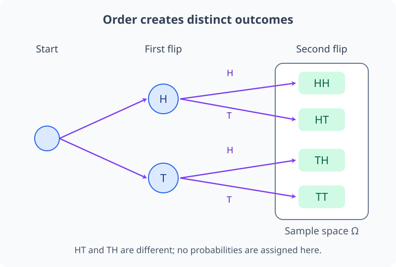
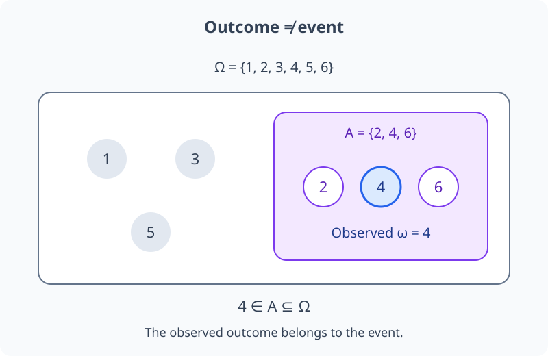
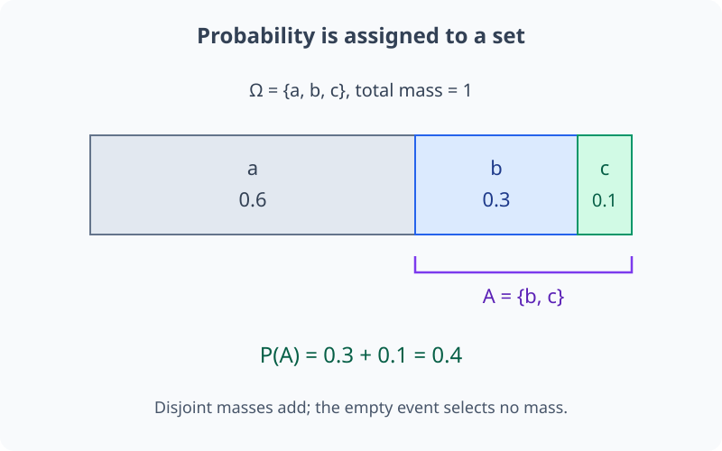
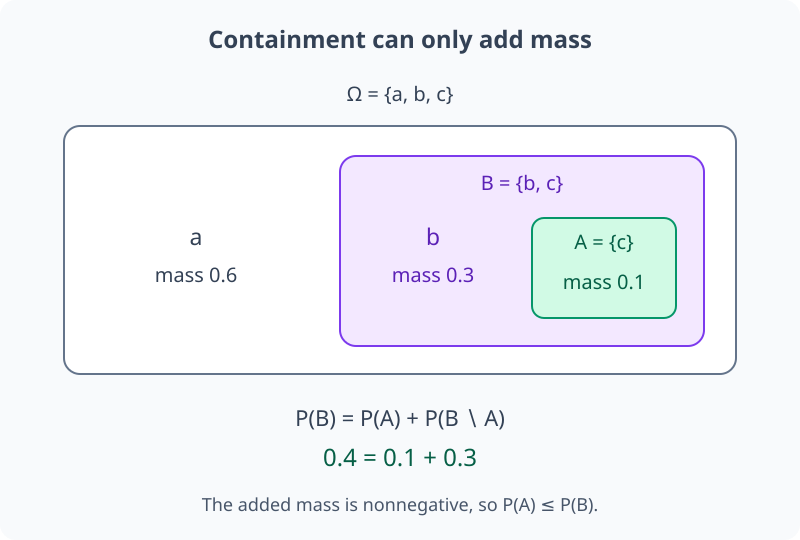
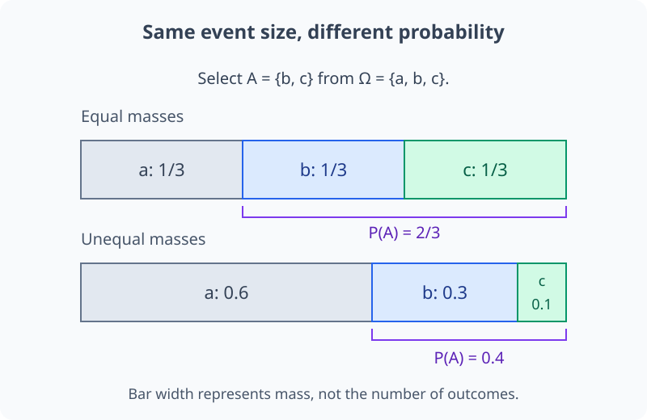
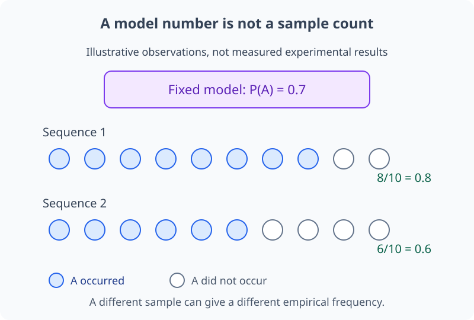
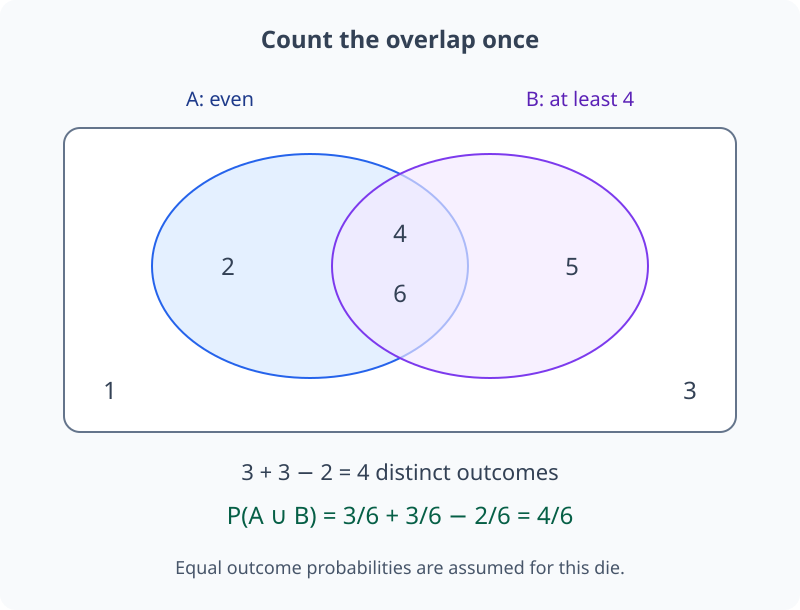
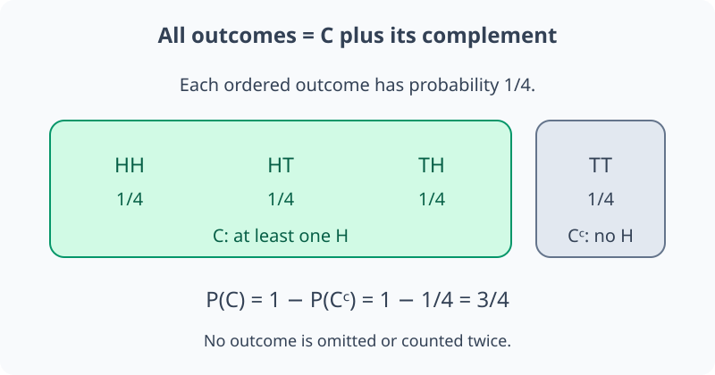

# M04-01. 사건과 확률

## 이 단원이 필요한 이유

모델이 class마다 출력한 확률, 데이터에서 관찰한 비율, 실험이 성공할 가능성은 같은 숫자 범위 $[0,1]$을 사용한다. 그러나 숫자가 무엇에 붙어 있는지 먼저 정하지 않으면 계산을 해석할 수 없다. 확률은 가능한 결과들의 집합을 정하고, 그중 관심 있는 사건에 수를 배정하는 규칙이다.

이 단원은 표본공간, 결과와 사건을 구분하고 확률이 만족해야 하는 공리를 세운다. 이후 조건부확률, 확률변수, 기댓값과 정보이론은 이 구조 위에서 정의한다.

## 학습 목표

이 단원을 마치면 다음을 할 수 있다.

- 표본공간, 결과와 사건을 구분할 수 있다.
- 합집합·교집합·여사건을 확률 문장으로 읽을 수 있다.
- 확률의 세 공리를 설명하고 작은 유한 표본공간에 적용할 수 있다.
- 여사건 공식과 포함배제 공식을 계산할 수 있다.
- 같은 가능성을 가정할 수 있는 경우와 없는 경우를 구분할 수 있다.
- 경험적 빈도와 확률모형의 확률을 구분할 수 있다.
- 모델이 출력한 확률에서 허용되는 주장의 범위를 제한할 수 있다.

## 선수지식 확인

- 선수 단원: [M00-06 인덱스와 합 기호](../M00/M00-06-indices-summation.md)
- 선수 단원: [M00-07 집합, 조건과 논리](../M00/M00-07-sets-conditions-logic.md)
- 확인 질문: 합집합, 교집합과 여집합을 기호로 쓸 수 있는가?
- 확인 질문: $\sum_i p_i$를 항별로 펼쳐 읽을 수 있는가?

## 기호와 용어

| 기호·용어 | Common spoken reading | 의미 | 범위 |
|---|---|---|---|
| $\Omega$ | `capital omega` | 가능한 결과 전체의 표본공간 | 집합 |
| $\omega$ | `omega` | 한 번의 시행에서 나온 결과 | $\omega\in\Omega$ |
| $A,B$ | `A and B` | 결과들의 부분집합 | $A,B\subseteq\Omega$ |
| $A^c$ | `A complement` | $A$가 일어나지 않는 결과들의 집합 | $\Omega\setminus A$ |
| $A\cup B$ | `A union B` | $A$ 또는 $B$가 일어나는 사건 | 사건 |
| $A\cap B$ | `A intersection B` | $A$와 $B$가 함께 일어나는 사건 | 사건 |
| $\varnothing$ | `the empty set` | 어떤 결과도 포함하지 않는 불가능사건 | 사건 |
| $P(A)$ | `P of A` | 사건 $A$에 확률이 배정한 수 | $0\le P(A)\le1$ |

## 핵심 개념 1. 표본공간은 가능한 결과의 범위를 정한다

표본공간(sample space) $\Omega$는 확률모형이 가능한 것으로 취급하는 결과 전체의 집합이다. 한 번의 시행에서 나온 개별 결과를 outcome이라 하며 $\omega\in\Omega$로 쓴다.

동전 한 번의 앞뒤만 기록하면

\[
\Omega=\{H,T\}
\]

로 둘 수 있다. 동전을 두 번 던져 순서까지 기록하면

\[
\Omega=\{HH,HT,TH,TT\}
\]

이다. 같은 실험도 무엇을 관찰하고 구분하는지에 따라 표본공간이 달라진다. 표본공간 밖의 결과에는 이 모형이 확률을 배정하지 않는다.

두 시행의 기록을 따라가면 $HT$와 $TH$가 서로 다른 결과인 이유가 보인다. 아래 가지에는 확률을 붙이지 않았다.

<figure class="lesson-figure lesson-figure--wide" markdown="1">

<figcaption>첫째 기록과 둘째 기록을 순서대로 붙이면 네 outcome이 만들어진다. 가지를 나열하는 것만으로 각 결과의 확률이 같다고 가정한 것은 아니다.</figcaption>
</figure>

## 핵심 개념 2. 사건은 결과들을 묶은 집합이다

사건(event) $A$는 표본공간의 부분집합이다. 주사위 한 번의 결과를

\[
\Omega=\{1,2,3,4,5,6\}
\]

으로 두면 짝수가 나오는 사건은 $A=\{2,4,6\}$이다. 실제 결과가 $4$라면 $\omega=4$이고 $4\in A$이므로 사건 $A$가 일어났다고 말한다.

집합 연산은 사건에 대한 논리문장을 표현한다.

- $A\cup B$: $A$ 또는 $B$가 일어난다. 둘 다 일어나는 경우도 포함한다.
- $A\cap B$: $A$와 $B$가 함께 일어난다.
- $A^c$: $A$가 일어나지 않는다.
- $A\setminus B$: $A$는 일어나고 $B$는 일어나지 않는다.

두 사건이 함께 일어날 수 없으면 $A\cap B=\varnothing$이며, 두 사건을 상호배반(mutually exclusive)이라고 한다.

결과 $4$는 사건 전체가 아니라 짝수 사건 안에 들어 있는 원소 하나다.

<figure class="lesson-figure lesson-figure--wide" markdown="1">

<figcaption>바깥 경계는 표본공간, 안쪽 경계는 사건이다. 관측 결과가 안쪽 경계에 속하면 그 사건이 일어났다고 말한다.</figcaption>
</figure>

## 핵심 개념 3. 확률은 사건에 수를 배정하는 규칙이다

확률 $P$는 허용된 사건에 $[0,1]$의 수를 배정하며 다음 공리를 만족한다.

1. 비음수성:

\[
P(A)\ge0.
\]

2. 전체확률:

\[
P(\Omega)=1.
\]

3. 가산가법성: 서로 겹치지 않는 사건 $A_1,A_2,\ldots$에 대해

\[
P\left(\bigcup_{i=1}^{\infty}A_i\right)
=\sum_{i=1}^{\infty}P(A_i).
\]

유한 표본공간에서는 겹치지 않는 사건들을 유한 개 더하는 경우부터 익히면 된다. 공리는 확률값을 임의로 따로 정할 수 없게 한다. 한 사건의 값을 정하면 관련 사건의 값에도 제약이 생긴다.

유한 표본공간에서는 모든 부분집합을 사건으로 다룬다. 결과 $\omega$ 하나의 확률도 그 결과만 포함하는 사건 $\{\omega\}$에 배정한 값이다. $P$는 결과나 집합 자체가 아니라, 사건을 입력받아 수를 내놓는 규칙이다.

공집합은 어떤 사건과도 겹치지 않으므로 $P(\Omega)=P(\Omega)+P(\varnothing)$에서 $P(\varnothing)=0$을 얻는다. 또 $\Omega=A\cup A^c$에 가법성을 적용하면 $1=P(A)+P(A^c)$이다. 두 항이 음수가 아니므로 $P(A)\le1$도 따른다. 따라서 확률이 $[0,1]$에 놓인다는 범위는 공리와 일치한다.

예제 3의 확률 배정을 막대의 폭으로 나타내면, 사건을 고른다는 것은 그 사건에 속한 질량을 모으는 일이다.

<figure class="lesson-figure lesson-figure--wide" markdown="1">

<figcaption>막대 전체는 확률 1이다. 서로 다른 outcome의 질량은 겹치지 않으므로, 사건에 포함된 부분의 폭을 더해 사건의 확률을 얻는다.</figcaption>
</figure>

## 핵심 개념 4. 여사건과 포함배제는 중복을 바로잡는다

$A$와 $A^c$는 겹치지 않고 합치면 $\Omega$가 된다. 따라서

\[
P(A^c)=1-P(A)
\]

이다. “적어도 한 번” 같은 사건은 반대 사건이 하나도 일어나지 않는 경우를 먼저 계산하면 짧아질 때가 많다.

$A\cup B$의 확률에서 $P(A)+P(B)$만 더하면 교집합을 두 번 센다. 포함배제 공식은 한 번을 빼서 중복을 고친다.

\[
P(A\cup B)=P(A)+P(B)-P(A\cap B).
\]

$A$와 $B$가 상호배반이면 $P(A\cap B)=0$이므로 확률을 그대로 더할 수 있다.

공리를 이용해 중복 보정을 확인할 수도 있다. $A\cup B$를 서로 겹치지 않는 $A$와 $B\setminus A$로 나누면 $P(A\cup B)=P(A)+P(B\setminus A)$이다. 한편 $B$는 $B\setminus A$와 $A\cap B$로 나뉘므로 $P(B\setminus A)=P(B)-P(A\cap B)$이다. 이 값을 첫 식에 넣으면 포함배제 공식이 나온다.

## 핵심 개념 5. 부분집합 관계는 확률의 대소관계를 만든다

$A\subseteq B$이면 $B$는 $A$의 모든 결과를 포함한다. 이때

\[
P(A)\le P(B)
\]

이다. $B$를 겹치지 않는 두 사건 $A$와 $B\setminus A$로 나누면

\[
P(B)=P(A)+P(B\setminus A)
\]

이고 두 번째 항이 음수가 아니므로 위 부등식이 나온다. 이 성질을 단조성(monotonicity)이라고 한다.

아래에서는 $A=\{c\}$, $B=\{b,c\}$로 놓았다. 더 큰 사건에는 원래 질량을 빼는 부분이 없고 추가하는 부분만 있다.

<figure class="lesson-figure lesson-figure--wide" markdown="1">

<figcaption>포함 관계를 확률로 옮기면 작은 사건의 질량에 바깥 띠의 질량이 더해진다. 바깥 띠의 확률이 0이면 두 사건의 확률은 같을 수도 있다.</figcaption>
</figure>

## 핵심 개념 6. 같은 가능성은 추가 가정이다

유한 표본공간의 각 결과가 같은 확률을 가진다고 가정할 수 있으면

\[
P(A)=\frac{|A|}{|\Omega|}
\]

로 계산한다. 공정한 주사위의 짝수 사건은 결과 세 개를 포함하므로 $P(A)=3/6=1/2$이다.

이 분수의 분모는 전체 확률 1을 몇 개의 같은 몫으로 나누는지를 나타낸다. $|\Omega|=K$이고 각 결과의 확률이 $p$라면 $Kp=1$이므로 $p=1/K$이다. 사건 $A$는 겹치지 않는 단일결과 사건 $|A|$개를 포함하므로 그 확률을 더하면 $|A|/K$가 된다.

결과의 개수만 세는 방식은 등확률 가정이 있을 때만 맞다. 찌그러진 주사위나 class 비율이 다른 데이터에서는 결과마다 확률이 다를 수 있다. 이때 각 결과의 확률을 더해야 한다.

유한 표본공간 $\Omega=\{\omega_1,\ldots,\omega_K\}$에서

\[
P(\{\omega_k\})=p_k,
\qquad p_k\ge0,
\qquad \sum_{k=1}^{K}p_k=1
\]

이라면

\[
P(A)=\sum_{\omega_k\in A}p_k
\]

이다.

같은 두 원소를 고르더라도 원소마다 배정한 질량이 다르면 확률은 달라진다.

<figure class="lesson-figure lesson-figure--wide" markdown="1">

<figcaption>두 막대 모두 원소는 세 개이고 선택한 사건은 같다. 위에서는 같은 폭 두 개를 세면 되지만, 아래에서는 선택한 두 부분의 서로 다른 질량을 더해야 한다.</figcaption>
</figure>

## 핵심 개념 7. 확률과 경험적 빈도는 연결되지만 같은 객체가 아니다

$n$번 관찰해 사건 $A$가 $n_A$번 나타났다면 경험적 빈도는

\[
\widehat P_n(A)=\frac{n_A}{n}
\]

이다. 이는 관찰한 sample로 계산한 값이다. $P(A)$는 선택한 확률모형이 사건에 배정한 값이다. 반복 관찰의 조건이 일정하면 경험적 빈도가 확률에 가까워질 수 있지만, 유한 sample에서는 두 값이 다를 수 있다.

같은 모형 아래에서 관찰을 다시 모으면 $n_A$가 달라질 수 있으므로 $\widehat P_n(A)$도 달라진다. 관찰 10개 중 8개에서 사건이 일어났다는 것은 이번 빈도가 $0.8$이라는 뜻이며, 모형의 확률이 반드시 $0.8$이어야 한다는 뜻은 아니다. 같은 분포에서 앞선 관찰값들이 다음 관찰의 사건 확률을 바꾸지 않도록 자료를 모으는 경우는 빈도와 모형 확률을 연결하는 기본 조건이다. 이후 표본 단원에서 이 조건을 다시 다룬다.

신경망이 출력한 $p_\theta(y\mid x)=0.8$도 모델과 파라미터 $\theta$, 입력 $x$에 의존하는 예측이다. 숫자 $0.8$만으로 비슷한 입력 100개 중 80개가 맞는다고 결론 내릴 수 없다. 그 결론에는 데이터 분포와 calibration 평가가 더 필요하다.

모형 확률을 고정해도 관찰열에서 사건을 센 횟수는 달라질 수 있다. 아래 관찰열은 이 차이를 설명하기 위해 구성한 것이며 실험 결과가 아니다.

<figure class="lesson-figure lesson-figure--wide" markdown="1">

<figcaption>모형의 확률과 표본의 빈도는 서로 다른 입력으로 정해진다. 위 숫자는 확률모형의 배정이고, 아래 숫자는 각 관찰열에서 실제로 센 개수를 나눈 값이다.</figcaption>
</figure>

## 예제 1. 주사위 사건 계산하기

### 문제

공정한 육면체 주사위를 한 번 던진다. $A$는 짝수, $B$는 4 이상이 나오는 사건이다. $P(A)$, $P(B)$, $P(A\cap B)$와 $P(A\cup B)$를 구한다.

### 풀이

\[
\Omega=\{1,2,3,4,5,6\},
\quad A=\{2,4,6\},
\quad B=\{4,5,6\}.
\]

각 결과가 등확률이므로

\[
P(A)=\frac36=\frac12,
\qquad
P(B)=\frac36=\frac12.
\]

교집합은 $A\cap B=\{4,6\}$이므로

\[
P(A\cap B)=\frac26=\frac13.
\]

포함배제를 적용하면

\[
P(A\cup B)
=\frac12+\frac12-\frac13
=\frac23.
\]

### 결과의 의미

$A$와 $B$가 결과 $4,6$을 공유하므로 두 확률을 그대로 더하면 중복이 생긴다.

겹친 영역의 결과 $4,6$은 두 사건을 각각 셀 때마다 한 번씩 들어간다.

<figure class="lesson-figure lesson-figure--wide" markdown="1">

<figcaption>합집합은 경계 안의 서로 다른 결과 네 개다. 두 사건의 개수를 더한 여섯 개에는 교집합 두 개가 중복되어 있으므로 한 번 빼야 한다.</figcaption>
</figure>

## 예제 2. 여사건으로 적어도 한 번 계산하기

공정한 동전을 두 번 던진다. 적어도 한 번 앞면이 나오는 사건을 $C$라 하자. $C^c$는 두 번 모두 뒷면인 사건이다.

여기서는 순서를 기록한 네 결과 $HH,HT,TH,TT$가 각각 확률 $1/4$을 가진다고 가정한다. 각 시행이 공정하다는 말만으로 두 시행의 결합 확률까지 정해지는 것은 아니므로 이 가정을 명시한다.

여사건 공식을 적용하면

\[
P(C)=1-P(C^c)=1-\frac14=\frac34
\]

이다. 가능한 네 결과를 직접 세어도 $C=\{HH,HT,TH\}$이므로 같은 값을 얻는다.

이번 예제의 등확률 가정 아래에서는 세 결과를 직접 더하거나, 남은 한 결과의 확률을 전체에서 빼도 같다.

<figure class="lesson-figure lesson-figure--wide" markdown="1">

<figcaption>관심 사건과 여사건은 겹치지 않으면서 네 결과를 빠짐없이 나눈다. 따라서 두 부분의 확률은 합해서 1이 된다.</figcaption>
</figure>

## 예제 3. 등확률이 아닌 표본공간

$\Omega=\{a,b,c\}$이고

\[
P(\{a\})=0.6,
\qquad P(\{b\})=0.3,
\qquad P(\{c\})=0.1
\]

이라 하자. 이 표본공간에는 등확률 가정이 없으므로 원소 수 비율 $2/3$을 적용할 수 없다. 사건 $A=\{b,c\}$의 확률은

\[
P(A)=0.3+0.1=0.4
\]

이다.

## 예제 4. class 집합을 사건으로 보기

모델이 세 class에

\[
p_\theta(y\mid x)=(0.55,0.30,0.15)
\]

를 출력했다고 하자. class 1 또는 class 3이라는 사건의 예측확률은 두 class가 겹치지 않으므로

\[
0.55+0.15=0.70
\]

이다. 이 계산은 해당 입력에서 모델이 배정한 확률을 합친 것이다. 실제 빈도와의 일치는 별도 데이터로 평가한다.

## 흔한 오해

### 오해 1. 사건은 한 번 나온 결과이다

결과 $\omega$는 표본공간의 원소이고 사건 $A$는 결과들의 집합이다. 한 결과가 사건에 속하면 그 사건이 일어났다고 말한다.

### 오해 2. 사건 두 개의 확률은 언제나 더할 수 있다

겹치는 사건의 확률을 더하면 교집합을 두 번 센다. 포함배제로 중복을 한 번 빼야 한다.

### 오해 3. 가능한 결과가 세 개면 각 확률은 $1/3$이다

결과 개수는 등확률을 보장하지 않는다. 공정성이나 대칭성처럼 각 결과가 같은 가능성을 가진다는 가정이 필요하다.

### 오해 4. 확률 0인 사건은 논리적으로 불가능하다

유한 표본공간에서는 각 결과가 양의 확률을 가진다는 조건 아래 성립한다. 연속분포에서는 한 점의 확률이 0이어도 그 값이 표본공간에 포함될 수 있다. M04-03에서 밀도와 점확률을 구분한다.

### 오해 5. 모델의 예측확률은 참인 확률이다

예측확률은 모델과 학습 데이터가 정한 수이다. 실제 빈도와 맞는지, distribution shift에서도 유지되는지는 calibration과 일반화 평가로 확인해야 한다.

## 연습문제

### 1. 결과와 사건 구분

주사위 한 번의 표본공간에서 $\omega=5$와 $A=\{1,3,5\}$가 각각 무엇인지 설명하고, 결과 $5$에서 사건 $A$가 일어났는지 판단하라.

해설 보기

$\omega=5$는 한 outcome이고 $A$는 홀수가 나오는 event이다. $5\in A$이므로 결과가 5일 때 사건 $A$가 일어났다.

### 2. 집합 연산 읽기

$A$가 “예측이 맞음”, $B$가 “모델의 confidence가 0.9 이상임”인 사건이다. $A\cap B^c$를 한국어 문장으로 설명하라.

해설 보기

예측은 맞았지만 모델의 confidence는 0.9 미만인 사건이다. $B^c$는 confidence가 0.9 미만인 조건이며, 교집합은 두 조건이 함께 성립함을 뜻한다.

### 3. 확률 공리 검사

$\Omega=\{a,b,c\}$에 $P(\{a\})=0.5$, $P(\{b\})=0.4$, $P(\{c\})=0.3$을 배정했다. 유효한 확률모형인지 판단하라.

해설 보기

각 값은 음수가 아니지만 합이

\[
0.5+0.4+0.3=1.2
\]

이다. 서로 겹치지 않는 세 단일결과 사건의 합은 $P(\Omega)=1$이어야 하므로 유효하지 않다.

### 4. 포함배제 계산

$P(A)=0.6$, $P(B)=0.5$, $P(A\cap B)=0.2$이다. $P(A\cup B)$를 구하라.

해설 보기

\[
P(A\cup B)=0.6+0.5-0.2=0.9.
\]

교집합 $0.2$를 두 번 더했으므로 한 번 뺀다.

### 5. 여사건 계산

어떤 검사에서 오류가 한 번 발생할 확률이 $0.08$이다. 오류가 발생하지 않을 확률을 구하라.

해설 보기

오류 사건을 $E$라 하면 오류가 없는 사건은 $E^c$이다. 따라서

\[
P(E^c)=1-P(E)=1-0.08=0.92
\]

이다.

### 6. 등확률 가정 비판

데이터셋에 세 class가 있으므로 각 class의 확률이 $1/3$이라는 주장을 평가하라.

해설 보기

class가 세 개라는 사실은 가능한 label의 개수만 알려 준다. 데이터 생성과정이나 모델이 세 class에 같은 확률을 배정한다는 근거는 없다. class별 빈도나 명시한 prior가 필요하다.

### 7. 모델 주장 범위

한 이미지에서 모델이 고양이 class에 $0.9$를 출력했다. “이 모델은 고양이 이미지의 90%를 맞힌다”라는 결론이 정당한지 판단하고 추가로 필요한 평가를 적어라.

해설 보기

한 입력의 예측확률은 여러 고양이 이미지에 대한 정확도를 정하지 않는다. 별도의 평가 데이터에서 고양이 class 정확도를 측정해야 한다. $0.9$ confidence가 붙은 예측 중 약 90%가 맞는지 말하려면 confidence 구간별 calibration도 평가해야 한다.

## 단원 요약

- 표본공간은 모형이 가능한 것으로 취급하는 결과 전체이고 사건은 그 부분집합이다.
- 확률은 사건에 $[0,1]$의 수를 배정하며 비음수성, 전체확률과 가산가법성을 만족한다.
- 여사건 공식은 반대 사건의 확률을 1에서 빼며, 포함배제는 교집합의 중복을 고친다.
- 결과 수로 확률을 계산하려면 등확률 가정이 필요하다.
- 경험적 빈도는 sample에서 계산한 값이고 확률은 모형이 사건에 배정한 값이다.
- 모델의 예측확률과 실제 빈도의 일치는 별도 평가가 필요하다.

## 통과 기준

다음 질문에 자료를 보지 않고 답할 수 있으면 통과한다.

- 표본공간, outcome과 event를 예제로 구분할 수 있는가?
- 합집합, 교집합과 여사건을 확률 문장으로 읽을 수 있는가?
- 확률의 세 공리를 설명할 수 있는가?
- 여사건과 포함배제로 작은 확률을 계산할 수 있는가?
- 등확률 공식을 쓸 수 있는 조건을 말할 수 있는가?
- 경험적 빈도와 모형 확률을 구분할 수 있는가?
- 예측확률 하나가 허용하는 주장의 범위를 제한할 수 있는가?

## 다음 단원

- [M04-02 조건부확률과 Bayes 규칙](M04-02-conditional-probability-bayes-rule.md)

## 집필자 점검표

- [x] 학습 목표가 관찰 가능한 행동으로 작성됐다.
- [x] 표본공간, 결과와 사건을 구분했다.
- [x] 확률 공리와 파생 공식을 설명했다.
- [x] 등확률 가정의 조건을 밝혔다.
- [x] 작은 유한 표본공간 예제를 검산했다.
- [x] 모든 문제에 해설이 있다.
- [x] 모델 해석 주장의 강도를 구분했다.
- [x] 용어집과 표기 규칙을 따랐다.
- [x] 선수지식 밖의 내용을 몰래 요구하지 않는다.
- [x] 내부 링크와 수식 구분자를 확인했다.
- [x] Common spoken reading이 실제 영어 학술 발화이며 한글 음역이나 기계적 직역을 포함하지 않는다.
