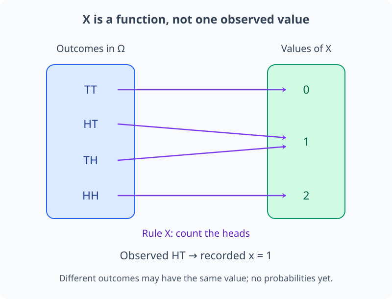
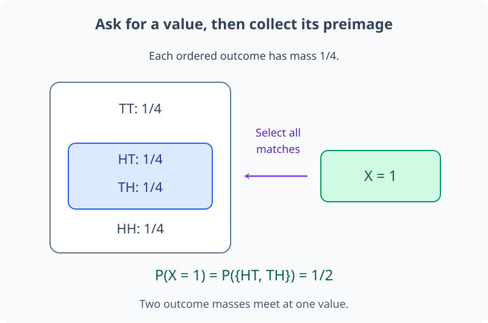
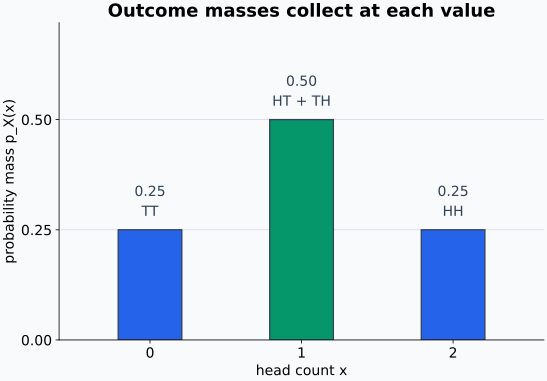
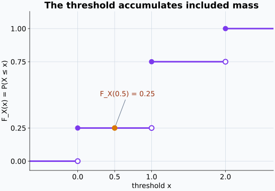
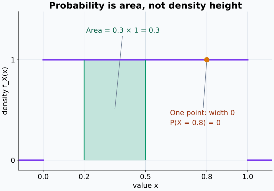
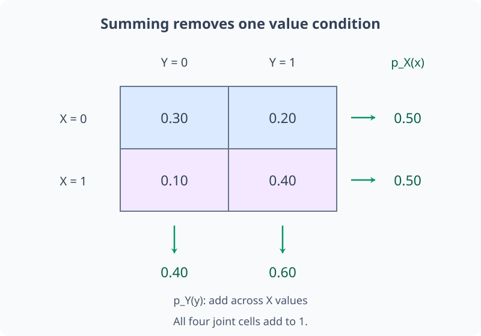
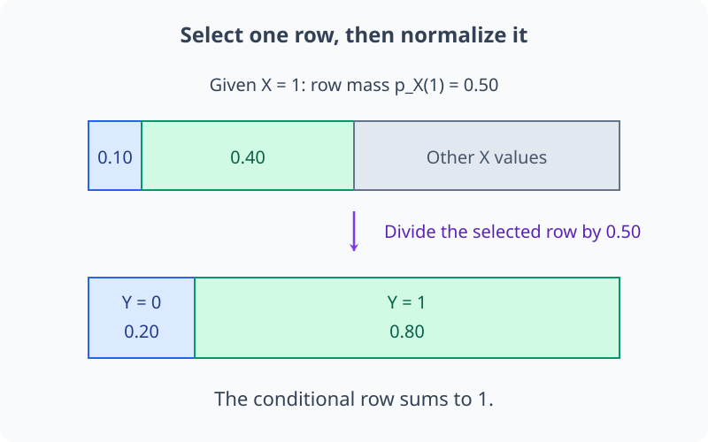
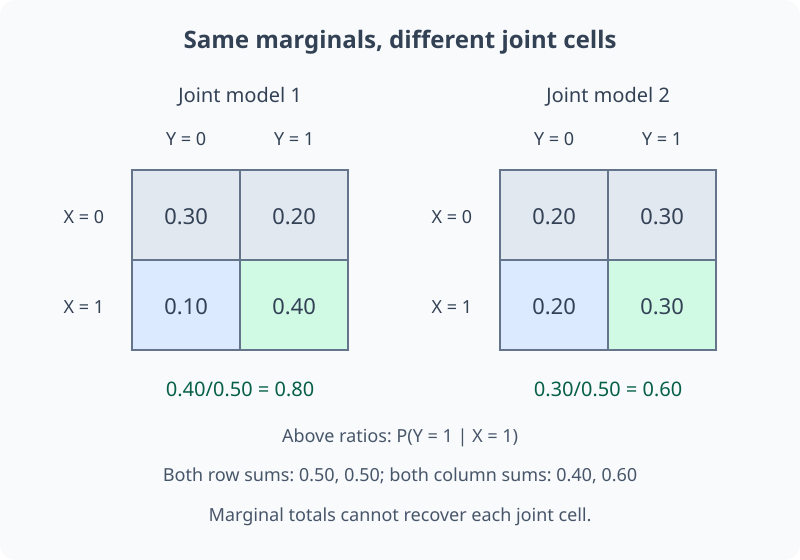

# M04-03. 확률변수와 확률분포

## 이 단원이 필요한 이유

표본공간의 결과가 문자열, 이미지, 문장이나 실험 기록이면 결과 자체를 바로 더하거나 평균낼 수 없다. 확률변수는 각 결과에서 필요한 수치나 범주를 읽어 낸다. 확률분포는 그 확률변수가 어떤 값을 얼마나 자주 가질 수 있는지 나타낸다.

기댓값, 분산, likelihood, entropy와 모델의 예측분포는 모두 확률변수와 분포를 사용한다. 확률변수 $X$, 관측값 $x$, 분포 $p_X(x)$를 구분하면 논문에서 같은 글자가 맡는 역할을 추적할 수 있다.

## 학습 목표

이 단원을 마치면 다음을 할 수 있다.

- 확률변수를 표본공간에서 값의 공간으로 가는 함수로 설명할 수 있다.
- 확률변수 $X$와 관측값 $x$를 구분할 수 있다.
- 이산 확률변수의 확률질량함수를 만들고 검사할 수 있다.
- 누적분포함수를 사건의 확률로 읽고 계산할 수 있다.
- 연속분포의 밀도와 한 점의 확률을 구분할 수 있다.
- 결합분포에서 주변분포와 조건부분포를 계산할 수 있다.
- 모델의 예측분포와 관측 label을 구분하고 주장 범위를 제한할 수 있다.

## 선수지식 확인

- 선수 단원: [M00-03 함수, 입력과 출력](../M00/M00-03-functions-input-output.md)
- 선수 단원: [M04-01 사건과 확률](M04-01-events-probability.md)
- 선수 단원: [M04-02 조건부확률과 Bayes 규칙](M04-02-conditional-probability-bayes-rule.md)
- 확인 질문: 함수가 각 입력에 출력 하나를 대응시킨다는 뜻을 설명할 수 있는가?
- 확인 질문: 사건의 확률과 조건부확률을 계산할 수 있는가?

## 기호와 용어

| 기호·용어 | Common spoken reading | 의미 | 범위 |
|---|---|---|---|
| $X$ | `X` | outcome을 값으로 보내는 함수 | $X:\Omega\to\mathcal X$ |
| $x$ | `x` | $X$에서 관측됐거나 가능한 값 | $x\in\mathcal X$ |
| $p_X(x)$ | `p sub X of x` | $X=x$일 확률 | 이산 $X$에서 $P(X=x)$ |
| $F_X(x)$ | `F sub X of x` | $X$가 $x$ 이하일 확률 | $P(X\le x)$ |
| $f_X(x)$ | `f sub X of x` | 구간확률을 적분해 만드는 밀도 | 연속 $X$ |
| $p_{X,Y}(x,y)$ | `p sub X Y of x comma y` | $X=x$와 $Y=y$가 함께 일어날 확률 | 이산 $X,Y$ |
| distribution | `distribution` | 확률변수가 각 값이나 구간에 배정하는 확률 규칙 | 이산 또는 연속 |

## 핵심 개념 1. 확률변수는 outcome에서 값을 읽는 함수이다

확률변수(random variable) $X$는

\[
X:\Omega\to\mathcal X
\]

꼴의 함수이다. 이름에 variable이 들어가지만 각 outcome $\omega$가 주어지면 $X(\omega)$는 하나의 값으로 정해진다. 무작위성은 어떤 $\omega$가 나올지 시행 전에 모른다는 데서 온다.

동전을 두 번 던지는 표본공간

\[
\Omega=\{HH,HT,TH,TT\}
\]

에서 앞면 수를 세는 확률변수를 정의하면

\[
X(HH)=2,
\quad X(HT)=X(TH)=1,
\quad X(TT)=0
\]

이다. 여러 outcome이 같은 값으로 갈 수 있다.

엄밀한 정의에서는 $X$의 값 조건이 확률을 배정할 수 있는 사건을 만들어야 한다. 이 단원에서 다루는 유한·가산 예제에서는 모든 부분집합을 사건으로 두므로 이 조건이 자동으로 성립한다.

네 outcome을 앞면 수로 보내면 서로 다른 두 결과가 같은 값 $1$에 도착한다.

<figure class="lesson-figure lesson-figure--wide" markdown="1">

<figcaption>각 outcome에서 나가는 대응은 하나뿐이지만 같은 값으로 들어오는 대응은 여러 개일 수 있다. 전체 대응 규칙은 X이고, HT를 관측해 기록한 값 하나는 x=1이다.</figcaption>
</figure>

## 핵심 개념 2. 대문자 확률변수와 소문자 관측값은 역할이 다르다

$X$는 시행 전에 가능한 값과 확률을 함께 가진 함수이고, $x$는 관측된 값이나 계산에서 지정한 값이다. 식

\[
P(X=x)
\]

는 확률변수 $X$가 값 $x$를 내는 사건의 확률을 뜻한다. $X=1$을 관측했다면 데이터에는 소문자 $x=1$을 기록한다.

머신러닝 표기에서도 입력 확률변수 $X$, label 확률변수 $Y$와 한 sample의 관측값 $x,y$를 구분한다. $p_\theta(y\mid x)$는 관측 입력 $x$가 주어졌을 때 가능한 label 값 $y$에 모델이 배정한 확률이다.

위 그림의 화살표 전체는 $X$의 규칙을, 맨 아래의 관측 기록은 소문자 $x$가 맡는 역할을 보여 준다.

## 핵심 개념 3. 분포는 확률변수가 값을 갖는 규칙이다

확률변수 $X$와 표본공간의 확률 $P$가 정해지면 $X$의 분포도 정해진다. 값들의 집합 $S\subseteq\mathcal X$에 대해

\[
P(X\in S)
=P\bigl(\{\omega\in\Omega:X(\omega)\in S\}\bigr)
\]

이다. 오른쪽 집합은 $X$가 $S$로 보내는 outcome들의 역상(preimage)이다.

계산 순서는 값의 조건을 정하고, 그 조건을 만족하는 outcome들을 모은 뒤, 원래 확률 $P$를 적용하는 것이다. 예를 들어 앞면 수가 1인 조건의 역상은 $\{HT,TH\}$다. 역상은 결과 하나를 복원하는 역함수가 아니므로 $X$가 일대일일 필요는 없다. 여러 outcome이 같은 값으로 가면 그 outcome들의 확률을 한 값에 모은다.

같은 표본공간에서도 어떤 확률변수를 정의하느냐에 따라 분포가 달라진다. 동전 두 번에서 앞면 수 $X$와 두 결과가 같은지를 나타내는 indicator $Z$는 다른 값을 가지며 다른 분포를 만든다.

값 조건 $X=1$에서 출발해 모든 대응 outcome을 찾으면 역상이 하나의 결과가 아니라 집합임이 보인다. 아래에서는 네 outcome에 각각 확률 $1/4$을 배정했다.

<figure class="lesson-figure lesson-figure--wide" markdown="1">

<figcaption>값 조건을 만족하는 두 outcome의 원래 확률을 함께 더한다. 화살표를 거꾸로 따라 모든 대응을 찾는 것이며, 역함수처럼 원래 결과 하나만 복원하는 것은 아니다.</figcaption>
</figure>

## 핵심 개념 4. 이산 확률변수는 확률질량함수로 나타낸다

이산 확률변수의 확률질량함수(probability mass function, PMF)는

\[
p_X(x)=P(X=x)
\]

이다. 유효한 PMF는

\[
p_X(x)\ge0,
\qquad
\sum_{x\in\mathcal X}p_X(x)=1
\]

을 만족한다.

서로 다른 두 값 $x_1,x_2$에 대해 $\{X=x_1\}$과 $\{X=x_2\}$는 겹치지 않는다. 한 outcome에서 $X$가 두 값을 동시에 내놓을 수 없기 때문이다. 가능한 값들의 사건을 모두 합하면 $\Omega$가 되므로, 가법성에서 PMF의 전체 합 1이 나온다. 같은 이유로 값 집합 $S$에 들어가는 항들을 더해 그 사건의 확률을 계산한다.

값 집합 $S$의 확률은

\[
P(X\in S)=\sum_{x\in S}p_X(x)
\]

로 계산한다.

앞 단원의 동전 예제처럼 네 순서 결과가 각각 확률 $1/4$을 가진다고 가정한다. 이때 앞면 수 $X$의 PMF는

| $x$ | 0 | 1 | 2 |
|---:|---:|---:|---:|
| $p_X(x)$ | $1/4$ | $1/2$ | $1/4$ |

이다. 값 $1$에는 outcome $HT$와 $TH$ 두 개가 모이므로 확률이 $1/2$이다.

PMF 그래프의 막대 높이는 각 값에 모인 확률이다. 막대 사이의 빈 공간은 그 사이 값에 확률을 배정한다는 뜻이 아니다.

<figure class="lesson-figure lesson-figure--wide" markdown="1">

<figcaption>가운데 막대는 두 outcome의 질량을 모으므로 양옆보다 높다. 가능한 값은 세 개이지만 그 값들이 등확률인 것은 아니다.</figcaption>
</figure>

## 핵심 개념 5. 누적분포함수는 임계값 이하 사건의 확률이다

누적분포함수(cumulative distribution function, CDF)는 실수 값을 갖는 이산·연속 확률변수 모두에 대해

\[
F_X(x)=P(X\le x)
\]

로 정의한다. $x$가 커질수록 사건 $\{X\le x\}$가 더 많은 값을 포함하므로 CDF는 감소하지 않는다. 또한

\[
\lim_{x\to-\infty}F_X(x)=0,
\qquad
\lim_{x\to\infty}F_X(x)=1
\]

이다.

동전 예제에서

\[
F_X(0)=\frac14,
\qquad
F_X(1)=\frac34,
\qquad
F_X(2)=1
\]

이다. 이산 CDF는 확률질량이 있는 값에서 계단처럼 증가한다.

이산분포에서는 가능한 값 $t$ 중 임계값 이하인 PMF 항을 더해 $F_X(x)=\sum_{t\le x}p_X(t)$로 계산한다. 여기서 $x$는 관측값일 필요 없이 비교를 위한 실수다. 동전 예제에서 $x=0.5$는 $X$의 가능한 값이 아니지만, $X\le0.5$에 포함되는 값은 0뿐이므로 $F_X(0.5)=1/4$이다. 0과 1 사이에서 임계값을 움직여도 새로운 확률질량을 포함하지 않으므로 CDF 값은 그대로다.

$a<b$일 때 $\{X\le b\}$는 겹치지 않는 $\{X\le a\}$와 $\{a<X\le b\}$로 나뉜다. 따라서

\[
P(a<X\le b)=F_X(b)-F_X(a)
\]

이다. 왼쪽 끝 $a$를 포함하지 않는 이유는 $F_X(a)$를 빼면서 $X=a$의 확률도 빼기 때문이다. 점확률이 있는 이산분포에서는 구간 끝의 부등호를 구분해야 한다.

계단의 점프 위치와 임계값 $0.5$를 함께 표시하면, 가능한 관측값이 아닌 수로도 누적확률을 물을 수 있음을 확인할 수 있다.

<figure class="lesson-figure lesson-figure--wide" markdown="1">

<figcaption>닫힌 점은 그 임계값에서 실제 CDF 값이고, 열린 점은 점프 전 높이다. 0과 1 사이에서 임계값을 움직여도 추가되는 질량이 없으므로 높이는 그대로다.</figcaption>
</figure>

## 핵심 개념 6. 연속분포에서는 밀도를 구간에 적분한다

이 단원에서는 확률밀도함수(probability density function, PDF) $f_X$로 나타낼 수 있는 연속분포를 다룬다. 구간확률은

\[
P(a\le X\le b)=\int_a^b f_X(x)\,dx
\]

로 계산한다. 밀도는

\[
f_X(x)\ge0,
\qquad
\int_{-\infty}^{\infty}f_X(x)\,dx=1
\]

을 만족한다.

$f_X(x)$는 한 점의 확률이 아니다. 밀도로 나타내는 분포에서는

\[
P(X=x)=0
\]

이다. 한 점은 폭이 0인 구간이므로 그 구간에 밀도를 적분한 값도 0이다. 폭이 있는 구간은 양의 확률을 가질 수 있으며, 점확률 0이라는 사실은 그 값이 표본공간에서 배제됐다는 뜻이 아니다.

밀도값은 1보다 클 수도 있지만, 구간 아래 넓이인 확률은 $[0,1]$에 있다. 밀도를 확률로 바꾸는 데는 구간의 폭도 필요하다. 예제 2에서 밀도는 1이지만 폭 $0.3$인 구간의 확률은 $0.3$이다. 밀도로 나타내는 분포에서 CDF와 밀도의 관계는

\[
F_X(x)=\int_{-\infty}^{x}f_X(t)\,dt
\]

이다.

예제 2의 균등분포에서 구간의 폭과 밀도의 높이를 구분해 보자. 별도로 표시한 점 $0.8$도 밀도 높이는 1이지만 점확률은 0이다.

<figure class="lesson-figure lesson-figure--wide" markdown="1">

<figcaption>초록 영역은 폭 0.3과 높이 1을 곱한 확률이다. 주황 점은 밀도 위의 한 위치일 뿐이며 폭을 갖지 않아 그 자체로 넓이를 만들지 않는다.</figcaption>
</figure>

## 핵심 개념 7. 결합분포는 여러 확률변수의 공동 변화를 담는다

이산 확률변수 $X,Y$의 결합확률질량함수는

\[
p_{X,Y}(x,y)=P(X=x,Y=y)
\]

이다. $Y$ 값을 모두 합하면 $X$의 주변분포(marginal distribution)를 얻는다.

$X=x$를 고정한 채 가능한 $Y$ 값을 모두 모으면 사건 $\{X=x\}$가 된다. 서로 다른 $y$의 결합 사건은 겹치지 않으므로 가법성에 따라 다음 합을 계산한다. 표에서 행을 합하는 것은 $Y$에 대한 조건을 버리고 $X$의 값만 남기는 계산이다.

\[
p_X(x)=\sum_y p_{X,Y}(x,y).
\]

$p_X(x)>0$이면 조건부분포는

\[
p_{Y\mid X}(y\mid x)
=\frac{p_{X,Y}(x,y)}{p_X(x)}
\]

이다. 결합분포에는 각 변수의 주변분포와 두 변수가 함께 나타나는 방식이 들어 있다. M04-04에서는 이 분포로 공분산을 계산한다.

조건부분포에서는 결합 표의 $X=x$ 행을 그 행의 합으로 나눈다. 따라서 $\sum_y p_{Y\mid X}(y\mid x)=p_X(x)/p_X(x)=1$이다. 주변분포는 다른 변수의 값을 모두 합하는 계산이고, 조건부분포는 한 값으로 제한한 뒤 확률을 다시 정규화하는 계산이다.

반대로 행 합과 열 합만으로 표의 각 칸을 복원할 수는 없다. 예제 3의 첫 행을 $(0.20,0.30)$, 둘째 행을 $(0.20,0.30)$으로 바꾸어도 행 합은 각각 $0.50$이고 열 합은 $0.40,0.60$이다. 두 주변분포는 같지만 $P(Y=1\mid X=1)$은 기존 $0.80$에서 $0.60$으로 달라진다. 주변분포가 같아도 함께 나타나는 방식은 다를 수 있다.

주변분포를 만들 때는 한 방향의 칸을 모두 더한다. 예제 3의 표에서 행을 더하는 것과 열을 더하는 것은 서로 다른 값 조건을 없애는 계산이다.

<figure class="lesson-figure lesson-figure--wide" markdown="1">

<figcaption>행의 두 칸을 더하면 Y에 대한 조건 없이 해당 X의 확률을 얻는다. 열의 두 칸을 더하면 반대로 X의 값을 모두 합쳐 Y의 확률만 남긴다.</figcaption>
</figure>

조건부분포는 모든 행을 더하는 대신 한 행만 남긴다. 그 행의 질량이 $0.50$이므로 이 값을 새 분모로 삼는다.

<figure class="lesson-figure lesson-figure--wide" markdown="1">

<figcaption>위 막대의 오른쪽 회색 부분은 다른 X 값의 질량이어서 조건 밖으로 빠진다. 선택한 행 전체를 확률 1로 늘리면 그 안의 Y 값들이 조건부분포를 만든다.</figcaption>
</figure>

두 결합표의 주변 합을 같게 유지해도, 선택한 행 안에서 어느 Y 값에 질량이 모이는지는 달라질 수 있다.

<figure class="lesson-figure lesson-figure--wide" markdown="1">

<figcaption>두 표의 행 합과 열 합은 같지만 오른쪽 아래 칸의 질량은 다르다. 따라서 같은 X를 조건으로 걸었을 때 Y의 확률도 달라지며, 주변분포 두 개로 결합분포를 복원할 수 없다.</figcaption>
</figure>

## 예제 1. outcome에서 PMF 만들기

### 문제

공정한 동전을 두 번 던지고 $X$를 앞면 수로 정의한다. $X$의 PMF를 구한다.

### 풀이

각 outcome의 확률은 $1/4$이다. $X$의 값별 역상은

\[
\{X=0\}=\{TT\},
\quad
\{X=1\}=\{HT,TH\},
\quad
\{X=2\}=\{HH\}
\]

이다. 따라서

\[
p_X(0)=\frac14,
\qquad
p_X(1)=\frac24=\frac12,
\qquad
p_X(2)=\frac14.
\]

세 값을 더하면 1이므로 PMF 조건을 만족한다.

### 결과의 의미

확률변수는 네 outcome을 세 값으로 묶고, 각 묶음에 들어간 outcome의 확률을 합해 분포를 만든다.

## 예제 2. 균등 연속분포의 구간확률

$X$가 $[0,1]$에서 균등하고

\[
f_X(x)=
\begin{cases}
1,&0\le x\le1,\\
0,&\text{그 밖의 경우}
\end{cases}
\]

라고 하자. 그러면

\[
P(0.2\le X\le0.5)
=\int_{0.2}^{0.5}1\,dx
=0.3
\]

이다. 반면 $P(X=0.2)=0$이다. 밀도 $f_X(0.2)=1$을 점확률로 읽으면 안 된다.

## 예제 3. 결합분포에서 주변분포 구하기

두 이산 확률변수의 결합 PMF가 다음과 같다고 하자.

| $p_{X,Y}(x,y)$ | $Y=0$ | $Y=1$ |
|---|---:|---:|
| $X=0$ | 0.30 | 0.20 |
| $X=1$ | 0.10 | 0.40 |

각 행과 열을 합하면

\[
p_X(0)=0.30+0.20=0.50,
\qquad
p_X(1)=0.10+0.40=0.50,
\]

\[
p_Y(0)=0.30+0.10=0.40,
\qquad
p_Y(1)=0.20+0.40=0.60
\]

이다. 또한

\[
P(Y=1\mid X=1)=\frac{0.40}{0.50}=0.80
\]

이다.

## 예제 4. 모델의 예측분포 읽기

세 class 분류모델이 관측 입력 $x$에

\[
p_\theta(y\mid x)=(0.10,0.65,0.25)
\]

를 출력했다. 이는 label 확률변수 $Y$가 가능한 세 값에 대해 모델이 정한 조건부분포이다. argmax 예측은 둘째 class이고 그 확률은 $0.65$이다. 실제 관측 label $y$가 무엇인지는 이 vector만으로 정해지지 않는다.

## 흔한 오해

### 오해 1. 확률변수는 값이 무작위로 바뀌는 미지수이다

확률변수는 outcome을 값으로 보내는 함수이다. 각 outcome이 정해지면 함수값도 정해지며, 어떤 outcome이 관찰될지 모르는 상태를 분포로 표현한다.

### 오해 2. $X$와 $x$는 글자 크기만 다른 같은 표기이다

$X$는 가능한 값과 확률을 가진 확률변수이고 $x$는 한 관측값이나 지정한 값이다. $p_X(x)$는 둘의 역할을 함께 드러낸다.

### 오해 3. 확률밀도 $f_X(x)$는 $P(X=x)$이다

밀도로 나타내는 연속분포의 한 점 확률은 0이다. 밀도는 구간에 적분해서 확률을 만드는 값이다.

### 오해 4. 주변분포 두 개를 알면 결합분포가 정해진다

같은 주변분포를 가지면서 변수 사이의 의존관계가 다른 결합분포가 존재한다. 결합확률은 두 변수가 함께 나타나는 방식을 추가로 담는다.

### 오해 5. 예측분포의 최댓값 class가 실제 label이다

argmax는 모델이 가장 큰 확률을 배정한 예측이다. 실제 label은 데이터에서 관측하며, 둘의 일치는 평가 대상이다.

## 연습문제

### 1. 확률변수와 관측값

문장 길이를 세는 확률변수를 $X$라 하고 한 문장의 길이가 12 token으로 관측됐다. $X$와 $x=12$의 역할을 구분해 설명하라.

해설 보기

$X$는 가능한 문장을 입력받아 token 수를 출력하는 함수이며, 문장 분포와 함께 여러 길이에 확률을 만든다. $x=12$는 한 문장에서 관측한 값이다.

### 2. PMF 검사

$p_X(0)=0.2$, $p_X(1)=0.5$, $p_X(2)=0.4$가 유효한 PMF인지 판단하라.

해설 보기

각 값은 음수가 아니지만 합이

\[
0.2+0.5+0.4=1.1
\]

이다. 전체 확률이 1이어야 하므로 유효한 PMF가 아니다.

### 3. 확률변수의 분포

공정한 주사위 결과를 $\omega$라 하고

\[
X(\omega)=
\begin{cases}
1,&\omega\text{가 짝수일 때},\\
0,&\omega\text{가 홀수일 때}
\end{cases}
\]

로 정의한다. $p_X(0)$과 $p_X(1)$을 구하라.

해설 보기

짝수 outcome은 $\{2,4,6\}$이고 홀수 outcome은 $\{1,3,5\}$이다. 각 집합의 확률이 $3/6$이므로

\[
p_X(0)=\frac12,
\qquad
p_X(1)=\frac12.
\]

### 4. CDF 계산

$p_X(0)=0.2$, $p_X(1)=0.5$, $p_X(2)=0.3$이다. $F_X(0)$, $F_X(1)$과 $F_X(1.5)$를 구하라.

해설 보기

\[
F_X(0)=P(X\le0)=0.2,
\]

\[
F_X(1)=P(X\le1)=0.2+0.5=0.7.
\]

$1.5$ 이하에 포함되는 가능한 값도 $0,1$이므로 $F_X(1.5)=0.7$이다.

### 5. 밀도와 점확률

$X$가 $[0,2]$에서 균등하고 $f_X(x)=1/2$이다. $P(0.5\le X\le1.5)$와 $P(X=1)$을 구하라.

해설 보기

구간 길이는 1이므로

\[
P(0.5\le X\le1.5)
=\int_{0.5}^{1.5}\frac12\,dx
=\frac12.
\]

연속분포의 한 점은 넓이가 0이므로 $P(X=1)=0$이다.

### 6. 결합분포와 주변분포

다음 결합 PMF에서 $p_X(0)$과 $P(Y=1\mid X=0)$을 구하라.

| $p_{X,Y}(x,y)$ | $Y=0$ | $Y=1$ |
|---|---:|---:|
| $X=0$ | 0.15 | 0.35 |
| $X=1$ | 0.25 | 0.25 |

해설 보기

첫 행을 합하면

\[
p_X(0)=0.15+0.35=0.50.
\]

따라서

\[
P(Y=1\mid X=0)=\frac{0.35}{0.50}=0.70.
\]

### 7. 모델 주장 비판

분류모델이 한 입력에 $(0.05,0.90,0.05)$를 출력했다. “둘째 class의 실제 정답 확률은 90%이며 모델은 불확실성을 정확히 안다”라는 주장을 평가하라.

해설 보기

vector는 그 입력에서 모델이 정한 조건부 예측분포이다. 실제 데이터 생성분포의 조건부확률과 같은지는 이 출력만으로 확인할 수 없다. 독립된 평가 데이터에서 정확도와 calibration을 측정하고, 입력 분포가 학습·평가 조건과 다른지도 확인해야 한다.

## 단원 요약

- 확률변수는 표본공간의 outcome을 수치나 범주 값으로 보내는 함수이다.
- 대문자 $X$는 확률변수이고 소문자 $x$는 가능한 값이나 관측값이다.
- 분포는 값 집합의 역상에 표본공간의 확률을 배정해 얻는다.
- 이산분포는 PMF로, 누적확률은 CDF로 나타낸다.
- 연속분포의 PDF는 구간에 적분해 확률을 만들며 밀도값은 점확률이 아니다.
- 결합분포를 한 변수에 대해 합하면 주변분포를 얻는다.
- 모델의 예측분포는 관측 label이나 실제 데이터 분포와 구분해야 한다.

## 통과 기준

다음 질문에 자료를 보지 않고 답할 수 있으면 통과한다.

- 확률변수를 함수로 정의하고 outcome과 연결할 수 있는가?
- 확률변수 $X$와 관측값 $x$를 구분할 수 있는가?
- outcome별 확률에서 PMF를 만들고 합이 1인지 검사할 수 있는가?
- CDF를 $P(X\le x)$로 읽고 계산할 수 있는가?
- PDF와 한 점의 확률을 구분할 수 있는가?
- 결합 PMF에서 주변분포와 조건부분포를 계산할 수 있는가?
- 모델의 예측분포가 허용하는 주장 범위를 제한할 수 있는가?

## 다음 단원

- [M04-04 기댓값, 분산과 공분산](M04-04-expectation-variance-covariance.md)

## 집필자 점검표

- [x] 학습 목표가 관찰 가능한 행동으로 작성됐다.
- [x] 확률변수를 함수로 정의했다.
- [x] 대문자 확률변수와 소문자 관측값을 구분했다.
- [x] PMF, CDF와 PDF의 역할을 구분했다.
- [x] 결합·주변·조건부분포를 계산했다.
- [x] 작은 이산·연속 예제를 검산했다.
- [x] 모든 문제에 해설이 있다.
- [x] 모델 해석 주장의 강도를 구분했다.
- [x] 용어집과 표기 규칙을 따랐다.
- [x] 선수지식 밖의 내용을 몰래 요구하지 않는다.
- [x] 내부 링크와 수식 구분자를 확인했다.
- [x] Common spoken reading이 실제 영어 학술 발화이며 한글 음역이나 기계적 직역을 포함하지 않는다.
