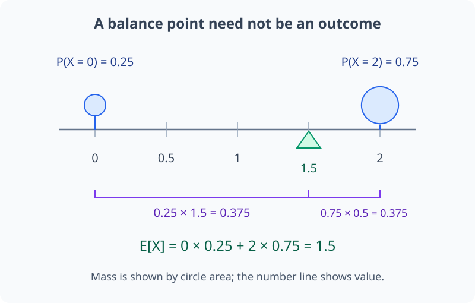
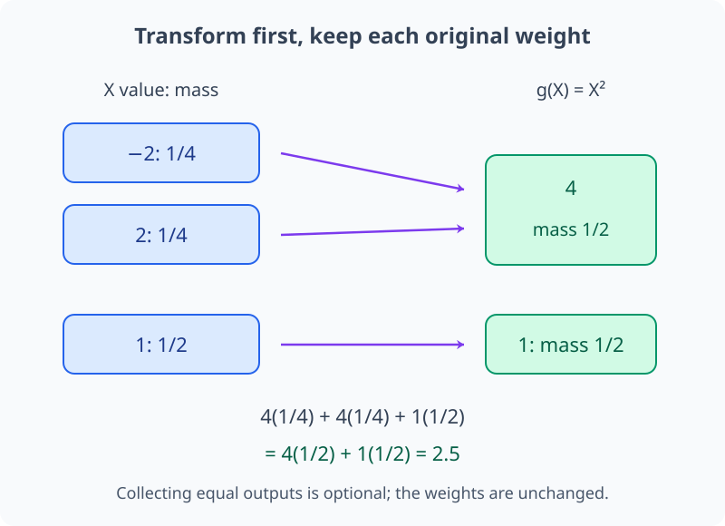
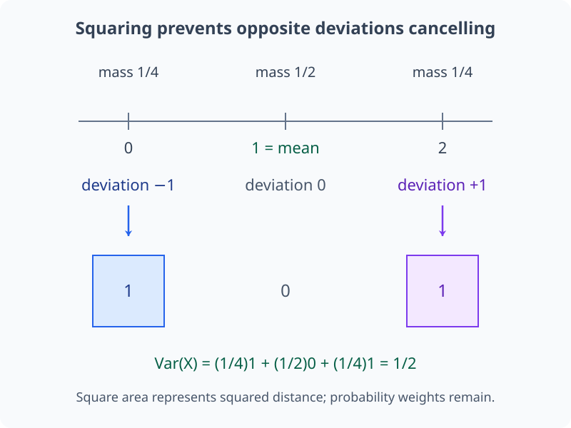
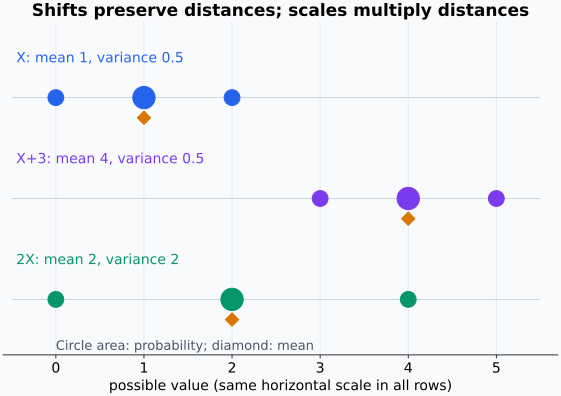
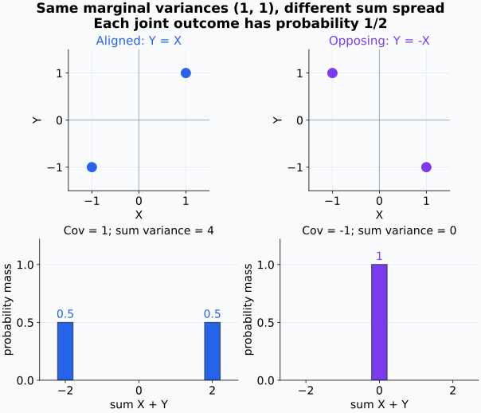
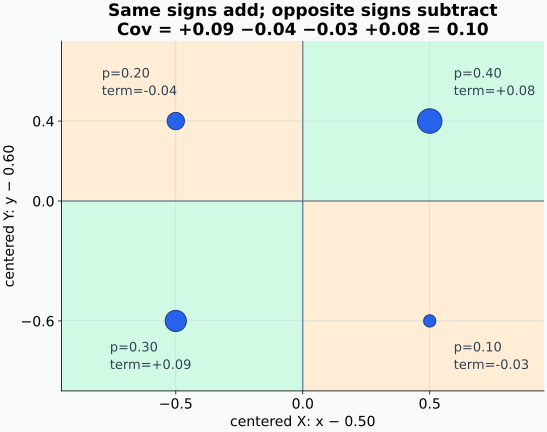
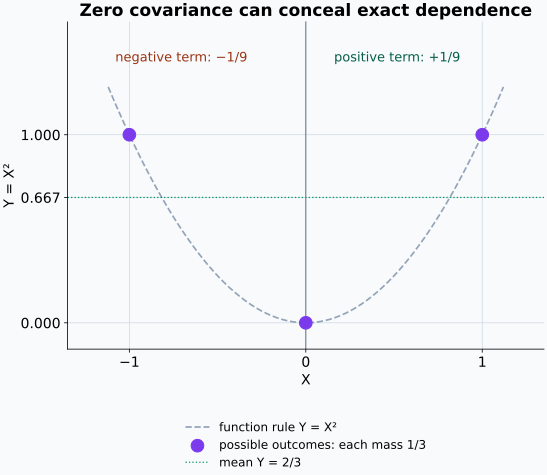
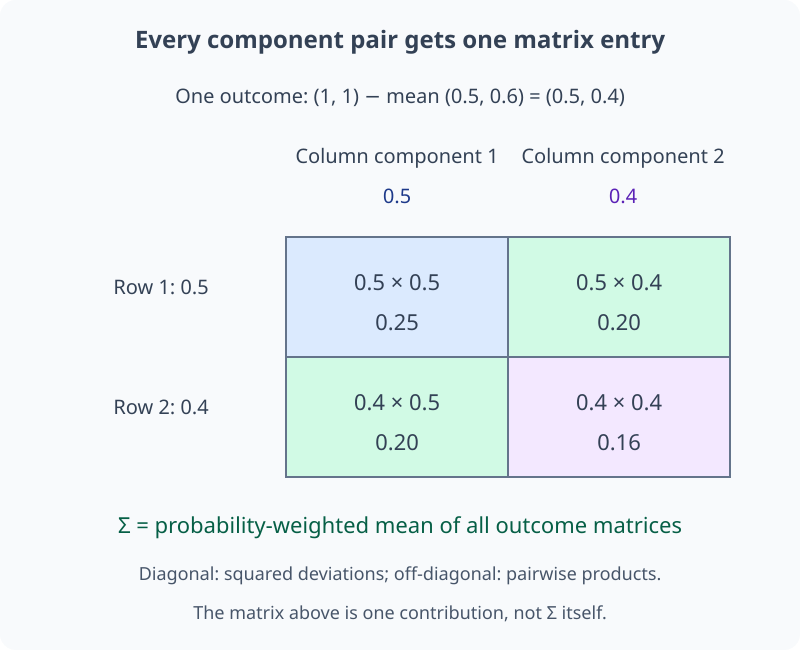
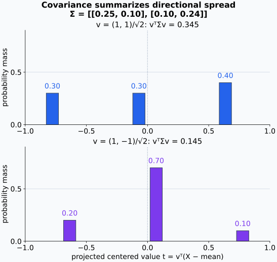
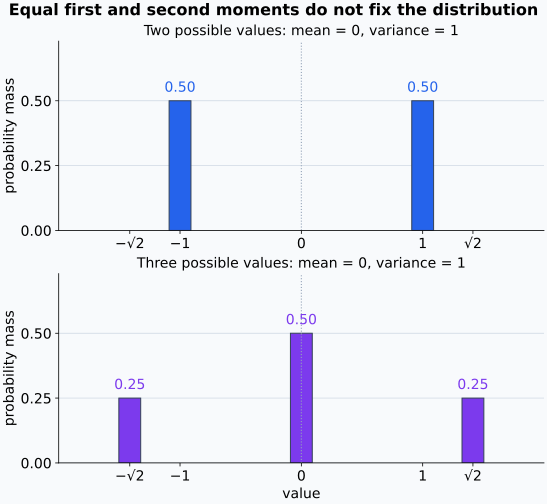

# M04-04. 기댓값, 분산과 공분산

## 이 단원이 필요한 이유

확률분포 전체를 표나 함수로 제시하면 가능한 값과 확률을 모두 볼 수 있다. 논문과 실험 보고서는 그 분포를 몇 개의 수로 요약할 때가 많다. 기댓값은 평균적 위치를, 분산은 그 주변의 퍼짐을, 공분산은 두 확률변수가 함께 변하는 방향을 나타낸다.

activation의 평균과 공분산행렬(covariance matrix), loss의 평균과 표준편차, 여러 seed의 성능 변동은 이 요약량을 사용한다. 같은 평균을 가진 분포도 퍼짐과 공동변화가 다를 수 있으므로 각 수가 담는 정보와 버리는 정보를 구분해야 한다.

## 학습 목표

이 단원을 마치면 다음을 할 수 있다.

- 이산·연속 확률변수의 기댓값을 계산할 수 있다.
- 기댓값의 선형성을 적용하고 독립이 필요한지 판단할 수 있다.
- 분산과 표준편차를 계산하고 단위를 구분할 수 있다.
- 분산의 두 공식을 서로 변환할 수 있다.
- 결합분포에서 공분산과 상관계수를 계산할 수 있다.
- 무상관과 독립을 구분할 수 있다.
- 평균·공분산만으로 모델 표현을 해석할 때 남는 한계를 설명할 수 있다.

## 선수지식 확인

- 선수 단원: [M01-08 적분과 누적](../M01/M01-08-integration-accumulation.md)
- 선수 단원: [M02-14 데이터 행렬, 공분산과 PCA](../M02/M02-14-covariance-pca.md)
- 선수 단원: [M04-03 확률변수와 확률분포](M04-03-random-variables-distributions.md)
- 확인 질문: PMF의 확률 합과 PDF의 구간 적분을 계산할 수 있는가?
- 확인 질문: 결합 PMF에서 주변분포를 구할 수 있는가?

## 기호와 용어

| 기호·용어 | Common spoken reading | 의미 | 범위·단위 |
|---|---|---|---|
| $\mathbb E[X]$ | `the expectation of X` | 분포로 가중한 $X$의 평균 | $X$와 같은 단위 |
| $\mu_X$ | `mu sub X` | $X$의 모평균 | $\mu_X=\mathbb E[X]$ |
| $\operatorname{Var}(X)$ | `the variance of X` | 평균에서 벗어난 거리 제곱의 기댓값 | $X$ 단위의 제곱 |
| $\sigma_X$ | `sigma sub X` | $X$의 표준편차 | $\sqrt{\operatorname{Var}(X)}$ |
| $\operatorname{Cov}(X,Y)$ | `the covariance of X and Y` | 두 중심화 변수가 함께 움직이는 방향과 크기 | $X$ 단위와 $Y$ 단위의 곱 |
| $\rho_{X,Y}$ | `rho sub X Y` | 공분산을 표준편차로 나눈 상관계수 | $-1\le\rho_{X,Y}\le1$ |
| $\mathbf\Sigma$ | `capital sigma` | 확률벡터의 공분산행렬 | 대칭 positive semidefinite matrix |

## 핵심 개념 1. 기댓값은 분포가 정한 가중평균이다

이산 확률변수 $X$의 기댓값(expectation)은

\[
\mathbb E[X]
=\sum_x x\,p_X(x)
\]

이다. 각 가능한 값에 그 값의 확률을 곱해 더한다. 연속 확률변수에서는 합을 적분으로 바꾼다.

\[
\mathbb E[X]
=\int_{-\infty}^{\infty}x f_X(x)\,dx.
\]

기댓값이 존재하려면 해당 합이나 적분이 적절히 수렴해야 한다. 기댓값은 확률변수의 가능한 값 밖에 놓일 수도 있다. 공정한 주사위의 기댓값은 $3.5$지만 한 번의 결과로 $3.5$가 나오지는 않는다.

이 단원에서 유한한 평균을 계산할 때는 $\sum_x |x|p_X(x)<\infty$ 또는 $\int |x|f_X(x)\,dx<\infty$를 가정한다. 양수 항과 음수 항의 무한한 크기를 서로 상쇄해 평균을 정하지 않기 위한 조건이다. 분산과 공분산을 계산하는 변수에는 유한한 이차 모멘트 $\mathbb E[X^2]$도 가정한다. 가능한 값이 유한 개이고 각 값이 유한한 예제에서는 이 조건들이 성립한다.

아래 설명용 분포는 0과 2에 서로 다른 질량을 둔다. 평균은 질량이 큰 쪽에 가깝지만, 가능한 값 중 하나를 골라야 하는 것은 아니다.

<figure class="lesson-figure lesson-figure--wide" markdown="1">

<figcaption>원 넓이는 확률 질량을, 가로 위치는 값을 나타낸다. 평균 양쪽의 거리와 질량을 곱한 값이 같아지는 위치가 균형점이며, 이 분포에서는 관측값으로 나올 수 없는 1.5다.</figcaption>
</figure>

## 핵심 개념 2. 함수의 기댓값은 원래 분포에서 계산할 수 있다

$Y=g(X)$라 하면 $Y$의 분포를 먼저 만들지 않고

\[
\mathbb E[g(X)]
=\sum_x g(x)p_X(x)
\]

로 계산할 수 있다. 연속형에서는

\[
\mathbb E[g(X)]
=\int_{-\infty}^{\infty}g(x)f_X(x)\,dx
\]

이다. 이 규칙은 $g(X)=X^2$, loss $\ell(X)$와 indicator 같은 변환의 평균을 계산할 때 사용한다.

이산형에서 $Y$의 한 값 $y$에는 $g(x)=y$인 여러 $x$가 모일 수 있다. 이 값의 확률은 그 $x$들의 확률을 더한 것이다. 따라서 $Y$의 기댓값을 값별로 계산하더라도

\[
\sum_y y\,p_Y(y)
=\sum_y y\sum_{x:g(x)=y}p_X(x)
=\sum_x g(x)p_X(x)
\]

를 얻는다. 오른쪽 식은 같은 값으로 모으는 중간 단계를 생략하고, 원래 값마다 변환된 출력과 확률을 곱한 것이다. 이 계산에서도 기댓값이 유한하도록 $\mathbb E[|g(X)|]<\infty$를 가정한다.

사건 $A$의 지시변수(indicator)를

\[
\mathbf 1_A=
\begin{cases}
1,&A\text{가 일어날 때},\\
0,&A\text{가 일어나지 않을 때}
\end{cases}
\]

로 정의하면

\[
\mathbb E[\mathbf 1_A]=P(A)
\]

이다. 정확도도 sample별 정답 indicator의 평균으로 표현할 수 있다.

indicator가 취하는 값은 1과 0뿐이므로 그 기댓값은 $1\cdot P(A)+0\cdot P(A^c)=P(A)$이다. 사건의 확률을 수치 함수의 평균으로 바꾼 관계다.

제곱 변환에서는 서로 다른 원래 값이 같은 출력으로 모일 수 있다. 아래 두 계산은 출력값을 먼저 모으는지 여부만 다르다.

<figure class="lesson-figure lesson-figure--wide" markdown="1">

<figcaption>값을 변환해도 원래 확률 가중치는 유지한다. 같은 출력 4에 모인 확률을 먼저 합쳐도, 원래 세 값마다 변환 결과와 확률을 곱해 더해도 같은 기댓값을 얻는다.</figcaption>
</figure>

## 핵심 개념 3. 기댓값은 선형이다

상수 $a,b,c$와 확률변수 $X,Y$에 대해

\[
\mathbb E[aX+bY+c]
=a\mathbb E[X]+b\mathbb E[Y]+c
\]

이다. 이 성질에는 $X$와 $Y$의 독립이 필요하지 않다. 합의 평균은 각 항의 평균을 더해 계산한다.

이산형에서는 같은 결합분포를 가중치로 사용해

\[
\mathbb E[aX+bY+c]
=\sum_x\sum_y (ax+by+c)p_{X,Y}(x,y)
\]

로 쓴다. 괄호를 펼친 뒤 첫 항에서 $y$를 합하면 $p_X(x)$가 되고, 둘째 항에서 $x$를 합하면 $p_Y(y)$가 된다. 상수 항에는 전체 확률 합 1이 곱해진다. 이 과정에는 결합확률을 두 주변확률의 곱으로 분리하는 단계가 없다.

반면 곱의 기댓값을

\[
\mathbb E[XY]=\mathbb E[X]\mathbb E[Y]
\]

로 분리하려면 독립 같은 추가 조건이 필요하다. 기댓값의 선형성과 곱의 분리를 같은 규칙으로 취급하면 안 된다.

## 핵심 개념 4. 분산은 평균에서 떨어진 거리 제곱의 평균이다

$\mu_X=\mathbb E[X]$라 두면 분산(variance)은

\[
\operatorname{Var}(X)
=\mathbb E\left[(X-\mu_X)^2\right]
\]

이다. 제곱을 사용하므로 평균보다 큰 편차와 작은 편차가 상쇄되지 않는다. 분산은 음수가 아니며, $X$가 확률 1로 상수일 때 0이다.

식을 전개하면 계산에 편한 형태를 얻는다.

\[
\begin{aligned}
\operatorname{Var}(X)
&=\mathbb E[X^2-2\mu_X X+\mu_X^2]\\
&=\mathbb E[X^2]-2\mu_X\mathbb E[X]+\mu_X^2\\
&=\mathbb E[X^2]-\mu_X^2.
\end{aligned}
\]

표준편차(standard deviation)는

\[
\sigma_X=\sqrt{\operatorname{Var}(X)}
\]

이다. 분산의 단위는 $X$ 단위의 제곱이고 표준편차는 $X$와 같은 단위를 가진다.

예제 1의 평균 1을 기준으로 양쪽 편차를 제곱하면, 반대 부호였던 두 거리가 모두 양의 기여로 바뀐다.

<figure class="lesson-figure lesson-figure--wide" markdown="1">

<figcaption>양옆 정사각형은 같은 크기의 제곱 거리를 나타낸다. 가운데 편차는 0이라 기여가 없으며, 각 제곱 거리에 원래의 확률을 곱해 분산을 계산한다.</figcaption>
</figure>

## 핵심 개념 5. 상수 이동과 배율은 분산을 다르게 바꾼다

상수 $a,b$에 대해

\[
\operatorname{Var}(aX+b)=a^2\operatorname{Var}(X)
\]

이다. $b$를 더하면 모든 값과 평균이 함께 이동하므로 평균과의 편차는 그대로다. $a$를 곱하면 편차도 $a$배가 되고 제곱 편차는 $a^2$배가 된다.

두 확률변수의 합에는 공분산 항이 들어간다.

\[
\operatorname{Var}(X+Y)
=\operatorname{Var}(X)+\operatorname{Var}(Y)
+2\operatorname{Cov}(X,Y).
\]

독립인 $X,Y$의 공분산은 0이므로 이 경우에는 두 분산만 더한다.

합의 평균은 $\mu_X+\mu_Y$이므로 중심화한 합은 $(X-\mu_X)+(Y-\mu_Y)$이다. 이 편차를 제곱하면

\[
(X-\mu_X)^2+(Y-\mu_Y)^2
+2(X-\mu_X)(Y-\mu_Y)
\]

가 된다. 기댓값을 취하면 첫 두 항은 각 분산이고 마지막 항은 두 배의 공분산이다. 따라서 합의 분산에는 두 변수의 퍼짐뿐 아니라 편차가 같은 쪽으로 모이는지 반대쪽으로 모이는지도 들어간다.

같은 확률 질량을 유지한 채 값의 위치만 옮기거나 늘려 보면 평균과의 거리가 어떻게 바뀌는지 확인할 수 있다.

<figure class="lesson-figure lesson-figure--wide" markdown="1">

<figcaption>상수를 더한 줄은 점과 평균이 함께 이동한다. 두 배로 늘린 줄에서는 평균까지의 거리도 두 배가 되어 제곱 거리의 평균은 네 배가 된다.</figcaption>
</figure>

각 변수의 분산이 같아도 두 변수가 같은 방향으로 움직이는지 반대 방향으로 움직이는지에 따라 합의 퍼짐은 달라진다.

<figure class="lesson-figure lesson-figure--wide" markdown="1">

<figcaption>왼쪽에서는 두 편차가 합쳐져 합의 값이 멀어지고, 오른쪽에서는 같은 크기의 편차가 상쇄된다. 두 경우 모두 합의 평균은 0이지만 분산은 다르다. 위 점들은 각 경우에 가능한 결합 결과 두 개다.</figcaption>
</figure>

## 핵심 개념 6. 공분산은 두 중심화 변수가 함께 움직이는 방향을 나타낸다

공분산(covariance)은

\[
\operatorname{Cov}(X,Y)
=\mathbb E\left[(X-\mu_X)(Y-\mu_Y)\right]
\]

이다. 전개하면

\[
\operatorname{Cov}(X,Y)
=\mathbb E[XY]-\mathbb E[X]\mathbb E[Y]
\]

를 얻는다.

공분산이 양수이면 두 변수가 평균보다 큰 쪽과 작은 쪽으로 함께 움직이는 경향이 있다. 음수이면 한 변수가 평균보다 클 때 다른 변수가 작은 경향이 있다. 0이면 선형 공동변화가 없다는 뜻이다.

전개한 네 항의 기댓값은 $\mathbb E[XY]-\mu_Y\mathbb E[X]-\mu_X\mathbb E[Y]+\mu_X\mu_Y$이다. 평균의 정의를 대입하면 가운데 두 항과 마지막 항이 합쳐져 $-\mu_X\mu_Y$만 남는다. 편차의 곱은 두 편차의 부호가 같을 때 양수이고 다를 때 음수다. 공분산은 이 곱을 확률로 가중해 더한 값이므로 0이라는 결과에는 양수·음수 기여의 상쇄도 포함된다.

공분산은 변수의 단위와 scale에 따라 달라진다. 상관계수(correlation coefficient)는 이를 표준화한다.

\[
\rho_{X,Y}
=\frac{\operatorname{Cov}(X,Y)}{\sigma_X\sigma_Y},
\qquad \sigma_X,\sigma_Y>0.
\]

상관계수도 비선형 의존성과 인과 방향을 정하지 않는다.

평균을 빼고 표준편차로 나눈 변수는 평균 0, 분산 1이다. 두 표준화 변수의 곱을 평균 내면 $\rho_{X,Y}$를 얻는다. 임의의 실수 $t$에 대해 표준화 변수 하나에서 다른 변수의 $t$배를 뺀 제곱의 기댓값은 $1-2t\rho_{X,Y}+t^2\ge0$이다. 여기에 $t=\rho_{X,Y}$를 넣으면 $1-\rho_{X,Y}^2\ge0$이므로 상관계수가 $[-1,1]$에 놓인다. 표준편차가 0이면 이 표준화와 상관계수는 정의할 수 없다.

예제 2의 평균을 빼면 네 결합 결과가 평균의 어느 쪽에 놓이는지 드러난다. 각 점의 기여는 편차의 곱에 그 점의 확률을 곱한 것이다.

<figure class="lesson-figure lesson-figure--wide" markdown="1">

<figcaption>같은 부호의 편차는 양수, 반대 부호의 편차는 음수 기여를 만든다. 원 넓이는 해당 결과의 확률이며, 공분산의 부호는 점이 있는 개수만이 아니라 이 가중된 기여의 합으로 정해진다.</figcaption>
</figure>

흔한 오해 4의 $Y=X^2$를 유한한 세 값에서 보면, 양쪽 기여가 상쇄되어도 함수로 정해지는 관계는 남아 있음을 확인할 수 있다.

<figure class="lesson-figure lesson-figure--wide" markdown="1">

<figcaption>보라 점 세 개가 가능한 결합 결과이며 각각 확률 3분의 1을 갖는다. 회색 곡선은 함수 규칙일 뿐, 그 위의 모든 값에 확률이 있다는 뜻은 아니다. 공분산이 0이어도 X를 알면 Y가 정해진다.</figcaption>
</figure>

## 핵심 개념 7. 공분산행렬은 확률벡터의 이차 공동변화를 모은다

확률벡터 $\mathbf X\in\mathbb R^d$의 평균벡터를

\[
\boldsymbol\mu=\mathbb E[\mathbf X]
\]

라 하면 공분산행렬은

\[
\mathbf\Sigma
=\mathbb E\left[(\mathbf X-\boldsymbol\mu)
(\mathbf X-\boldsymbol\mu)^\top\right]
\in\mathbb R^{d\times d}
\]

이다. 대각 원소는 각 성분의 분산이고 비대각 원소는 성분 쌍의 공분산이다. 임의의 방향 $\mathbf v$에 대해

\[
\operatorname{Var}(\mathbf v^\top\mathbf X)
=\mathbf v^\top\mathbf\Sigma\mathbf v\ge0
\]

이므로 $\mathbf\Sigma$는 positive semidefinite이다.

기댓값은 vector나 matrix의 각 성분에 적용한다. 따라서 $\Sigma_{ij}=\mathbb E[(X_i-\mu_i)(X_j-\mu_j)]$이고, scalar 곱의 순서를 바꿀 수 있어 $\Sigma_{ij}=\Sigma_{ji}$이다. 각 성분 쌍의 공분산을 모은 행렬이라는 뜻과 대칭성이 여기서 나온다.

방향 $\mathbf v$는 고정된 계수이며 $\mathbf v^\top\mathbf X$는 scalar 확률변수다. 이 변수의 중심화 값은 $\mathbf v^\top(\mathbf X-\boldsymbol\mu)$이고, 그 제곱은 $\mathbf v^\top(\mathbf X-\boldsymbol\mu)(\mathbf X-\boldsymbol\mu)^\top\mathbf v$이다. 고정 계수를 기댓값 밖으로 꺼내면 위 분산식이 나온다. M02-14에서 데이터의 중심화 vector를 합해 만든 공분산행렬과 같은 outer product 구조이며, 여기서는 관측된 합 대신 확률분포의 기댓값을 사용한다.

activation covariance는 선택한 데이터 분포와 좌표계에 의존한다. 평균과 covariance가 같아도 더 높은 차수 구조가 다른 분포가 존재하므로 두 요약량만으로 representation 전체가 같다고 결론 내릴 수 없다.

예제 2의 결합 결과 하나에서 중심화 vector를 만들면, outer product의 행과 열이 어느 성분을 곱하는지 확인할 수 있다.

<figure class="lesson-figure lesson-figure--wide" markdown="1">

<figcaption>한 결과에서 만든 행렬에는 모든 성분 쌍의 곱이 들어간다. 공분산행렬은 이 한 행렬이 아니라 가능한 각 결과의 행렬을 원래 확률로 가중해 평균 낸 것이다.</figcaption>
</figure>

같은 공분산행렬에서도 어느 단위 방향으로 값을 투영하는지에 따라 scalar 값의 퍼짐은 달라진다.

<figure class="lesson-figure lesson-figure--wide" markdown="1">

<figcaption>막대는 각 방향에서 가능한 투영값의 확률이다. 두 방향 모두 평균은 0이지만 제곱 거리의 평균은 다르며, 공분산행렬의 quadratic form이 바로 이 분산을 계산한다.</figcaption>
</figure>

평균과 분산만 맞춘다고 분포 자체가 같아지는 것은 아니다. 아래 두 scalar 분포도 같은 일차·이차 요약량을 갖지만 가능한 값과 질량 배정은 다르다.

<figure class="lesson-figure lesson-figure--wide" markdown="1">

<figcaption>위 분포에는 값 0의 질량이 없고 아래 분포에는 확률 2분의 1이 모여 있다. 평균과 분산은 이 차이를 기록하지 못한다. vector의 평균과 공분산으로 전체 분포를 비교할 때도 같은 한계가 남는다.</figcaption>
</figure>

## 예제 1. PMF에서 평균과 분산 계산하기

### 문제

$X$의 PMF가 다음과 같다고 하자.

| $x$ | 0 | 1 | 2 |
|---:|---:|---:|---:|
| $p_X(x)$ | $1/4$ | $1/2$ | $1/4$ |

$\mathbb E[X]$, $\operatorname{Var}(X)$와 $\sigma_X$를 구한다.

### 풀이

기댓값은

\[
\mathbb E[X]
=0\cdot\frac14+1\cdot\frac12+2\cdot\frac14
=1
\]

이다. 이차 모멘트(second moment)는

\[
\mathbb E[X^2]
=0^2\cdot\frac14+1^2\cdot\frac12+2^2\cdot\frac14
=\frac32
\]

이다. 따라서

\[
\operatorname{Var}(X)
=\mathbb E[X^2]-\mathbb E[X]^2
=\frac32-1
=\frac12
\]

이고

\[
\sigma_X=\sqrt{\frac12}\approx0.707
\]

이다.

### 결과의 의미

분포의 중심은 1이고, 평균에서 떨어진 거리 제곱의 평균은 $1/2$이다. 표준편차는 원래 값과 같은 단위로 퍼짐을 나타낸다.

## 예제 2. 결합 PMF에서 공분산 계산하기

결합 PMF가 다음과 같다고 하자.

| $p_{X,Y}(x,y)$ | $Y=0$ | $Y=1$ |
|---|---:|---:|
| $X=0$ | 0.30 | 0.20 |
| $X=1$ | 0.10 | 0.40 |

주변분포에서

\[
\mathbb E[X]=0.50,
\qquad
\mathbb E[Y]=0.60
\]

이다. $XY=1$인 경우는 $(X,Y)=(1,1)$뿐이므로

\[
\mathbb E[XY]=0.40.
\]

따라서

\[
\operatorname{Cov}(X,Y)
=0.40-(0.50)(0.60)
=0.10.
\]

두 이진변수는 평균보다 큰 값 1을 함께 갖는 경향이 있어 양의 공분산을 가진다.

## 예제 3. 선형변환의 평균과 분산

$\mathbb E[X]=3$, $\operatorname{Var}(X)=4$이고 $Y=2X-5$라 하자. 그러면

\[
\mathbb E[Y]=2\cdot3-5=1
\]

이고

\[
\operatorname{Var}(Y)=2^2\cdot4=16.
\]

상수 $-5$는 평균을 옮기지만 분산에는 영향을 주지 않는다.

## 예제 4. 정확도를 indicator 평균으로 쓰기

$I_n$을 $n$번째 sample의 예측이 맞으면 1, 틀리면 0인 indicator라 하자. $N$개 sample의 정확도는

\[
\widehat{\mathrm{acc}}
=\frac1N\sum_{n=1}^{N}I_n
\]

이다. 각 $I_n$의 기댓값은 해당 sample 조건에서 정답일 확률이다. 관측 정확도는 indicator들의 표본평균이며, 모집단 정확도와의 차이는 M04-06 이후에 다룬다.

## 흔한 오해

### 오해 1. 기댓값은 가장 자주 나오는 값이다

기댓값은 확률로 가중한 평균이다. 최빈값과 다를 수 있고 확률변수가 취할 수 없는 값일 수도 있다.

### 오해 2. 기댓값의 선형성에는 독립이 필요하다

$\mathbb E[X+Y]=\mathbb E[X]+\mathbb E[Y]$는 의존하는 변수에도 성립한다. 독립은 곱의 기댓값을 분리하거나 합의 분산에서 공분산 항을 없앨 때 사용한다.

### 오해 3. 분산과 표준편차는 같은 수이다

표준편차는 분산의 제곱근이다. 분산은 단위의 제곱, 표준편차는 원래 변수와 같은 단위를 가진다.

### 오해 4. 공분산이 0이면 두 변수는 독립이다

독립이고 관련 기댓값들이 존재하면 공분산이 0이다. 역은 성립하지 않는다. 예를 들어 대칭인 $X$에 대해 $Y=X^2$로 두면 $Y$는 $X$가 정하지만 공분산이 0일 수 있다.

### 오해 5. 높은 상관은 한 변수가 다른 변수를 일으킨다는 증거이다

상관은 결합분포의 선형 관계를 요약한다. 인과효과에는 개입과 대조 조건을 포함한 설계가 필요하다.

## 연습문제

### 1. 기댓값 계산

$p_X(-1)=0.2$, $p_X(0)=0.5$, $p_X(2)=0.3$이다. $\mathbb E[X]$를 구하라.

해설 보기

\[
\mathbb E[X]
=(-1)(0.2)+0(0.5)+2(0.3)
=-0.2+0.6
=0.4.
\]

가능한 값에 각 확률을 곱해 더했다.

### 2. 함수의 기댓값

앞 문제의 분포에서 $\mathbb E[X^2]$을 구하라.

해설 보기

\[
\mathbb E[X^2]
=(-1)^2(0.2)+0^2(0.5)+2^2(0.3)
=0.2+1.2
=1.4.
\]

$X^2$의 분포를 따로 만들지 않고 원래 $X$의 PMF에서 계산했다.

### 3. 선형성

$\mathbb E[X]=2$, $\mathbb E[Y]=-1$이다. $X,Y$의 독립 여부를 모를 때 $\mathbb E[3X-2Y+4]$를 구하라.

해설 보기

기댓값의 선형성으로

\[
\mathbb E[3X-2Y+4]
=3(2)-2(-1)+4
=12
\]

이다. 이 계산에는 독립 조건이 필요하지 않다.

### 4. 분산 계산

$\mathbb E[X]=2$, $\mathbb E[X^2]=7$이다. $\operatorname{Var}(X)$와 $\sigma_X$를 구하라.

해설 보기

\[
\operatorname{Var}(X)=7-2^2=3,
\qquad
\sigma_X=\sqrt3.
\]

분산은 음수가 아니며 표준편차는 분산의 제곱근이다.

### 5. 합의 분산

$\operatorname{Var}(X)=4$, $\operatorname{Var}(Y)=9$, $\operatorname{Cov}(X,Y)=-2$이다. $\operatorname{Var}(X+Y)$를 구하라.

해설 보기

\[
\operatorname{Var}(X+Y)
=4+9+2(-2)
=9.
\]

음의 공분산 때문에 합의 퍼짐이 두 분산의 합보다 작다.

### 6. 무상관과 독립

$X$가 $-1,0,1$을 각각 확률 $1/3$로 갖고 $Y=X^2$라 하자. $\operatorname{Cov}(X,Y)$를 구하고 독립인지 판단하라.

해설 보기

$\mathbb E[X]=0$, $\mathbb E[Y]=2/3$이고 $XY=X^3$이므로 $\mathbb E[XY]=0$이다. 따라서

\[
\operatorname{Cov}(X,Y)=0-0\cdot\frac23=0.
\]

$Y$는 $X$가 정하면 결정되므로 두 변수는 의존한다. 수치로 확인하면 $P(Y=0)=1/3$이지만 $P(Y=0\mid X=0)=1$이다. 이 예제는 공분산 0만으로 독립을 판정할 수 없음을 보인다.

### 7. 모델 표현 주장 비판

두 모델의 activation이 같은 평균벡터와 공분산행렬을 가졌다. “두 모델은 같은 representation을 학습했다”라는 결론을 평가하라.

해설 보기

평균과 공분산은 일차·이차 모멘트만 맞춘다. 더 높은 차수의 분포 구조, token별 대응, 비선형 관계와 모델이 activation을 사용하는 방식은 다를 수 있다. 같은 데이터와 좌표에서 계산했는지도 확인해야 한다. representation의 동일성을 주장하려면 연구 질문에 맞는 추가 비교와 개입 증거가 필요하다.

## 단원 요약

- 기댓값은 가능한 값에 확률을 곱해 더하거나 밀도에 대해 적분한 평균이다.
- 함수의 기댓값은 원래 확률변수의 분포에서 계산할 수 있다.
- 기댓값의 선형성은 확률변수 사이의 독립을 요구하지 않는다.
- 분산은 평균에서 벗어난 거리 제곱의 기댓값이고 표준편차는 그 제곱근이다.
- 합의 분산에는 공분산 항이 들어간다.
- 공분산과 상관계수는 선형 공동변화를 요약하며 독립이나 인과를 보장하지 않는다.
- 공분산행렬은 확률벡터의 성분별 분산과 공분산을 모은 PSD matrix이다.

## 통과 기준

다음 질문에 자료를 보지 않고 답할 수 있으면 통과한다.

- PMF나 PDF에서 기댓값을 계산할 수 있는가?
- $\mathbb E[g(X)]$와 indicator의 기댓값을 설명할 수 있는가?
- 기댓값의 선형성에 독립이 필요한지 판단할 수 있는가?
- 분산의 정의식과 계산식을 연결할 수 있는가?
- 표준편차와 분산의 단위를 구분할 수 있는가?
- 결합분포에서 공분산과 상관계수를 계산할 수 있는가?
- 평균과 covariance가 같은 representation에 대해 허용되는 주장을 제한할 수 있는가?

## 다음 단원

- [M04-05 주요 분포](M04-05-common-distributions.md)

## 집필자 점검표

- [x] 학습 목표가 관찰 가능한 행동으로 작성됐다.
- [x] 이산·연속 기댓값을 정의했다.
- [x] 기댓값의 선형성과 독립 조건을 구분했다.
- [x] 분산 공식과 단위를 설명했다.
- [x] 공분산과 상관계수를 계산했다.
- [x] 공분산행렬의 shape과 PSD 성질을 밝혔다.
- [x] 모든 문제에 해설이 있다.
- [x] 모델 해석 주장의 강도를 구분했다.
- [x] 용어집과 표기 규칙을 따랐다.
- [x] 선수지식 밖의 내용을 몰래 요구하지 않는다.
- [x] 내부 링크와 수식 구분자를 확인했다.
- [x] Common spoken reading이 실제 영어 학술 발화이며 한글 음역이나 기계적 직역을 포함하지 않는다.
