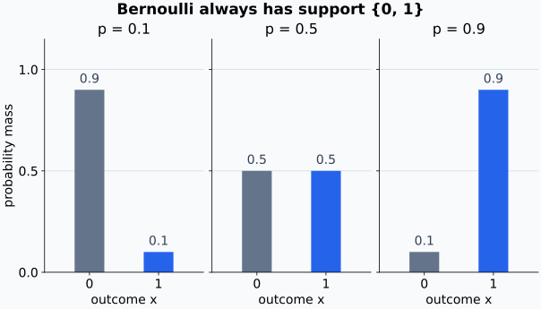
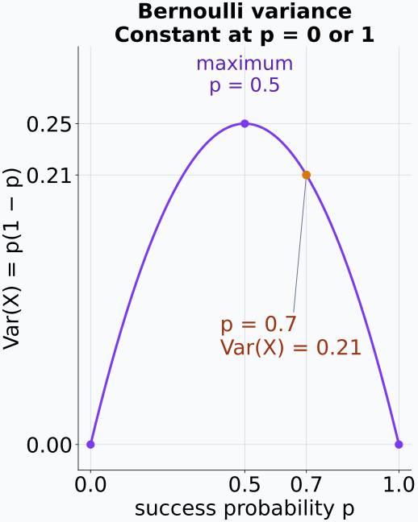
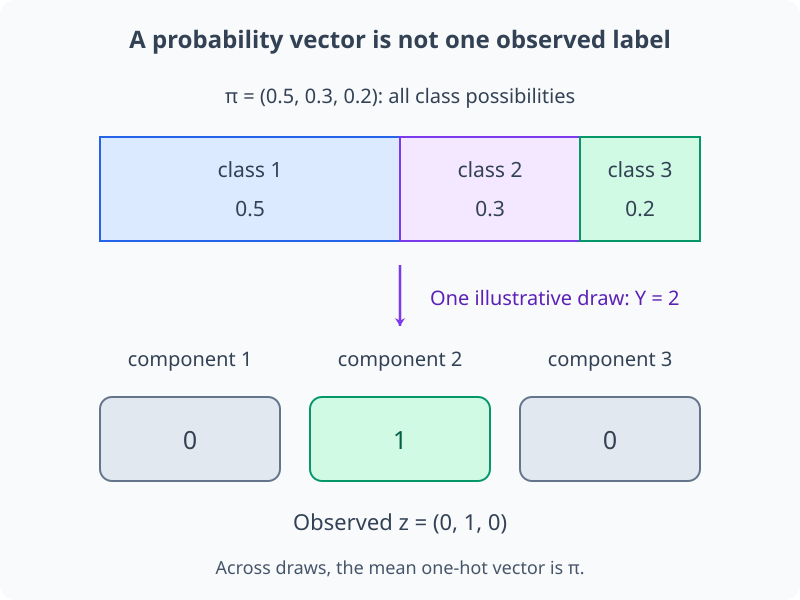
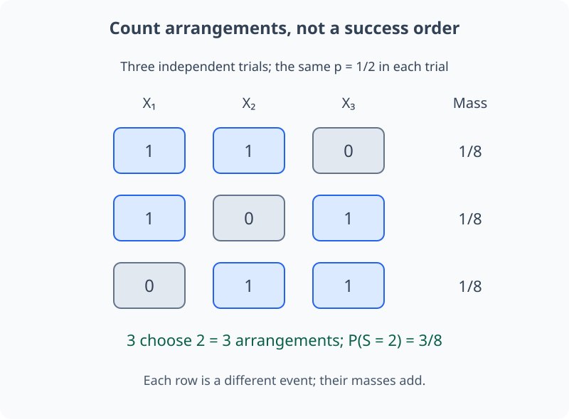
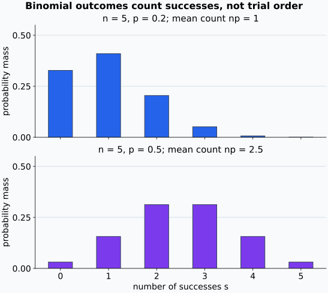
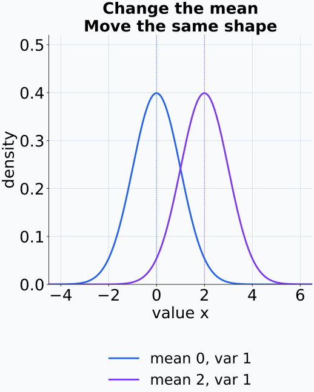
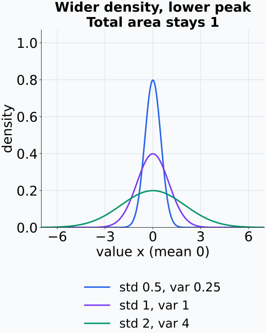
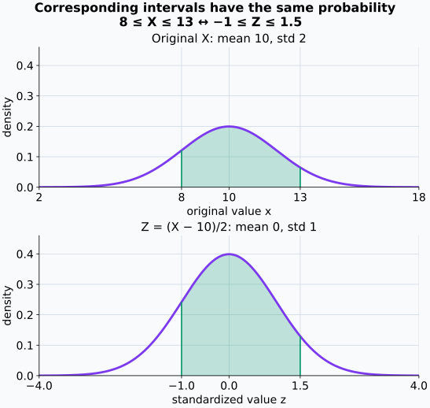
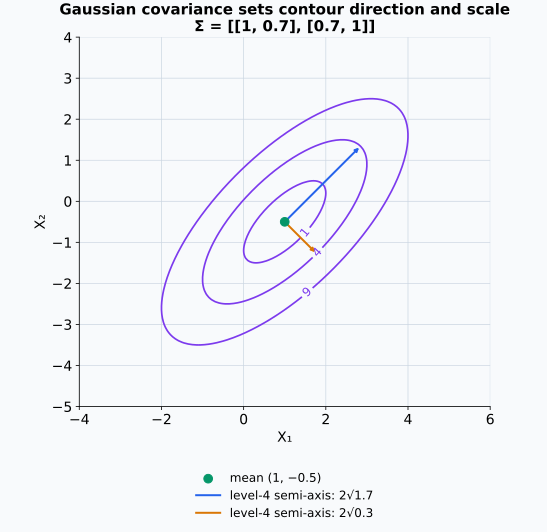

# M04-05. 주요 분포

## 이 단원이 필요한 이유

분포족은 가능한 값의 형태와 확률 규칙을 묶어 이름을 붙인다. binary label에는 Bernoulli 분포, 여러 class 중 하나를 고르는 label에는 categorical 분포, 연속 측정값의 오차에는 Gaussian 분포를 자주 사용한다. 분포 이름을 정하면 support, 파라미터, 평균과 분산을 같은 규칙으로 계산할 수 있다.

신경망의 sigmoid나 softmax 출력은 조건부분포의 파라미터로 읽을 수 있다. 회귀모델이 평균과 분산을 출력하면 Gaussian 조건부분포를 정의할 수 있다. 어떤 분포를 택했는지는 모델이 데이터에 둔 가정이므로 support와 의존 조건을 확인해야 한다.

## 학습 목표

이 단원을 마치면 다음을 할 수 있다.

- Bernoulli, categorical, binomial과 Gaussian 분포의 support와 파라미터를 설명할 수 있다.
- 각 분포의 PMF 또는 PDF를 읽고 작은 확률을 계산할 수 있다.
- Bernoulli와 binomial의 기댓값·분산을 계산할 수 있다.
- categorical 확률 vector와 one-hot 관측값을 구분할 수 있다.
- Gaussian 분포를 표준화하고 구간확률 표기를 읽을 수 있다.
- 예측 대상의 support에 맞는 분포족을 고를 수 있다.
- 분포 가정이 데이터나 representation에 대해 허용하는 주장을 제한할 수 있다.

## 선수지식 확인

- 선수 단원: [M00-05 거듭제곱과 로그](../M00/M00-05-exponents-logarithms.md)
- 선수 단원: [M04-04 기댓값, 분산과 공분산](M04-04-expectation-variance-covariance.md)
- 확인 질문: PMF와 PDF를 구분하고 합이나 적분으로 확률을 계산할 수 있는가?
- 확인 질문: 기댓값과 분산의 정의를 사용할 수 있는가?

## 기호와 용어

| 표기·용어 | Common spoken reading | 의미 | support·조건 |
|---|---|---|---|
| $X\sim\operatorname{Bernoulli}(p)$ | `X follows a Bernoulli distribution with parameter p` | 한 번의 binary 시행 | $X\in\{0,1\}$, $0\le p\le1$ |
| $Y\sim\operatorname{Categorical}(\boldsymbol\pi)$ | `Y follows a categorical distribution with parameter pi` | $K$개 범주 중 하나를 고르는 분포 | $Y\in\{1,\ldots,K\}$ |
| $S\sim\operatorname{Binomial}(n,p)$ | `S follows a binomial distribution with parameters n and p` | 독립 Bernoulli 시행 $n$번의 성공 횟수 | $S\in\{0,\ldots,n\}$ |
| $X\sim\mathcal N(\mu,\sigma^2)$ | `X is normally distributed with mean mu and variance sigma squared` | 종 모양의 연속분포 | $X\in\mathbb R$, $\sigma>0$ |
| $\boldsymbol\pi$ | `pi` | categorical class 확률 | $\pi_k\ge0$, $\sum_k\pi_k=1$ |
| $\binom ns$ | `n choose s` | $n$개 위치에서 성공 $s$개를 고르는 경우의 수 | $0\le s\le n$ |

## 핵심 개념 1. Bernoulli 분포는 한 번의 binary 결과를 나타낸다

$X\sim\operatorname{Bernoulli}(p)$이면

\[
P(X=1)=p,
\qquad
P(X=0)=1-p.
\]

두 경우를 한 식으로 쓰면

\[
p_X(x)=p^x(1-p)^{1-x},
\qquad x\in\{0,1\}
\]

이다. $x=1$을 넣으면 $p$, $x=0$을 넣으면 $1-p$가 된다.

이 거듭제곱 표현은 $0<p<1$에서 두 경우를 한 번에 읽는 식이다. 경계값 $p=0$과 $p=1$에서는 $0^0$을 계산하는 대신 처음의 두 확률 $p,1-p$를 사용한다. 각각 항상 0, 항상 1을 내는 분포이며, 두 경우 모두 분산은 0이다.

기댓값과 분산은

\[
\mathbb E[X]=p,
\qquad
\operatorname{Var}(X)=p(1-p)
\]

이다. $X^2=X$이므로 $\mathbb E[X^2]=p$이고 $p-p^2=p(1-p)$을 얻는다. 사건의 indicator도 Bernoulli 확률변수이다.

성공확률을 바꾸어도 가능한 값은 0과 1뿐이며, 바뀌는 것은 그 두 값에 배정한 질량이다.

<figure class="lesson-figure lesson-figure--wide" markdown="1">

<figcaption>왼쪽과 오른쪽 막대의 합은 항상 1이다. 같은 두 값 위에서 확률 질량이 이동하는 것이지, 파라미터 p가 새로운 관측값을 만드는 것은 아니다.</figcaption>
</figure>

분산은 성공확률의 크기와 같은 방향으로만 늘어나지 않는다. 0과 1 중 하나가 거의 확정되면 관측값의 퍼짐도 작아진다.

<figure class="lesson-figure" markdown="1">

<figcaption>곡선 양 끝은 항상 같은 값만 나오는 분포다. 가운데에서는 두 값이 같은 확률을 가져 퍼짐이 가장 크며, 예제 1의 p=0.7에서는 분산이 0.21이다.</figcaption>
</figure>

## 핵심 개념 2. categorical 분포는 여러 범주 중 하나를 고른다

$Y\sim\operatorname{Categorical}(\boldsymbol\pi)$이고 $K$개 class가 있으면

\[
P(Y=k)=\pi_k,
\qquad
\pi_k\ge0,
\qquad
\sum_{k=1}^{K}\pi_k=1.
\]

$Y$의 관측값은 class index $k$로 기록할 수 있다. one-hot vector $\mathbf Z\in\mathbb R^K$로 기록하면 관측 class 위치만 1이고 나머지는 0이다. 이때

\[
\mathbb E[\mathbf Z]=\boldsymbol\pi.
\]

확률 vector $\boldsymbol\pi$와 one-hot 관측값 $\mathbf z$는 역할이 다르다. 전자는 가능한 class 전체에 확률을 배정하고 후자는 한 시행에서 나온 class를 표시한다.

one-hot의 $k$번째 성분 $Z_k$는 사건 $\{Y=k\}$의 indicator다. 앞 단원의 indicator 기댓값에 따라 $\mathbb E[Z_k]=P(Y=k)=\pi_k$이며, 성분마다 모으면 위 평균벡터 식이 된다. 한 관측에서는 성분 하나만 1이어야 하지만, 평균벡터에서는 여러 성분이 양수일 수 있다. 이 성분들은 각 class가 나올 비율을 나타낸다.

예제 2의 확률 vector와 class 2 관측을 나누어 보면 분포 파라미터와 기록값이 다른 역할임을 확인할 수 있다.

<figure class="lesson-figure lesson-figure--wide" markdown="1">

<figcaption>위 막대는 모든 가능성의 확률을 나타내지만 아래 vector는 한 시행에서 관측한 class만 표시한다. 여러 관측의 one-hot 평균을 생각할 때에야 각 성분의 기대 비율이 확률 vector와 연결된다.</figcaption>
</figure>

## 핵심 개념 3. binomial 분포는 Bernoulli 성공 횟수를 센다

$X_1,\ldots,X_n$이 같은 성공확률 $p$를 가진 독립 Bernoulli 확률변수이고

\[
S=\sum_{i=1}^{n}X_i
\]

라 하자. 그러면 $S\sim\operatorname{Binomial}(n,p)$이고

\[
P(S=s)
=\binom ns p^s(1-p)^{n-s},
\qquad s=0,1,\ldots,n
\]

이다. $p^s(1-p)^{n-s}$는 특정한 성공·실패 배열 하나의 확률이고 $\binom ns$는 성공 위치를 고르는 배열 수이다.

이 거듭제곱 계산은 $0<p<1$인 경우부터 읽는다. 경계값에서는 $p=0$이면 $S=0$, $p=1$이면 $S=n$인 사건에 확률 1을 배정한다.

각 시행이 독립이므로 배열의 확률은 시행별 성공확률 또는 실패확률을 곱한 값이다. 같은 $p$를 쓰면 성공이 $s$개인 배열들은 위치와 관계없이 모두 $p^s(1-p)^{n-s}$를 가진다. 서로 다른 배열은 겹치지 않는 사건이므로 같은 확률을 배열 수만큼 더한다.

$s\ge1$일 때 성공 위치 $s$개를 순서 있게 고르면 $n(n-1)\cdots(n-s+1)$가지다. 같은 위치 집합을 나열하는 순서가 $s(s-1)\cdots1$개이므로 이 수로 나누면

\[
\binom ns=\frac{n(n-1)\cdots(n-s+1)}{s(s-1)\cdots1}
\]

이다. $s=0$이면 성공 위치를 하나도 고르지 않는 배열이 하나이므로 $\binom n0=1$이다. 예제 3에서는 두 성공 위치를 순서 있게 고르는 경우가 $3\cdot2$개이고, 순서만 다른 두 나열을 하나로 세어 $\binom32=3$을 얻는다.

기댓값의 선형성과 독립을 사용하면

\[
\mathbb E[S]=np,
\qquad
\operatorname{Var}(S)=np(1-p)
\]

이다. 독립이 없으면 성공 횟수의 분산에 시행 사이 공분산 항이 들어간다.

평균은 $\mathbb E[S]=\sum_i\mathbb E[X_i]=np$이므로 같은 성공확률만 있으면 독립 없이도 계산된다. 분산을 $n$개의 $p(1-p)$로 더할 때는 독립을 사용해 서로 다른 시행의 공분산을 없앤다. 평균의 선형성만으로 binomial 분포 전체나 위 분산식을 얻을 수는 없다.

예제 3에서는 성공의 두 위치를 고르면 배열 하나가 정해진다. 같은 두 위치를 다른 순서로 나열했다고 새 배열이 되는 것은 아니다.

<figure class="lesson-figure lesson-figure--wide" markdown="1">

<figcaption>각 행은 두 성공 위치가 다른 배열이다. 같은 성공확률과 독립을 가정했으므로 세 행의 확률이 같고, 서로 겹치지 않아 그대로 더할 수 있다.</figcaption>
</figure>

성공 횟수를 기록하면 관측 가능한 값은 시행 수까지의 정수가 된다. 같은 다섯 시행이라도 성공확률이 달라지면 횟수의 분포 모양은 달라진다.

<figure class="lesson-figure lesson-figure--wide" markdown="1">

<figcaption>가로축은 성공의 순서가 아니라 횟수다. 작은 p에서는 낮은 횟수에 질량이 모이고, p=0.5에서는 다섯 시행의 가운데 횟수들에 대칭적으로 모인다.</figcaption>
</figure>

## 핵심 개념 4. Gaussian 분포는 평균과 분산으로 위치와 scale을 정한다

$X\sim\mathcal N(\mu,\sigma^2)$의 PDF는

\[
f_X(x)
=\frac{1}{\sqrt{2\pi\sigma^2}}
\exp\left(-\frac{(x-\mu)^2}{2\sigma^2}\right)
\]

이다. 파라미터 $\mu$는 평균이며 $\sigma^2$은 분산이다.

\[
\mathbb E[X]=\mu,
\qquad
\operatorname{Var}(X)=\sigma^2.
\]

밀도는 $\mu$를 중심으로 대칭이고 $\sigma$가 커지면 더 넓게 퍼진다. Gaussian은 연속분포이므로 한 점의 확률 $P(X=x)$는 0이며 구간확률을 적분해 계산한다.

지수부에서는 평균에서의 거리 $x-\mu$를 $\sigma$로 나눈 뒤 제곱한다. 평균에서 표준편차 한 배만큼 떨어진 $x=\mu\pm\sigma$에서는 지수가 두 방향 모두 $-1/2$이다. 따라서 $\mu$는 밀도의 중심을 옮기고, $\sigma$는 같은 상대 위치에 도달하는 거리의 단위를 정한다. $\sigma$가 커질 때 앞의 계수 $1/(\sqrt{2\pi}\sigma)$는 작아져 밀도를 넓히면서 전체 면적 1을 유지한다.

분산을 고정하고 평균만 바꾸면 같은 곡선이 좌우로 이동한다.

<figure class="lesson-figure" markdown="1">

<figcaption>두 곡선은 폭과 최대 높이가 같다. 평균을 바꾸면 높은 확률 밀도가 모이는 위치만 옮겨진다.</figcaption>
</figure>

평균을 고정하고 표준편차를 바꾸면 폭과 최대 높이가 함께 바뀐다.

<figure class="lesson-figure" markdown="1">

<figcaption>넓은 곡선은 낮아지고 좁은 곡선은 높아져 전체 면적을 1로 유지한다. 범례에서 표준편차와 그 제곱인 분산을 구분해야 한다.</figcaption>
</figure>

## 핵심 개념 5. 표준화는 Gaussian을 표준정규분포로 바꾼다

$X\sim\mathcal N(\mu,\sigma^2)$이고 $\sigma>0$이면

\[
Z=\frac{X-\mu}{\sigma}
\]

는

\[
Z\sim\mathcal N(0,1)
\]

을 따른다. 관측값 $x$의 표준점수(z-score)

\[
z=\frac{x-\mu}{\sigma}
\]

는 $x$가 평균에서 표준편차 몇 배만큼 떨어졌는지 나타낸다. 표준화는 단위를 제거하지만 원래 분포가 Gaussian이라는 사실을 새로 만들지는 않는다.

기댓값의 선형성과 분산의 배율식으로 $\mathbb E[Z]=(\mu-\mu)/\sigma=0$, $\operatorname{Var}(Z)=\sigma^2/\sigma^2=1$이다. 이 두 계산은 유한한 평균과 양의 분산을 가진 다른 분포에도 적용되지만, 표준화한 분포가 Gaussian인 것은 원래 $X$가 Gaussian이었기 때문이다.

밀도에서도 같은 변환을 확인할 수 있다. $x=\mu+\sigma z$로 바꾸면 원래 구간의 폭은 표준화한 구간 폭의 $\sigma$배다. 대응하는 두 구간의 확률이 같도록 밀도에 이 폭 배율을 곱하면

\[
f_Z(z)=\sigma f_X(\mu+\sigma z)
=\frac{1}{\sqrt{2\pi}}\exp\left(-\frac{z^2}{2}\right)
\]

이 된다. 원래 Gaussian PDF에서 평균 이동과 양의 scale이 소거되어 표준정규 PDF를 얻은 것이다.

$\sigma>0$이므로 부등식의 방향을 유지한 채 구간도 같은 규칙으로 바꾼다.

\[
P(a\le X\le b)
=P\left(\frac{a-\mu}{\sigma}\le Z\le\frac{b-\mu}{\sigma}\right).
\]

따라서 표준정규 CDF $F_Z$에서 두 끝점의 누적확률을 빼면 원래 구간확률을 얻는다. Gaussian의 점확률은 0이므로 여기서는 끝점을 포함하는지에 따라 확률이 바뀌지 않는다. 예제 4의 $z=1.5$도 확률 자체가 아니라 CDF에 넣을 위치다.

예제 4의 분포에서 구간 $[8,13]$을 함께 옮기면 값의 단위는 달라지지만 대응 구간의 확률은 유지된다.

<figure class="lesson-figure lesson-figure--wide" markdown="1">

<figcaption>아래 가로축은 원래 값이 아니라 평균에서 표준편차 몇 배 떨어졌는지를 나타낸다. 구간 폭은 절반이 되지만 밀도 높이는 두 배가 되어 색칠한 확률 넓이는 같다.</figcaption>
</figure>

## 핵심 개념 6. 다변량 Gaussian은 평균벡터와 covariance matrix를 사용한다

$d$차원 확률벡터 $\mathbf X$에 대해

\[
\mathbf X\sim\mathcal N(\boldsymbol\mu,\mathbf\Sigma)
\]

라고 쓰면 $\boldsymbol\mu\in\mathbb R^d$는 평균벡터이고 $\mathbf\Sigma\in\mathbb R^{d\times d}$는 covariance matrix이다. $\mathbf\Sigma$가 positive definite일 때 PDF는

\[
f_{\mathbf X}(\mathbf x)
=\frac{1}{(2\pi)^{d/2}|\mathbf\Sigma|^{1/2}}
\exp\left(
-\frac12(\mathbf x-\boldsymbol\mu)^\top
\mathbf\Sigma^{-1}
(\mathbf x-\boldsymbol\mu)
\right)
\]

이다. quadratic form이 같은 점들은 같은 밀도를 가지며 covariance가 등밀도 곡면의 방향과 scale을 정한다.

이 식에서 $|\mathbf\Sigma|$는 covariance matrix의 determinant이며 positive definite 조건에서 양수다. 이 조건은 모든 비영 방향의 분산이 양수이고 역행렬도 존재함을 뜻한다. $d=1$이면 $\mathbf\Sigma=[\sigma^2]$이므로 determinant와 역행렬 항이 각각 $\sigma^2$, $1/\sigma^2$가 되어 앞의 일변량 PDF로 돌아간다.

공분산의 직교 고유기저에서 $\mathbf\Sigma=\mathbf Q\boldsymbol\Lambda\mathbf Q^\top$이고 $\boldsymbol\Lambda$의 대각 원소를 $\lambda_i>0$이라 하자. 중심화한 좌표를 $\mathbf z=\mathbf Q^\top(\mathbf x-\boldsymbol\mu)$로 바꾸면 지수의 quadratic form은

\[
(\mathbf x-\boldsymbol\mu)^\top\mathbf\Sigma^{-1}(\mathbf x-\boldsymbol\mu)
=\sum_{i=1}^{d}\frac{z_i^2}{\lambda_i}
\]

이다. 각 고유방향의 거리를 그 방향의 표준편차 $\sqrt{\lambda_i}$로 나눈 뒤 제곱해 더한 값이다. 이 합이 같은 점들이 등밀도 곡면을 이루므로, 고유벡터는 곡면의 축 방향을 정하고 고유값은 축별 퍼짐을 정한다.

평균과 covariance가 주어졌다고 모든 분포가 Gaussian이 되는 것은 아니다. 다변량 Gaussian이라는 가정을 추가했을 때 두 파라미터가 분포를 정한다.

Gaussian을 가정한 다음에야 covariance의 방향과 scale을 등밀도 타원으로 읽을 수 있다. 아래 곡선의 숫자는 본문의 quadratic form 값이다.

<figure class="lesson-figure lesson-figure--wide" markdown="1">

<figcaption>같은 숫자의 곡선 위에서는 지수부가 같아 밀도도 같다. 두 화살표는 값 4인 타원의 고유방향 반축이며, 각 길이는 해당 방향 표준편차의 두 배다. 이는 Gaussian 모형의 구조이지 임의의 activation 분포 모양에 대한 결론은 아니다.</figcaption>
</figure>

## 핵심 개념 7. 분포 선택은 support와 생성 가정을 포함한다

binary label $Y\in\{0,1\}$에는 Bernoulli 조건부분포, $K$개 class 중 하나에는 categorical 조건부분포가 자연스럽다. 실수값 회귀 target에는 Gaussian 조건부분포를 사용할 수 있지만, 오차의 대칭성과 tail에 대한 가정도 함께 들어간다.

분포족은 다음 질문으로 점검한다.

- 가능한 값의 집합이 target의 support와 맞는가?
- 독립·동일한 성공확률·Gaussian 오차 같은 가정이 필요한가?
- 모델이 고정된 분산을 쓰는가, 입력별 분산도 예측하는가?
- 극단값과 여러 mode를 분포족이 표현할 수 있는가?

softmax vector는 categorical parameter를 만들고 sigmoid scalar는 Bernoulli parameter를 만들 수 있다. 출력 형태가 해당 분포가 데이터에 잘 맞는다는 증거까지 제공하지는 않는다.

## 예제 1. Bernoulli 평균과 분산

### 문제

$X\sim\operatorname{Bernoulli}(0.7)$이다. 두 가능한 값의 확률, 기댓값과 분산을 구한다.

### 풀이

\[
P(X=1)=0.7,
\qquad
P(X=0)=0.3.
\]

따라서

\[
\mathbb E[X]=0.7
\]

이고

\[
\operatorname{Var}(X)
=0.7(1-0.7)
=0.21
\]

이다.

### 결과의 의미

0과 1 indicator의 평균은 성공확률과 같다. 분산은 $p$가 0이나 1에 가까울수록 작아진다.

## 예제 2. categorical 사건의 확률

$Y\sim\operatorname{Categorical}(0.5,0.3,0.2)$라 하자. $Y$가 class 1 또는 class 3일 확률은 상호배반 class의 확률을 더해

\[
P(Y\in\{1,3\})=0.5+0.2=0.7
\]

이다. 한 관측값이 class 2라면 one-hot vector는 $(0,1,0)^\top$이다.

## 예제 3. binomial 확률 계산

$S\sim\operatorname{Binomial}(3,0.5)$에서 성공이 정확히 두 번일 확률은

\[
P(S=2)
=\binom32(0.5)^2(0.5)^1
=3\cdot\frac18
=\frac38
\]

이다. 가능한 성공 위치는 $110,101,011$ 세 가지이다.

## 예제 4. Gaussian 관측값 표준화

$X\sim\mathcal N(10,4)$이면 $\mu=10$, $\sigma=2$이다. 관측값 $x=13$의 z-score는

\[
z=\frac{13-10}{2}=1.5
\]

이다. $13$은 평균보다 표준편차 $1.5$배만큼 큰 위치에 있다. 이 값만으로 tail probability를 얻으려면 표준정규 CDF를 추가로 계산해야 한다.

## 예제 5. 신경망 출력과 분포 파라미터

binary classifier가 입력 $x$에 sigmoid 출력 $p_\theta(x)=0.8$을 냈다면

\[
Y\mid X=x\sim\operatorname{Bernoulli}(0.8)
\]

로 해석할 수 있다. 세 class softmax 출력이 $(0.2,0.5,0.3)$이면

\[
Y\mid X=x\sim\operatorname{Categorical}(0.2,0.5,0.3)
\]

이다. 이 식들은 모델이 정한 조건부분포를 나타낸다.

## 흔한 오해

### 오해 1. Bernoulli와 binomial은 같은 확률변수이다

Bernoulli는 한 번의 binary 결과를 나타낸다. binomial은 같은 성공확률을 가진 독립 Bernoulli 시행 여러 번의 성공 횟수를 센다.

### 오해 2. categorical 확률 vector는 one-hot label이다

$\boldsymbol\pi$는 class 전체에 확률을 배정한다. one-hot vector는 한 시행에서 관측한 class 하나를 표시한다.

### 오해 3. Gaussian의 둘째 파라미터는 표준편차이다

$\mathcal N(\mu,\sigma^2)$ 표기에서 둘째 파라미터는 분산이다. library가 scale로 $\sigma$를 받는지 variance로 $\sigma^2$을 받는지는 API를 확인해야 한다.

### 오해 4. 평균과 분산을 알면 분포가 Gaussian이다

서로 다른 분포가 같은 평균과 분산을 가질 수 있다. Gaussian이라는 분포족 가정이 있어야 $\mu$와 $\sigma^2$이 분포를 정한다.

### 오해 5. activation histogram이 종 모양이면 Gaussian 가정이 증명된다

유한 sample의 histogram 모양은 bin 폭과 sample 크기에 영향을 받는다. Gaussian 적합도를 평가하려면 tail, skewness와 독립된 sample에서의 적합을 함께 확인해야 한다.

## 연습문제

### 1. Bernoulli 계산

$X\sim\operatorname{Bernoulli}(0.2)$이다. $P(X=0)$, $\mathbb E[X]$와 $\operatorname{Var}(X)$를 구하라.

해설 보기

\[
P(X=0)=1-0.2=0.8,
\quad
\mathbb E[X]=0.2,
\quad
\operatorname{Var}(X)=0.2\cdot0.8=0.16.
\]

### 2. categorical 확률

$Y\sim\operatorname{Categorical}(0.1,0.4,0.3,0.2)$이다. $P(Y\ge3)$을 구하고 $Y=4$의 one-hot vector를 쓰라.

해설 보기

\[
P(Y\ge3)=P(Y=3)+P(Y=4)=0.3+0.2=0.5.
\]

$Y=4$의 one-hot vector는 $(0,0,0,1)^\top$이다.

### 3. binomial 계산

$S\sim\operatorname{Binomial}(4,0.25)$이다. $P(S=1)$을 구하라.

해설 보기

\[
P(S=1)
=\binom41(0.25)^1(0.75)^3
=4\cdot0.25\cdot0.421875
=0.421875.
\]

### 4. binomial 평균과 분산

$S\sim\operatorname{Binomial}(20,0.3)$이다. $\mathbb E[S]$와 $\operatorname{Var}(S)$를 구하라.

해설 보기

\[
\mathbb E[S]=20\cdot0.3=6,
\]

\[
\operatorname{Var}(S)=20\cdot0.3\cdot0.7=4.2.
\]

### 5. Gaussian 표준화

$X\sim\mathcal N(50,100)$이다. $x=65$의 z-score를 구하라.

해설 보기

분산이 100이므로 표준편차는 $\sigma=10$이다. 따라서

\[
z=\frac{65-50}{10}=1.5.
\]

### 6. 분포 선택

각 입력에서 binary 정답 여부, 다섯 topic 중 하나인 label, 실수값 측정오차를 모델링할 분포족을 각각 고르고 support를 설명하라.

해설 보기

binary 정답 여부에는 $\{0,1\}$을 support로 갖는 Bernoulli 분포를 쓸 수 있다. 다섯 topic label에는 $\{1,\ldots,5\}$를 support로 갖는 categorical 분포가 맞는다. 실수값 측정오차에는 $\mathbb R$을 support로 갖는 Gaussian 분포를 선택할 수 있으나 대칭성과 tail 가정을 데이터로 점검해야 한다.

### 7. 모델 주장 비판

회귀모델이 $Y\mid X=x\sim\mathcal N(\mu_\theta(x),\sigma_\theta^2(x))$를 출력한다. “이 모델은 실제 조건부분포를 정확히 안다”라는 결론을 평가하라.

해설 보기

식은 모델이 Gaussian 조건부분포를 사용한다는 사실을 보여 준다. 실제 데이터의 조건부분포가 Gaussian인지, 예측 평균과 분산이 맞는지는 독립된 데이터에서 잔차 분포, calibration과 tail 적합을 평가해야 한다. distribution shift가 생기면 같은 적합이 유지된다는 보장도 없다.

## 단원 요약

- Bernoulli 분포는 한 번의 binary 결과를 파라미터 $p$로 나타낸다.
- categorical 분포는 $K$개 class 확률 vector로 범주 하나를 생성한다.
- binomial 분포는 같은 성공확률을 가진 독립 Bernoulli 시행의 성공 횟수 분포이다.
- Gaussian 분포는 평균 $\mu$와 분산 $\sigma^2$으로 위치와 scale을 정한다.
- 표준화한 Gaussian 확률변수는 표준정규분포를 따른다.
- 다변량 Gaussian은 평균벡터와 covariance matrix를 사용한다.
- 분포족 선택에는 target의 support와 데이터 생성 가정이 들어간다.

## 통과 기준

다음 질문에 자료를 보지 않고 답할 수 있으면 통과한다.

- Bernoulli, categorical, binomial과 Gaussian의 support를 구분할 수 있는가?
- 각 분포의 파라미터와 PMF 또는 PDF를 읽을 수 있는가?
- Bernoulli와 binomial의 평균·분산을 계산할 수 있는가?
- categorical 확률 vector와 one-hot 관측값을 구분할 수 있는가?
- Gaussian 관측값을 표준화할 수 있는가?
- 예측 대상에 맞는 분포족을 고르고 가정을 말할 수 있는가?
- 분포 출력 하나가 허용하는 모델 주장을 제한할 수 있는가?

## 다음 단원

- [M04-06 표본, 모집단과 표본분포](M04-06-samples-populations-sampling-distributions.md)

## 집필자 점검표

- [x] 학습 목표가 관찰 가능한 행동으로 작성됐다.
- [x] 네 분포의 support와 파라미터를 명시했다.
- [x] PMF와 PDF를 구분했다.
- [x] Bernoulli·binomial moment를 계산했다.
- [x] Gaussian 표준화와 다변량 표기를 설명했다.
- [x] 모델 출력과 분포 가정을 연결했다.
- [x] 모든 문제에 해설이 있다.
- [x] 모델 해석 주장의 강도를 구분했다.
- [x] 용어집과 표기 규칙을 따랐다.
- [x] 선수지식 밖의 내용을 몰래 요구하지 않는다.
- [x] 내부 링크와 수식 구분자를 확인했다.
- [x] Common spoken reading이 실제 영어 학술 발화이며 한글 음역이나 기계적 직역을 포함하지 않는다.
