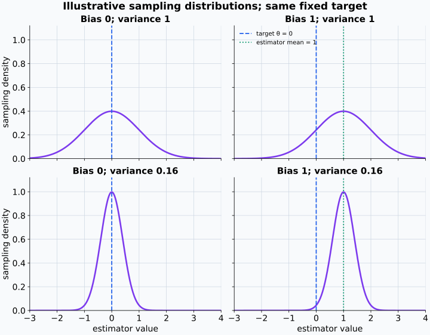
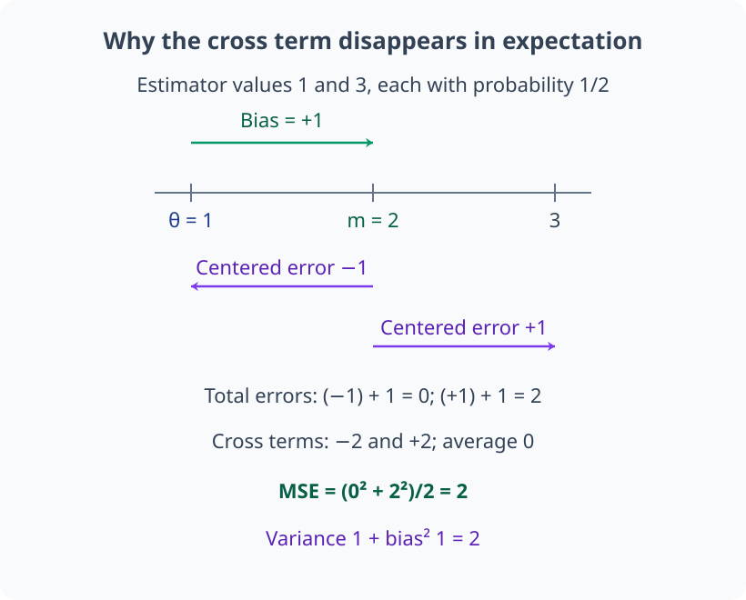
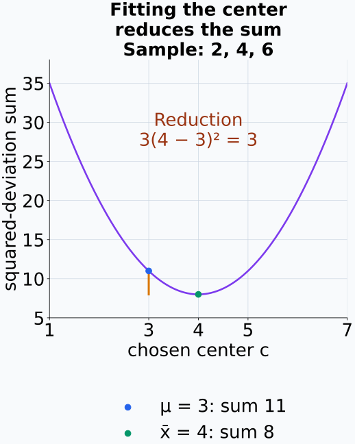
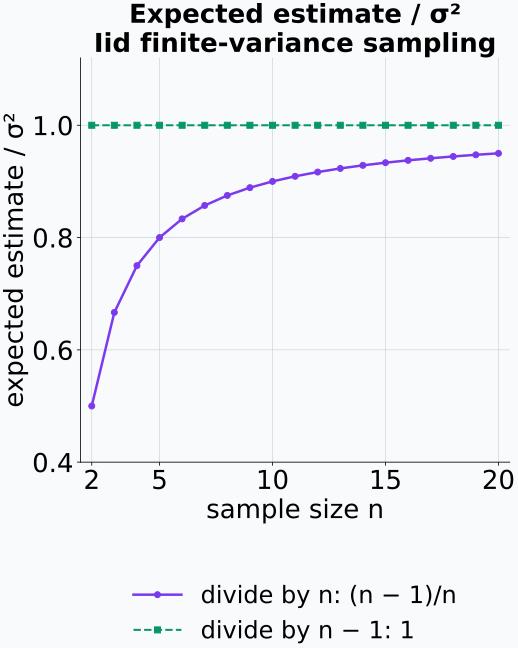
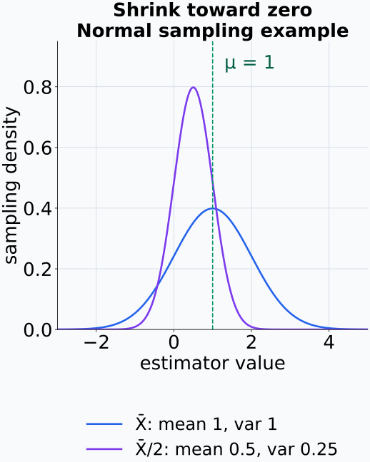
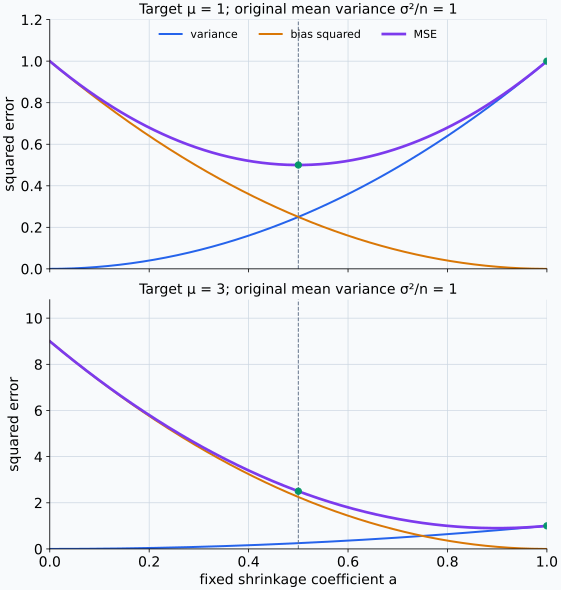
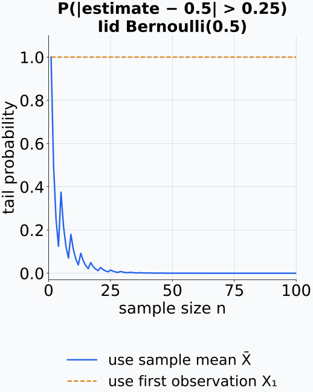

# M04-07. 추정, 편향과 분산

## 이 단원이 필요한 이유

데이터에서 계산한 평균, accuracy와 probe score는 표본이 바뀌면 값도 바뀐다. 연구자는 이 통계량으로 모집단의 모수나 미래 성능을 추정한다. 추정량이 반복 표집에서 목표값 주변 어디에 놓이는지, 얼마나 흔들리는지를 따로 평가해야 한다.

통계적 편향은 추정량의 평균이 목표값에서 벗어난 정도이고, 추정량의 분산은 sample 변화에 따른 흔들림이다. 평균제곱오차는 두 성질을 하나의 오차 기준으로 연결한다. 이 구분은 seed별 결과, 작은 probe dataset과 선택된 checkpoint의 성능을 해석할 때 필요하다.

## 학습 목표

이 단원을 마치면 다음을 할 수 있다.

- 추정량과 관측 추정값을 구분할 수 있다.
- 추정량의 bias와 variance를 sampling distribution에서 계산할 수 있다.
- 평균제곱오차를 variance와 bias 제곱으로 분해할 수 있다.
- 표본평균의 불편성과 분산을 설명할 수 있다.
- 분모 $n$과 $n-1$을 사용한 분산 추정량의 bias를 비교할 수 있다.
- bias를 허용해 MSE를 줄이는 shrinkage 예제를 계산할 수 있다.
- 모델 해석 결과의 estimation target과 selection bias를 점검할 수 있다.

## 선수지식 확인

- 선수 단원: [M04-04 기댓값, 분산과 공분산](M04-04-expectation-variance-covariance.md)
- 선수 단원: [M04-06 표본, 모집단과 표본분포](M04-06-samples-populations-sampling-distributions.md)
- 확인 질문: 모수와 통계량을 구분할 수 있는가?
- 확인 질문: 표본평균의 기댓값과 분산을 계산할 수 있는가?

## 기호와 용어

| 표기·용어 | Common spoken reading | 의미 | 역할 |
|---|---|---|---|
| $\theta$ | `theta` | 추정하려는 모집단 모수 | 고정된 target |
| $\widehat\theta$ | `theta hat` | 확률표본의 함수인 추정량 | random variable |
| $\hat\theta$ | `theta hat` | 관측 sample에서 계산한 추정값 | 고정된 수 |
| $\operatorname{Bias}(\widehat\theta)$ | `the bias of theta hat` | 추정량 평균과 target의 차이 | $\mathbb E[\widehat\theta]-\theta$ |
| $\operatorname{Var}(\widehat\theta)$ | `the variance of theta hat` | repeated sampling에서의 흔들림 | sampling variance |
| $\operatorname{MSE}(\widehat\theta)$ | `the mean squared error of theta hat` | target과 추정량 사이 제곱오차의 평균 | variance와 bias를 함께 반영 |
| consistency | `consistency` | sample size가 커질 때 추정량이 target에 가까워지는 성질 | asymptotic property |

## 핵심 개념 1. 추정량은 규칙이고 추정값은 관측 결과이다

모수 $\theta$를 추정하는 추정량(estimator)은 확률표본의 함수이다.

\[
\widehat\theta=T(X_1,\ldots,X_n).
\]

sample을 뽑기 전에는 $\widehat\theta$가 sampling distribution을 가진다. 관측값 $x_1,\ldots,x_n$을 넣어 얻은

\[
\hat\theta=T(x_1,\ldots,x_n)
\]

는 추정값(estimate)이다. 추정량을 평가하려면 현재 추정값 하나만 보지 않고 가능한 다른 sample에서 이 규칙이 만드는 분포를 살펴야 한다.

추정 target도 식으로 고정해야 한다. test accuracy의 target이 특정 benchmark 유한집합의 평균인지, 앞으로 들어올 입력분포의 정답확률인지에 따라 $\theta$가 달라진다.

## 핵심 개념 2. 편향은 추정량 평균의 체계적 차이이다

추정량의 편향(bias)은

\[
\operatorname{Bias}(\widehat\theta)
=\mathbb E[\widehat\theta]-\theta
\]

이다. 기댓값은 같은 표집 절차를 반복할 때의 sampling distribution에 대해 계산한다.

\[
\mathbb E[\widehat\theta]=\theta
\]

이면 $\widehat\theta$를 불편추정량(unbiased estimator)이라고 한다. 불편성은 한 번 관측한 추정값이 target과 같다는 뜻이 아니다. 반복 표집에서 추정값들의 평균이 target과 같다는 뜻이다.

통계적 bias는 신경망 affine layer의 bias vector와 다른 개념이다. 앞의 것은 추정 규칙의 repeated-sampling 성질이고 뒤의 것은 모델 파라미터이다.

## 핵심 개념 3. 추정량의 분산은 sample 변화에 대한 민감도이다

추정량의 분산은

\[
\operatorname{Var}(\widehat\theta)
=\mathbb E\left[
(\widehat\theta-\mathbb E[\widehat\theta])^2
\right]
\]

이다. 같은 population에서 새 sample을 뽑을 때 추정값이 얼마나 흔들리는지 나타낸다.

두 추정량이 같은 bias를 가지면 variance가 작은 추정량이 더 안정적이다. variance가 작아도 큰 bias가 남을 수 있으므로 안정성만으로 target에 가깝다고 결론 내릴 수 없다.

같은 target을 표시한 축에서 sampling distribution의 중심과 폭을 따로 바꾸면 두 성질을 구별할 수 있다.

<figure class="lesson-figure lesson-figure--wide" markdown="1">

<figcaption>좌우 패널은 중심의 차이, 위아래 패널은 퍼짐의 차이를 보여 준다. 오른쪽 아래처럼 좁게 모여도 target에서 벗어나 있을 수 있다. 이는 추정량 분포의 예시이지 신경망 bias 파라미터 그림이 아니다.</figcaption>
</figure>

## 핵심 개념 4. MSE는 variance와 bias 제곱으로 분해된다

평균제곱오차(mean squared error, MSE)는

\[
\operatorname{MSE}(\widehat\theta)
=\mathbb E\left[(\widehat\theta-\theta)^2\right]
\]

이다. $m=\mathbb E[\widehat\theta]$를 더하고 빼면

\[
\widehat\theta-\theta
=(\widehat\theta-m)+(m-\theta)
\]

이다. 제곱한 뒤 기댓값을 취하면 교차항은 $\mathbb E[\widehat\theta-m]=0$ 때문에 사라진다.

\[
\operatorname{MSE}(\widehat\theta)
=\operatorname{Var}(\widehat\theta)
+\operatorname{Bias}(\widehat\theta)^2.
\]

MSE는 variance와 target에서의 체계적 차이를 한 단위로 비교한다. 불편추정량에서는 bias 항이 0이므로 MSE가 variance와 같다.

제곱 전개의 교차항은 $2(m-\theta)(\widehat\theta-m)$이다. $m-\theta$는 고정값이므로 그 기댓값은 $2(m-\theta)\mathbb E[\widehat\theta-m]=0$이다. 이 소거에는 독립을 가정할 필요가 없다. 남은 첫 제곱항은 추정량 자체의 평균 주변 분산이고, 둘째 제곱항은 그 평균과 target 사이의 거리다. 유한한 이차 모멘트 아래에서 이 두 오차를 더한다.

두 추정값이 같은 확률로 나오는 간단한 경우에서는 중심화 오차와 bias가 한 번의 오차를 어떻게 나누는지 볼 수 있다.

<figure class="lesson-figure lesson-figure--wide" markdown="1">

<figcaption>왼쪽 추정값의 총오차는 0이고 오른쪽은 2다. 교차항의 평균만 0이 되며, 중심 주변의 분산과 bias 제곱은 각각 1로 남아 MSE가 2가 된다.</figcaption>
</figure>

## 핵심 개념 5. 표본평균은 모평균의 불편추정량이다

$X_1,\ldots,X_n$이 평균 $\mu$, 분산 $\sigma^2$을 가진 iid 표본이면

\[
\widehat\mu=\bar X=\frac1n\sum_{i=1}^{n}X_i
\]

로 둔다. 기댓값의 선형성으로

\[
\mathbb E[\widehat\mu]=\mu
\]

이므로 bias는 0이다. 독립을 사용하면

\[
\operatorname{Var}(\widehat\mu)=\frac{\sigma^2}{n}
\]

이다. 따라서

\[
\operatorname{MSE}(\widehat\mu)=\frac{\sigma^2}{n}.
\]

sample size가 커지면 variance와 MSE가 줄어든다. 이 결론은 iid 표집과 finite variance 조건에 의존한다.

## 핵심 개념 6. 표본분산의 $n-1$은 bias를 바로잡는다

앞 절처럼 평균 $\mu$, 유한한 분산 $\sigma^2$을 가진 iid 표본을 사용하고 $n\ge2$라 하자. 모평균 $\mu$를 모르는 상태에서 sample mean을 사용하면

\[
\sum_{i=1}^{n}(X_i-\bar X)^2
=\sum_{i=1}^{n}(X_i-\mu)^2
-n(\bar X-\mu)^2
\]

이다.

이 등식은 $X_i-\mu=(X_i-\bar X)+(\bar X-\mu)$를 제곱해 더하면 얻는다. 교차항의 합은 $2(\bar X-\mu)\sum_i(X_i-\bar X)$인데, sample mean의 정의에 따라 편차의 합이 0이므로 사라진다. 모든 $i$에 공통인 두 번째 편차의 제곱은 각 항에 한 번씩 들어가 $n(\bar X-\mu)^2$이 된다. 따라서 sample mean 주변의 제곱편차 합은 모평균 주변의 제곱편차 합보다 그 항만큼 작다.

한 관측 표본에서 중심을 움직이면 제곱편차 합이 표본평균에서 최소가 되는 것을 확인할 수 있다.

<figure class="lesson-figure" markdown="1">

<figcaption>이 표본에서는 중심을 3에서 4로 맞추며 합이 3만큼 줄어든다. 한 표본의 수치가 불편성을 증명하는 것은 아니며, 다음 기댓값 계산이 같은 표집 규칙의 평균 감소량을 구한다.</figcaption>
</figure>

양변의 기댓값을 취하면

\[
\mathbb E\left[
\sum_{i=1}^{n}(X_i-\bar X)^2
\right]
=n\sigma^2-n\frac{\sigma^2}{n}
=(n-1)\sigma^2.
\]

원래 등식 우변의 첫 합은 모평균 주변의 편차 제곱이며, 각 항의 기댓값이 $\sigma^2$이다. 또 $\bar X$가 $\mu$의 불편추정량이므로 $\mathbb E[(\bar X-\mu)^2]=\operatorname{Var}(\bar X)=\sigma^2/n$이다. 같은 자료에서 중심을 추정해 맞춘 만큼 제곱편차 합의 평균이 줄어든다.

따라서

\[
S^2=\frac{1}{n-1}
\sum_{i=1}^{n}(X_i-\bar X)^2
\]

는 $\sigma^2$의 불편추정량이다. 분모 $n$을 쓴

\[
\widetilde S^2=\frac1n
\sum_{i=1}^{n}(X_i-\bar X)^2
\]

는

\[
\mathbb E[\widetilde S^2]
=\frac{n-1}{n}\sigma^2
\]

이므로 아래쪽 bias를 가진다. 분모 $n-1$이 모든 목적에서 우월하다는 뜻은 아니다. 추정 target과 loss에 따라 다른 estimator가 더 작은 MSE를 가질 수 있다.

두 분모의 차이는 관측값 하나를 정확하게 만드는 교정이 아니라 반복 표집에서 추정량 평균의 교정이다.

<figure class="lesson-figure" markdown="1">

<figcaption>세로축은 한 번 계산한 분산이 아니라 추정량의 기댓값과 모분산의 비율이다. n이 커지면 두 평균의 차이는 작아지지만, 작은 표본에서는 분모 n의 아래쪽 bias가 더 크다.</figcaption>
</figure>

## 핵심 개념 7. shrinkage는 bias를 허용해 variance를 줄일 수 있다

모평균을 추정하는 규칙

\[
\widehat\mu_a=a\bar X,
\qquad 0\le a\le1
\]

을 생각하자. $a$는 관측값과 별도로 정한 상수이며 이 추정량은 0 쪽으로 값을 줄인다. bias와 variance는

\[
\operatorname{Bias}(\widehat\mu_a)
=(a-1)\mu,
\]

\[
\operatorname{Var}(\widehat\mu_a)
=a^2\frac{\sigma^2}{n}
\]

이다. 따라서

\[
\operatorname{MSE}(\widehat\mu_a)
=a^2\frac{\sigma^2}{n}
+(a-1)^2\mu^2.
\]

$a<1$이면 $\mu\ne0$인 경우 bias가 생기고, 양의 sampling variance는 줄어든다. 특정 $\mu,\sigma^2,n$에서는 전체 MSE가 감소할 수 있다. 정규화와 regularization도 추정의 안정성을 높이는 과정에서 이와 비슷한 tradeoff를 만든다.

평균의 선형성으로 $\mathbb E[a\bar X]=a\mu$이므로 target $\mu$를 빼면 bias가 $(a-1)\mu$이다. 고정 배율의 분산은 배율 제곱만큼 변하므로 sampling variance는 $a^2\sigma^2/n$이 된다. 이 두 값을 MSE 분해에 넣은 것이 위 식이다. $a$ 자체를 같은 sample에서 추정했다면 고정 상수의 배율식을 그대로 적용할 수는 없다.

예제의 $a=1/2$에서는 MSE가 $\sigma^2/(4n)+\mu^2/4$이다. 이를 원래 표본평균의 MSE $\sigma^2/n$과 비교하면 $\mu^2<3\sigma^2/n$일 때 더 작다. 따라서 target이 0에서 먼 정도와 현재 평균 추정의 흔들림에 따라 이 shrinkage가 유리한지 달라진다.

예제 2의 모멘트를 가진 Gaussian sampling distribution을 예시로 그리면, 고정 배율 1/2가 폭을 줄이는 동시에 중심을 0 쪽으로 당기는 것을 볼 수 있다.

<figure class="lesson-figure" markdown="1">

<figcaption>더 좁은 분포의 중심은 target보다 0.5 작다. 예제의 MSE 계산 자체는 Gaussian 가정이 필요하지 않으며, 그림은 그 모멘트를 갖는 한 sampling distribution을 선택한 것이다.</figcaption>
</figure>

같은 원래 분산에서도 target이 0에서 얼마나 먼지에 따라 shrinkage의 MSE 손익이 달라진다.

<figure class="lesson-figure lesson-figure--wide" markdown="1">

<figcaption>초록 점은 계수 1/2와 1을 비교한다. 위에서는 MSE가 1에서 0.5로 줄지만, 아래에서는 1에서 2.5로 늘어난다. 분산 감소만으로 개선을 주장할 수 없다.</figcaption>
</figure>

## 핵심 개념 8. 일치성은 sample size가 커질 때의 성질이다

추정량 열 $\widehat\theta_n$이 모든 $\varepsilon>0$에 대해

\[
P\left(
|\widehat\theta_n-\theta|>\varepsilon
\right)\to0
\qquad(n\to\infty)
\]

를 만족하면 $\theta$의 일치추정량(consistent estimator)이라고 한다. sample size가 커질수록 target에서 일정 거리 이상 벗어날 확률이 0에 가까워진다는 뜻이다.

불편성과 일치성은 서로 다른 성질이다. 작은 sample에서 bias가 있는 estimator도 bias와 variance가 $n$에 따라 0으로 가면 consistent할 수 있다. 불편추정량도 variance가 줄지 않으면 consistent하지 않을 수 있다.

고정한 $\varepsilon$ 밖으로 벗어나는 경우에는 제곱오차가 적어도 $\varepsilon^2$만큼 크다. 그 사건의 확률에 이 크기를 곱한 값은 전체 제곱오차 평균보다 클 수 없으므로

\[
P(|\widehat\theta_n-\theta|>\varepsilon)
\le\frac{\operatorname{MSE}(\widehat\theta_n)}{\varepsilon^2}
\]

이다. bias와 variance가 모두 0으로 가면 MSE도 0으로 가고, 각 고정 $\varepsilon>0$에 대한 위 확률도 0으로 간다. 이것이 앞 문장의 일치성을 확인하는 한 방법이다. 반면 앞 단원의 Bernoulli$(0.5)$ 표본에서 첫 관측 $X_1$만 평균 추정값으로 계속 사용하면 불편이지만, 표본 수를 늘려도 $|X_1-0.5|=0.5$다. $\varepsilon=0.25$ 밖으로 벗어날 확률이 1이므로 이 규칙은 일치하지 않는다.

본문의 Bernoulli 반례에서는 target에서 일정 거리 밖에 남는 확률을 표본 수별로 정확하게 계산할 수 있다.

<figure class="lesson-figure" markdown="1">

<figcaption>표본평균은 전체 표본을 사용하지만 첫 관측 규칙은 자료가 늘어도 같은 관측 하나만 사용한다. 파란 곡선의 작은 요철은 유한한 이산 support와 엄격한 부등식에서 생기며, 일치성이 매 n에서 단조 감소를 요구한다는 뜻은 아니다.</figcaption>
</figure>

## 예제 1. 두 추정량의 bias와 MSE 비교하기

### 문제

$\bar X$가 $\mu$의 불편추정량이고 $\operatorname{Var}(\bar X)=\sigma^2/n$이다. $\widehat\mu_{1/2}=\frac12\bar X$의 bias, variance와 MSE를 구한다.

### 풀이

\[
\mathbb E[\widehat\mu_{1/2}]
=\frac12\mathbb E[\bar X]
=\frac12\mu
\]

이므로

\[
\operatorname{Bias}(\widehat\mu_{1/2})
=-\frac12\mu.
\]

분산은

\[
\operatorname{Var}(\widehat\mu_{1/2})
=\frac14\frac{\sigma^2}{n}
\]

이고 MSE는

\[
\operatorname{MSE}(\widehat\mu_{1/2})
=\frac{\sigma^2}{4n}+\frac{\mu^2}{4}
\]

이다.

### 결과의 의미

scale을 절반으로 줄이면 sampling variance가 4분의 1이 되지만 0 쪽으로 bias가 생긴다. MSE 비교에는 $\mu$, $\sigma^2$과 $n$이 모두 필요하다.

## 예제 2. 수치로 shrinkage MSE 비교하기

$\mu=1$, $\sigma^2=4$, $n=4$라 하자. $\bar X$의 MSE는

\[
\frac{\sigma^2}{n}=1
\]

이다. $a=1/2$인 추정량은

\[
\operatorname{Var}(\widehat\mu_{1/2})
=\frac14\cdot1=0.25
\]

이고 bias 제곱도

\[
\left(-\frac12\right)^2=0.25
\]

이다. 총 MSE는 $0.5$이므로 이 parameter setting에서는 shrinkage estimator의 MSE가 더 작다.

## 예제 3. 정확도 추정량

$I_i$를 $i$번째 iid sample의 정답 indicator라 하고 $P(I_i=1)=p$라 하자. 관측 정확도

\[
\widehat p=\frac1n\sum_{i=1}^{n}I_i
\]

는 $p$의 불편추정량이며

\[
\operatorname{Var}(\widehat p)
=\frac{p(1-p)}{n}
\]

이다. class imbalance나 cluster dependence가 있으면 어떤 population accuracy를 target으로 삼는지와 iid 조건을 다시 확인해야 한다.

## 예제 4. checkpoint 선택이 만드는 selection bias

같은 validation set에서 checkpoint 100개를 평가하고 최고 score를 보고하면 noise가 위쪽으로 우연히 큰 checkpoint를 선택할 가능성이 생긴다. 선택에 쓴 validation score는 선택된 checkpoint의 미래 성능을 낙관적으로 추정할 수 있다. 별도 test set에서 한 번 평가하거나 선택 절차 전체를 포함해 repeated sampling을 설계해야 이 bias를 점검할 수 있다.

## 흔한 오해

### 오해 1. 불편추정량은 관측할 때마다 정확하다

불편성은 sampling distribution의 평균에 관한 성질이다. 한 sample의 추정값은 target에서 멀리 떨어질 수 있다.

### 오해 2. variance가 작은 추정량은 target에 가깝다

추정량이 같은 값 주변에 모여도 그 중심이 target에서 벗어날 수 있다. target 오차를 비교하려면 bias와 variance를 함께 봐야 한다.

### 오해 3. bias가 있는 추정량은 사용할 수 없다

작은 bias를 허용해 variance를 크게 줄이면 MSE가 낮아질 수 있다. 어떤 loss와 target을 쓰는지에 따라 비교 결과가 달라진다.

### 오해 4. 큰 sample은 모든 bias를 제거한다

sample size 증가는 sampling variance를 줄일 수 있다. selection bias, measurement bias와 target population 불일치는 표집 절차나 측정 설계를 바꿔야 줄일 수 있다.

### 오해 5. seed 여러 개의 평균은 데이터 uncertainty까지 나타낸다

seed variation은 초기화와 학습 randomness에 따른 변동을 측정한다. 입력 sample, annotation과 model family에서 오는 변동은 별도 sampling level을 둬야 한다.

## 연습문제

### 1. 추정량과 추정값

$\widehat\mu=n^{-1}\sum_iX_i$와 관측 데이터에서 얻은 $\hat\mu=2.7$의 역할을 구분해 설명하라.

해설 보기

$\widehat\mu$는 가능한 sample마다 값이 달라지는 estimator이며 sampling distribution을 가진다. $\hat\mu=2.7$은 한 관측 sample을 estimator에 넣어 계산한 estimate이다.

### 2. bias 계산

$\mathbb E[\widehat\theta]=5.4$이고 target $\theta=5$이다. bias를 구하고 방향을 설명하라.

해설 보기

\[
\operatorname{Bias}(\widehat\theta)=5.4-5=0.4.
\]

반복 표집에서 추정량의 평균이 target보다 $0.4$ 큰 위쪽 bias이다.

### 3. MSE 분해

$\operatorname{Var}(\widehat\theta)=0.9$이고 bias가 $-0.2$이다. MSE를 구하라.

해설 보기

\[
\operatorname{MSE}(\widehat\theta)
=0.9+(-0.2)^2
=0.94.
\]

MSE에는 bias의 제곱이 들어가므로 부호가 사라진다.

### 4. 표본평균 비교

모분산이 $16$이다. iid sample size가 4일 때와 64일 때 표본평균의 variance와 standard error를 각각 구하라.

해설 보기

$n=4$이면

\[
\operatorname{Var}(\bar X)=\frac{16}{4}=4,
\qquad
\operatorname{SE}(\bar X)=2.
\]

$n=64$이면

\[
\operatorname{Var}(\bar X)=\frac{16}{64}=0.25,
\qquad
\operatorname{SE}(\bar X)=0.5.
\]

### 5. 분산 추정량의 bias

$n=5$이고 모분산이 $\sigma^2=10$이다. 분모 $n$을 쓰는 $\widetilde S^2$의 기댓값과 bias를 구하라.

해설 보기

\[
\mathbb E[\widetilde S^2]
=\frac{n-1}{n}\sigma^2
=\frac45\cdot10
=8.
\]

bias는 $8-10=-2$이다.

### 6. shrinkage 비교

$\mu=0.5$, $\sigma^2/n=1$일 때 $\bar X$와 $\widehat\mu_{1/2}=\bar X/2$의 MSE를 비교하라.

해설 보기

$\bar X$는 불편이므로 MSE가 1이다. shrinkage estimator의 variance는 $1/4$이고 bias는

\[
\left(\frac12-1\right)0.5=-0.25
\]

이다. 따라서

\[
\operatorname{MSE}(\widehat\mu_{1/2})
=0.25+0.25^2
=0.3125.
\]

이 parameter setting에서는 shrinkage estimator의 MSE가 더 작다.

### 7. 모델 해석 설계 비판

연구자가 probe architecture 30개를 같은 test set에서 비교한 뒤 가장 높은 accuracy 하나만 보고했다. 어떤 bias가 생기며 어떻게 평가 절차를 바꿔야 하는지 설명하라.

해설 보기

test set을 model selection에 반복 사용했으므로 최고 score가 우연한 test noise까지 선택하는 selection bias가 생긴다. architecture 선택에는 training·validation data를 사용하고, 선택을 마친 뒤 접근하지 않았던 test set으로 최종 성능을 평가해야 한다. 여러 seed와 dataset split을 포함한 선택 절차 전체의 변동도 보고할 수 있다.

## 단원 요약

- estimator는 확률표본의 함수이고 estimate는 관측 sample에서 얻은 값이다.
- bias는 estimator 평균과 target의 차이이며 variance는 sample 변화에 따른 흔들림이다.
- MSE는 estimator variance와 bias 제곱의 합이다.
- iid 표본평균은 모평균의 불편추정량이고 variance가 $\sigma^2/n$이다.
- 분모 $n-1$을 쓴 표본분산은 iid 조건에서 모분산의 불편추정량이다.
- shrinkage는 bias를 허용해 variance와 MSE를 줄일 수 있다.
- selection에 사용한 데이터로 최고 결과를 보고하면 성능을 낙관적으로 추정할 수 있다.

## 통과 기준

다음 질문에 자료를 보지 않고 답할 수 있으면 통과한다.

- estimator와 estimate를 구분할 수 있는가?
- sampling distribution에서 bias와 variance를 계산할 수 있는가?
- MSE decomposition을 전개할 수 있는가?
- 표본평균의 bias와 variance를 설명할 수 있는가?
- 표본분산에서 $n-1$을 쓰는 이유를 계산할 수 있는가?
- shrinkage estimator의 bias-variance tradeoff를 계산할 수 있는가?
- selection bias가 생기는 평가 절차를 찾아 수정할 수 있는가?

## 다음 단원

- [M04-08 회귀와 분류](M04-08-regression-classification.md)

## 집필자 점검표

- [x] 학습 목표가 관찰 가능한 행동으로 작성됐다.
- [x] estimator와 estimate를 구분했다.
- [x] bias, variance와 MSE를 정의하고 분해했다.
- [x] 표본평균과 표본분산의 기댓값을 계산했다.
- [x] shrinkage의 bias-variance tradeoff를 수치로 검산했다.
- [x] 일치성과 불편성을 구분했다.
- [x] 모든 문제에 해설이 있다.
- [x] 모델 해석 주장의 강도를 구분했다.
- [x] 용어집과 표기 규칙을 따랐다.
- [x] 선수지식 밖의 내용을 몰래 요구하지 않는다.
- [x] 내부 링크와 수식 구분자를 확인했다.
- [x] Common spoken reading이 실제 영어 학술 발화이며 한글 음역이나 기계적 직역을 포함하지 않는다.
