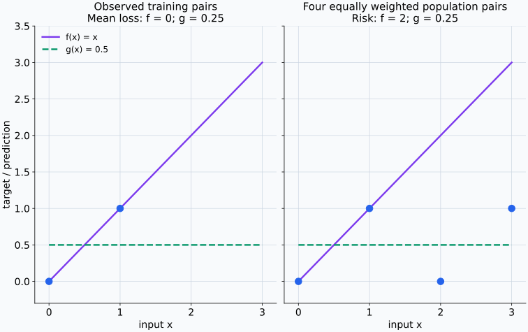
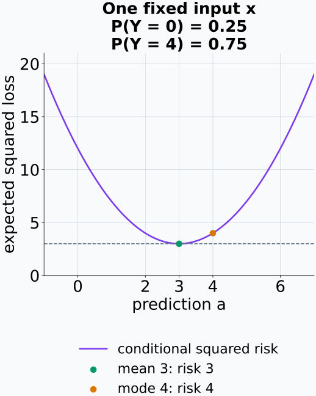
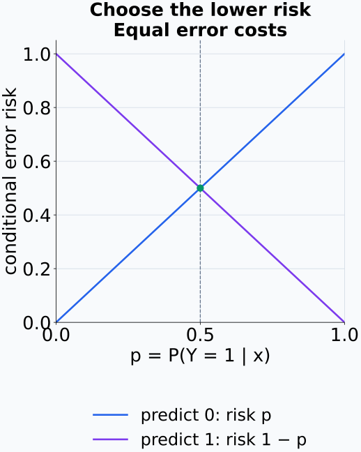
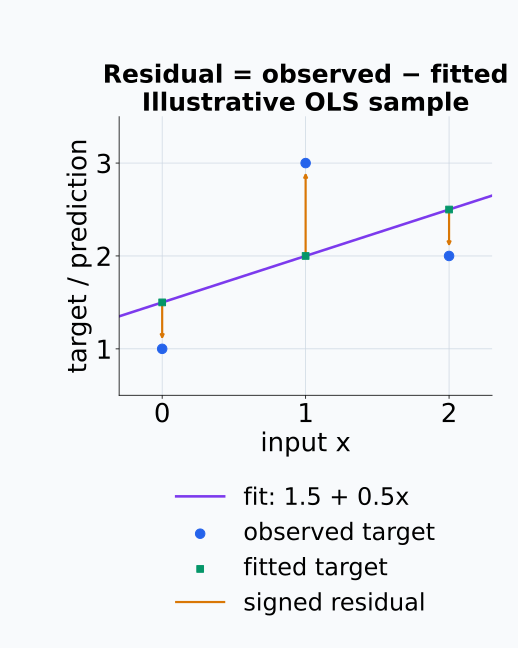
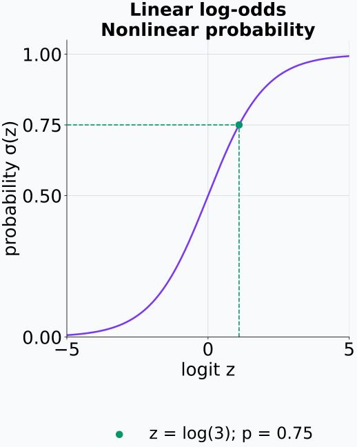
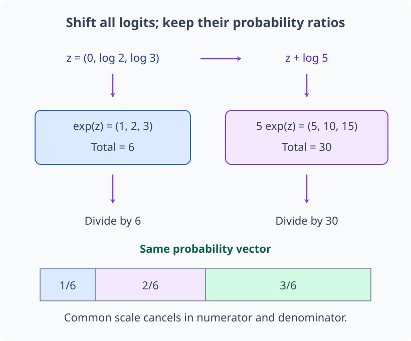
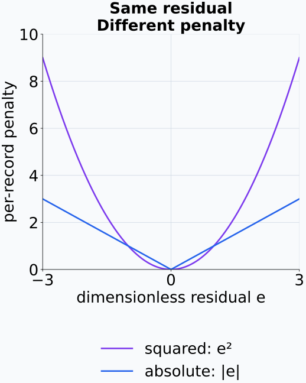
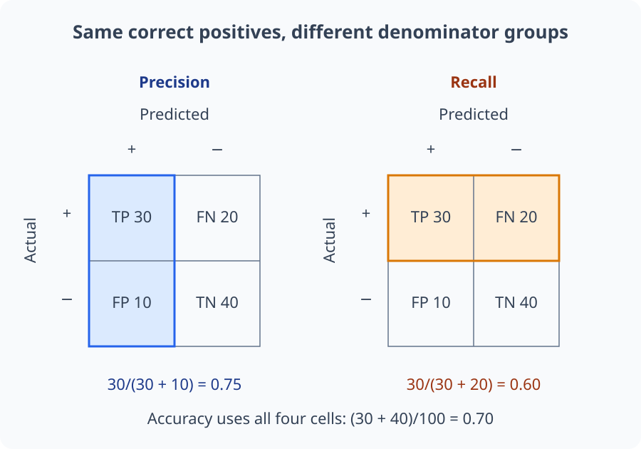
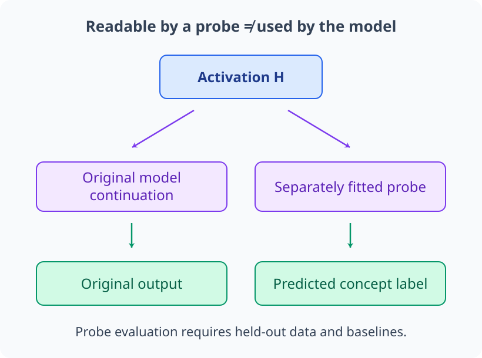

# M04-08. 회귀와 분류

## 이 단원이 필요한 이유

회귀와 분류는 입력 $X$에서 target $Y$를 예측하는 통계 문제이다. 회귀는 수치 target을, 분류는 범주 target이나 그 조건부확률을 예측한다. 모델 구조만 보면 같은 선형층이나 신경망을 쓸 수 있지만 출력 공간, loss와 평가 기준이 달라진다.

모델 해석 연구에서 probe도 회귀나 분류 문제로 구성한다. probe가 높은 score를 냈다는 사실을 해석하려면 무엇을 target으로 삼았는지, 어떤 loss를 최소화했는지와 어떤 data split에서 평가했는지를 알아야 한다.

## 학습 목표

이 단원을 마치면 다음을 할 수 있다.

- 회귀와 분류를 target support와 예측 출력으로 구분할 수 있다.
- population risk와 empirical risk를 수식으로 읽을 수 있다.
- 제곱 loss 아래 최적 회귀함수가 조건부평균임을 설명할 수 있다.
- 0-1 loss 아래 Bayes classifier를 조건부 class 확률로 정할 수 있다.
- 선형회귀, logistic regression과 softmax regression의 출력을 계산할 수 있다.
- 회귀·분류 metric을 작은 표에서 계산하고 class imbalance의 영향을 판단할 수 있다.
- probe 성능이 허용하는 representation 주장의 범위를 제한할 수 있다.

## 선수지식 확인

- 선수 단원: [M02-09 직교기저와 정사영](../M02/M02-09-orthogonal-basis-projection.md)
- 선수 단원: [M04-02 조건부확률과 Bayes 규칙](M04-02-conditional-probability-bayes-rule.md)
- 선수 단원: [M04-05 주요 분포](M04-05-common-distributions.md)
- 선수 단원: [M04-07 추정, 편향과 분산](M04-07-estimation-bias-variance.md)
- 확인 질문: 최소제곱해를 projection으로 설명할 수 있는가?
- 확인 질문: Bernoulli·categorical 조건부분포를 읽을 수 있는가?

## 기호와 용어

| 표기·용어 | Common spoken reading | 의미 | shape·범위 |
|---|---|---|---|
| $X$ | `X` | predictor 또는 feature | $X\in\mathcal X$ |
| $Y$ | `Y` | 예측하려는 수치나 class | 회귀: $\mathbb R$, 분류: $\{1,\ldots,K\}$ |
| $f$ | `f` | 입력을 예측값이나 score로 보내는 함수 | task에 따라 출력이 다름 |
| $\ell(y,f(x))$ | `ell of y and f of x` | target과 예측을 비교하는 scalar 함수 | $\ell\ge0$인 경우가 많음 |
| $R(f)$ | `R of f` | target population에서의 expected loss | $\mathbb E[\ell(Y,f(X))]$ |
| $\widehat R_n(f)$ | `R hat sub n of f` | 관측 sample에서의 평균 loss | $n^{-1}\sum_i\ell(y_i,f(x_i))$ |
| $\eta_k(x)$ | `eta sub k of x` | $P(Y=k\mid X=x)$ | $\sum_k\eta_k(x)=1$ |
| residual | `residual` | 관측 target과 회귀 예측의 차이 | $e_i=y_i-\hat y_i$ |

## 핵심 개념 1. 회귀와 분류는 target의 값 공간이 다르다

회귀(regression)는 $Y$가 실수나 실수 vector일 때 수치값을 예측한다. 온도, 다음 날의 이동거리와 activation의 특정 성분을 target으로 삼는 문제가 여기에 해당한다.

분류(classification)는 $Y$가 유한한 class 집합에 속할 때 class label이나 class별 조건부확률을 예측한다. binary classification은 $Y\in\{0,1\}$이고 multiclass classification은 $Y\in\{1,\ldots,K\}$이다.

출력을 해석할 때 task와 output parameterization을 함께 본다. 회귀모델이 scalar 하나를 내면 조건부평균 예측일 수 있고, 평균과 variance 두 값을 내면 조건부 Gaussian distribution을 나타낼 수 있다. 분류모델의 logits는 확률이 아니며 sigmoid나 softmax가 확률 vector로 바꾼다.

## 핵심 개념 2. 학습은 population risk의 근사를 최소화한다

예측함수 $f$와 loss $\ell$을 정하면 population risk는

\[
R(f)=\mathbb E_{(X,Y)\sim P}
\left[\ell(Y,f(X))\right]
\]

이다. 기대값은 target population의 결합분포 $P$에 대해 계산한다. 이 분포를 전부 알지 못하므로 관측 sample에서 empirical risk를 계산한다.

\[
\widehat R_n(f)
=\frac1n\sum_{i=1}^{n}
\ell(y_i,f(x_i)).
\]

empirical risk minimization은 후보 함수 class $\mathcal F$에서

\[
\widehat f
\in\operatorname*{argmin}_{f\in\mathcal F}
\widehat R_n(f)
\]

를 고른다. training risk가 낮다는 사실은 같은 sample에서 loss가 낮다는 뜻이다. population risk에는 함수 class, optimization과 train-test distribution 차이가 함께 영향을 준다.

표집 전의 $X_i,Y_i$를 식에 넣으면 empirical risk도 확률표본의 함수가 된다. 미리 고정한 $f$와 같은 분포 $P$에서 뽑은 표본에 대해서는 각 loss의 기댓값이 $R(f)$이므로 평균 loss의 기댓값도 $R(f)$이다. 그러나 같은 자료의 loss를 비교해 고른 $\widehat f$는 그 표본에 의존한다. 고정한 함수의 평균 추정과, 자료에서 함수를 선택한 뒤의 성능 평가를 구분해야 한다.

아래 유한 모집단 예시에서는 같은 두 후보 함수의 loss를 관측 표본과 목표 모집단에서 각각 계산한다.

<figure class="lesson-figure lesson-figure--wide" markdown="1">

<figcaption>관측한 두 점만 보면 f가 더 좋지만 네 점을 같은 확률로 둔 모집단에서는 g의 risk가 낮다. 이 구성은 가능한 표본 하나의 예시이며 실제 학습 결과나 일반적인 성능 수치를 보고하는 것이 아니다.</figcaption>
</figure>

## 핵심 개념 3. 제곱 loss의 최적 회귀함수는 조건부평균이다

회귀에서 squared loss

\[
\ell(y,a)=(y-a)^2
\]

를 사용한다고 하자. 입력 $x$에서 조건부분포가 정해져 있고 조건부 이차 모멘트가 유한한 경우를 다룬다. 연속 입력의 한 점은 확률이 0일 수 있으므로, 이 조건부분포를 $P(X=x)$로 사건 확률을 나누는 앞 단원의 공식에 무조건 대입하지 않는다. 여기서는 입력별 조건부분포가 주어진 것으로 사용한다. 입력 $X=x$를 고정하고 $m(x)=\mathbb E[Y\mid X=x]$라 두면

\[
\begin{aligned}
\mathbb E[(Y-a)^2\mid X=x]
&=\mathbb E[(Y-m(x)+m(x)-a)^2\mid X=x]\\
&=\operatorname{Var}(Y\mid X=x)
+(m(x)-a)^2.
\end{aligned}
\]

교차항은 조건부평균의 정의로 0이다. 첫 항은 $a$와 무관하고 둘째 항은 $a=m(x)$에서 최소이므로

\[
f^*(x)=\mathbb E[Y\mid X=x]
\]

이다. 제곱 loss로 학습한 회귀 예측을 조건부평균으로 해석하는 근거이다. 함수 class가 이 값을 표현하지 못하거나 optimization이 충분하지 않으면 학습된 $f$가 $f^*$와 다를 수 있다.

$x$를 고정하면 $m(x)$와 예측 후보 $a$는 조건부 기댓값에서 상수다. 따라서 교차항의 기댓값은 $2(m(x)-a)\mathbb E[Y-m(x)\mid X=x]=0$이다. 앞 단원의 MSE 분해와 같은 중심화 계산이며, 여기서는 입력 하나의 조건부분포 안에서 계산한다. 조건부 variance는 남아 있는 target의 변동이고 예측을 바꿔 없앨 수 없다. 예측으로 줄이는 항은 $(m(x)-a)^2$이며, 각 입력에서 이를 최소화하면 입력분포로 가중한 전체 risk도 최소화한다.

예제 1의 조건부분포에서는 예측값을 움직여도 사라지지 않는 variance 3 위에 중심에서 벗어난 제곱거리가 더해진다.

<figure class="lesson-figure" markdown="1">

<figcaption>회색 점선은 없앨 수 없는 조건부 variance다. 가장 자주 관측되는 값 4보다 조건부평균 3에서 제곱 loss가 낮으며, 그림은 하나의 고정 입력 안에서 계산한다.</figcaption>
</figure>

## 핵심 개념 4. 0-1 loss의 최적 분류기는 가장 큰 조건부확률을 고른다

multiclass 0-1 loss를

\[
\ell(y,k)=\mathbf 1\{y\ne k\}
\]

로 두자. $X=x$에서 class $k$를 예측할 조건부 risk는

\[
P(Y\ne k\mid X=x)=1-\eta_k(x)
\]

이다. 이를 최소화하려면 $\eta_k(x)$가 가장 큰 class를 고른다.

\[
f^*(x)
\in\operatorname*{argmax}_{k}
P(Y=k\mid X=x).
\]

binary classification에서 두 오류 비용이 같으면 threshold $0.5$가 나온다. false negative와 false positive 비용이 다르면 최적 threshold도 달라질 수 있다.

0-1 loss는 틀렸을 때 1, 맞았을 때 0인 indicator이므로 그 조건부 기댓값은 오류확률이다. binary case에서 class 1의 확률을 $p$라 하면 class 1과 class 0을 고를 때의 risk는 각각 $1-p$와 $p$다. $1-p\le p$를 풀면 $p\ge0.5$이므로 같은 비용의 threshold를 얻는다. 두 risk가 같거나 multiclass 확률에 동점이 있으면 최적 class가 여러 개일 수 있어 위 식에 $\in$을 사용한다.

binary case의 두 risk를 같은 축에 놓으면 threshold는 두 오류확률이 만나는 위치로 보인다.

<figure class="lesson-figure" markdown="1">

<figcaption>확률 p를 정한 뒤 더 낮은 선에 해당하는 class를 고른다. p=0.5에서는 두 선택이 같은 risk를 가지며, 오류 비용이 달라지면 이 두 직선 자체를 다시 계산해야 한다.</figcaption>
</figure>

## 핵심 개념 5. 선형회귀는 feature의 선형결합으로 조건부평균을 근사한다

$\mathbf x\in\mathbb R^d$에 대해 선형회귀는

\[
f_{\beta_0,\boldsymbol\beta}(\mathbf x)
=\beta_0+\boldsymbol\beta^\top\mathbf x
\]

를 사용한다. 관측 sample에서 squared loss를 최소화하면 ordinary least squares(OLS) 문제가 된다.

$\beta_0$는 입력과 무관한 scalar 절편이고 $\boldsymbol\beta\in\mathbb R^d$는 feature별 계수다. 관측 feature를 행으로 쌓고 맨 앞에 상수 1 열을 붙이면, 절편과 계수의 곱을 한 행렬식으로 묶을 수 있다. 그 행렬의 column space 안에서 target vector에 가장 가까운 예측 vector를 찾는 것이 M02-09의 최소제곱 정사영 문제다. loss 앞의 양수 상수 $1/n$은 최적 계수를 바꾸지 않는다.

\[
(\widehat\beta_0,\widehat{\boldsymbol\beta})
\in\operatorname*{argmin}_{\beta_0,\boldsymbol\beta}
\frac1n\sum_{i=1}^{n}
\left(y_i-\beta_0-\boldsymbol\beta^\top\mathbf x_i\right)^2.
\]

잔차는

\[
e_i=y_i-f_{\widehat\beta_0,\widehat{\boldsymbol\beta}}(\mathbf x_i)
\]

이다. 계수 하나의 부호를 인과효과로 읽으려면 연구 설계와 confounder 조건이 더 필요하다. OLS 계수는 선택한 feature와 sample에서의 조건부 선형 관계를 나타낸다.

정사영에서 잔차 vector는 선택한 column space에 직교한다. 상수 1 열도 포함하므로 잔차의 합은 0이다. 이 조건은 표본에서 제곱오차를 최소화한 결과이며 미래 입력에서도 잔차가 0이라는 뜻은 아니다. 열들이 선형종속이면 같은 예측 vector를 만드는 계수 조합이 여러 개일 수도 있다.

잔차는 같은 입력에서 관측값과 예측값 사이의 수직 차이이지, 입력축에서의 거리가 아니다.

<figure class="lesson-figure" markdown="1">

<figcaption>주황 화살표는 예측에서 관측으로 향한다. 잔차는 순서대로 −0.5, 1, −0.5이며 합이 0이고 입력 vector와의 내적도 0이다. 이 표본의 직교 조건은 미래 target을 모두 맞힌다는 뜻이 아니다.</figcaption>
</figure>

## 핵심 개념 6. logistic·softmax regression은 조건부 class 확률을 parameterize한다

binary logistic regression은 logit

\[
z=\mathbf w^\top\mathbf x+b
\]

를 sigmoid에 넣는다.

\[
p_\theta(Y=1\mid\mathbf x)
=\sigma(z)
=\frac{1}{1+e^{-z}}.
\]

따라서

\[
\log\frac{p_\theta(Y=1\mid\mathbf x)}
{1-p_\theta(Y=1\mid\mathbf x)}
=\mathbf w^\top\mathbf x+b
\]

이다. feature의 선형결합은 log-odds를 정하고 sigmoid가 이를 probability로 바꾼다.

sigmoid 식을 $p=e^z/(1+e^z)$로 쓰면 $1-p=1/(1+e^z)$이다. 두 값을 나눈 odds는 $p/(1-p)=e^z$이고 로그를 취하면 $z$가 된다. 즉 선형인 것은 probability 자체가 아니라 그 probability의 log-odds다.

예제 2의 logit을 sigmoid 곡선에 넣으면 실수 score와 확률 사이의 변환을 확인할 수 있다.

<figure class="lesson-figure" markdown="1">

<figcaption>가로축은 log-odds이고 세로축은 확률이다. 같은 logit 간격이 모든 위치에서 같은 확률 차이를 만들지는 않으며, 점선은 log(3)과 0.75의 대응을 표시한다.</figcaption>
</figure>

multiclass softmax regression은

\[
\mathbf z=\mathbf W\mathbf x+\mathbf b
\in\mathbb R^K
\]

를 계산하고

\[
p_\theta(Y=k\mid\mathbf x)
=\frac{e^{z_k}}{\sum_{j=1}^{K}e^{z_j}}
\]

로 categorical probability를 만든다. logits 전체에 같은 상수를 더해도 softmax probability는 변하지 않는다.

각 지수는 양수이고 분모는 이 지수들의 합이므로 확률은 양수이며 전체 합은 1이다. 모든 logit에 같은 상수 $c$를 더하면 $e^{z_k+c}=e^c e^{z_k}$이고 분모의 각 항에도 $e^c$가 곱해진다. 공통 인자를 약분하면 원래 확률이 남는다. 따라서 확률에는 logits의 공통 이동보다 class 사이의 차이가 반영된다.

공통 logit 이동은 지수값 전체의 공통 배율로 바뀌므로, 정규화할 때 함께 약분된다.

<figure class="lesson-figure lesson-figure--wide" markdown="1">

<figcaption>위 두 지수 vector의 값과 합은 다르지만 각 성분이 전체에서 차지하는 비율은 같다. 아래 막대의 폭은 세 class의 확률 비율이며, logit 자체의 확률을 그린 것이 아니다.</figcaption>
</figure>

## 핵심 개념 7. 평가 metric은 오류의 종류를 다르게 요약한다

회귀에서 mean squared error는 큰 residual에 제곱 penalty를 주고 mean absolute error는 절댓값을 사용한다.

\[
\operatorname{MSE}
=\frac1n\sum_{i=1}^{n}(y_i-\hat y_i)^2,
\]

\[
\operatorname{MAE}
=\frac1n\sum_{i=1}^{n}|y_i-\hat y_i|.
\]

같은 잔차에서 제곱과 절댓값을 각각 계산하면 큰 오류에 부여하는 penalty의 차이가 보인다.

<figure class="lesson-figure" markdown="1">

<figcaption>두 곡선은 한 관측의 penalty다. 이를 관측들에 대해 평균내면 각각 회귀 MSE와 MAE가 된다. 실제 단위가 있는 target에서는 두 metric의 단위도 달라져 값의 크기만 직접 비교하지 않는다.</figcaption>
</figure>

binary classification의 confusion matrix는 true positive(TP), false positive(FP), false negative(FN), true negative(TN)를 센다.

\[
\operatorname{accuracy}
=\frac{TP+TN}{TP+FP+FN+TN},
\]

\[
\operatorname{precision}
=\frac{TP}{TP+FP},
\qquad
\operatorname{recall}
=\frac{TP}{TP+FN}.
\]

class imbalance가 크면 다수 class만 예측해도 accuracy가 높을 수 있다. metric 선택은 어떤 오류를 줄이려는지와 class별 base rate를 반영해야 한다.

$TP+FP$는 positive라고 예측한 전체 수이고 $TP+FN$은 실제 positive인 전체 수다. precision은 첫 집단에서 맞힌 비율, recall은 둘째 집단에서 찾아낸 비율이다. 해당 분모가 0이면 그 비율은 위 나눗셈으로 정의되지 않으므로 평가에서 사용한 처리 규칙을 별도로 밝혀야 한다.

이 절의 회귀 MSE는 관측된 target·예측 쌍의 평균 loss다. M04-07의 estimator MSE는 고정 모수와 추정량 사이 제곱오차의 repeated-sampling 평균이었다. 두 값 모두 제곱오차를 평균내지만 어떤 대상을 무엇에 대해 평균내는지는 다르다.

예제 3의 confusion matrix에서 같은 TP를 두고 어느 집단을 분모로 선택하는지 표시할 수 있다.

<figure class="lesson-figure lesson-figure--wide" markdown="1">

<figcaption>파란 열은 positive라고 예측한 집단, 주황 행은 실제 positive 집단이다. 같은 TP 30을 각각 40과 50으로 나누므로 precision과 recall이 다르게 나온다. 셀의 면적은 개수를 뜻하지 않으며 숫자가 관측 수를 표시한다.</figcaption>
</figure>

## 핵심 개념 8. probe는 supervised prediction 결과를 제공한다

activation $H$에서 concept label $Y$를 예측하는 probe는 회귀나 분류모델이다. held-out data에서 높은 probe score가 나오면 선택한 probe class가 $H$에서 $Y$ 관련 정보를 복원할 수 있음을 보여 준다.

이 결과는 원래 모델이 그 정보를 사용한다는 개입 증거를 제공하지 않는다. probe capacity, train-test split, class imbalance와 baseline을 함께 보고해야 한다. 입력 token이 split 양쪽에 중복되거나 같은 source가 섞이면 score가 representation 정보보다 data leakage를 반영할 수 있다.

probe를 원래 모델의 계산 경로와 별도 분기로 그리면 복원 결과와 모델 사용 주장이 어디서 갈라지는지 확인할 수 있다.

<figure class="lesson-figure lesson-figure--wide" markdown="1">

<figcaption>probe의 출력이 concept label을 잘 맞혀도 왼쪽 원래 모델이 그 정보를 실제 사용했는지는 이 그림만으로 정해지지 않는다. 사용 주장을 평가하려면 원래 경로에 대한 개입과 output 변화를 측정해야 한다.</figcaption>
</figure>

## 예제 1. squared loss의 조건부평균 확인하기

### 문제

고정된 $x$에서 $Y=0$일 확률이 $0.25$, $Y=4$일 확률이 $0.75$이다. 조건부평균을 구하고 예측 $a=3$과 $a=4$의 expected squared loss를 비교한다.

### 풀이

조건부평균은

\[
\mathbb E[Y\mid X=x]
=0(0.25)+4(0.75)
=3
\]

이다. $a=3$의 risk는

\[
0.25(0-3)^2+0.75(4-3)^2
=2.25+0.75
=3
\]

이다. $a=4$의 risk는

\[
0.25(0-4)^2+0.75(4-4)^2
=4
\]

이다.

### 결과의 의미

가장 자주 나오는 값은 4지만 squared loss의 최적 점예측은 조건부평균 3이다.

## 예제 2. logistic probability 계산하기

$\mathbf w^\top\mathbf x+b=\log 3$이면

\[
p_\theta(Y=1\mid\mathbf x)
=\frac{1}{1+e^{-\log3}}
=\frac{1}{1+1/3}
=\frac34.
\]

odds는 $3:1$이고 probability는 $0.75$이다.

## 예제 3. confusion matrix에서 metric 계산하기

$TP=30$, $FP=10$, $FN=20$, $TN=40$이라 하자. 전체 sample은 100개이므로

\[
\operatorname{accuracy}=\frac{30+40}{100}=0.70.
\]

positive 예측의 정확성은

\[
\operatorname{precision}=\frac{30}{30+10}=0.75
\]

이고 actual positive 중 찾은 비율은

\[
\operatorname{recall}=\frac{30}{30+20}=0.60
\]

이다. 세 metric은 서로 다른 분모를 사용한다.

## 예제 4. 다수 class baseline

평가 데이터의 95%가 class 0이고 5%가 class 1이라고 하자. 모든 입력을 class 0으로 예측하면 accuracy는 95%지만 class 1 recall은 0이다. probe accuracy를 해석할 때 다수 class baseline과 class별 metric을 함께 확인해야 한다.

## 흔한 오해

### 오해 1. 회귀는 선형모델이고 분류는 신경망이다

회귀와 분류는 target과 prediction task를 구분하는 말이다. 선형모델과 신경망 모두 회귀나 분류에 사용할 수 있다.

### 오해 2. training loss가 낮으면 population risk도 낮다

training loss는 관측 training sample에서의 empirical risk이다. 새 데이터 성능은 sampling variation, overfitting과 distribution shift의 영향을 받는다.

### 오해 3. linear regression 계수는 feature의 인과효과이다

계수는 선택한 feature와 sample에서 target의 조건부 선형 관계를 나타낸다. 인과 해석에는 intervention이나 confounding을 다루는 설계가 필요하다.

### 오해 4. logit은 probability이다

logit은 실수 전체를 가질 수 있다. sigmoid나 softmax를 적용한 뒤에 $[0,1]$ 범위이며 합 조건을 만족하는 probability를 얻는다.

### 오해 5. 높은 probe accuracy는 모델이 concept을 사용한다는 증거이다

probe accuracy는 representation에서 label을 예측할 수 있다는 복원 증거이다. 원래 모델의 기능적 사용을 주장하려면 activation에 대한 개입과 output effect를 측정해야 한다.

## 연습문제

### 1. task 구분

다음 target을 회귀 또는 분류로 구분하고 support를 적어라: 다음 날 온도, 문서 topic 6개 중 하나, 이미지의 객체 수.

해설 보기

온도는 실수값 회귀이며 support를 $\mathbb R$의 적절한 범위로 둘 수 있다. topic은 $\{1,\ldots,6\}$을 support로 갖는 multiclass classification이다. 객체 수는 $\{0,1,2,\ldots\}$의 count prediction이며 회귀처럼 수치 예측을 하거나 count distribution을 모델링할 수 있다.

### 2. empirical risk

회귀 target이 $(1,2,4)$이고 예측이 $(2,2,3)$이다. MSE와 MAE를 구하라.

해설 보기

residual은 $(-1,0,1)$이다. 따라서

\[
\operatorname{MSE}=\frac{1+0+1}{3}=\frac23,
\]

\[
\operatorname{MAE}=\frac{1+0+1}{3}=\frac23.
\]

이 예제에서는 두 값이 같지만 residual 크기가 달라지면 두 metric은 다른 penalty를 준다.

### 3. 최적 회귀 예측

$Y\mid X=x$가 값 1을 확률 $0.6$, 값 6을 확률 $0.4$로 갖는다. squared loss 아래 최적 점예측을 구하라.

해설 보기

squared loss의 최적 점예측은 조건부평균이다.

\[
f^*(x)=1(0.6)+6(0.4)=0.6+2.4=3.
\]

### 4. Bayes classifier

한 입력에서 class 조건부확률이 $(0.2,0.5,0.3)$이다. 같은 오류 비용의 0-1 loss 아래 예측 class와 조건부 오류확률을 구하라.

해설 보기

가장 큰 확률 $0.5$를 가진 class 2를 예측한다. 맞을 확률이 $0.5$이므로 조건부 오류확률은

\[
1-0.5=0.5
\]

이다.

### 5. logistic regression

logit이 $z=0$일 때 $p(Y=1\mid x)$를 구하라. threshold가 $0.5$이고 tie를 class 1로 처리할 때 예측 class도 적어라.

해설 보기

\[
\sigma(0)=\frac{1}{1+e^0}=\frac12.
\]

지정한 tie rule에 따라 class 1을 예측한다.

### 6. confusion metric

$TP=18$, $FP=6$, $FN=2$, $TN=24$이다. accuracy, precision과 recall을 구하라.

해설 보기

전체는 50개이므로

\[
\operatorname{accuracy}=\frac{18+24}{50}=0.84.
\]

\[
\operatorname{precision}=\frac{18}{18+6}=0.75,
\qquad
\operatorname{recall}=\frac{18}{18+2}=0.90.
\]

### 7. probe 주장 비판

activation에서 topic label을 예측하는 linear probe가 training accuracy 99%를 얻었다. 이 결과로 말할 수 있는 것과 추가로 필요한 평가를 적어라.

해설 보기

training accuracy는 probe가 training activation과 label을 잘 맞췄다는 사실만 보여 준다. held-out split에서 score와 baseline을 비교하고, source나 문서가 split 사이에 겹치지 않는지 확인해야 정보 복원 주장을 평가할 수 있다. 원래 모델이 topic 정보를 사용한다는 주장에는 activation intervention과 output 변화 측정이 추가로 필요하다.

## 단원 요약

- 회귀는 수치 target을, 분류는 범주 target이나 class 조건부확률을 예측한다.
- population risk는 target distribution의 expected loss이고 empirical risk는 관측 sample의 평균 loss이다.
- squared loss의 최적 회귀함수는 조건부평균이다.
- 0-1 loss의 Bayes classifier는 조건부확률이 가장 큰 class를 고른다.
- 선형회귀는 조건부평균을 선형함수로 근사하고 logistic·softmax regression은 class 확률을 parameterize한다.
- metric마다 오류를 세는 분모와 penalty가 다르다.
- 높은 probe score는 정보 복원 증거이며 기능적 사용 증거와 구분해야 한다.

## 통과 기준

다음 질문에 자료를 보지 않고 답할 수 있으면 통과한다.

- target support로 회귀와 분류를 구분할 수 있는가?
- population risk와 empirical risk를 식으로 읽을 수 있는가?
- squared loss의 최적 predictor를 유도할 수 있는가?
- 0-1 loss의 Bayes classifier를 계산할 수 있는가?
- 선형·logistic·softmax regression의 출력을 구분할 수 있는가?
- 회귀·분류 metric을 계산하고 class imbalance를 점검할 수 있는가?
- probe score가 허용하는 주장을 제한할 수 있는가?

## 다음 단원

- [M04-09 신뢰구간과 bootstrap](M04-09-confidence-intervals-bootstrap.md)

## 집필자 점검표

- [x] 학습 목표가 관찰 가능한 행동으로 작성됐다.
- [x] 회귀와 분류를 target support로 구분했다.
- [x] population risk와 empirical risk를 정의했다.
- [x] squared loss와 0-1 loss의 최적 predictor를 유도했다.
- [x] 선형·logistic·softmax regression을 설명했다.
- [x] metric과 class imbalance를 계산했다.
- [x] 모든 문제에 해설이 있다.
- [x] 모델 해석 주장의 강도를 구분했다.
- [x] 용어집과 표기 규칙을 따랐다.
- [x] 선수지식 밖의 내용을 몰래 요구하지 않는다.
- [x] 내부 링크와 수식 구분자를 확인했다.
- [x] Common spoken reading이 실제 영어 학술 발화이며 한글 음역이나 기계적 직역을 포함하지 않는다.
