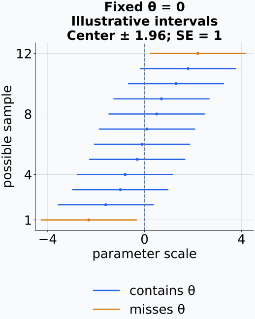
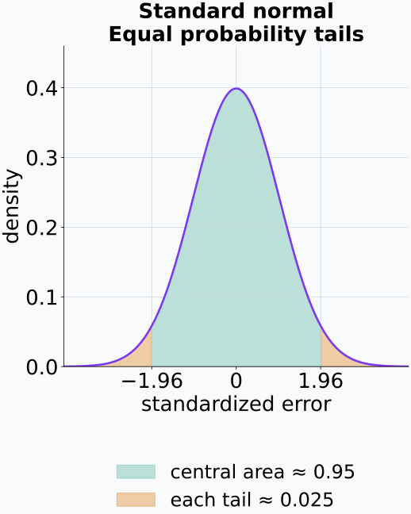
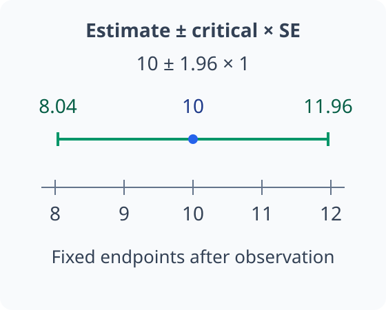
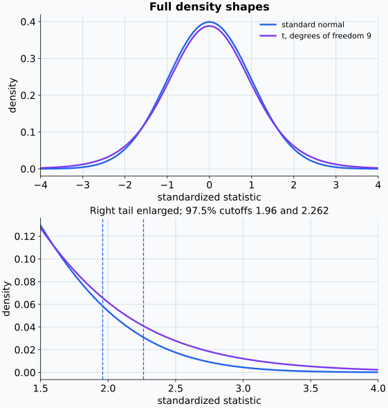
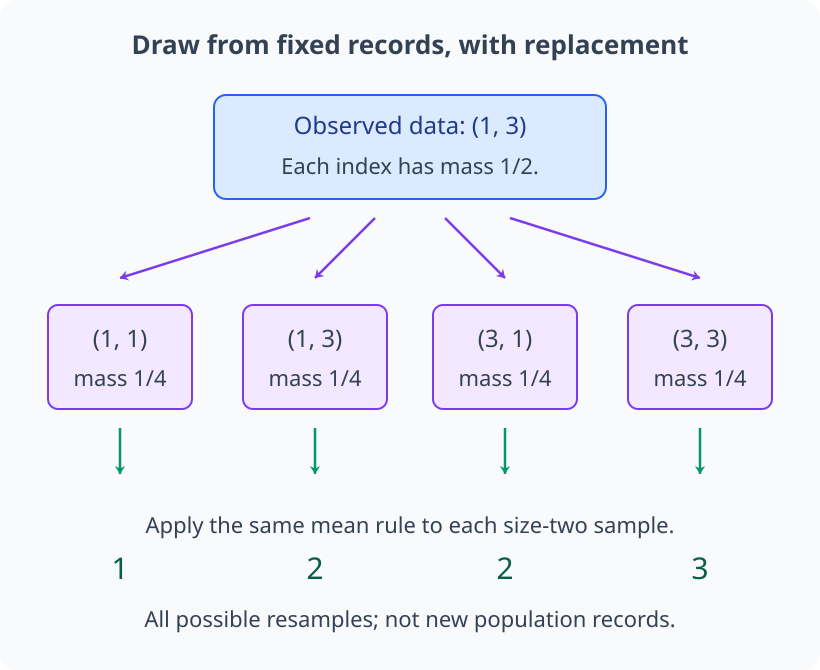
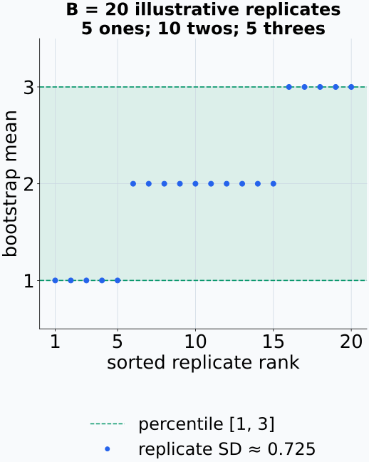
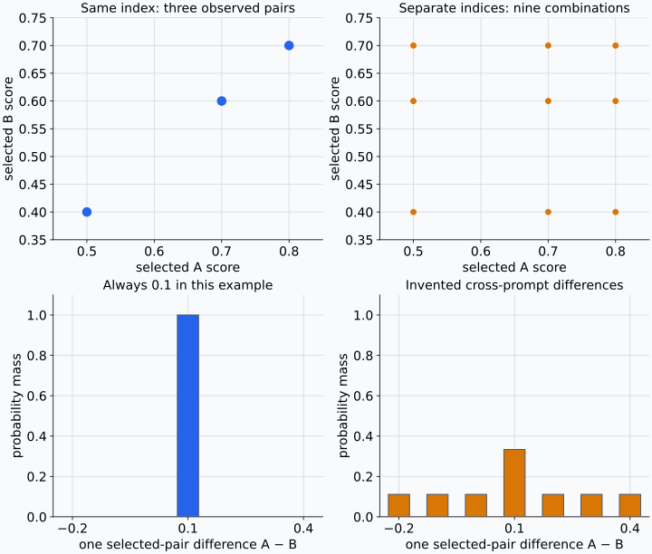
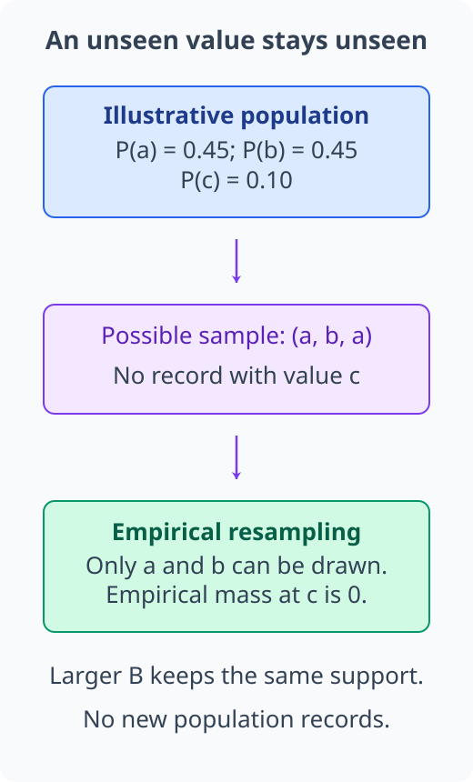
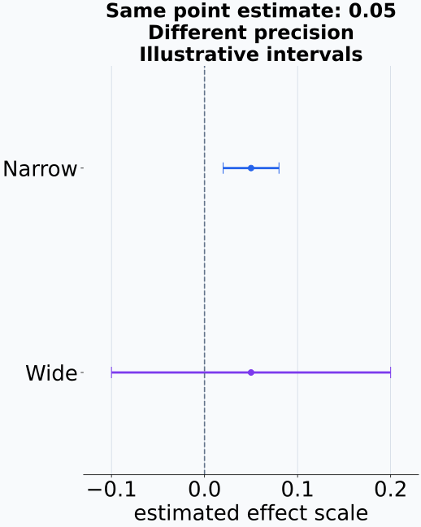

# M04-09. 신뢰구간과 bootstrap

## 이 단원이 필요한 이유

점추정값 하나는 sampling uncertainty를 보여 주지 않는다. 평균 accuracy가 0.74여도 sample size와 관측 의존성에 따라 추정 정밀도가 달라진다. 신뢰구간은 repeated sampling에서 모수를 일정 비율로 포함하도록 만든 구간 추정 절차이다.

통계량의 표본분포를 식으로 구하기 어려우면 bootstrap으로 관측 sample에서 재표집해 변동을 근사할 수 있다. 모델 두 개의 metric 차이, prompt별 attribution 평균과 probe score에도 같은 원리를 적용할 수 있다. 재표집 단위와 interval 해석을 명시해야 수치가 허용하는 일반화 범위를 알 수 있다.

## 학습 목표

이 단원을 마치면 다음을 할 수 있다.

- confidence level을 repeated-sampling coverage로 설명할 수 있다.
- 정규 근사를 사용한 점추정량의 신뢰구간을 계산할 수 있다.
- 평균의 z interval과 t interval이 사용하는 조건을 구분할 수 있다.
- bootstrap resample과 bootstrap replicate를 만들 수 있다.
- bootstrap standard error와 percentile interval을 계산할 수 있다.
- paired·clustered data에 맞는 재표집 단위를 정할 수 있다.
- 신뢰구간의 폭과 포함 여부가 허용하는 주장의 범위를 제한할 수 있다.

## 선수지식 확인

- 선수 단원: [M04-05 주요 분포](M04-05-common-distributions.md)
- 선수 단원: [M04-06 표본, 모집단과 표본분포](M04-06-samples-populations-sampling-distributions.md)
- 선수 단원: [M04-07 추정, 편향과 분산](M04-07-estimation-bias-variance.md)
- 확인 질문: 표준오차를 sampling distribution의 표준편차로 설명할 수 있는가?
- 확인 질문: estimator, estimate와 bias를 구분할 수 있는가?

## 기호와 용어

| 표기·용어 | Common spoken reading | 의미 | 범위·역할 |
|---|---|---|---|
| $1-\alpha$ | `one minus alpha` | confidence level | 예: $0.95$ |
| $C(X_1,\ldots,X_n)$ | `C of X one through X n` | sample에서 두 endpoint를 만드는 random interval | 표집 전 random |
| $z_{1-\alpha/2}$ | `z sub one minus alpha over two` | 표준정규 CDF가 $1-\alpha/2$가 되는 값 | 95%에서 약 1.96 |
| $t_{\nu,1-\alpha/2}$ | `t sub nu comma one minus alpha over two` | 자유도 $\nu$인 t 분포의 임계값 | 모분산 미지 평균 interval |
| $B$ | `B` | bootstrap replicate 수 | 양의 정수 |
| $\widehat\theta^{*(b)}$ | `theta hat star superscript b` | $b$번째 bootstrap resample에서 계산한 통계량 | $b=1,\ldots,B$ |
| $q_p^*$ | `q sub p star` | replicate 중 비율 $p$ 위치의 값 | percentile interval에 사용 |

## 핵심 개념 1. 신뢰구간은 coverage를 가진 random interval 절차이다

모수 $\theta$에 대한 신뢰구간(confidence interval) 절차를

\[
C(X_1,\ldots,X_n)=[L(X_1,\ldots,X_n),U(X_1,\ldots,X_n)]
\]

로 쓰자. $100(1-\alpha)\%$ 신뢰구간은 반복 표집에서

\[
P_\theta\left(
\theta\in C(X_1,\ldots,X_n)
\right)=1-\alpha
\]

또는 근사적으로 이 값을 만족하도록 만든 절차이다. sample을 뽑기 전에는 endpoint가 확률변수이고, sample을 관측한 뒤 계산한 $[l,u]$는 고정된 구간이다.

95% confidence라는 말은 같은 조건에서 표집과 interval 계산을 반복할 때 만들어진 구간들의 약 95%가 고정된 $\theta$를 포함한다는 뜻이다. 관측 뒤의 특정 구간에 $\theta$가 들어갈 확률이 95%라고 해석하려면 모수에 확률분포를 두는 Bayesian interval 같은 다른 틀이 필요하다.

반복할 때 바뀌는 것은 모수가 아니라 표본과 구간의 위치다.

<figure class="lesson-figure" markdown="1">

<figcaption>회색 세로선은 고정 모수이며 각 가로선은 가능한 한 표본의 구간이다. 이 그림은 해석을 위한 구성 예시라 12개 중 포함 비율을 95%로 맞추지 않았다. 95%는 모든 가능한 반복 표집에 대한 절차의 성질이지, 짧은 목록의 정확한 포함 비율이 아니다.</figcaption>
</figure>

## 핵심 개념 2. 정규형 interval은 estimate와 standard error를 사용한다

추정량의 sampling distribution이

\[
\frac{\widehat\theta-\theta}
{\operatorname{SE}(\widehat\theta)}
\approx\mathcal N(0,1)
\]

이라면 근사 $100(1-\alpha)\%$ interval은

\[
\hat\theta
\pm
z_{1-\alpha/2}
\widehat{\operatorname{SE}}(\widehat\theta)
\]

이다. 95%에서는 $z_{0.975}\approx1.96$을 사용한다.

표준정규의 양쪽 tail에 각각 $\alpha/2$를 남기면 두 임계값 사이의 확률이 $1-\alpha$다. standard error가 양수일 때

\[
-z_{1-\alpha/2}
\le\frac{\widehat\theta-\theta}{\operatorname{SE}(\widehat\theta)}
\le z_{1-\alpha/2}
\]

를 $\theta$에 대한 부등식으로 풀면 $\widehat\theta-z_{1-\alpha/2}\operatorname{SE}(\widehat\theta)\le\theta\le\widehat\theta+z_{1-\alpha/2}\operatorname{SE}(\widehat\theta)$가 된다. 가운데 확률변수의 포함 사건을 모수가 random interval 안에 있는 사건으로 다시 쓴 것이다. 실제 계산에서는 unknown standard error도 추정하므로, 표준화한 추정량의 정규 근사와 standard error 추정이 모두 적절해야 한다. 큰 bias가 남아 있으면 표준편차를 정확히 구해도 이 중심화 조건이 성립하지 않을 수 있다.

구간 폭은 standard error와 임계값에 비례한다. sample size가 커져 standard error가 줄면 같은 confidence level의 구간이 좁아진다. confidence level을 높이면 임계값이 커져 구간이 넓어진다.

표준화한 오차에서 가운데 확률을 남기는 것과, 관측한 추정값에서 구간 끝점을 계산하는 것은 서로 대응하지만 다른 장면이다.

<figure class="lesson-figure" markdown="1">

<figcaption>색칠한 것은 표준화한 확률변수의 넓이다. 양쪽 임계값 사이에 들어오는 사건을 모수에 대한 부등식으로 풀어 관측값 주변의 구간을 만든다.</figcaption>
</figure>

<figure class="lesson-figure" markdown="1">

<figcaption>예제 1의 두 끝점은 같은 추정값에서 같은 margin을 빼고 더한 위치다. 이미 관측한 이 구간은 고정됐으며, 여기서 모수의 확률밀도를 새로 그린 것은 아니다.</figcaption>
</figure>

## 핵심 개념 3. 평균의 z interval과 t interval은 모분산 조건이 다르다

$X_1,\ldots,X_n\overset{\mathrm{iid}}{\sim}\mathcal N(\mu,\sigma^2)$이고 $\sigma>0$를 안다면

\[
\bar X
\pm
z_{1-\alpha/2}
\frac{\sigma}{\sqrt n}
\]

은 $\mu$의 exact confidence interval이다.

$\sigma$를 모르고 sample standard deviation $S$로 대체하면

\[
\frac{\bar X-\mu}{S/\sqrt n}
\]

은 Gaussian population 아래 자유도 $n-1$인 t 분포를 따른다. 이때 interval은

\[
\bar X
\pm
t_{n-1,1-\alpha/2}
\frac{S}{\sqrt n}
\]

이다. t 분포는 작은 sample에서 모분산 추정의 uncertainty를 반영해 표준정규보다 두꺼운 tail을 가진다. 큰 sample의 평균에는 CLT와 estimated standard error를 사용한 근사 interval을 쓸 수 있지만 skewness, heavy tail과 dependence를 점검해야 한다.

$S$는 M04-06의 분모 $n-1$인 표본분산의 제곱근이며, 이 t 절차에는 $n\ge2$가 필요하다. 알려진 $\sigma$로 나누는 z 통계량과 달리 t 통계량의 분모도 표본에 따라 변한다. 분모가 작게 추정된 표본에서는 같은 평균 편차도 더 큰 비율이 되므로 표준정규 임계값을 그대로 사용하는 대신 t 임계값을 쓴다. 이는 위의 iid Gaussian 조건에서 성립하는 정확한 분포 결과다. $\sigma$를 $S$로 바꾸기만 하면 어떤 population에서도 exact t interval이 되는 것은 아니다.

자유도 9의 t 분포를 표준정규와 비교하면, 중심 높이보다 tail에서의 차이가 임계값 변화에 직접 연결된다.

<figure class="lesson-figure lesson-figure--wide" markdown="1">

<figcaption>아래 패널은 오른쪽 tail을 확대했다. 같은 오른쪽 tail 확률을 남기려면 t 임계값이 더 오른쪽에 놓인다. 이 비교는 본문의 iid Gaussian 조건에서 분모 S를 추정할 때의 분포 결과이며, 임의 자료의 정확한 t coverage를 뜻하지 않는다.</figcaption>
</figure>

## 핵심 개념 4. bootstrap은 경험분포에서 sample을 다시 뽑는다

관측 sample이 $x_1,\ldots,x_n$이고 관심 통계량이

\[
\hat\theta=T(x_1,\ldots,x_n)
\]

이라고 하자. nonparametric bootstrap은 다음 절차를 사용한다.

1. 관측값 $n$개에서 복원추출로 $n$개를 뽑아 bootstrap sample $x_1^*,\ldots,x_n^*$를 만든다.
2. 같은 통계량 $\widehat\theta^*=T(x_1^*,\ldots,x_n^*)$를 계산한다.
3. 이 과정을 $B$번 반복해 $\widehat\theta^{*(1)},\ldots,\widehat\theta^{*(B)}$를 얻는다.

복원추출이므로 한 관측값이 한 resample에 여러 번 들어가거나 빠질 수 있다. bootstrap은 empirical distribution $\widehat P_n$을 population distribution의 대용으로 사용해 estimator의 sampling variation을 근사한다.

구체적으로는 원 sample의 index $1,\ldots,n$ 각각을 확률 $1/n$로 선택하는 일을 독립적으로 $n$번 반복한다. 같은 값이 여러 index에 있으면 그 값의 선택 확률은 index들의 확률을 합한 값이다. 한 resample의 크기 $n$은 원래 estimator에 사용한 sample size를 유지한다. 반면 $B$는 이 크기 $n$의 표집 실험을 몇 번 모의하는지 나타낸다. 관측 sample을 고정한 뒤에는 resample 선택에서만 새로운 무작위성이 생기며, 여기서 얻은 분포가 unknown population에서의 실제 표본분포와 정확히 같다는 뜻은 아니다.

예제 3에서는 관측한 두 기록의 index를 매번 다시 선택하므로 같은 기록이 두 번 뽑히는 경우도 가능하다.

<figure class="lesson-figure lesson-figure--wide" markdown="1">

<figcaption>각 상자는 크기 n=2의 resample이고 아래 숫자는 같은 규칙으로 계산한 replicate다. 가능한 resample을 모두 나열한 그림이며, 반복 횟수 B와 원자료 크기 n은 같은 수가 아니다.</figcaption>
</figure>

## 핵심 개념 5. bootstrap replicate로 standard error와 percentile interval을 만든다

bootstrap replicate의 평균을

\[
\overline{\theta^*}
=\frac1B\sum_{b=1}^{B}\widehat\theta^{*(b)}
\]

라 하자. bootstrap standard error는

\[
\widehat{\operatorname{SE}}_{\mathrm{boot}}
=\sqrt{
\frac{1}{B-1}
\sum_{b=1}^{B}
\left(
\widehat\theta^{*(b)}-\overline{\theta^*}
\right)^2
}
\]

이다. replicate의 $\alpha/2$와 $1-\alpha/2$ 분위수를 사용한 percentile interval은

\[
[q^*_{\alpha/2},q^*_{1-\alpha/2}]
\]

이다.

$B\ge2$에서 위 standard error는 replicate들의 표본표준편차다. 각 replicate가 원 estimator의 표집을 한 번 모의하므로, replicate 사이의 퍼짐을 원 estimator의 변동 추정에 사용한다. 이를 다시 $\sqrt B$로 나누면 replicate 평균의 Monte Carlo standard error에 해당하는 다른 양이 된다. $B$를 늘리는 것은 원 data의 sample size $n$을 늘리는 일이 아니므로 원 estimator의 sampling uncertainty를 그 비율로 줄이지 않는다.

percentile interval은 replicate를 크기순으로 정렬해 아래쪽 $\alpha/2$와 위쪽 $\alpha/2$를 남기는 두 위치를 고른다. 유한한 $B$에서는 원하는 비율의 index가 정수가 아닐 수 있어 분위수 선택이나 보간 규칙을 사용한다. 따라서 같은 replicate에서도 사용한 분위수 규칙을 밝혀야 endpoint를 재현할 수 있다. 이 경험적 가운데 구간이 모수에 대해 원하는 coverage를 갖는지는 bootstrap 근사의 품질에 달려 있다.

percentile interval은 계산이 짧지만 estimator bias, skewness와 작은 sample에서 coverage가 부정확할 수 있다. bootstrap-t와 bias-corrected interval 같은 방법은 추가 보정을 사용한다. 이 단원에서는 standard error와 percentile 방법의 원리를 다룬다.

아래는 예제 3에서 가능한 평균값들을 사용해 구성한 B=20의 replicate 목록이다. 표준편차와 분위수는 이 목록에서 각각 계산한다.

<figure class="lesson-figure" markdown="1">

<figcaption>가로축은 관측 원자료의 index가 아니라 정렬한 replicate 순위다. 선형 보간 분위수 규칙의 percentile 구간은 [1, 3]이며, 동점 때문에 여기에는 목록의 모든 값이 들어간다. 분모 B−1의 replicate 표준편차는 약 0.725이고 이를 다시 √B로 나누지 않는다. 유한 목록의 값은 예제 3의 정확한 bootstrap 분포 표준편차 약 0.707과 다를 수 있다.</figcaption>
</figure>

## 핵심 개념 6. paired 비교는 관측 단위를 함께 재표집한다

같은 prompt $i$에서 두 모델의 metric $A_i,B_i$를 계산했다면 관심 통계량을 차이

\[
D_i=A_i-B_i
\]

의 평균으로 둘 수 있다. paired bootstrap은 prompt index를 재표집하고 선택된 prompt의 $A_i,B_i$를 함께 가져온다. 이 절차는 두 모델 결과의 prompt별 상관을 보존한다.

$A$와 $B$를 따로 재표집하면 pairing을 잃어 차이의 sampling variation을 잘못 추정할 수 있다. 문서 안 token, 환자 안 image처럼 cluster 구조가 있으면 독립 cluster를 재표집하거나 계층을 보존하는 hierarchical bootstrap을 고려한다.

M04-04의 차이 분산은 $\operatorname{Var}(A-B)=\operatorname{Var}(A)+\operatorname{Var}(B)-2\operatorname{Cov}(A,B)$였다. 같은 prompt의 난이도가 두 score를 함께 움직이면 마지막 공분산 항도 차이의 변동에 영향을 준다. prompt index 하나로 두 score를 함께 선택하면 원 sample의 짝 관계를 유지하지만, 두 index를 따로 선택하면 원래 존재하던 짝의 공분산을 잃는다. pairing은 단순히 두 sample size가 같다는 조건이 아니라 각 $A_i,B_i$가 같은 관측 단위에서 나왔다는 조건이다.

세 prompt의 score 쌍을 유지한 선택과 모델별 index를 따로 뽑는 선택은 가능한 결합 결과부터 다르다.

<figure class="lesson-figure lesson-figure--wide" markdown="1">

<figcaption>왼쪽에서는 관측한 짝 세 개만 선택하지만 오른쪽에서는 서로 다른 prompt끼리 새 짝을 만든다. 아래 막대는 선택 한 번의 차이 분포이며 resample 전체의 평균차이 분포는 아니다. 이 예시에서는 모든 관측 차이가 같지만 일반적인 paired 자료가 그렇다는 뜻은 아니다.</figcaption>
</figure>

## 핵심 개념 7. bootstrap은 sampling design의 결함을 고치지 않는다

bootstrap은 관측 empirical distribution이 target population을 적절히 대표하고 재표집 단위가 독립이라는 가정에 의존한다. 누락된 집단, measurement error와 data leakage는 같은 sample을 재표집해도 남는다.

sample이 작아 rare event를 포함하지 않으면 bootstrap resample에도 그 event가 나타나지 않는다. 시계열이나 공간자료에 iid bootstrap을 적용하면 dependence를 깨뜨릴 수 있다. block bootstrap이나 cluster bootstrap처럼 구조에 맞는 방법이 필요하다.

$B$가 유한하면 bootstrap 결과에도 Monte Carlo error가 있다. random seed를 기록하고 $B$를 늘렸을 때 endpoint가 안정적인지 확인해야 한다.

경험분포에 없는 값은 복원추출에서도 생기지 않는다는 한계가 있다.

<figure class="lesson-figure" markdown="1">

<figcaption>이 모집단에서는 c가 가능하지만 관측한 표본에는 빠졌다. B를 늘려도 같은 경험분포의 support에서 다시 뽑을 뿐이므로 누락된 사건의 정보를 새로 확보하지 못한다.</figcaption>
</figure>

## 핵심 개념 8. interval은 target과 일반화 범위를 포함해 보고한다

“95% CI가 $[0.02,0.08]$이다”라는 문장에는 target statistic, sampling unit, data split과 interval method가 빠져 있다. 같은 수치도 prompt 평균 차이인지 token 평균 차이인지에 따라 해석이 달라진다.

신뢰구간이 좁으면 선택한 sampling model 아래 estimator의 무작위 변동이 작다는 뜻이다. 측정 bias, model misspecification과 distribution shift까지 작다는 뜻은 아니다. interval이 0을 포함하는지 여부만 보고 effect size와 interval 폭을 버리면 추정의 크기와 정밀도를 함께 판단할 수 없다.

같은 점추정값을 가진 두 구간에서도 폭은 추정 정밀도에 관해 서로 다른 정보를 준다.

<figure class="lesson-figure" markdown="1">

<figcaption>두 점추정값은 같지만 가능한 효과 범위의 정밀도는 다르다. 넓은 구간이 0을 포함한다고 추정 효과가 0으로 바뀌는 것은 아니다. 어느 구간이든 target과 표집 단위가 정해져야 일반화할 수 있다.</figcaption>
</figure>

## 예제 1. 모표준편차를 아는 평균의 z interval

### 문제

$\bar x=10$, 모표준편차 $\sigma=4$, iid sample size $n=16$이다. $z_{0.975}=1.96$을 사용해 95% confidence interval을 구한다.

### 풀이

standard error는

\[
\frac{\sigma}{\sqrt n}
=\frac4{4}=1
\]

이다. margin of error는

\[
1.96\cdot1=1.96
\]

이므로 interval은

\[
10\pm1.96=[8.04,11.96]
\]

이다.

### 결과의 의미

같은 population에서 크기 16의 iid sample을 반복해 이 절차를 적용하면 생성된 구간의 95%가 $\mu$를 포함한다.

## 예제 2. 모분산을 모르는 평균의 t interval

$\bar x=5$, $s=3$, $n=10$이고 $t_{9,0.975}=2.262$라고 하자. estimated standard error는

\[
\frac{s}{\sqrt n}
=\frac3{\sqrt{10}}
\approx0.949
\]

이고 margin은

\[
2.262\cdot0.949\approx2.146
\]

이다. 95% t interval은

\[
[5-2.146,5+2.146]
=[2.854,7.146]
\]

이다. exact coverage에는 iid Gaussian population 가정이 필요하다.

## 예제 3. 두 관측값의 bootstrap distribution

관측 sample이 $(1,3)$이고 통계량이 표본평균이라고 하자. 크기 2의 가능한 ordered bootstrap samples와 평균은 다음과 같다.

| bootstrap sample | 확률 | 평균 |
|---|---:|---:|
| $(1,1)$ | $1/4$ | 1 |
| $(1,3)$ | $1/4$ | 2 |
| $(3,1)$ | $1/4$ | 2 |
| $(3,3)$ | $1/4$ | 3 |

bootstrap mean의 분포는 $1,2,3$에 확률 $1/4,1/2,1/4$을 둔다. bootstrap variance는

\[
\frac14(1-2)^2+\frac12(2-2)^2+\frac14(3-2)^2
=\frac12
\]

이므로 bootstrap standard error는 $\sqrt{1/2}\approx0.707$이다.

## 예제 4. 모델 차이의 paired bootstrap

prompt마다 모델 A와 B의 accuracy contribution이나 score를 함께 계산한다. prompt index를 복원추출하고 각 resample에서 평균 차이

\[
\widehat\Delta^*
=\frac1n\sum_{i=1}^{n}(A_i^*-B_i^*)
\]

를 계산한다. replicate의 분포는 prompt population에 대한 평균 차이의 sampling variation을 근사한다. 모델별 prompt 집합이 다르면 paired design을 사용할 수 없다.

## 흔한 오해

### 오해 1. 95% 신뢰구간에는 모수가 95% 확률로 들어 있다

빈도주의에서 모수는 고정값이고 관측 뒤 interval도 고정된다. 95%는 interval 생성 절차의 repeated-sampling coverage를 나타낸다.

### 오해 2. 신뢰구간이 넓으면 effect가 없다

넓은 interval은 estimate의 sampling uncertainty가 크다는 뜻이다. effect가 0인지, 크기가 어느 범위인지에 대한 정보가 부족하며 sample size와 variability를 점검해야 한다.

### 오해 3. bootstrap은 새 population data를 생성한다

bootstrap은 관측 sample의 empirical distribution에서 재표집한다. 원 sample에 없는 집단과 rare pattern을 새로 제공하지 않는다.

### 오해 4. bootstrap에서는 row를 재표집하면 된다

독립 sampling unit이 row와 다르면 row bootstrap이 dependence를 깨뜨린다. paired observation, cluster와 time block을 보존해야 한다.

### 오해 5. bootstrap replicate 수를 늘리면 작은 sample 문제가 사라진다

$B$를 늘리면 resampling Monte Carlo error가 줄어든다. empirical distribution이 population을 거칠게 근사하는 문제와 sampling bias는 남는다.

## 연습문제

### 1. confidence 해석

95% confidence interval $[0.4,0.6]$을 얻었다. repeated-sampling coverage를 사용해 정확한 해석을 쓰라.

해설 보기

같은 population과 sampling design에서 sample을 반복해 같은 interval 절차를 적용하면 생성된 interval 가운데 약 95%가 고정된 target parameter를 포함한다. 관측한 이 한 구간에 parameter가 들어갈 확률이 95%라는 문장은 빈도주의 해석이 아니다.

### 2. z interval 계산

$\bar x=20$, $\sigma=4$, $n=64$이고 $z_{0.975}=1.96$이다. 95% confidence interval을 구하라.

해설 보기

standard error는 $4/\sqrt{64}=0.5$이고 margin은 $1.96(0.5)=0.98$이다. 따라서

\[
[20-0.98,20+0.98]=[19.02,20.98].
\]

### 3. confidence level과 폭

같은 estimate와 standard error에서 confidence level을 95%에서 99%로 높이면 interval 폭이 어떻게 변하는지 설명하라.

해설 보기

99% interval은 더 큰 임계값을 사용하므로 넓어진다. 반복 표집에서 더 높은 coverage를 얻기 위해 더 많은 parameter 값을 포함하는 절차를 사용한다.

### 4. t interval 계산

$\bar x=12$, $s=2$, $n=25$이고 $t_{24,0.975}=2.064$이다. 95% t interval을 구하라.

해설 보기

estimated standard error는

\[
\frac2{\sqrt{25}}=0.4
\]

이고 margin은 $2.064(0.4)=0.8256$이다. interval은

\[
[12-0.8256,12+0.8256]
=[11.1744,12.8256]
\]

이다.

### 5. bootstrap resample

sample $(a,b,c)$에서 크기 3의 bootstrap sample 두 개를 예로 만들고, 한 관측값이 빠지거나 반복될 수 있는 이유를 설명하라.

해설 보기

예를 들어 $(a,a,c)$와 $(b,c,b)$가 가능하다. 각 위치에서 $a,b,c$ 중 하나를 복원추출하므로 이미 뽑은 값을 다시 뽑을 수 있다. 그 결과 어떤 관측값은 반복되고 다른 관측값은 한 resample에서 빠질 수 있다.

### 6. 재표집 단위

같은 50개 prompt에 모델 A와 B를 평가했다. 평균 score 차이의 bootstrap interval을 만들 때 어떤 단위를 어떻게 재표집해야 하는지 설명하라.

해설 보기

prompt index 50개를 복원추출하고 선택된 각 prompt의 A와 B score를 함께 가져온다. 각 resample에서 paired difference의 평균을 계산한다. 두 모델의 score를 따로 재표집하면 prompt 난이도에서 생기는 paired correlation을 잃는다.

### 7. 모델 해석 주장 비판

한 dataset의 token row를 iid bootstrap해 attribution 평균의 매우 좁은 interval을 얻었다. “모든 prompt와 model에서 attribution 평균이 같은 범위에 있다”라는 결론을 평가하라.

해설 보기

token이 prompt 안에 묶여 있으면 row bootstrap은 dependence를 무시해 interval을 좁게 만들 수 있다. 한 dataset과 model에서 얻은 interval은 다른 prompt distribution과 model variation을 포함하지 않는다. prompt나 document를 cluster 단위로 재표집하고, model seed까지 일반화하려면 model run 수준의 반복도 설계해야 한다.

## 단원 요약

- confidence interval은 repeated sampling에서 정한 coverage를 갖는 random interval 절차이다.
- 정규형 interval은 estimate에 임계값과 estimated standard error의 곱을 더하고 뺀다.
- Gaussian mean에서 모분산을 알면 z interval, 모분산을 추정하면 t interval을 사용한다.
- nonparametric bootstrap은 empirical distribution에서 크기 $n$의 sample을 복원추출한다.
- bootstrap replicate의 표준편차와 분위수로 standard error와 percentile interval을 만들 수 있다.
- paired·clustered data는 의존 구조를 보존하는 단위로 재표집해야 한다.
- bootstrap은 sampling bias, 누락된 집단과 distribution shift를 제거하지 않는다.

## 통과 기준

다음 질문에 자료를 보지 않고 답할 수 있으면 통과한다.

- confidence level을 coverage로 설명할 수 있는가?
- estimate, standard error와 임계값으로 interval을 계산할 수 있는가?
- z interval과 t interval의 조건을 구분할 수 있는가?
- bootstrap resample과 replicate를 만들 수 있는가?
- bootstrap standard error와 percentile interval을 설명할 수 있는가?
- paired·clustered data의 재표집 단위를 정할 수 있는가?
- 좁은 interval이 보장하지 않는 주장을 설명할 수 있는가?

## 다음 단원

- [M04-10 가설검정과 다중비교](M04-10-hypothesis-testing-multiple-comparisons.md)

## 집필자 점검표

- [x] 학습 목표가 관찰 가능한 행동으로 작성됐다.
- [x] confidence level을 repeated-sampling coverage로 정의했다.
- [x] z·t interval의 식과 조건을 구분했다.
- [x] bootstrap 절차와 standard error를 설명했다.
- [x] percentile interval과 한계를 밝혔다.
- [x] paired·clustered resampling을 설명했다.
- [x] 모든 문제에 해설이 있다.
- [x] 모델 해석 주장의 강도를 구분했다.
- [x] 용어집과 표기 규칙을 따랐다.
- [x] 선수지식 밖의 내용을 몰래 요구하지 않는다.
- [x] 내부 링크와 수식 구분자를 확인했다.
- [x] Common spoken reading이 실제 영어 학술 발화이며 한글 음역이나 기계적 직역을 포함하지 않는다.
