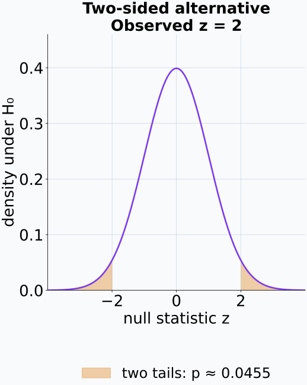
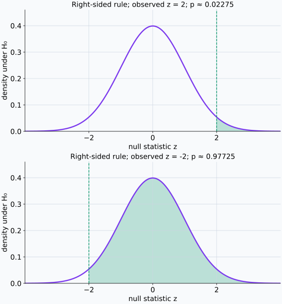
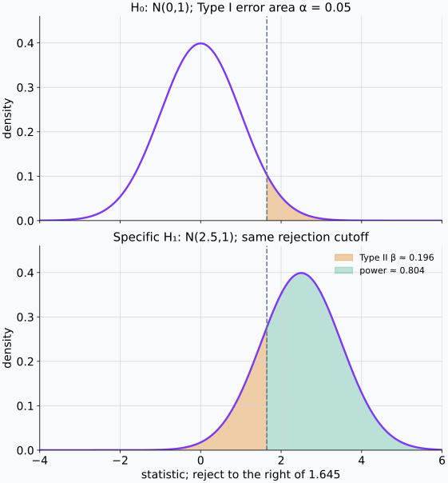
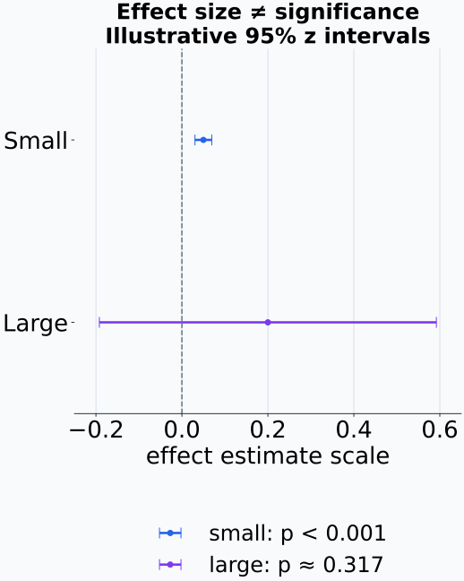
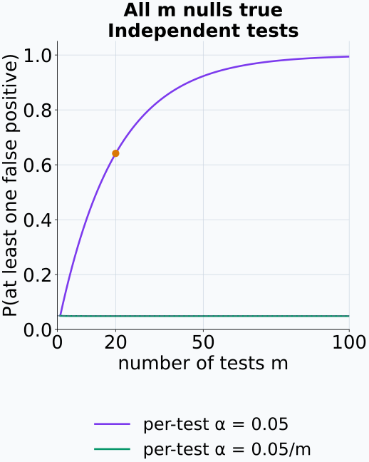
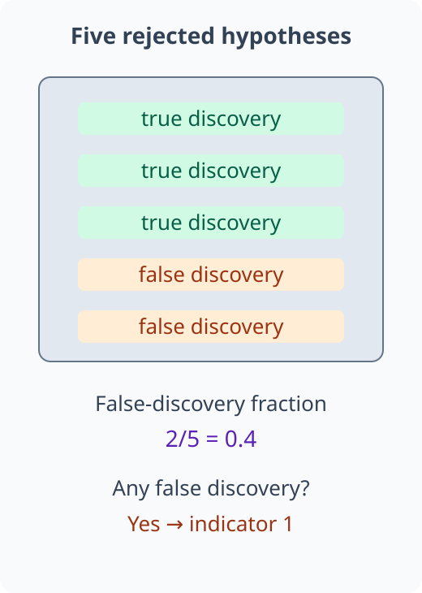
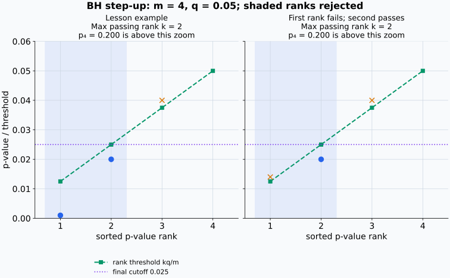
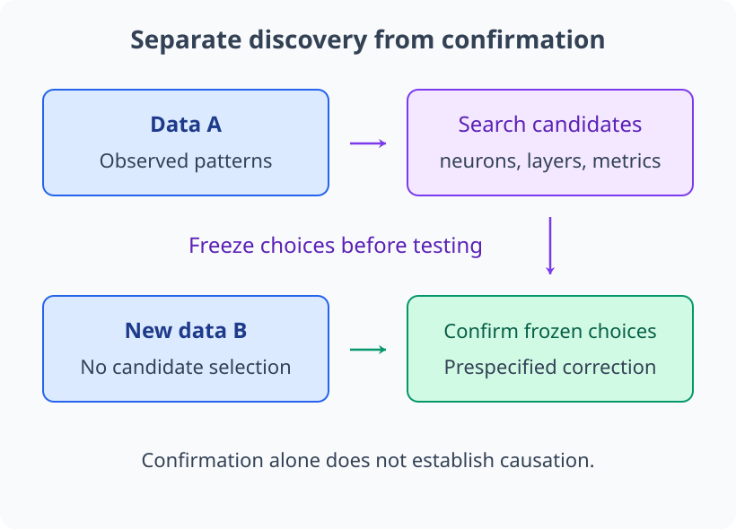

# M04-10. 가설검정과 다중비교

## 이 단원이 필요한 이유

모델 해석 실험에서는 두 조건의 평균 차이, 특정 neuron의 selectivity와 ablation effect가 우연한 표본 변동으로도 나타날 수 있는지 묻는다. 가설검정은 귀무가설 아래 관측 통계량보다 극단적인 결과가 얼마나 드문지 계산한다.

수백 개 neuron이나 layer를 각각 검사하면 작은 p-value가 우연히 나올 기회도 늘어난다. 다중비교 절차는 전체 분석에서 false positive가 쌓이는 방식을 통제한다. p-value, effect size와 interval을 함께 읽어야 통계적 검출과 연구 주장의 크기를 구분할 수 있다.

## 학습 목표

이 단원을 마치면 다음을 할 수 있다.

- 귀무가설, 대립가설과 검정통계량을 구분할 수 있다.
- 단측·양측 p-value를 귀무분포의 tail probability로 해석할 수 있다.
- 유의수준에 따라 기각 여부를 판단하고 결론의 강도를 제한할 수 있다.
- Type I error, Type II error와 power를 설명할 수 있다.
- effect size, confidence interval과 p-value의 역할을 비교할 수 있다.
- Bonferroni correction과 Benjamini-Hochberg 절차를 계산할 수 있다.
- 다수의 모델 component를 탐색한 결과에 맞는 오류 통제와 대조군을 제안할 수 있다.

## 선수지식 확인

- 선수 단원: [M04-06 표본, 모집단과 표본분포](M04-06-samples-populations-sampling-distributions.md)
- 선수 단원: [M04-07 추정, 편향과 분산](M04-07-estimation-bias-variance.md)
- 선수 단원: [M04-09 신뢰구간과 bootstrap](M04-09-confidence-intervals-bootstrap.md)
- 확인 질문: sampling distribution과 standard error를 설명할 수 있는가?
- 확인 질문: confidence interval의 coverage를 repeated sampling으로 해석할 수 있는가?

## 기호와 용어

| 표기·용어 | Common spoken reading | 의미 | 범위·역할 |
|---|---|---|---|
| $H_0$ | `H naught` | 검정할 기준 모형이나 효과 없음 가설 | null hypothesis |
| $H_1$ | `H one` | $H_0$와 비교할 효과·차이 가설 | alternative hypothesis |
| $T$ | `T` | sample을 극단성의 수로 보내는 통계량 | null distribution을 가짐 |
| $t_{\mathrm{obs}}$ | `t sub obs` | 현재 sample에서 계산한 $T$의 값 | 고정된 수 |
| $p$ | `p` | $H_0$ 아래 관측값 이상으로 극단적인 통계량의 확률 | $0\le p\le1$ |
| $\alpha$ | `alpha` | Type I error 통제를 위해 미리 정한 기각 기준 | 흔한 예: 0.05 |
| $\beta$ | `beta` | 특정 대립가설이 참일 때 $H_0$를 기각하지 못할 확률 | $0\le\beta\le1$ |
| $1-\beta$ | `one minus beta` | 특정 효과가 있을 때 이를 검출할 확률 | power |
| $m$ | `m` | 동시에 고려한 가설의 수 | positive integer |

## 핵심 개념 1. 가설검정은 기준 모형과 통계량을 먼저 정한다

가설검정은 모집단 모수나 분포에 대한 귀무가설(null hypothesis) $H_0$와 대립가설(alternative hypothesis) $H_1$을 정한다. 평균 차이 $\delta$를 검사하는 양측 문제라면

\[
H_0:\delta=0,
\qquad
H_1:\delta\ne0
\]

로 둘 수 있다. positive effect만 관심 있으면 $H_1:\delta>0$인 단측가설을 사용할 수 있다. 데이터 결과를 본 뒤 방향을 고르면 Type I error가 계획한 수준보다 커질 수 있으므로 방향은 분석 전에 정한다.

검정통계량 $T$는 sample의 차이를 표준화하거나 순위로 요약한다. $H_0$가 참일 때 $T$가 어떤 분포를 따르는지 알아야 관측값의 극단성을 계산할 수 있다.

## 핵심 개념 2. p-value는 귀무가설 아래의 tail probability이다

양측검정에서 대칭인 검정통계량을 사용하면 p-value는

\[
p=P_{H_0}\left(
|T|\ge|t_{\mathrm{obs}}|
\right)
\]

이다. 귀무가설을 가정했을 때 관측 통계량과 같거나 더 극단적인 값이 나올 확률을 뜻한다.

오른쪽 단측검정에서는

\[
p=P_{H_0}(T\ge t_{\mathrm{obs}})
\]

를 사용한다. “더 극단적”의 정의는 $H_1$과 검정통계량에 달려 있다.

양측 식은 절댓값이 $|t_{\mathrm{obs}}|$ 이상인 두 tail의 확률을 합한다. 연속이고 0에 대해 대칭인 귀무분포에서는 두 tail의 확률이 같으므로 오른쪽 tail의 두 배로 계산할 수 있다. 반면 오른쪽 단측검정은 positive 방향만 센다. 관측값이 negative 방향으로 커지면 절댓값은 커져도 오른쪽 단측 p-value는 작아지지 않는다. 어느 방향을 극단적으로 셀지 먼저 정해야 하는 이유다.

p-value는 $P(H_0\mid\text{data})$가 아니다. 귀무가설의 사후확률을 계산하려면 prior와 likelihood를 포함한 Bayesian 모형이 필요하다.

예제 1의 z=2를 귀무분포에 표시하면 양측검정이 세는 두 영역을 볼 수 있다.

<figure class="lesson-figure" markdown="1">

<figcaption>색칠한 넓이는 귀무가설을 가정한 통계량의 확률이다. 관측값 이상으로 절댓값이 큰 두 영역을 함께 세며, 귀무가설 자체의 확률을 그린 것이 아니다.</figcaption>
</figure>

관측값의 절댓값이 같아도 오른쪽 단측검정에서는 방향에 따라 넓이가 크게 달라진다.

<figure class="lesson-figure lesson-figure--wide" markdown="1">

<figcaption>두 패널 모두 관측 위치의 오른쪽을 센다. negative 방향으로 큰 관측값은 positive 대립가설을 위한 오른쪽 단측검정에서 작은 p-value를 만들지 않는다.</figcaption>
</figure>

## 핵심 개념 3. 유의수준은 기각 규칙을 정한다

분석 전에 유의수준(significance level) $\alpha$를 정하고

\[
p\le\alpha
\]

이면 $H_0$를 기각한다. $p>\alpha$이면 $H_0$를 기각하지 못한다.

기각 실패는 $H_0$가 참이라는 증명이 아니다. sample size가 작거나 noise가 크면 meaningful effect가 있어도 검정력이 부족할 수 있다. 반대로 큰 sample에서는 작은 effect도 낮은 p-value를 만들 수 있다.

검정 결론에는 effect estimate와 confidence interval을 함께 보고한다. 이 두 수는 효과의 크기와 추정 정밀도를 보여 준다.

표집 전에는 p-value도 sample에서 계산하는 통계량이다. 유효한 p-value라는 조건은 $H_0$ 아래 $P_{H_0}(p\le\alpha)\le\alpha$라는 반복 표집 확률로 표현된다. 따라서 $p\le\alpha$를 기각 규칙으로 삼으면 참인 $H_0$를 기각할 확률도 $\alpha$ 이하가 된다. 이는 귀무가설이 참인 표집을 반복했을 때의 오류율이지, 이미 기각한 한 결과가 틀릴 확률이라는 뜻은 아니다.

## 핵심 개념 4. Type I·II error와 power는 서로 다른 오류를 센다

검정 결과와 실제 상태를 표로 정리하면 다음과 같다.

| 실제 상태 | $H_0$ 기각 | $H_0$ 기각 실패 |
|---|---|---|
| $H_0$ 참 | Type I error | 올바른 결정 |
| $H_1$ 참 | 올바른 검출 | Type II error |

Type I error 확률은

\[
P(\text{reject }H_0\mid H_0\text{ true})
\]

이며 유효한 검정은 이를 $\alpha$ 이하로 통제한다. 특정 대립가설 아래 Type II error 확률은 $\beta$이고 power는

\[
1-\beta
=P(\text{reject }H_0\mid H_1\text{ true})
\]

이다.

power는 effect size, sample size, variability와 $\alpha$에 좌우된다. 더 작은 $\alpha$는 false positive를 줄이는 대신 같은 조건에서 power를 낮출 수 있다.

같은 기각 영역을 두 실제 상태의 분포에 적용하면 Type I error와 power가 서로 다른 조건부확률임을 확인할 수 있다.

<figure class="lesson-figure lesson-figure--wide" markdown="1">

<figcaption>위 주황 영역은 귀무가설이 참일 때의 오류이고, 아래 주황 영역은 이 특정 대립가설이 참일 때 놓치는 경우다. 같은 기각 규칙에서도 조건으로 둔 분포가 다르며, 아래 power가 모든 효과 크기의 공통값인 것은 아니다.</figcaption>
</figure>

## 핵심 개념 5. 통계적 유의성과 효과 크기는 다른 질문에 답한다

p-value는 $H_0$ 아래 관측 결과의 극단성을 나타낸다. effect size는 연구 대상 차이의 크기를 나타낸다. confidence interval은 sampling uncertainty를 포함한 plausible effect 범위를 제공한다.

평균 차이가 $0.001$이어도 sample size가 크면 낮은 p-value가 나올 수 있다. 평균 차이가 $0.2$여도 sample이 작고 variance가 크면 interval이 넓고 p-value가 높을 수 있다. 모델 행동에 어떤 크기의 변화가 의미 있는지는 task metric과 intervention 비용을 바탕으로 별도 판단해야 한다.

평균 차이 검정에서 관측 차이를 standard error로 나누면 그 차이가 표집 변동의 몇 배인지 나타난다. 같은 관측 차이에 standard error가 작아지면 표준화한 통계량은 귀무값에서 더 멀어지고 tail probability는 작아진다. 실제 효과를 고정한 반복 표집에서도 standard error가 작아지면 기각 영역에 들어갈 기회가 늘어난다. 이 계산은 power 증가를 설명하지만 원래 metric에서의 효과 크기를 키우지는 않는다.

원래 metric의 차이와 표준오차의 배수를 분리하면 작은 효과의 유의성과 큰 효과의 불확실성을 동시에 표현할 수 있다.

<figure class="lesson-figure" markdown="1">

<figcaption>위 차이는 0.05, SE는 0.01이라 귀무값에서 5배 떨어지고, 아래 차이는 0.20, SE는 0.20이라 1배 떨어진다. 효과가 큰 아래 결과의 p-value가 오히려 높다. 그림은 가정한 수치 예시이며 실제 모델의 효과를 보고하는 것이 아니다.</figcaption>
</figure>

## 핵심 개념 6. 다중비교는 false positive가 생길 기회를 늘린다

귀무가설 $m$개가 모두 참이고, 각 검정의 Type I error 확률이 정확히 $\alpha$이며 검정 결과들이 독립이라고 하자. false positive가 하나 이상 나올 확률인 family-wise error rate(FWER)는

\[
1-(1-\alpha)^m
\]

이다. $m=20$, $\alpha=0.05$이면

\[
1-0.95^{20}\approx0.642
\]

이다. independence가 없어도 여러 검정을 탐색하면 raw p-value 하나의 해석에는 전체 선택 절차가 들어가야 한다.

각 검정에서 false positive가 없을 확률은 $1-\alpha$다. 독립이면 $m$개 모두에서 오류가 없을 확률이 $(1-\alpha)^m$이고, 그 여사건이 하나 이상의 오류다. 실제 검정별 오류 확률이 $\alpha$ 이하라는 조건만 있다면 위 값은 독립 조건 아래의 상한이지 반드시 등식은 아니다.

Bonferroni correction은 각 가설을

\[
\alpha_{\mathrm{per\ test}}=\frac{\alpha}{m}
\]

수준에서 검사한다. 가설 사이의 dependence와 관계없이 FWER를 $\alpha$ 이하로 통제하지만, $m$이 크면 power가 낮아질 수 있다.

오류가 하나라도 있는 사건은 각 참인 귀무가설에서 오류가 있는 사건들의 합집합이다. 합집합 확률은 개별 확률의 합 이하이므로, 참인 가설 수가 최대 $m$개이고 각 오류 확률이 $\alpha/m$ 이하이면 전체 오류 확률은 $m(\alpha/m)=\alpha$ 이하가 된다. 사건 사이의 독립성을 쓰지 않는 이 상한이 Bonferroni 보장의 근거다.

모든 귀무가설이 참인 독립 검정이라는 본문의 조건 아래에서 검정 수에 따른 family 오류를 정확하게 비교할 수 있다.

<figure class="lesson-figure" markdown="1">

<figcaption>주황 점은 m=20에서 보정 전 확률 약 0.642다. 초록 곡선은 이 독립 예시의 정확한 확률이며, dependence가 있는 일반적인 경우의 Bonferroni 보장은 본문의 합집합 상한에서 얻는다.</figcaption>
</figure>

## 핵심 개념 7. FDR은 발견된 항목 중 false discovery 비율을 통제한다

false discovery rate(FDR)는 기각한 가설들 가운데 false positive가 차지하는 비율의 기댓값을 통제하는 기준이다. Benjamini-Hochberg(BH) 절차는 다음 순서를 사용한다.

1. $m$개 p-value를 $p_{(1)}\le\cdots\le p_{(m)}$로 정렬한다.
2. 목표 FDR $q$에 대해 $p_{(k)}\le kq/m$을 만족하는 가장 큰 $k$를 찾는다.
3. $p_{(1)},\ldots,p_{(k)}$에 해당하는 가설을 기각한다.

FDR의 비율은 sample마다 기각 개수와 false positive 개수가 달라지는 random quantity다. 기각이 하나도 없으면 이 비율을 0으로 정하고, 반복 분석에서 얻는 비율의 기댓값을 통제한다. 목표 $q$는 지금 얻은 발견들 중 false positive가 정확히 그 비율이라는 뜻도, false positive가 하나라도 있을 확률이라는 뜻도 아니다.

BH의 threshold $kq/m$은 정렬 위치가 뒤로 갈수록 커진다. 따라서 처음 조건을 실패한 위치에서 멈추지 않고 모든 위치 중 조건을 만족하는 가장 큰 $k$를 찾는다. 그런 위치가 없으면 아무 가설도 기각하지 않는다. $k$를 찾았으면 앞의 모든 p-value는 $p_{(k)}$ 이하이므로 하나의 cutoff $kq/m$ 아래에서 함께 기각한다.

BH 절차의 FDR 보장은 독립이나 특정 positive dependence 조건에서 성립한다. arbitrary dependence에는 다른 보정이 필요할 수 있다. FWER와 FDR은 통제하려는 오류가 다르므로 연구 목적에 맞춰 선택한다.

기각한 가설 다섯 개 안에 오류가 두 개 있다고 가정하면, 같은 분석에서 오류 비율과 오류 존재 여부가 서로 다른 양이 된다.

<figure class="lesson-figure" markdown="1">

<figcaption>이 한 번의 false-discovery fraction은 0.4이고 오류가 하나라도 있는지의 indicator는 1이다. FDR과 FWER는 반복 분석에서 이 서로 다른 양의 기댓값을 취한다. 현재의 비율이 목표 q와 정확히 같아야 한다는 뜻이 아니다.</figcaption>
</figure>

BH의 최대 위치 선택은 예제 4와 첫 위치만 바꾼 비교 예시에서 확인할 수 있다.

<figure class="lesson-figure lesson-figure--wide" markdown="1">

<figcaption>원은 해당 순위의 조건을 통과한 점이고 ×는 실패한 점이다. 둘째 위치가 마지막 통과 위치여서 음영으로 표시한 앞 두 가설을 함께 기각한다. 오른쪽에서는 첫 위치가 실패해도 거기서 멈추지 않는다. p₄=0.200은 세로축의 확대 범위 위에 있어 점이 보이지 않으며 넷째 조건을 실패한다.</figcaption>
</figure>

## 핵심 개념 8. 탐색과 확인을 같은 데이터에서 섞으면 오류 통제가 깨진다

수천 개 neuron 중 p-value가 가장 작은 것만 고른 뒤 raw p-value를 보고하면 선택 과정을 숨긴다. layer, prompt subset과 metric을 결과를 본 뒤 바꾸는 행동도 실제 비교 횟수를 늘린다.

탐색 단계에서는 후보를 찾고 effect pattern을 기술할 수 있다. 확인 단계에서는 독립 data와 사전에 정한 hypothesis, metric과 correction을 사용한다. 모델 해석에서 발견한 component를 새 prompt와 seed에서 재현하고 intervention으로 검증하면 통계적 association보다 강한 기능적 주장을 평가할 수 있다.

후보를 고르는 자료와 고정한 주장을 확인하는 자료를 구별해야 선택 절차를 평가에 포함할 수 있다.

<figure class="lesson-figure lesson-figure--wide" markdown="1">

<figcaption>위 탐색이 끝난 뒤 가설·metric·보정 방법을 고정하고 새 자료로 확인한다. 아래 자료를 다시 후보 선택에 쓰면 표시한 역할 분리가 깨진다. 독립 확인만으로 모델의 인과적 사용이 증명되는 것은 아니다.</figcaption>
</figure>

## 예제 1. 한 표본 z 검정

### 문제

$H_0:\mu=1$, $H_1:\mu\ne1$을 검정한다. iid Gaussian 표본이며 모표준편차 $\sigma=1$, $n=25$, $\bar x=1.4$이다. z statistic과 양측 p-value를 구하고 $\alpha=0.05$에서 판단한다. 표준정규 CDF를 $\Phi$라 하고 $\Phi(2)=0.97725$를 사용한다.

### 풀이

standard error는

\[
\frac{\sigma}{\sqrt n}
=\frac1{5}=0.2
\]

이다. 검정통계량은

\[
z=\frac{\bar x-1}{0.2}
=\frac{0.4}{0.2}
=2
\]

이다. 양측 p-value는

\[
p=2P(Z\ge2)
=2[1-\Phi(2)]
=2(1-0.97725)
=0.0455.
\]

$0.0455<0.05$이므로 $H_0$를 기각한다.

### 결과의 의미

귀무가설 아래 $|Z|\ge2$인 결과가 나올 확률이 약 4.55%이다. 이 값은 $H_0$가 참일 확률을 뜻하지 않는다.

## 예제 2. 같은 검정의 confidence interval

95% z interval은

\[
1.4\pm1.96(0.2)
=1.4\pm0.392
=[1.008,1.792]
\]

이다. interval이 귀무값 1을 포함하지 않는 결과는 양측 $\alpha=0.05$ z test의 기각과 대응한다. 이 구간은 평균 $\mu$의 구간이다. 효과를 기준값과의 차이 $\mu-1$로 보고하면 estimate는 $0.4$이고, 양쪽 endpoint에서 1을 뺀 차이의 interval은 $[0.008,0.792]$이다.

## 예제 3. Bonferroni correction

20개 neuron을 검사하고 전체 FWER를 $0.05$로 통제하려면 각 검정의 threshold를

\[
\frac{0.05}{20}=0.0025
\]

로 둔다. raw p-value $0.01$은 단일 검정의 $0.05$ 기준을 통과하지만 Bonferroni 기준은 통과하지 못한다.

## 예제 4. BH 절차

네 p-value가

\[
0.001,\quad0.020,\quad0.040,\quad0.200
\]

이고 목표 FDR이 $q=0.05$라고 하자. BH thresholds는

\[
0.0125,\quad0.025,\quad0.0375,\quad0.050
\]

이다. 둘째 p-value까지 조건을 만족하고 셋째는 $0.040>0.0375$이므로 가장 큰 $k$는 2이다. 앞의 두 가설을 기각한다.

## 흔한 오해

### 오해 1. p-value는 귀무가설이 참일 확률이다

p-value는 $H_0$를 가정한 조건부확률이다. $P(\text{data extremity}\mid H_0)$와 $P(H_0\mid\text{data})$의 조건 방향은 다르다.

### 오해 2. $p>0.05$이면 두 조건이 같다

기각 실패는 data가 차이를 검출할 충분한 정보를 주지 못했다는 결과이다. equivalence를 주장하려면 허용할 차이 범위와 그에 맞는 검정이나 interval이 필요하다.

### 오해 3. 낮은 p-value는 큰 effect를 뜻한다

p-value는 effect estimate를 standard error와 비교한 결과에 영향을 받는다. 큰 sample에서는 작은 effect도 낮은 p-value를 가질 수 있다.

### 오해 4. correction 뒤 유의하지 않으면 effect가 없다

다중비교 correction은 오류 통제를 강화하며 power를 낮출 수 있다. estimate와 interval을 함께 보고 data가 허용하는 effect 범위를 판단해야 한다.

### 오해 5. 독립 dataset에서 같은 p-value가 나오면 인과관계가 증명된다

재현된 association은 우연한 sampling result 설명을 약화한다. 인과효과에는 intervention과 대조군이 필요하다.

## 연습문제

### 1. 가설 세우기

두 모델의 평균 accuracy 차이 $\delta$가 0인지 양측검정하려 한다. $H_0$와 $H_1$을 쓰라.

해설 보기

\[
H_0:\delta=0,
\qquad
H_1:\delta\ne0.
\]

양측검정이므로 positive와 negative 차이를 모두 극단적인 결과로 센다.

### 2. p-value 해석

$p=0.03$을 얻었다. 이 값을 귀무가설과 관측 통계량의 관계로 설명하라.

해설 보기

$H_0$와 검정 가정을 참으로 두었을 때 관측 통계량과 같거나 더 극단적인 결과가 나올 확률이 3%라는 뜻이다. 귀무가설 자체가 참일 확률이 3%라는 뜻은 아니다.

### 3. Type I·II error

effect가 없는데 있다고 결론 내리는 경우와 effect가 있는데 검출하지 못하는 경우를 각각 어떤 오류라 하는가?

해설 보기

effect가 없어서 $H_0$가 참인데 기각하면 Type I error이다. effect가 있어서 $H_1$이 참인데 $H_0$를 기각하지 못하면 Type II error이다.

### 4. power 변화

effect size와 variance를 고정하고 iid sample size를 늘리면 power가 어떻게 변하는지 설명하라.

해설 보기

sample size가 늘면 estimator의 standard error가 줄어 같은 effect가 null 값에서 더 많은 표준오차만큼 떨어진다. 다른 조건이 같으면 power가 증가한다.

### 5. Bonferroni threshold

100개 가설을 검사하면서 FWER를 $0.05$로 통제하려 한다. Bonferroni per-test threshold를 구하라.

해설 보기

\[
\alpha_{\mathrm{per\ test}}
=\frac{0.05}{100}
=0.0005.
\]

### 6. BH 절차

정렬된 p-value가 $(0.004,0.018,0.070)$이고 $q=0.06$이다. BH 절차로 기각할 가설을 정하라.

해설 보기

$m=3$이므로 thresholds는

\[
0.02,\quad0.04,\quad0.06
\]

이다. 첫째와 둘째 p-value는 각 threshold 이하이고 셋째는 $0.070>0.06$이다. 가장 큰 $k=2$이므로 앞의 두 가설을 기각한다.

### 7. 모델 해석 설계

연구자가 12개 layer와 각 layer의 500개 neuron을 검사한 뒤 raw $p<0.05$인 neuron을 “개념 neuron”이라고 보고했다. 문제와 개선 방법을 설명하라.

해설 보기

총 6,000개 검정에서 raw threshold를 사용해 false positive가 누적된다. 검사한 가설 family를 밝히고 FWER나 FDR correction을 적용해야 한다. 독립 dataset에서 발견을 재검증하고, selectivity 외에 ablation·patching 같은 intervention으로 모델이 해당 component를 사용하는지도 평가해야 한다.

## 단원 요약

- 가설검정은 귀무가설, 대립가설, 검정통계량과 null distribution을 정한다.
- p-value는 귀무가설 아래 관측값 이상으로 극단적인 통계량의 tail probability이다.
- 유의수준은 Type I error를 통제하는 기각 기준이며 기각 실패는 귀무가설의 증명이 아니다.
- power는 특정 effect가 있을 때 귀무가설을 기각할 확률이다.
- p-value, effect size와 confidence interval은 서로 다른 정보를 제공한다.
- Bonferroni correction은 FWER를, BH 절차는 조건 아래 FDR을 통제한다.
- 탐색한 가설과 선택 절차를 숨기면 false positive 통제가 깨진다.

## 통과 기준

다음 질문에 자료를 보지 않고 답할 수 있으면 통과한다.

- $H_0$, $H_1$과 검정통계량을 정의할 수 있는가?
- 단측·양측 p-value를 null tail probability로 읽을 수 있는가?
- Type I·II error와 power를 구분할 수 있는가?
- 통계적 유의성과 effect size를 구분할 수 있는가?
- Bonferroni threshold를 계산할 수 있는가?
- BH 절차에서 기각할 가설을 정할 수 있는가?
- 다수 component 탐색에 맞는 오류 통제와 재검증을 설계할 수 있는가?

## 다음 단원

- [M04-11 likelihood와 최대우도추정](M04-11-likelihood-maximum-likelihood.md)

## 집필자 점검표

- [x] 학습 목표가 관찰 가능한 행동으로 작성됐다.
- [x] p-value를 null tail probability로 정의했다.
- [x] Type I·II error와 power를 구분했다.
- [x] effect size와 interval을 함께 설명했다.
- [x] Bonferroni와 BH 계산을 검산했다.
- [x] 탐색과 확인의 데이터 분리를 설명했다.
- [x] 모든 문제에 해설이 있다.
- [x] 모델 해석 주장의 강도를 구분했다.
- [x] 용어집과 표기 규칙을 따랐다.
- [x] 선수지식 밖의 내용을 몰래 요구하지 않는다.
- [x] 내부 링크와 수식 구분자를 확인했다.
- [x] Common spoken reading이 실제 영어 학술 발화이며 한글 음역이나 기계적 직역을 포함하지 않는다.
