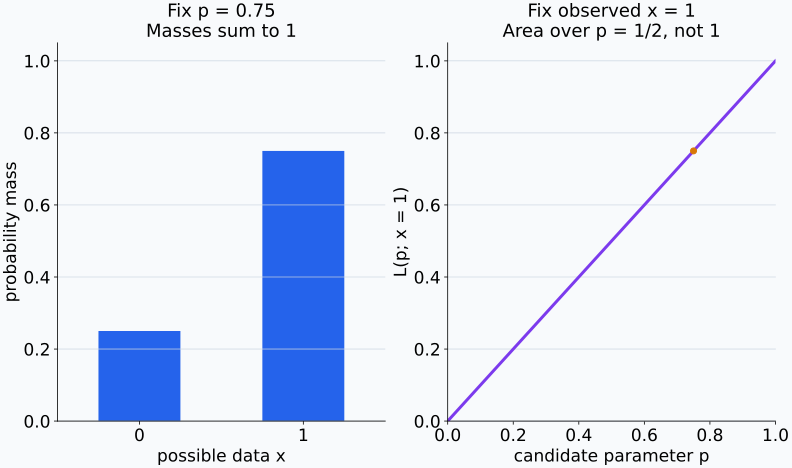
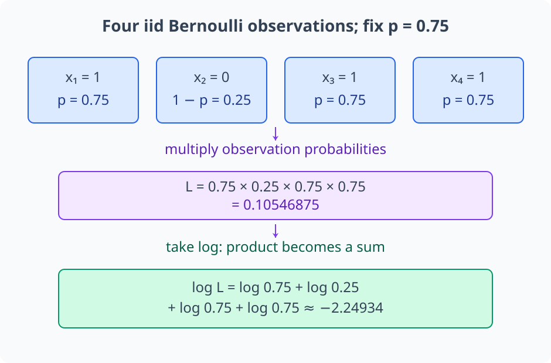
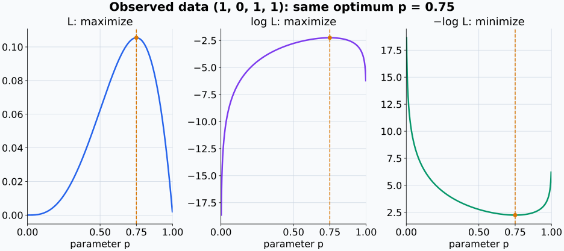
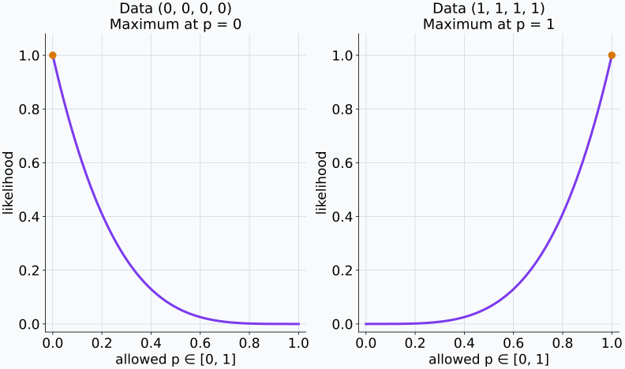
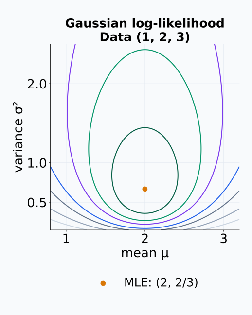
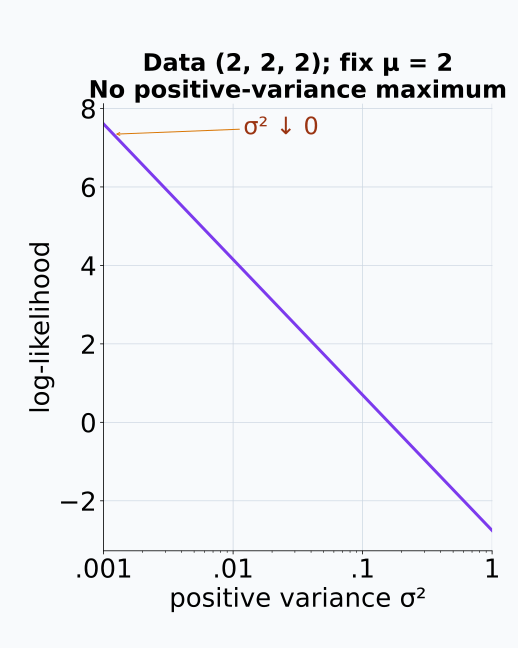
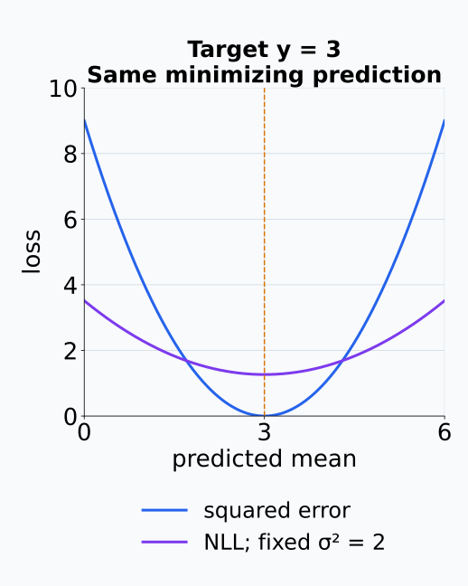
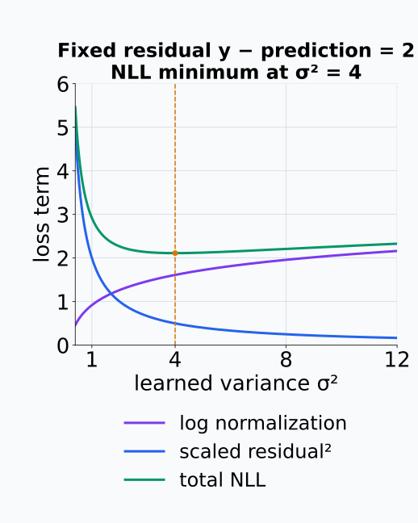
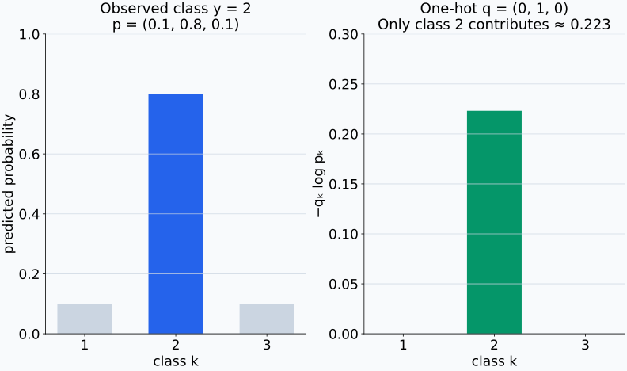
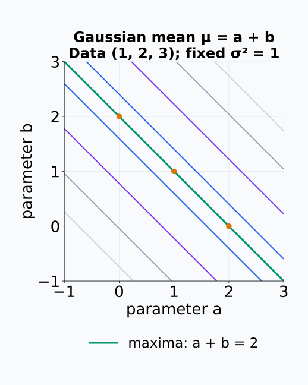

# M04-11. likelihood와 최대우도추정

## 이 단원이 필요한 이유

확률모형 $p_\theta(x)$은 파라미터 $\theta$가 주어졌을 때 데이터가 나올 확률이나 밀도를 정한다. 데이터를 관측한 뒤에는 같은 식을 $\theta$의 함수로 읽어 어떤 파라미터가 관측값을 잘 설명하는지 비교한다. 이 함수가 likelihood이다.

최대우도추정은 관측 데이터의 likelihood를 가장 크게 만드는 파라미터를 고른다. 분류의 negative log-likelihood, 회귀의 squared error와 language model의 token loss는 이 원리로 연결된다. probability와 likelihood의 고정 대상을 구분해야 식의 조건 방향을 바르게 읽을 수 있다.

## 학습 목표

이 단원을 마치면 다음을 할 수 있다.

- probability model과 likelihood에서 고정하는 대상을 구분할 수 있다.
- iid sample의 likelihood를 곱으로, log-likelihood를 합으로 쓸 수 있다.
- Bernoulli 파라미터의 maximum likelihood estimator를 유도할 수 있다.
- Gaussian 평균과 분산의 MLE를 계산할 수 있다.
- negative log-likelihood를 optimization loss로 바꿀 수 있다.
- Gaussian NLL과 squared error, categorical NLL과 cross entropy의 연결을 설명할 수 있다.
- MLE가 보장하지 않는 identifiability와 generalization 주장을 제한할 수 있다.

## 선수지식 확인

- 선수 단원: [M01-07 지수함수와 로그함수의 미분](../M01/M01-07-exponential-log-derivatives.md)
- 선수 단원: [M04-02 조건부확률과 Bayes 규칙](M04-02-conditional-probability-bayes-rule.md)
- 선수 단원: [M04-05 주요 분포](M04-05-common-distributions.md)
- 선수 단원: [M04-07 추정, 편향과 분산](M04-07-estimation-bias-variance.md)
- 확인 질문: 곱의 로그를 합으로 바꾸고 로그함수를 미분할 수 있는가?
- 확인 질문: Bernoulli와 Gaussian PMF·PDF의 파라미터를 설명할 수 있는가?

## 기호와 용어

| 표기·용어 | Common spoken reading | 의미 | 고정·변화 대상 |
|---|---|---|---|
| $p_\theta(x)$ | `p sub theta of x` | $\theta$가 정하는 확률모형 | $\theta$ 고정, $x$ 변화 |
| $L(\theta;x)$ | `L of theta given x` | 관측 $x$를 고정하고 $p_\theta(x)$를 $\theta$의 함수로 읽은 것 | $x$ 고정, $\theta$ 변화 |
| $\ell(\theta;x)$ | `ell of theta given x` | likelihood의 자연로그 | $\log L(\theta;x)$ |
| $\widehat\theta_{\mathrm{MLE}}$ | `theta hat sub M L E` | likelihood를 최대화하는 파라미터 | argmax |
| NLL | `N L L` | log-likelihood의 음수 | minimization loss |
| $\mathcal D$ | `calligraphic D` | 관측 sample | $\{x_1,\ldots,x_n\}$ |

## 핵심 개념 1. likelihood는 같은 식을 파라미터 방향으로 읽는다

확률모형은 파라미터 $\theta$를 고정하고 가능한 데이터 $x$에 확률이나 밀도를 배정한다.

\[
x\longmapsto p_\theta(x).
\]

데이터 $x$를 관측한 뒤 likelihood function은

\[
L(\theta;x)=p_\theta(x)
\]

로 정의한다. 수식값은 같지만 입력으로 움직이는 대상을 $\theta$로 본다.

이산모형에서 $p_\theta(x)$는 probability mass이고 연속모형에서는 density이다. 연속 likelihood 값은 1보다 클 수 있다. likelihood는 $\theta$에 대한 probability distribution이 아니므로

\[
\int L(\theta;x)\,d\theta=1
\]

을 만족할 필요가 없다.

같은 Bernoulli 식도 어느 축을 움직이는지에 따라 다르게 읽힌다.

<figure class="lesson-figure lesson-figure--wide" markdown="1">
  
  <figcaption>왼쪽은 p=0.75를 고정한 두 가능한 관측값의 probability mass이고, 오른쪽은 관측 x=1을 고정한 L(p;1)=p이다. 오른쪽 곡선 아래 p 방향 넓이는 1/2이며, likelihood에 파라미터 방향 정규화가 요구되지 않는다는 작은 예시다.</figcaption>
</figure>

## 핵심 개념 2. iid likelihood는 관측별 항의 곱이다

$X_1,\ldots,X_n\overset{\mathrm{iid}}{\sim}p_\theta$이고 관측값이 $x_1,\ldots,x_n$이면 joint likelihood는

\[
L(\theta;\mathcal D)
=\prod_{i=1}^{n}p_\theta(x_i)
\]

이다. 곱 형태는 모형의 $\theta$를 고정했을 때 관측들이 독립이라는 가정에서 나온다. identical distribution 조건은 각 관측에 같은 $p_\theta$를 쓰게 한다. 시계열이나 cluster data에서는 joint density를 dependence 구조에 맞게 써야 한다.

작은 probability를 많이 곱하면 floating-point underflow가 생길 수 있다. 자연로그를 취하면

\[
\ell(\theta;\mathcal D)
=\log L(\theta;\mathcal D)
=\sum_{i=1}^{n}\log p_\theta(x_i)
\]

가 된다. 로그는 증가함수이므로 likelihood와 log-likelihood를 최대화하는 $\theta$가 같다.

각 항이 양수인 후보에서는 곱의 로그를 항별 로그의 합으로 바꿀 수 있다. 관측값의 probability mass나 density가 0이어서 likelihood가 0인 후보는 log-likelihood를 $-\infty$로 처리한다. likelihood가 양수인 후보가 있다면 이런 후보는 최대점이 될 수 없다. 연속모형에서는 한 점의 확률이 아니라 그 점의 density를 비교하므로, $P(X=x)=0$이라는 이유로 log-likelihood가 모두 $-\infty$가 되는 것은 아니다.

관측별 확률을 먼저 계산하면 곱의 로그가 합으로 바뀌는 위치를 따라갈 수 있다.

<figure class="lesson-figure lesson-figure--wide" markdown="1">
  
  <figcaption>관측 (1,0,1,1)과 후보 p=0.75를 고정하면 네 항의 곱은 0.10546875다. 각 항의 로그를 더하면 같은 likelihood의 log 값 약 −2.24934를 얻는다. 관측별 곱은 iid 모형 가정 아래의 계산이다.</figcaption>
</figure>

## 핵심 개념 3. maximum likelihood estimator는 데이터 적합을 최대화한다

최대우도추정(maximum likelihood estimation, MLE)은

\[
\widehat\theta_{\mathrm{MLE}}
\in\operatorname*{argmax}_{\theta}
L(\theta;\mathcal D)
\]

또는

\[
\widehat\theta_{\mathrm{MLE}}
\in\operatorname*{argmax}_{\theta}
\ell(\theta;\mathcal D)
\]

로 정의한다. 최대점이 여러 개면 MLE도 여러 개일 수 있다. 파라미터 symmetry나 identifiability 문제로 서로 다른 $\theta$가 같은 likelihood를 만들 수 있다.

최대화 문제를 minimization으로 구현할 때 negative log-likelihood를 쓴다.

\[
\mathcal L_{\mathrm{NLL}}(\theta)
=-\ell(\theta;\mathcal D)
=-\sum_{i=1}^{n}\log p_\theta(x_i).
\]

평균 NLL은 위 식을 $n$으로 나눈다. 양의 상수 배율은 minimizer를 바꾸지 않지만 loss의 수치 scale과 gradient scale에는 영향을 준다.

관측 자료를 넣어 최대점을 고르는 전체 규칙은 estimator이고, 지금 자료에서 고른 파라미터는 estimate다. 미분값 0인 점을 찾는 것은 최대점 후보를 찾는 단계일 뿐이다. 허용한 파라미터 범위의 경계, 최대값의 존재와 여러 후보의 likelihood도 확인해야 한다. 최대값에 가까워질 수만 있고 허용한 범위 안에서 그 값에 도달하지 못하면 위 argmax는 비어 있을 수 있다.

세 목적함수의 값과 최적화 방향은 달라도 최적 파라미터의 위치는 같다.

<figure class="lesson-figure lesson-figure--wide" markdown="1">
  
  <figcaption>관측 (1,0,1,1)에서는 L과 log L의 최대점, −log L의 최소점이 모두 p=0.75에 놓인다. 세로축은 서로 다른 목적함수 값이므로 곡선의 높이를 그대로 비교하지 않고 최적점의 가로 위치를 비교한다.</figcaption>
</figure>

## 핵심 개념 4. Bernoulli MLE는 관측 성공 비율이다

$x_i\in\{0,1\}$이고 $X_i\overset{\mathrm{iid}}{\sim}\operatorname{Bernoulli}(p)$라 하자. likelihood는

\[
L(p;\mathcal D)
=\prod_{i=1}^{n}p^{x_i}(1-p)^{1-x_i}
=p^{\sum_i x_i}(1-p)^{n-\sum_i x_i}
\]

이다. 이 거듭제곱·로그 계산은 먼저 $0<p<1$에서 수행한다. $k=\sum_i x_i$라 두면 log-likelihood는

\[
\ell(p)=k\log p+(n-k)\log(1-p).
\]

$0<k<n$에서 미분하면

\[
\frac{d\ell}{dp}
=\frac{k}{p}-\frac{n-k}{1-p}.
\]

이를 0으로 두면

\[
k(1-p)=(n-k)p
\]

이고

\[
\widehat p_{\mathrm{MLE}}=\frac{k}{n}=\bar x
\]

를 얻는다. $k=0$이나 $k=n$이면 maximum은 boundary $p=0$이나 $p=1$에 있다.

미분식을 통분하면 $(k-np)/(p(1-p))$다. 분모가 양수이므로 $p<k/n$에서는 log-likelihood가 증가하고 $p>k/n$에서는 감소한다. 따라서 $0<k<n$에서 이 정지점은 최대점이다. $k=0$이면 관측이 모두 0이므로 likelihood는 $(1-p)^n$이고, $k=n$이면 모두 1이므로 $p^n$이다. 두 식의 최대점을 직접 고르면 경계 해를 얻으며, $0^0$이나 $0\log0$을 그대로 계산할 필요가 없다.

모든 관측이 같은 값이면 내부 정지점 대신 허용 구간의 끝을 확인한다.

<figure class="lesson-figure lesson-figure--wide" markdown="1">

  

  <figcaption>모두 0인 자료의 likelihood는 (1−p)⁴이고 모두 1인 자료는 p⁴이다. p를 [0,1]에서 허용하면 각각 0과 1이 최대점이다. 열린 구간 0&lt;p&lt;1만 허용한다면 끝값에 접근할 뿐 그 최대값을 얻는 파라미터는 없다.</figcaption>
</figure>

## 핵심 개념 5. Gaussian MLE는 표본평균과 분모 $n$의 분산이다

$X_i\overset{\mathrm{iid}}{\sim}\mathcal N(\mu,\sigma^2)$이며 $\sigma^2>0$라 하자. 우선 관측값이 모두 같지는 않은 sample을 다룬다. 상수를 포함한 log-likelihood는

\[
\ell(\mu,\sigma^2)
=-\frac n2\log(2\pi)
-\frac n2\log\sigma^2
-\frac{1}{2\sigma^2}
\sum_{i=1}^{n}(x_i-\mu)^2.
\]

$\mu$에 대해 최대화하면

\[
\widehat\mu_{\mathrm{MLE}}=\bar x
\]

이고, $\sigma^2$에 대해 최대화하면

\[
\widehat{\sigma^2}_{\mathrm{MLE}}
=\frac1n\sum_{i=1}^{n}(x_i-\bar x)^2
\]

이다. 이 variance MLE는 finite sample에서 아래쪽 bias를 가진다. 불편 sample variance의 분모 $n-1$과 목적이 다르다. MLE는 likelihood 최대화 기준에서 나온다.

평균에 대한 편미분은

\[
\frac{\partial\ell}{\partial\mu}
=\frac1{\sigma^2}\sum_i(x_i-\mu)
=\frac n{\sigma^2}(\bar x-\mu)
\]

다. $\mu<\bar x$에서 증가하고 $\mu>\bar x$에서 감소하므로 어떤 양수 분산에서도 $\bar x$가 평균의 최대점이다. 분산을 하나의 변수 $\sigma^2$로 미분하면

\[
\frac{\partial\ell}{\partial(\sigma^2)}
=-\frac n{2\sigma^2}
+\frac{\sum_i(x_i-\mu)^2}{2(\sigma^2)^2}
\]

다. $\mu=\bar x$를 대입하고 분자를 0으로 두면 $n\sigma^2=\sum_i(x_i-\bar x)^2$를 얻는다. 이 양수 해의 아래에서는 증가하고 위에서는 감소한다. M04-07에서 같은 제곱편차 합의 기댓값이 $(n-1)\sigma^2$였으므로, 분모 $n$의 추정량 기댓값은 $(n-1)\sigma^2/n$이다. 이 계산이 아래쪽 bias와 분모 $n-1$인 불편추정량의 차이를 설명한다.

관측값이 모두 같으면 $\mu=\bar x$에서 제곱편차가 0이다. 이때 $\sigma^2$를 0에 가깝게 줄일수록 log-likelihood가 한없이 커지므로 양수 분산 범위에는 최대점이 없다. 공식에 0이 나온다고 해서 variance 0을 가진 통상적인 Gaussian PDF의 MLE가 존재하는 것은 아니다.

평균과 분산을 함께 움직이면 자료에 가장 높은 density를 배정하는 조합을 찾는다.

<figure class="lesson-figure" markdown="1">
  
  <figcaption>관측 (1,2,3)의 log-likelihood 등고선이다. 한 선 위에서는 값이 같고, 중앙의 최대점은 (μ,σ²)=(2,2/3)이다. 그림은 파라미터 공간의 적합도이며 μ와 σ²의 probability density가 아니다.</figcaption>
</figure>

관측값이 전부 같을 때에는 같은 모형에서도 최대점의 존재가 달라진다.

<figure class="lesson-figure" markdown="1">
  
  <figcaption>관측 (2,2,2)에서 μ=2로 두면 양수 분산을 줄일수록 log-likelihood가 커진다. 가로축은 로그 눈금이며, 표시한 가장 작은 분산이 최적값인 것은 아니다. σ²&gt;0 범위에는 유한한 최대점이 없다.</figcaption>
</figure>

## 핵심 개념 6. Gaussian NLL은 squared error와 연결된다

회귀모델이

\[
Y\mid X=\mathbf x
\sim\mathcal N(f_\theta(\mathbf x),\sigma^2)
\]

을 가정하고 $\sigma^2$을 고정했다고 하자. sample 하나의 NLL은

\[
-\log p_\theta(y\mid\mathbf x)
=\frac12\log(2\pi\sigma^2)
+\frac{(y-f_\theta(\mathbf x))^2}{2\sigma^2}.
\]

첫 항과 $1/(2\sigma^2)$은 $\theta$와 무관하므로 $\theta$에 대한 NLL minimization은 squared error minimization과 같은 solution을 가진다.

모델이 $\sigma^2_\theta(\mathbf x)$도 예측하면 log variance 항과 scale된 squared error 항이 모두 학습에 영향을 준다. residual을 크게 허용하려고 variance만 키우면 log variance penalty도 커진다.

Gaussian density의 지수에 있던 음의 제곱편차는 로그를 취한 뒤 부호를 바꾸면 양의 squared error 항이 된다. 정규화 계수 $1/\sqrt{2\pi\sigma^2}$에서는 $\tfrac12\log(2\pi\sigma^2)$가 나온다. 모든 sample에 같은 고정 양수 분산을 사용하면 전체 NLL도 제곱오차 합에 양수 상수를 곱하고 파라미터와 무관한 상수를 더한 식이다. sample별로 고정 분산이 다르면 제곱오차마다 가중치가 달라지고, 분산을 학습하면 두 항 모두 파라미터에 의존한다. 따라서 고정 공통 분산일 때의 동치를 그대로 사용할 수 없다.

고정 분산과 학습하는 분산에서는 최적화에 포함되는 항이 다르다.

<figure class="lesson-figure" markdown="1">
  
  <figcaption>target y=3과 공통 고정 분산 σ²=2에서 NLL은 squared error에 양수 배율과 상수를 적용한 곡선이다. 두 곡선의 최소 위치는 모두 predicted mean=3이며 최소 loss 값 자체는 같지 않다.</figcaption>
</figure>

<figure class="lesson-figure" markdown="1">
  
  <figcaption>residual을 2로 고정하고 분산만 움직인 예시다. 분산 증가로 제곱오차 항은 줄지만 log normalization 항은 커져 총 NLL은 σ²=4에서 최소가 된다. 분산도 학습할 때에는 제곱오차 항만 줄이는 계산으로 대체할 수 없다.</figcaption>
</figure>

## 핵심 개념 7. categorical NLL은 관측 class의 log probability를 사용한다

한 sample의 target class가 $y$이고 모델의 categorical probability가 $p_\theta(k\mid\mathbf x)$이면 NLL은

\[
\mathcal L_{\mathrm{NLL}}
=-\log p_\theta(y\mid\mathbf x)
\]

이다. one-hot target $q_k=\mathbf 1\{k=y\}$를 사용하면

\[
-\sum_{k=1}^{K}q_k\log p_\theta(k\mid\mathbf x)
=-\log p_\theta(y\mid\mathbf x)
\]

이다. 이 식이 one-hot target에 대한 categorical cross entropy이다. M04-12에서 일반 target distribution으로 확장한다.

language model에서는 각 token position의 observed next token에 같은 NLL을 계산하고 position·batch에 대해 합이나 평균을 낸다.

one-hot의 0은 관측하지 않은 class의 로그항을 이 sample의 합에서 제거한다.

<figure class="lesson-figure lesson-figure--wide" markdown="1">
  
  <figcaption>관측 class가 2이고 p=(0.1,0.8,0.1)이면 q=(0,1,0)이다. 오른쪽의 class별 −qₖ log pₖ 중 두 번째 항만 약 0.223을 기여한다. 다른 sample에서는 그 sample의 관측 class가 새로 선택된다.</figcaption>
</figure>

## 핵심 개념 8. MLE는 모형·표집·optimization 가정에 의존한다

MLE는 선택한 model family 안에서 training data likelihood를 최대화한다. true data distribution이 model family 밖에 있으면 MLE도 misspecified model의 최적 적합을 찾는다. training likelihood가 높아도 held-out data에서 높은 likelihood를 보장하지 않는다.

파라미터가 비식별적이면 같은 distribution을 나타내는 MLE가 여러 개일 수 있다. local optimum이나 optimization error 때문에 계산한 parameter가 global MLE와 다를 수도 있다.

regularization을 더한 objective는 순수 MLE와 다르다. penalty를 prior의 negative log-density로 해석하면 maximum a posteriori(MAP) estimation과 연결할 수 있지만, prior와 penalty의 대응을 명시해야 한다.

같은 분포를 나타내는 파라미터가 여럿이면 likelihood의 최대점도 한 점으로 정해지지 않는다.

<figure class="lesson-figure" markdown="1">
  
  <figcaption>평균을 μ=a+b로 표시하고 분산 1을 고정한 Gaussian 예시다. 자료 (1,2,3)에서는 a+b=2인 초록 선 전체가 같은 최대 likelihood를 갖는다. (0,2), (1,1), (2,0)은 다른 파라미터지만 같은 적합 분포를 나타낸다.</figcaption>
</figure>

## 예제 1. Bernoulli likelihood 계산하기

### 문제

관측 데이터가 $(1,0,1,1)$이다. Bernoulli likelihood와 log-likelihood를 쓰고 MLE를 구한다.

### 풀이

성공 수는 $k=3$, sample size는 $n=4$이다.

\[
L(p)=p^3(1-p)
\]

이고

\[
\ell(p)=3\log p+\log(1-p)
\]

이다. Bernoulli MLE 공식으로

\[
\widehat p_{\mathrm{MLE}}
=\frac34=0.75.
\]

### 결과의 의미

관측 성공 비율이 likelihood를 최대화하는 Bernoulli 성공확률이다. 다른 sample에서는 MLE 값도 달라진다.

## 예제 2. 두 Bernoulli parameter 비교하기

같은 데이터 $(1,0,1,1)$에서

\[
L(0.5)=(0.5)^4=0.0625
\]

이고

\[
L(0.75)=(0.75)^3(0.25)=0.10546875
\]

이다. $p=0.75$가 이 두 후보 중 더 높은 likelihood를 준다.

## 예제 3. Gaussian MLE 계산하기

관측값이 $(1,2,3)$이면

\[
\widehat\mu_{\mathrm{MLE}}=2.
\]

variance MLE는

\[
\widehat{\sigma^2}_{\mathrm{MLE}}
=\frac{(1-2)^2+(2-2)^2+(3-2)^2}{3}
=\frac23.
\]

불편 sample variance는 분모 2를 사용해 1이 된다. 두 값은 서로 다른 기준에서 나온다.

## 예제 4. categorical NLL 비교하기

true class가 2이고 두 모델이 class 2에 각각 $0.8$과 $0.4$를 배정했다고 하자. NLL은

\[
-\log0.8\approx0.223,
\qquad
-\log0.4\approx0.916
\]

이다. observed class에 더 높은 probability를 배정한 첫 모델의 NLL이 작다. 다른 class probability와 전체 evaluation sample도 함께 봐야 모델 전체를 비교할 수 있다.

## 흔한 오해

### 오해 1. likelihood는 파라미터가 참일 확률이다

likelihood는 데이터를 고정한 파라미터의 평가 함수이며 파라미터에 대해 합이나 적분이 1일 필요가 없다. posterior probability에는 prior와 normalization이 필요하다.

### 오해 2. likelihood가 1보다 크면 잘못된 모형이다

연속모형의 likelihood는 density value라서 1보다 클 수 있다. 구간에 적분한 probability가 $[0,1]$ 범위에 있어야 한다.

### 오해 3. log-likelihood를 최대화하면 다른 estimator가 나온다

로그는 증가함수이므로 likelihood와 log-likelihood의 maximizer가 같다. log scale은 곱을 합으로 바꾸고 numerical underflow를 줄인다.

### 오해 4. MLE는 불편추정량이다

MLE는 likelihood maximization으로 정의한다. Gaussian variance MLE처럼 finite-sample bias를 가진 MLE도 있다.

### 오해 5. training NLL이 가장 작은 모델이 실제 분포를 찾았다

training NLL은 선택한 model family와 관측 training data 안의 적합도를 나타낸다. held-out likelihood, distribution shift와 model misspecification을 별도로 평가해야 한다.

## 연습문제

### 1. probability와 likelihood

$p_\theta(x)$를 probability model로 읽을 때와 $L(\theta;x)$로 읽을 때 각각 무엇을 고정하고 무엇을 변화시키는지 설명하라.

해설 보기

probability model에서는 $\theta$를 고정하고 가능한 $x$에 probability나 density를 배정한다. likelihood에서는 관측 $x$를 고정하고 $\theta$를 변화시키며 관측값에 부여한 probability나 density를 비교한다.

### 2. iid likelihood

관측값이 $(x_1,x_2,x_3)$이고 각 density가 $p_\theta(x_i)$이다. iid likelihood와 log-likelihood를 쓰라.

해설 보기

\[
L(\theta;\mathcal D)
=p_\theta(x_1)p_\theta(x_2)p_\theta(x_3),
\]

\[
\ell(\theta;\mathcal D)
=\log p_\theta(x_1)+\log p_\theta(x_2)+\log p_\theta(x_3).
\]

### 3. Bernoulli MLE

관측 Bernoulli 데이터가 $(0,1,0,1,1)$이다. $p$의 MLE를 구하라.

해설 보기

성공 수는 3이고 sample size는 5이므로

\[
\widehat p_{\mathrm{MLE}}=\frac35=0.6.
\]

### 4. Gaussian MLE

관측값이 $(2,4)$이고 Gaussian의 평균과 variance를 모두 추정한다. 두 MLE를 구하라.

해설 보기

평균 MLE는

\[
\widehat\mu=\frac{2+4}{2}=3.
\]

variance MLE는

\[
\widehat{\sigma^2}
=\frac{(2-3)^2+(4-3)^2}{2}
=1.
\]

### 5. categorical NLL

true class가 3이고 예측 probability가 $(0.2,0.3,0.5)$이다. sample NLL을 구하라.

해설 보기

관측 class 3에 배정한 probability는 $0.5$이므로

\[
\mathcal L_{\mathrm{NLL}}
=-\log0.5
\approx0.693.
\]

### 6. Gaussian NLL과 squared error

고정 variance가 $\sigma^2=2$인 Gaussian regression에서 prediction mean이 3이고 target이 5이다. parameter-dependent NLL 항을 구하라.

해설 보기

parameter-dependent squared error 항은

\[
\frac{(5-3)^2}{2\sigma^2}
=\frac4{4}
=1.
\]

$\frac12\log(2\pi\sigma^2)$은 prediction mean parameter와 무관한 상수이다.

### 7. 모델 주장 비판

한 신경망이 training data에서 가장 높은 likelihood를 얻었다. “이 모델이 실제 데이터 생성분포와 내부 mechanism을 복원했다”라는 결론을 평가하라.

해설 보기

높은 training likelihood는 선택한 model family 안에서 관측 training data에 높은 probability나 density를 배정했다는 뜻이다. held-out generalization과 model misspecification을 확인해야 실제 분포 적합을 평가할 수 있다. 같은 input-output distribution을 만드는 다른 parameterization이나 mechanism도 존재할 수 있으므로 likelihood만으로 내부 mechanism을 식별할 수 없다.

## 단원 요약

- probability model은 parameter를 고정하고 data를 변화시키며, likelihood는 관측 data를 고정하고 parameter를 변화시킨다.
- iid sample likelihood는 관측별 probability·density의 곱이고 log-likelihood는 로그항의 합이다.
- MLE는 likelihood나 log-likelihood를 최대화하는 estimator이다.
- Bernoulli MLE는 관측 성공 비율이다.
- Gaussian mean MLE는 표본평균이고 variance MLE는 분모 $n$의 제곱편차 평균이다.
- Gaussian fixed-variance NLL은 squared error와, categorical NLL은 one-hot cross entropy와 연결된다.
- MLE는 identifiability, model correctness와 held-out generalization을 보장하지 않는다.

## 통과 기준

다음 질문에 자료를 보지 않고 답할 수 있으면 통과한다.

- probability와 likelihood에서 고정하는 대상을 구분할 수 있는가?
- iid likelihood와 log-likelihood를 쓸 수 있는가?
- Bernoulli MLE를 미분해 구할 수 있는가?
- Gaussian mean·variance MLE를 계산할 수 있는가?
- NLL을 minimization loss로 읽을 수 있는가?
- Gaussian·categorical NLL과 흔한 loss를 연결할 수 있는가?
- training likelihood가 보장하지 않는 주장을 설명할 수 있는가?

## 다음 단원

- [M04-12 entropy와 cross entropy](M04-12-entropy-cross-entropy.md)

## 집필자 점검표

- [x] 학습 목표가 관찰 가능한 행동으로 작성됐다.
- [x] probability와 likelihood의 고정 대상을 구분했다.
- [x] iid likelihood와 log-likelihood를 설명했다.
- [x] Bernoulli·Gaussian MLE를 유도했다.
- [x] NLL과 optimization loss를 연결했다.
- [x] categorical NLL과 cross entropy를 연결했다.
- [x] 모든 문제에 해설이 있다.
- [x] 모델 해석 주장의 강도를 구분했다.
- [x] 용어집과 표기 규칙을 따랐다.
- [x] 선수지식 밖의 내용을 몰래 요구하지 않는다.
- [x] 내부 링크와 수식 구분자를 확인했다.
- [x] Common spoken reading이 실제 영어 학술 발화이며 한글 음역이나 기계적 직역을 포함하지 않는다.
