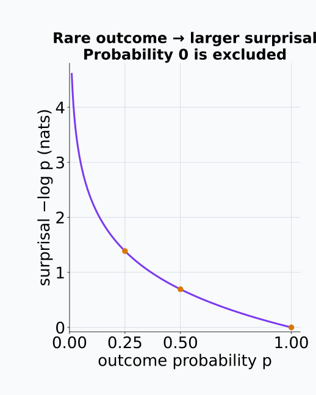
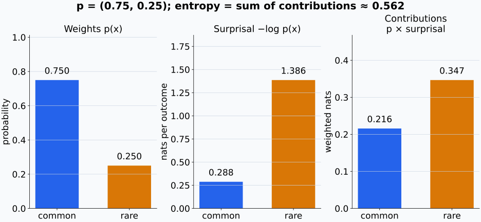
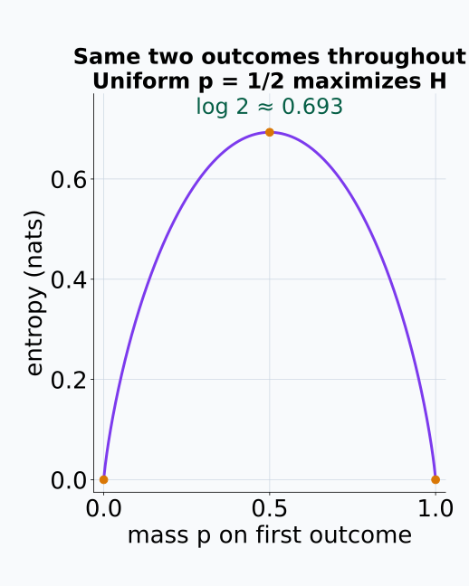
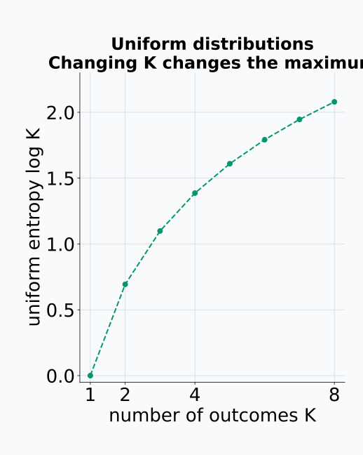
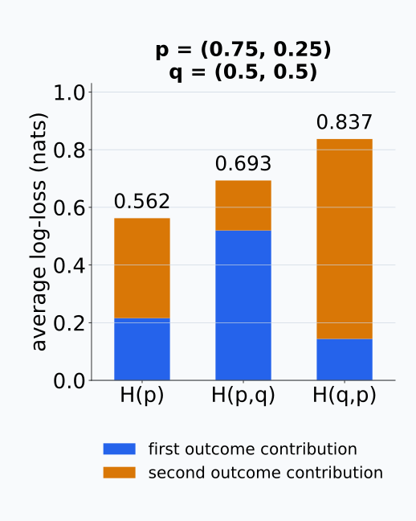
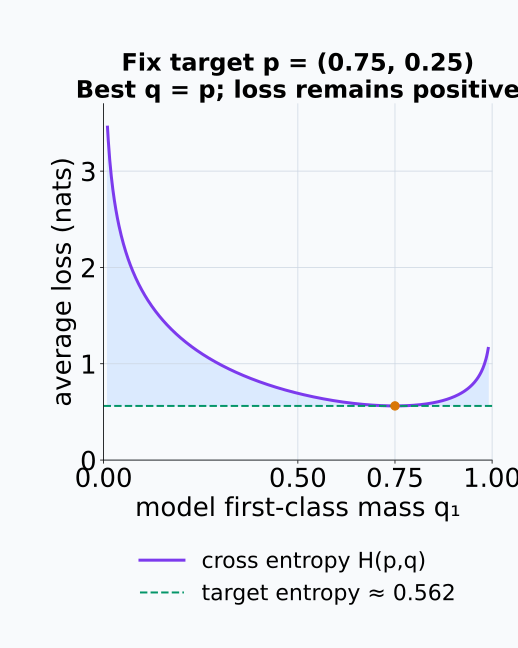
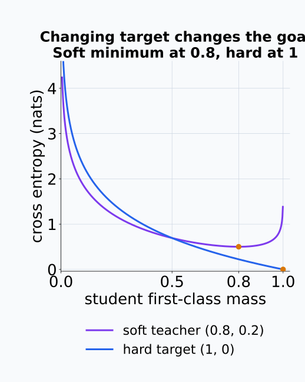
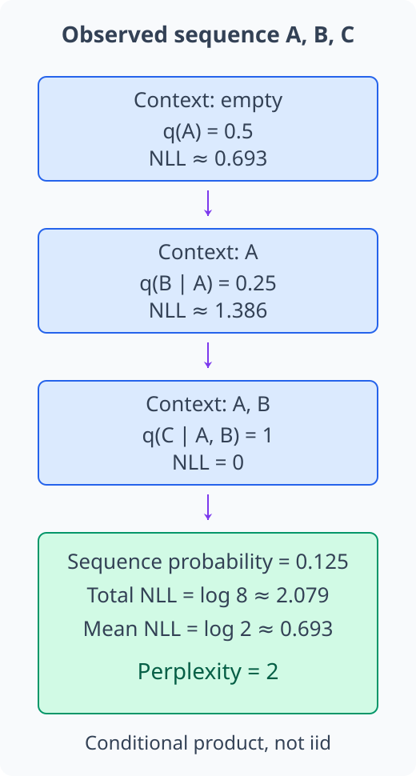
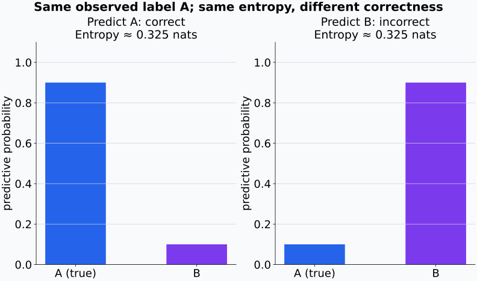

# M04-12. entropy와 cross entropy

## 이 단원이 필요한 이유

확률이 낮은 결과를 관측하면 그 결과의 negative log-probability가 커진다. entropy는 이 surprisal을 같은 분포에서 평균해 분포의 불확실성을 요약한다. cross entropy는 target distribution에서 나온 결과를 다른 distribution의 log-probability로 평가한다.

분류의 cross-entropy loss, language model의 token NLL과 knowledge distillation의 soft-target loss가 이 정의를 사용한다. entropy 값만 보고 모델의 정확성, 지식이나 인과적 mechanism을 단정하지 않으려면 계산 대상과 평균 분포를 밝혀야 한다.

## 학습 목표

이 단원을 마치면 다음을 할 수 있다.

- self-information과 entropy를 negative log-probability의 기대값으로 설명할 수 있다.
- 작은 이산분포의 entropy를 nats와 bits로 계산할 수 있다.
- deterministic distribution과 uniform distribution의 entropy를 비교할 수 있다.
- cross entropy $\mathrm H(p,q)$의 두 분포 역할을 구분할 수 있다.
- one-hot target의 cross entropy가 categorical NLL과 같음을 계산할 수 있다.
- soft-target cross entropy와 language-model perplexity를 계산할 수 있다.
- predictive entropy가 정확성이나 모델의 지식에 대해 보장하지 않는 내용을 설명할 수 있다.

## 선수지식 확인

- 선수 단원: [M00-05 거듭제곱과 로그](../M00/M00-05-exponents-logarithms.md)
- 선수 단원: [M00-10 AI 수식 읽기](../M00/M00-10-ai-equation-reading.md)
- 선수 단원: [M04-04 기댓값, 분산과 공분산](M04-04-expectation-variance-covariance.md)
- 선수 단원: [M04-11 likelihood와 최대우도추정](M04-11-likelihood-maximum-likelihood.md)
- 확인 질문: 자연로그의 곱셈 법칙과 $-\log p$의 값 변화를 설명할 수 있는가?
- 확인 질문: categorical NLL을 observed class의 negative log-probability로 계산할 수 있는가?

## 기호와 용어

| 표기·용어 | Common spoken reading | 의미 | 단위·조건 |
|---|---|---|---|
| $I_p(x)$ | `I sub p of x` | 결과 $x$의 surprisal | $-\log p(x)$ |
| $\mathrm H(p)$ | `H of p` | $p$에서 self-information의 기댓값 | 자연로그면 nat |
| $\mathrm H(p,q)$ | `H of p comma q` | $p$의 결과를 $q$의 log-probability로 평가한 평균 | 방향 있음 |
| $D_{\mathrm{KL}}(p\Vert q)$ | `K L divergence from p to q` | cross entropy와 entropy의 차이 | M04-13에서 전개 |
| $q_\theta(y\mid x)$ | `q sub theta of y given x` | 입력 $x$에서 class $y$에 배정한 probability | 합이 1 |
| perplexity | `perplexity` | 평균 NLL을 지수화한 값 | $\exp(\text{mean NLL})$ |

## 핵심 개념 1. self-information은 확률이 낮을수록 크다

분포 $p$에서 결과 $x$의 self-information 또는 surprisal을

\[
I_p(x)=-\log p(x)
\]

로 정의한다. $0<p(x)\le1$이면 $I_p(x)\ge0$이다. probability가 1인 결과는 surprisal 0을 가지고 probability가 0에 가까워질수록 surprisal이 커진다.

독립인 두 결과 $x,y$가 함께 나올 probability가 $p(x,y)=p(x)p(y)$이면

\[
I_p(x,y)
=-\log[p(x)p(y)]
=I_p(x)+I_p(y)
\]

이다. 로그를 사용하면 독립 결과의 joint surprisal이 합으로 분해된다.

자연로그를 사용하면 단위는 nat이고 밑이 2인 로그를 사용하면 bit이다. 이 프로젝트는 별도 언급이 없으면 자연로그를 사용한다.

surprisal 곡선은 probability가 0에 가까워질 때의 변화와 probability 1에서의 기준값을 보여 준다.

<figure class="lesson-figure" markdown="1">

  

  <figcaption>자연로그의 −log p 곡선이다. 표시한 점 p=1/4, 1/2, 1의 surprisal은 각각 약 1.386, 0.693, 0 nats이다. p=0에서 유한한 함수값이 있는 것은 아니며 그림의 왼쪽 끝도 작은 양수까지만 그렸다.</figcaption>
</figure>

## 핵심 개념 2. entropy는 같은 분포에서 surprisal을 평균한다

유한 이산분포 $p$의 entropy는

\[
\mathrm H(p)
=\mathbb E_{X\sim p}[-\log p(X)]
=-\sum_x p(x)\log p(x)
\]

이다. $p(x)=0$인 항은 연속성에 따라 $0\log0=0$으로 둔다.

entropy는 결과를 관측하기 전 distribution 자체의 평균 surprisal이다. 가능한 outcome 수와 probability가 퍼진 정도에 영향을 받는다. entropy는 outcome 값 사이의 거리나 의미를 사용하지 않는다.

기댓값의 합에서 각 outcome의 surprisal $-\log p(x)$에 그 outcome이 나올 비중 $p(x)$를 곱한다. 드문 outcome은 한 번 관측했을 때 surprisal이 크지만, 평균에서는 그만큼 자주 나타나지 않는다는 가중치도 받는다. 따라서 가장 드문 결과의 surprisal과 분포 전체의 entropy는 같은 수가 아니다. 확률 0인 결과는 이 평균에 기여하지 않으므로 그 항을 0으로 처리하는 convention을 사용한다.

평균을 계산할 때에는 각 결과의 surprisal에 probability 가중치를 적용한다.

<figure class="lesson-figure lesson-figure--wide" markdown="1">
  
  <figcaption>p=(0.75,0.25)에서 드문 둘째 결과는 surprisal이 크지만 평균에서는 0.25의 가중치를 받는다. 오른쪽 두 막대의 합 약 0.562가 entropy다. 패널마다 세로축의 대상과 범위가 다르므로 개별 surprisal을 entropy 값으로 읽지 않는다.</figcaption>
</figure>

## 핵심 개념 3. deterministic distribution은 entropy 0을 가진다

어떤 결과 $x_0$에 probability 1을 배정하면

\[
\mathrm H(p)
=-1\log1
=0
\]

이다. 관측 전에 결과가 정해져 있어 surprisal이 없다.

$K$개 outcome에 같은 probability $1/K$를 배정한 uniform distribution에서는

\[
\mathrm H(p)
=-\sum_{k=1}^{K}\frac1K\log\frac1K
=\log K
\]

이다. 같은 $K$개 outcome을 가진 distribution 중 uniform distribution이 entropy를 최대화한다. M04-13에서 KL divergence를 사용해 이 성질을 다시 설명한다.

uniform 식에서는 각 결과의 surprisal이 모두 $\log K$다. 같은 수에 총합 1인 가중치를 곱해 평균하므로 결과도 $\log K$가 된다. 반대로 entropy의 각 항은 음수가 아니며, $0<p(x)<1$인 결과가 있으면 그 항은 양수다. 따라서 유한 이산분포에서 entropy가 0이라는 것은 질량이 한 결과에 모두 놓였다는 뜻이다. uniform 최대값을 비교할 때에는 같은 $K$개 결과 집합을 고정한다. 결과 집합을 늘리면 비교하는 최대값도 달라진다.

결과 집합을 고정한 비교와 결과 수 자체를 바꾸는 비교는 구분한다.

<figure class="lesson-figure" markdown="1">

  

  <figcaption>같은 두 결과에 (p,1−p)를 배정하면 양쪽 끝은 deterministic이고 entropy는 0이다. 균등한 p=1/2에서 최대값 log 2를 얻는다. endpoint의 확률 0 항은 0 log 0=0 convention으로 처리했다.</figcaption>
</figure>

<figure class="lesson-figure" markdown="1">
  
  <figcaption>각 K에서 probability가 1/K인 균등분포만 비교한 값이다. K가 늘어나면 최대 entropy log K도 커진다. 점을 잇는 선은 증가 추세를 읽기 위한 것이며 outcome 수 K는 정수다.</figcaption>
</figure>

## 핵심 개념 4. cross entropy는 target $p$의 결과를 model $q$로 평가한다

두 이산분포 $p,q$에 대해 cross entropy를

\[
\mathrm H(p,q)
=\mathbb E_{X\sim p}[-\log q(X)]
=-\sum_x p(x)\log q(x)
\]

로 정의한다. 평균을 만드는 distribution은 $p$이고 log-probability를 제공하는 distribution은 $q$이다. 두 자리를 바꾸면 값도 달라질 수 있다.

$p(x)>0$인 outcome에 $q(x)=0$을 배정하면 cross entropy는 무한대이다. target에서 나올 수 있는 결과에 model이 zero probability를 배정했기 때문이다.

$p(x)=0$인 결과는 target 평균에 기여하지 않으므로 합에서 제외할 수 있다. $p$와 $q$가 모두 0인 항도 0으로 처리한다. entropy와 달리, 여기서 평균의 가중치 $p(x)$와 surprisal을 계산하는 $q(x)$는 서로 다른 분포다. $q(x)$를 작게 만들면 그 결과의 log-loss는 커지지만, 평균에 얼마나 반영할지는 여전히 $p(x)$가 결정한다.

cross entropy는

\[
\mathrm H(p,q)
=\mathrm H(p)+D_{\mathrm{KL}}(p\Vert q)
\]

로 분해된다. $p$가 고정된 학습 문제에서는 $\mathrm H(p)$가 model parameter와 무관하므로 cross entropy minimization이 $D_{\mathrm{KL}}(p\Vert q)$ minimization과 연결된다.

$q=p$를 대입하면 cross entropy는 target 자체의 entropy로 돌아간다. target을 바꾸지 않고 $q$만 학습하는 동안 $\mathrm H(p)$는 고정된 기준값이며, 위 분해에서 변하는 부분은 두 분포 사이의 KL 항이다. target entropy가 양수인 문제에서는 분포를 일치시켜도 cross entropy가 0일 필요가 없다. KL의 정의와 비음수성은 다음 단원에서 확인한다.

두 분포의 역할을 바꾸면 각 결과의 평균 기여도 달라진다.

<figure class="lesson-figure" markdown="1">
  
  <figcaption>p=(0.75,0.25), q=(0.5,0.5)에서 두 색의 높이는 각 결과의 가중 log-loss 기여다. H(p)≈0.562, H(p,q)≈0.693, H(q,p)≈0.837로, 평균 가중치와 평가 확률을 맞바꾸면 합이 달라진다.</figcaption>
</figure>

모델 분포가 target과 같아져도 target 자체의 평균 surprisal은 남는다.

<figure class="lesson-figure" markdown="1">
  
  <figcaption>target p=(0.75,0.25)를 고정하고 q=(q₁,1−q₁)를 움직였다. 최솟값은 q=p에서 H(p)≈0.562이며 0이 아니다. target entropy 기준선 위의 파란 차이가 KL 항이고, 정확한 비음수성은 다음 단원에서 확인한다.</figcaption>
</figure>

## 핵심 개념 5. one-hot cross entropy는 observed class의 NLL이다

target class가 $y$이고 one-hot target distribution이

\[
p_k=\mathbf 1\{k=y\}
\]

이면 model distribution $q_\theta$에 대한 cross entropy는

\[
\begin{aligned}
\mathrm H(p,q_\theta)
&=-\sum_{k=1}^{K}p_k\log q_\theta(k\mid x)\\
&=-\log q_\theta(y\mid x).
\end{aligned}
\]

categorical NLL과 같은 식이다. dataset에서 평균을 내면 empirical cross-entropy loss가 된다.

\[
\widehat{\mathcal L}_{\mathrm{CE}}(\theta)
=-\frac1n\sum_{i=1}^{n}
\log q_\theta(y_i\mid x_i).
\]

softmax logits에서 이 값을 계산할 때는 log-softmax나 log-sum-exp 구현을 사용해 overflow와 underflow를 줄인다.

## 핵심 개념 6. soft target은 class 전체의 probability를 사용한다

target distribution $p=(p_1,\ldots,p_K)$가 one-hot이 아니면

\[
\mathrm H(p,q_\theta)
=-\sum_{k=1}^{K}p_k\log q_{\theta,k}
\]

의 여러 항이 loss에 기여한다. label smoothing은 one-hot target의 일부 질량을 다른 class에 나눈다. knowledge distillation은 teacher distribution $p_T$를 target으로 두고 student distribution $p_S$를 평가할 수 있다.

\[
\mathcal L_{\mathrm{KD}}
=-\sum_{k=1}^{K}p_{T,k}\log p_{S,k}.
\]

이 loss는 teacher output distribution을 student가 맞추도록 한다. teacher의 내부 computation이나 causal mechanism까지 같아진다는 조건은 포함하지 않는다.

예를 들어 teacher가 $(0.8,0.2)$를 주면 최빈 class는 첫째지만 둘째 class의 coefficient도 $0.2$로 남는다. student가 첫째 class만 맞추려고 둘째 확률을 0에 가깝게 줄이면 $-0.2\log p_{S,2}$가 커진다. teacher의 argmax class 하나를 hard label로 바꾸면 이 항이 없어져 원래 soft-target 목적과 달라진다. soft target은 정답 index뿐 아니라 class 사이에 질량을 나눈 비율도 학습에 사용한다.

같은 student를 평가해도 soft target과 argmax hard label은 서로 다른 최적점을 요구한다.

<figure class="lesson-figure" markdown="1">
  
  <figcaption>teacher (0.8,0.2)를 그대로 사용하는 loss는 student의 첫째 class probability가 0.8일 때 최소다. teacher의 argmax만 남긴 (1,0) target은 probability 1을 선호한다. 둘째 class에 대한 teacher 질량을 없애면 학습 목적 자체가 달라진다.</figcaption>
</figure>

## 핵심 개념 7. language-model cross entropy는 token NLL의 평균이다

token sequence $y_1,\ldots,y_T$에서 model이 이전 token을 조건으로 다음 token distribution을 만든다고 하자. sequence NLL은

\[
-\log q_\theta(y_{1:T})
=-\sum_{t=1}^{T}
\log q_\theta(y_t\mid y_{<t})
\]

이다. token당 평균 NLL을 $\bar\ell$이라 하면 perplexity는

\[
\operatorname{PPL}=e^{\bar\ell}
\]

이다. 자연로그 대신 base-2 logarithm을 사용하면 $2^{\bar\ell_{\mathrm{bits}}}$로 쓴다.

sequence 식은 곱셈 규칙 $q_\theta(y_{1:T})=\prod_t q_\theta(y_t\mid y_{<t})$에 로그를 취한 것이다. 각 token은 앞의 token을 조건으로 평가하므로 token들이 iid라는 가정은 필요하지 않다. 관측 token의 확률이 모두 양수일 때 평균 NLL을 지수화하면

\[
\operatorname{PPL}
=\left(\prod_{t=1}^{T}q_\theta(y_t\mid y_{<t})\right)^{-1/T}
\]

이다. 즉 관측 token 확률의 기하평균을 역수로 바꾼 값이다. 매 위치에서 관측 token에 같은 확률 $1/K$를 주면 perplexity는 $K$가 되지만, 일반적인 값은 실제 vocabulary 크기를 세는 수가 아니다.

perplexity가 낮으면 평가 sequence의 observed token에 기하평균 기준으로 더 높은 probability를 배정했다는 뜻이다. tokenizer, evaluation corpus와 token averaging rule이 다르면 수치를 직접 비교하기 어렵다.

관측 token과 그 앞의 context를 함께 따라가면 conditional probability의 곱이 만들어지는 위치를 확인할 수 있다.

<figure class="lesson-figure" markdown="1">

  

  <figcaption>구성한 sequence A,B,C의 관측 token 확률은 0.5, 0.25, 1이다. 조건부 곱은 0.125, 총 NLL은 log 8, token당 평균은 log 2여서 perplexity는 2다. context를 조건으로 사용하는 계산이며 iid token이나 vocabulary 크기 2라는 주장을 뜻하지 않는다.</figcaption>
</figure>

## 핵심 개념 8. predictive entropy는 분포의 퍼짐을 요약한다

분류모델이 입력 $x$에서 predictive distribution $q_\theta(y\mid x)$를 만들면 predictive entropy는

\[
\mathrm H\bigl(q_\theta(\cdot\mid x)\bigr)
=-\sum_y q_\theta(y\mid x)
\log q_\theta(y\mid x)
\]

이다. 값이 크면 model probability가 class들에 퍼져 있고 값이 작으면 일부 class에 집중돼 있다.

낮은 predictive entropy는 예측이 맞다는 보장이 아니다. model이 틀린 class에 높은 probability를 주면 entropy는 낮고 prediction은 틀린다. entropy 하나로 data uncertainty와 parameter uncertainty를 분해할 수도 없다.

activation을 binning한 뒤 계산한 entropy는 bin boundary와 coordinate choice에 의존한다. 낮거나 높은 activation entropy를 feature 수나 semantic complexity와 바로 연결하면 안 된다.

정답과 비교하지 않는 entropy 계산은 두 예측의 정확성 차이를 담지 않는다.

<figure class="lesson-figure lesson-figure--wide" markdown="1">
  
  <figcaption>같은 정답 A에서 (0.9,0.1)과 (0.1,0.9)는 entropy가 모두 약 0.325 nats다. 첫 모델의 최빈 class는 맞고 둘째 모델은 틀리다. 낮은 entropy는 질량이 집중됐다는 뜻이며 그 집중 위치가 정답이라는 보장은 아니다.</figcaption>
</figure>

## 예제 1. binary distribution의 entropy

### 문제

$p=(1/2,1/2)$의 entropy를 natural log와 base-2 log로 각각 계산한다.

### 풀이

자연로그를 사용하면

\[
\mathrm H(p)
=-2\left(\frac12\log\frac12\right)
=\log2
\approx0.693\ \text{nats}
\]

이다. base-2 log를 사용하면

\[
\mathrm H_2(p)
=-2\left(\frac12\log_2\frac12\right)
=1\ \text{bit}
\]

이다.

### 결과의 의미

같은 uncertainty를 log base에 따라 nat이나 bit로 표현한다.

## 예제 2. target entropy와 cross entropy 비교하기

$p=(0.75,0.25)$이고 $q=(0.5,0.5)$라 하자.

\[
\mathrm H(p)
=-0.75\log0.75-0.25\log0.25
\approx0.562
\]

이다. cross entropy는

\[
\mathrm H(p,q)
=-0.75\log0.5-0.25\log0.5
=-\log0.5
\approx0.693
\]

이다. $q$가 $p$의 불균형을 반영하지 못해 추가 log-loss가 생긴다.

## 예제 3. one-hot cross entropy

true class가 2이고 model probability가

\[
q=(0.1,0.7,0.2)
\]

이면

\[
\mathcal L_{\mathrm{CE}}
=-\log0.7
\approx0.357
\]

이다. 다른 class의 항은 one-hot target coefficient가 0이어서 직접 합에 남지 않는다. softmax normalization을 통해 logits 전체가 $q_2$에 영향을 준다.

## 예제 4. distillation cross entropy

teacher distribution이 $p_T=(0.8,0.2)$이고 student distribution이 $p_S=(0.6,0.4)$라 하자.

\[
\begin{aligned}
\mathrm H(p_T,p_S)
&=-0.8\log0.6-0.2\log0.4\\
&\approx0.8(0.511)+0.2(0.916)\\
&\approx0.592.
\end{aligned}
\]

teacher가 두 class에 배정한 probability가 모두 student loss에 기여한다.

## 흔한 오해

### 오해 1. entropy는 분포의 variance와 같다

entropy는 probability mass의 평균 surprisal이고 variance는 수치값 사이의 제곱거리를 사용한다. categorical label처럼 값 사이 거리를 정하지 않은 분포에도 entropy를 계산할 수 있다.

### 오해 2. entropy가 높으면 모델이 틀렸다

높은 predictive entropy는 class probability가 퍼져 있음을 뜻한다. 정답 여부는 observed label과 예측을 비교해야 한다.

### 오해 3. cross entropy는 대칭이다

$\mathrm H(p,q)$는 $p$에서 결과를 평균하고 $q$의 log-probability로 평가한다. 두 분포의 역할을 바꾸면 값이 달라질 수 있다.

### 오해 4. cross-entropy loss가 0이면 distribution이 가깝다

one-hot target에서 loss 0은 observed class에 probability 1을 배정한 경우이다. finite dataset의 loss만으로 population distribution과의 일치나 calibration을 보장하지 않는다.

### 오해 5. distillation cross entropy가 낮으면 student 내부가 teacher와 같다

output distribution을 맞추는 loss는 input-output behavior를 제약한다. 서로 다른 representation과 computation이 같은 output distribution을 만들 수 있다.

## 연습문제

### 1. self-information

probability가 $1/4$인 결과의 self-information을 nats와 bits로 구하라.

해설 보기

자연로그에서는

\[
-\log\frac14=\log4\approx1.386\ \text{nats}.
\]

base-2 log에서는

\[
-\log_2\frac14=2\ \text{bits}.
\]

### 2. deterministic entropy

$p=(1,0,0)$의 entropy를 구하라.

해설 보기

\[
\mathrm H(p)
=-1\log1-0\log0-0\log0
=0.
\]

$0\log0=0$ convention을 사용한다.

### 3. categorical entropy

$p=(0.5,0.25,0.25)$의 entropy를 nats로 계산하라.

해설 보기

\[
\begin{aligned}
\mathrm H(p)
&=-0.5\log0.5-2(0.25\log0.25)\\
&\approx0.3466+0.6931\\
&\approx1.0397\ \text{nats}.
\end{aligned}
\]

### 4. one-hot cross entropy

true class가 1이고 model probability가 $(0.8,0.15,0.05)$이다. cross-entropy loss를 구하라.

해설 보기

\[
\mathcal L_{\mathrm{CE}}
=-\log0.8
\approx0.223.
\]

one-hot target이므로 observed class 1의 negative log-probability만 남는다.

### 5. soft-target cross entropy

target $p=(0.6,0.4)$이고 model $q=(0.75,0.25)$이다. $\mathrm H(p,q)$를 구하라.

해설 보기

\[
\begin{aligned}
\mathrm H(p,q)
&=-0.6\log0.75-0.4\log0.25\\
&\approx0.6(0.288)+0.4(1.386)\\
&\approx0.727.
\end{aligned}
\]

### 6. perplexity

token당 평균 NLL이 2 nats이다. perplexity를 구하라.

해설 보기

\[
\operatorname{PPL}=e^2\approx7.39.
\]

같은 tokenizer와 evaluation corpus를 사용한 결과 사이에서 비교해야 한다.

### 7. 모델 주장 비판

한 입력에서 predictive entropy가 매우 낮았다. “모델이 이 입력을 이해했고 예측도 맞다”라는 결론을 평가하라.

해설 보기

낮은 entropy는 model probability가 일부 class에 집중됐다는 사실만 보여 준다. observed label과 비교해야 correctness를 알 수 있고 calibration data가 있어야 confidence의 신뢰성을 평가할 수 있다. 이해나 내부 mechanism에 관한 주장은 behavior·intervention 증거를 추가로 요구한다.

## 단원 요약

- self-information은 outcome의 negative log-probability이다.
- entropy는 같은 distribution에서 self-information을 평균한 값이다.
- $K$개 outcome의 uniform distribution entropy는 $\log K$이고 deterministic distribution entropy는 0이다.
- cross entropy는 target $p$에서 평균한 model $q$의 negative log-probability이다.
- one-hot cross entropy는 categorical NLL과 같다.
- soft target은 class 전체의 probability로 cross entropy를 계산한다.
- language-model perplexity는 token당 평균 NLL의 지수이고 predictive entropy는 class probability의 퍼짐을 요약한다.

## 통과 기준

다음 질문에 자료를 보지 않고 답할 수 있으면 통과한다.

- self-information과 entropy를 계산할 수 있는가?
- nat과 bit를 log base로 구분할 수 있는가?
- deterministic·uniform distribution의 entropy를 비교할 수 있는가?
- $\mathrm H(p,q)$에서 target과 model distribution을 구분할 수 있는가?
- one-hot cross entropy와 NLL을 연결할 수 있는가?
- soft-target loss와 perplexity를 계산할 수 있는가?
- predictive entropy가 보장하지 않는 주장을 설명할 수 있는가?

## 다음 단원

- [M04-13 KL divergence](M04-13-kl-divergence.md)

## 집필자 점검표

- [x] 학습 목표가 관찰 가능한 행동으로 작성됐다.
- [x] self-information과 entropy를 정의했다.
- [x] nat과 bit를 구분했다.
- [x] cross entropy의 두 distribution 역할을 밝혔다.
- [x] one-hot·soft-target loss를 계산했다.
- [x] perplexity와 predictive entropy의 한계를 설명했다.
- [x] 모든 문제에 해설이 있다.
- [x] 모델 해석 주장의 강도를 구분했다.
- [x] 용어집과 표기 규칙을 따랐다.
- [x] 선수지식 밖의 내용을 몰래 요구하지 않는다.
- [x] 내부 링크와 수식 구분자를 확인했다.
- [x] Common spoken reading이 실제 영어 학술 발화이며 한글 음역이나 기계적 직역을 포함하지 않는다.
