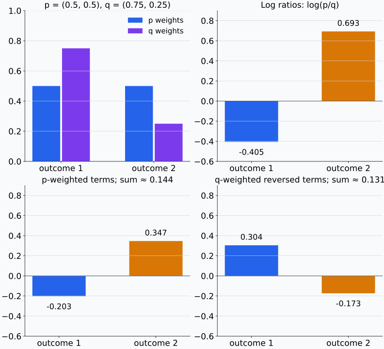
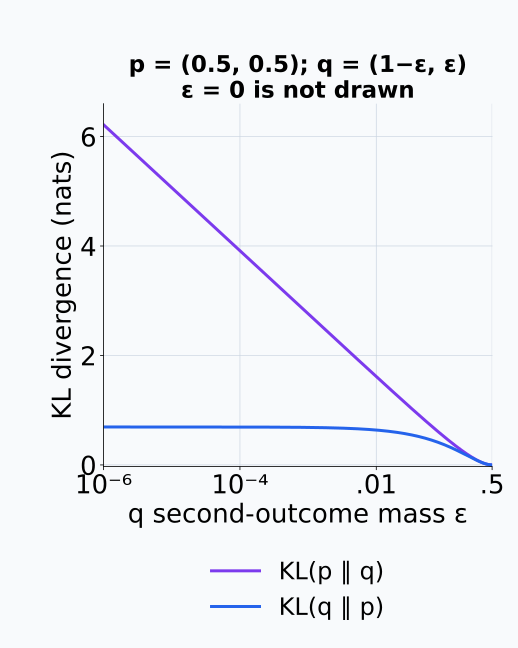
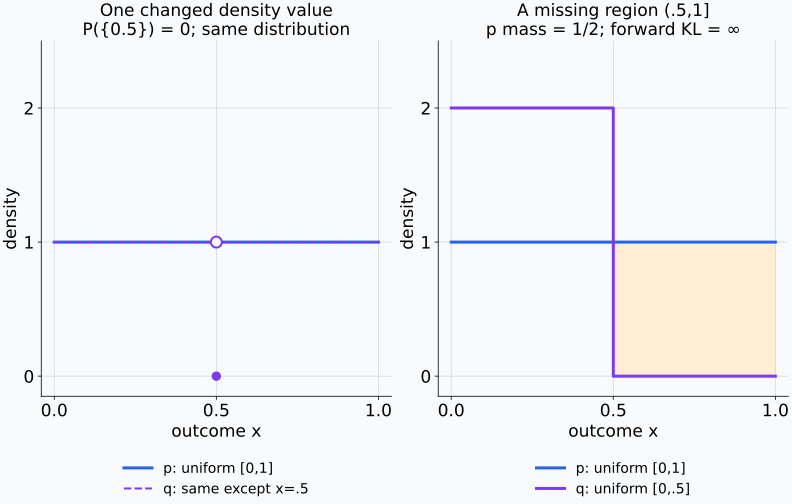
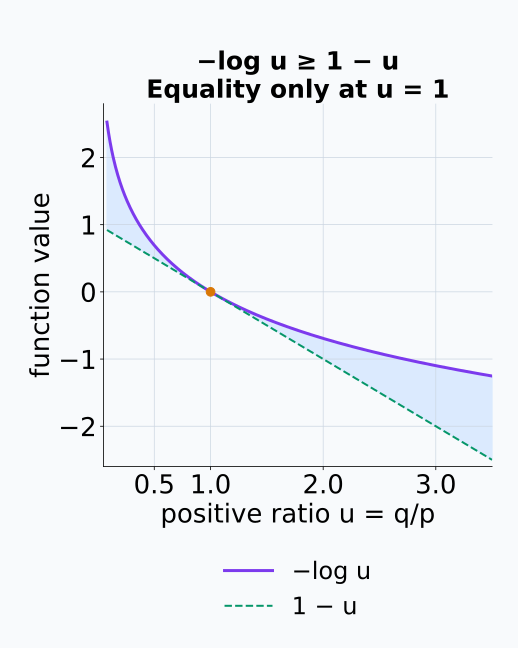
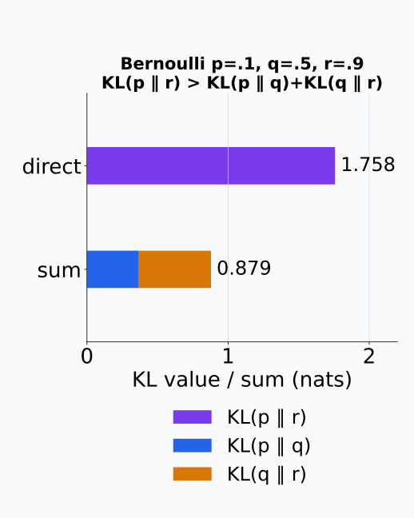
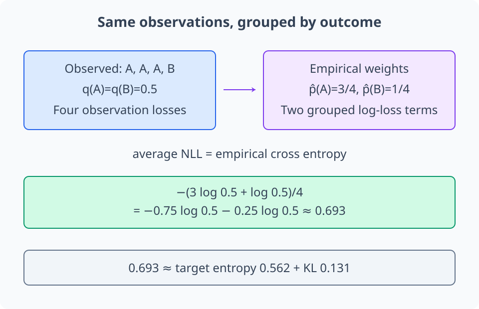
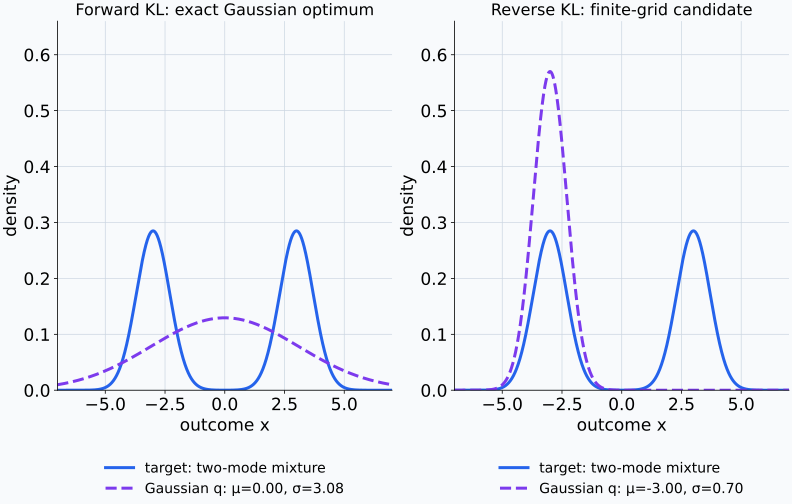
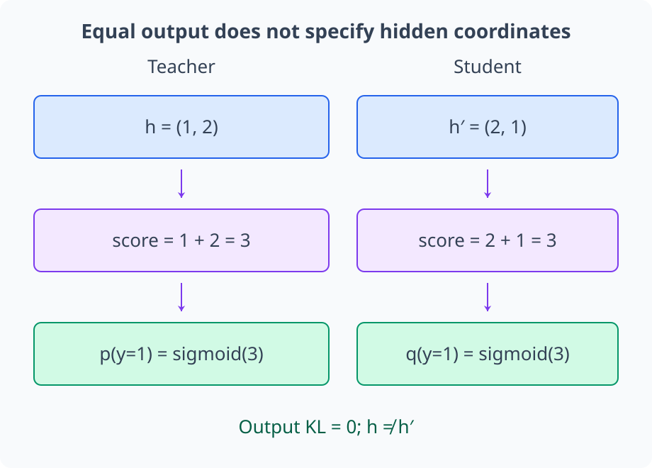

# M04-13. KL divergence

## 이 단원이 필요한 이유

cross entropy는 target distribution $p$에서 나온 결과를 model distribution $q$로 평가한다. target 자체의 entropy를 빼면 $q$가 $p$와 어긋나서 추가로 드는 log-loss가 남는다. 이 차이가 Kullback-Leibler divergence(KL divergence)이다.

KL divergence는 maximum likelihood, variational inference, knowledge distillation과 representation distribution 비교에 나타난다. 방향을 바꾸면 평균을 내는 분포와 강하게 벌주는 support mismatch가 달라진다. 대칭성과 triangle inequality가 없으므로 Euclidean distance처럼 해석할 수 없다.

## 학습 목표

이 단원을 마치면 다음을 할 수 있다.

- 이산·연속분포의 KL divergence 수식을 읽을 수 있다.
- $D_{\mathrm{KL}}(p\Vert q)$에서 평균분포와 평가분포를 구분할 수 있다.
- 작은 categorical·Bernoulli 분포의 KL divergence를 계산할 수 있다.
- KL divergence의 비음수성과 0이 되는 조건을 설명할 수 있다.
- KL divergence의 비대칭성과 support mismatch를 예제로 확인할 수 있다.
- cross entropy, entropy와 KL divergence의 관계를 사용할 수 있다.
- 작은 output KL이 모델 내부의 동일성이나 인과 mechanism을 보장하는지 판단할 수 있다.

## 선수지식 확인

- 선수 단원: [M04-03 확률변수와 확률분포](M04-03-random-variables-distributions.md)
- 선수 단원: [M04-11 likelihood와 최대우도추정](M04-11-likelihood-maximum-likelihood.md)
- 선수 단원: [M04-12 entropy와 cross entropy](M04-12-entropy-cross-entropy.md)
- 확인 질문: $\mathrm H(p,q)$에서 어떤 분포로 평균하고 어떤 분포의 log-probability를 쓰는지 설명할 수 있는가?
- 확인 질문: probability 0에 negative log를 적용할 때 값이 어떻게 되는지 설명할 수 있는가?

## 기호와 용어

| 표기·용어 | Common spoken reading | 의미 | 조건 |
|---|---|---|---|
| $D_{\mathrm{KL}}(p\Vert q)$ | `K L divergence from p to q` | $p$에서 평균한 log density ratio | 방향 있음 |
| $\log\frac{p(x)}{q(x)}$ | `log of p of x over q of x` | outcome $x$에서 $p$와 $q$의 상대 log-density | $p(x),q(x)>0$ |
| absolute continuity | `absolute continuity` | $q$가 확률 0을 주는 사건에 $p$도 확률 0을 주는 조건 | $p\ll q$ |
| forward KL | `forward KL` | target $p$를 첫 자리에 둔 $D_{\mathrm{KL}}(p\Vert q)$ | 문맥별 명칭 확인 |
| reverse KL | `reverse KL` | approximation $q$를 첫 자리에 둔 $D_{\mathrm{KL}}(q\Vert p)$ | 문맥별 명칭 확인 |

## 핵심 개념 1. KL divergence는 log density ratio의 기대값이다

같은 유한 결과 집합 위의 이산분포 $p,q$에 대해

\[
D_{\mathrm{KL}}(p\Vert q)
=\sum_x p(x)
\log\frac{p(x)}{q(x)}
\]

로 정의한다. 기대값 표기로는

\[
D_{\mathrm{KL}}(p\Vert q)
=\mathbb E_{X\sim p}
\left[
\log\frac{p(X)}{q(X)}
\right]
\]

이다. outcome은 $p$에서 뽑고, 각 outcome에서 $p$와 $q$의 log-probability 차이를 계산한다.

연속 density에는 합 대신 적분을 사용한다.

\[
D_{\mathrm{KL}}(p\Vert q)
=\int p(x)
\log\frac{p(x)}{q(x)}\,dx.
\]

자연로그를 쓰면 단위는 nat이다.

log ratio는 $\log p(x)-\log q(x)$다. $q(x)$가 $p(x)$보다 작으면 그 outcome의 항은 양수이고, 더 크면 음수일 수 있다. KL의 비음수성은 모든 outcome의 항이 양수라는 주장이 아니라 $p$로 가중해 합한 전체 값에 대한 성질이다. 아래에서는 $p(x)=0$인 항은 0으로 처리하고, $p(x)>0$인데 $q(x)=0$인 경우를 별도로 구분한다.

개별 log ratio와 그 가중합을 따로 보면 음수 항과 전체 비음수성을 구분할 수 있다.

<figure class="lesson-figure lesson-figure--wide" markdown="1">
  
  <figcaption>p=(0.5,0.5), q=(0.75,0.25)의 실제 계산이다. 위 오른쪽의 log ratio는 첫 결과에서 음수이고 둘째에서 양수다. 아래는 첫 분포의 가중치를 적용한 기여로, 합은 각각 약 0.144와 0.131 nats다. 방향을 바꾸면 log ratio의 부호뿐 아니라 평균 가중치도 바뀐다.</figcaption>
</figure>

## 핵심 개념 2. 첫 번째 분포가 평균과 중요 영역을 정한다

$D_{\mathrm{KL}}(p\Vert q)$의 각 항에는 $p(x)$가 가중치로 들어간다. $p$가 probability를 많이 둔 outcome에서 $q(x)$가 작으면 큰 penalty가 생긴다. $p(x)=0$인 outcome은 convention $0\log(0/q)=0$에 따라 직접 기여하지 않는다.

따라서 방향 표기 $p\Vert q$를 생략하면 어떤 영역의 오류를 강조하는지 알 수 없다. “두 분포의 KL”이라는 문장에는 방향을 함께 적어야 한다.

## 핵심 개념 3. support mismatch는 KL을 무한대로 만들 수 있다

유한 이산분포의 어떤 outcome $x$에서

\[
p(x)>0,
\qquad q(x)=0
\]

이면

\[
p(x)\log\frac{p(x)}{q(x)}=+\infty
\]

로 본다. 이 경우 $D_{\mathrm{KL}}(p\Vert q)=+\infty$이다. $p$에서 나올 수 있는 결과에 $q$가 zero probability를 배정했기 때문이다.

유한 이산분포에서 finite KL을 위해서는 $p$가 양수인 결과에서 $q$도 양수여야 한다. 이를 사건으로 쓰면 $q$가 확률 0을 주는 사건에 $p$도 확률 0을 준다는 조건이고, 측도론에서는 $p$가 $q$에 대해 절대연속($p\ll q$)이라고 표현한다.

연속 density에서는 한 점의 density 값을 바꾸어도 분포와 적분이 바뀌지 않을 수 있다. 따라서 단지 한 점에서 $p(x)>0,q(x)=0$이라는 이유로 KL이 무한대라고 결론 내리지 않는다. $q=0$인 영역 전체가 $p$에서 양의 확률을 받으면 문제가 생긴다. 절대연속 조건이 성립하더라도 log ratio의 적분이 발산하면 KL은 무한대일 수 있다. support 조건과 적분값의 유한성은 구분해야 한다.

작은 양수 probability가 0으로 접근하는 과정은 두 KL 방향에서 다르게 나타난다.

<figure class="lesson-figure" markdown="1">
  
  <figcaption>p=(0.5,0.5), q=(1−ε,ε)에서 둘째 model mass ε를 줄였다. 가로축은 로그 눈금이다. ε=0의 forward KL은 무한대이고 reverse KL은 log 2다. 유한한 가장 왼쪽 곡선값은 ε=10⁻⁶에서의 값이며 무한대를 유한한 높이로 표시한 것이 아니다.</figcaption>
</figure>

연속분포에서는 한 점의 density 수정과 양의 확률을 갖는 영역 누락을 구분한다.

<figure class="lesson-figure lesson-figure--wide" markdown="1">
  
  <figcaption>왼쪽은 uniform [0,1] density를 x=0.5 한 점에서만 0으로 바꾼 버전이다. 빈 점은 원래 높이를, 채운 점은 수정한 값을 표시하며 모든 사건 확률은 그대로다. 오른쪽 q는 uniform [0,0.5]여서 p가 probability 1/2를 주는 (0.5,1] 전체를 누락한다. 이 경우에는 forward KL이 무한대다.</figcaption>
</figure>

## 핵심 개념 4. KL divergence는 음수가 아니며 같은 분포에서 0이다

KL divergence는 Gibbs inequality에 따라

\[
D_{\mathrm{KL}}(p\Vert q)\ge0
\]

이다. $p,q$가 같은 support를 가지고 $p=q$이면 각 log ratio가 $\log1=0$이므로 KL도 0이다.

비음수성을 짧게 확인하려면 $-\log u\ge1-u$를 사용한다. $p(x)>0$인 항에서 $u=q(x)/p(x)$로 두면

\[
\begin{aligned}
D_{\mathrm{KL}}(p\Vert q)
&=\sum_x p(x)
\left[-\log\frac{q(x)}{p(x)}\right]\\
&\ge\sum_x p(x)
\left[1-\frac{q(x)}{p(x)}\right]\\
&=1-\sum_{x:p(x)>0}q(x)\\
&\ge0
\end{aligned}
\]

이다. 공통 positive support에서는 마지막 합이 1이다.

사용한 부등식은 $u-1-\log u\ge0$와 같다. $u>0$에서 이 식의 미분은 $1-1/u$이므로 $u<1$에서 감소하고 $u>1$에서 증가하며 $u=1$에서 최솟값 0을 가진다. 따라서 부등식의 equality는 $u=1$일 때만 성립한다. KL 계산에서 전체 equality를 얻으려면 $p(x)>0$인 모든 결과에서 $q(x)/p(x)=1$이어야 한다. 이 결과들에서 이미 $q$의 질량 합도 1이므로 나머지 결과에는 질량이 남지 않는다. 유한 이산분포에서는 모든 결과의 확률이 같을 때에만 KL이 0이다. 연속분포에서의 equality는 적분에 영향을 주지 않는 차이를 제외해 거의 모든 곳에서 density가 같다는 뜻이다.

같은 $K$개 결과 집합에서 $q(x)=1/K$로 두면

\[
D_{\mathrm{KL}}(p\Vert q)
=\sum_x p(x)\log p(x)+\log K
=\log K-\mathrm H(p)\ge0
\]

이다. 따라서 $\mathrm H(p)\le\log K$이고 equality는 $p=q$에서 성립한다. 이것이 M04-12의 uniform entropy 최대값을 주는 근거다.

Gibbs inequality에서 사용한 로그 부등식은 두 곡선이 만나는 위치로 확인할 수 있다.

<figure class="lesson-figure" markdown="1">
  
  <figcaption>u&gt;0에서 −log u 곡선은 1−u 직선보다 낮아지지 않고 u=1에서만 만난다. 본문은 각 positive p 결과에서 u=q/p를 대입하고 p 가중합을 취해 KL 비음수성과 equality 조건을 얻는다.</figcaption>
</figure>

## 핵심 개념 5. KL divergence는 대칭 거리가 아니다

일반적으로

\[
D_{\mathrm{KL}}(p\Vert q)
\ne
D_{\mathrm{KL}}(q\Vert p).
\]

첫 방향은 $p$가 자주 내는 outcome을 $q$가 얼마나 낮게 평가하는지 센다. 반대 방향은 $q$가 자주 내는 outcome에서 $p$를 평가한다. 평균분포가 바뀌므로 값도 바뀐다.

KL divergence는 triangle inequality도 만족하지 않는다. 따라서 두 분포 사이의 metric distance로 부르면 안 된다. 비음수이고 같은 분포에서 0이라는 성질만으로 metric이 되지는 않는다.

비대칭성과 별개로 triangle inequality도 작은 Bernoulli 예시에서 실패한다.

<figure class="lesson-figure" markdown="1">
  
  <figcaption>p=Bernoulli(0.1), q=Bernoulli(0.5), r=Bernoulli(0.9)에서 KL(p∥r)≈1.758이다. KL(p∥q)+KL(q∥r)≈0.879보다 크므로 metric의 triangle inequality를 만족하지 않는다. 막대 길이는 KL 값이며 분포 사이의 Euclidean 거리를 뜻하지 않는다.</figcaption>
</figure>

## 핵심 개념 6. cross entropy는 entropy와 KL divergence의 합이다

cross entropy를 전개하면

\[
\begin{aligned}
\mathrm H(p,q)
&=-\sum_x p(x)\log q(x)\\
&=-\sum_x p(x)\log p(x)
+\sum_x p(x)\log\frac{p(x)}{q(x)}\\
&=\mathrm H(p)+D_{\mathrm{KL}}(p\Vert q).
\end{aligned}
\]

target $p$가 고정되면 $\mathrm H(p)$도 고정된다. $q_\theta$에 대한 cross-entropy minimization은 $D_{\mathrm{KL}}(p\Vert q_\theta)$ minimization과 같은 optimizer를 가진다.

이산모형에서는 관측 index들 중 값 $x$가 차지하는 비율을 empirical distribution $\widehat p_n(x)$으로 사용한다. 같은 값을 가진 관측들의 log-loss를 묶으면

\[
\mathrm H(\widehat p_n,q_\theta)
=-\sum_x\widehat p_n(x)\log q_\theta(x)
=-\frac1n\sum_{i=1}^{n}\log q_\theta(x_i)
\]

가 된다. 이는 M04-11의 평균 NLL이므로 MLE와 empirical cross-entropy minimization이 연결된다. 연속모형의 관측값에 대한 평균 NLL도 계산할 수 있지만, 점들에 질량을 둔 empirical distribution을 연속 density처럼 취급해 위의 이산 KL 식에 그대로 넣지는 않는다.

같은 관측값의 log-loss를 결과별로 묶으면 empirical distribution의 가중치가 나타난다.

<figure class="lesson-figure lesson-figure--wide" markdown="1">
  
  <figcaption>관측 A,A,A,B에서 각 model probability가 0.5인 예시다. 네 loss의 평균은 결과별 빈도 3/4와 1/4로 가중한 cross entropy와 같다. 그 약 0.693 nats는 empirical target entropy 약 0.562와 KL 약 0.131로 분해된다. 이 그림은 이산 mass 계산이다.</figcaption>
</figure>

## 핵심 개념 7. KL 방향은 approximation의 행동을 바꾼다

target $p$가 서로 떨어진 여러 mode를 가진다고 하자. $D_{\mathrm{KL}}(p\Vert q)$는 $p$의 각 mode에서 $q$가 낮은 probability를 주면 penalty를 받으므로 여러 mode를 덮으려는 압력을 준다.

$D_{\mathrm{KL}}(q\Vert p)$는 $q$가 probability를 두는 영역에서 $p$가 낮으면 penalty를 받는다. 제한된 approximation family에서는 $q$가 $p$의 한 mode에 집중하는 solution이 나타날 수 있다. mode-covering과 mode-seeking이라는 표현은 이 경향을 요약하지만, 실제 결과는 distribution family와 optimization에 좌우된다.

근사 family를 하나의 Gaussian으로 제한하면 같은 target에서도 방향별 결과가 달라질 수 있다.

<figure class="lesson-figure lesson-figure--wide" markdown="1">
  
  <figcaption>target은 평균 −3과 3, 표준편차 0.7인 Gaussian의 동일 비중 mixture다. 왼쪽은 단일 Gaussian family의 정확한 forward KL 최소점으로 두 mode를 덮는다. 오른쪽은 명시한 유한 μ·σ 격자에서 수치 적분 KL이 가장 작은 후보이며 한 mode에 집중한다. 이 예시가 모든 family에서 mode-covering·seeking을 보장하는 것은 아니다.</figcaption>
</figure>

## 핵심 개념 8. output KL은 내부 representation 차이를 정하지 않는다

teacher $p_T(y\mid x)$와 student $p_S(y\mid x)$의 distillation loss에

\[
D_{\mathrm{KL}}(p_T\Vert p_S)
\]

를 사용할 수 있다. 이 값이 작으면 평가한 입력에서 두 output distribution이 가깝다는 뜻이다.

서로 다른 hidden dimension, basis와 computation graph가 같은 output distribution을 만들 수 있다. output KL 하나로 hidden representation alignment나 동일한 reasoning mechanism을 주장할 수 없다. 입력 distribution과 temperature를 바꾸면 측정한 KL 값도 달라질 수 있다.

출력의 동일성을 확인하는 계산은 hidden 좌표를 유일하게 정하지 않는다.

<figure class="lesson-figure lesson-figure--wide" markdown="1">
  
  <figcaption>구성한 두 모델에서 hidden 좌표 (1,2)와 (2,1)는 다르지만 둘을 더한 score는 모두 3이다. 같은 sigmoid output을 가지므로 이 입력의 output KL은 0이다. 이 계산만으로 hidden 좌표 대응이나 내부 circuit의 동일성을 확인할 수는 없다.</figcaption>
</figure>

## 예제 1. 두 binary distribution의 KL 계산

### 문제

$p=(0.5,0.5)$, $q=(0.75,0.25)$이다. $D_{\mathrm{KL}}(p\Vert q)$를 계산한다.

### 풀이

\[
\begin{aligned}
D_{\mathrm{KL}}(p\Vert q)
&=0.5\log\frac{0.5}{0.75}
+0.5\log\frac{0.5}{0.25}\\
&=0.5\log\frac23+0.5\log2\\
&=0.5\log\frac43\\
&\approx0.144\ \text{nats}.
\end{aligned}
\]

### 결과의 의미

$p$의 두 outcome을 같은 비중으로 평균했을 때 $q$를 사용해서 생기는 추가 log-loss가 약 $0.144$ nats이다.

## 예제 2. 방향을 바꾼 KL

같은 두 분포에서

\[
\begin{aligned}
D_{\mathrm{KL}}(q\Vert p)
&=0.75\log\frac{0.75}{0.5}
+0.25\log\frac{0.25}{0.5}\\
&=0.75\log1.5+0.25\log0.5\\
&\approx0.131\ \text{nats}.
\end{aligned}
\]

두 방향의 값 $0.144$와 $0.131$은 다르다.

## 예제 3. support mismatch

$p=(0.5,0.5)$이고 $q=(1,0)$이면 둘째 outcome에서 $p_2>0$, $q_2=0$이다. 따라서

\[
D_{\mathrm{KL}}(p\Vert q)=+\infty.
\]

반대 방향은

\[
D_{\mathrm{KL}}(q\Vert p)
=1\log\frac1{0.5}
=\log2
\]

이다. 방향에 따라 support mismatch가 평가되는 방식이 달라진다.

## 예제 4. cross entropy에서 KL 구하기

$\mathrm H(p)=0.50$ nats이고 $\mathrm H(p,q)=0.65$ nats이면

\[
D_{\mathrm{KL}}(p\Vert q)
=\mathrm H(p,q)-\mathrm H(p)
=0.15\ \text{nats}
\]

이다.

## 흔한 오해

### 오해 1. KL divergence는 두 분포 사이 거리이다

KL은 비대칭이고 triangle inequality를 만족하지 않는다. 방향성 있는 divergence로 불러야 한다.

### 오해 2. $D_{\mathrm{KL}}(p\Vert q)$와 $D_{\mathrm{KL}}(q\Vert p)$는 비슷한 역할을 한다

두 식은 서로 다른 분포에서 평균한다. support mismatch와 mode에 주는 penalty도 달라진다.

### 오해 3. KL이 작으면 각 outcome probability 차이도 작다

KL은 $p$로 가중한 평균 log ratio이다. probability가 작은 영역의 큰 pointwise 차이는 평균에서 작게 반영될 수 있다. 필요한 영역별 오류를 별도로 확인해야 한다.

### 오해 4. finite sample에서 추정한 KL은 정확한 population KL이다

empirical probability와 density estimator에는 sampling error와 estimation bias가 있다. high-dimensional continuous distribution의 KL estimation은 estimator 선택에 민감하다.

### 오해 5. teacher-student output KL이 작으면 두 모델의 지식이 같다

output behavior의 근접성은 평가한 입력과 temperature에 대한 결과이다. hidden representation, causal circuit과 distribution shift에서의 행동은 추가 분석이 필요하다.

## 연습문제

### 1. 방향 읽기

$D_{\mathrm{KL}}(p\Vert q)$에서 어떤 분포로 outcome을 평균하고 어떤 분포가 비교 대상으로 들어가는지 설명하라.

해설 보기

outcome은 $p$에서 평균한다. 각 outcome에서 $p(x)/q(x)$의 log ratio를 계산하므로 $q$가 $p$의 결과를 얼마나 낮게 평가하는지 측정한다.

### 2. categorical KL

$p=(0.5,0.5)$, $q=(0.25,0.75)$이다. $D_{\mathrm{KL}}(p\Vert q)$를 식으로 쓰고 근삿값을 구하라.

해설 보기

\[
\begin{aligned}
D_{\mathrm{KL}}(p\Vert q)
&=0.5\log2+0.5\log\frac23\\
&=0.5\log\frac43\\
&\approx0.144.
\end{aligned}
\]

### 3. 비대칭성

$p=(0.9,0.1)$, $q=(0.5,0.5)$에 대해 두 방향 KL의 식을 각각 쓰라. 수치 계산 없이 두 식이 같은 형태가 아닌 이유를 설명하라.

해설 보기

\[
D_{\mathrm{KL}}(p\Vert q)
=0.9\log\frac{0.9}{0.5}
+0.1\log\frac{0.1}{0.5},
\]

\[
D_{\mathrm{KL}}(q\Vert p)
=0.5\log\frac{0.5}{0.9}
+0.5\log\frac{0.5}{0.1}.
\]

첫 식은 $p$의 가중치 $0.9,0.1$을 쓰고 둘째 식은 $q$의 가중치 $0.5,0.5$를 쓴다.

### 4. support 조건

$p=(0.2,0.8)$, $q=(0,1)$일 때 $D_{\mathrm{KL}}(p\Vert q)$를 판단하라.

해설 보기

첫 outcome에서 $p_1=0.2>0$인데 $q_1=0$이다. $p_1\log(p_1/q_1)=+\infty$이므로 전체 KL은 $+\infty$이다.

### 5. entropy decomposition

$\mathrm H(p,q)=1.2$ nats이고 $\mathrm H(p)=0.9$ nats이다. $D_{\mathrm{KL}}(p\Vert q)$를 구하라.

해설 보기

\[
D_{\mathrm{KL}}(p\Vert q)
=1.2-0.9
=0.3\ \text{nats}.
\]

### 6. Bernoulli KL

$p=\operatorname{Bernoulli}(0.8)$, $q=\operatorname{Bernoulli}(0.6)$이다. $D_{\mathrm{KL}}(p\Vert q)$를 계산하라.

해설 보기

\[
\begin{aligned}
D_{\mathrm{KL}}(p\Vert q)
&=0.8\log\frac{0.8}{0.6}
+0.2\log\frac{0.2}{0.4}\\
&=0.8\log\frac43+0.2\log\frac12\\
&\approx0.8(0.288)-0.2(0.693)\\
&\approx0.092\ \text{nats}.
\end{aligned}
\]

### 7. distillation 주장 비판

student의 teacher-output KL이 test set에서 매우 작았다. “student가 teacher와 같은 representation과 reasoning circuit을 학습했다”라는 결론을 평가하라.

해설 보기

작은 KL은 해당 test input과 설정에서 output distribution이 가깝다는 증거이다. 같은 output을 만드는 hidden basis, feature와 computation은 여러 가지일 수 있다. representation similarity, activation intervention과 distribution shift 평가가 있어야 내부 동일성에 관한 주장을 검토할 수 있다.

## 단원 요약

- KL divergence는 $p$에서 평균한 $\log[p(x)/q(x)]$이다.
- $p$가 양수인 support에서 $q$가 0이면 $D_{\mathrm{KL}}(p\Vert q)$는 무한대이다.
- KL divergence는 음수가 아니고 적절한 equality 조건에서 같은 분포일 때 0이다.
- KL divergence는 비대칭이며 metric의 triangle inequality를 만족하지 않는다.
- cross entropy는 target entropy와 forward KL의 합이다.
- forward·reverse KL은 평균분포가 달라 approximation behavior도 달라질 수 있다.
- output KL은 hidden representation이나 causal mechanism의 동일성을 보장하지 않는다.

## 통과 기준

다음 질문에 자료를 보지 않고 답할 수 있으면 통과한다.

- 이산·연속 KL 정의를 읽을 수 있는가?
- $p\Vert q$의 방향과 평균분포를 설명할 수 있는가?
- 작은 categorical·Bernoulli KL을 계산할 수 있는가?
- 비음수성과 equality 조건을 설명할 수 있는가?
- support mismatch와 비대칭성을 예로 보일 수 있는가?
- cross entropy decomposition을 사용할 수 있는가?
- output KL이 보장하지 않는 내부 모델 주장을 설명할 수 있는가?

## 다음 단원

- [M04-14 mutual information](M04-14-mutual-information.md)

## 집필자 점검표

- [x] 학습 목표가 관찰 가능한 행동으로 작성됐다.
- [x] 이산·연속 KL을 정의했다.
- [x] 방향과 support 조건을 밝혔다.
- [x] 비음수성의 계산 근거를 제시했다.
- [x] 비대칭성을 수치로 검산했다.
- [x] cross entropy와 MLE 연결을 설명했다.
- [x] 모든 문제에 해설이 있다.
- [x] 모델 해석 주장의 강도를 구분했다.
- [x] 용어집과 표기 규칙을 따랐다.
- [x] 선수지식 밖의 내용을 몰래 요구하지 않는다.
- [x] 내부 링크와 수식 구분자를 확인했다.
- [x] Common spoken reading이 실제 영어 학술 발화이며 한글 음역이나 기계적 직역을 포함하지 않는다.
