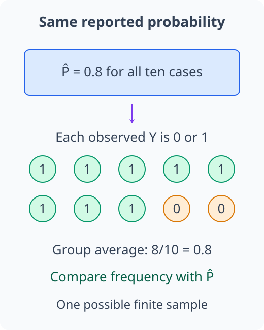
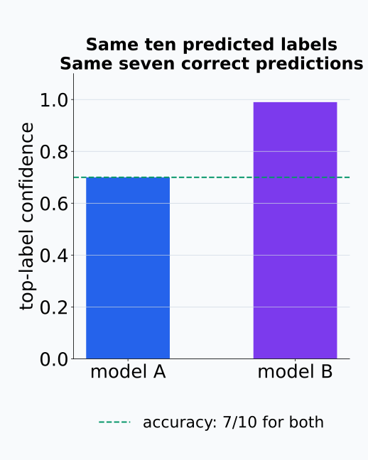
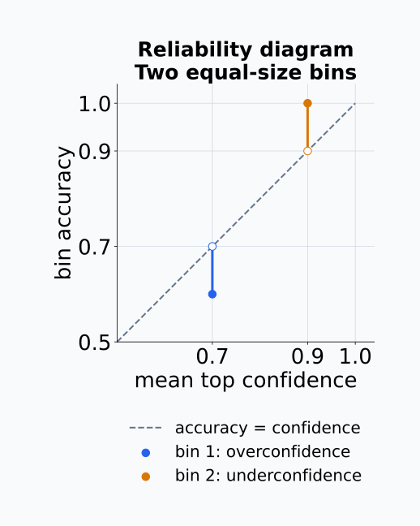
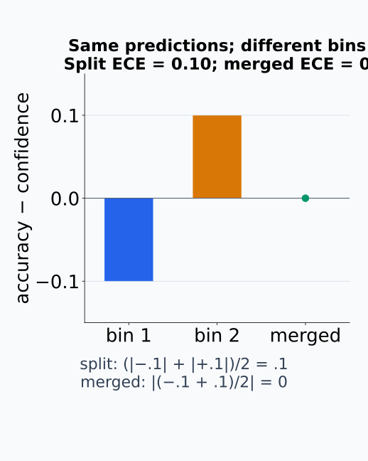
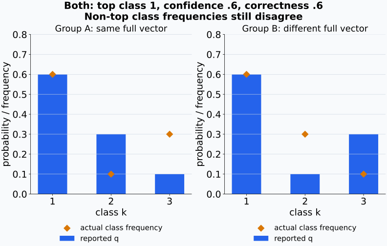
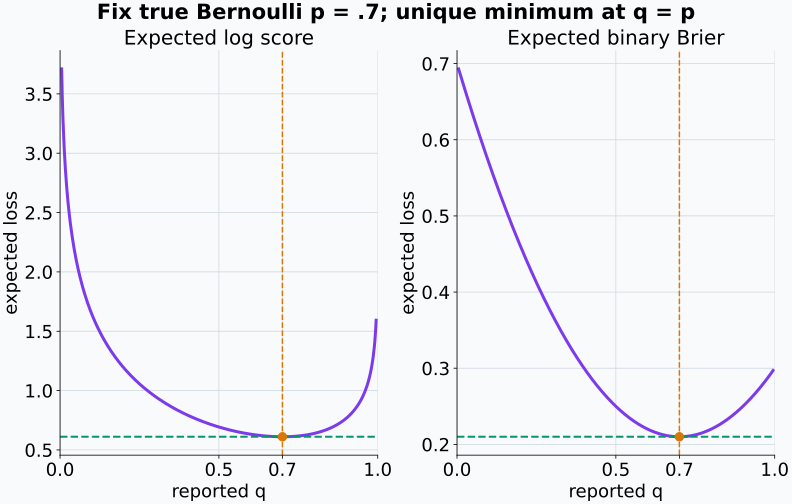
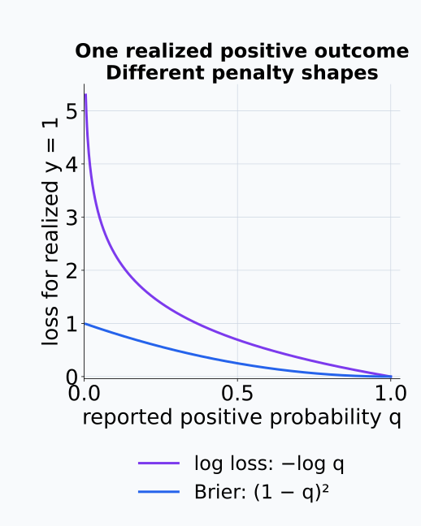
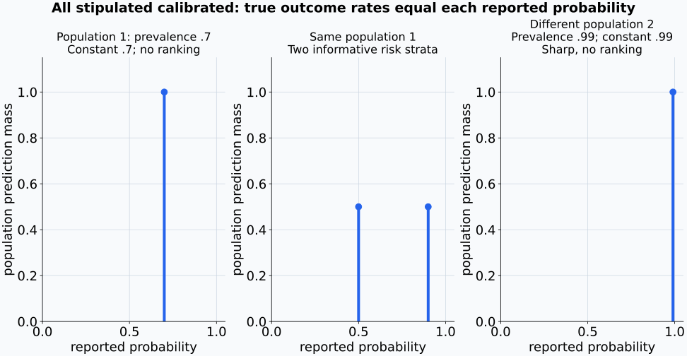
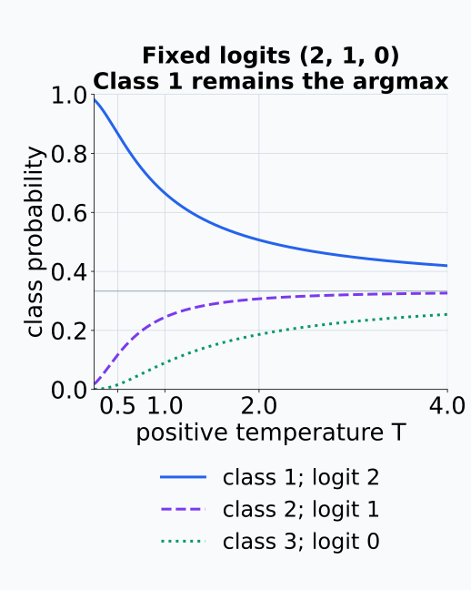
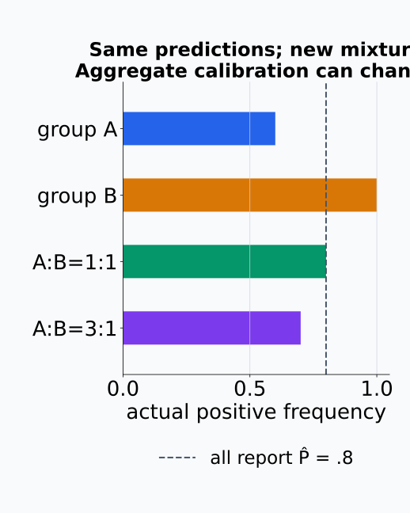

# M04-15. calibration과 scoring rule

## 이 단원이 필요한 이유

classification model이 정답 label을 자주 맞히는 것과 출력 probability가 믿을 만한 것은 다른 문제이다. confidence $0.8$인 prediction들을 모았을 때 약 $80\%$가 맞아야 그 confidence가 empirical frequency와 맞는다고 말할 수 있다. 이 성질을 calibration이라 한다.

calibration만으로 probability prediction의 품질이 모두 정해지지는 않는다. base rate만 내놓는 model도 집단 전체에서는 calibrated할 수 있지만 sample을 구별하지 못한다. reliability diagram과 expected calibration error(ECE)는 calibration gap을 요약하고, log score와 Brier score 같은 proper scoring rule은 prediction distribution 전체의 품질을 평가한다.

## 학습 목표

이 단원을 마치면 다음을 할 수 있다.

- binary calibration을 conditional expectation으로 정의할 수 있다.
- accuracy와 calibration을 구분할 수 있다.
- confidence bin의 accuracy와 confidence를 계산할 수 있다.
- reliability diagram과 ECE를 해석할 수 있다.
- proper scoring rule의 조건을 설명할 수 있다.
- log score와 Brier score를 계산할 수 있다.
- sharpness, temperature scaling과 distribution shift의 관계를 설명할 수 있다.
- calibration 결과가 허용하는 모델 해석 주장을 제한할 수 있다.

## 선수지식 확인

- 선수 단원: [M04-03 확률변수와 확률분포](M04-03-random-variables-distributions.md)
- 선수 단원: [M04-04 기댓값, 분산과 공분산](M04-04-expectation-variance-covariance.md)
- 선수 단원: [M04-06 표본, 모집단과 표본분포](M04-06-samples-populations-sampling-distributions.md)
- 선수 단원: [M04-07 추정, 편향과 분산](M04-07-estimation-bias-variance.md)
- 선수 단원: [M04-08 회귀와 분류](M04-08-regression-classification.md)
- 선수 단원: [M04-12 entropy와 cross entropy](M04-12-entropy-cross-entropy.md)
- 확인 질문: probability와 observed binary outcome을 구분할 수 있는가?
- 확인 질문: sample average가 population quantity의 estimate임을 설명할 수 있는가?

## 기호와 용어

| 표기·용어 | Common spoken reading | 의미 | 조건·범위 |
|---|---|---|---|
| $\widehat P$ | `P hat` | model이 출력한 positive-class probability | $0\le\widehat P\le1$ |
| $\widehat y_i$ | `y hat sub i` | sample $i$의 predicted class | multiclass 가능 |
| $\widehat c_i$ | `c hat sub i` | predicted class의 confidence | $\max_k q_i(k)$ |
| $B_m$ | `B sub m` | confidence가 일정 구간에 든 sample index 집합 | binning에 의존 |
| reliability diagram | `reliability diagram` | bin별 confidence와 accuracy 비교 | finite-sample estimate |
| ECE | `E C E` | bin별 calibration gap의 weighted average | binning에 의존 |
| scoring rule | `scoring rule` | probability prediction과 outcome에 loss를 부여하는 규칙 | 여기서는 작을수록 좋음 |
| Brier score | `Brier score` | squared error 기반 probability score | binary·multiclass |
| sharpness | `sharpness` | prediction distribution이 얼마나 집중되는지 나타내는 성질 | calibration과 별도 |

## 핵심 개념 1. calibration은 probability와 frequency의 일치를 묻는다

binary outcome $Y\in\{0,1\}$과 predicted probability $\widehat P$를 생각하자. perfect calibration의 정식 표현은

\[
\mathbb E[Y\mid \widehat P]=\widehat P
\quad\text{almost surely}
\]

이다. 직관적으로는 $\widehat P=p$라고 예측한 경우의 실제 positive frequency가 $p$라는 뜻이다.

\[
\mathbb P(Y=1\mid \widehat P=p)=p.
\]

$\widehat P$가 continuous이면 exact value $p$가 관측될 probability가 0일 수 있다. 그래서 finite dataset에서는 가까운 confidence를 bin으로 묶어 calibration을 estimate한다.

$Y$는 positive outcome의 indicator이므로 조건부 기댓값은 그 조건에서의 positive probability와 같다. model이 $0.8$을 주었다고 해서 관측 $Y$가 $0.8$이라는 뜻은 아니다. 각 관측은 여전히 0 또는 1이고 같은 probability를 받은 사례들의 평균을 비교한다. almost surely는 model 출력의 분포에서 확률 0인 예외를 제외하고 위 조건이 성립한다는 뜻이다. continuous 출력의 조건부분포도 사건 확률을 $P(\widehat P=p)$로 단순히 나눈 것으로 정의하지 않는다.

reported probability와 각 관측값을 같은 수로 취급하지 않는다.

<figure class="lesson-figure" markdown="1">
  
  <figcaption>같은 P̂=0.8을 받은 열 사례의 가능한 관측 결과를 그렸다. 각 Y는 0 또는 1이고 집단 평균만 8/10=0.8이다. 이 한 sample의 일치가 perfect population calibration을 입증하거나 모든 열 사례에서 정확히 여덟 positive가 나와야 한다는 뜻은 아니다.</figcaption>
</figure>

## 핵심 개념 2. accuracy와 calibration은 서로 다른 질문이다

accuracy는 predicted label이 얼마나 자주 맞는지 묻는다. calibration은 predicted probability가 같은 사례들의 observed frequency와 맞는지 묻는다.

같은 평가 sample에서 두 model의 predicted label이 모두 같으면 accuracy도 같다. 그러나 각 predicted class에 하나는 confidence $0.7$을, 다른 하나는 $0.99$를 부여한다면 confidence의 의미는 다르다. 두 번째 model이 $99\%$만큼 자주 맞지 않으면 overconfident하다.

반대로 population positive rate가 $0.7$일 때 모든 sample에 $0.7$을 출력하는 model은 집단 전체에서 calibrated할 수 있다. 하지만 sample마다 위험을 구별하지 못한다. calibration은 discrimination이나 usefulness를 대신하지 않는다.

같은 predicted label을 두고 reported confidence만 바꾸어 비교한다.

<figure class="lesson-figure" markdown="1">
  
  <figcaption>두 모델이 같은 열 sample에 동일한 predicted label을 주고 그중 일곱 개가 맞는 구성이다. 두 모델의 accuracy는 0.7이지만 top confidence를 모두 0.7 또는 0.99로 보고하면 frequency와의 간격이 달라진다. finite sample만으로 population calibration 여부를 확정하지는 않는다.</figcaption>
</figure>

## 핵심 개념 3. reliability diagram은 bin별 gap을 보여 준다

multiclass prediction $q_i(k)$에서 predicted label과 confidence를

\[
\widehat y_i=\arg\max_k q_i(k),
\qquad
\widehat c_i=\max_k q_i(k)
\]

로 둔다. confidence 구간에 따라 index set $B_1,\ldots,B_M$을 만들고 각 bin에서

\[
\operatorname{conf}(B_m)
=\frac{1}{|B_m|}
\sum_{i\in B_m}\widehat c_i
\]

와

\[
\operatorname{acc}(B_m)
=\frac{1}{|B_m|}
\sum_{i\in B_m}
\mathbf 1\{y_i=\widehat y_i\}
\]

를 계산한다. reliability diagram은 bin별 $\operatorname{conf}(B_m)$과 $\operatorname{acc}(B_m)$을 비교한다.

$\operatorname{conf}(B_m)>\operatorname{acc}(B_m)$이면 그 bin에서 overconfidence를, 반대이면 underconfidence를 시사한다. bin에 sample이 적으면 두 값의 sampling uncertainty가 커진다.

동점인 class는 미리 정한 규칙으로 하나를 고른다. 각 관측을 정확히 한 bin에 배정하고, 비어 있는 bin은 두 평균을 계산하지 않는다. diagram에서 가로축에 평균 confidence, 세로축에 accuracy를 놓으면 두 값이 같은 bin은 대각선 위에 있다. 대각선 아래의 점은 confidence가 실제 정답 비율보다 큰 경우다. 이 top-label diagram은 predicted class가 맞았는지의 비율을 쓰며, 핵심 개념 1의 positive-class frequency와 조건 대상이 다르다.

각 점은 같은 bin의 confidence와 correctness라는 두 평균을 연결한다.

<figure class="lesson-figure" markdown="1">
  
  <figcaption>예제 1의 동일 크기 두 bin을 표시했다. 채운 점은 (mean confidence,accuracy)이고 빈 점은 같은 confidence에서 accuracy가 같을 대각선 위치다. 첫 bin의 점은 아래에, 둘째는 위에 있으며 두 gap의 크기는 모두 0.1이다. 이 축은 positive-class frequency가 아니라 top-label correctness를 사용한다.</figcaption>
</figure>

## 핵심 개념 4. ECE는 bin별 calibration gap을 한 수로 요약한다

sample 수가 $n$일 때 널리 쓰이는 ECE는

\[
\operatorname{ECE}
=\sum_{m=1}^{M}
\frac{|B_m|}{n}
\left|
\operatorname{acc}(B_m)
-\operatorname{conf}(B_m)
\right|
\]

이다. bin이 큰 만큼 gap에 큰 weight를 준다.

ECE는 bin boundary와 bin 수에 따라 달라진다. 한 bin 안의 overconfidence와 underconfidence가 평균에서 상쇄될 수도 있다. top-label ECE가 작아도 classwise calibration이나 subgroup calibration이 나쁠 수 있다. ECE 하나는 full prediction distribution의 calibration 증명이 아니다.

bin들이 sample을 겹침 없이 나누면 가중치 $|B_m|/n$의 합은 1이다. 따라서 ECE는 같은 bin gap을 그 bin의 각 관측에 배정한 뒤 전체 sample에서 평균한 값으로 읽을 수 있다. 관측 수가 다른 bin들에 같은 가중치를 주면 이 식과 다른 summary가 된다. 예제 1의 두 bin을 하나로 합치면 평균 confidence와 accuracy가 모두 $0.8$이 되어 ECE는 0이다. 원래 bin별 gap $0.10$이 사라진 것은 각 예측이 바뀌어서가 아니라, 평균을 낸 뒤 절댓값을 취하는 위치에서 두 방향의 gap이 상쇄됐기 때문이다.

같은 prediction도 평균과 절댓값을 적용하는 순서에 따라 다른 bin 요약을 만든다.

<figure class="lesson-figure" markdown="1">
  
  <figcaption>동일 크기 두 bin의 signed gap은 −0.1과 +0.1이다. 나누어 계산하면 절댓값 평균 ECE=0.1이고 합친 bin에서는 평균 gap이 0이어서 ECE=0이다. 예측이나 정답이 개선된 것이 아니라 binning에서 상쇄가 생긴 것이다.</figcaption>
</figure>

## 핵심 개념 5. multiclass calibration에는 여러 강도가 있다

model의 multiclass probability 출력을 확률변수 $\boldsymbol Q$로, 그 실현값을 $\boldsymbol q=(q_1,\ldots,q_K)^\top$로 쓰자. full calibration은 출력분포에서 거의 모든 prediction vector $\boldsymbol q$에 대해

\[
\mathbb P(Y=k\mid \boldsymbol Q=\boldsymbol q)=q_k
\]

가 모든 class $k$에서 성립하는 조건이다. prediction vector가 high-dimensional continuous value이므로 finite sample에서 직접 확인하기 어렵다.

classwise calibration은 각 class probability를 따로 검사한다. top-label calibration은 predicted class의 confidence와 correctness만 비교한다. 둘은 full calibration보다 약한 조건이다. 어떤 calibration metric을 썼는지 밝히지 않고 “calibrated”라고만 쓰면 주장 범위가 모호해진다.

full calibration은 같은 vector를 낸 집단에서 모든 class의 실제 비율을 동시에 맞춘다. classwise 검사는 $q_k$만 같으면 나머지 class probability가 다른 vector들도 한 집단으로 합친다. top-label 검사는 선택된 class의 correctness만 남기므로 선택되지 않은 class 사이의 질량 배분을 직접 검사하지 않는다. 조건으로 유지하는 정보가 줄어들기 때문에 더 약한 calibration을 만족해도 full-vector 조건이 자동으로 따라오지 않는다.

선택된 class 하나의 일치가 나머지 class의 질량 배분까지 검증하지는 않는다.

<figure class="lesson-figure lesson-figure--wide" markdown="1">
  
  <figcaption>각 패널은 표시한 동일 prediction vector를 받는 집단의 구성 예시다. 두 집단 모두 top class 1의 confidence와 실제 correctness는 0.6으로 맞지만 class 2·3의 reported mass와 실제 비율은 맞지 않는다. top-label 조건은 만족해도 full-vector calibration은 실패한다. class 1 하나의 일치를 모든 classwise calibration으로 일반화하지 않는다.</figcaption>
</figure>

## 핵심 개념 6. proper scoring rule은 정직한 probability를 유도한다

scoring rule $S(q,y)$을 작은 값이 좋은 loss로 쓰자. true distribution이 $p$일 때 $S$가 proper하다는 것은 모든 candidate distribution $q$에 대해

\[
\mathbb E_{Y\sim p}[S(p,Y)]
\le
\mathbb E_{Y\sim p}[S(q,Y)]
\]

임을 뜻한다. equality가 $q=p$에서만 성립하면 strictly proper이다. expected score를 낮추려는 forecaster가 자신의 true belief를 그대로 보고할 이유를 주는 성질이다.

log score는

\[
S_{\log}(q,y)=-\log q(y)
\]

이다. expected log score는 cross entropy이고, true distribution과 candidate distribution 사이 KL divergence만큼 증가한다. 따라서 support condition 아래 strictly proper이다.

이 정의에서는 outcome을 만드는 $p$를 고정하고 보고할 분포 $q$를 바꾼다. proper이면 $q=p$가 expected loss의 최소점 중 하나이고, strictly proper이면 다른 $q$는 같은 최소값을 낼 수 없다. 결과 하나를 본 뒤 그 class에 확률 1을 주면 그 관측의 loss를 줄일 수 있지만, 이는 $p$에서 outcome을 반복 관측하기 전에 분포를 보고하는 문제와 다르다. proper score를 사용했다는 사실만으로 finite training sample에서 학습한 모델이 정확한 확률이나 calibration을 얻었다고 결론 내리지 않는다.

outcome 분포를 고정한 반복 평균에서는 두 proper score가 같은 truthful report를 고른다.

<figure class="lesson-figure lesson-figure--wide" markdown="1">
  
  <figcaption>true Bernoulli probability p=0.7을 고정하고 보고할 q를 움직였다. 두 expected loss는 값과 모양은 달라도 유일한 minimum이 q=p에 있다. 초록 기준선은 각각 target entropy와 p(1−p)=0.21이다. 이는 outcome을 본 뒤 q를 고르는 관측 한 번의 문제와 다르다.</figcaption>
</figure>

## 핵심 개념 7. Brier score는 probability error를 제곱한다

binary outcome $y\in\{0,1\}$과 positive probability $q$의 Brier score는

\[
S_{\mathrm{Brier}}(q,y)=(q-y)^2
\]

이다. multiclass에서는 one-hot target을 사용해

\[
S_{\mathrm{Brier}}(\boldsymbol q,y)
=\sum_{k=1}^{K}
\left(q_k-\mathbf 1\{k=y\}\right)^2
\]

로 쓴다.

log score는 realized class에 아주 작은 probability를 준 prediction을 강하게 벌한다. Brier score는 bounded squared error를 사용한다. 두 score 모두 strictly proper이지만 individual sample에 부여하는 penalty의 모양은 다르다.

binary true probability가 $p$이면 expected Brier score는

\[
\mathbb E[(q-Y)^2]
=p(1-q)^2+(1-p)q^2
=p(1-p)+(q-p)^2
\]

다. 첫 항은 고정된 outcome 분산이고, 둘째 항은 보고한 probability가 true probability에서 벗어난 제곱이다. 따라서 $q=p$일 때만 최소가 된다. multiclass에서도 각 indicator의 평균이 $p_k$이므로 expected score는 $\sum_k p_k(1-p_k)+\sum_k(q_k-p_k)^2$로 분해되어 같은 결론을 얻는다. binary 식과 두 class에 대한 multiclass 합은 배율이 다르므로 score를 보고할 때 사용한 합·평균 convention도 명시한다.

기대 score의 최적점과 realized outcome 하나에 주는 penalty 모양도 구분한다.

<figure class="lesson-figure" markdown="1">
  
  <figcaption>이번에는 realized y=1을 고정했다. log loss는 q가 0에 접근할수록 커지고 binary Brier는 1에 접근한다. outcome 분포에서의 기대값 곡선이 아니라 이 관측 하나의 loss이며, 그림에서는 q=0의 무한 log loss를 유한한 값으로 그리지 않았다.</figcaption>
</figure>

## 핵심 개념 8. calibration과 sharpness를 함께 봐야 한다

sharpness는 각 probability prediction이 일부 outcome에 얼마나 집중되는지를 나타낸다. binary prediction에서는 probability가 $0$이나 $1$에 가까울수록 더 집중된 분포다. calibration은 prediction을 조건으로 실제 outcome frequency를 비교하지만, sharpness는 실제 outcome을 사용하지 않고 prediction distribution 자체를 본다. 집중된 분포라는 사실만으로 sample을 올바르게 구별하거나 유용한 정보를 제공한다고 결론 내리지는 않는다.

모든 sample에 base rate를 출력하는 model은 aggregate calibration을 만족할 수 있지만 sample을 구별하지 못한다. base rate 자체가 0이나 1에 가까우면 이 예측도 집중된 분포이므로 sharpness와 discrimination을 같은 성질로 취급하지 않는다. 반대로 극단적인 probability를 내는 model은 sharp해 보여도 calibration이 나쁠 수 있다. 좋은 probability forecast는 calibration을 유지하면서 useful discrimination과 sharpness를 함께 평가해야 한다.

prediction 분포의 집중과 sample별 구별 능력은 같은 축에서 동일한 성질로 읽지 않는다.

<figure class="lesson-figure lesson-figure--wide" markdown="1">
  
  <figcaption>각 reported probability에서 실제 positive rate가 그 값과 같다고 정한 population 예시다. 첫 두 패널은 prevalence 0.7인 같은 population에서 constant 0.7과 동일 비중의 위험집단 0.5·0.9를 비교한다. 마지막은 prevalence 0.99인 다른 population의 constant 0.99로, sharp하지만 sample 순위를 구별하지 못한다. 가로축은 reported probability, 세로 높이는 그런 예측을 받는 집단 비중이다.</figcaption>
</figure>

## 핵심 개념 9. temperature scaling은 logit의 크기를 조정한다

logit vector $\boldsymbol z$에 temperature $T>0$를 적용하면

\[
q_T(k\mid x)
=\frac{\exp(z_k/T)}
{\sum_j\exp(z_j/T)}
\]

이다. $T>1$이면 distribution이 부드러워지고 confidence가 낮아진다. $0<T<1$이면 distribution이 더 뾰족해진다.

positive temperature는 logit order를 바꾸지 않으므로 predicted class와 accuracy는 유지한다. 보통 held-out validation set의 negative log-likelihood를 낮추도록 $T$를 fit한다. 이 절차가 새로운 population에서도 calibration을 보장하지는 않는다.

두 class의 probability ratio는 $q_T(k\mid x)/q_T(j\mid x)=\exp((z_k-z_j)/T)$다. 같은 양수 $T$로 나누면 logit 차이의 부호는 유지되지만, $T$를 키울수록 차이의 크기는 줄어 ratio가 1에 가까워진다. 그래서 class 순서는 유지한 채 probability의 대비를 줄일 수 있다. tie가 있다면 같은 tie-breaking rule을 유지한다. scaling은 confidence를 조정하는 한 scalar 파라미터이므로 모든 class·subgroup의 calibration 조건을 각각 만족시키는 자유도를 제공하지 않는다.

공통 양수 temperature로 logit을 나누면 probability 대비는 변하지만 순서는 유지된다.

<figure class="lesson-figure" markdown="1">

<figcaption>logits (2,1,0)을 고정한 qₜ(k)의 실제 계산이다. T가 커질수록 세 값은 균등 기준 1/3에 가까워지지만 class 1이 계속 최댓값이다. 점선·실선·색과 범례로 class를 구분했다. 이 변화를 보인 것만으로 어떤 population의 calibration이 개선됐다고 결론 내릴 수는 없다.</figcaption>
</figure>

## 핵심 개념 10. calibration은 평가 population에 종속된다

calibration은 input·label·prediction의 joint distribution에 관한 성질이다. class prevalence, input distribution이나 labeling process가 바뀌면 같은 model의 calibration도 달라질 수 있다.

전체 dataset에서 ECE가 작아도 특정 subgroup에서는 gap이 클 수 있다. deployment report에는 calibration set과 test set의 분리, binning rule, subgroup result, proper score와 distribution shift 조건을 함께 기록해야 한다.

같은 model probability도 subgroup 비중을 바꾸면 비교할 frequency가 달라진다.

<figure class="lesson-figure" markdown="1">
  
  <figcaption>모든 sample에 P̂=0.8을 주고 subgroup A·B의 실제 positive rate는 각각 0.6·1이라고 정했다. 1:1 mixture의 전체 비율은 0.8이지만 3:1에서는 0.7이다. 같은 model의 aggregate calibration이 population 비중에 따라 바뀌며, 원래 mixture의 일치도 각 subgroup의 일치를 보장하지 않는다.</figcaption>
</figure>

## 예제 1. 두 bin의 ECE

두 bin이 각각 전체 sample의 절반을 포함한다고 하자.

| bin | confidence | accuracy |
|---|---:|---:|
| $B_1$ | $0.70$ | $0.60$ |
| $B_2$ | $0.90$ | $1.00$ |

ECE는

\[
\operatorname{ECE}
=\frac12|0.60-0.70|
+\frac12|1.00-0.90|
=0.10
\]

이다. 첫 bin은 overconfident하고 둘째 bin은 underconfident하지만 absolute gap을 쓰므로 서로 상쇄되지 않는다.

## 예제 2. binary Brier score

positive probability가 $q=0.8$일 때 outcome이 $y=1$이면

\[
(0.8-1)^2=0.04
\]

이다. outcome이 $y=0$이면

\[
(0.8-0)^2=0.64
\]

이다. 높은 positive probability를 보고한 prediction은 positive outcome에서 낮은 loss를, negative outcome에서 높은 loss를 받는다.

## 예제 3. log score

$q=0.8$을 positive probability로 보고했다. $y=1$이면 log score는

\[
-\log0.8\approx0.223
\]

이고 $y=0$이면

\[
-\log(1-0.8)
=-\log0.2
\approx1.609
\]

이다. realized outcome에 작은 probability를 준 두 번째 경우가 더 큰 penalty를 받는다.

## 예제 4. calibrated하지만 구별하지 못하는 model

population의 positive rate가 $0.7$이고 모든 sample에 $\widehat P=0.7$을 출력한다고 하자. 충분히 큰 sample에서 $\widehat P=0.7$인 집단의 positive frequency도 $0.7$이므로 aggregate calibration은 맞는다.

그러나 모든 sample의 score가 같아 positive와 negative를 rank하지 못한다. calibration만으로 discrimination을 평가할 수 없는 예이다.

## 흔한 오해

### 오해 1. accuracy가 높으면 probability도 calibrated하다

같은 predicted label과 accuracy를 가진 model도 confidence는 다를 수 있다. calibration은 confidence별 frequency를 따로 검사한다.

### 오해 2. ECE가 낮으면 모든 class와 subgroup에서 calibrated하다

top-label ECE는 bin average에 기반한 한 가지 summary이다. classwise·subgroup·full-vector calibration을 보장하지 않는다.

### 오해 3. calibrated model은 informative하다

base-rate-only predictor도 aggregate calibration을 만족할 수 있다. discrimination과 sharpness를 별도로 봐야 한다.

### 오해 4. temperature scaling은 model의 accuracy를 높이는 방법이다

positive scalar temperature는 logit order를 유지한다. predicted class와 accuracy는 그대로이고 probability concentration만 바뀐다.

### 오해 5. 한 test set의 calibration은 deployment에서도 유지된다

calibration은 평가 population에 종속된다. prevalence나 input distribution이 바뀌면 다시 평가해야 한다.

## 연습문제

### 1. perfect calibration 해석

어떤 binary model이 $\widehat P=0.6$인 사례를 많이 만들었다. perfect calibration이라면 이 사례들에서 기대하는 positive 비율은 얼마인가?

해설 보기

calibration 정의에 따라

\[
\mathbb P(Y=1\mid \widehat P=0.6)=0.6
\]

이어야 한다. finite sample의 observed proportion은 sampling variation 때문에 정확히 $0.6$이 아닐 수 있다.

### 2. bin accuracy와 confidence

한 bin에 confidence가 $0.7,0.8,0.9,0.8$인 네 prediction이 있다. 정답 여부는 $1,1,0,1$이다. bin confidence와 accuracy를 구하라.

해설 보기

bin confidence는

\[
\frac{0.7+0.8+0.9+0.8}{4}=0.8
\]

이고 accuracy는

\[
\frac{1+1+0+1}{4}=0.75
\]

이다. 이 bin은 confidence가 accuracy보다 $0.05$ 높다.

### 3. ECE 계산

$B_1,B_2$가 각각 sample의 $40\%,60\%$를 포함한다. 두 bin의 $(\operatorname{acc},\operatorname{conf})$가 각각 $(0.7,0.8)$과 $(0.9,0.85)$이다. ECE를 구하라.

해설 보기

\[
\begin{aligned}
\operatorname{ECE}
&=0.4|0.7-0.8|
+0.6|0.9-0.85|\\
&=0.04+0.03\\
&=0.07.
\end{aligned}
\]

### 4. Brier score 비교

$y=1$인 sample에 model A는 $q_A=0.9$, model B는 $q_B=0.6$을 출력했다. 각 Brier score를 구하고 비교하라.

해설 보기

\[
S_A=(0.9-1)^2=0.01,
\qquad
S_B=(0.6-1)^2=0.16.
\]

이 sample에서는 realized positive outcome에 더 큰 probability를 준 model A의 score가 낮다.

### 5. log score 비교

$y=0$인 binary sample에 positive probability $q=0.1$과 $q=0.8$을 각각 보고했다. 두 log score를 구하라.

해설 보기

$y=0$의 predicted probability는 $1-q$이다. 따라서

\[
-\log(1-0.1)=-\log0.9\approx0.105
\]

이고

\[
-\log(1-0.8)=-\log0.2\approx1.609
\]

이다. realized class에 더 작은 probability를 준 두 번째 prediction의 loss가 크다.

### 6. temperature scaling

overconfident한 model에 $T>1$을 적용했다. probability distribution, predicted class와 accuracy가 어떻게 변하는지 설명하라.

해설 보기

logit을 $T>1$로 나누면 class probability가 더 부드러워지고 top confidence가 낮아진다. positive scalar로 나누어도 logit order는 같으므로 predicted class는 변하지 않는다. 같은 dataset에서 accuracy도 변하지 않는다.

### 7. calibration 주장 비판

한 연구가 test set의 10-bin top-label ECE가 낮다는 이유로 “모든 사용자 집단에서 probability가 신뢰 가능하다”고 결론 내렸다. 필요한 추가 검사를 설명하라.

해설 보기

ECE는 bin boundary와 sample size에 의존하며 top-label calibration만 요약한다. classwise reliability, subgroup별 calibration과 confidence interval을 확인해야 한다. log score나 Brier score 같은 proper score도 함께 보고 calibration에 사용하지 않은 held-out set에서 평가해야 한다. deployment distribution이 다르면 prevalence와 input shift 아래 calibration을 다시 측정해야 한다.

## 단원 요약

- binary calibration은 $\mathbb E[Y\mid\widehat P]=\widehat P$로 표현한다.
- accuracy는 label correctness를, calibration은 probability와 frequency의 일치를 묻는다.
- reliability diagram은 confidence bin별 accuracy와 confidence를 비교한다.
- ECE는 binning에 의존하며 full·classwise·subgroup calibration을 보장하지 않는다.
- proper scoring rule은 true distribution을 보고할 때 expected loss가 최소가 되게 한다.
- log score와 Brier score는 서로 다른 penalty 모양을 가진 strictly proper scoring rule이다.
- calibration과 sharpness·discrimination을 함께 평가해야 한다.
- temperature scaling은 predicted class를 유지한 채 probability concentration을 조정한다.
- calibration 결과는 평가 population에 종속된다.

## 통과 기준

다음 질문에 자료를 보지 않고 답할 수 있으면 통과한다.

- binary calibration을 conditional expectation으로 쓸 수 있는가?
- accuracy와 calibration의 차이를 예로 설명할 수 있는가?
- bin confidence·accuracy와 ECE를 계산할 수 있는가?
- top-label ECE의 한계를 설명할 수 있는가?
- proper scoring rule의 조건을 쓸 수 있는가?
- log score와 Brier score를 계산하고 비교할 수 있는가?
- temperature scaling이 바꾸는 것과 유지하는 것을 구분할 수 있는가?
- distribution shift 아래 calibration을 다시 평가해야 하는 이유를 설명할 수 있는가?

## 다음 단원

- [M04-16 상관관계와 인과관계](M04-16-correlation-causation.md)

## 집필자 점검표

- [x] 학습 목표가 관찰 가능한 행동으로 작성됐다.
- [x] binary·multiclass calibration을 구분했다.
- [x] reliability diagram과 ECE를 계산했다.
- [x] ECE의 binning·subgroup 한계를 밝혔다.
- [x] proper scoring rule을 정의했다.
- [x] log score와 Brier score를 비교했다.
- [x] calibration과 sharpness를 구분했다.
- [x] temperature scaling과 distribution shift를 설명했다.
- [x] 모든 문제에 해설이 있다.
- [x] 모델 해석 주장의 강도를 구분했다.
- [x] 용어집과 표기 규칙을 따랐다.
- [x] 선수지식 밖의 내용을 몰래 요구하지 않는다.
- [x] 내부 링크와 수식 구분자를 확인했다.
- [x] Common spoken reading이 실제 영어 학술 발화이며 한글 음역이나 기계적 직역을 포함하지 않는다.
