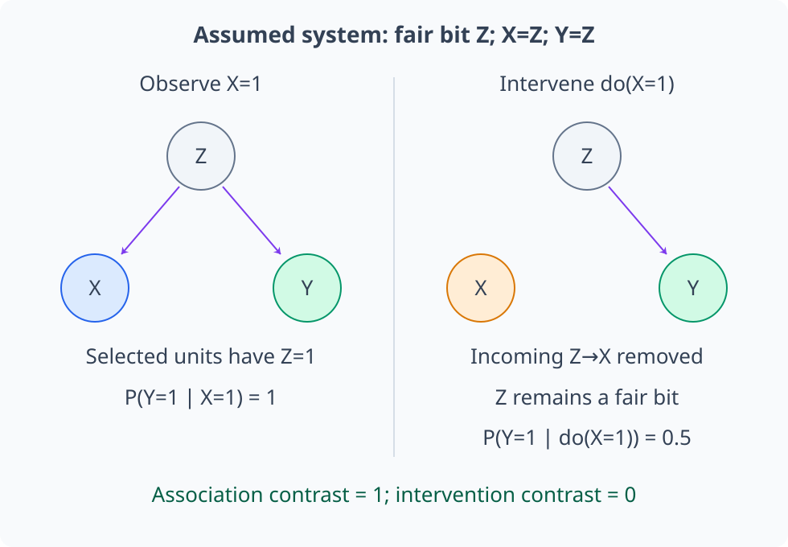
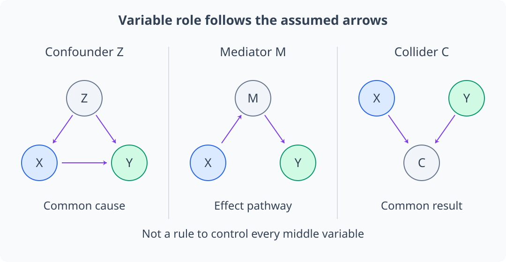
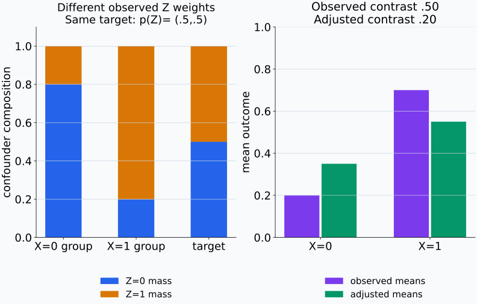
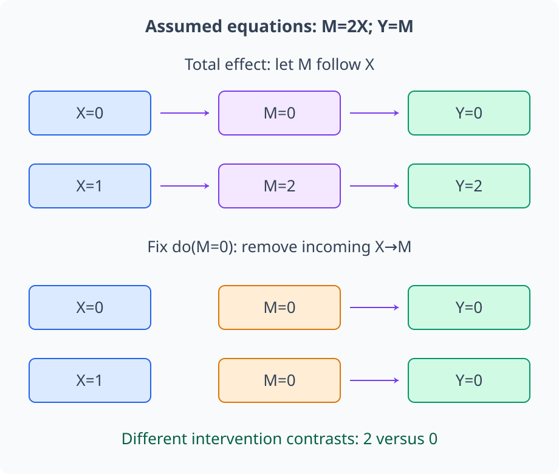
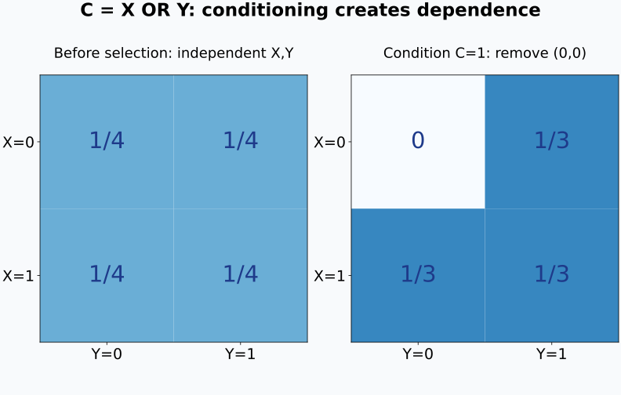
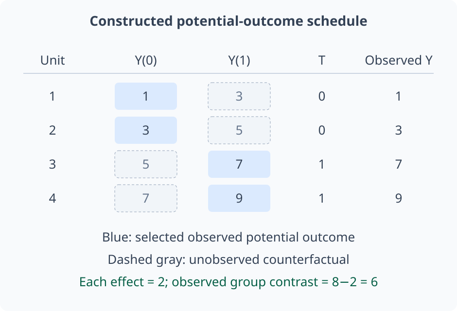
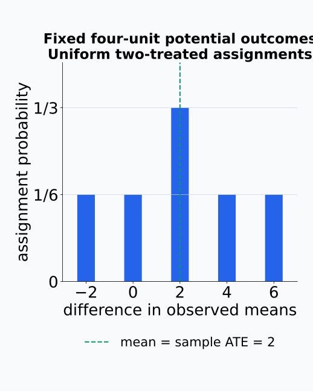
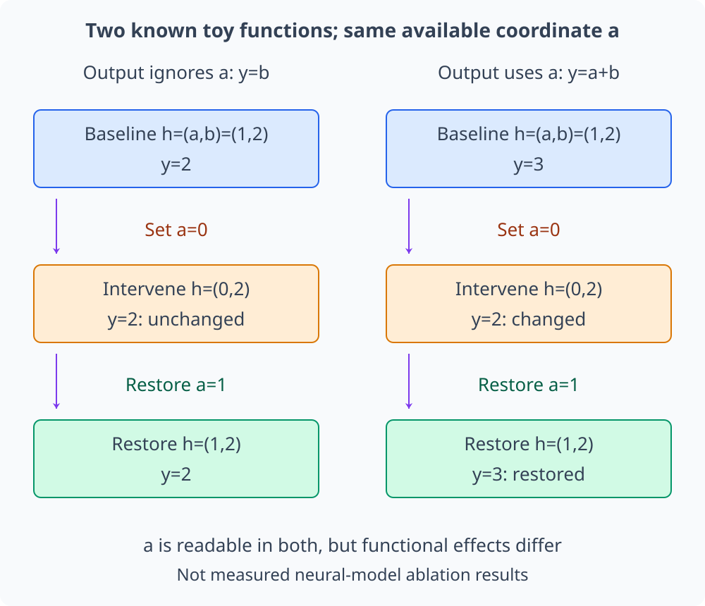

# M04-16. 상관관계와 인과관계

## 이 단원이 필요한 이유

두 변수가 함께 변한다는 관찰만으로 한 변수를 바꿨을 때 다른 변수가 변한다고 결론 내릴 수 없다. 높은 probe accuracy는 activation에 label 정보가 있음을 보여 줄 수 있지만, model이 그 activation을 output 계산에 사용한다는 사실까지 보여 주지는 않는다. correlation, prediction과 causation은 서로 다른 질문에 답한다.

인과 주장은 비교하려는 intervention, outcome과 population을 먼저 정해야 한다. causal graph는 confounder·mediator·collider의 역할을 구분하게 하고, random assignment와 적절한 adjustment는 intervention effect를 식별할 조건을 제공한다.

## 학습 목표

이 단원을 마치면 다음을 할 수 있다.

- association, prediction과 causal effect를 구분할 수 있다.
- observational condition과 intervention notation을 구분할 수 있다.
- causal graph에서 confounder·mediator·collider를 찾을 수 있다.
- confounder adjustment가 필요한 이유와 조건을 설명할 수 있다.
- collider conditioning이 association을 만드는 예를 설명할 수 있다.
- potential outcome으로 average treatment effect를 정의할 수 있다.
- random assignment가 교환가능성을 만드는 이유를 설명할 수 있다.
- activation 관찰과 intervention evidence가 허용하는 주장을 구분할 수 있다.

## 선수지식 확인

- 선수 단원: [M04-02 조건부확률과 Bayes 규칙](M04-02-conditional-probability-bayes-rule.md)
- 선수 단원: [M04-04 기댓값, 분산과 공분산](M04-04-expectation-variance-covariance.md)
- 선수 단원: [M04-06 표본, 모집단과 표본분포](M04-06-samples-populations-sampling-distributions.md)
- 선수 단원: [M04-08 회귀와 분류](M04-08-regression-classification.md)
- 선수 단원: [M04-09 신뢰구간과 bootstrap](M04-09-confidence-intervals-bootstrap.md)
- 선수 단원: [M04-10 가설검정과 다중비교](M04-10-hypothesis-testing-multiple-comparisons.md)
- 확인 질문: conditional probability와 marginal probability를 구분할 수 있는가?
- 확인 질문: correlation coefficient가 linear association의 요약임을 설명할 수 있는가?

## 기호와 용어

| 표기·용어 | Common spoken reading | 의미 | 조건·범위 |
|---|---|---|---|
| $X\not\!\perp\!\!\!\perp Y$ | `X is not independent of Y` | $X,Y$ 사이 statistical dependence | 방향을 정하지 않음 |
| $\operatorname{do}(X=x)$ | `do X equals x` | 외부에서 $X$를 $x$로 정한 intervention | 관찰조건과 구분 |
| $Y(1),Y(0)$ | `Y of one and Y of zero` | 같은 unit의 두 treatment 상태에서의 potential outcome | 둘을 동시에 관측할 수 없음 |
| ATE | `A T E` | average treatment effect | $\mathbb E[Y(1)-Y(0)]$ |
| confounder | `confounder` | treatment와 outcome의 공통원인 | adjustment 후보 |
| mediator | `mediator` | treatment effect가 지나가는 중간변수 | total effect 분석 시 주의 |
| collider | `collider` | 두 화살표가 모이는 공통결과 | conditioning 시 path를 열 수 있음 |
| exchangeability | `exchangeability` | treatment group이 potential outcome 관점에서 비교 가능한 조건 | 관측연구에서는 가정 |

## 핵심 개념 1. association, prediction과 causation은 질문이 다르다

association은 $X$를 관측했을 때 $Y$의 distribution이 달라지는지 묻는다.

\[
p(y\mid x)\ne p(y)
\]

prediction은 관측 가능한 feature로 unseen outcome을 얼마나 잘 맞히는지 묻는다. strong association은 prediction에 유용할 수 있지만 원인 방향을 정하지 않는다.

causation은 $X$를 외부에서 바꿨을 때 $Y$가 어떻게 달라지는지 묻는다. population-level causal contrast의 한 예는

\[
\mathbb E[Y\mid\operatorname{do}(X=1)]
-
\mathbb E[Y\mid\operatorname{do}(X=0)]
\]

이다. 이 값은 observational contrast

\[
\mathbb E[Y\mid X=1]-\mathbb E[Y\mid X=0]
\]

와 일반적으로 같지 않다.

## 핵심 개념 2. causal graph는 가정한 생성 방향을 표시한다

directed acyclic graph(DAG)에서 node는 variable이고 arrow $X\to Y$는 $X$가 $Y$의 direct cause라는 구조적 가정을 나타낸다. graph는 data만으로 자동 확정되는 그림이 아니라 domain knowledge와 연구 설계를 명시하는 model이다.

단순한 구조방정식은

\[
Y=f(X,U_Y)
\]

처럼 쓸 수 있다. $U_Y$는 graph에 표시하지 않은 다른 원인을 모은다. intervention $\operatorname{do}(X=x)$는 $X$를 만들던 원래 mechanism을 끊고 $X=x$로 고정한 새 system을 뜻한다.

관찰조건 $X=x$는 원래 system에서 그 값을 갖게 된 unit을 골라 본다. 이 선택은 $X$의 원인들과 $U_Y$의 분포까지 달리 만들 수 있다. 반면 intervention은 $X$로 들어오는 원인 경로를 끊되 다른 구조방정식은 유지하고, 바뀐 $X$를 후속 식에 넣는다. 두 식이 같은 $x$를 사용해도 모집단을 고르는 규칙과 system을 바꾸는 규칙이 다르기 때문에 outcome 평균이 달라질 수 있다.

같은 값 X=1을 쓰더라도 관찰집단을 고르는 것과 생성 경로를 바꾸는 것은 다르다.

<figure class="lesson-figure lesson-figure--wide" markdown="1">
  
  <figcaption>Z가 fair bit이고 X=Z, Y=Z인 구조를 가정한 예시다. X=1을 관찰하면 Z=1인 unit이 선택돼 Y도 1이다. do(X=1)은 Z→X 경로만 끊으므로 Y=Z의 생성식과 Z의 분포는 그대로이며 Y=1의 확률은 0.5다. 관찰 contrast는 1이지만 intervention contrast는 0이다. 이 deterministic 예시는 adjustment의 positivity 예시로 사용하지 않는다.</figcaption>
</figure>

## 핵심 개념 3. confounder는 관찰된 차이에 다른 경로를 섞는다

$Z$가 $X$와 $Y$의 공통원인이면 graph는

\[
X\leftarrow Z\to Y
\]

이다. $X$를 관측한 group과 그렇지 않은 group은 $Z$의 distribution부터 다를 수 있다. 그러면 observational association에는 $X$의 effect와 $Z$가 만든 차이가 함께 들어간다.

적절한 조건에서 measured confounder $Z$를 adjustment하면

\[
\mathbb E[Y\mid\operatorname{do}(X=x)]
=
\sum_z
\mathbb E[Y\mid X=x,Z=z]p(z)
\]

로 intervention mean을 식별할 수 있다. 이 식에는 relevant confounder를 모두 측정했다는 exchangeability, 가능한 각 $z$에서 두 treatment가 관측될 positivity, 관측 treatment와 potential outcome을 연결하는 consistency 조건이 필요하다.

여기서는 이산 $Z$를 합으로 평균한다. 관찰집단의 평균을 분해하면 $\mathbb E[Y\mid X=x]=\sum_z\mathbb E[Y\mid X=x,Z=z]p(z\mid X=x)$다. adjustment 식은 이 집단별 weight 대신 동일한 target population의 $p(z)$를 사용한다. 같은 $z$ 안에서 treatment 비교가 적절하다는 조건 아래 각 조건부 평균을 얻고, 이를 공통 기준 분포로 다시 평균하는 것이다.

exchangeability는 같은 $z$ 안에서 treatment 선택에 따라 potential outcome이 체계적으로 달라지지 않는다는 가정이다. positivity가 없으면 어떤 $z$의 treatment 평균을 자료에서 계산할 수 없고, consistency가 없으면 관측 outcome이 정의한 intervention outcome을 나타내지 않을 수 있다. 단순히 $Z$를 회귀식에 포함했다는 사실만으로 이 조건들이 성립하지는 않는다.

변수의 역할은 이름이나 배치가 아니라 가정한 화살표 방향으로 판단한다.

<figure class="lesson-figure lesson-figure--wide" markdown="1">
  
  <figcaption>왼쪽 Z는 treatment X와 outcome Y의 공통원인이고 X→Y 경로도 있다. 가운데 M은 X의 변화가 Y로 전달되는 중간 경로에 놓인다. 오른쪽 C는 X와 Y가 함께 만드는 결과다. 가운데에 놓인 변수라는 이유만으로 세 변수를 모두 같은 방식으로 control하지 않는다.</figcaption>
</figure>

adjustment는 조건부 평균을 같은 target population 비중으로 다시 섞는 계산이다.

<figure class="lesson-figure lesson-figure--wide" markdown="1">
  
  <figcaption>p(Z=1)=0.5, treatment probability가 Z=0에서 0.2·Z=1에서 0.8인 구성이다. outcome 평균을 0.1+0.2X+0.5Z로 두면 관찰 평균은 0.2와 0.7이다. 동일한 p(Z)=(0.5,0.5)로 다시 평균하면 0.35와 0.55가 된다. 두 Z 값에서 treatment가 모두 가능하고 Z가 이 모형의 공통원인을 모두 포함한다는 조건 아래 contrast 0.2를 intervention effect로 읽는다.</figcaption>
</figure>

## 핵심 개념 4. mediator는 effect가 지나가는 경로에 놓인다

구조가

\[
X\to M\to Y
\]

이면 $M$은 mediator이다. $X$가 $M$을 바꾸고 $M$이 $Y$를 바꾸는 indirect path가 있다. $X$가 $Y$로 직접 가는 arrow도 있으면 total effect는 direct path와 mediated path를 함께 포함한다.

total effect를 알고 싶은데 mediator $M$을 단순히 control하면 $X\to M\to Y$ 경로 일부를 막는다. direct effect와 indirect effect를 분리하려면 어떤 intervention을 비교하는지와 추가 식별 가정을 정해야 한다. “모든 관련 변수를 회귀식에 넣는다”는 규칙은 안전하지 않다.

total effect의 두 intervention에서는 $X$를 바꾼 결과로 $M$도 달라지도록 둔다. $M$을 같은 값으로 고정한 비교에서는 그 변화가 $Y$로 전달될 수 없으므로 서로 다른 질문을 묻는다. 관측된 $M$이 같은 사람만 비교하는 conditioning과 실제로 $M$을 고정하는 intervention도 일반적으로 같지 않다. mediator를 회귀식에 넣어 얻은 coefficient를 direct effect라고 부르려면 그 차이를 연결할 식별 조건이 필요하다.

mediator를 따라 움직이게 둔 경우와 외부에서 고정한 경우를 같은 생성식에서 비교한다.

<figure class="lesson-figure lesson-figure--wide" markdown="1">
  
  <figcaption>M=2X, Y=M의 가정한 구조에서 X를 0에서 1로 바꾸면 M과 Y가 0에서 2로 변한다. 아래는 do(M=0)으로 X→M 경로를 끊은 다른 intervention이다. X만 바꿔도 Y는 0으로 유지된다. 관찰된 M=0인 unit을 고른 regression 결과를 그대로 그린 것이 아니다.</figcaption>
</figure>

## 핵심 개념 5. collider를 조건으로 잡으면 없던 association이 생길 수 있다

구조가

\[
X\to C\leftarrow Y
\]

이면 $C$는 collider이다. $X,Y$가 marginally independent여도 공통결과 $C$를 조건으로 고르면 dependence가 생길 수 있다.

예를 들어 skill $X$와 luck $Y$가 합격 $C$를 높인다고 하자. 합격자만 보면 skill이 낮은 사람은 높은 luck으로 보완됐을 가능성이 커진다. selection variable인 합격을 고정했기 때문에 skill과 luck 사이 negative association이 나타날 수 있다. collider adjustment는 bias를 줄이는 것이 아니라 새 bias를 만들 수 있다.

예제 3의 구조를 두 독립 fair bit로 계산하자. $X$나 $Y$ 중 하나라도 1이면 $C=1$로 두면 원래 네 pair의 확률은 각각 $1/4$다. $C=1$ 조건에서는 $(0,0)$을 제외하고 나머지 세 pair를 각각 $1/3$로 재정규화한다. 따라서 $P(Y=1\mid C=1)=2/3$이지만 $P(Y=1\mid X=0,C=1)=1$이다. 조건부 집단 안에서는 $X$를 알아도 $Y$의 확률이 그대로라는 독립 조건이 더 이상 성립하지 않는다.

selection으로 빠지는 pair와 나머지 pair의 재정규화를 직접 확인한다.

<figure class="lesson-figure lesson-figure--wide" markdown="1">
  
  <figcaption>본문의 C=X OR Y 예시다. 원래 네 pair는 각각 1/4이고 C=1 조건은 (0,0)을 제외해 나머지를 각각 1/3로 만든다. 그 결과 P(Y=1∣C=1)=2/3과 P(Y=1∣X=0,C=1)=1이 달라져 조건부 집단 안의 독립성이 깨진다.</figcaption>
</figure>

## 핵심 개념 6. potential outcome은 비교하려는 causal effect를 정한다

binary treatment를 $T\in\{0,1\}$이라 하자. unit $i$의 potential outcomes는

\[
Y_i(1),\qquad Y_i(0)
\]

이다. individual causal effect는 $Y_i(1)-Y_i(0)$이지만 한 unit에서는 둘 중 하나만 관측한다. 이를 fundamental problem of causal inference라 한다.

population average treatment effect는

\[
\operatorname{ATE}
=\mathbb E[Y(1)-Y(0)]
\]

이다. causal question에는 treatment version, outcome 측정시점과 target population이 포함돼야 이 estimand가 분명해진다.

consistency가 성립하면 관측 outcome은 $Y=TY(1)+(1-T)Y(0)$로 쓸 수 있다. $T=1$인 unit에서는 $Y(1)$이, $T=0$인 unit에서는 $Y(0)$이 남는다. ATE는 같은 unit의 두 상태 차이를 population에서 평균한 것이므로 선형성에 따라 $\mathbb E[Y(1)]-\mathbb E[Y(0)]$와 같다. 서로 다른 관찰집단의 평균 차이가 이 두 potential-outcome 평균을 나타내는지는 assignment와 식별 조건을 별도로 확인해야 한다.

같은 unit의 두 잠재 상태와 실제 treatment가 선택하는 한 관측값을 나누어 읽는다.

<figure class="lesson-figure lesson-figure--wide" markdown="1">
  
  <figcaption>설명을 위해 두 potential outcomes를 정해 놓은 네 unit의 구성표다. 파란 셀 하나만 실제 treatment T에 따라 관측되고 다른 셀은 counterfactual이다. 각 unit의 effect는 2지만 큰 baseline unit 3·4에 treatment를 준 이 배정의 관찰 평균 차이는 6이다. 실제 자료에서 두 상태를 동시에 관측했다는 뜻은 아니다.</figcaption>
</figure>

## 핵심 개념 7. random assignment는 비교 가능한 group을 만든다

randomized experiment에서 treatment assignment $T$를 potential outcomes와 독립이 되도록 정하면

\[
T\perp\!\!\!\perp (Y(1),Y(0))
\]

이다. 충분한 sample에서 treatment group과 control group은 measured·unmeasured pretreatment causes가 평균적으로 비슷해진다.

consistency와 unit 간 interference가 없고 두 group이 비어 있지 않은 적절한 random assignment 설계에서는 difference in means로 average treatment effect를 추정한다.

\[
\widehat{\operatorname{ATE}}
=\overline Y_{T=1}-\overline Y_{T=0}.
\]

random sampling은 population generalization과 관계되고, random assignment는 group 사이 causal comparison과 관계된다. 하나가 다른 하나를 대신하지 않는다.

독립 assignment와 consistency를 사용하면 각 $t=0,1$에서 $\mathbb E[Y\mid T=t]=\mathbb E[Y(t)\mid T=t]=\mathbb E[Y(t)]$다. 첫 equality는 관측 outcome과 해당 상태의 outcome을 연결하고, 둘째는 assignment가 potential outcome을 고르지 않는다는 조건을 사용한다. 따라서 두 population group의 평균 차이가 ATE와 같다. random assignment는 이 확률적 비교 가능성을 만들지만, 실현된 작은 sample의 모든 pretreatment 변수가 정확히 균형이라는 뜻은 아니다.

정해진 등록 sample에서 양의 treatment·control 인원수를 고정하고 가능한 배정을 균등하게 뽑는 설계라면, 위 표본평균 차이는 그 sample의 평균 causal effect에 대해 불편이다. target population의 ATE에 대한 불편성과 일반화에는 sample을 어떻게 뽑았는지도 필요하다. 표집과 배정의 무작위성을 어느 단계에 사용했는지 구분한다.

등록한 unit을 고정하고 가능한 배정을 반복하면 배정 불확실성과 sample causal effect를 분리할 수 있다.

<figure class="lesson-figure" markdown="1">
  
  <figcaption>바로 앞의 네 unit 중 두 명을 treatment로 고르는 여섯 배정을 같은 확률로 계산했다. 관찰 평균 차이는 −2,0,2,4,6이고 2는 두 배정에서 나온다. 배정 분포의 평균은 sample ATE=2지만 개별 배정은 균형이나 정확한 효과값을 보장하지 않는다. target population에 대한 generalization은 여기서 별도로 증명하지 않았다.</figcaption>
</figure>

## 핵심 개념 8. 회귀 coefficient는 설계 없이 causal effect가 아니다

회귀식

\[
Y=\beta_0+\beta_1X+\boldsymbol\gamma^\top\boldsymbol Z+\varepsilon
\]

에서 $\beta_1$은 model과 adjustment set에 따른 conditional association을 나타낸다. causal effect로 해석하려면 temporal order, confounding control, correct functional form, measurement와 selection assumptions가 필요하다.

높은 predictive accuracy도 같은 한계를 가진다. future outcome을 잘 예측하는 feature가 manipulation 가능한 cause일 필요는 없다. disease marker는 진단에 유용해도 marker 자체를 바꿔 disease를 치료할 수 있다는 뜻이 아니다.

## 핵심 개념 9. 모델 해석에서는 관찰과 개입 증거를 분리한다

activation $H$에서 concept $C$를 잘 decode했다면 $H$와 $C$ 사이 association 또는 available information을 보인 것이다. model output $Y$가 이 information을 사용한다는 결론에는 $H$에 대한 intervention이 필요하다.

ablation, activation patching과 steering은 intervention 후보이다. 그러나 intervention이 off-distribution state를 만들거나 여러 feature를 동시에 바꾸면 observed output change를 target concept 하나의 effect로 해석하기 어렵다. matched control direction, dose-response, specificity, restoration과 multiple input·model 검증이 필요하다.

필요성 주장은 component를 제거했을 때 기능이 손상되는지 묻는다. 충분성 주장은 해당 component나 signal만으로 기능을 복원할 수 있는지 묻는다. correlation, necessity와 sufficiency는 서로 다른 evidence이다.

읽을 수 있는 좌표를 지우고 복원했을 때의 output effect는 실제 계산 경로에 따라 달라진다.

<figure class="lesson-figure lesson-figure--wide" markdown="1">
  
  <figcaption>두 known toy function에 동일한 h=(a,b)=(1,2)를 넣었다. a는 두 경우 모두 읽을 수 있지만 y=b에서는 제거·복원해도 output이 2다. y=a+b에서는 a를 0으로 만들면 3에서 2로 바뀌고 복원하면 3으로 돌아온다. 실제 neural-model 측정 결과가 아니며, 현실의 intervention validity·specificity·off-distribution 검사를 대신하지 않는다.</figcaption>
</figure>

## 예제 1. 공통원인이 만든 association

기온 $Z$가 아이스크림 판매량 $X$와 수영 사고 $Y$를 모두 높인다고 하자.

\[
X\leftarrow Z\to Y
\]

판매량과 사고 수는 함께 증가할 수 있지만 아이스크림 판매를 줄이는 intervention이 사고를 줄인다는 결론은 나오지 않는다. 기온별로 비교하거나 적절한 causal design이 필요하다.

## 예제 2. observational contrast와 randomized contrast

treatment group의 평균 outcome이 $8$, control group이 $5$라고 하자. random assignment와 consistency가 성립하면

\[
\widehat{\operatorname{ATE}}=8-5=3
\]

으로 추정한다. 환자가 treatment를 스스로 선택한 observational study라면 severity 같은 confounder가 group difference에 섞일 수 있어 같은 $3$을 곧바로 causal effect라 할 수 없다.

## 예제 3. collider selection

두 독립 원인 $X,Y$ 중 하나만 높아도 selection $C=1$이 된다고 하자. 전체 population에서는 $X,Y$가 independent할 수 있다. 그러나 $C=1$인 사람만 보면 $X=0$인 사람은 $Y=1$이어야 selection될 가능성이 커진다. selection을 조건으로 잡은 sample에서는 $X,Y$가 negatively associated할 수 있다.

## 예제 4. probe와 activation intervention

layer activation으로 topic label을 $95\%$ accuracy로 decode했다고 하자. 이 결과는 topic information의 decodability를 지지한다. topic direction을 제거했을 때 관련 answer만 선택적으로 나빠지고 unrelated control task는 유지되며, 원래 activation을 patch하면 성능이 복원된다면 functional use에 대한 더 강한 evidence가 된다.

그래도 intervention direction이 topic 외의 feature를 함께 바꾸는지, effect가 여러 prompt와 seed에서 유지되는지 확인해야 한다.

## 흔한 오해

### 오해 1. correlation이 0이면 causal effect도 없다

nonlinear relation이나 서로 상쇄되는 subgroup effect가 있을 수 있다. zero correlation은 linear marginal association에 관한 결과이다.

### 오해 2. 예측을 잘하는 feature는 outcome의 원인이다

predictive feature는 원인의 결과, 공통원인의 지표나 selection artifact일 수 있다. prediction 성능만으로 intervention effect를 정할 수 없다.

### 오해 3. 변수를 많이 control할수록 causal estimate가 좋아진다

confounder adjustment는 필요할 수 있지만 mediator나 collider를 무분별하게 control하면 target effect를 막거나 bias를 만든다.

### 오해 4. randomized experiment이면 모든 population에 일반화된다

random assignment는 enrolled sample 안의 internal causal comparison을 돕는다. target population으로의 generalization에는 sampling과 effect heterogeneity를 따로 검토해야 한다.

### 오해 5. activation intervention이 output을 바꾸면 target concept의 effect가 확정된다

intervention이 다른 feature와 distribution까지 바꿀 수 있다. specificity control과 intervention validity를 확인해야 한다.

## 연습문제

### 1. 관찰조건과 개입조건

$\mathbb E[Y\mid X=1]$과 $\mathbb E[Y\mid\operatorname{do}(X=1)]$의 차이를 설명하라.

해설 보기

첫 항은 $X=1$인 unit을 관찰해 얻은 conditional mean이다. 둘째 항은 $X$를 외부에서 1로 정한 intervention world의 mean이다. confounding이나 selection이 있으면 두 값은 다를 수 있다.

### 2. confounder 찾기

graph가 $Z\to X$, $Z\to Y$, $X\to Y$의 arrow를 가진다. $X$의 total effect를 추정할 때 $Z$의 역할을 말하라.

해설 보기

$Z$는 $X,Y$의 공통원인인 confounder이다. $X\leftarrow Z\to Y$라는 backdoor path를 만든다. exchangeability·positivity·consistency가 성립하고 $Z$가 정확히 측정됐다면 $Z$를 adjustment해 이 path를 막을 수 있다.

### 3. mediator control

$X\to M\to Y$만 있는 graph에서 $X$의 total effect를 알고 싶다. $M$을 고정한 비교가 total effect를 주는지 판단하라.

해설 보기

$M$을 고정하면 $X\to M\to Y$의 mediated path를 막는다. 이 graph에서는 effect 전체가 그 path를 지나므로 $M$을 control한 비교는 total effect를 제거한다. direct effect와 total effect는 다른 estimand이다.

### 4. collider bias

$X\to C\leftarrow Y$이고 $X,Y$는 marginally independent이다. $C$를 조건으로 분석할 때 생길 수 있는 일을 설명하라.

해설 보기

$C$는 collider이다. $C$를 조건으로 고르면 원래 닫혀 있던 path가 열려 $X,Y$ 사이 association이 생길 수 있다. 따라서 $C$를 adjustment variable로 넣는 것이 bias를 줄인다고 볼 수 없다.

### 5. randomized difference in means

random assignment된 experiment에서 treatment group outcome mean이 $0.72$, control group mean이 $0.65$이다. estimated ATE를 구하고 필요한 해석 조건을 쓰라.

해설 보기

\[
\widehat{\operatorname{ATE}}=0.72-0.65=0.07.
\]

random assignment, assigned treatment와 received intervention의 일치, unit 사이 interference 부재가 필요하다. target population generalization에는 sampling design도 따로 검토해야 한다.

### 6. prediction과 causation

질병을 $99\%$ accuracy로 예측하는 biomarker가 발견됐다. 이 biomarker를 낮추면 질병 위험이 줄어든다고 결론 내릴 수 있는지 평가하라.

해설 보기

결론 내릴 수 없다. biomarker는 disease cause의 결과이거나 공통원인의 지표일 수 있다. biomarker manipulation을 명시한 intervention과 confounding을 통제하는 설계가 있어야 causal effect를 평가할 수 있다.

### 7. 모델 해석 주장 비판

linear probe가 activation에서 sentiment를 높은 accuracy로 분류했다. 연구자가 “이 layer가 sentiment를 사용해 output을 만든다”고 주장했다. 필요한 다음 실험을 제안하라.

해설 보기

먼저 held-out data와 control label에서 decodability가 안정적인지 확인한다. 그다음 sentiment-related activation을 제거·교체·조절하고 relevant output effect를 측정한다. random direction이나 norm-matched direction을 control로 두고 unrelated task의 손상도 확인한다. dose-response, activation restoration, 여러 prompt·model seed에서의 반복은 functional-use 주장을 강화한다.

## 단원 요약

- association은 관찰된 dependence를, causation은 intervention에 따른 변화를 다룬다.
- observational condition $X=x$와 intervention $\operatorname{do}(X=x)$는 일반적으로 다르다.
- confounder는 treatment와 outcome의 공통원인이고 적절한 adjustment 대상이다.
- mediator는 effect path에 놓이며 collider conditioning은 새 association을 만들 수 있다.
- potential outcome은 비교할 causal estimand를 명시한다.
- random assignment는 treatment group을 potential outcome 관점에서 비교 가능하게 한다.
- 회귀 coefficient와 predictive accuracy는 설계 가정 없이 causal effect가 아니다.
- 모델 해석에서 decodability, necessity와 sufficiency evidence를 구분해야 한다.

## 통과 기준

다음 질문에 자료를 보지 않고 답할 수 있으면 통과한다.

- association·prediction·causation을 구분할 수 있는가?
- conditioning과 intervention notation의 차이를 설명할 수 있는가?
- graph에서 confounder·mediator·collider를 찾을 수 있는가?
- adjustment가 필요한 조건과 해로운 조건을 구분할 수 있는가?
- ATE를 potential outcome으로 정의할 수 있는가?
- random sampling과 random assignment의 역할을 구분할 수 있는가?
- probe와 intervention result가 허용하는 주장을 제한할 수 있는가?

## 다음 단원

- [M04-17 실험 설계와 재현성](M04-17-experimental-design-reproducibility.md)

## 집필자 점검표

- [x] 학습 목표가 관찰 가능한 행동으로 작성됐다.
- [x] association·prediction·causation을 구분했다.
- [x] conditioning과 intervention을 구분했다.
- [x] confounder·mediator·collider를 graph로 설명했다.
- [x] potential outcome과 ATE를 정의했다.
- [x] random assignment의 역할을 밝혔다.
- [x] activation 관찰과 개입 증거를 구분했다.
- [x] 모든 문제에 해설이 있다.
- [x] 모델 해석 주장의 강도를 구분했다.
- [x] 용어집과 표기 규칙을 따랐다.
- [x] 선수지식 밖의 내용을 몰래 요구하지 않는다.
- [x] 내부 링크와 수식 구분자를 확인했다.
- [x] Common spoken reading이 실제 영어 학술 발화이며 한글 음역이나 기계적 직역을 포함하지 않는다.
