# M04-17. 실험 설계와 재현성

## 이 단원이 필요한 이유

좋은 통계량도 질문과 실험 단위가 불분명한 설계를 구하지 못한다. 같은 model checkpoint의 token 수천 개를 독립 반복으로 세거나, test set을 보며 method를 고른 뒤 그 test score를 최종 성능으로 보고하면 uncertainty가 작아 보이고 성능이 낙관적으로 보인다.

실험 설계는 claim, estimand, experimental unit, treatment, control, outcome과 analysis rule을 data를 보기 전에 연결하는 일이다. 재현 가능한 보고는 code와 seed를 남기는 데서 끝나지 않는다. data version, split, preprocessing, environment, exclusion rule과 모든 run의 결과가 함께 있어야 다른 사람이 같은 계산을 확인하고 다른 조건에서 claim을 다시 시험할 수 있다.

## 학습 목표

이 단원을 마치면 다음을 할 수 있다.

- research claim을 estimand와 measurable outcome으로 바꿀 수 있다.
- experimental unit과 observation row를 구분할 수 있다.
- treatment·control·random assignment·blocking의 역할을 설명할 수 있다.
- train·validation·test split의 역할과 leakage를 구분할 수 있다.
- seed 반복과 paired design에 맞는 분석 단위를 정할 수 있다.
- exploratory analysis와 confirmatory test를 분리할 수 있다.
- effect estimate, uncertainty와 multiple-comparison 정보를 함께 보고할 수 있다.
- AI 모델 해석 실험에 negative·positive·specificity control을 설계할 수 있다.

## 선수지식 확인

- 선수 단원: [M04-06 표본, 모집단과 표본분포](M04-06-samples-populations-sampling-distributions.md)
- 선수 단원: [M04-07 추정, 편향과 분산](M04-07-estimation-bias-variance.md)
- 선수 단원: [M04-09 신뢰구간과 bootstrap](M04-09-confidence-intervals-bootstrap.md)
- 선수 단원: [M04-10 가설검정과 다중비교](M04-10-hypothesis-testing-multiple-comparisons.md)
- 선수 단원: [M04-16 상관관계와 인과관계](M04-16-correlation-causation.md)
- 확인 질문: sampling unit과 sample row가 다를 수 있는 이유를 설명할 수 있는가?
- 확인 질문: effect estimate와 p-value를 구분할 수 있는가?

## 기호와 용어

| 표기·용어 | Common spoken reading | 의미 | 조건·범위 |
|---|---|---|---|
| $i$ | `i` | experimental unit index | 독립 assignment의 기본 단위 |
| $T_i$ | `T sub i` | unit $i$의 treatment assignment | binary 또는 여러 arm |
| $Y_i$ | `Y sub i` | 미리 정한 outcome | 측정시점 포함 |
| $\Delta$ | `delta` | target treatment contrast | 예: mean difference |
| holdout set | `holdout set` | method 선택에 사용하지 않고 남긴 평가 data | 반복 확인 시 오염 가능 |
| seed | `seed` | pseudorandom sequence의 초기 상태 | 독립 data와 구분 |
| preregistration | `preregistration` | hypothesis와 analysis plan을 결과 확인 전에 기록하는 절차 | 탐색을 금지하지 않음 |
| pseudoreplication | `pseudoreplication` | 의존된 row를 독립 replicate처럼 세는 오류 | standard error 왜곡 |

## 핵심 개념 1. claim을 estimand와 measurement로 바꾼다

“method A가 더 좋다”는 문장만으로는 experiment를 만들 수 없다. 최소한 다음을 정해야 한다.

- target population: 어떤 task, prompt, model과 deployment condition에 일반화하는가?
- treatment: A와 B 사이 정확히 무엇이 다른가?
- outcome: accuracy, log loss, intervention effect 중 무엇을 어떤 시점에 측정하는가?
- estimand: unit별 차이의 평균인지, population risk difference인지, subgroup effect인지 무엇을 추정하는가?

같은 prompt $i$에서 두 method의 score를 $Y_i(A),Y_i(B)$로 정의하면 paired mean difference estimand는

\[
\Delta
=\mathbb E_i[Y_i(A)-Y_i(B)]
\]

이다. target prompt population과 score definition이 바뀌면 $\Delta$도 다른 quantity가 된다.

## 핵심 개념 2. experimental unit은 독립 assignment가 적용되는 대상이다

experimental unit은 treatment를 독립적으로 배정하거나 replicate를 독립적으로 생성하는 최소 단위이다. 한 model seed에서 나온 prompt 1000개의 token은 1000개의 독립 model training run이 아니다.

unit 안의 여러 row를 독립 sample처럼 세면 effective sample size를 부풀리는 pseudoreplication이 생긴다. prompt 안 token, patient 안 image, model seed 안 checkpoint는 cluster structure를 가진다. analysis와 bootstrap은 claim이 일반화하려는 독립 단위를 반영해야 한다.

하위 row가 많다는 사실이 쓸모없다는 뜻은 아니다. token이나 prompt 관측은 한 checkpoint 안에서의 변동을 추정하는 데 기여한다. 다만 같은 checkpoint를 공유한 관측을 각각 새 training run으로 셀 수는 없다. unit별 요약을 비교하거나 cluster 구조를 유지한 분석을 사용하면 하위 관측의 정보를 활용하면서 독립 반복의 수를 부풀리지 않을 수 있다. 어떤 수준의 변동을 추정하는지 먼저 정해야 한다.

row가 어느 독립 run에 속하는지 먼저 묶으면 반복 수를 세는 기준이 드러난다.

<figure class="lesson-figure lesson-figure--wide" markdown="1">

  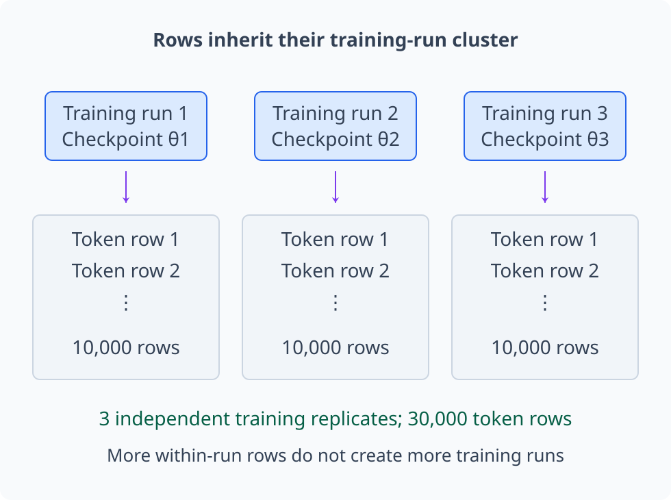

  <figcaption>예제 1의 세 training runs를 각각 별도 cluster로 표시했다. 한 run의 10,000 token rows는 그 checkpoint 안의 정보를 늘리지만 새로운 training replicate를 만들지 않는다. training-seed 일반화의 독립 run 수는 3이며, token 수준의 분석을 금지한다는 뜻은 아니다.</figcaption>
</figure>

## 핵심 개념 3. control은 treatment 외의 차이를 막는다

control condition은 treatment가 없거나 reference treatment가 적용된 비교조건이다. 두 condition은 관심 intervention 외의 code path, compute budget, data order와 evaluation procedure가 같아야 한다.

AI 실험에서 유용한 control은 다음과 같다.

- negative control: effect가 없어야 하는 random direction, shuffled label이나 unrelated task
- positive control: pipeline이 알려진 effect를 검출할 수 있는지 확인하는 condition
- specificity control: target behavior 외의 general capability도 함께 손상됐는지 확인하는 outcome
- sham intervention: intervention 절차는 같지만 target component는 바꾸지 않는 condition

control이 없으면 output change가 target mechanism 때문인지 generic perturbation 때문인지 구분하기 어렵다.

관심 direction과 norm-matched random direction이 어느 task에 어떤 변화를 만드는지 함께 비교한다.

<figure class="lesson-figure lesson-figure--wide" markdown="1">

  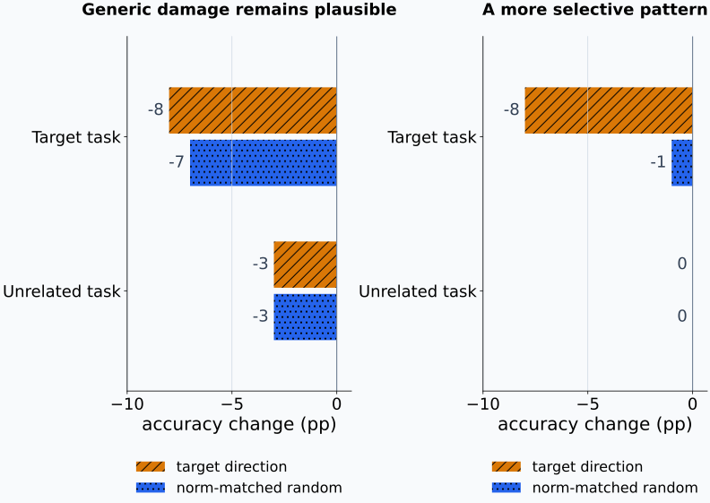

  <figcaption>실제 model 측정이 아닌 두 구성 사례다. 왼쪽은 target accuracy 손상이 −8과 −7 points로 비슷하고 unrelated task도 두 조작에서 −3 points라 generic damage 설명이 남는다. 오른쪽은 target direction의 손상만 크고 unrelated task는 유지되는 더 selective한 패턴이다. 후자도 positive·sham control, 여러 unit의 uncertainty와 intervention validity를 확인하기 전 mechanism의 증명은 아니다.</figcaption>
</figure>

## 핵심 개념 4. random assignment와 blocking은 비교의 공정성을 높인다

random assignment는 pretreatment variables가 treatment assignment와 체계적으로 연결되지 않게 한다. sample이 작을 때 중요한 variable의 imbalance가 우려되면 block 안에서 randomize할 수 있다.

예를 들어 prompt difficulty를 easy·hard로 나누고 각 block 안에서 method order를 randomize한다. analysis에서도 block이나 paired structure를 보존해야 한다. randomization 이후 결과가 마음에 드는 seed만 고르면 assignment가 만든 비교 가능성을 보고 단계에서 다시 훼손한다.

blinding이 가능하면 annotator가 condition을 모르게 해 subjective rating bias를 줄인다. 자동 metric이라도 condition별 preprocessing code가 다르면 measurement bias가 생길 수 있다.

blocking은 서로 다른 난이도를 같은 조건으로 만드는 것이 아니라, 비슷한 난이도 안에서 treatment를 비교하도록 배정 범위를 나누는 것이다. block 안의 차이를 계산한 뒤 전체 효과를 구할 때에는 target population에서 각 block이 차지하는 비중을 반영한다. easy·hard를 같은 수로 모았다고 해서 target population에도 두 집단이 같은 비율이라는 뜻은 아니다. paired 실험에서 method 실행 순서를 무작위화하는 일과, unit에 treatment를 배정하는 일도 어떤 순서 효과를 통제하는지 구분한다.

block 안의 배정과 block 사이의 target 비중은 별도로 읽는다.

<figure class="lesson-figure lesson-figure--wide" markdown="1">

  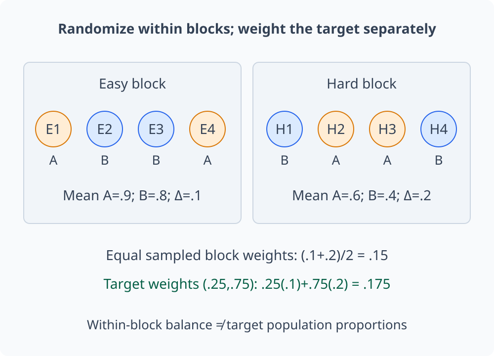

  <figcaption>각 block의 네 unit을 A·B에 두 명씩 배정한 가능한 한 예시다. 가정한 block별 평균 차이가 0.1과 0.2이면 같은 수의 두 block 평균은 0.15다. target의 easy·hard 비중이 0.25·0.75라면 같은 차이의 target-weighted 평균은 0.175다. 한 번의 배정이 모든 원인을 정확히 균형으로 만든다고 가정하지 않는다.</figcaption>
</figure>

## 핵심 개념 5. train·validation·test는 서로 다른 결정을 맡는다

training set은 parameter fitting에, validation set은 hyperparameter와 method 선택에, test set은 선택이 끝난 procedure의 final evaluation에 사용한다. test result를 보고 feature, prompt template나 stopping rule을 바꾸면 test set이 validation 역할을 하게 된다.

data leakage는 evaluation outcome에 관한 정보가 training이나 selection 과정으로 들어가는 현상이다. 예시는 다음과 같다.

- 전체 data로 normalization한 뒤 split하기
- 같은 document의 near-duplicate를 train과 test에 나누기
- test label을 보고 prompt나 threshold를 조정하기
- test benchmark를 반복 확인하며 method family를 선택하기

최종 holdout은 analysis plan이 고정된 뒤 가능한 한 한 번 사용한다. benchmark를 반복 개발에 썼다면 더 이상 untouched test set이라고 부를 수 없다.

전처리도 data에서 파라미터를 얻는 계산이면 fitting 절차의 일부다. 독립 holdout 평가에서는 normalization의 평균·표준편차를 training split에서 추정하고, 그 값을 그대로 validation·test에 적용한다. split 전에 전체 자료로 이를 계산하면 test의 feature 분포가 이미 학습 절차에 들어간다. 서로 의존된 관측을 나누는 경우에도 document·patient 같은 단위를 기준으로 split해야, test가 사실상 같은 unit의 다른 row를 다시 보는 문제가 생기지 않는다.

split의 경계는 fitting·selection·evaluation에 전달되는 정보의 경계다.

<figure class="lesson-figure lesson-figure--wide" markdown="1">

  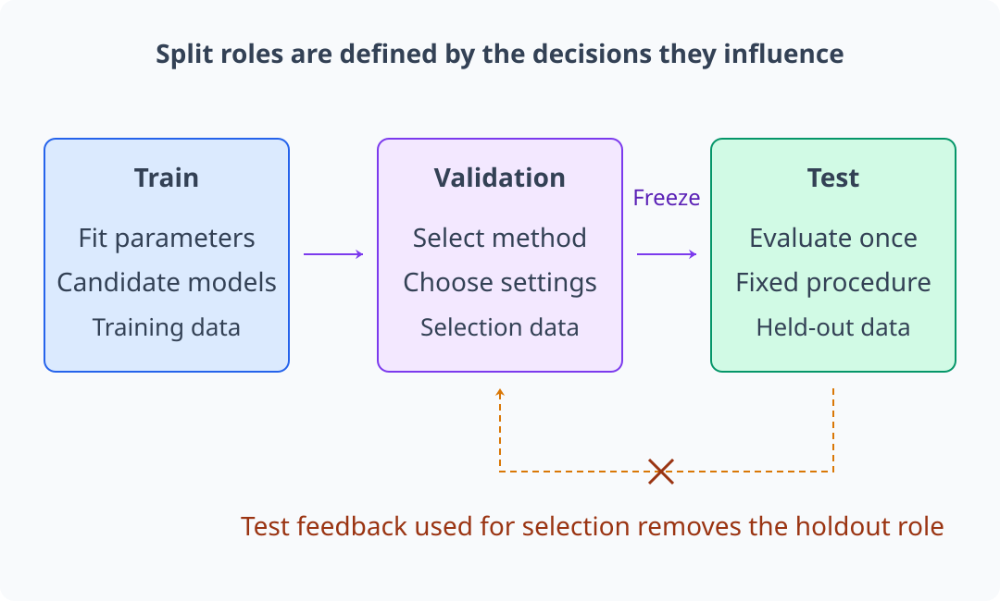

  <figcaption>train은 parameter를 맞추고 validation은 candidate와 설정을 고른다. procedure를 고정한 다음 test로 평가한다. 아래 점선처럼 test 결과를 selection에 되돌리면 test라는 파일 이름을 유지해도 untouched holdout 역할은 사라진다.</figcaption>
</figure>

학습 데이터에서 값을 추정하는 전처리도 같은 경계를 지켜야 한다.

<figure class="lesson-figure lesson-figure--wide" markdown="1">

  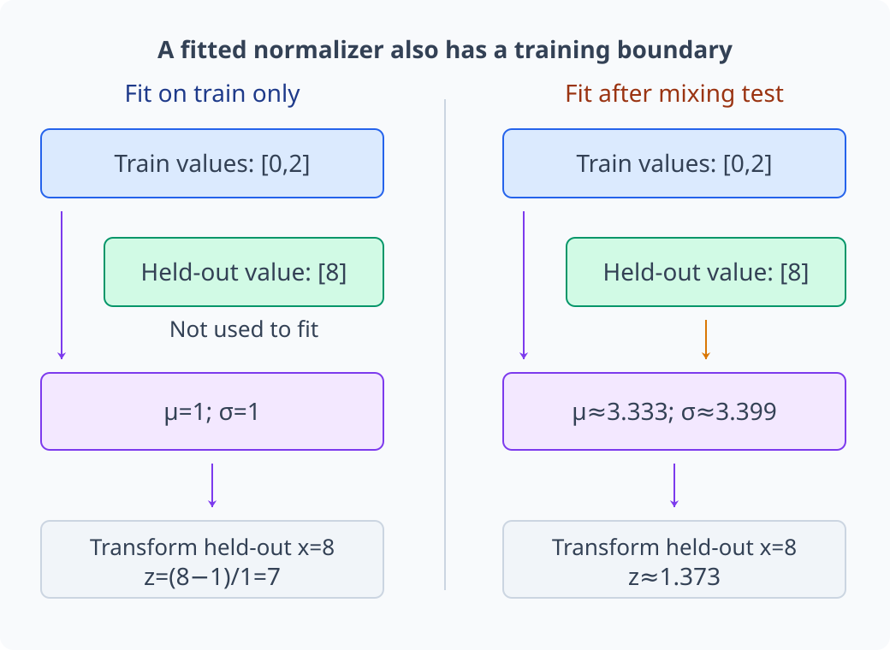

  <figcaption>train 값 [0,2]에서 empirical population standard deviation을 사용하면 μ=1, σ=1이라 test 값 8의 z는 7이다. test까지 섞은 [0,2,8]에서는 μ≈3.333, σ≈3.399로 바뀌어 z≈1.373이다. 독립 holdout 평가에서 오른쪽 fitting은 test feature 정보를 전처리에 사용한다. 각 자료에서 분모 n의 분산을 사용한 구성 계산이며, 표본분산의 분모 n−1과 구분한다.</figcaption>
</figure>

의존된 row가 split 경계를 넘는지 보려면 원본 document 단위도 함께 추적한다.

<figure class="lesson-figure lesson-figure--wide" markdown="1">

  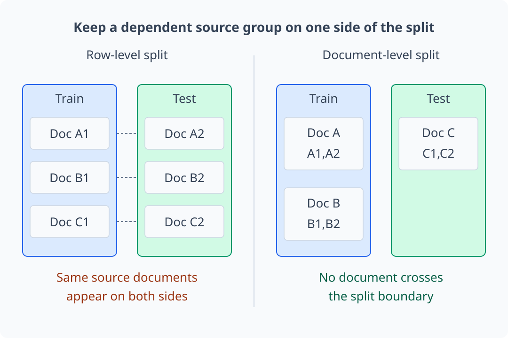

  <figcaption>A1·A2, B1·B2, C1·C2는 각각 같은 document에서 나온 의존된 두 chunks다. 왼쪽은 모든 document가 train과 test에 함께 등장한다. 오른쪽은 document를 통째로 배정해 그 경로의 leakage를 막는다. document별 split 하나로 다른 종류의 leakage까지 모두 없어졌다는 뜻은 아니다.</figcaption>
</figure>

## 핵심 개념 6. seed는 변동 원천을 지정하는 기록이다

seed는 initialization, data order, dropout이나 sampling sequence를 재생하는 데 필요하다. seed 하나의 결과는 algorithm의 random variation을 나타내지 못한다. 여러 independent training runs를 수행하고 run-level 결과를 모두 보고해야 한다.

같은 trained model에서 decoding seed만 바꾼 반복과 model initialization부터 바꾼 반복은 다른 uncertainty를 측정한다. generalization target이 “이 checkpoint의 stochastic output”인지 “이 training procedure가 만드는 model”인지에 따라 replicate 단위가 달라진다.

평균만 보고하지 말고 run-level value, sample size, dispersion 또는 confidence interval을 함께 제시한다. best seed만 고르고 나머지를 숨기면 selection bias가 생긴다.

output 개수가 같아도 어느 계산부터 다시 실행했는지에 따라 replicate 수준은 달라진다.

<figure class="lesson-figure lesson-figure--wide" markdown="1">

  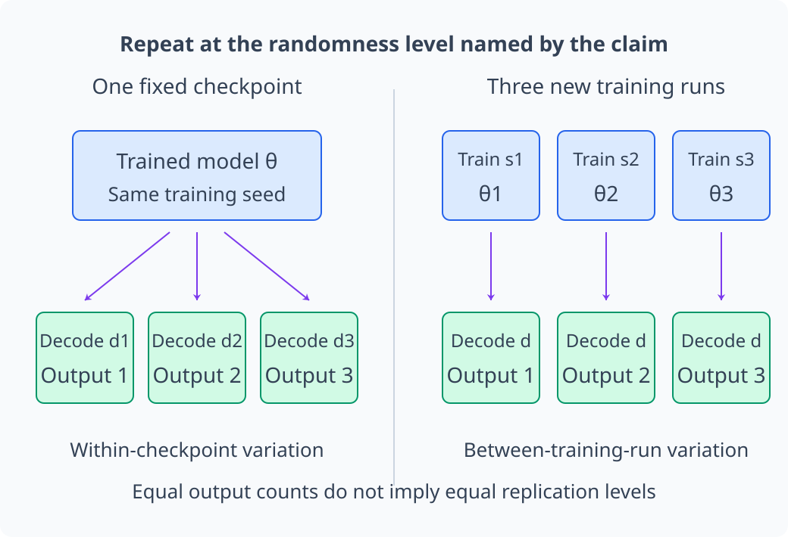

  <figcaption>왼쪽은 같은 θ에서 decoding seed만 세 번 바꾼다. 오른쪽은 initialization·data order 등 training randomness부터 달리한 세 runs의 θ1·θ2·θ3를 사용한다. 같은 세 output이라도 왼쪽은 해당 checkpoint 안의 decoding variation, 오른쪽은 training-run variation을 포함한다. seed 기록 자체가 독립 data나 독립 training replicate를 만드는 것은 아니다.</figcaption>
</figure>

## 핵심 개념 7. paired design은 공통 난이도를 제거한다

같은 prompt, dataset split과 seed condition에서 method A와 B를 비교할 수 있으면 unit별 difference

\[
D_i=Y_i(A)-Y_i(B)
\]

를 분석한다. estimated mean difference는

\[
\widehat\Delta
=\frac1n\sum_{i=1}^{n}D_i
\]

이다. prompt 난이도처럼 두 method에 공통으로 작용하는 variation이 차이에서 상쇄될 수 있다.

paired design을 사용했으면 permutation test나 bootstrap도 pair를 함께 움직여야 한다. A와 B의 observation을 따로 섞거나 재표집하면 원래 pairing을 잃는다.

독립인 $n\ge2$개의 pair가 같은 분포에서 나왔고 분산이 유한하면, 평균 차이의 standard error는 $D_i$들의 표본표준편차를 $\sqrt n$으로 나누어 추정한다. 두 score의 표준편차를 따로 쓰는 것이 아니라 같은 unit에서 만든 차이의 변동을 사용한다. M04-09에서처럼 공분산이 양수이면 차이의 분산에서 공통 변동이 줄어들 수 있지만, pairing만으로 항상 정밀도가 좋아지는 것은 아니다. pair들이 같은 training run 안에 묶여 있으면 그 상위 cluster의 의존성도 남는다.

먼저 같은 prompt의 두 score를 연결한 뒤 그 차이를 별도 축에 옮긴다.

<figure class="lesson-figure lesson-figure--wide" markdown="1">

  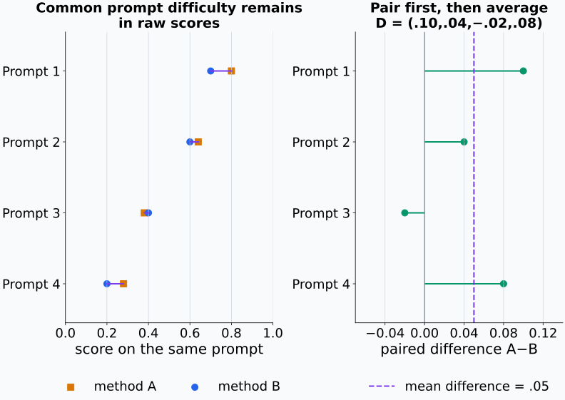

  <figcaption>B=(0.7,0.6,0.4,0.2)에 예제 3의 차이 D=(0.10,0.04,−0.02,0.08)를 더해 A를 구성했다. 왼쪽의 각 선은 같은 prompt의 pair이고 오른쪽은 그 차이를 옮긴 것이다. 표본 평균 차이는 0.05이며 이 네 관측만으로 target population의 Δ를 확정하지 않는다. bootstrap에서도 pair와 필요한 상위 cluster를 유지한다.</figcaption>
</figure>

## 핵심 개념 8. 탐색과 확인을 분리한다

exploratory analysis는 pattern을 찾고 새 hypothesis를 만드는 데 사용한다. confirmatory analysis는 미리 정한 hypothesis, primary outcome, exclusion rule, sample size와 test를 평가한다.

preregistration이나 timestamped analysis plan은 결과를 보기 전의 결정을 기록한다. 탐색을 막는 장치가 아니라 사전에 정한 분석과 결과를 본 뒤 추가한 분석을 독자가 구분하게 하는 장치이다.

많은 layer·head·prompt·metric을 탐색하면 false discovery 기회가 늘어난다. primary test를 정하고 나머지는 multiplicity correction을 적용하거나 exploratory result로 명시한다. 탐색 dataset에서 고른 hypothesis는 independent confirmation set에서 다시 평가할 수 있다.

발견한 후보와 분석 규칙을 고정하는 시점이 두 data의 역할을 나눈다.

<figure class="lesson-figure" markdown="1">

  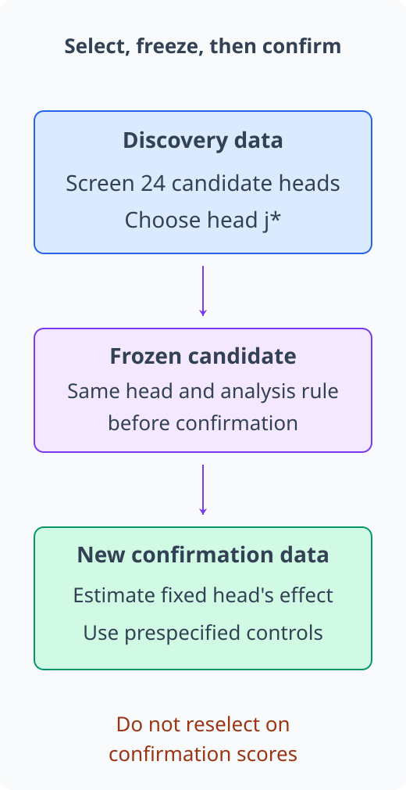

  <figcaption>24개 heads의 탐색에서 고른 j*를 confirmation 전에 고정한다. 새 data에서는 그 head와 미리 정한 outcome·control·analysis를 평가한다. confirmation score를 보며 다시 head를 고르면 그 자료도 selection에 사용된다. 탐색을 금지하는 절차가 아니라 data가 맡은 역할을 구분하는 절차다.</figcaption>
</figure>

## 핵심 개념 9. effect size와 uncertainty를 함께 보고한다

“statistically significant”만으로 effect의 크기와 usefulness를 알 수 없다. report에는 다음이 포함돼야 한다.

- estimand와 point estimate
- confidence interval 또는 sampling uncertainty
- experimental unit과 unit 수
- treatment·control과 assignment procedure
- 모든 planned outcome과 correction rule
- raw 또는 unit-level summary와 exclusion 내역

p-value가 작아도 effect가 작을 수 있고, p-value가 크더라도 interval이 넓어 meaningful effect를 배제하지 못할 수 있다. practical threshold를 미리 정하면 statistical detectability와 substantive importance를 분리할 수 있다.

zero와 practical threshold를 같은 효과 축에서 비교하면 interval이 답하는 질문이 분리된다.

<figure class="lesson-figure" markdown="1">

  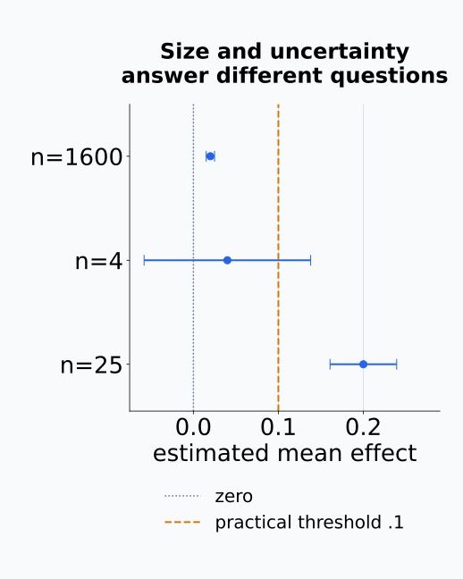

  <figcaption>독립 normal units의 알려진 표준편차를 0.1로 두고, 구성한 관측 평균 0.02·0.04·0.2에 각각 n=1600·4·25의 95% interval인 평균±1.96×0.1/√n을 계산했다. 첫 interval은 zero를 제외하지만 threshold 0.1보다 작다. 둘째는 zero와 threshold를 모두 포함한다. 셋째는 threshold 위에 놓인다. 실제 실험 자료나 별도의 p-value 계산 결과는 아니다.</figcaption>
</figure>

## 핵심 개념 10. 재현성은 실행에 필요한 상태를 보존하는 일이다

분야마다 reproducibility와 replication의 용어 사용이 다르므로 report에서 operational definition을 적는다. 이 책에서는 다음처럼 구분한다.

- repeatability: 같은 team이 같은 code·data·environment로 계산을 다시 실행한다.
- computational reproducibility: 다른 사람이 제공된 code·data·environment로 같은 result를 재생한다.
- replication: 독립 구현, 새 data나 새 model에서 scientific claim을 다시 시험한다.

보존할 항목에는 code commit, dependency와 hardware version, data source·license·hash, split index, model checkpoint, preprocessing, prompt, seed, command, configuration과 expected output이 있다. notebook의 마지막 cell output만 남기는 것으로는 계산 경로를 복원하기 어렵다.

## 핵심 개념 11. 모델 해석 실험은 관찰과 intervention을 연결한다

해석 실험은 다음 구조로 설계할 수 있다.

1. claim: 어떤 component가 어떤 behavior에 필요하거나 충분하다고 주장하는가?
2. observational screen: activation, attribution이나 probe로 후보를 찾는다.
3. intervention: ablation, patching, steering 중 claim에 맞는 조작을 정한다.
4. controls: random·norm-matched·unrelated behavior와 sham condition을 둔다.
5. analysis: unit, primary outcome, paired contrast와 uncertainty를 정한다.
6. validation: held-out prompt, model seed·size·dataset에서 effect를 다시 측정한다.

candidate discovery와 confirmation에 같은 data를 쓰면 winner's curse가 생긴다. head를 고른 data와 causal effect를 평가할 data를 분리한다.

관측된 후보 효과에는 실제 효과와 표집 오차가 함께 들어 있다. 많은 후보 중 관측 효과가 가장 큰 것을 고르면 실제 효과가 큰 후보뿐 아니라 이번 표본에서 오차가 유리하게 나온 후보도 선택되기 쉽다. 같은 data로 그 후보의 효과를 다시 보고하면 이 선택된 오차까지 반복해서 효과로 읽는다. 별도의 confirmation data에서는 고른 후보와 분석 규칙을 고정한 채 새 표집 변동 아래 효과를 측정하므로, 발견 단계의 최대값과 확인 단계의 추정값을 구분할 수 있다.

실제 효과를 같게 둔 후보에서도 탐색에서 고른 maximum과 새 자료의 추정값은 다를 수 있다.

<figure class="lesson-figure lesson-figure--wide" markdown="1">

  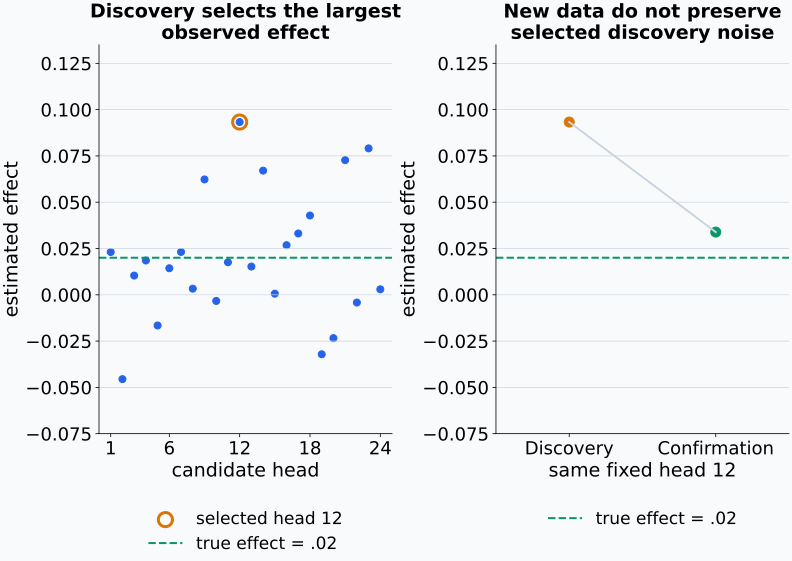

  <figcaption>모든 후보의 실제 효과를 0.02, 독립 추정 오차를 standard deviation 0.04의 normal noise로 두고 고정 seed로 계산한 한 구성 사례다. 탐색에서 선택된 head 12의 추정값은 약 0.093이고 같은 head의 독립 확인 추정값은 약 0.034다. neural-model 실행 결과가 아니며 확인값이 매번 감소한다는 뜻도 아니다. 선택된 발견 오차가 새 자료에 그대로 보존되지 않는다는 질문을 보여 준다.</figcaption>
</figure>

## 예제 1. token row를 replicate로 세는 오류

model seed 3개에서 각각 token 10,000개의 activation을 얻었다고 하자. claim이 training seed를 바꿔도 effect가 유지된다는 것이라면 독립 run 수는 30,000이 아니라 3이다.

token-level variation은 각 run 안의 uncertainty를 설명하지만 seed-level generalization을 대신하지 않는다. 더 많은 model runs가 필요하거나 claim을 세 checkpoint에 한정해야 한다.

## 예제 2. test set leakage

연구자가 test accuracy를 확인하며 learning rate 20개와 prompt template 10개를 비교한 뒤 최고 조합을 같은 test score로 보고했다. test set이 $200$개 candidate의 selection에 사용됐으므로 reported maximum에는 selection bias가 들어간다.

candidate 선택에는 validation set을 쓰고, 선택을 마친 procedure를 untouched test set에서 한 번 평가해야 한다.

## 예제 3. paired prompt 비교

네 prompt에서 method A와 B의 score 차이가

\[
(0.10,0.04,-0.02,0.08)
\]

이라 하자. paired mean difference는

\[
\widehat\Delta
=\frac{0.10+0.04-0.02+0.08}{4}
=0.05
\]

이다. uncertainty를 구할 때 prompt pair를 단위로 재표집한다.

## 예제 4. activation ablation의 control

특정 direction을 제거했더니 target task accuracy가 $8$ percentage points 낮아졌다고 하자. 같은 norm의 random directions도 평균 $7$ points를 낮춘다면 target specificity evidence는 약하다.

target direction에서만 큰 손상이 나타나고 unrelated task는 유지되며 activation patch로 behavior가 복원된다면 mechanism claim에 더 가까운 evidence가 된다. 그래도 여러 prompt와 model seed에서 effect estimate와 interval을 보고해야 한다.

## 흔한 오해

### 오해 1. observation 수가 많으면 independent sample도 많다

같은 cluster에서 나온 row는 공통 원인을 공유할 수 있다. experimental unit과 dependence structure가 effective sample size를 정한다.

### 오해 2. seed를 기록하면 한 번의 run으로 충분하다

seed 기록은 한 run의 재실행을 돕는다. training procedure의 seed variation을 추정하려면 independent runs가 필요하다.

### 오해 3. public benchmark는 언제나 test set이다

benchmark score를 보며 method를 반복 수정했다면 selection data가 됐다. 이름이 test set이어도 untouched holdout의 역할을 하지 않는다.

### 오해 4. negative result는 재현 실패이다

새 population, implementation이나 power 차이 때문에 결과가 달라질 수 있다. protocol fidelity와 uncertainty를 확인한 뒤 claim의 적용범위를 수정해야 한다.

### 오해 5. code 공개만으로 experiment가 재현 가능하다

data version, checkpoint, preprocessing, environment와 실행 configuration이 빠지면 같은 code도 다른 result를 낼 수 있다.

## 연습문제

### 1. experimental unit

환자 20명에게서 각각 image 50장을 얻고 treatment는 환자 단위로 배정했다. experimental unit과 image row 수를 각각 말하라.

해설 보기

experimental unit은 treatment가 독립 배정된 환자이므로 20명이다. image row는 1,000개이지만 같은 환자의 image는 cluster를 이룬다. 1,000개를 독립 treatment replicate로 세면 pseudoreplication이다.

### 2. control 설계

특정 activation direction ablation이 answer accuracy를 낮췄다. target-specific effect인지 확인할 control 두 가지를 제안하라.

해설 보기

같은 norm의 random direction이나 shuffled target direction을 제거하는 negative control을 둘 수 있다. unrelated task accuracy를 함께 측정하는 specificity control도 필요하다. ablation을 수행하되 activation을 바꾸지 않는 sham operation은 code-path effect를 확인한다.

### 3. split의 역할

validation set과 test set의 역할을 설명하고 test score를 본 뒤 threshold를 조정하면 무엇이 달라지는지 쓰라.

해설 보기

validation set은 hyperparameter와 decision rule 선택에 사용하고 test set은 선택이 끝난 procedure를 평가한다. test score를 보고 threshold를 조정하면 test set도 selection에 사용되므로 더 이상 untouched final evaluation set이 아니다.

### 4. seed와 replicate

한 checkpoint에서 decoding seed를 30번 바꿔 text를 생성했다. “training seed가 달라도 method effect가 유지된다”는 claim을 평가하기에 충분한지 판단하라.

해설 보기

충분하지 않다. 30회 반복은 한 checkpoint의 stochastic decoding variation을 측정한다. training-seed generalization에는 initialization과 data order를 달리해 독립적으로 학습한 여러 checkpoint가 필요하다.

### 5. paired mean difference

같은 세 prompt에서 A와 B의 score가 각각 $(0.8,0.6,0.9)$와 $(0.7,0.5,0.85)$이다. A minus B의 paired mean difference를 구하라.

해설 보기

prompt별 difference는 $(0.1,0.1,0.05)$이다. 따라서

\[
\widehat\Delta
=\frac{0.1+0.1+0.05}{3}
=\frac{0.25}{3}
\approx0.0833.
\]

### 6. 다중비교와 확인

24개 layer에서 probe score를 비교해 가장 높은 layer를 고르고 같은 data에서 그 layer의 p-value를 보고했다. 설계를 어떻게 바꿔야 하는가?

해설 보기

layer 선택과 confirmatory test에 같은 data를 쓰면 selection을 무시한 p-value가 된다. discovery split에서 layer를 고르고 independent confirmation split에서 미리 정한 contrast를 평가할 수 있다. 같은 data에서 여러 layer를 함께 검정한다면 family를 정의하고 multiplicity correction을 적용하며 exploratory analysis임을 밝혀야 한다.

### 7. M04 누적 확인과제

새 probe가 baseline보다 concept classification accuracy가 높고, probe direction ablation 뒤 target behavior가 감소했다. 이 연구를 평가하는 한 페이지 분석 계획을 작성하라. population, unit, estimand, split, control, uncertainty와 허용되는 claim을 포함하라.

해설 보기

예시 계획은 다음 요소를 포함한다.

- population: 지정한 model family와 held-out prompt distribution
- unit: prompt를 기본 paired unit으로 두고 model seed를 독립 training replicate로 둠
- estimand: held-out prompt에서 probe와 baseline의 accuracy difference, ablation과 sham condition의 target-score difference
- split: probe fitting·candidate discovery와 confirmation prompt를 분리하고 final test를 method 선택에 사용하지 않음
- control: label permutation, norm-matched random direction, sham ablation과 unrelated behavior outcome
- uncertainty: prompt-paired bootstrap과 seed-level result를 분리해 effect estimate와 interval을 보고하고 layer 탐색에는 correction 적용
- claim: probe result만으로는 decodability를, controlled ablation은 scoped necessity evidence를 지지함. sufficiency나 다른 model·population 일반화는 별도 patching·replication 없이 주장하지 않음

analysis plan에는 data·checkpoint version, preprocessing, seed, exclusion rule과 primary outcome도 기록해야 한다.

## 단원 요약

- experiment는 claim을 population·treatment·outcome·estimand로 바꾸는 데서 시작한다.
- experimental unit은 독립 assignment나 replicate의 단위이며 data row 수와 다를 수 있다.
- negative·positive·specificity·sham control은 alternative explanation을 검사한다.
- random assignment, blocking과 blinding은 비교와 측정의 bias를 줄인다.
- train·validation·test split은 fitting·selection·final evaluation을 분리한다.
- seed가 나타내는 randomness와 generalization target에 맞춰 replicate를 정한다.
- exploratory discovery와 confirmatory test를 분리하고 multiplicity를 기록한다.
- effect estimate, uncertainty, unit 수와 모든 run을 함께 보고한다.
- 재현 가능한 계산에는 code·data·environment·configuration·split이 필요하다.
- 모델 해석 experiment는 candidate discovery와 controlled intervention confirmation을 분리한다.

## 통과 기준

다음 질문에 자료를 보지 않고 답할 수 있으면 통과한다.

- vague claim을 estimand와 outcome으로 바꿀 수 있는가?
- experimental unit과 row를 구분할 수 있는가?
- claim에 맞는 treatment와 control을 설계할 수 있는가?
- train·validation·test leakage를 찾을 수 있는가?
- seed 반복이 나타내는 uncertainty를 설명할 수 있는가?
- paired design과 cluster structure를 분석에 반영할 수 있는가?
- exploratory·confirmatory analysis를 구분할 수 있는가?
- 재실행과 independent replication에 필요한 기록을 열거할 수 있는가?
- probe 결과의 통계적 평가와 허용되는 주장을 분석 계획으로 작성할 수 있는가?

## 다음 단원

- [N05-01 tensor와 계산 그래프](../../part-2-neural-computation/N05/N05-01-tensors-computation-graphs.md)

## 집필자 점검표

- [x] 학습 목표가 관찰 가능한 행동으로 작성됐다.
- [x] claim·estimand·measurement를 연결했다.
- [x] experimental unit과 pseudoreplication을 구분했다.
- [x] control·randomization·blocking을 설명했다.
- [x] split과 leakage를 구분했다.
- [x] seed·paired design·다중비교를 분석 단위와 연결했다.
- [x] 재현성에 필요한 artifact를 열거했다.
- [x] M04 누적 확인과제를 포함했다.
- [x] 모든 문제에 해설이 있다.
- [x] 모델 해석 주장의 강도를 구분했다.
- [x] 용어집과 표기 규칙을 따랐다.
- [x] 선수지식 밖의 내용을 몰래 요구하지 않는다.
- [x] 내부 링크와 수식 구분자를 확인했다.
- [x] Common spoken reading이 실제 영어 학술 발화이며 한글 음역이나 기계적 직역을 포함하지 않는다.
