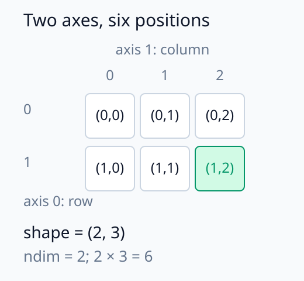
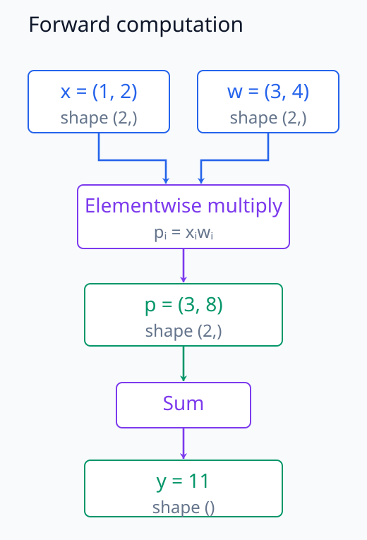
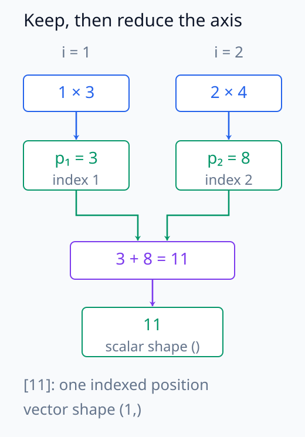
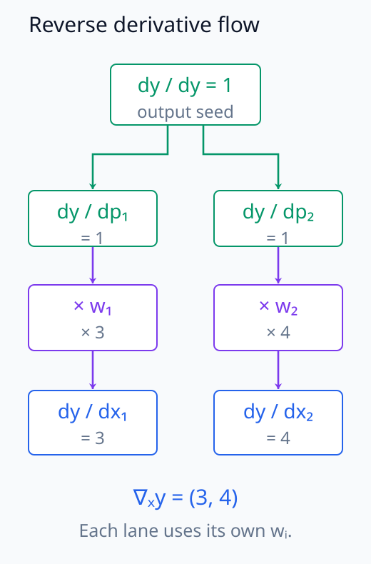
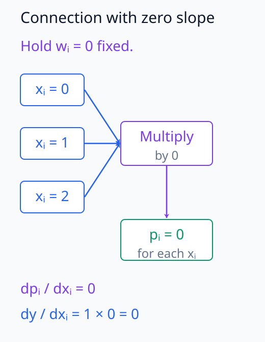

# N05-01. tensor와 계산 그래프

## 이 단원이 필요한 이유

신경망 코드는 많은 tensor 연산을 연달아 실행한다. 값만 보면 최종 출력은 확인할 수 있지만, 어느 연산이 어떤 값을 필요로 했는지 모르면 shape 오류와 gradient 경로를 추적하기 어렵다. 계산 그래프는 중간값과 연산 의존관계를 함께 기록한다.

이 단원에서는 scalar·vector·matrix를 서로 다른 종류의 객체로 떼어 놓지 않고 축 수가 다른 tensor로 연결한다. 작은 곱셈과 합 계산을 손으로 수행한 뒤 같은 계산을 PyTorch로 실행한다.

## 학습 목표

이 단원을 마치면 다음을 할 수 있다.

- tensor의 axis, shape, dtype과 device를 구분할 수 있다.
- 연산을 계산 그래프의 node와 edge로 나타낼 수 있다.
- forward pass에서 중간값과 shape를 순서대로 계산할 수 있다.
- PyTorch tensor 연산의 출력과 손계산을 대조할 수 있다.
- 출력에서 입력으로 이어지는 연산 의존경로를 찾을 수 있다.

## 선수지식 확인

- 선수 단원: [M00-09 scalar, vector, matrix와 shape](../../part-1-foundations/M00/M00-09-scalars-vectors-matrices-shape.md)
- 선수 단원: [M03-14 자동미분과 역전파](../../part-1-foundations/M03/M03-14-automatic-differentiation-backpropagation.md)
- 확인 질문: $2\times3$ 행렬에서 두 axis가 각각 몇 개의 위치를 갖는지 설명할 수 있는가?
- 확인 질문: $y=f(g(x))$에서 $y$가 의존하는 중간값을 찾을 수 있는가?

## 기호와 용어

| 기호·용어 | Common spoken reading | 의미 | shape·범위 |
|---|---|---|---|
| $x$ | `x` | scalar 또는 tensor 원소 | 문맥에 따라 정함 |
| $\mathbf x$ | `x` | 원소를 한 축에 모은 vector | $\mathbf x\in\mathbb R^d$ |
| $\mathbf X$ | `X` | 둘 이상의 축을 가진 tensor의 예 | 예: $\mathbf X\in\mathbb R^{B\times d}$ |
| $\mathbf x\odot\mathbf w$ | `x elementwise times w` | 같은 위치의 원소끼리 곱하는 연산 | 두 입력 shape가 같음 |
| $\operatorname{shape}(\mathbf X)$ | `the shape of X` | axis별 길이를 나열한 tuple | 음이 아닌 정수들의 tuple |
| dtype | `data type` | 원소의 수치 표현 형식 | 예: `float32` |
| device | `device` | tensor가 저장되고 연산되는 장치 | 이 책의 필수 실습은 CPU |
| computation graph | `computation graph` | 값과 연산 의존관계를 나타내는 directed graph | node와 edge로 구성 |

## 핵심 개념 1. scalar부터 고차 tensor까지

tensor는 여러 축을 따라 수를 배열한 객체다. 축 수를 rank 또는 number of dimensions라고 부르기도 하지만, 행렬의 rank와 혼동하지 않도록 코드에서는 `ndim`이라는 이름을 자주 쓴다.

| 객체 | 축 수 | shape 예 |
|---|---:|---|
| scalar | 0 | `()` |
| vector | 1 | `(d,)` |
| matrix | 2 | `(m, n)` |
| 고차 tensor | 3 이상 | `(B, T, d)` |

shape `(2, 3)`은 첫째 axis에 위치가 2개, 둘째 axis에 위치가 3개 있다는 뜻이다. 총 원소 수는 $2\cdot3=6$이다. axis의 의미는 shape만으로 정해지지 않는다. 같은 `(2, 3)`이라도 두 sample의 세 feature일 수도 있고, 두 token의 세 차원 표현일 수도 있다.


아래 배열에서 행 index와 열 index가 한 위치를 고르는 과정을 확인한다.

<figure class="lesson-figure" markdown="1">



<figcaption>첫째 index는 행을, 둘째 index는 열을 고른다. (1, 2)는 둘째 행의 셋째 위치이며, 이 위치가 sample·feature인지 token·차원인지는 별도로 정한다.</figcaption>

</figure>

## 핵심 개념 2. dtype과 device는 shape와 다른 정보다

shape는 원소 배치를, dtype은 각 원소의 표현 방식을, device는 저장·연산 위치를 말한다. 세 정보가 모두 같아야 한다는 뜻은 아니다. 예를 들어 같은 shape `(2,)`인 tensor도 하나는 `float32`, 다른 하나는 정수형일 수 있다.

N05 필수 실습은 `float32`와 CPU를 사용한다. 이는 교육용 실행 조건이다. `float32`라는 선택이 수학적 vector의 정의를 바꾸지는 않지만, 실제 계산에는 반올림 오차가 생길 수 있다.

## 핵심 개념 3. 계산 그래프의 node와 edge

다음 계산을 생각하자.

\[
\mathbf p=\mathbf x\odot\mathbf w,
\qquad
y=\sum_{i=1}^{2}p_i
\]

값을 담는 $\mathbf x,\mathbf w,\mathbf p,y$와 연산인 원소별 곱·합을 node로 볼 수 있다. directed edge는 한 node의 출력이 다음 연산의 입력으로 사용된다는 의존관계를 나타낸다.

```text
x ─┐
   ├─ elementwise multiply ─ p ─ sum ─ y
w ─┘
```

edge가 데이터 전체를 복사한다는 뜻은 아니다. 계산 그래프는 수학적 의존관계를 나타낸다. 실제 framework의 메모리 배치와 kernel 실행 방식은 별도 문제다.

값과 연산을 모두 node로 그리는 위 방식에서는 곱 node가 두 입력 값을 받아 $\mathbf p$를 만들고, 합 node가 $\mathbf p$를 받아 $y$를 만든다. 값만 node로 표시하는 방식이라면 $\mathbf x\to\mathbf p$, $\mathbf w\to\mathbf p$와 $\mathbf p\to y$로 같은 의존관계를 쓰고 연결에 연산을 표시할 수 있다. 어느 표현을 쓰든 한 연산에 필요한 입력이 먼저 계산돼 있어야 다음 값을 구할 수 있다. node의 배치 순서보다 입력·출력의 연결이 계산 순서를 결정한다.


아래 그래프의 합류 지점과 화살표를 따라가면 어떤 입력이 먼저 필요한지 볼 수 있다.

<figure class="lesson-figure" markdown="1">



<figcaption>x와 w가 모두 곱 연산에 들어가 p를 만든다. 합 연산은 p가 계산된 뒤에 실행되므로, 화살표는 필요한 값의 선행 관계를 보여 준다.</figcaption>

</figure>

## 핵심 개념 4. forward value와 중간값

forward pass는 입력에서 출력 방향으로 값을 계산한다. $\mathbf x=(1,2)$, $\mathbf w=(3,4)$이면

\[
\mathbf p=(1\cdot3,\;2\cdot4)=(3,8)
\]

이고

\[
y=3+8=11
\]

이다. 이때 shape는 다음처럼 변한다.

\[
(2,)\ \text{and}\ (2,)
\longrightarrow
(2,)
\longrightarrow
()
\]

마지막 `()`는 scalar tensor의 shape다. 숫자 하나라는 사실과 tensor가 아닌 Python scalar라는 사실은 같지 않다. PyTorch의 0차 tensor도 shape `()`와 dtype, device를 가진다.

원소별 곱은 $i$를 정했을 때 $x_i$와 $w_i$를 곱하므로 결과에도 같은 index $i$가 남는다. 반면 전체 합은 두 $p_i$를 하나의 값으로 모아 더 이상 $i$로 고를 위치를 남기지 않는다. 이것이 shape에서 축 하나가 사라지는 이유다. 원소를 하나 담은 `(1,)`도 숫자는 하나지만 index를 갖는 vector이고, 모든 축을 합친 `()`와는 다른 shape다.


아래 그림은 두 index가 남는 곱과 index가 사라지는 합을 나눠 보여 준다.

<figure class="lesson-figure" markdown="1">



<figcaption>i = 1과 i = 2의 곱은 서로 다른 위치에 남는다. 전체 합에서는 두 위치가 한 값으로 모이며, 숫자 하나를 담아도 index가 남는 [11]과 scalar 11은 shape가 다르다.</figcaption>

</figure>

## 핵심 개념 5. 의존경로와 gradient

$y$는 $p_1,p_2$에 의존하고 각 $p_i$는 $x_i,w_i$에 의존한다. 따라서 계산 그래프에는 $\mathbf x$에서 $y$로 가는 순방향 경로가 있다. gradient를 계산할 때에는 이 의존관계를 출력 쪽에서 거슬러 추적한다. 미분하면

\[
\frac{\partial y}{\partial x_i}=w_i
\]

이므로 이 예제의 gradient는

\[
\nabla_{\mathbf x}y=(3,4)
\]

이다. gradient 값은 graph의 연결만으로 정해지지 않는다. 각 node가 수행한 함수와 forward 값도 필요하다.

$y=p_1+p_2$이므로 각 중간값에 대한 $\partial y/\partial p_i$는 1이다. $p_i=x_iw_i$에서는 $w_i$를 고정하고 $x_i$로 미분하면 $w_i$가 남으며, 다른 위치의 $p_j$는 $x_i$에 의존하지 않는다. 연쇄법칙으로 두 local derivative를 곱하면 $1\cdot w_i$가 되어 위 gradient를 얻는다. 만약 $w_i=0$이면 graph의 연결은 그대로 있어도 해당 미분값은 0이다. 의존경로가 있다는 사실과 지금 입력에서 변화가 전달되는 크기를 구분해야 한다.


아래 역방향 그림에서 합의 local derivative와 곱의 local derivative를 차례로 곱한다.

<figure class="lesson-figure" markdown="1">



<figcaption>출력의 미분 seed 1은 합의 각 입력에 1씩 전달된다. 각 곱에서는 저장된 w₁ = 3과 w₂ = 4를 곱하므로, x에 대한 두 미분값은 3과 4다.</figcaption>

</figure>


아래 그림에서 여러 입력이 같은 0으로 보내져도 계산 경로 자체는 남는다.

<figure class="lesson-figure" markdown="1">



<figcaption>wᵢ = 0으로 고정하면 xᵢ의 여러 값이 모두 pᵢ = 0으로 연결된다. 계산 경로는 남아 있지만 이 위치의 local derivative와 최종 미분값은 0이다.</figcaption>

</figure>

## 예제 1. 손으로 shape와 값을 추적하기

### 문제

$\mathbf x=(1,2)$와 $\mathbf w=(3,4)$에 대해 $\mathbf p=\mathbf x\odot\mathbf w$, $y=p_1+p_2$를 계산하고 모든 shape를 적어라.

### 풀이

두 입력은 길이 2인 vector이므로 shape가 모두 `(2,)`다. 원소별 곱은 같은 위치의 두 원소를 곱한다.

\[
\mathbf p=(1\cdot3,2\cdot4)=(3,8),
\qquad
\operatorname{shape}(\mathbf p)=(2,)
\]

두 원소를 합하면 $y=11$이고 shape는 `()`다.

### 결과의 의미

원소별 곱 node는 axis를 유지했고, 합 node는 그 axis를 제거했다. 값과 shape를 함께 기록하면 어느 연산에서 차원이 사라졌는지 찾을 수 있다.

## 예제 2. 모델에서 찾기

신경망의 affine transformation, activation, attention과 loss는 모두 계산 그래프의 node로 나타낼 수 있다. 모델 해석에서 특정 activation을 저장한다는 말은 대개 graph의 중간 node가 낸 값을 기록한다는 뜻이다. 중간값을 관찰했다는 사실만으로 그 값이 출력의 원인이라고 결론 내릴 수는 없다. 인과 주장은 개입과 대조조건이 더 필요하다.

## 실행 실습

### 실행 환경과 원본

- 환경: Python 3.12, PyTorch 2.13.0 CPU, NumPy 2.5.3
- 확인일: 2026-10-01
- 구성요소 등급: `Stable core`
- 예제 ID: `n05_01_tensor_graph`
- 코드 원본: `labs/N05/n05_01_tensor_graph.py`
- 테스트: `tests/N05/test_n05_01.py`
- 실행 명령: `.venv\Scripts\python.exe -m labs.N05.n05_01_tensor_graph`

### 자원 예산

이 예제는 길이 2 tensor, parameter 0개, 학습 step 0개를 사용한다. CPU thread는 intra-op과 inter-op 각각 1개이며 hard timeout은 10초다.

### 실제 코드와 실행 결과

아래 위치에는 site build가 코드 원본과 실제 실행 결과를 삽입한다. Markdown 원본에는 실행 코드를 복제하지 않는다.

<!-- N05_EXAMPLE: n05_01_tensor_graph -->

### 결과 해석

`product=[3.0, 8.0]`과 `output=11.0`은 손계산과 같다. `product`의 shape는 `[2]`지만 모든 원소를 합친 `output`의 shape는 `[]`다. JSON의 빈 shape list는 PyTorch scalar tensor의 `torch.Size([])`에 대응한다.

`x.grad=[3.0, 4.0]`은 $\nabla_{\mathbf x}y=\mathbf w$를 확인한다. 테스트는 문자열이 아니라 `rtol=10^{-6}`, `atol=10^{-7}`로 값과 gradient를 비교한다.

## 흔한 오해

### 오해 1. axis 수와 행렬 rank는 같다

코드의 tensor rank를 축 수라는 뜻으로 쓰는 경우가 있지만, 선형대수의 matrix rank는 독립인 행이나 열의 최대 개수다. 이 책은 혼동을 피하려고 축 수에는 `ndim`을 우선 사용한다.

### 오해 2. 계산 그래프의 edge는 인과관계를 증명한다

edge는 지정된 프로그램 안의 계산 의존관계를 나타낸다. 특정 activation이 행동의 원인이라는 과학적 주장은 개입 결과와 대조조건을 요구한다.

### 오해 3. 실행되면 계산이 옳다

코드가 오류 없이 끝난 것은 실행 가능성을 확인한다. 손계산과 수치·shape·gradient가 일치하는지는 별도 test가 확인해야 한다.

## 연습문제

### 1. tensor 분류

shape가 `()`, `(4,)`, `(2, 3)`, `(2, 5, 8)`인 tensor의 축 수와 원소 수를 각각 적어라.

<details>
<summary>해설 보기</summary>

축 수는 각각 0, 1, 2, 3이다. 원소 수는 각각 1, 4, $2\cdot3=6$, $2\cdot5\cdot8=80$이다.

</details>

### 2. shape 추적

$\mathbf A\in\mathbb R^{2\times3}$의 모든 원소를 더해 scalar $s$를 만들었다. 입력과 출력의 shape를 적어라.

<details>
<summary>해설 보기</summary>

$\mathbf A$의 shape는 `(2, 3)`이고 $s$의 shape는 `()`다. 두 axis를 모두 합산했기 때문이다.

</details>

### 3. 계산 그래프

$a=x+1$, $b=a^2$, $y=3b$의 node와 의존 edge를 순서대로 적어라.

<details>
<summary>해설 보기</summary>

값 node를 기준으로 쓰면 $x\to a\to b\to y$다. 각 edge 사이의 연산은 차례로 1 더하기, 제곱, 3 곱하기다. $y$는 $b,a,x$ 모두에 간접적으로 의존한다.

</details>

### 4. 손계산과 gradient

$\mathbf x=(2,-1)$, $\mathbf w=(5,3)$일 때 $y=\sum_i x_iw_i$와 $\nabla_{\mathbf x}y$를 구하라.

<details>
<summary>해설 보기</summary>

$y=2\cdot5+(-1)\cdot3=7$이다. $\partial y/\partial x_i=w_i$이므로 $\nabla_{\mathbf x}y=(5,3)$이다.

</details>

### 5. dtype 판단

shape가 같은 `float32` tensor와 정수 tensor를 같은 수학 객체라고 말해도 되는가?

<details>
<summary>해설 보기</summary>

shape만 같다는 뜻에서는 배열 구조가 같다. 그러나 dtype과 허용되는 수치 연산, 반올림 특성은 다르므로 실행 객체가 같다고 할 수 없다. 수학적 문맥과 구현 문맥을 구분해야 한다.

</details>

### 6. 주장 비판

“출력으로 가는 graph path가 있으므로 이 activation은 모델 행동의 원인이다”라는 주장을 평가하라.

<details>
<summary>해설 보기</summary>

graph path는 계산 의존 가능성을 보이지만, 해당 activation이 특정 행동에 필요하거나 충분하다는 증거는 아니다. activation을 바꾸는 개입, 적절한 control과 행동 측정이 필요하다.

</details>

## 단원 요약

- scalar, vector, matrix와 고차 배열은 축 수와 shape가 다른 tensor로 연결할 수 있다.
- shape, dtype과 device는 서로 다른 실행 정보다.
- 계산 그래프는 node의 값과 directed edge의 연산 의존관계를 나타낸다.
- forward pass는 값과 shape를 입력에서 출력 방향으로 계산한다.
- 코드 실행, 수치 정답과 해석 주장은 서로 다른 검증을 요구한다.

## 통과 기준

다음 질문에 자료를 보지 않고 답할 수 있으면 통과한다.

- shape `(B, T, d)`의 세 axis에 의미를 붙이고 원소 수를 계산할 수 있는가?
- 작은 식을 node와 edge로 바꿀 수 있는가?
- 각 node의 forward value와 shape를 추적할 수 있는가?
- dtype과 device를 shape와 구분할 수 있는가?
- graph path와 인과 증거의 차이를 설명할 수 있는가?

## 다음 단원

- [N05-02 하나의 neuron](N05-02-single-neuron.md)

## 집필자 점검표

- [x] 학습 목표가 관찰 가능한 행동으로 작성됐다.
- [x] 모든 새 기호가 사용 전에 정의됐다.
- [x] vector와 tensor의 shape가 일관된다.
- [x] 직관과 정확한 정의를 구분했다.
- [x] 예제 계산과 gradient를 검산했다.
- [x] 모든 문제에 해설이 있다.
- [x] 모델 해석 주장의 강도를 구분했다.
- [x] 용어집과 표기 규칙을 따랐다.
- [x] Common spoken reading이 실제 영어 학술 발화이며 한글 음역이나 기계적 직역을 포함하지 않는다.
- [x] 선수지식 밖의 내용을 몰래 요구하지 않는다.
- [x] 내부 링크와 수식 렌더링을 확인했다.
- [x] Markdown에 실행 코드를 손으로 복제하지 않았다.
- [x] 코드 원본·테스트 경로·자원 예산·확인일을 기록했다.
- [x] shape·수치·gradient test가 있다.
