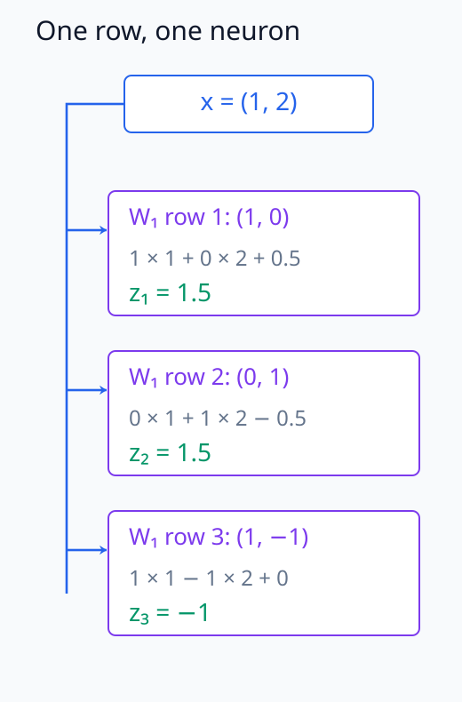
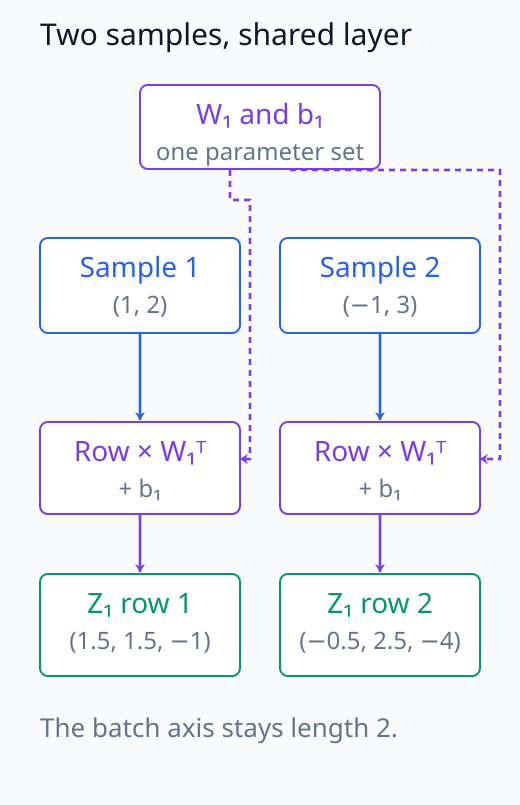
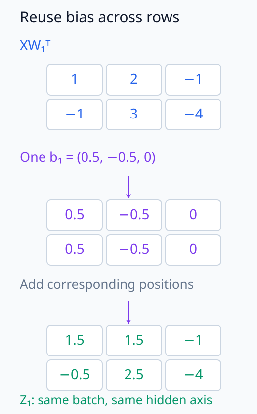
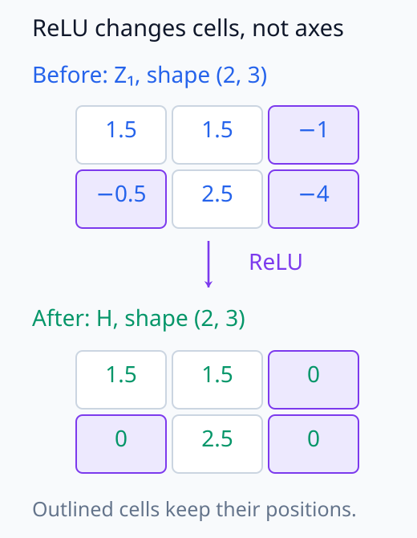
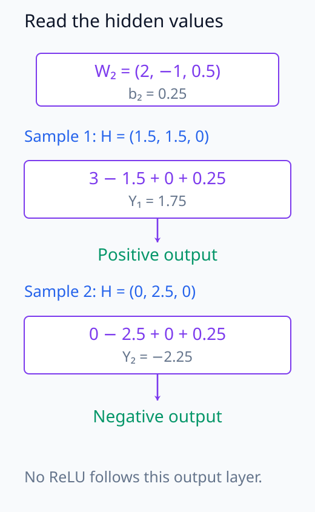
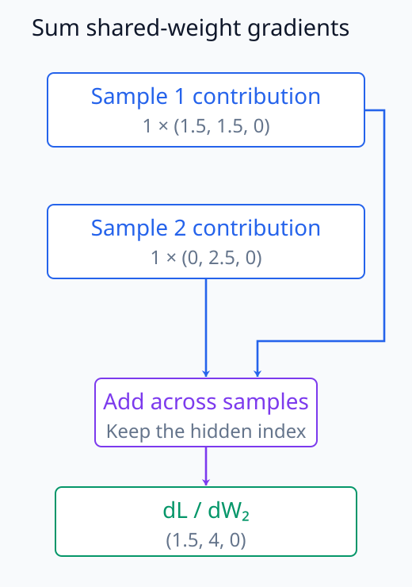
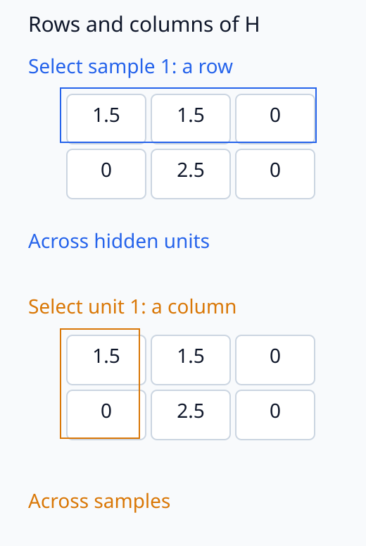

# N05-03. MLP forward pass

## 이 단원이 필요한 이유

실제 신경망은 neuron을 하나씩 Python loop로 계산하지 않는다. 여러 neuron의 weight를 행렬에 쌓고 여러 sample을 batch axis에 쌓아 같은 연산을 한 번에 수행한다. 이 표현을 읽을 수 있어야 코드의 `matmul`, weight shape와 hidden activation을 수식에 대응시킬 수 있다.

이 단원에서는 두 층 multilayer perceptron(MLP)을 직접 tensor 연산으로 계산한다. 고수준 `torch.nn` module은 사용하지 않는다. 입력, pre-activation, hidden activation과 출력의 shape를 각 단계에서 확인한다.

## 학습 목표

이 단원을 마치면 다음을 할 수 있다.

- 여러 neuron의 weight를 하나의 matrix로 배열할 수 있다.
- batch, input, hidden과 output axis를 구분할 수 있다.
- 두 층 MLP의 forward pass를 행렬식으로 계산할 수 있다.
- activation function이 elementwise로 적용되는 위치를 설명할 수 있다.
- intermediate activation과 parameter gradient의 shape를 검산할 수 있다.

## 선수지식 확인

- 선수 단원: [N05-02 하나의 neuron](N05-02-single-neuron.md)
- 선수 단원: [M02-04 행렬과 행렬곱](../../part-1-foundations/M02/M02-04-matrices-matrix-multiplication.md)
- 확인 질문: $(2\times3)$ matrix와 $(3\times4)$ matrix의 곱 shape를 구할 수 있는가?
- 확인 질문: 두 sample vector를 행으로 쌓으면 어느 axis가 batch인지 설명할 수 있는가?

## 기호와 용어

| 기호·용어 | Common spoken reading | 의미 | shape·범위 |
|---|---|---|---|
| $\mathbf X$ | `X` | sample을 행으로 쌓은 입력 batch | $\mathbb R^{B\times d_{\mathrm{in}}}$ |
| $\mathbf W_1$ | `W sub one` | 첫 층의 weight matrix | $\mathbb R^{d_{\mathrm{hidden}}\times d_{\mathrm{in}}}$ |
| $\mathbf b_1$ | `b sub one` | 첫 층 neuron별 bias | $\mathbb R^{d_{\mathrm{hidden}}}$ |
| $\mathbf Z_1$ | `Z sub one` | 첫 층 pre-activation batch | $\mathbb R^{B\times d_{\mathrm{hidden}}}$ |
| $\mathbf H$ | `H` | elementwise activation 뒤 hidden activation | $\mathbb R^{B\times d_{\mathrm{hidden}}}$ |
| $\mathbf W_2$ | `W sub two` | 출력층 weight matrix | $\mathbb R^{d_{\mathrm{out}}\times d_{\mathrm{hidden}}}$ |
| $\mathbf Y$ | `Y` | MLP의 output batch | $\mathbb R^{B\times d_{\mathrm{out}}}$ |
| MLP | `M L P` | affine layer와 nonlinearity를 연결한 feed-forward network | 이 단원에서는 두 층 |

## 핵심 개념 1. neuron을 행렬의 행으로 쌓는다

hidden neuron이 $d_{\mathrm{hidden}}$개이고 각 neuron이 길이 $d_{\mathrm{in}}$ 입력을 받는다고 하자. 각 neuron의 weight vector를 행으로 쌓으면

\[
\mathbf W_1\in
\mathbb R^{d_{\mathrm{hidden}}\times d_{\mathrm{in}}}
\]

이 된다. 입력 vector를 열벡터로 쓰면 한 sample의 첫 층은

\[
\mathbf z_1=\mathbf W_1\mathbf x+\mathbf b_1
\]

이다. $j$번째 행은 $j$번째 neuron의 dot product를 계산한다.

성분으로 쓰면 $z_{1j}=\sum_{k=1}^{d_{\mathrm{in}}}(W_1)_{jk}x_k+(b_1)_j$다. 입력 위치 $k$를 합으로 소모하고 neuron 위치 $j$를 남기므로 출력 길이는 $d_{\mathrm{hidden}}$이다. 한 행 안에서는 여러 입력 성분을 섞고, 서로 다른 행은 같은 입력에 서로 다른 weight와 bias를 적용한다.

아래 그림에서 W₁의 각 행이 동일한 입력을 사용해 서로 다른 hidden 위치를 만든다.

<figure class="lesson-figure" markdown="1">

<figcaption>동일한 입력 (1, 2)에 W₁의 세 행을 각각 적용한다. 행마다 input feature 두 개를 합산해 한 z 값을 만들므로, 세 행은 hidden 위치 세 개로 대응한다. 수치는 아래 예제의 첫째 sample과 같다.</figcaption>

</figure>

## 핵심 개념 2. batch는 sample을 행으로 쌓는다

$B$개 입력을 행으로 쌓으면

\[
\mathbf X\in\mathbb R^{B\times d_{\mathrm{in}}}
\]

이다. 같은 weight를 모든 sample에 적용하는 batch 식은

\[
\mathbf Z_1=\mathbf X\mathbf W_1^\top+\mathbf b_1
\]

이다. bias vector는 각 행에 더해진다. PyTorch는 이 경우 `(d_hidden,)`을 `(B, d_hidden)`의 각 행에 broadcast한다.

shape만 추적하면

\[
(B,d_{\mathrm{in}})
(d_{\mathrm{in}},d_{\mathrm{hidden}})
\longrightarrow
(B,d_{\mathrm{hidden}})
\]

이다. 여기서 두 번째 factor는 $\mathbf W_1^\top$의 shape다.

한 sample을 열벡터로 계산한 결과를 전치하면 $\mathbf z_1^\top=\mathbf x^\top\mathbf W_1^\top+\mathbf b_1^\top$이 된다. batch 식은 이 행 계산을 $B$번 쌓은 것이다. 합을 취하는 axis는 input feature이고 batch axis는 남으므로, 이 층의 한 행 출력은 다른 행 입력을 사용하지 않는다. sample마다 새 weight를 만드는 것이 아니라 같은 parameter를 공유한다.

아래 두 실선 경로는 sample을 분리하고, 점선 경로는 공유 parameter의 사용을 표시한다.

<figure class="lesson-figure" markdown="1">

<figcaption>두 sample의 행은 서로 섞지 않고 같은 W₁과 b₁을 사용한다. 파란 실선은 sample 값의 흐름, 보라 점선은 같은 parameter를 각 계산에서 사용함을 표시한다. batch axis 두 위치는 출력에도 남는다.</figcaption>

</figure>

아래 배열은 같은 bias가 batch의 각 행에 더해지는 방향을 보여 준다.

<figure class="lesson-figure" markdown="1">

<figcaption>b₁ = (0.5, −0.5, 0)을 두 sample의 각 행에 더한다. 아래 두 bias 행은 계산상 반복되는 값을 나타내며, 독립된 bias parameter 두 세트를 만든다는 뜻은 아니다.</figcaption>

</figure>

## 핵심 개념 3. activation function은 원소별로 적용한다

첫 층 pre-activation에 ReLU를 적용하면

\[
\mathbf H=\operatorname{ReLU}(\mathbf Z_1)
\]

이다. 각 원소에 같은 scalar function을 적용하므로 shape는 바뀌지 않는다.

\[
\mathbf Z_1,\mathbf H
\in\mathbb R^{B\times d_{\mathrm{hidden}}}
\]

단, 값과 gradient 경로는 바뀐다. 음수인 pre-activation은 0이 되고 그 위치의 ReLU local derivative도 0이 된다.

0이 된 원소도 tensor 안의 위치는 그대로 차지한다. ReLU는 hidden unit을 삭제하거나 batch를 줄이는 연산이 아니다. 또 어느 위치가 0이 되는지는 각 sample의 pre-activation에 달려 있다. 같은 neuron이라도 서로 다른 sample에서 양수 구간과 음수 구간에 놓일 수 있다.

아래 전후 배열의 같은 위치를 비교하면 값이 0이 되어도 위치는 없어지지 않음을 확인할 수 있다.

<figure class="lesson-figure" markdown="1">

<figcaption>음수였던 세 위치만 0으로 바뀌며 행·열 위치는 그대로다. 특히 첫째 hidden unit은 첫째 sample에서 1.5를 유지하고 둘째 sample에서 0이 되어, gate 상태가 sample에 따라 달라짐을 보여 준다.</figcaption>

</figure>

## 핵심 개념 4. 두 번째 affine layer

출력 차원을 $d_{\mathrm{out}}$이라 하면

\[
\mathbf Y=\mathbf H\mathbf W_2^\top+\mathbf b_2,
\qquad
\mathbf W_2\in\mathbb R^{d_{\mathrm{out}}\times d_{\mathrm{hidden}}}
\]

이다. 전체 two-layer MLP는

\[
\operatorname{MLP}(\mathbf X)
=\operatorname{ReLU}(\mathbf X\mathbf W_1^\top+\mathbf b_1)
\mathbf W_2^\top+\mathbf b_2
\]

로 쓸 수 있다. 이 식에서 “two-layer”는 학습 가능한 affine transformation 두 개를 센다.

둘째 층은 원래 입력이 아니라 첫 층의 hidden activation을 입력 feature로 받는다. $\mathbf b_2$는 길이 $d_{\mathrm{out}}$인 bias이며 첫 층과 마찬가지로 각 sample 행에 더한다. 이 예제의 출력에는 ReLU를 다시 적용하지 않으므로 $\mathbf H$가 모두 음이 아니어도 $\mathbf Y$에는 음수가 나올 수 있다.

중간 ReLU를 제거하면 한 sample의 출력은 $\mathbf W_2\mathbf W_1\mathbf x+\mathbf W_2\mathbf b_1+\mathbf b_2$가 되어 하나의 affine map으로 합쳐진다. 중간 activation이 있으면 입력에 따라 일부 hidden 값이 0이 되므로 이 합성식을 전체 입력 공간에서 그대로 사용할 수 없다. hidden dimension을 늘리는 것과 비선형 변환을 넣는 것은 서로 다른 역할이다.

아래 두 readout은 음이 아닌 hidden에서도 출력층의 부호 있는 weight가 음수 출력을 만들 수 있음을 보여 준다.

<figure class="lesson-figure" markdown="1">

<figcaption>출력층의 weight (2, −1, 0.5)가 hidden 성분을 다시 조합한다. 둘째 sample은 2.5에 음수 weight −1을 곱하므로, 마지막 bias 0.25를 더해도 output −2.25가 된다.</figcaption>

</figure>

## 예제 1. 두 sample의 forward pass

### 문제

다음 값을 사용한다.

\[
\mathbf X=
\begin{bmatrix}
1&2\\
-1&3
\end{bmatrix},
\quad
\mathbf W_1=
\begin{bmatrix}
1&0\\
0&1\\
1&-1
\end{bmatrix},
\quad
\mathbf b_1=(0.5,-0.5,0)
\]

\[
\mathbf W_2=
\begin{bmatrix}
2&-1&0.5
\end{bmatrix},
\qquad
\mathbf b_2=(0.25)
\]

$\mathbf Z_1$, $\mathbf H$와 $\mathbf Y$를 계산하라.

### 풀이

첫 affine layer는

\[
\mathbf Z_1
=\mathbf X\mathbf W_1^\top+\mathbf b_1
=
\begin{bmatrix}
1.5&1.5&-1\\
-0.5&2.5&-4
\end{bmatrix}
\]

이다. ReLU를 원소별로 적용하면

\[
\mathbf H=
\begin{bmatrix}
1.5&1.5&0\\
0&2.5&0
\end{bmatrix}
\]

이다. 출력층 계산은

\[
\mathbf Y
=
\begin{bmatrix}
1.75\\
-2.25
\end{bmatrix}
\]

를 준다.

### 결과의 의미

shape는 `(2, 2)`에서 `(2, 3)`으로 hidden dimension이 늘었다가 `(2, 1)`로 줄었다. batch size 2는 모든 층에서 유지됐다. 세 번째 hidden neuron은 두 sample에서 모두 음수 pre-activation을 받아 activation이 0이 됐다.

## 예제 2. parameter 수 세기

첫 층은 $3\times2$ weight와 길이 3 bias를 가지므로 parameter가 $6+3=9$개다. 둘째 층은 $1\times3$ weight와 길이 1 bias를 가지므로 4개다. 전체는

\[
9+4=13
\]

개다. activation tensor는 forward 중에 생기는 값이지 이 MLP의 학습 parameter가 아니다.

## 실행 실습

### 실행 환경과 원본

- 환경: Python 3.12, PyTorch 2.13.0 CPU, NumPy 2.5.3
- 확인일: 2026-10-01
- 구성요소 등급: `Stable core`
- 예제 ID: `n05_03_mlp_forward`
- 코드 원본: `labs/N05/n05_03_mlp_forward.py`
- 테스트: `tests/N05/test_n05_03.py`
- 실행 명령: `.venv\Scripts\python.exe -m labs.N05.n05_03_mlp_forward`

### 자원 예산

이 예제는 batch 2, input dimension 2, hidden dimension 3, output dimension 1과 parameter 13개를 사용한다. 학습 step은 0이고 hard timeout은 10초다.

### 실제 코드와 실행 결과

site build는 아래 위치에 직접 tensor 연산 코드와 실제 실행 결과를 삽입한다.

<!-- N05_EXAMPLE: n05_03_mlp_forward -->

### shape 검사

실행 결과에서 `pre_activation`과 `hidden`은 `[2, 3]`, `output`은 `[2, 1]`이다. 첫 axis는 batch로 유지되고 둘째 axis만 층의 출력 dimension에 따라 바뀐다.

### gradient 검사

예제는 $\mathcal L=\sum_{b=1}^{2}Y_{b1}$을 사용한다. 자동미분 결과 가운데

\[
\frac{\partial\mathcal L}{\partial\mathbf W_2}
=
\begin{bmatrix}
1.5&4&0
\end{bmatrix}
\]

를 확인할 수 있다. 이는 두 sample의 hidden activation을 batch axis로 합한 값이다. 테스트는 첫 층 weight·bias, 둘째 층 weight·bias와 입력 gradient까지 손계산 값에 대조한다.

아래 합류 그림은 sample별 미분 기여가 하나의 공유 W₂에 더해지는 과정을 나타낸다.

<figure class="lesson-figure" markdown="1">

<figcaption>L = Y₁ + Y₂에서는 각 output의 upstream 미분값이 1이다. 같은 W₂를 사용한 두 sample의 기여 (1.5, 1.5, 0)과 (0, 2.5, 0)을 더해 하나의 weight gradient (1.5, 4, 0)을 만든다.</figcaption>

</figure>

## 모델 해석과의 연결

$\mathbf H$의 한 행은 한 sample의 hidden activation이고 한 열은 한 hidden unit이 batch의 여러 sample에서 낸 값을 모은다. 모델 해석 code에서 axis를 잘못 고르면 sample 비교와 neuron 비교가 뒤바뀐다.

hidden activation에서 정보를 복원할 수 있다는 결과는 representation과 target 사이의 관련성을 보인다. 그러나 출력층이 그 정보를 실제로 사용한다는 주장은 $\mathbf H$를 바꾸었을 때 $\mathbf Y$가 어떻게 변하는지 확인하는 개입 증거를 요구한다.

아래 그림에서 행 선택과 열 선택은 서로 다른 대상을 모은다.

<figure class="lesson-figure" markdown="1">

<figcaption>같은 H를 위에서는 첫째 행, 아래에서는 첫째 열을 선택해 읽는다. 행은 sample 하나의 hidden 값 전체이고, 열은 neuron 하나가 여러 sample에서 낸 값이다.</figcaption>

</figure>

## 흔한 오해

### 오해 1. weight matrix shape는 항상 입력 차원 곱하기 출력 차원이다

이 책은 neuron의 weight를 행으로 쌓아 $\mathbf W\in\mathbb R^{d_{\mathrm{out}}\times d_{\mathrm{in}}}$로 둔다. 행 batch와 곱할 때는 $\mathbf X\mathbf W^\top$를 사용한다. 다른 구현 관례도 가능하므로 식과 code의 shape를 함께 확인해야 한다.

### 오해 2. ReLU가 matrix multiplication을 수행한다

ReLU는 각 원소에 독립적으로 적용된다. feature를 섞는 계산은 앞뒤 affine layer의 matrix multiplication이 맡는다.

### 오해 3. hidden dimension은 batch size다

batch axis는 서로 다른 sample을, hidden axis는 한 sample 안의 neuron 출력을 나열한다. 이 예제에서 둘 다 작은 정수라 해도 의미가 다르다.

## 연습문제

### 1. shape 추적

$B=2$, $d_{\mathrm{in}}=4$, $d_{\mathrm{hidden}}=6$, $d_{\mathrm{out}}=3$일 때 $\mathbf X,\mathbf W_1,\mathbf Z_1,\mathbf H,\mathbf W_2,\mathbf Y$의 shape를 적어라.

해설 보기

$\mathbf X:(2,4)$, $\mathbf W_1:(6,4)$, $\mathbf Z_1:(2,6)$, $\mathbf H:(2,6)$, $\mathbf W_2:(3,6)$, $\mathbf Y:(2,3)$이다.

### 2. parameter 수

앞 문제의 MLP가 두 층 모두 bias를 사용하면 parameter 수는 몇 개인가?

해설 보기

첫 층은 $6\cdot4+6=30$개, 둘째 층은 $3\cdot6+3=21$개다. 전체는 51개다. batch size는 parameter 수에 영향을 주지 않는다.

### 3. broadcast

$\mathbf Z_1=\mathbf X\mathbf W_1^\top+\mathbf b_1$에서 길이 $d_{\mathrm{hidden}}$인 $\mathbf b_1$이 어느 방향으로 반복되는가?

해설 보기

같은 bias vector가 batch의 각 행에 더해진다. hidden 위치마다 bias는 다를 수 있지만 sample마다 별도 bias parameter를 두지는 않는다.

### 4. elementwise activation

$\mathbf Z_1$의 shape가 `(5, 7)`일 때 elementwise ReLU를 적용한 $\mathbf H$의 shape와 최대 원소 수를 적어라.

해설 보기

shape는 `(5, 7)`로 유지되고 원소 수는 $5\cdot7=35$다. 값이 0으로 바뀌어도 원소 위치가 제거되는 것은 아니다.

### 5. 행 하나 해석하기

$\mathbf H$의 첫째 행과 첫째 열은 각각 무엇을 모은 것인가?

해설 보기

첫째 행은 첫째 sample의 모든 hidden unit activation을 모은 vector다. 첫째 열은 batch의 모든 sample에서 첫째 hidden unit이 낸 activation을 모은 vector다.

### 6. 주장 비판

probe가 $\mathbf H$에서 label을 높은 정확도로 복원했다. “MLP 출력이 이 정보를 사용한다”는 결론이 바로 따르는가?

해설 보기

따르지 않는다. probe 결과는 label 관련 정보가 $\mathbf H$에서 복원됨을 보인다. 출력이 그 정보를 기능적으로 사용하는지는 hidden activation에 대한 개입과 출력 변화, 적절한 control로 따로 검사해야 한다.

## 단원 요약

- neuron별 weight를 행으로 쌓으면 여러 neuron을 matrix multiplication 하나로 계산할 수 있다.
- 행 batch 관례에서는 $\mathbf X\mathbf W^\top+\mathbf b$를 사용한다.
- elementwise activation은 shape를 유지하지만 값과 gradient 경로를 바꾼다.
- hidden dimension과 batch axis는 의미가 다르다.
- intermediate activation의 axis를 정확히 알아야 모델 해석 결과를 올바르게 집계할 수 있다.

## 통과 기준

다음 질문에 자료를 보지 않고 답할 수 있으면 통과한다.

- 두 층 MLP의 모든 tensor shape를 적을 수 있는가?
- 한 neuron의 식을 batch matrix 식으로 바꿀 수 있는가?
- bias broadcast 방향을 설명할 수 있는가?
- parameter와 intermediate activation을 구분할 수 있는가?
- hidden activation의 행과 열이 무엇을 뜻하는지 설명할 수 있는가?

## 다음 단원

- [N05-04 activation function과 gating](N05-04-activation-functions-gating.md)

## 집필자 점검표

- [x] 학습 목표가 관찰 가능한 행동으로 작성됐다.
- [x] 모든 새 기호가 사용 전에 정의됐다.
- [x] batch와 feature axis를 구분했다.
- [x] weight matrix 관례를 명시했다.
- [x] forward, parameter 수와 gradient를 검산했다.
- [x] 모든 문제에 해설이 있다.
- [x] 모델 해석 주장의 강도를 구분했다.
- [x] 용어집과 표기 규칙을 따랐다.
- [x] Common spoken reading이 실제 영어 학술 발화이며 한글 음역이나 기계적 직역을 포함하지 않는다.
- [x] 선수지식 밖의 내용을 몰래 요구하지 않는다.
- [x] 내부 링크와 수식 렌더링을 확인했다.
- [x] Markdown에 실행 코드를 손으로 복제하지 않았다.
- [x] 코드 원본·테스트 경로·자원 예산·확인일을 기록했다.
- [x] shape·수치·gradient test가 있다.
