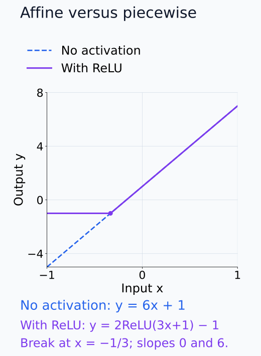
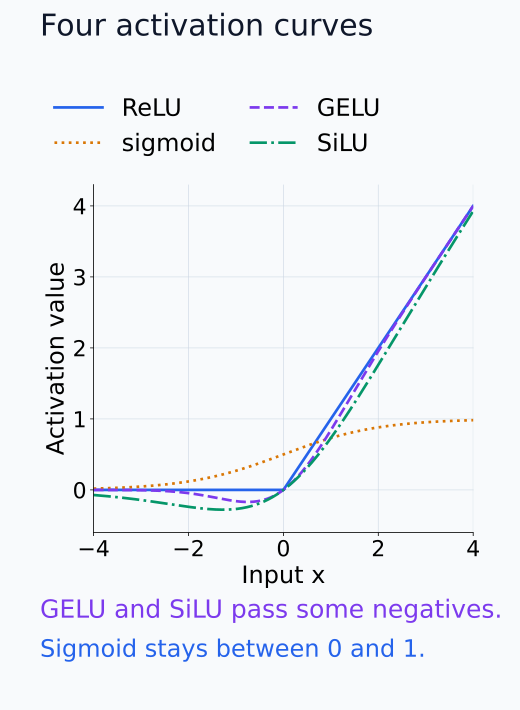
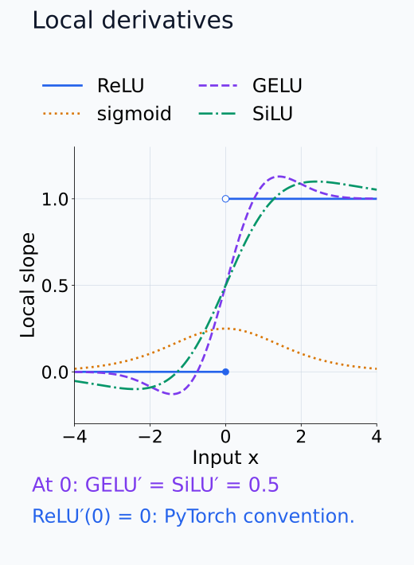
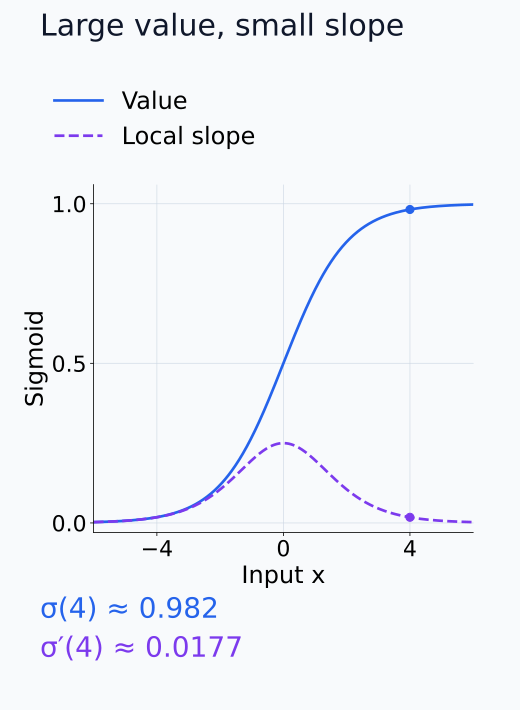
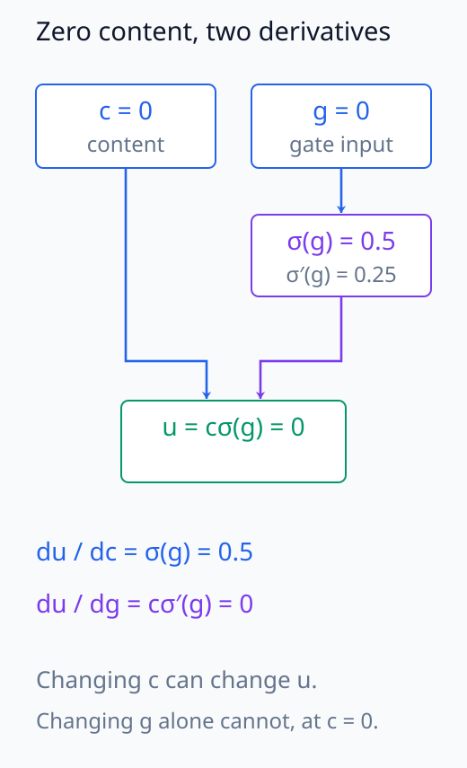
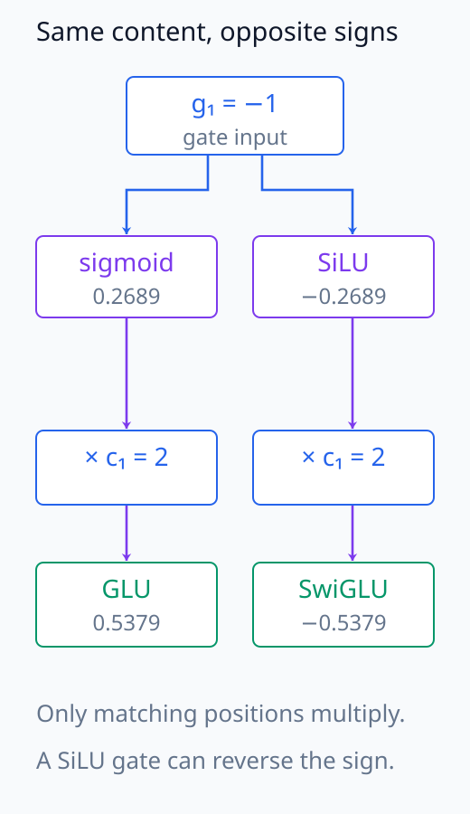
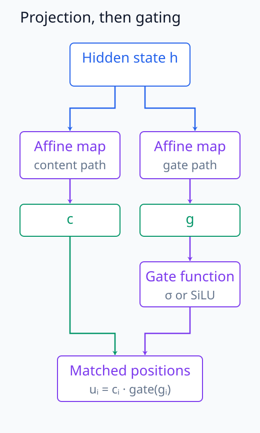

# N05-04. activation function과 gating

## 이 단원이 필요한 이유

affine layer만 여러 번 합성하면 전체 계산은 다시 하나의 affine map이 된다. 신경망은 activation function을 층 사이에 넣어 입력에 따라 다른 기울기와 출력 형태를 만든다. Transformer의 feed-forward block은 한 단계 더 나아가 한 경로의 값으로 다른 경로를 조절하는 gate를 쓴다.

이 단원은 ReLU, sigmoid, GELU와 SiLU를 같은 입력에서 비교한다. 이어서 GLU와 SwiGLU의 elementwise gate를 계산한다. 함수값과 local derivative를 함께 봐야 forward activation과 gradient 흐름을 연결할 수 있다.

## 학습 목표

이 단원을 마치면 다음을 할 수 있다.

- ReLU, sigmoid, GELU와 SiLU의 출력값을 작은 입력에서 계산할 수 있다.
- activation function의 값과 local derivative를 구분할 수 있다.
- elementwise gate가 content 경로를 조절하는 방식을 계산할 수 있다.
- GLU와 SwiGLU의 gate 함수를 구분할 수 있다.
- activation 차이에서 말할 수 있는 사실과 해석 가설을 구분할 수 있다.

## 선수지식 확인

- 선수 단원: [N05-03 MLP forward pass](N05-03-mlp-forward-pass.md)
- 선수 단원: [M01-03 미분과 순간변화율](../../part-1-foundations/M01/M01-03-derivative-instantaneous-rate.md)
- 확인 질문: elementwise function이 tensor의 shape를 유지하는 이유를 설명할 수 있는가?
- 확인 질문: chain rule에서 local derivative가 하는 역할을 설명할 수 있는가?

## 기호와 용어

| 기호·용어 | Common spoken reading | 의미 | shape·범위 |
|---|---|---|---|
| $x$ | `x` | activation function의 scalar 입력 | $x\in\mathbb R$ |
| $\sigma(x)$ | `sigma of x` | logistic sigmoid | $(0,1)$ |
| $\Phi(x)$ | `capital phi of x` | standard normal cumulative distribution function | $(0,1)$ |
| $\operatorname{GELU}(x)$ | `G E L U of x` | $x\Phi(x)$로 정의한 activation | $\mathbb R\to\mathbb R$ |
| $\operatorname{SiLU}(x)$ | `SiLU of x` | $x\sigma(x)$로 정의한 activation | $\mathbb R\to\mathbb R$ |
| $\mathbf c$ | `c` | gate가 조절할 content vector | $\mathbb R^d$ |
| $\mathbf g$ | `g` | gate의 pre-activation vector | $\mathbb R^d$ |
| $\odot$ | `elementwise product` | 같은 위치끼리 곱하는 Hadamard product | 두 operand의 shape가 같음 |

## 핵심 개념 1. activation function은 affine 합성을 끊는다

두 affine map을 activation 없이 합치면

\[
\mathbf W_2(\mathbf W_1\mathbf x+\mathbf b_1)+\mathbf b_2
=\mathbf W'\mathbf x+\mathbf b'
\]

처럼 다시 affine map 하나가 된다. 중간에 elementwise function $\phi$를 넣으면

\[
\mathbf y=\mathbf W_2\phi(\mathbf W_1\mathbf x+\mathbf b_1)+\mathbf b_2
\]

가 된다. 일반적인 비선형 $\phi$에서는 이 식을 하나의 affine map으로 줄일 수 없다.

위의 $\mathbf W'=\mathbf W_2\mathbf W_1$, $\mathbf b'=\mathbf W_2\mathbf b_1+\mathbf b_2$는 입력에 관계없이 고정된 값이다. 반면 ReLU를 넣으면 같은 unit도 입력에 따라 통과 구간과 0 출력 구간이 달라진다. 한 구간 안에서 affine 식으로 표현할 수 있는 것과 모든 입력에 같은 affine 식을 적용할 수 있는 것은 다르다.

아래 scalar 곡선은 한 구간에서의 affine 식과 전체 입력에 적용되는 affine 식의 차이를 보여 준다.

<figure class="lesson-figure" markdown="1">

<figcaption>관계를 보기 위한 scalar 예시다. 2(3x + 1) − 1은 한 직선인 반면, 2ReLU(3x + 1) − 1은 x = −1/3에서 기울기가 바뀐다. 오른쪽 한 구간의 affine 식이 전체 입력에 통하는 것은 아니다.</figcaption>

</figure>

## 핵심 개념 2. 네 activation의 함수값과 기울기

ReLU는

\[
\operatorname{ReLU}(x)=\max(0,x)
\]

이다. 양수에서는 입력을 통과시키고 음수에서는 0을 낸다. PyTorch는 $x=0$에서 derivative를 0으로 정한다.

sigmoid는

\[
\sigma(x)=\frac{1}{1+e^{-x}},
\qquad
\sigma'(x)=\sigma(x)(1-\sigma(x))
\]

이다. 출력 범위가 $(0,1)$이어서 gate에 쓰기 쉽다. $|x|$가 커지면 derivative가 0에 가까워진다.

분모를 미분하면 $\sigma'(x)=e^{-x}/(1+e^{-x})^2$이고 이를 $\sigma(x)$와 $1-\sigma(x)$의 곱으로 쓸 수 있다. 큰 양수 입력에서는 출력이 1에 가깝지만 기울기는 작다. 함수값이 크다는 것과 작은 입력 변화에 민감하다는 것은 같지 않다.

GELU는

\[
\operatorname{GELU}(x)=x\Phi(x)
\]

이다. 음수 입력도 작은 음수값으로 통과시킨다. SiLU는

\[
\operatorname{SiLU}(x)=x\sigma(x)
\]

이다. 둘 다 매끄럽고 $x=0$에서 derivative가 $1/2$이다.

SiLU에는 곱의 미분법을 적용해 $\operatorname{SiLU}'(x)=\sigma(x)+x\sigma(x)(1-\sigma(x))$를 얻는다. GELU도 $\operatorname{GELU}'(x)=\Phi(x)+x\Phi'(x)$다. 0에서는 두 번째 항이 사라지고 $\sigma(0)=\Phi(0)=1/2$이 남는다. 두 함수의 출력은 0이지만 기울기는 0이 아니다. sigmoid의 출력 $1/2$와 기울기 $1/4$도 따로 구분해야 한다.

아래 출력 곡선에서 음수 구간과 큰 양수 구간을 비교한다.

<figure class="lesson-figure" markdown="1">

<figcaption>실선·점선 패턴과 범례로 네 함수를 구분한다. ReLU의 음수 쪽은 0에 붙지만 GELU와 SiLU는 작은 음수값을 낸다. sigmoid는 입력이 커져도 1 아래에 머문다.</figcaption>

</figure>

아래 그림은 같은 입력의 local derivative를 별도 세로축으로 표시한다.

<figure class="lesson-figure" markdown="1">

<figcaption>이 그림의 세로축은 출력값이 아니라 기울기다. GELU와 SiLU는 x = 0에서 출력은 0이지만 기울기는 0.5다. ReLU의 열린 점은 오른쪽 기울기 1, 채운 점은 backward에서 쓰는 0 관례를 표시한다.</figcaption>

</figure>

아래 두 곡선을 같은 x에 맞춰 읽으면 큰 함수값과 작은 기울기가 함께 나타나는 구간을 찾을 수 있다.

<figure class="lesson-figure" markdown="1">

<figcaption>값 곡선과 기울기 곡선을 같은 x에 맞춰 읽는다. x = 4에서는 값이 약 0.982지만 local derivative는 약 0.0177이므로, 큰 활성값과 큰 민감도를 구분해야 한다.</figcaption>

</figure>

## 핵심 개념 3. gate는 content와 조절값을 곱한다

가장 작은 GLU 형태를

\[
\operatorname{GLU}(\mathbf c,\mathbf g)
=\mathbf c\odot\sigma(\mathbf g)
\]

로 쓰자. $\sigma(\mathbf g)$의 각 원소는 0과 1 사이이므로 같은 위치의 content 크기를 줄이거나 유지한다.

SwiGLU에서는 sigmoid gate 대신 SiLU를 사용한다.

\[
\operatorname{SwiGLU}(\mathbf c,\mathbf g)
=\mathbf c\odot\operatorname{SiLU}(\mathbf g)
\]

SiLU는 음수도 내므로 SwiGLU의 gate는 단순한 비율이나 확률이 아니다. 실제 Transformer block은 같은 hidden state에서 두 affine projection을 만든 뒤 이 elementwise product를 계산한다.

GLU의 한 위치를 $u=c\sigma(g)$로 쓰면 $\partial u/\partial c=\sigma(g)$, $\partial u/\partial g=c\sigma'(g)$다. content를 바꾸는 민감도와 gate 입력을 바꾸는 민감도가 다르다. $c=0$이면 gate만 바꾸어도 이 위치의 출력은 변하지 않지만, content에 대한 미분은 남는다. 두 경로가 같은 hidden state에서 나왔다면 그 hidden state의 gradient에는 두 경로의 기여를 모두 더한다.

곱은 같은 위치끼리만 이루어져 다른 feature를 직접 섞지 않는다. 서로 다른 feature의 결합은 앞선 projection에서 생긴다. sigmoid gate는 유한한 입력에서 content의 절댓값을 줄이는 양수 계수인 반면, SiLU gate는 음수로 부호를 뒤집거나 1보다 큰 값으로 크기를 늘릴 수도 있다.

아래 c = 0 계산에서 출력값과 두 local derivative를 따로 확인한다.

<figure class="lesson-figure" markdown="1">

<figcaption>본문의 c = 0 조건을 g = 0에서 계산하면 gate는 0.5, 출력은 0이다. c를 미분할 때에는 gate 0.5가 남고, g를 미분할 때에는 c = 0을 곱하므로 0이 된다.</figcaption>

</figure>

## 예제 1. 네 activation 비교

### 문제

$x=(-1,0,1)$에서 ReLU, sigmoid, GELU와 SiLU를 계산하라.

### 풀이

소수 넷째 자리까지 적으면 다음과 같다.

| $x$ | ReLU | sigmoid | GELU | SiLU |
|---:|---:|---:|---:|---:|
| $-1$ | $0$ | $0.2689$ | $-0.1587$ | $-0.2689$ |
| $0$ | $0$ | $0.5$ | $0$ | $0$ |
| $1$ | $1$ | $0.7311$ | $0.8413$ | $0.7311$ |

ReLU는 음수를 제거한다. GELU와 SiLU는 음수 입력을 작은 음수 출력으로 바꾼다.

### 결과의 의미

같은 pre-activation도 함수 선택에 따라 forward 값과 local derivative가 달라진다. 이 차이는 다음 층 입력과 역전파 gradient에 함께 반영된다.

## 예제 2. GLU와 SwiGLU

$\mathbf c=(2,-1,0.5)$, $\mathbf g=(-1,0,1)$이라 하자. sigmoid gate는

\[
\sigma(\mathbf g)\approx(0.2689,0.5,0.7311)
\]

이므로

\[
\mathbf c\odot\sigma(\mathbf g)
\approx(0.5379,-0.5,0.3655)
\]

이다. SiLU gate는 $(-0.2689,0,0.7311)$이고 SwiGLU 출력은

\[
(-0.5379,0,0.3655)
\]

이다. 첫 성분의 부호가 달라지는 이유는 SiLU gate가 음수값을 허용하기 때문이다.

아래 첫 성분 비교에서는 gate 함수를 바꾸는 위치에서 부호가 갈린다.

<figure class="lesson-figure" markdown="1">

<figcaption>예제의 첫 위치만 확대했다. 같은 g₁ = −1이 sigmoid에서는 양수, SiLU에서는 음수 gate가 된다. 동일한 content c₁ = 2를 곱하므로 출력 부호가 서로 달라진다.</figcaption>

</figure>

## 실행 실습

### 실행 환경과 원본

- 환경: Python 3.12, PyTorch 2.13.0 CPU, NumPy 2.5.3
- 확인일: 2026-10-01
- 구성요소 등급: activation은 `Stable core`, SwiGLU는 `Common modern variant`
- 예제 ID: `n05_04_activation_gating`
- 코드 원본: `labs/N05/n05_04_activation_gating.py`
- 테스트: `tests/N05/test_n05_04.py`
- 실행 명령: `.venv\Scripts\python.exe -m labs.N05.n05_04_activation_gating`

### 자원 예산

예제는 길이 3인 vector만 사용한다. 학습 parameter와 training step은 0이고 hard timeout은 10초다.

### 실제 코드와 실행 결과

site build는 아래 위치에 원본 코드와 실제 실행 결과를 삽입한다.

<!-- N05_EXAMPLE: n05_04_activation_gating -->

### 수치와 gradient 검사

테스트는 네 함수의 출력값을 고정된 수치와 비교한다. SiLU derivative는 $x=(-1,0,1)$에서 약 $(0.0723,0.5,0.9277)$이다. gate 테스트는 GLU와 SwiGLU의 elementwise product를 따로 확인한다.

## 모델 해석과의 연결

activation을 수집할 때는 pre-activation, activation function 뒤의 값과 gated product 뒤의 값을 구분해야 한다. 같은 unit이라는 이름을 써도 hook 위치가 다르면 서로 다른 tensor를 얻는다.

0이 아닌 같은 content를 고정하고 sigmoid gate를 비교하면 gate 값이 클수록 출력의 절댓값이 크다. 서로 다른 입력의 gate 값만 비교하면 content도 달라질 수 있으므로 gated product의 크기까지 바로 판단할 수는 없다. 그 component가 모델 행동에 필요하다는 결론은 gate나 content 경로를 바꾸는 개입과 출력 비교를 요구한다.

아래 경로에서 projection의 feature 혼합과 gate의 위치별 곱을 구분한다.

<figure class="lesson-figure" markdown="1">

<figcaption>hidden에서 content와 gate 입력을 만드는 projection은 feature를 섞을 수 있다. 두 경로가 합류하는 elementwise product는 같은 위치끼리만 곱한다. 이 배치의 pre-activation·gate output·product는 서로 다른 관찰 위치다.</figcaption>

</figure>

## 흔한 오해

### 오해 1. sigmoid 출력은 neuron이 켜질 확률이다

sigmoid 값은 주어진 계산에서 얻은 숫자다. 확률모형의 parameter로 정의했을 때만 확률로 해석할 수 있다. GLU의 gate 값 자체를 사건 확률로 부르면 안 된다.

### 오해 2. 매끄러운 activation은 gradient가 사라지지 않는다

sigmoid와 SiLU도 입력 범위에 따라 derivative가 작아진다. 매끄러움은 derivative의 존재와 연속성에 관한 성질이며 gradient 크기를 보장하지 않는다.

### 오해 3. 큰 activation은 중요한 feature를 뜻한다

activation 크기는 scale, normalization과 다음 층 weight의 영향을 받는다. 행동에 대한 기여를 판단하려면 downstream 계산과 개입 결과를 함께 확인해야 한다.

## 연습문제

### 1. ReLU 계산

$(-2,0,3)$에 ReLU를 적용한 값과 PyTorch 관례의 local derivative를 적어라.

해설 보기

출력은 $(0,0,3)$이고 derivative는 $(0,0,1)$이다. PyTorch는 0에서 ReLU derivative를 0으로 둔다.

### 2. sigmoid derivative

$\sigma(0)$과 $\sigma'(0)$을 계산하라.

해설 보기

$\sigma(0)=1/2$이다. $\sigma'(x)=\sigma(x)(1-\sigma(x))$이므로 $\sigma'(0)=1/4$이다.

### 3. gate의 shape

$\mathbf c,\mathbf g\in\mathbb R^{B\times T\times d}$일 때 $\mathbf c\odot\sigma(\mathbf g)$의 shape는 무엇인가?

해설 보기

elementwise product이므로 shape는 $(B,T,d)$다. 세 axis의 같은 위치끼리 곱한다.

### 4. SwiGLU의 부호

$c>0$이고 $g<0$이면 $c\operatorname{SiLU}(g)$의 부호는 무엇인가?

해설 보기

$\sigma(g)>0$이므로 $\operatorname{SiLU}(g)=g\sigma(g)<0$이다. $c>0$을 곱한 결과도 음수다.

### 5. hook 위치

한 실험은 affine output을, 다른 실험은 GELU 뒤의 값을 저장했다. 두 값을 같은 activation dataset으로 바로 합쳐도 되는가?

해설 보기

안 된다. 첫 값은 pre-activation이고 둘째 값은 nonlinear transformation 뒤의 activation이다. hook 위치와 tensor 정의를 맞추거나 별도 변수로 기록해야 한다.

### 6. 주장 비판

한 prompt에서 특정 SwiGLU gate가 가장 큰 값을 냈다. “이 gate가 답을 생성한 원인이다”라는 결론을 평가하라.

해설 보기

크기 관찰만으로 인과 결론을 낼 수 없다. 다른 prompt와 baseline에서의 분포, downstream weight와의 결합, 해당 gate를 바꾸는 개입이 필요하다.

## 근거와 갱신 경계

GELU 정의는 [Gaussian Error Linear Units](https://arxiv.org/abs/1606.08415), GLU는 [Language Modeling with Gated Convolutional Networks](https://arxiv.org/abs/1612.08083), Transformer의 GLU variant는 [GLU Variants Improve Transformer](https://arxiv.org/abs/2002.05202)를 따른다. 이 단원은 함수 정의와 작은 tensor 계산을 다루며 특정 최신 모델의 채택률을 일반화하지 않는다.

## 단원 요약

- activation function은 affine layer 사이에 비선형 계산을 넣는다.
- 함수값과 local derivative는 forward와 backward에서 서로 다른 역할을 한다.
- GLU는 content와 sigmoid gate를 elementwise로 곱한다.
- SwiGLU의 SiLU gate는 음수값도 허용한다.
- activation 크기 관찰만으로 component의 인과적 중요성을 결론낼 수 없다.

## 통과 기준

다음 질문에 자료를 보지 않고 답할 수 있으면 통과한다.

- 네 activation의 정의와 $x=0$ 근처 차이를 설명할 수 있는가?
- local derivative와 activation value를 구분할 수 있는가?
- GLU와 SwiGLU를 작은 vector에서 계산할 수 있는가?
- gate output의 shape를 검산할 수 있는가?
- activation 크기에 근거한 인과 주장을 비판할 수 있는가?

## 다음 단원

- [N05-05 logits, softmax와 cross entropy](N05-05-logits-softmax-cross-entropy.md)

## 집필자 점검표

- [x] 학습 목표가 관찰 가능한 행동으로 작성됐다.
- [x] activation value와 local derivative를 구분했다.
- [x] GLU와 SwiGLU의 gate 정의를 구분했다.
- [x] 실제 예제의 수치와 gradient를 검산했다.
- [x] 모든 문제에 해설이 있다.
- [x] 모델 해석 주장의 강도를 구분했다.
- [x] 용어집과 표기 규칙을 따랐다.
- [x] Common spoken reading이 실제 영어 학술 발화이며 한글 음역이나 기계적 직역을 포함하지 않는다.
- [x] 선수지식 밖의 내용을 몰래 요구하지 않는다.
- [x] 내부 링크와 수식 렌더링을 확인했다.
- [x] Markdown에 실행 코드를 손으로 복제하지 않았다.
- [x] 코드 원본·테스트 경로·자원 예산·확인일을 기록했다.
- [x] shape·수치·gradient test가 있다.
