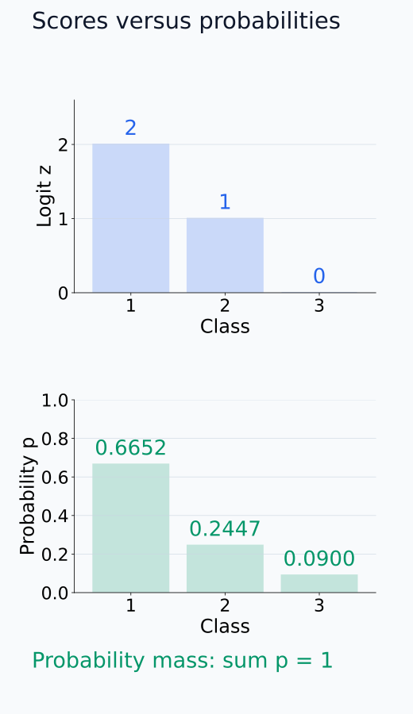
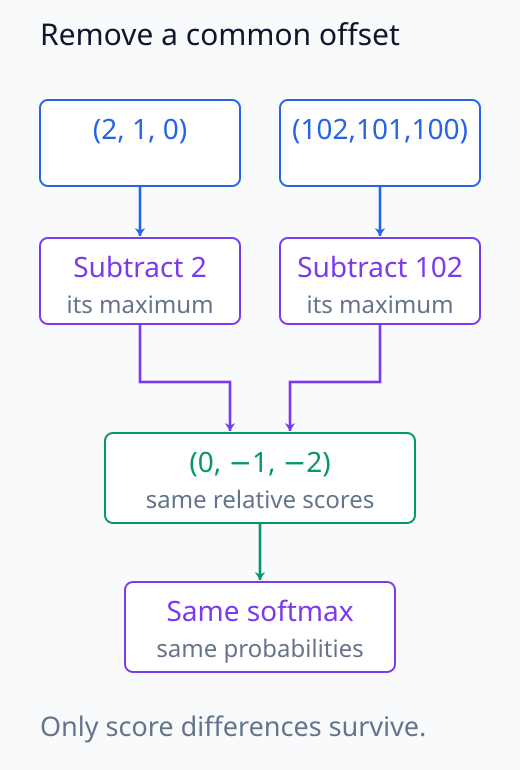
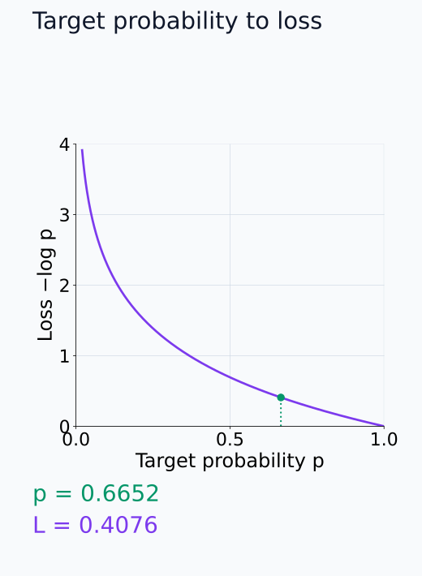
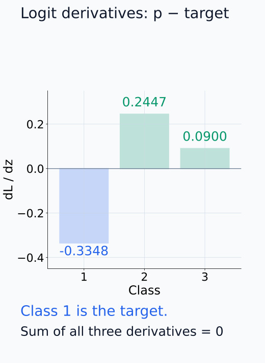
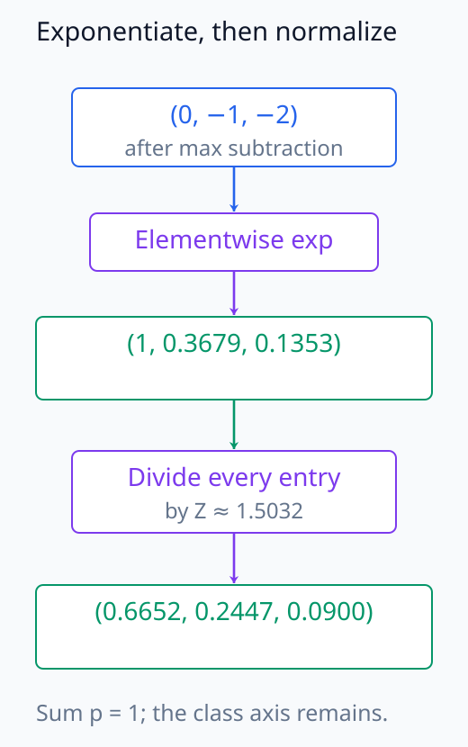
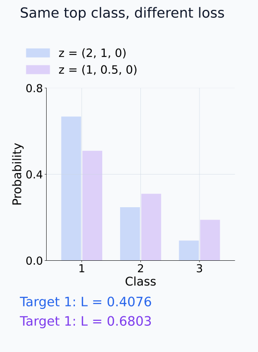
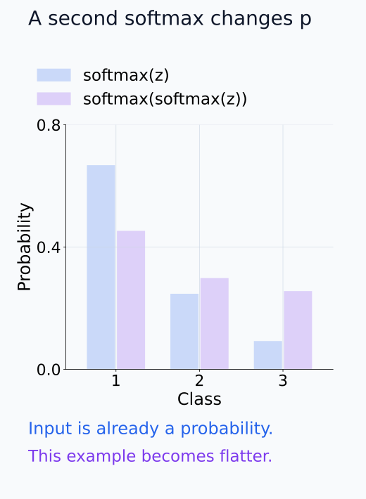

# N05-05. logits, softmax와 cross entropy

## 이 단원이 필요한 이유

분류기와 언어 모델의 마지막 층은 각 class나 token에 실수 점수를 낸다. 이 점수가 logit이다. softmax는 logit vector를 합이 1인 분포로 바꾸고, cross entropy는 target에 부여한 확률을 scalar loss로 바꾼다.

세 계산을 섞으면 확률과 점수를 혼동하거나 softmax를 두 번 적용하기 쉽다. 이 단원은 $[2,1,0]$이라는 logit vector 하나로 안정화, 확률, loss와 gradient를 끝까지 계산한다.

## 학습 목표

이 단원을 마치면 다음을 할 수 있다.

- logit과 probability를 구분할 수 있다.
- max subtraction을 사용해 stable softmax를 계산할 수 있다.
- one-hot target의 cross entropy를 negative log probability로 계산할 수 있다.
- softmax cross-entropy의 logit gradient를 계산할 수 있다.
- 출력 분포 차이와 내부 계산 차이를 구분할 수 있다.

## 선수지식 확인

- 선수 단원: [N05-04 activation function과 gating](N05-04-activation-functions-gating.md)
- 선수 단원: [M04-12 entropy와 cross entropy](../../part-1-foundations/M04/M04-12-entropy-cross-entropy.md)
- 확인 질문: $e^{a+c}=e^ce^a$를 사용할 수 있는가?
- 확인 질문: $-\log p$가 $p$가 작을수록 커지는 이유를 설명할 수 있는가?

## 기호와 용어

| 기호·용어 | Common spoken reading | 의미 | shape·범위 |
|---|---|---|---|
| $\mathbf z$ | `z` | class별 logit vector | $\mathbb R^K$ |
| $z_k$ | `z sub k` | class $k$의 logit | $\mathbb R$ |
| $p_k$ | `p sub k` | softmax가 정한 class $k$의 확률 | $(0,1)$ |
| $\operatorname{softmax}(\mathbf z)_k$ | `softmax of z, component k` | softmax 출력의 $k$번째 성분 | $(0,1)$ |
| $y$ | `y` | 정답 class index | $\{1,\ldots,K\}$ |
| $\mathcal L$ | `script L` | 한 sample의 cross-entropy loss | $[0,\infty)$ |
| $\mathbf e_y$ | `e sub y` | target class 위치만 1인 one-hot vector | $\{0,1\}^K$ |

## 핵심 개념 1. logit은 정규화 전 점수다

여기서는 $K\ge2$이고 모든 logit이 유한한 실수인 경우를 다룬다. logit $z_k$에는 합이 1이라는 제약이 없다. 음수도 가능하고 모든 logit에 같은 상수를 더해도 class 순서는 바뀌지 않는다. softmax는

\[
p_k
=\operatorname{softmax}(\mathbf z)_k
=\frac{e^{z_k}}{\sum_{j=1}^{K}e^{z_j}}
\]

로 probability를 만든다. 각 $p_k$는 양수이고 $\sum_k p_k=1$이다.

두 class의 비를 취하면 공통 분모가 사라져 $p_k/p_j=e^{z_k-z_j}$다. 따라서 $z_k-z_j=\log(p_k/p_j)$이며 큰 logit은 상대적으로 큰 확률을 받는다. 한 logit의 숫자 자체가 확률인 것이 아니라 class 사이의 점수 차이가 확률 비를 정한다. batch에서는 이 정규화를 각 sample의 class axis에 따로 적용한다.

아래 두 막대 그래프의 세로축을 먼저 구분한 뒤 같은 class의 값을 비교한다.

<figure class="lesson-figure" markdown="1">

<figcaption>위쪽은 logit (2, 1, 0), 아래쪽은 같은 vector의 softmax 확률이다. 두 세로축의 단위가 다르며, 합이 1이라는 제약은 아래 확률에만 적용된다.</figcaption>

</figure>

## 핵심 개념 2. max subtraction은 확률을 바꾸지 않는다

$m=\max_j z_j$를 모든 logit에서 빼면

\[
\frac{e^{z_k-m}}{\sum_j e^{z_j-m}}
=\frac{e^{-m}e^{z_k}}{e^{-m}\sum_j e^{z_j}}
=\frac{e^{z_k}}{\sum_j e^{z_j}}
\]

이다. 공통 factor가 분자와 분모에서 약분된다. 가장 큰 shifted logit은 0이 되므로 exponentiation에서 불필요하게 큰 수를 만들지 않는다.

같은 이유로 임의의 scalar $c$에 대해

\[
\operatorname{softmax}(\mathbf z+c\mathbf 1)
=\operatorname{softmax}(\mathbf z)
\]

이다. softmax는 logit의 공통 offset보다 상대적 차이에 반응한다.

max subtraction 뒤 모든 지수값은 1 이하이고 적어도 하나는 1이다. 매우 작은 지수값의 underflow까지 없애는 것은 아니므로, 수학적으로 양수인 확률도 유한 정밀도 계산에서는 0으로 반올림될 수 있다. target 확률을 먼저 계산한 뒤 로그를 취하는 것보다 다음 절의 loss를 shifted logit과 log-sum-exp로 직접 계산하는 편이 이 문제를 줄인다.

아래 합류 경로에서 공통 offset을 제거하면 두 입력이 같은 shifted logit으로 모인다.

<figure class="lesson-figure" markdown="1">

<figcaption>두 vector는 공통 offset 100만 다르다. 각각 최댓값 2와 102를 빼면 같은 shifted logit (0, −1, −2)이 되므로 이후 softmax와 loss가 같다.</figcaption>

</figure>

## 핵심 개념 3. cross entropy는 target의 log probability를 본다

target class가 $y$인 one-hot 문제에서는

\[
\mathcal L=-\log p_y
\]

이다. 이를 logit으로 쓰면

\[
\mathcal L
=-z_y+\log\sum_{j=1}^{K}e^{z_j}
\]

이다. 첫 항은 target logit을 높일수록 loss를 낮추고, 둘째 항은 모든 class의 logit을 함께 정규화한다.

one-hot target을 cross entropy의 합에 넣으면 target 위치의 항만 남아 $-\log p_y$가 된다. 여기에 softmax를 대입하고 로그의 몫을 차로 바꾸면 위의 두 항을 얻는다. target logit을 바꿀 때에는 정규화 항도 함께 변하므로 첫 항만으로 전체 변화량을 판단하지 않는다.

$m=\max_jz_j$를 사용하면 같은 loss를 $(m-z_y)+\log\sum_j e^{z_j-m}$로 계산할 수 있다. target이 가장 큰 class여도 나머지 class에 확률이 남아 있으므로 유한 logit에서 loss는 0보다 크다. 정답 여부와 target 확률을 평가하는 loss가 다르다는 뜻이다.

아래 곡선에서 target probability에 대응하는 높이가 loss다.

<figure class="lesson-figure" markdown="1">

<figcaption>target의 확률을 가로축에 놓으면 loss는 −log p 곡선 위의 높이다. 예제의 p₁ ≈ 0.6652에서는 loss ≈ 0.4076이며, target이 argmax여도 유한 logit에서는 loss가 0이 아니다.</figcaption>

</figure>

## 핵심 개념 4. gradient는 probability에서 target을 뺀다

softmax와 one-hot cross entropy를 합성하면 각 logit의 derivative는

\[
\frac{\partial\mathcal L}{\partial z_k}
=p_k-\mathbb 1[k=y]
\]

이다. vector로 쓰면

\[
\nabla_{\mathbf z}\mathcal L=\mathbf p-\mathbf e_y
\]

이다. target 위치의 gradient는 음수이고 다른 위치는 양수다. logit 자체를 독립적인 변수로 두고 gradient descent를 하면 target logit을 올리고 다른 logit을 내리는 방향으로 움직인다.

정규화 항의 미분은 $e^{z_k}/\sum_j e^{z_j}=p_k$이고 $-z_y$의 미분은 target 위치에서만 $-1$이다. 두 미분을 더하면 위의 식이 된다. 성분 합은 $\sum_kp_k-1=0$이므로 공통 offset 방향의 변화에 loss가 반응하지 않는 성질과도 맞는다.

실제 학습에서는 logit이 아니라 공유된 신경망 parameter를 바꾼다. 이 gradient는 parameter까지 chain rule로 전달되는 시작값이며, 한 parameter가 여러 logit에 영향을 줄 수 있다. 따라서 이 부호만으로 update 뒤 모든 sample의 target logit이 반드시 오를 것이라고 주장하지 않는다.

아래 막대에서 0 기준선과 target 위치를 함께 확인한다.

<figure class="lesson-figure" markdown="1">

<figcaption>첫째 class의 미분값 −0.3348과 다른 class의 양수 미분값을 0 기준선에서 비교한다. logit 자체를 독립 변수로 내려가는 경우에는 이 미분의 반대 방향으로 움직인다. 실제 parameter update는 추가 chain rule을 거친다.</figcaption>

</figure>

## 예제 1. $[2,1,0]$의 stable softmax

### 문제

$\mathbf z=(2,1,0)$의 softmax probability를 계산하라.

### 풀이

최댓값 2를 빼면 $(0,-1,-2)$이다. exponentiation과 합은

\[
(1,e^{-1},e^{-2})\approx(1,0.3679,0.1353),
\qquad
Z\approx1.5032
\]

이다. 따라서

\[
\mathbf p\approx(0.6652,0.2447,0.0900)
\]

이다.

### 결과의 의미

첫 class가 가장 큰 확률을 받지만 확률 1은 아니다. logit 차이가 다른 class에 남기는 probability mass를 정한다.

아래 계산 경로는 class index를 유지하면서 공통 합으로 나누는 순서를 보여 준다.

<figure class="lesson-figure" markdown="1">

<figcaption>shifted logit의 각 위치를 지수화하고, 세 값을 모두 더한 Z ≈ 1.5032로 각각 나눈다. 첫째 class가 최대여도 다른 class의 지수값이 남아 p₁은 1이 아니다.</figcaption>

</figure>

## 예제 2. loss와 gradient

target이 첫 class라면

\[
\mathcal L=-\log(0.6652)\approx0.4076
\]

이다. one-hot vector는 $(1,0,0)$이므로

\[
\nabla_{\mathbf z}\mathcal L
\approx(-0.3348,0.2447,0.0900)
\]

이다. 세 gradient의 합은 0이다. 모든 logit에 같은 값을 더하는 방향으로는 softmax probability와 loss가 변하지 않기 때문이다.

## 실행 실습

### 실행 환경과 원본

- 환경: Python 3.12, PyTorch 2.13.0 CPU, NumPy 2.5.3
- 확인일: 2026-10-01
- 구성요소 등급: `Stable core`
- 예제 ID: `n05_05_softmax_cross_entropy`
- 코드 원본: `labs/N05/n05_05_softmax_cross_entropy.py`
- 테스트: `tests/N05/test_n05_05.py`
- 실행 명령: `.venv\Scripts\python.exe -m labs.N05.n05_05_softmax_cross_entropy`

### 자원 예산

예제는 class 3개의 logit vector 하나를 사용한다. 학습 parameter와 training step은 0이고 hard timeout은 10초다.

### 실제 코드와 실행 결과

site build는 아래 위치에 원본 코드와 실제 실행 결과를 삽입한다.

<!-- N05_EXAMPLE: n05_05_softmax_cross_entropy -->

### 수치와 gradient 검사

테스트는 probability의 합, loss, logit gradient와 translation invariance를 확인한다. 원래 logit과 100을 더한 logit의 softmax 결과가 같은지도 비교한다.

## 모델 해석과의 연결

언어 모델의 다음 token 분석에서는 vocabulary 전체의 logit을 다룬다. 특정 token의 logit 변화와 probability 변화는 같지 않다. 한 token의 probability는 다른 모든 token의 logit에도 의존한다.

두 prompt가 같은 top-1 token을 내더라도 logit margin과 분포는 다를 수 있다. 출력 행동을 비교할 때는 argmax, target logit, logit difference, probability와 loss 중 어떤 quantity를 측정했는지 명시해야 한다.

아래 두 분포의 최대 class와 target 확률을 따로 비교한다.

<figure class="lesson-figure" markdown="1">

<figcaption>비교용 두 logit (2, 1, 0)과 (1, 0.5, 0)은 모두 첫째 class가 최대다. 그러나 첫째 target의 loss는 약 0.4076과 0.6803으로 다르므로, argmax 일치와 분포 일치를 구분한다.</figcaption>

</figure>

## 흔한 오해

### 오해 1. 가장 큰 logit은 probability다

logit은 정규화 전 실수 점수다. softmax를 적용한 뒤에만 합이 1인 probability를 얻는다.

### 오해 2. softmax 전에 probability를 넣어야 한다

softmax는 logit을 입력으로 받는다. 이미 합이 1인 값을 다시 softmax에 넣으면 분포를 다른 분포로 바꾼다.

아래 좌우 막대는 한 번의 softmax와 두 번의 softmax를 구분한다.

<figure class="lesson-figure" markdown="1">

<figcaption>각 class의 왼쪽 파란 막대는 원래 확률, 오른쪽 보라 막대는 그 확률 vector를 다시 softmax에 넣은 결과다. 두 번째 연산은 원래 logit을 재사용하지 않으며 이 예제의 class 간 차이를 줄여 다른 분포를 만든다.</figcaption>

</figure>

### 오해 3. cross entropy와 accuracy는 같은 지표다

accuracy는 argmax가 target과 같은지 본다. cross entropy는 target에 준 probability를 연속적인 값으로 평가한다. 예측 class가 같아도 confidence가 다르면 loss가 달라진다.

## 연습문제

### 1. 같은 상수 더하기

$(2,1,0)$과 $(7,6,5)$의 softmax가 같은 이유를 식으로 설명하라.

해설 보기

둘째 vector는 첫 vector의 모든 성분에 5를 더한 것이다. exponentiation 뒤 생기는 공통 factor $e^5$가 분자와 분모에서 약분되므로 probability가 같다.

### 2. 균일 logit

$K$개 logit이 모두 0이면 softmax probability와 target 하나의 cross entropy는 얼마인가?

해설 보기

각 probability는 $1/K$이다. loss는 $-\log(1/K)=\log K$다.

### 3. gradient 부호

target class $y$의 probability가 0.8일 때 $\partial\mathcal L/\partial z_y$를 구하라.

해설 보기

$p_y-1=0.8-1=-0.2$다. gradient descent update는 이 logit을 높이는 방향으로 움직인다.

### 4. logit 차이

두 class 문제에서 $z_1-z_2$가 커지면 $p_1$은 어떻게 변하는가?

해설 보기

$p_1=1/(1+e^{z_2-z_1})$이므로 $z_1-z_2$가 커지면 $p_1$이 증가한다. 공통 offset은 영향을 주지 않는다.

### 5. 측정량 선택

개입 전후에 정답 token의 순위는 그대로지만 probability가 0.7에서 0.4로 줄었다. “출력이 변하지 않았다”라고 보고해도 되는가?

해설 보기

top-1 token은 같지만 분포는 변했다. 측정량을 구분해 “argmax는 유지됐고 target probability는 0.3 감소했다”라고 보고해야 한다.

### 6. 주장 비판

두 모델의 target probability가 같으므로 내부 표현도 같다는 결론을 평가하라.

해설 보기

결론이 따르지 않는다. 서로 다른 logit vector와 내부 계산이 같은 target probability를 낼 수 있다. 내부 표현의 동일성은 activation 정렬과 추가 분석으로 검사해야 한다.

## 단원 요약

- logit은 정규화 전 점수이고 softmax output은 probability다.
- max subtraction은 softmax 값을 유지하면서 exponentiation 범위를 줄인다.
- one-hot cross entropy는 target class의 negative log probability다.
- logit gradient는 $\mathbf p-\mathbf e_y$다.
- 출력 분포가 같아도 내부 표현이 같다는 결론은 나오지 않는다.

## 통과 기준

다음 질문에 자료를 보지 않고 답할 수 있으면 통과한다.

- logit과 probability를 구분할 수 있는가?
- stable softmax를 손으로 계산할 수 있는가?
- target probability에서 cross entropy를 계산할 수 있는가?
- logit gradient의 부호를 해석할 수 있는가?
- argmax, logit과 probability 측정의 차이를 설명할 수 있는가?

## 다음 단원

- [N05-06 backpropagation](N05-06-backpropagation.md)

## 집필자 점검표

- [x] 학습 목표가 관찰 가능한 행동으로 작성됐다.
- [x] logit과 probability를 구분했다.
- [x] stable softmax의 불변성을 유도했다.
- [x] loss와 logit gradient를 검산했다.
- [x] 모든 문제에 해설이 있다.
- [x] 모델 해석 주장의 강도를 구분했다.
- [x] 용어집과 표기 규칙을 따랐다.
- [x] Common spoken reading이 실제 영어 학술 발화이며 한글 음역이나 기계적 직역을 포함하지 않는다.
- [x] 선수지식 밖의 내용을 몰래 요구하지 않는다.
- [x] 내부 링크와 수식 렌더링을 확인했다.
- [x] Markdown에 실행 코드를 손으로 복제하지 않았다.
- [x] 코드 원본·테스트 경로·자원 예산·확인일을 기록했다.
- [x] shape·수치·gradient test가 있다.
