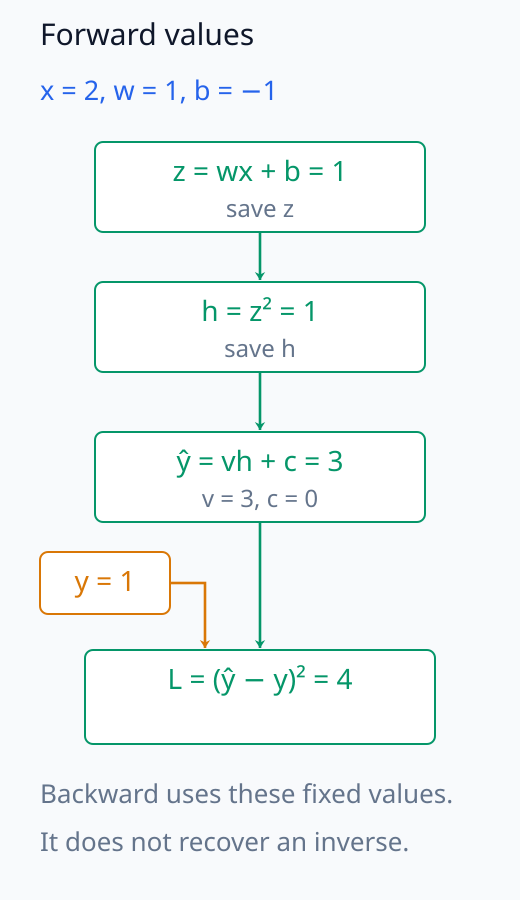
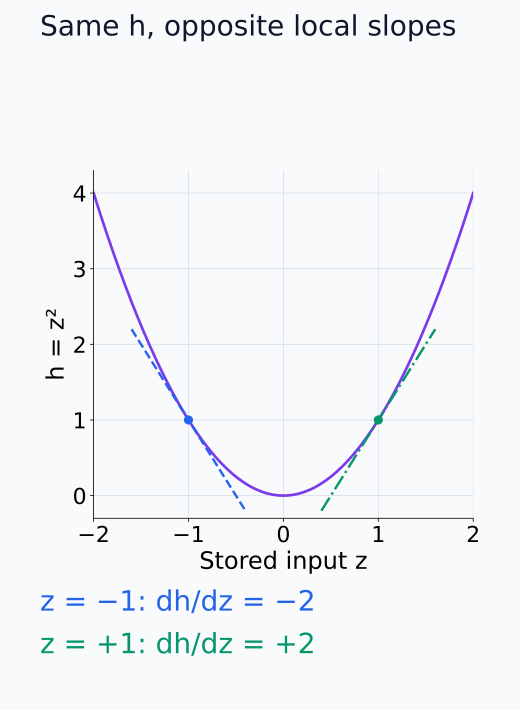
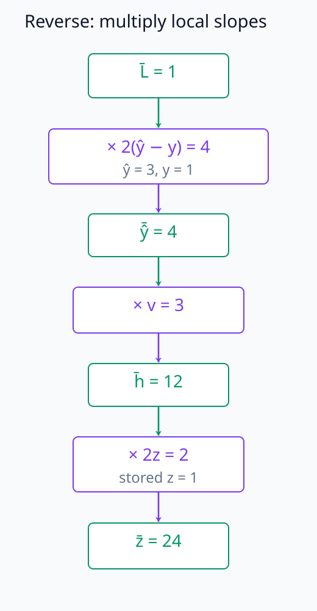
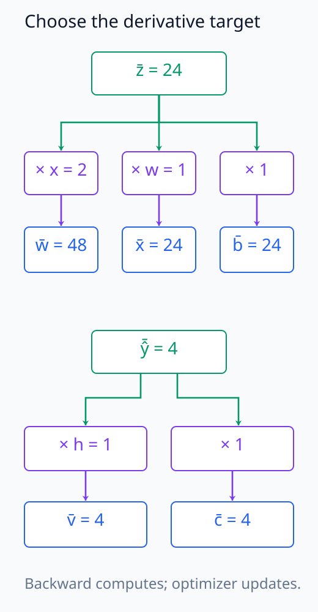
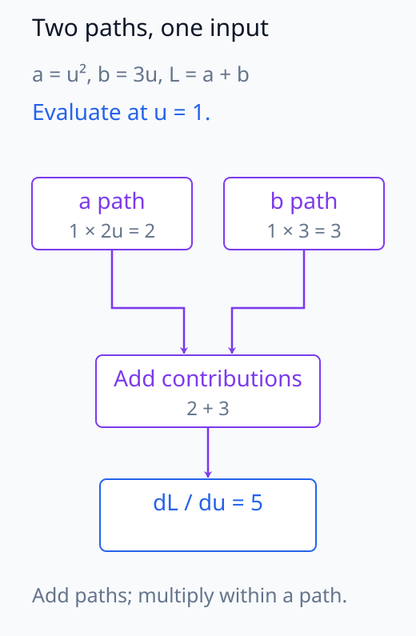
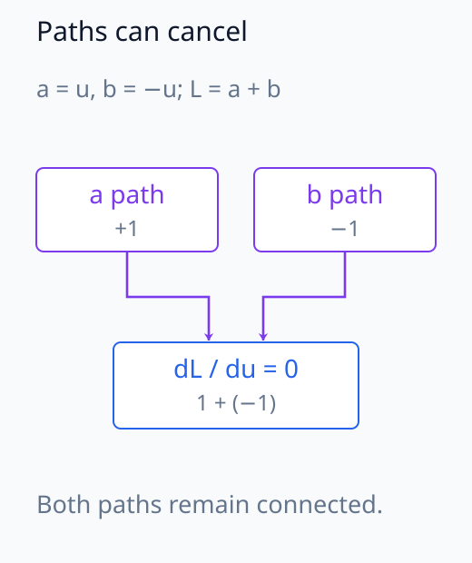
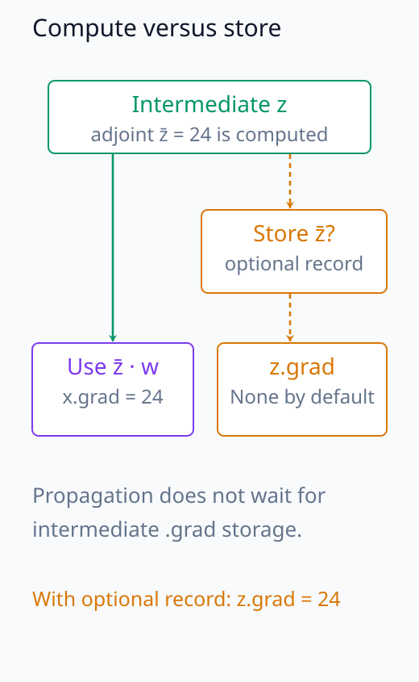
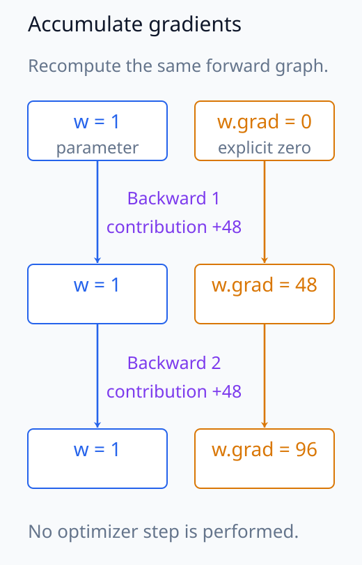

# N05-06. backpropagation

## 이 단원이 필요한 이유

loss 하나가 수백만 parameter에 의존해도 각 경로는 작은 연산의 합성으로 이루어진다. backpropagation은 scalar loss에서 시작한 derivative를 계산 그래프의 역순으로 전달한다. 각 node는 forward에서 저장한 값과 자신의 local derivative를 사용한다.

이 단원에서는 scalar graph 하나를 손으로 미분하고 PyTorch autograd 결과와 대조한다. 목표는 optimizer update보다 앞선 단계인 gradient 계산을 분리해서 이해하는 것이다.

## 학습 목표

이 단원을 마치면 다음을 할 수 있다.

- forward graph의 intermediate value를 순서대로 계산할 수 있다.
- upstream gradient와 local derivative를 곱해 gradient를 전달할 수 있다.
- 한 값이 여러 경로에 쓰일 때 gradient를 합해야 하는 이유를 설명할 수 있다.
- leaf tensor와 intermediate tensor의 gradient 저장 차이를 설명할 수 있다.
- backpropagation과 parameter update를 구분할 수 있다.

## 선수지식 확인

- 선수 단원: [N05-05 logits, softmax와 cross entropy](N05-05-logits-softmax-cross-entropy.md)
- 선수 단원: [M03-14 자동미분과 역전파](../../part-1-foundations/M03/M03-14-automatic-differentiation-backpropagation.md)
- 확인 질문: 합성함수의 chain rule을 scalar 식에 적용할 수 있는가?
- 확인 질문: partial derivative와 total derivative를 구분할 수 있는가?

## 기호와 용어

| 기호·용어 | Common spoken reading | 의미 | shape·범위 |
|---|---|---|---|
| $x$ | `x` | scalar 입력 | $\mathbb R$ |
| $w,b,v,c$ | `w, b, v, and c` | 계산 그래프의 parameter | $\mathbb R$ |
| $z$ | `z` | 첫 affine 연산의 intermediate value | $\mathbb R$ |
| $h$ | `h` | square activation 뒤의 intermediate value | $\mathbb R$ |
| $\hat y$ | `y hat` | prediction | $\mathbb R$ |
| $\mathcal L$ | `script L` | squared-error loss | $[0,\infty)$ |
| $\bar z$ | `z bar` | $\partial\mathcal L/\partial z$를 줄여 쓴 adjoint | $\mathbb R$ |
| VJP | `V J P` | vector-Jacobian product | reverse-mode의 기본 연산 |

## 핵심 개념 1. forward pass가 값을 저장한다

다음 scalar graph를 사용한다.

\[
z=wx+b,
\qquad
h=z^2,
\qquad
\hat y=vh+c,
\qquad
\mathcal L=(\hat y-y)^2
\]

forward pass는 $z$, $h$, $\hat y$와 $\mathcal L$을 순서대로 계산한다. backward pass는 local derivative에 필요한 forward 값을 사용한다. 예를 들어 $h=z^2$의 local derivative $2z$를 평가하려면 forward에서 얻은 $z$가 필요하다.

backward는 출력값에서 입력값을 복원하는 역함수 계산이 아니다. 이미 계산한 입력과 parameter의 같은 평가점에서 미분값을 구한다. $h=z^2$는 $z$의 부호를 잃지만, forward의 $z$가 남아 있으면 local derivative의 부호를 정확히 정할 수 있다. forward 값과 연결 정보를 함께 사용하는 이유다.

아래 그림에서 forward 값과 loss target의 합류를 추적한다.

<figure class="lesson-figure" markdown="1">

<figcaption>예제의 x = 2, w = 1, b = −1, v = 3, c = 0을 순서대로 사용한다. forward 값 z = 1과 h = 1은 숫자가 같아도 다른 연산의 결과이며, backward에서 서로 다른 local derivative를 정한다.</figcaption>

</figure>

아래 그림에서 같은 h에 대응하는 두 입력의 tangent를 비교한다.

<figure class="lesson-figure" markdown="1">

<figcaption>z = −1과 z = 1은 모두 h = 1을 만들지만 tangent의 기울기는 −2와 2다. backward는 h에서 z를 복원하는 대신 저장된 z를 2z에 대입해 local derivative를 정한다.</figcaption>

</figure>

## 핵심 개념 2. reverse mode는 loss에서 입력 방향으로 간다

loss에서 시작하면

\[
\frac{\partial\mathcal L}{\partial\hat y}
=2(\hat y-y)
\]

이다. 한 단계 앞의 $h$에는

\[
\frac{\partial\mathcal L}{\partial h}
=\frac{\partial\mathcal L}{\partial\hat y}
\frac{\partial\hat y}{\partial h}
=\frac{\partial\mathcal L}{\partial\hat y}v
\]

가 전달된다. 이어서

\[
\frac{\partial\mathcal L}{\partial z}
=\frac{\partial\mathcal L}{\partial h}
\frac{\partial h}{\partial z}
=\frac{\partial\mathcal L}{\partial h}2z
\]

이다. 각 단계는 upstream gradient와 local derivative의 곱이다.

scalar loss 자체에 대한 미분값 1을 시작값으로 두고 역순으로 진행한다. upstream gradient는 현재 값의 변화가 최종 loss에 얼마나 전달되는지, local derivative는 이 연산 바로 앞의 변화가 현재 값에 얼마나 전달되는지를 나타낸다. 둘을 곱하면 한 단계 더 앞의 변화가 loss에 미치는 일차 효과를 얻는다. forward 식을 역으로 풀지 않고 미분의 의존 관계를 거슬러 계산하는 것이다.

아래 그림에서 local derivative를 곱하며 loss의 미분값을 전달한다.

<figure class="lesson-figure" markdown="1">

<figcaption>loss seed 1에서 시작해 local derivative 2(ŷ − y) = 4, v = 3, 2z = 2를 차례로 곱한다. node에 표시한 4, 12, 24는 forward 값이 아니라 loss에 대한 미분값이다.</figcaption>

</figure>

## 핵심 개념 3. parameter와 입력 gradient

$z=wx+b$에서

\[
\frac{\partial z}{\partial w}=x,
\qquad
\frac{\partial z}{\partial x}=w,
\qquad
\frac{\partial z}{\partial b}=1
\]

이다. 따라서

\[
\frac{\partial\mathcal L}{\partial w}=\bar z x,
\qquad
\frac{\partial\mathcal L}{\partial x}=\bar z w,
\qquad
\frac{\partial\mathcal L}{\partial b}=\bar z
\]

이다. backpropagation은 parameter와 입력 양쪽의 gradient를 계산할 수 있다. optimizer는 이 가운데 학습 대상으로 등록한 parameter gradient를 사용해 값을 갱신한다.

둘째 affine 연산도 같은 방식으로 $\partial\mathcal L/\partial v=(\partial\mathcal L/\partial\hat y)h$, $\partial\mathcal L/\partial c=\partial\mathcal L/\partial\hat y$를 얻는다. 이 계산에서는 target $y$를 고정한다. 미분 대상이 입력인지 parameter인지가 local derivative를 정하며, optimizer에 등록했는지가 이후 update 대상을 정한다. 입력 gradient를 계산했다고 입력 sample을 자동으로 학습시키는 것은 아니다.

아래 그림에서 미분 대상마다 다른 local factor를 선택한다.

<figure class="lesson-figure" markdown="1">

<figcaption>z̄ = 24에서는 w·x·b로 미분하는 세 갈래가, ŷ̄ = 4에서는 v·c로 미분하는 두 갈래가 생긴다. 입력 x의 미분값도 계산하지만, optimizer에 등록한 parameter만 이후 update 대상이다.</figcaption>

</figure>

## 핵심 개념 4. 갈라진 경로의 gradient는 더한다

한 node $u$가 두 후속 계산 $a(u)$와 $b(u)$에 쓰이고 loss가 둘 모두에 의존하면

\[
\frac{d\mathcal L}{du}
=\frac{\partial\mathcal L}{\partial a}\frac{da}{du}
+\frac{\partial\mathcal L}{\partial b}\frac{db}{du}
\]

이다. reverse-mode autodiff는 각 outgoing path에서 돌아온 기여를 같은 node에 누적한다. residual connection의 backward 계산도 이 합 규칙을 따른다.

$u$를 조금 바꾸면 $a$와 $b$가 동시에 바뀐다. loss의 일차 변화는 각 후속 값의 변화에 따른 기여를 더한 것이므로 두 경로 중 하나를 선택하거나 두 derivative를 곱하면 안 된다. 기여의 부호가 반대이면 서로 상쇄될 수도 있다. 따라서 합산 gradient가 0인 것과 후속 경로 자체가 없는 것은 다르다.

아래 그림에서 경로마다 곱한 기여를 같은 입력에서 더한다.

<figure class="lesson-figure" markdown="1">

<figcaption>u = 1에서 a = u², b = 3u, L = a + b인 작은 계산이다. 각 경로의 upstream 미분값 1에 local derivative를 곱해 2와 3을 얻고, 같은 u의 미분값으로 돌아온 두 기여를 더한다.</figcaption>

</figure>

아래 그림에서 두 경로의 부호가 상쇄되는 위치를 확인한다.

<figure class="lesson-figure" markdown="1">

<figcaption>상쇄를 보기 위해 a = u, b = −u, L = a + b로 두었다. 각 경로의 미분값은 1과 −1로 남지만 합은 0이다. 경로가 사라진 경우와 기여가 상쇄된 경우를 구분한다.</figcaption>

</figure>

## 예제 1. forward 값 계산

### 문제

$x=2$, $w=1$, $b=-1$, $v=3$, $c=0$, $y=1$일 때 모든 intermediate value와 loss를 계산하라.

### 풀이

\[
z=1\cdot2-1=1,
\qquad
h=1^2=1
\]

이고

\[
\hat y=3\cdot1+0=3,
\qquad
\mathcal L=(3-1)^2=4
\]

이다.

### 결과의 의미

backward 계산 전에 forward 값이 고정됐다. 같은 graph라도 forward 입력이나 parameter가 바뀌면 local derivative의 평가값도 달라진다.

## 예제 2. backward 값 계산

loss에서 시작하면

\[
\bar{\hat y}=2(3-1)=4
\]

이다. 차례로

\[
\bar h=4\cdot3=12,
\qquad
\bar z=12\cdot2\cdot1=24
\]

를 얻는다. leaf 값의 gradient는

\[
\bar w=24\cdot2=48,
\quad
\bar x=24\cdot1=24,
\quad
\bar b=24,
\quad
\bar v=4\cdot1=4,
\quad
\bar c=4
\]

이다.

## 실행 실습

### 실행 환경과 원본

- 환경: Python 3.12, PyTorch 2.13.0 CPU, NumPy 2.5.3
- 확인일: 2026-10-01
- 구성요소 등급: `Stable core`
- 예제 ID: `n05_06_backpropagation`
- 코드 원본: `labs/N05/n05_06_backpropagation.py`
- 테스트: `tests/N05/test_n05_06.py`
- 실행 명령: `.venv\Scripts\python.exe -m labs.N05.n05_06_backpropagation`

### 자원 예산

예제는 scalar tensor와 parameter 4개를 사용한다. optimizer와 training step은 없고 hard timeout은 10초다.

### 실제 코드와 실행 결과

site build는 아래 위치에 원본 코드와 실제 실행 결과를 삽입한다.

<!-- N05_EXAMPLE: n05_06_backpropagation -->

### forward와 gradient 검사

테스트는 $z=1$, $h=1$, $\hat y=3$, $\mathcal L=4$를 먼저 확인한다. 그다음 intermediate gradient와 $x,w,b,v,c$의 gradient를 손계산 값에 대조한다. 코드가 실행됐다는 사실과 derivative가 맞다는 사실을 별도 assertion으로 검사한다.

## PyTorch에서 intermediate gradient 보기

`requires_grad=True`인 leaf tensor는 backward 뒤 `.grad`를 가진다. intermediate tensor는 graph 연결에 gradient가 필요해도 기본적으로 `.grad`를 보존하지 않는다. 예제는 교육용 확인을 위해 `retain_grad()`를 $z$, $h$와 $\hat y$에 호출한다.

실제 모델에서 모든 intermediate gradient를 보존하면 memory 사용량이 커진다. 분석할 layer와 token을 먼저 정하고 필요한 tensor만 수집해야 한다.

아래 그림에서 미분 전달과 선택적 저장의 경로를 구분한다.

<figure class="lesson-figure" markdown="1">

<figcaption>z의 미분값을 계산해 입력 쪽으로 전달하는 실선과, z.grad에 값을 남기는 선택을 분리했다. 기본 동작에서 z.grad가 None이어도 backward 계산은 진행된다. retain_grad()는 이 중간 미분값의 저장을 요청한다.</figcaption>

</figure>

## 모델 해석과의 연결

gradient attribution은 선택한 scalar output이 input이나 activation에 얼마나 민감한지를 local derivative로 측정한다. gradient가 0이면 현재 입력점의 일차 변화가 0이라는 뜻이다. component가 모든 입력에서 쓸모없다는 결론은 아니다.

gradient는 model parameter, forward input과 선택한 target scalar에 의존한다. 분석 보고서에는 어느 logit이나 logit difference를 backward 시작점으로 삼았는지 기록해야 한다.

## 흔한 오해

### 오해 1. backward를 호출하면 parameter가 갱신된다

backward는 gradient를 계산하고 `.grad`에 누적한다. parameter update는 optimizer의 `step()`이 수행한다.

### 오해 2. `.grad`는 호출할 때마다 자동으로 0이 된다

PyTorch는 leaf gradient를 누적한다. 반복 학습에서는 다음 backward 전에 gradient를 지우는 단계가 필요하다.

아래 그림에서 parameter 값과 .grad 누적 값을 따로 읽는다.

<figure class="lesson-figure" markdown="1">

<figcaption>w.grad를 0으로 둔 상태에서 예제의 forward 계산을 다시 만들어 같은 미분 기여 48을 두 번 더한다고 하자. 중간에 gradient를 지우지 않으면 w.grad는 48에서 96으로 누적된다. optimizer step이 없으므로 parameter w = 1은 그대로다.</figcaption>

</figure>

### 오해 3. 큰 gradient는 큰 인과 효과를 보장한다

gradient는 현재 점의 infinitesimal perturbation에 대한 일차 민감도다. 큰 finite intervention, nonlinear saturation과 분포 밖 입력에서는 실제 변화가 선형 근사와 다를 수 있다.

## 연습문제

### 1. forward 재계산

예제에서 $x$만 3으로 바꾸면 $z,h,\hat y,\mathcal L$은 얼마인가?

해설 보기

$z=1\cdot3-1=2$, $h=4$, $\hat y=12$, $\mathcal L=(12-1)^2=121$이다.

### 2. local derivative

$h=z^2$에서 $z=-2$일 때 $dh/dz$를 구하라.

해설 보기

$dh/dz=2z$이므로 $-4$다. $h$의 값은 4지만 derivative의 부호는 음수다.

### 3. upstream gradient

$\partial\mathcal L/\partial h=5$이고 $h=z^2$, $z=3$이라면 $\partial\mathcal L/\partial z$는 얼마인가?

해설 보기

upstream gradient 5에 local derivative $2z=6$을 곱하므로 30이다.

### 4. 경로 합산

$a=u^2$, $b=3u$, $\mathcal L=a+b$일 때 $d\mathcal L/du$를 구하라.

해설 보기

$a$ 경로는 $2u$, $b$ 경로는 3을 기여한다. 두 경로를 더해 $d\mathcal L/du=2u+3$이다.

### 5. gradient accumulation

같은 graph에서 `backward()`를 두 번 호출해 각 호출이 $w$에 4를 기여했고 중간에 gradient를 지우지 않았다. 마지막 `w.grad`는 얼마인가?

해설 보기

PyTorch가 leaf gradient를 누적하므로 8이다. 두 번째 계산만 원했다면 이전 gradient를 지워야 한다.

### 6. 주장 비판

한 입력에서 activation gradient가 0이므로 해당 neuron은 모델에 필요 없다는 결론을 평가하라.

해설 보기

현재 입력과 target scalar에서 local gradient가 0이라는 사실만 확인했다. 다른 입력, finite intervention과 경로 상호작용을 검사하지 않고 neuron 전체의 필요성을 결론낼 수 없다.

## 근거와 갱신 경계

계산 그래프의 역방향 미분은 [Learning representations by back-propagating errors](https://www.nature.com/articles/323533a0)의 고전적 구성과 reverse-mode automatic differentiation을 따른다. 이 단원은 scalar graph와 PyTorch의 공개 autograd 동작을 다루며 특정 optimizer나 대규모 모델 구현을 전제하지 않는다.

## 단원 요약

- forward pass는 backward의 local derivative에 필요한 intermediate value를 만든다.
- reverse mode는 scalar loss에서 graph의 역순으로 gradient를 전달한다.
- 각 edge에서는 upstream gradient와 local derivative를 곱한다.
- 한 node로 돌아오는 여러 경로의 gradient는 더한다.
- backward의 gradient 계산과 optimizer의 parameter update는 별도 단계다.

## 통과 기준

다음 질문에 자료를 보지 않고 답할 수 있으면 통과한다.

- scalar graph의 forward 값을 순서대로 계산할 수 있는가?
- upstream gradient와 local derivative를 구분할 수 있는가?
- 예제의 모든 leaf gradient를 손으로 계산할 수 있는가?
- 갈라진 경로에서 gradient를 더하는 이유를 설명할 수 있는가?
- local gradient 관찰의 주장 범위를 제한할 수 있는가?

## 다음 단원

- [N05-07 gradient descent와 mini-batch](N05-07-gradient-descent-mini-batch.md)

## 집필자 점검표

- [x] 학습 목표가 관찰 가능한 행동으로 작성됐다.
- [x] forward 값과 backward gradient를 구분했다.
- [x] upstream gradient와 local derivative를 연결했다.
- [x] 경로 합산과 gradient accumulation을 설명했다.
- [x] 모든 문제에 해설이 있다.
- [x] 모델 해석 주장의 강도를 구분했다.
- [x] 용어집과 표기 규칙을 따랐다.
- [x] Common spoken reading이 실제 영어 학술 발화이며 한글 음역이나 기계적 직역을 포함하지 않는다.
- [x] 선수지식 밖의 내용을 몰래 요구하지 않는다.
- [x] 내부 링크와 수식 렌더링을 확인했다.
- [x] Markdown에 실행 코드를 손으로 복제하지 않았다.
- [x] 코드 원본·테스트 경로·자원 예산·확인일을 기록했다.
- [x] shape·수치·gradient test가 있다.
