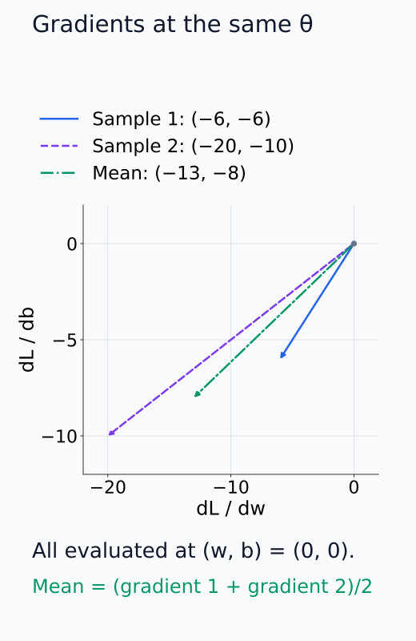
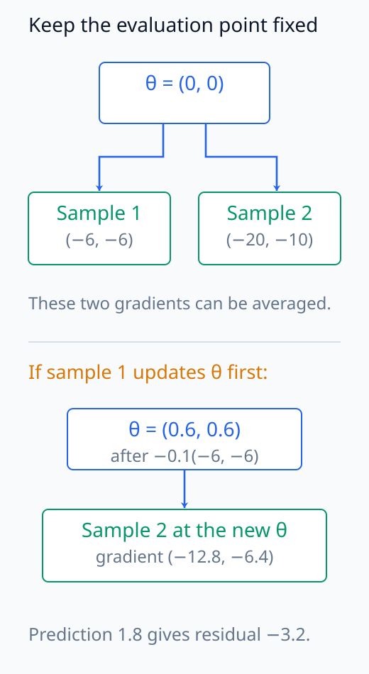
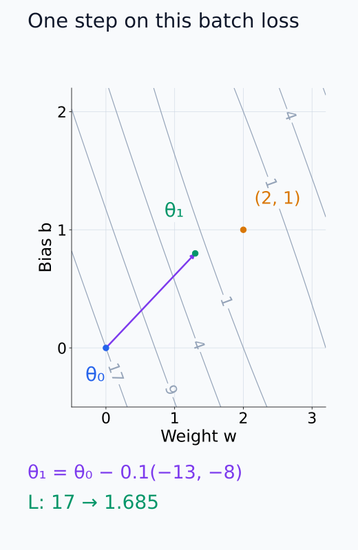
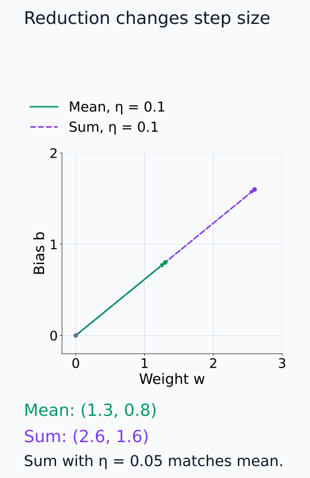
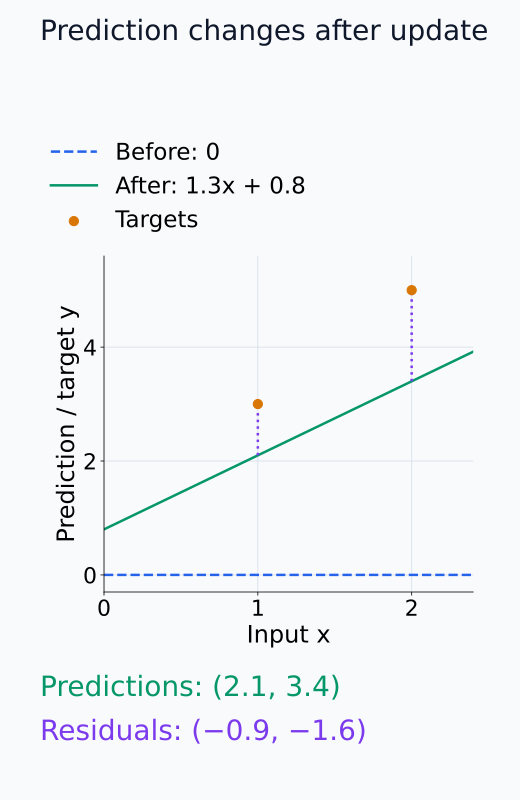
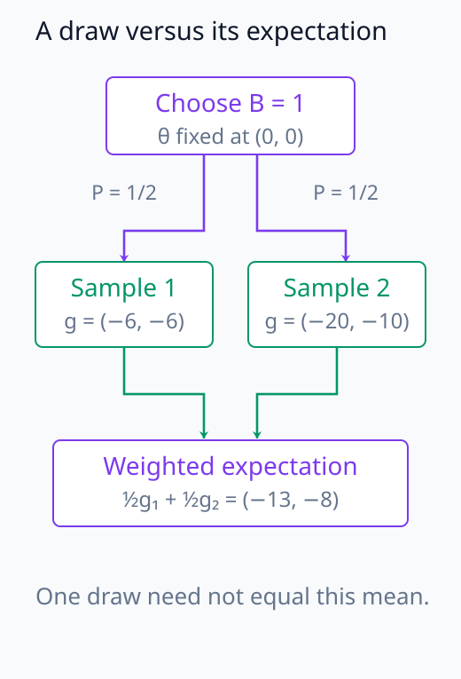

# N05-07. gradient descent와 mini-batch

## 이 단원이 필요한 이유

backpropagation은 현재 parameter에서 loss gradient를 계산한다. 학습은 그 gradient로 parameter를 갱신하고 새 batch에서 계산을 반복한다. 전체 dataset 대신 일부 sample을 고르면 계산량이 줄지만 update마다 다른 gradient를 얻는다.

이 단원은 sample 두 개의 mean squared error를 계산한다. per-sample gradient의 평균이 mini-batch gradient와 같음을 확인하고 gradient descent step 하나를 적용한다.

## 학습 목표

이 단원을 마치면 다음을 할 수 있다.

- empirical risk와 mini-batch loss를 식으로 구분할 수 있다.
- mean reduction에서 batch gradient를 계산할 수 있다.
- learning rate를 적용해 parameter를 한 step 갱신할 수 있다.
- sum과 mean reduction이 gradient scale에 미치는 영향을 설명할 수 있다.
- batch sampling, seed와 data order를 재현성 기록에 포함할 수 있다.

## 선수지식 확인

- 선수 단원: [N05-06 backpropagation](N05-06-backpropagation.md)
- 선수 단원: [M04-06 표본, 모집단과 표본분포](../../part-1-foundations/M04/M04-06-samples-populations-sampling-distributions.md)
- 확인 질문: scalar loss의 parameter gradient를 계산할 수 있는가?
- 확인 질문: sample 값의 산술평균을 구할 수 있는가?

## 기호와 용어

| 기호·용어 | Common spoken reading | 의미 | shape·범위 |
|---|---|---|---|
| $\theta$ | `theta` | 학습할 parameter vector | $\mathbb R^P$ |
| $\ell_i(\theta)$ | `ell sub i of theta` | sample $i$의 loss | $[0,\infty)$ |
| $\mathcal B_t$ | `script B sub t` | step $t$에서 선택한 mini-batch index 집합 | $\lvert\mathcal B_t\rvert=B$ |
| $L_{\mathcal B_t}$ | `L sub script B sub t` | mini-batch mean loss | scalar |
| $\eta$ | `eta` | learning rate | $\eta>0$ |
| $g_t$ | `g sub t` | step $t$의 mini-batch gradient | $\mathbb R^P$ |

## 핵심 개념 1. 전체 평균과 mini-batch 평균

$N$개 sample의 empirical risk는

\[
L(\theta)=\frac{1}{N}\sum_{i=1}^{N}\ell_i(\theta)
\]

이다. step $t$에서 $B$개 index만 선택하면

\[
L_{\mathcal B_t}(\theta)
=\frac{1}{B}\sum_{i\in\mathcal B_t}\ell_i(\theta)
\]

를 계산한다. mini-batch gradient는

\[
g_t=\nabla_\theta L_{\mathcal B_t}(\theta_t)
=\frac{1}{B}\sum_{i\in\mathcal B_t}\nabla_\theta\ell_i(\theta_t)
\]

이다. 미분의 선형성 때문에 mean loss의 gradient는 per-sample gradient의 평균과 같다.

평균에 들어가는 모든 미분값은 같은 $\theta_t$에서 평가한다. sample 하나를 본 뒤 parameter를 바꾸고 다음 sample의 gradient를 계산하면 서로 다른 점의 미분값을 얻으므로 위의 평균과 같지 않다. 또한 여기서는 각 sample의 loss가 다른 sample에 의존하지 않는 경우를 다룬다. batch 안 sample을 함께 사용하는 loss에는 그 계산의 의존 관계를 반영해야 한다.

아래 그림에서 두 sample의 미분값과 그 평균을 같은 성분 축으로 비교한다.

<figure class="lesson-figure" markdown="1">

<figcaption>각 vector의 성분 순서는 (w, b)의 미분값이다. 모두 (w, b) = (0, 0)에서 구한 두 vector (−6, −6), (−20, −10)의 성분별 평균이 (−13, −8)이다. parameter 공간의 이동량을 그린 그림은 아니다.</figcaption>

</figure>

아래 그림에서 평가점을 유지한 경우와 먼저 update한 경우를 구분한다.

<figure class="lesson-figure" markdown="1">

<figcaption>두 sample의 mean을 구할 때에는 둘 다 θ = (0, 0)을 사용한다. 비교 경로에서 sample 1의 gradient로 η = 0.1 update를 먼저 하면 θ = (0.6, 0.6)이 되어 sample 2의 미분값은 (−12.8, −6.4)로 달라진다.</figcaption>

</figure>

## 핵심 개념 2. gradient descent update

가장 단순한 update는

\[
\theta_{t+1}=\theta_t-\eta g_t
\]

이다. gradient는 현재 점에서 loss의 일차 증가가 가장 큰 방향이므로 음의 방향으로 이동한다. learning rate $\eta$는 이동 크기를 조절한다.

현재 batch를 고정하면 일차 근사에서 loss 변화는 $g_t^\top(\theta_{t+1}-\theta_t)=-\eta\|g_t\|_2^2$다. $g_t\ne0$일 때 이 값은 음수이지만 실제 loss에는 고차 변화도 남는다. update의 길이는 $\eta\|g_t\|_2$이므로 같은 learning rate라도 gradient 크기에 따라 이동 거리가 다르다.

한 batch에서 loss가 줄었다고 전체 dataset의 loss도 줄었다고 보장할 수 없다. gradient는 현재 parameter와 선택한 batch에서 계산됐고, 큰 step에서는 일차 근사가 맞지 않을 수 있다.

아래 그림에서 loss 등고선과 실제 parameter 이동을 함께 읽는다.

<figure class="lesson-figure" markdown="1">

<figcaption>격자 위 화살표는 gradient vector가 아니라 −0.1g = (1.3, 0.8)인 실제 update다. 회색 선은 이 batch의 같은 loss 높이이며, 주황 점 (2, 1)은 두 target에 맞는 parameter다. 한 step은 그 점까지 한 번에 가지 않는다.</figcaption>

</figure>

## 핵심 개념 3. mean과 sum reduction

mean 대신 sample loss를 합치면

\[
L^{\mathrm{sum}}_{\mathcal B_t}
=\sum_{i\in\mathcal B_t}\ell_i,
\qquad
\nabla L^{\mathrm{sum}}_{\mathcal B_t}=B g_t
\]

이다. 같은 learning rate를 사용하면 batch size가 update scale에 직접 들어간다. 실험을 재현할 때 loss definition과 reduction을 함께 기록해야 한다.

같은 batch의 단순 gradient descent 한 step에서는 sum loss의 learning rate를 mean loss 때의 $1/B$로 줄이면 동일한 update가 된다. 이는 같은 sample과 같은 평가점을 비교한 관계다. batch 구성을 바꾸거나 optimizer가 과거 gradient를 사용하면 reduction의 배율만 맞추었다고 전체 학습 경로가 같아지는 것은 아니다.

아래 그림에서 같은 출발점에서 reduction에 따른 두 이동 길이를 비교한다.

<figure class="lesson-figure" markdown="1">

<figcaption>동일한 두 sample과 초기값에서 sum gradient는 mean의 2배다. 따라서 η = 0.1이면 이동량도 2배이고, sum의 η를 0.05로 낮추면 이 한 step의 endpoint가 mean과 같아진다.</figcaption>

</figure>

## 예제 1. 두 sample의 gradient

### 문제

모형 $\hat y=wx+b$에서 $(x,y)=(1,3),(2,5)$를 mini-batch로 사용한다. 초기값은 $w=b=0$이고 loss는 squared error의 평균이다. loss와 gradient를 계산하라.

### 풀이

초기 prediction은 $(0,0)$이고 residual은 $(-3,-5)$이다.

\[
L=\frac{(-3)^2+(-5)^2}{2}=17
\]

sample별 $w$ gradient는 $2(\hat y-y)x$이므로 $(-6,-20)$이다. $b$ gradient는 $2(\hat y-y)$이므로 $(-6,-10)$이다. 평균을 내면

\[
\frac{\partial L}{\partial w}=-13,
\qquad
\frac{\partial L}{\partial b}=-8
\]

이다.

## 예제 2. 한 step update

$\eta=0.1$이면

\[
w_1=0-0.1(-13)=1.3,
\qquad
b_1=0-0.1(-8)=0.8
\]

이다. 새 prediction은 $(2.1,3.4)$이고 같은 batch의 새 loss는

\[
\frac{(2.1-3)^2+(3.4-5)^2}{2}=1.685
\]

이다. 이 step에서는 batch loss가 17에서 1.685로 줄었다.

아래 그림에서 고정된 target과 새 prediction 사이의 residual을 확인한다.

<figure class="lesson-figure" markdown="1">

<figcaption>target 두 점은 그대로 두고 예측 선만 0에서 1.3x + 0.8로 바꿨다. 보라 점선은 새 prediction과 target 사이의 간격이며, residual은 (−0.9, −1.6)이 되어 같은 batch의 loss가 1.685가 된다.</figcaption>

</figure>

## 실행 실습

### 실행 환경과 원본

- 환경: Python 3.12, PyTorch 2.13.0 CPU, NumPy 2.5.3
- 확인일: 2026-10-01
- 구성요소 등급: `Stable core`
- 예제 ID: `n05_07_minibatch_gradient_descent`
- 코드 원본: `labs/N05/n05_07_minibatch_gradient_descent.py`
- 테스트: `tests/N05/test_n05_07.py`
- 실행 명령: `.venv\Scripts\python.exe -m labs.N05.n05_07_minibatch_gradient_descent`

### 자원 예산

예제는 batch 2, scalar input, parameter 2개와 update 1회를 사용한다. hard timeout은 10초다.

### 실제 코드와 실행 결과

site build는 아래 위치에 원본 코드와 실제 실행 결과를 삽입한다.

<!-- N05_EXAMPLE: n05_07_minibatch_gradient_descent -->

### 수치와 gradient 검사

테스트는 per-sample gradient의 평균과 autograd가 계산한 batch gradient를 비교한다. update 뒤 $w=1.3$, $b=0.8$과 loss 1.685도 손계산 값에 대조한다.

## sampling과 재현성

mini-batch gradient를 전체 gradient의 estimate로 해석하려면 sampling scheme을 명시해야 한다. 현재 parameter를 고정하고 $N$개 sample 중 크기 $B$의 부분집합을 균등하게 새로 뽑으면 각 sample의 포함 확률은 $B/N$이다. 평균 gradient의 기댓값을 취할 때 이 확률과 $1/B$가 곱해져 full-data gradient의 $1/N$ 가중치가 된다. 특정 batch의 값이 같다는 뜻은 아니다. class-balanced sampling, sequence packing과 중복 sample은 다른 estimand를 만들 수 있다.

seed만 기록해도 충분하지 않다. dataset version, sample order, sampler 설정, batch size와 reduction을 함께 저장해야 같은 update sequence를 재생할 수 있다.

아래 그림에서 한 번의 sampling 결과와 기댓값을 분리해 읽는다.

<figure class="lesson-figure" markdown="1">

<figcaption>예제의 두 sample에서 B = 1로 하나를 균등하게 고른 경우다. 실제 한 번의 gradient는 두 vector 중 하나지만, 포함 확률 1/2로 가중한 기댓값은 두 sample 전체의 mean gradient와 같다.</figcaption>

</figure>

## 모델 해석과의 연결

per-example gradient는 어떤 training example이 현재 parameter update에 기여하는지 분석하는 재료다. gradient similarity나 influence 근사는 parameter 위치, loss definition과 checkpoint에 의존한다.

한 batch에서 큰 gradient를 낸 sample을 전체 학습의 원인으로 부를 수 없다. 여러 step의 sampling과 optimizer state가 실제 trajectory를 결정한다.

## 흔한 오해

### 오해 1. mini-batch gradient는 full gradient와 같다

특정 batch의 gradient는 sampling 조건에 따른 full gradient의 estimate다. dataset 전체를 batch로 사용하면 값이 일치한다. 부분집합에서도 평균이 우연히 같을 수 있지만 일반적으로 보장되지는 않는다.

### 오해 2. batch size를 바꿔도 update가 같다

mean reduction은 직접적인 $B$ 배율을 제거하지만 gradient noise와 sample 구성이 달라진다. sum reduction은 gradient scale도 $B$에 따라 달라진다.

### 오해 3. 한 step에서 loss가 줄면 학습이 성공했다

현재 batch의 즉시 감소만 확인했다. 다른 batch, validation data와 후속 step의 안정성을 따로 검사해야 한다.

## 연습문제

### 1. mean gradient

두 sample의 scalar gradient가 4와 10이면 mean-reduced batch gradient는 얼마인가?

해설 보기

$(4+10)/2=7$이다.

### 2. sum reduction

앞 문제에서 sum-reduced gradient는 얼마인가?

해설 보기

$4+10=14$다. mean gradient의 batch size 2배다.

### 3. update 방향

$\theta=3$, $g=-4$, $\eta=0.2$일 때 다음 parameter를 구하라.

해설 보기

$\theta'=3-0.2(-4)=3.8$이다. 음의 gradient에서는 parameter가 증가한다.

### 4. batch size 1

$B=1$이면 mini-batch gradient는 무엇과 같은가?

해설 보기

선택한 sample 하나의 gradient와 같다. full-data gradient와 같다는 뜻은 아니다.

### 5. 재현성 기록

seed와 batch size만 기록한 학습을 정확히 재생할 수 없는 이유 두 가지를 적어라.

해설 보기

dataset version과 sample order 또는 sampler 구현이 다를 수 있다. loss reduction, preprocessing과 checkpoint 상태도 update를 바꾼다.

### 6. 주장 비판

한 sample의 gradient norm이 가장 크므로 최종 모델 행동을 그 sample이 만들었다는 결론을 평가하라.

해설 보기

한 checkpoint의 local gradient norm만으로 전체 training trajectory의 인과 기여를 정할 수 없다. sample이 선택된 step, 다른 gradient와 optimizer state, 후속 update를 함께 봐야 한다.

## 단원 요약

- mini-batch mean gradient는 batch 안 per-sample gradient의 평균이다.
- gradient descent는 negative gradient 방향으로 parameter를 갱신한다.
- sum과 mean reduction은 batch size에 따른 gradient scale이 다르다.
- batch loss의 한 step 감소는 전체 학습 성공을 보장하지 않는다.
- 재현에는 data order와 sampler를 포함한 update sequence 정보가 필요하다.

## 통과 기준

다음 질문에 자료를 보지 않고 답할 수 있으면 통과한다.

- full-data loss와 mini-batch loss를 구분할 수 있는가?
- per-sample gradient에서 batch gradient를 계산할 수 있는가?
- learning rate를 적용해 update를 계산할 수 있는가?
- mean과 sum reduction의 차이를 설명할 수 있는가?
- mini-batch gradient에 근거한 주장의 범위를 제한할 수 있는가?

## 다음 단원

- [N05-08 momentum, AdamW와 optimizer state](N05-08-momentum-adamw-optimizer-state.md)

## 집필자 점검표

- [x] 학습 목표가 관찰 가능한 행동으로 작성됐다.
- [x] full-data와 mini-batch loss를 구분했다.
- [x] mean과 sum reduction을 구분했다.
- [x] update 전후 수치와 gradient를 검산했다.
- [x] 모든 문제에 해설이 있다.
- [x] 모델 해석 주장의 강도를 구분했다.
- [x] 용어집과 표기 규칙을 따랐다.
- [x] Common spoken reading이 실제 영어 학술 발화이며 한글 음역이나 기계적 직역을 포함하지 않는다.
- [x] 선수지식 밖의 내용을 몰래 요구하지 않는다.
- [x] 내부 링크와 수식 렌더링을 확인했다.
- [x] Markdown에 실행 코드를 손으로 복제하지 않았다.
- [x] 코드 원본·테스트 경로·자원 예산·확인일을 기록했다.
- [x] shape·수치·gradient test가 있다.
